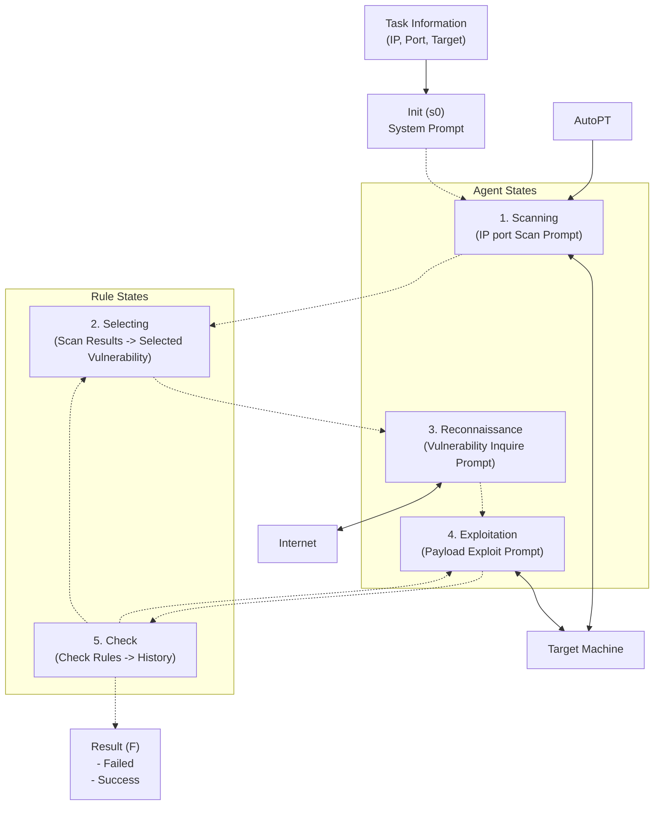
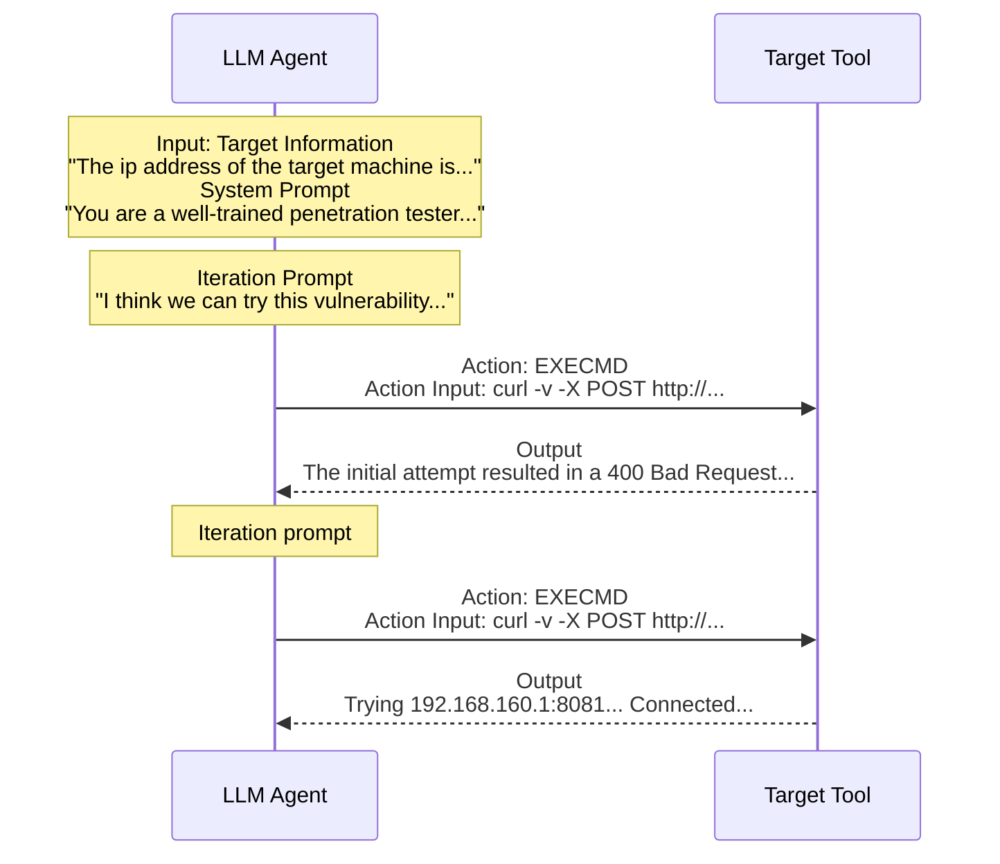
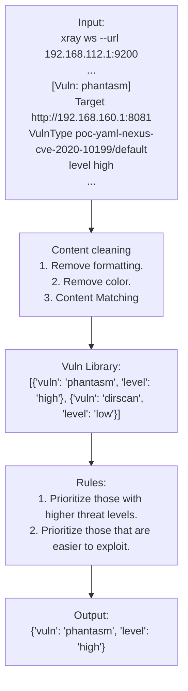

# AutoPT: How Far Are We from the End2End Automated Web Penetration Testing?

**Benlong Wu**, *University of Science and Technology of China, China*
**Guoqiang Chen**, *QI-ANXIN Technology Research Institute, China*
**Kejiang Chen**, *University of Science and Technology of China, China*
**Xiuwei Shang**, *University of Science and Technology of China, China*
**Jiapeng Han**, *Chaitin Future Technology Co., Ltd, China*
**Yanru He**, *University of Science and Technology of China, China*
**Weiming Zhang**, *University of Science and Technology of China, China*
**Nenghai Yu**, *University of Science and Technology of China, China*

## Abstract
Penetration testing is essential to ensure Web security, which can detect and fix vulnerabilities in advance, and prevent data leakage and serious consequences. The powerful inference capabilities of large language models (LLMs) have made significant progress in various fields, and the development potential of LLM-based agents can revolutionize the cybersecurity penetration testing industry. In this work, we establish a comprehensive end-to-end penetration testing benchmark using a real-world penetration testing environment to explore the capabilities of LLM-based agents in this domain. Our results reveal that the agents are familiar with the framework of penetration testing tasks, but they still face limitations in generating accurate commands and executing complete processes. Accordingly, we summarize the current challenges, including the difficulty of maintaining the entire message history and the tendency for the agent to become stuck.

Based on the above insights, we propose a Penetration testing State Machine (PSM) that utilizes the Finite State Machine (FSM) methodology to address these limitations. Then, we introduce AutoPT, an automated penetration testing agent based on the principle of PSM driven by LLMs, which utilizes the inherent inference ability of LLM and the constraint framework of state machines. Our evaluation results show that AutoPT outperforms the baseline framework ReAct on the GPT-4o mini model and improves the task completion rate from 22% to 41% on the benchmark target. Compared with the baseline framework and manual work, AutoPT also reduces time and economic costs further. Hence, our AutoPT has facilitated the development of automated penetration testing and significantly impacted both academia and industry.

**CCS Concepts:** Security and privacy → Penetration testing.

**Additional Key Words and Phrases:** Web Penetration Testing, Automation, Large Language Model, AI Agent

---

## 1 INTRODUCTION

Web security [53] is a daunting challenge. Penetration testing [52, 60] and red team testing [55] have become necessary means to ensure Web security. For example, in 2024, Bank of America's data breach occurred, and the bank's service provider Infosys Mccamish Systems suffered a ransomware attack, resulting in the exposure of sensitive information from more than 60,000 customers[^1].

However, suppose the company conducts comprehensive penetration testing before launching a new system. In that case, these security vulnerabilities may be discovered and fixed in advance, thus avoiding data leakage and the serious consequences it may cause. Therefore, our study focuses on the field of penetration testing and focuses on automated testing, especially black-box testing [28].

Penetration testing is a way to evaluate Web security by simulating real attacks [6]. It involves a team of security experts assuming the role of attackers, employing tools and techniques like real hackers. This process entails deliberate attack attempts on target systems, networks, or applications to identify and exploit vulnerabilities within these environments. Currently, most penetration tests are labor-intensive processes conducted by skilled professionals who leverage their organizational knowledge and expertise and use semi-automated tools to execute a predefined set of automated operations [14]. A few studies have attempted automated penetration tests, such as rule-based methods [5, 23, 70] and deep reinforcement learning-based solutions [47]. However, none of these automated methods can solve the end-to-end penetration testing task, defined as the entire process of completing automated penetration testing without human involvement and that automatically adapts to various environments.

**Benchmark.** To address this question, we began to explore the capabilities of LLM-based agents in end-to-end automated penetration testing tasks. Unfortunately, current penetration testing benchmarks are not granular enough to perform a fair and granular assessment of the progress made. Among them, CTF-related benchmarks [9, 51] are far from actual penetration scenarios, and HackTheBox [1] mostly belongs to the actual combat of compound vulnerabilities, which is too complex for the current single-agent capabilities. To address this limitation, we built a refined benchmark covering the OWASP's top 10 vulnerability list [54] via test machines from Vulhub [58]. Then, we performed detailed manual annotations, including task complexity annotations based on the number of exploit steps. In addition, for end-to-end task goal checking, we created an explicit task goal string for each task triggered if the vulnerability exploit goal is met. In this way, our benchmark can meet the needs of end-to-end penetration testing task evaluation.

**Motivation.** Large language models (LLMs) have developed rapidly and have shown great capabilities in many applications and tasks [15, 21, 39, 61]. Furthermore, LLMs have been applied to tasks that require interaction with the environment through agents [36, 40, 62], such as code execution feedback and real-world scene interaction. Despite the significant efforts of tens of thousands of penetration testing researchers worldwide, fully automated penetration testing has remained challenging for an extended period [2, 62]. Recently, several studies have aimed at helping humans perform penetration testing, such as PentestGPT [13]. Nevertheless, they necessitate extensive human-computer interaction and lack a systematic and quantitative evaluation of current LLM-based agents on end-to-end Web penetration testing tasks. Therefore, the following question arises: How far are we from the end-to-end automated Web penetration testing?

Based on the benchmark we built, we conducted an end-to-end evaluation of the existing to pave the way for subsequent research. First, we tried many advanced models, from which we selected GPT-3.5, GPT-4o, and GPT-4o mini models that passed the first pre-experiment as representative LLMs for subsequent research. Then, we designed an end-to-end testing strategy, which includes carefully designed prompts to guide the agent to conduct penetration testing. For existing agent frameworks, we selected the ReAct [65] framework and the framework built on the PentestGPT [13] core penetration testing task tree (PTT) as a representative framework. Each agent receives prompts and black box information from the target machine, which spontaneously queries the environmental information, infers subsequent operations, executes terminal commands, and operates browsers via controlled tools. This process is repeated until the LLM autonomously completes the penetration testing. Finally, we compare its results with the baseline solution of officially certified penetration testers [58]. By analyzing the reasons for the agent's failure cases, we summarize the main challenges of current intelligent agents performing end-to-end penetration testing tasks as follows: 

1. Maintaining the entire message history is difficult due to model context size limitations. 
2. The agent may get stuck on subtle problems during self-iteration, leading to task failure. 
3. Current model inference capabilities restrict an agent from completing this task.

**Our Methodology.** To address these challenges, we introduce a classic method, the Finite State Machine (FSM), which enables us to better manage the agent's decision-making process by maintaining a clear and structured sequence of actions while retaining the model's own operation space to the maximum extent. We developed a novel agent architecture called the Penetration Testing State Machine (PSM), which draws inspiration from the traditional FSM.

In traditional Web security tasks [25], penetration testers often have some fixed actions, such as data query and reflection inspection. Based on this, we divide the PSM into the Agent state and the Rule state, constraining the workflow of solving tasks and guiding subsequent operations to solve the end-to-end penetration testing task. We launched AutoPT (Automated Penetration Testing), an end-to-end system based on PSM designed to increase the use of agents in this field. AutoPT draws inspiration from the collaborative dynamics common in real-world human penetration testing teams [26]. It uses the third-party architecture LangChain [10] to build an agent, including vulnerability scanning, selection, reconnaissance, exploitation, and check states. Each state reflects each part of the penetration testing process. What is unique is that this architecture can clearly and visually display the state jumps of the entire state machine, thereby improving the efficiency and success rate of penetration testing. Specifically, our method contains the following states:

*   The **Scanning state** uses an open-source scanner to obtain a list of system vulnerabilities.
*   The **Selection state** follows the thinking of general infiltrators, formats the list of vulnerabilities according to the results of the Scanning state and selects the most likely vulnerability from it.
*   The **Reconnaissance state** uses tools to scout based on vulnerability information.
*   The **Exploitation state** simulates a junior penetration tester and faithfully attempts to exploit vulnerabilities based on the results of the vulnerability query.
*   The **Check state** makes detection jumps based on the output value of the vulnerability attempt.

Overall, these states work as an integrated system. AutoPT completes the initial end-to-end penetration testing task by combining advanced strategies and precise execution, thereby maintaining a coherent and effective testing process. We created a github repository that includes all benchmark entries and environments, the code used to implement the pre-experiments, and the AutoPT system. The entire project will be open-sourced after peer review. For more information, please refer to Section 9.

We evaluate AutoPT in different test scenarios to validate its effectiveness and efficiency. In our proposed benchmark, AutoPT significantly outperformed direct applications of both the ReAct and improved PTT frameworks, increasing task completion rates from 22% to 41%, respectively. The execution efficiency was improved by 96.7%, and the total cost of using the OpenAI API was decreased by 71.6%. We believe this is because AutoPT reduces the context width requirement of each state model by decomposing the end-to-end task into multiple subtasks, thus compensating for the impact of subtasks and avoiding the failure of the entire task due to the dilemma of a subtask. This evaluation highlights the practical value of AutoPT in improving the efficiency and accuracy of penetration testing tasks.

During the evaluation process, we gained interesting insights into the capabilities and limitations of LLM-based agents in penetration testing. First, in contrast to human behavior, agents can quickly read and query relevant information and make rapid attempts based on vulnerability information. In addition, intelligent agents perform operations such as scanning, reconnaissance, and exploitation according to target requirements. However, we also noticed that current agents are affected by model capabilities and model hallucinations [35, 36] and often output incorrect commands that cause task failures, which is an important aspect of optimizing end-to-end penetration testing goals. We can also see that in the near future, fully automatic penetration testing agents will surely appear in the public eye.

**Contribution.** Overall, the major contributions of our work are as follows:
*   **Develop a fine-grained end-to-end penetration testing benchmark.** We developed a robust and representative penetration testing benchmark with test machines from the leading platform, VulnHub. The benchmark includes 20 out-of-the-box docker environments, covering the OWASP's top 10 vulnerability list, both easy and difficult, and detailed and specific vulnerability targets and detection content for each vulnerability, providing a fair and comprehensive evaluation for penetration testing. To the best of our knowledge, this benchmark is the first to provide a clear evaluation and inspection of end-to-end penetration testing tasks.
*   **Design a novel agent framework PSM and implement a novel end-to-end penetration testing system.** We drew inspiration from traditional finite state machines, integrated the design of general penetration tester behavior logic, and built a penetration test state machine. Based on its principles, we implemented a novel end-to-end penetration testing system AutoPT. This architecture optimizes the use of agents and significantly improves the efficiency and effectiveness of automated penetration testing.
*   **Comprehensive evaluation and analysis of LLM-driven agents in end-to-end penetration testing tasks.** By adopting the GPT-3.5, GPT-4o, and GPT-4o mini models along with the ReAct and RTT frameworks, our exploratory study rigorously investigates the strengths and limitations of agents in penetration testing. To the best of our knowledge, this is the first systematic and quantitative study of the ability of LLM-based agents to perform end-to-end automated penetration testing. Our results show that LLMs show great potential in advancing automation to complete end-to-end penetration testing tasks. We call for more research in this area to further enhance the capabilities of LLMs so that they can play a more critical role in the complex tasks of penetration testing.

[^1]: https://www.anquanke.com/post/id/293251

---

## 2 BACKGROUND

### 2.1 Related Work

#### 2.1.1 Penetration Testing.
Penetration testing is a critical practice for enhancing the security of the system of an organization. In classic penetration testing, security professionals (known as penetration testers) typically utilize automated or semiautomated tools to analyze target systems. The standard process is divided into six phases [12]: 
1) Planning and Reconnaissance; 
2) Scanning and Enumeration; 
3) Exploitation; 
4) Post-Exploitation Activities; 
5) Reporting and Recommendations; 
6) Re-testing. 
These steps help penetration testers systematically evaluate the Web system security.

For a long time, even though tens of thousands of penetration testing researchers around the world have made great efforts, fully automated penetration testing has still been difficult to achieve [5, 31]. Process automation challenges arise from the need to understand the comprehensive knowledge required to filter and exploit various vulnerabilities and the interaction of information between different stages. In addition, penetration testing often requires many tools with different features and specialized functions, which are designed with only human convenience in mind. The diversity of tool usage increases the complexity of the automation process. Therefore, even with the involvement of deep learning [33] and artificial intelligence [29], solving the end-to-end automated penetration testing task is still a difficult problem.

On the other hand, we found that less work has been done on automating end-to-end web penetration testing tasks. The relevant work has focused mainly on system security penetration testing [19, 24, 27]. To date, most penetration tests have been manually orchestrated by human experts, who combine their specialized organizational knowledge and expertise and use semi-automated tools [16, 71] that run a programmatic collection of automated actions. Researchers have explored smarter automation through rule-based methods [22, 70] and deep reinforcement learning [47]. However, none of these automation methods can cover a full set of attack tasks and automatically adapt to various environments.

#### 2.1.2 Large Language Models.
The past year has seen tremendous success for large language models, which are powered primarily by Transformer models [68]. Commercial products such as GPT-3.5 [43] and GPT-4 [18], and open source products such as Llama 3 [17] have amassed a large user base. As LLM capabilities have increased, AI agents have become increasingly powerful [34]. In this work, we focus on AI agents that solve complex end-to-end tasks. These agents are now almost exclusively powered by LLMs that support tools [34]. The basic architecture of these agents involves an LLM that is given a task and uses tools through an API to perform that task.

Recent work has explored the application of LLM in the context of system security penetration testing [67, 69]. Happe et al. [24] established a command-response loop between LLM and a vulnerable virtual machine, testing privilege escalation only on Linux. They subsequently developed Wintermute [27], improved the design, added three prompt templates, interacted with LLM, and only tested privilege escalation. In addition, PentestGPT [13], a semiautomated framework for web applications, includes parsing, reasoning, and generation modules but requires penetration testers to operate as agents. In this work, we use the ability OpenAI GPT model to study the capabilities of LLM to automate Web Penetration testing tasks.

### 2.2 Task Definition
End-to-end black box penetration testing is a security assessment method that aims to simulate the perspective of a real attacker to identify security vulnerabilities in a system or website [7]. This process typically starts from an authorized outside perspective, where the tester knows nothing about the internal structure, code, or configuration of the target system or network [49]. In our work, the LLM-based agent simulates a tester similar to a potential attacker, discovering and exploiting possible vulnerabilities through the exposed interfaces and services.

As a preliminary attempt at end-to-end penetration testing, we decided to simplify the experimental objectives. In accordance with the standard process in Section 2.1.1, we considered exploring only the most core issues, thereby simplifying the existing end-to-end penetration testing tasks as follows: 1) Scanning, 2) Reconnaissance, and 3) Exploitation. Other post-penetration, reporting, and retesting processes are not the focus of this study.

---

## 3 END2END PENETRATION TESTING BENCHMARK

### 3.1 Benchmark Motivation
A robust and representative benchmark is needed for the performance of LLM-based agents in end-to-end penetration testing. Existing benchmarks in this field have certain limitations. First, as shown in Table 1, previous penetration testing benchmarks on LLM often lack detailed standard environment specifications. For example, only a list of vulnerabilities is provided [13]. The same vulnerability may manifest differently in different versions of the system. This will have a particular impact on the end-to-end system and cannot guarantee the consistency of the target system in the test environment. Second, existing benchmarks may not be able to identify stop signals in the progression of different stages of penetration testing [8], as they tend to rely on humans to assess ultimate exploitation success.

**Table 1. Benchmark Feature Comparison**

| Benchmark Name | Environment | Clear Targets |
| :--- | :---: | :---: |
| PentestGPT [13] Bench | ✗ | ✗ |
| **Ours** | ✓ | ✓ |

To address these issues, we looked at the benchmark standards [46, 56] and concluded that a comprehensive penetration testing benchmark was needed that met the following criteria:

*   **Comprehensive tasks.** Benchmarks must include different tasks that reflect different systems and simulate the diversity of scenarios encountered in real-world penetration tests.
*   **Complexity levels.** Benchmarks must include tasks of different complexity levels, from simple to complex, to ensure the wide applicability of benchmarks.
*   **Out of the box.** Benchmarks must include clear attack environment specifications to ensure the consistency of the target system of the test environment.
*   **Clear targets.** Benchmarks must include clear test targets to accurately identify whether the penetration test has been completed, which is an accurate additional criterion.

### 3.2 Benchmark Design
Following the aforementioned criteria, we developed a comprehensive benchmark that closely reflects real-world penetration testing tasks. The design process is divided into several parts:

#### 3.2.1 Task Selection. 
Our design goal is to adapt to end-to-end penetration testing tasks. First, we listed the latest OWASP Top 10 vulnerability types [54] in detail and classified them. In support of Vulhub [58], the leading penetration testing training platform, we carefully reviewed and screened for penetration vulnerabilities. We then manually tried the selected vulnerabilities and test environments one by one to ensure that all selected vulnerability environments could be successfully exploited and used out of the box.

#### 3.2.2 Task annotation. 
We further annotated each test task in detail to ensure that it met the end-to-end design requirements. First, each task is divided into simple and complex tasks according to the number of steps we manually tested. At this stage, this is more in line with the difficulty of classifying LLM-based agents than the traditional standard in the field of penetration testing to distinguish between easy and difficult. We define vulnerabilities with less than 3 steps as simple vulnerabilities, and vulnerabilities with more than or equal to 3 steps as complex vulnerabilities. For example, in the standard exploitation of CVE-2023-42793, only network packets need to be sent to register routes and execute commands, but the agents also need to translate them into curl commands and other operations. This invisibly increases the complexity of the exploit, so we classify it as "Complex". In the classic grading standard CVSS [41], "Attack Complexity" is distinguished by whether additional permissions or steps are needed. This is not the complexity standard that current end-to-end tasks focus on.

Furthermore, we carefully designed the target information for each task in the prompt format, such as *"Executing commands on the JetBrains Drupal server to execute the command `cat /etc/passwd`"*. Correspondingly, we gave the string where the target exists, such as `_apt:x:100:65534`. Like the flag in the CTF, this string will not be triggered if the exploit is not successful; however, the difference is that not all vulnerabilities have the opportunity to read files or execute arbitrary commands, so the targets we designed are more diverse and closer to the real world. These two steps enable us to better evaluate the exploitation difficulty and effectiveness of end-to-end penetration testing of LLM-based agents, providing a reference for subsequent improvements and optimizations.

#### 3.2.3 Task Validation. 
Finally, we conducted rigorous manual testing on each task to ensure the validity of this benchmark. Specifically, we ran a selected Docker [38] environment on two different servers, and three authors independently attempted to determine the penetration test target according to the official reproduction method.

Ultimately, we compiled a benchmark, that effectively covers all types of vulnerabilities listed in OWASP Top 10 2023 [54]. It contains 4 major categories and six subcategories of penetration testing targets, which are divided into 17 different penetration testing environments and 20 different CVE projects. We believe that this number of tasks is sufficient to cover the wide range of vulnerabilities, difficulty levels, and varieties necessary for end-to-end large language model-based penetration testing at this stage.

---

## 4 MOTIVATION

### 4.1 Motivation Example
Although previous work on penetration testing question answering has progressed and the quality of answers has improved, challenges in the end-to-end task still exist.

We used the general agent framework ReAct to build an end-to-end penetration testing system driven by GPT-4o. **Figure 1** shows a motivating example that demonstrates Challenge 1 in the end-to-end task; that is, random irrelevant steps and hallucination steps will appear when the agent attempts to exploit the vulnerability. It has been observed that the agent often tends to suspect network or tool problems after a failed PoC attempt and even verifies the IP port information given in the system prompt. These redundant steps will affect the subsequent reasoning direction of the agent, leading to task failure.

*Figure 1: An example of test history messages from a GPT-4o driven ReAct architecture agent. (Summarized as a detailed sequence of agent thoughts and actions, progressing from executing an `xray` scan to attempting a curl payload for CVE-2018-7600, encountering timeouts, and hallucinating troubleshooting steps like checking `ping` which distracts from the core exploit path).*

In addition, we have observed some exciting phenomena, such as the existing agent capabilities performing well in handling some subtasks, such as "scanning with the open source scanner xray" and "reading messages in the queried links". However, since the ReAct [65] framework only has output format constraints and no actual task constraints and completely relies on the agent’s own exploration, these successful subtasks may not lead the task to the right track. Based on these phenomena, we then conducted relevant pilot experiments, moving from qualitative research to quantitative analysis.

### 4.2 Preliminary Experiments

**Model selection.** First, we built a scanning system using the ReAct architecture and a Terminal tool. The model needs to perform iterative exploration actions and format output according to the instructions of the general architecture ReAct to complete a simple task and run the Xray scanner. We selected a full range of large language models currently at the forefront and built a pre-experimental environment through API requests. The experimental results are shown in Table 2. Unfortunately, the only models that passed the pre-experiment were OpenAI’s GPT-4o [45], GPT-4o mini [44] models with a token limit of 128k and GPT-3.5 with a token limit of 16k.

**Table 2. Model selection pre-experiment.**

| Models | Complete |
| :--- | :---: |
| GPT-4o-mini-2024-07-18 | ✓ |
| GPT-4o-2024-08-06 | ✓ |
| GPT-3.5-turbo-0125 | ✓ |
| Claude-3.5-sonnet-20240620 [4] | ✗ |
| Llama-3-70B-Instruct-Turbo | ✗ |
| Llama-3.1-70B-Instruct [3] | ✗ |
| Claude-3-opus-20240229 | ✗ |
| Qwen2.5-72B-Instruct-Turbo | ✗ |
| Mixtral-8x22B-Instruct-v0.1 | ✗ |
| GLM-4 | ✗ |

**Challenge Discovery.** To enhance our understanding of the end-to-end penetration testing task, we built an end-to-end penetration testing framework using GPT-3.5, GPT-4o and GPT-4o mini in ReAct, and an enhanced ReAct framework using a penetration testing tree(PTT) [13]. We studied the problem-solving strategies adopted by the agent and compared the solutions it used with the standard solutions. In each penetration testing trial, we focused on understanding the specific factors that prevented the agent from successfully performing an end-to-end penetration test. We manually analyzed the recorded agent operation process described in Section 3. Compared with manual penetration testing, we extracted all the failed samples and marked their problems, as shown in Table 3.

**Table 3. Manual statistics of failure reasons for each model architecture, the specific number of cases is in brackets.**

| Failure Reasons | GPT-3.5 ReAct (-) | GPT-3.5 PTT (-) | GPT-4o ReAct (86) | GPT-4o PTT (96) | GPT-4o mini ReAct (90) | GPT-4o mini PTT (97) |
| :--- | :--- | :--- | :--- | :--- | :--- | :--- |
| Wrong command | 100% | 100% | 18.60% (16) | 65.63% (63) | 28.89% (26) | 19.59% (19) |
| Failure in tools | 92% | 96% | 25.58% (22) | 64.58% (62) | 26.67% (24) | 45.36% (44) |
| Security review | 0% | 0% | 0.00% (0) | 0.00% (0) | 8.89% (8) | 4.12% (4) |
| Context limitation | 88% | 92% | 18.60% (16) | 11.46% (11) | 17.78% (16) | 4.12% (4) |
| Give up early | 96% | 24% | 75.58% (65) | 41.67% (40) | 63.33% (57) | 35.05% (34) |

Most of the failed GPT-3.5 samples are concentrated on the model’s ability problems, such as improper tool use, context width limitations, and hallucinations leading to wrong commands. This shows that other models represented by GPT-3.5 also have the potential to solve end-to-end penetration testing tasks. Notably, although GPT-4o has a very large context width of 128k, after multiple iterations and operations such as curl reading web pages, context width overflow still occurred in more than 18% of the attempts. For example, calling the curl command will read all the information on the web page, including the CSS code, which occupies a very large context width. This design flaw affects the efficiency of the model in handling tasks that require delicate attention to detail and hierarchical structures.

> **Challenge 1**
> Maintaining the entire message history is not a good idea for end-to-end penetration testing tasks due to model context size limitations.

Second, agents are particularly likely to address the problems they encounter, especially some delicate issues. For example, when the agent encounters an unrelated POC that returns a 404 error, it keeps adjusting details, changing the encoding, or modifying the parameter order instead of trying other POCs. This behavior is consistent with previous studies [57, 63] in which the LLM reasoning process focused mainly on the beginning and end of the prompt and tended to follow the depth-first search method to complete the task. In contrast, even low-level penetration testers try other queried POCs or other more comprehensive methods after a POC fails to exploit once or twice. Combined with the session context width limit mentioned earlier, this flaw results in the agent tending to become stuck in a loop on a minor problem to the end. If an error occurs during the penetration test, it may interrupt the penetration test process and cause the model to fall into a cycle, such as scanning.

> **Challenge 2**
> During the self-iteration process, the agent may get stuck solving some subtle problems, which usually leads to forgetting the previous progress of the task and causing it to fail.

Third, consistent with previous work [30], LLM has problems with inaccurate result generation and hallucinations in reasoning, which is more severe for agents. In our research, we observed that agents often select the right tool for the task but often generate incorrect commands during use or select wrong or even nonexistent options during the configuration of the tool. In some cases, they choose tools that do not exist.

Finally, regarding the accuracy of the end-to-end task, any tiny error may affect the direction of the entire task and eventually lead to task failure, which accounts for the vast majority of failure reasons, among which even affecting the GPT-4o PTT architecture 65.63% of the failed samples were obtained. We specifically analyzed other reasons for failure. The first is that the LLM security policy, including OpenAI [42], requires a partial block of questions and answers about malicious attack categories. To conduct end-to-end experiments, we set a role-playing premise for each sample and provide sufficient task background for authorization testing. However, during the self-iteration process of the intelligent agent, when clear vulnerabilities and system attack keywords appear, the rejection sample “I cannot assist with that.” will still appear. In addition, in some cases, after the agent has tried some exploits that have no effect or use the wrong POC, it will terminate all operations in advance and declare that the vulnerability exploitation failed. We call this the “unconfidence” of LLM. There are also other reasons for failure, such as forgetting the task goal during the self-iteration process, interpreting the scanning results incorrectly, and other reasons. We attribute these problems to the model capability problem.

> **Challenge 3**
> Current model inference capabilities limit an agent from completing end-to-end penetration testing tasks.

Our exploratory study of end-to-end penetration testing of two single-agent architectures driven by three LLMs focused on their ability to complete their tasks. However, they face issues such as model ability, historical memory iteration, and model hallucination. In the following sections, we introduce methods to solve these issues and detail our end-to-end penetration testing agent design based on LLM.

---

## 5 METHODOLOGY

### 5.1 Overview
In response to the challenges raised in the previous section, we proposed our solution AutoPT, which introduced the concept of the finite state machine (FSM) [64], divided the end-to-end penetration task into multiple states, and completed the entire task through state transition. As shown in **Figure 2**, AutoPT contains two different states, Agent states and Rule states. Agent states include vulnerability Scanning, Reconnaissance, and Exploitation states, which contain LLM-based agents and necessary external tools. The system interacts with target websites and Internet information through the external tools of these three modules. Rule states include vulnerability Selection states and completion Check states, which assist the success rate and efficiency of the vulnerability exploitation module through rule matching. In the following sections, we explain our design ideas and break down the engineering process behind AutoPT in detail.

**Figure 2: AutoPT workflow overview**


### 5.2 Design Rationale
In accordance with the preliminary experimental conclusions of Section 4.2, we design an agent framework for the following challenges: First, we use methods other than dialog messages to maintain the historical messages of the end-to-end penetration testing system. Second, LLM tends to focus on recent thoughts and observations and is trapped in cyclic attempts at small problems encountered at the moment. For example, after trying the scan results of the Xray tool and failing, it may use tools such as Nmap to re-scan, but the incomplete scan command leads to continuous attempts of the Nmap command instead of going back to the query and further trying according to the scanned content in detail, which eventually causes the task to fail. In the end-to-end penetration testing task, the focus is on multiple attempts and exploitation against the final penetration target. This method causes the model to fall into ineffective repeated operations and cannot extricate itself. The last core challenge is related to the model capabilities of LLM. Most of the current open source LLMs have not been fine-tuned with network security knowledge, and have certain limitations in the planning and detailed implementation of penetration testing tasks. Therefore, we need to design a clever agent framework to reduce the difficulty of tasks through external constraints and thus increase the success rate of tasks.

AutoPT aims to address these challenges and make it more suitable for end-to-end penetration testing tasks. We believe that the architectural capabilities of a single agent through prompt learning alone are not enough to handle complex tasks such as complex end-to-end penetration testing. External constraints are needed to help the agent complete the task. We draw inspiration from the construction of traditional state machines [48], split the entire end-to-end task into multiple states, and solved each subtask through state transitions. Each state solves its task independently, switches states after the task is completed, and reports its results to the next state without always maintaining the entire task context. Essentially, even if there is a problem in a certain state, jumping back after checking the state will not have an impact on subsequent tests. Although each state is closely related to the other, it can prevent errors from being transmitted throughout the process and adjust subsequent behaviors in a timely manner.

> **Definition 1 (Finite State Machine).** A finite state machine $FSM$ is a state-labeled, attributed automaton $M = (S, S_0, \Sigma, \delta, O, F)$ where $S$ is a set of states, $S_0$ is the initial state, $\Sigma$ is a set of input symbols, $\delta : S \times \Sigma \rightarrow S$ is a transition function that assigns a state from $S$ based on the current state and an input symbol, $O : S \times \Sigma \rightarrow \Gamma$ is an output function that assigns an output from the alphabet $\Gamma$ to each state and input symbol, and $F \subseteq S$ is a set of final (or accepting) states.

In a finite state machine, the state carries information about the history of the machine and tracks how the state machine reached the current situation. We attempt to decompose the solution process of the entire end-to-end penetration testing task and model each stage of the entire task into a state machine. Traditionally, state machines are divided into Mealy machines [50] and Moore machines [20]. The output of Mealy machines depends on the current state and the input symbol. The output of Moore machines is related onlys to the current state, whereas the state machine transition function depends on the current state and the output symbol. In AutoPT, we define all nodes as Mealy machines and take the system prompt or the contextual interaction content of the previous state (including the contextual information of the previous state output and optional environmental feedback) as the input symbol.

Referring to the research on penetration testers, penetration testers often have some experience-based deterministic steps when solving tasks, such as selecting vulnerabilities based on their threat level and evaluating whether the task is completed. According to the definition of the finite state machine, we define the Pen-testing State Machine $PSM$ as follows:

> **Definition 2 (Pen-testing State Machine).** The penetration test state machine is formulated as a six-tuple $(S, s_0, \Sigma, \delta, O, F)$ and explains each component of AutoPT in the end-to-end penetration test task scenario.

*   **State Set $S$.** Each state can be considered a predefined situation or configuration of $PSM$. After entering a certain state, $PSM$ performs a set of predefined expected operations.
*   **Initial state $s_0$.** When the input target machine IP, port, and task target are received, the entire system AutoPT is initialized, and the process starts from the initial state.
*   **Input symbol set $\Sigma$.** We define $\Sigma$ as an infinite message set (text unit). Specifically, we define $\Sigma$ as the context information $O$ output by the previous state and the optional environment feedback $T : \Sigma = \{O, T\}$.
*   **The transition function $\delta$.** $\delta$ is a mapping that defines how AutoPT transitions from one state to another under a specific input symbol. In the context of a deterministic finite automaton (DFA) here, the definition form is $\delta : S \times \Sigma \rightarrow S$, where S is the state set and $\Sigma$ is the input symbol set.
*   **Output function $O$.** Here we refer to the output function definition of the Mealy machine. First, we define the output symbol set $\Gamma$ as the infinite message set (text unit) that is the same as the input symbol set $\Sigma$. Specifically, we define $\Gamma$ as the context information $O$ of the current state output and the optional environment feedback $F : \Gamma = \{O, F\}$. We define the output function $O$ to be the output of the agent and the tool call feedback, the only agent output or the static rule processing: $O : S \times \Sigma \rightarrow \Gamma$, where $S$ is the state set and $\Sigma$ is the input symbol set.
*   **Final state set $F$.** A set of final states when the process terminates. When these states are reached, the input sequence is accepted or processed. In AutoPT, we define the final states as “Failed” and “Success” to represent the final results. These two states satisfy the condition: $F \subseteq S$.

Similar to the traditional FSM, the output function $O$ of each node is different. In particular, depending on whether an agent is based on the LLM involved, we divide the state of AutoPT into an Agent state and a Rule state. In the initialization phase ($s_0$), the Agent state uses a set of prompts $\{P_1, P_2...\}$ to initialize the agent in different states. Each prompt corresponds to its own tool set. Our evaluation carefully selected these tools and considered them sufficient to complete the sub-task. This differentiated prompting approach ensures that the language model receives the most relevant guidance in each state. The Rule state uses rules to operate the input contextual interaction content and match and filter out the output content. The rule-matching method ensures that the behavior of the Agent state is constrained, thereby improving the agent’s ability to focus on specific steps. We solve Challenge 1 by replacing the traditional context information iteration with interactive messages between states. Specifically, each state only needs to understand the core task content and the output value of the previous state instead of obtaining all historical messages.

### 5.3 Implementation

#### 5.3.1 Agent state.
Unlike the traditional FSM, we take the output symbols of the previous stage as inputs. In each Agent state: 
1. Splice the initial prompt containing the model role play definition, task goal, and tool definition with the input message to obtain the total prompt. Prompt constraints are used to guide LLM reasoning and call tools to complete related tasks. 
2. Parse the output content of the large language model to ensure that the LLM calls the relevant tools and calls the input content of the relevant tools to the greatest extent. 
3. Merge the tool call information return value into the total prompt and the model is input again. 
4. The above 2 - 3 steps are repeated until the number of iteration steps reaches the preset maximum value or until the model actively exits the current state. The preset maximum number of iteration steps is used to prevent a certain step from looping infinitely. 
5. Finally, all model outputs and tool output content are parsed to obtain the output value of the current state and end the current state. 

The whole process is shown in Algorithm 1. Below we report in detail the implementation of the Agent state of this work.

**Algorithm 1: Agent State Process**
```text
Input: Initialization Prompt P, Input I, Large Language Model L, Tools T, Max Iterations M, Parsing Function F, Output Parsing Function O
Output: Processed output Γ

1: P* ← P + I;
2: while iteration steps ≤ M do
3:     F(L(P*)) → L_output, T_invoke, T_input;
4:     T_output ← T(T_invoke, T_input);
5:     P* ← P* + L_output + T_output;
6:     if L exits current state then
7:         break;
8:     end
9: end
10: Γ ← O(L(P*) + T_output);
11: return Γ;
```

**Prompts.** For each Agent state, we prompt the model to generate thoughts and actions at each turn. Each prompt consists of 5 parts: 
(1) **Description:** Details of the operations that the LLM should perform in the current state. 
(2) **Role-playing:** Due to the particularity of penetration testing tasks, the model often refuses to assist. Adding the identity of the legal penetration tester and authorization instructions can greatly reduce related problems [32]. 
(3) **Example:** Some thoughts or action steps from the ReAct example as a demonstration. 
(4) **Tools description:** Description of tools that the current agent and examples of tool input values can use. 
(5) **Response format:** Explanation of the thought-action template. These prompts are placed in the system message of each LLM agent and are invisible to other agents.

**Tools.** For each Agent state, we select relevant tools to provide the agent with relevant tasks to complete. The tools generally include the following three types: 
(1) **Terminal:** We built a local Kali Linux Docker environment that installed all possible penetration tools for the model for the agent to perform operations, and gave it to the root user. This ensures that the model has sufficient permissions to execute commands and ensures local security (dangerous commands, such as “wget http://localhost -O- | sh”, may appear when the model is hallucinating). 
(2) **Playwright:** To enable the LLM agent to interact with the website, we use and optimize the Playwright browser testing library provided by the Langchain community to interact with a headless web browser. 
(3) **Search:** We implement a query tool that performs a Google search and returns the first web page information when the model input is a keyword. When the model input is a link, access the link and return the link content. 
We provide these tools to each agent on demand. After manual testing, they are sufficient to complete relevant tasks. Terminal is provided for Scanning status, Search is provided for Information Collection status, and Terminal and Playwright are provided for Exploiting status.

**Parsing Functions.** For each Agent state, we implement a parsing function that effectively handles the natural language information exchanged between the agent calling tool and the target environment. According to the output format required in our prompt, the model output is parsed to obtain the tools intended to be called by the agent and the input content of the cleaning tool. The parsing function serves as a supporting interface to assist the interaction between the agent and the tool to support the operation of the entire Agent state. 

**Figure 3: An example process of an Agent state (Exploit state)**


#### 5.3.2 Rule state.
Similar to the Agent state, the Rule state also takes the output symbol of the previous stage as input, but the difference is that in each Rule state: 
1. Parse the input content and clean out the relevant core information according to the preset rules, such as removing irrelevant flags such as "[INFO]" from the scan results. 
2. The state output value is generated according to the cleaned information according to the preset rules, and the current state is ended. 

The whole process is shown in Algorithm 2. Below we report in detail the implementation method of the Rule state of this work.

**Algorithm 2: Rule State Process**
```text
Input: Input I, Preset Rules R, Parsing Function F, Output Generation Function O
Output: Processed output Γ

1: I* ← F(I)
2: Γ ← O(I*, R)
3: return Γ;
```

**Parsing Functions.** For each Rule state, we implemented the relevant parsing function. In the vulnerability selection stage, we remove irrelevant messages to obtain vulnerability-related content fragments on the basis of the historical scanner results and then collect all vulnerability-related content into a vulnerability library. Each item contains all the vulnerability information, including the vulnerability name, description, hazard, type, and reference information. In the check state, we clean out the content fragments related to the vulnerability exploitation operation in the input content, such as terminal output information or web page return information. The content cleaning step serves subsequent rule matching, allowing for more precise selection checks.

**Rules.** For each Rule state, we have carefully designed different rules. In the vulnerability selection state, vulnerability information is selected according to the preset vulnerability hazards and difficulty of exploitation. Specifically, priority is given to selecting vulnerabilities with high harm and simple vulnerability exploitation, removing the selected vulnerabilities from the vulnerability library, and returning them as output to end the vulnerability selection state.

In the check state, similar to the design in Section 3, we carefully set an output value for each vulnerability that can be obtained by successful exploitation according to the preset target information. When the target information appears, we consider the penetration test successful, and the output information is “Success”. If it does not appear, it is considered a failure, and the vulnerability exploitation status is returned within a certain threshold of vulnerability exploitation times. When the set number of vulnerability tests is exceeded, the current vulnerability is considered to be currently inexplicable, and the vulnerability is returned to the vulnerability selection stage and the vulnerability is re-selected. If all vulnerabilities in the library are tried and failed, the output information is “Failed”. 

**Figure 4: An example process of a Rule state (Selection state)**


#### 5.3.3 State Transition.
The state transition function is an important part of the FSM. In our work, we use a graph structure to simulate the state transition function. First, we define all states, including the initialization $s_0$ and the terminal state $F$, as nodes, and the state transitions as edges. We set a routing function to schedule the state. Like the state transition function of the traditional state machine, the routing function determines the next state of the transition based on the current state and the output value of the current state. The state transition function and the two states together constitute the PSM. The overall state transition algorithm is shown in Algorithm 3. Here we solved Challenge 2 by forcing the state to jump to avoid the agent getting stuck during the automatic solution process.

**Algorithm 3: PSM Process**
```text
Input: Target machine information IP, Task Target T, System Prompt P, PSM (S, s_0, Σ, δ, O, F), the output of state S is Γ, and the total interaction history is Γ*. The value of s.type for each c ∈ S is from a list of states [Agent, Rule].
Output: The final interaction history Γ*.

1: Γ ← P + IP + T
2: Γ* ← Γ;
3: s ← s_0;
4: while s ∉ F do
5:     if s.type == Agent then
6:         Γ ← AgentStateProcess(Γ, IP, T);
7:     else
8:         Γ ← RuleStateProcess(Γ, IP, T);
9:     end
10:    s ← δ(s, Γ)
11:    Γ* ← Γ* + Γ
12: end
13: return s, Γ;
```

---

## 6 EVALUATION
In this section, we evaluate the performance of AutoPT, focusing on the following research questions:
*   **RQ1 (Effectiveness):** How effective is AutoPT for end-to-end penetration testing tasks?
*   **RQ2 (Performance):** How does the performance of AutoPT compare with that of the other LLM-based agents?
*   **RQ3 (Cost):** How does the cost of AutoPT compare with that of other LLM-based agents or human experts completing end-to-end tasks?

### 6.1 Evaluation Settings
In this evaluation, we integrate AutoPT with GPT-4o and GPT-4o mini to form three working versions: AutoPT-GPT-3.5, AutoPT-GPT-4o, and AutoPT-GPT-4o-mini. Considering the reproducibility and economic cost of the experiment, we used the same experimental environment settings to set the model selection hyperparameter temperature to 0 and limit the maximum iteration step to 15. At the same time, we instructed AutoPT to use the Terminal, which is deployed and runs on docker on Kali Linux version 2024.1, and the secondary developed headless browser Playwright and the search tool Search.

### 6.2 Effectiveness Evaluation (RQ1)

**Table 4. Overall performance of agents based on the GPT-3.5, GPT-4o, and GPT-4o mini models in the AutoPT architectures.**

| Simple Vulnerability | GPT-4o | GPT-4o mini | GPT-3.5 | Complex Vulnerability | GPT-4o | GPT-4o mini | GPT-3.5 |
| :--- | :---: | :---: | :---: | :--- | :---: | :---: | :---: |
| CVE-2017-9841 | 100% | 100% | 0% | CVE-2018-7600 | 80% | 100% | 0% |
| CVE-2018-12613 | 40% | 100% | 0% | CVE-2020-10199 | 40% | 0% | 60% |
| CVE-2021-23017 | 0% | 0% | 0% | CVE-2017-12615 | 0% | 0% | 0% |
| CVE-2021-25646 | 40% | 100% | 20% | CVE-2023-42793 | 0% | 0% | 0% |
| CVE-2019-3396 | 0% | 0% | 0% | CVE-2021-22911 | 100% | 80% | 20% |
| CVE-2023-51467 | 40% | 60% | 0% | CVE-2021-29441 | 40% | 0% | 0% |
| CVE-2022-26134 | 0% | 100% | 20% | CVE-2020-1938 | 0% | 0% | 0% |
| CVE-2015-1427 | 20% | 100% | 100% | CVE-2017-10271 | 0% | 0% | 0% |
| CVE-2020-14750 | 0% | 0% | 0% | CVE-2021-45232 | 0% | 0% | 0% |
| CVE-2017-8917 | 20% | 0% | 0% | CVE-2016-10134 | 0% | 0% | 0% |

To verify the effectiveness of our AutoPT architecture on the end-to-end penetration testing task, we conduct independent validation experiments on the test data sets we collected. Specifically, we independently tested each vulnerability environment five times, recorded the results and necessary logs, and initialized the entire system for the next experiment. The experimental results are shown in Table 4. In general, the existing large language models have sufficient capabilities to complete most simple end-to-end penetration testing tasks. However, they still perform average on tasks with more operation steps. Although GPT-4o mini demonstrates a higher overall success rate, completing 40% of the total tasks, it completes only 20% of the complex tasks. In contrast, the more advanced GPT-4o model completes 40% of these complex tasks.

During the experiment, we found that in the Agent state, each agent solves a relatively simple subtask, which has a higher success rate than directly solving complex end-to-end tasks. Notably, the Rule state, as expected, successfully assisted the Agent state in focusing on the core vulnerability information, enabling it to perform well in both the query and vulnerability exploitation subtasks.

> **Answering RQ1:** AutoPT effectively completes most end-to-end penetration testing tasks. The results show that even if the model capability is slightly weaker, the AutoPT architecture has strong automated penetration testing capabilities.

### 6.3 Performance Evaluation (RQ2)

*Figure 5 Summary (Overall performance of agents based on the GPT-3.5, GPT-4o, and GPT-4o mini models in the ReAct, PTT, and AutoPT architectures): The bar chart reveals that AutoPT architectures significantly outperform traditional ReAct and PTT frameworks across all models. ReAct achieved 10%, 14%, and 0% accuracy for GPT-4o mini, GPT-4o, and GPT-3.5 respectively. PTT achieved 3%, 4%, and 0%. In stark contrast, AutoPT achieved 36% (GPT-4o mini), 26% (GPT-4o), and 11% (GPT-3.5).*

*Figure 6 Summary (Comparison of average performance of agents based on the GPT-4o and GPT-4o mini models on tasks of varying complexity): AutoPT excels in both Simple and Complex tasks compared to ReAct and PTT. For ReAct, Simple tasks hit 22.00% and Complex hit 2.00%. For PTT, Simple hit 5.00% and Complex hit 2.00%. AutoPT nearly doubled the Simple task success rate to 41.00% and showed a ten-fold increase in Complex task success rate at 21.00%.*

We compare the overall end-to-end penetration testing task completion of AutoPT-GPT-3.5, AutoPT-GPT-4o, and AutoPT-GPT-4o-mini with the performance of the three models under the two frameworks, ReAct and PTT constructed. As shown in Figure 5, compared with the framework built in the previous section, our solution supported by LLM demonstrates extraordinary vulnerability testing capabilities. Specifically, AutoPT-GPT-4o-mini far outperforms the other solutions and even under our method. It is worth noting that even the worst GPT-3.5 model has completed 11% experimental samples, achieves a leap from 0 to 1, and even completes more tasks than other architectures of the GPT-4o and GPT-4o mini models. This performance shows that our solution can compensate for some of the model’s capacity deficiencies through the advantages of the architecture, and it can be seen that our approach solves Challenge 3.

The results supported by the GPT-4o mini even achieved a success rate of 36%, which shows that our solution has a very high upper limit in end-to-end penetration testing. We calculated the average performance of AutoPT-GPT-4o and AutoPT-GPT-4o-mini on tasks of different complexity. Then we compared them with the average performance of GPT-4o and GPT-4o mini under the two frameworks described in detail in Section 4.2. As shown in Figure 6, our solution performs better than the other two solutions on all tasks. It is worth noting that compared with ReAct, AutoPT not only doubled the number of completions on simple tasks but also achieved nearly 10 times the number of completions on difficult tasks. This highlights that our design effectively alleviates the problems encountered by the current end-to-end tasks mentioned above, bringing more promising test results. Compared with the ReAct framework, our method splits the task into subtasks, allowing the model to focus on simple and clear tasks. This also reduces the generation of erroneous commands and alleviates hallucination problems, maximizing the model’s capabilities.

> **Answering RQ2:** In the end-to-end penetration testing task, the success rate of the AutoPT architecture is significantly better than that of other agent frameworks. The success rate doubles for simple tasks and nearly 10 times for complex tasks.

### 6.4 Cost Evaluation (RQ3)

**Table 5. Comparison of money and time cost.**

| | AutoPT | ReAct | PTT | Human |
| :--- | :--- | :--- | :--- | :--- |
| **Money** | $0.99325 | $3.49266 | $4.12331 | $310 |
| **Time** | 4.48h (16,131.07s) | 8.81h (31,730.98s) | 10.83h (38,997.49s) | about 5h |

Based on the results in the previous section, as shown in Table 5, we now analyze the cost of performing end-to-end penetration tests with GPT-4o mini (with the highest success rate) and compare it to a separate manual penetration test. These analyses are not intended to show the exact cost of a real hacker attack on a website but rather to highlight the economic feasibility of building AutoPT and using AutoPT to perform end-to-end penetration testing. To estimate the cost of AutoPT, we calculate the average duration and average API cost of all the experimental architectures driven by GPT-4o mini. In all 20 experiments, the total cost is $0.99325, the average cost is $0.00993, the total time is 16131.07 seconds, and the average time is 161.31 seconds. The overall success rate was 41.00%, totaling $0.02423 per website.

Our AutoPT significantly reduces the money and time costs. Here we emphasize several features of end-to-end LLM. First, AutoPT increases the success rate of tasks and reduces redundant operations through state machine jumps. In the future, costs can be further reduced through a more optimized Agent architecture. Second, LLM-driven agents can work without restrictions on time and location. Third, since the creation of large language models, the cost of API requests for large language models has continued to decline. Finally, the capabilities of open-source models are also constantly improving. In the future, the deployment of local models can further reduce the time cost caused by network delays.

We further compared AutoPT to the costs of human penetration workers. A detailed analysis of the costs of manual penetration requires an understanding of the specific internal structure of hacker organizations, which is beyond the scope of this article. Unlike other tasks (such as classification tasks), penetration testing requires professional knowledge and cannot be completed by non-experts. We first estimated the penetration testing operation time for this task. When building the selection task in Section 3, we manually reproduced all 20 vulnerabilities, and it took an average of 5 man-hours to complete all vulnerability reproductions. On the basis of the average salary of network penetration testers in 2024 of $124,000, the cost is estimated to be approximately $62 per hour based on a standard working time of 40 hours per week and 50 weeks per year, and the total cost is approximately $310. This cost is approximately 300 times greater than that of AutoPT.

We emphasize that these calculations are intended to provide an estimate of the overall cost, and the results of the comparison are rough approximations. Nevertheless, our analysis reveals a large cost difference between human experts and LLM-based agents. We expect these costs to be further reduced with the development of LLM. In addition, future research may require the development of more efficient and targeted agent frameworks to cope with highly specialized end-to-end penetration testing tasks.

> **Answering RQ3:** Experimental results show that AutoPT reduces time by 10% and economic cost by 99.6% compared with humans and reduces time by 50% and economic cost by 71.6% compared with other LLM-based frameworks.

---

## 7 VALIDITY ANALYSIS

### 7.1 Internal Threats
The first potential threat to internal validity involves the performance of the AutoPT architecture. To mitigate this issue, we thoroughly verified the source code used in the original method to minimize errors.

Second, internal validity involves the accuracy of the scanner. We utilized Xray, an open-source scanner, and used all the scanning POCs. However, potential configuration errors or improper configurations may lead to inaccurate or incomplete scanning results. To address this threat, we manually configured and carefully checked all Xray scan results to minimize errors.

In addition, our method did not make further attempts in detail. For example, although we used jailbreaking methods [66] to bypass model alignment, we did not try more powerful and hidden jailbreaking methods. Similarly, since the advent of large models, hundreds or thousands of articles have been published on the large model hallucination problem. Although our method has a certain effect on the hallucination problem from the aspect of agent architecture, it does not make an in-depth attempt to solve the agent hallucination problem.

### 7.2 External Threats
The initial external threat to effectiveness stems from the limitation of being able to configure only the vulnerability environment, which may impact the entire end-to-end penetration testing task. However, we use a docker reproduction environment from Vulhub, one of the most authoritative vulnerability reproduction platforms. Moreover, we manually tested its availability and vulnerability item by item, which greatly mitigated the threat.

The second external threat to validity is that the reference link information queried by the model may be outdated or erroneous, thereby misleading the model in solving the task. Our mitigation method involves manually screening the reference link content to ensure that the queried information is key information related to vulnerability exploitation.

---

## 8 DISCUSSION AND LIMITATION

**Discussion.** Since the advent of ChatGPT, the use of large language model capabilities in network security has attracted the attention of researchers. Many black-hat and white-hat practitioners are also trying to use the capabilities of large language models in their work. Therefore, we expect that automated network attacks driven by LLMs will increase and that the speed and efficiency of these attacks will be significantly accelerated.

Although AutoPT performed well in terms of the experimental results, we must emphasize that, based on the current model capabilities, we are still some distance away from a fully automated penetration testing system in the real world. On the other hand, the large language model security team sets network security issues as violations to prevent hacker crimes, artificially increasing the difficulty of using large language models for security attacks and defense research.

**Limitation and future work.** 
1) The purpose of this study is to evaluate the feasibility of using LLM-based agents to automatically perform end-to-end penetration testing. As in previous work, the victim environment has been configured to be insecure before the attack (e.g., default dangerous configuration). In addition, in this work, we focus on the end-to-end ability of LLMs to exploit vulnerabilities, and we did not attempt the more important vulnerability mining direction. 
2) As mentioned in the previous section, enabling the agent to perform simulated web page operations, which some companies and researchers have begun to attempt [59], is an important factor in mitigating specific operations. 
3) The ideas proposed in this paper may be used by real-world attackers. In the future, we need to consider defense work against AutoPT, such as identifying whether the request command is an LLM-driven network attack through LLM hallucination detection [11, 37].

---

## 9 CONCLUSION
In this work, we first define the end-to-end penetration testing task. Then, we conduct pre-experiments, select models, and comprehensively try to summarize the capabilities and limitations of common agent architectures in the context of end-to-end penetration testing tasks. We find that agents are able to solve basic penetration testing tasks and are able to exploit testing tools successfully. Moreover, they also face challenges such as difficulty maintaining historical messages and agents stuck.

Based on these findings, we designed a novel agent architecture of PSM inspired by FSM. Then, we adopted a divide-and-conquer approach and built the AutoPT system using PSM. To the best of our knowledge, this is the first LLM-based attempt for end-to-end penetration testing tasks. Our comprehensive evaluation of AutoPT demonstrates its potential and value in academia and industry. Ultimately, our paper aims to draw attention and stimulate thinking about a pressing research question: How far are we from end-to-end automated web penetration testing? Overall, the contributions of this research are valuable resources and provide a promising direction for continued research and development in advanced automation for penetration testing.

---

## DATA AVAILABILITY
To promote open science, we provided a Github (https://github.com/Dizzy-K/AutoPT) for future work. This includes all benchmark data, as well as the code used for pre-experiments and implementation of AutoPT.

---

## REFERENCES
[1] 2023. HackTheBox. https://www.hackthebox.com.
[2] Farah Abu-Dabaseh and Esraa Alshammari. 2018. Automated penetration testing: An overview. In The 4th international conference on natural language computing, Copenhagen, Denmark. 121–129.
[3] Meta AI. 2024. Meta AI Blog: Meta LLaMA 3.1. https://ai.meta.com/blog/meta-llama-3-1/.
[4] Anthropic. 2024. Introducing Claude 3.5 Sonnet. https://www.anthropic.com/news/claude-3-5-sonnet
[5] Dennis Appelt, Cu Duy Nguyen, Lionel C Briand, and Nadia Alshahwan. 2014. Automated testing for SQL injection vulnerabilities: an input mutation approach. In Proceedings of the 2014 International Symposium on Software Testing and Analysis. 259–269.
[6] Brad Arkin, Scott Stender, and Gary McGraw. 2005. Software penetration testing. IEEE Security & Privacy 3, 1 (2005), 84–87.
[7] Nor Fatimah Awang and Azizah Abd Manaf. 2013. Detecting vulnerabilities in web applications using automated black box and manual penetration testing. In International Conference on Security of Information and Communication Networks. Springer, 230–239.
[8] Kevin Bock, George Hughey, and Dave Levin. 2018. King of the Hill: A Novel Cybersecurity Competition for Teaching Penetration Testing. In 2018 USENIX Workshop on Advances in Security Education (ASE 18). USENIX Association, Baltimore, MD. https://www.usenix.org/conference/ase18/presentation/bock
[9] Tanner J Burns, Samuel C Rios, Thomas K Jordan, Qijun Gu, and Trevor Underwood. 2017. Analysis and exercises for engaging beginners in online {CTF} competitions for security education. In 2017 USENIX Workshop on Advances in Security Education (ASE 17).
[10] Harrison Chase. 2022. LangChain. https://github.com/langchain-ai/langchain Version 0.2.34, Accessed: 2024-08-21.
[11] Yuyan Chen, Qiang Fu, Yichen Yuan, Zhihao Wen, Ge Fan, Dayiheng Liu, Dongmei Zhang, Zhixu Li, and Yanghua Xiao. 2023. Hallucination detection: Robustly discerning reliable answers in large language models. In Proceedings of the 32nd ACM International Conference on Information and Knowledge Management. 245–255.
[12] PCI Security Standards Council. 2017. Information Supplement: Penetration Testing Guidance. https://www.pcisecuritystandards.org/documents/Penetration-Testing-Guidance-v1_1.pdf Accessed: 2023-08-24.
[13] Gelei Deng, Yi Liu, Víctor Mayoral-Vilches, Peng Liu, Yuekang Li, Yuan Xu, Tianwei Zhang, Yang Liu, Martin Pinzger, and Stefan Rass. 2023. PentestGPT: An LLM-empowered Automatic Penetration Testing Tool. arXiv:2308.06782 [cs.SE]
[14] Gelei Deng, Zhiyi Zhang, Yuekang Li, Yi Liu, Tianwei Zhang, Yang Liu, Guo Yu, and Dongjin Wang. 2023. {NAUTILUS}: Automated {RESTful} {API} Vulnerability Detection. In 32nd USENIX Security Symposium (USENIX Security 23). 5593–5609.
[15] Yinlin Deng, Chunqiu Steven Xia, Haoran Peng, Chenyuan Yang, and Lingming Zhang. 2023. Large language models are zero-shot fuzzers: Fuzzing deep-learning libraries via large language models. In Proceedings of the 32nd ACM SIGSOFT international symposium on software testing and analysis. 423–435.
[16] Adam Doupé, Ludovico Cavedon, Christopher Kruegel, and Giovanni Vigna. 2012. Enemy of the State: A State-Aware Black-Box Web Vulnerability Scanner. In 21st USENIX Security Symposium (USENIX Security 12). USENIX Association, Bellevue, WA, 523–538. https://www.usenix.org/conference/usenixsecurity12/technical-sessions/presentation/doupe
[17] Abhimanyu Dubey, Abhinav Jauhri, Abhinav Pandey, Abhishek Kadian, Ahmad Al-Dahle, Aiesha Letman, Akhil Mathur, Alan Schelten, Amy Yang, Angela Fan, et al. 2024. The llama 3 herd of models. arXiv preprint arXiv:2407.21783 (2024).
[18] OpenAI et al. 2024. GPT-4 Technical Report. arXiv:2303.08774 [cs.CL] https://arxiv.org/abs/2303.08774
[19] Marius Fleischer, Dipanjan Das, Priyanka Bose, Weiheng Bai, Kangjie Lu, Mathias Payer, Christopher Kruegel, and Giovanni Vigna. 2023. {ACTOR}:{Action-Guided} Kernel Fuzzing. In 32nd USENIX Security Symposium (USENIX Security 23). 5003–5020.
[20] Georgios Giantamidis, Stavros Tripakis, and Stylianos Basagiannis. 2021. Learning Moore machines from input–output traces. International Journal on Software Tools for Technology Transfer 23, 1 (2021), 1–29.
[21] Hao Guan, Guangdong Bai, and Yepang Liu. 2024. Large Language Models Can Connect the Dots: Exploring Model Optimization Bugs with Domain Knowledge-Aware Prompts. In Proceedings of the 33rd ACM SIGSOFT International Symposium on Software Testing and Analysis. 1579–1591.
[22] Emre Güler, Sergej Schumilo, Moritz Schloegel, Nils Bars, Philipp Görz, Xinyi Xu, Cemal Kaygusuz, and Thorsten Holz. 2024. Atropos: Effective fuzzing of web applications for server-side vulnerabilities. In USENIX Security Symposium.
[23] William GJ Halfond, Saswat Anand, and Alessandro Orso. 2009. Precise interface identification to improve testing and analysis of web applications. In Proceedings of the eighteenth international symposium on Software testing and analysis. 285–296.
[24] Andreas Happe and Jürgen Cito. 2023. Getting pwn’d by AI: Penetration Testing with Large Language Models. In Proceedings of the 31st ACM Joint European Software Engineering Conference and Symposium on the Foundations of Software Engineering (ESEC/FSE ’23). ACM. https://doi.org/10.1145/3611643.3613083
[25] Andreas Happe and Jürgen Cito. 2023. Understanding Hackers’ Work: An Empirical Study of Offensive Security Practitioners. In Proceedings of the 31st ACM Joint European Software Engineering Conference and Symposium on the Foundations of Software Engineering (ESEC/FSE ’23). ACM, 1669–1680. https://doi.org/10.1145/3611643.3613900
[26] Andreas Happe and Jürgen Cito. 2023. Understanding Hackers’ Work: An Empirical Study of Offensive Security Practitioners. In Proceedings of the 31st ACM Joint European Software Engineering Conference and Symposium on the Foundations of Software Engineering. 1669–1680.
[27] Andreas Happe, Aaron Kaplan, and Juergen Cito. 2024. LLMs as Hackers: Autonomous Linux Privilege Escalation Attacks. arXiv:2310.11409 [cs.CR] https://arxiv.org/abs/2310.11409
[28] Marzuki Hasibuan and Andi Marwan Elhanafi. 2022. Penetration Testing Sistem Jaringan Komputer Menggunakan Kali Linux untuk Mengetahui Kerentanan Keamanan Server dengan Metode Black Box: Studi Kasus Web Server Diva Karaoke. co. id. SUDO Jurnal Teknik Informatika 1, 4 (2022), 171–177.
[29] Zhenguo Hu, Razvan Beuran, and Yasuo Tan. 2020. Automated penetration testing using deep reinforcement learning. In 2020 IEEE European Symposium on Security and Privacy Workshops (EuroS&PW). IEEE, 2–10.
[30] Lei Huang, Weijiang Yu, Weitao Ma, Weihong Zhong, Zhangyin Feng, Haotian Wang, Qianglong Chen, Weihua Peng, Xiaocheng Feng, Bing Qin, et al. 2023. A survey on hallucination in large language models: Principles, taxonomy, challenges, and open questions. arXiv preprint arXiv:2311.05232 (2023).
[31] Sadeeq Jan, Cu D Nguyen, and Lionel C Briand. 2016. Automated and effective testing of web services for XML injection attacks. In Proceedings of the 25th International Symposium on Software Testing and Analysis. 12–23.
[32] Haibo Jin, Ruoxi Chen, Andy Zhou, Jinyin Chen, Yang Zhang, and Haohan Wang. 2024. GUARD: Role-playing to generate natural-language jailbreakings to test guideline adherence of large language models. arXiv preprint arXiv:2402.03299 (2024).
[33] Nickolaos Koroniotis, Nour Moustafa, Benjamin Turnbull, Francesco Schiliro, Praveen Gauravaram, and Helge Janicke. 2021. A deep learning-based penetration testing framework for vulnerability identification in internet of things environments. In 2021 IEEE 20th International Conference on Trust, Security and Privacy in Computing and Communications (TrustCom). IEEE, 887–894.
[34] Yuanchun Li, Hao Wen, Weijun Wang, Xiangyu Li, Yizhen Yuan, Guohong Liu, Jiacheng Liu, Wenxing Xu, Xiang Wang, Yi Sun, et al. 2024. Personal llm agents: Insights and survey about the capability, efficiency and security. arXiv preprint arXiv:2401.05459 (2024).
[35] Peiyu Liu, Junming Liu, Lirong Fu, Kangjie Lu, Yifan Xia, Xuhong Zhang, Wenzhi Chen, Haiqin Weng, Shouling Ji, and Wenhai Wang. 2024. Exploring ChatGPT’s Capabilities on Vulnerability Management. In 33rd USENIX Security Symposium (USENIX Security 24). USENIX Association.
[36] Ruofan Liu, Yun Lin, Xiwen Teoh, Gongshen Liu, Zhiyong Huang, and Jin Song Dong. 2024. Less Defined Knowledge and More True Alarms: Reference-based Phishing Detection without a Pre-defined Reference List. In 33rd USENIX Security Symposium (USENIX Security 24). USENIX Association.
[37] Potsawee Manakul, Adian Liusie, and Mark JF Gales. 2023. Selfcheckgpt: Zero-resource black-box hallucination detection for generative large language models. arXiv preprint arXiv:2303.08896 (2023).
[38] Dirk Merkel. 2014. Docker: lightweight linux containers for consistent development and deployment. Linux journal 2014, 239 (2014), 2.
[39] Shervin Minaee, Tomas Mikolov, Narjes Nikzad, Meysam Chenaghlu, Richard Socher, Xavier Amatriain, and Jianfeng Gao. 2024. Large language models: A survey. arXiv preprint arXiv:2402.06196 (2024).
[40] Tushar Nayan, Qiming Guo, Mohammed Al Duniawi, Marcus Botacin, Selcuk Uluagac, and Ruimin Sun. 2024. {SoK}: All You Need to Know About {On-Device} {ML} Model Extraction-The Gap Between Research and Practice. In 33rd USENIX Security Symposium (USENIX Security 24). 5233–5250.
[41] Forum of Incident Response and Security Teams. 2024. Common Vulnerability Scoring System SIG. https://www.first.org/cvss/
[42] OpenAI. [n. d.]. Safety Systems. https://openai.com/safety-systems/.
[43] OpenAI. 2023. GPT-3.5: Large language model. https://platform.openai.com. Accessed: 2023-08-24.
[44] OpenAI. 2024. GPT-4o Mini: Advancing Cost-Efficient Intelligence. https://openai.com/index/gpt-4o-mini-advancing-cost-efficient-intelligence/.
[45] OpenAI. 2024. Hello GPT-4o. https://openai.com/index/hello-gpt-4o/.
[46] Walter J Price. 1989. A benchmark tutorial. IEEE micro 9, 5 (1989), 28–43.
[47] Xue Qiu, Shuguang Wang, Qiong Jia, Chunhe Xia, and Qingxin Xia. 2014. An automated method of penetration testing. In 2014 IEEE Computers, Communications and IT Applications Conference. IEEE, 211–216.
[48] Elaine Rich et al. 2008. Automata, computability and complexity: theory and applications. Pearson Prentice Hall Upper Saddle River.
[49] Marcelo Invert Palma Salas and Eliane Martins. 2015. A black-box approach to detect vulnerabilities in web services using penetration testing. IEEE Latin America Transactions 13, 3 (2015), 707–712.
[50] Muzammil Shahbaz and Roland Groz. 2009. Inferring mealy machines. In International Symposium on Formal Methods. Springer, 207–222.
[51] Minghao Shao, Sofija Jancheska, Meet Udeshi, Brendan Dolan-Gavitt, Haoran Xi, Kimberly Milner, Boyuan Chen, Max Yin, Siddharth Garg, Prashanth Krishnamurthy, Farshad Khorrami, Ramesh Karri, and Muhammad Shafique. 2024. NYU CTF Dataset: A Scalable Open-Source Benchmark Dataset for Evaluating LLMs in Offensive Security. arXiv:2406.05590 [cs.CR] https://arxiv.org/abs/2406.05590
[52] Kumar Shravan, Bansal Neha, and Bhadana Pawan. 2014. Penetration Testing: A Review. Compusoft 3, 4 (2014), 752.
[53] Ben Stock, Martin Johns, Marius Steffens, and Michael Backes. 2017. How the Web Tangled Itself: Uncovering the History of {Client-Side} Web ({In) Security}. In 26th USENIX Security Symposium (USENIX Security 17). 971–987.
[54] The OWASP Top 10 2021 team. [n. d.]. OWASP Top 10. https://owasp.org/Top10/. Accessed: 2024-08-24.
[55] Fabian M Teichmann and Sonia R Boticiu. 2023. An overview of the benefits, challenges, and legal aspects of penetration testing and red teaming. International Cybersecurity Law Review 4, 4 (2023), 387–397.
[56] Jóakim v. Kistowski, Jeremy A Arnold, Karl Huppler, Klaus-Dieter Lange, John L Henning, and Paul Cao. 2015. How to build a benchmark. In Proceedings of the 6th ACM/SPEC international conference on performance engineering. 333–336.
[57] A Vaswani. 2017. Attention is all you need. Advances in Neural Information Processing Systems (2017).
[58] Vulhub Project. [n. d.]. Vulhub: Pre-Built Vulnerable Environments Based on Docker-Compose. https://vulhub.org/.
[59] webAI. 2024. webAI: Enterprise Grade Local AI Applications. https://www.webai.com/.
[60] Clark Weissman. 1995. Penetration testing. Information security: An integrated collection of essays 6 (1995), 269–296.
[61] Xin-Cheng Wen, Cuiyun Gao, Shuzheng Gao, Yang Xiao, and Michael R Lyu. 2024. SCALE: Constructing Structured Natural Language Comment Trees for Software Vulnerability Detection. In Proceedings of the 33rd ACM SIGSOFT International Symposium on Software Testing and Analysis. 235–247.
[62] Zhiheng Xi, Wenxiang Chen, Xin Guo, Wei He, Yiwen Ding, Boyang Hong, Ming Zhang, Junzhe Wang, Senjie Jin, Enyu Zhou, et al. 2023. The rise and potential of large language model based agents: A survey. arXiv preprint arXiv:2309.07864 (2023).
[63] Linyao Yang, Hongyang Chen, Zhao Li, Xiao Ding, and Xindong Wu. 2023. Chatgpt is not enough: Enhancing large language models with knowledge graphs for fact-aware language modeling. arXiv preprint arXiv:2306.11489 (2023).
[64] Mihalis Yannakakis. 1991. Testing finite state machines. In Proceedings of the twenty-third annual ACM symposium on Theory of computing. 476-485.
[65] Shunyu Yao, Jeffrey Zhao, Dian Yu, Nan Du, Izhak Shafran, Karthik Narasimhan, and Yuan Cao. 2023. ReAct: Synergizing Reasoning and Acting in Language Models. arXiv:2210.03629 [cs.CL] https://arxiv.org/abs/2210.03629
[66] Jiahao Yu, Xingwei Lin, Zheng Yu, and Xinyu Xing. 2024. LLM-Fuzzer: Scaling Assessment of Large Language Model Jailbreaks. In 33rd USENIX Security Symposium (USENIX Security 24). USENIX Association.
[67] Xiao Yu, Lei Liu, Xing Hu, Jacky Keung, Xin Xia, and David Lo. 2024. Practitioners Expectations on Automated Test Generation. In Proceedings of the 33rd ACM SIGSOFT International Symposium on Software Testing and Analysis. 1618-1630.
[68] Zhihang Yuan, Yuzhang Shang, Yang Zhou, Zhen Dong, Chenhao Xue, Bingzhe Wu, Zhikai Li, Qingyi Gu, Yong Jae Lee, Yan Yan, et al. 2024. Llm inference unveiled: Survey and roofline model insights. arXiv preprint arXiv:2402.16363 (2024).
[69] Cen Zhang, Yaowen Zheng, Mingqiang Bai, Yeting Li, Wei Ma, Xiaofei Xie, Yuekang Li, Limin Sun, and Yang Liu. 2024. How Effective Are They? Exploring Large Language Model Based Fuzz Driver Generation. In Proceedings of the 33rd ACM SIGSOFT International Symposium on Software Testing and Analysis. 1223-1235.
[70] Jianming Zhao, Wenli Shang, Ming Wan, and Peng Zeng. 2015. Penetration testing automation assessment method based on rule tree. In 2015 IEEE International Conference on Cyber Technology in Automation, Control, and Intelligent Systems (CYBER). IEEE, 1829-1833.
[71] Yuchen Zhou and David Evans. 2014. SSOScan: Automated Testing of Web Applications for Single Sign-On Vulnerabilities. In 23rd USENIX Security Symposium (USENIX Security 14). USENIX Association, San Diego, CA, 495-510. https://www.usenix.org/conference/usenixsecurity14/technical-sessions/presentation/zhou
