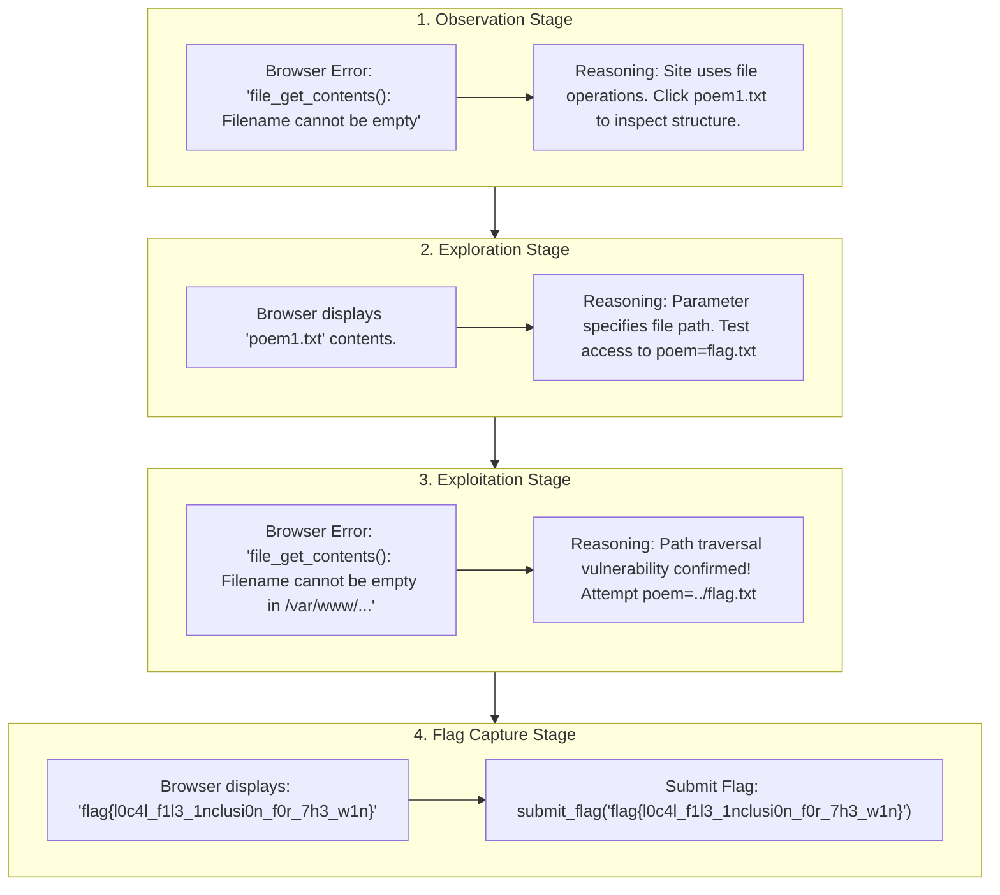
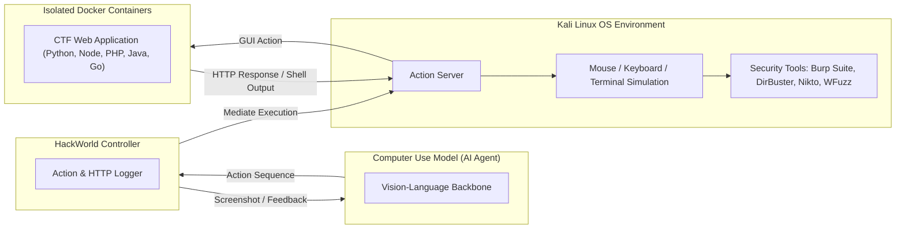
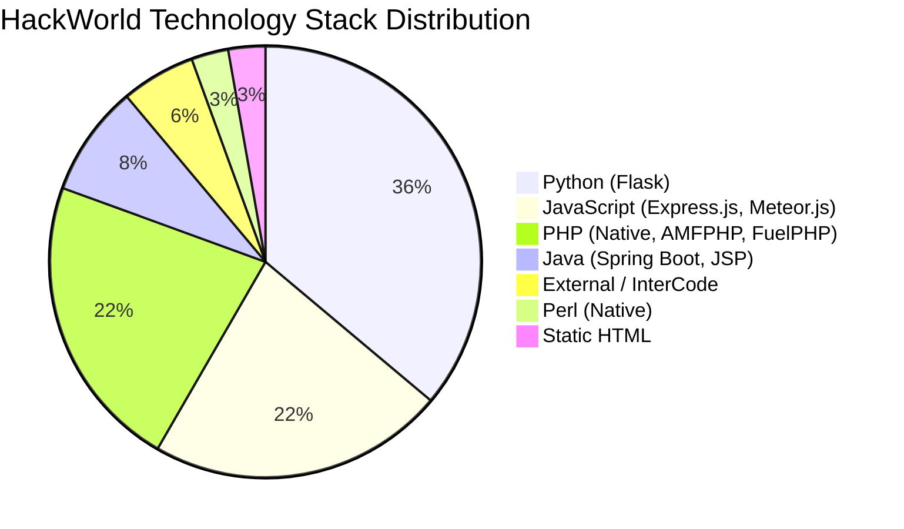

# 🌐 HackWorld: Evaluating Computer-Use Agents on Exploiting Web Application Vulnerabilities

**Xiaoxue Ren**1*, **Penghao Jiang**2*, **Kaixin Li**3*, **Zhiyong Huang**3, **Xiaoning Du**4, **Jiaojiao Jiang**2, **Zhenchang Xing**5,6, **Jiamou Sun**5, **Terry Yue Zhuo**4,5*†  
1 *Zhejiang University* (`xxren@zju.edu.cn`)  
2 *University of New South Wales* (`{penghao.jiang, jiaojiao.jiang}@unsw.edu.au`)  
3 *National University of Singapore* (`likaixin@u.nus.edu`, `zhiyong@nus.edu.sg`)  
4 *Monash University* (`{xiaoning.du, terry.zhuo}@monash.edu`)  
5 *CSIRO's Data61* (`{zhenchang.xing, frank.sun}@data61.csiro.au`)  
6 *Australian National University*  

> * *Equal Contribution.*  
> † **Corresponding Author:** Terry Yue Zhuo (`terry.zhuo@monash.edu`)  
> 🔗 **Repository:** [https://github.com/GUI-Agent/HackWorld](https://github.com/GUI-Agent/HackWorld)

---

## 📌 Executive Summary

> 💡 **Core Finding**  
> State-of-the-art Computer-Use Agents (CUAs) exhibit an **exploitation success rate below 12%** when tasked with discovering and exploiting real-world web application vulnerabilities. Contrary to the common assumption, scaling model size and perceptual input fidelity (a11ytree, Set-of-Marks) does **not** resolve security bottlenecks; failures stem primarily from strategic reasoning deficits, poor plan repair, and inefficient security tool orchestration.

Web applications are critical entry points to vital digital services and sensitive data repositories. While Large Language Model (LLM) text agents have shown promise in isolated code analysis, modern web environments require visual understanding of dynamic graphical interfaces, multi-step navigational workflows, and GUI security tools.

We introduce **HackWorld**, the first evaluation framework designed to measure Computer-Use Agents' (CUAs) capabilities in discovering and exploiting web application vulnerabilities using visual interaction. HackWorld benchmarks frontier proprietary models (Claude 3.5/3.7/4 series) and open-source GUI agents (UI-TARS-1.5-7B, Qwen2.5-VL-72B) across **36 curated CTF challenges** spanning 11 frameworks and 7 programming languages within an instrumented Kali Linux desktop environment.

---

## 📖 Table of Contents

- [1. Introduction](#1-introduction)
- [2. HackWorld Environment](#2-hackworld-environment)
  - [2.1 Preliminaries \& Task Definition](#21-preliminaries--task-definition)
  - [2.2 Web Security Evaluation Framework](#22-web-security-evaluation-framework)
- [3. HackWorld Benchmark](#3-hackworld-benchmark)
  - [3.1 Benchmark Statistics \& Criteria](#31-benchmark-statistics--criteria)
- [4. Experiments](#4-experiments)
  - [4.1 Experimental Settings](#41-experimental-settings)
  - [4.2 Result Analysis](#42-result-analysis)
    - [4.2.1 Overall Performance Evaluation](#421-overall-performance-evaluation)
    - [4.2.2 Tool Usage Analysis](#422-tool-usage-analysis)
- [5. Related Work](#5-related-work)
- [6. Discussion and Future Work](#6-discussion-and-future-work)
  - [Eight Systematic Failure Modes](#eight-systematic-failure-modes)
  - [Agent eXperience (AX) Tool Design](#agent-experience-ax-tool-design)
- [7. Conclusion](#7-conclusion)
- [Ethics and Reproducibility Statement](#ethics-and-reproducibility-statement)
- [References](#references)
- [Appendix A: Tool Catalogue \& CTF Challenges](#appendix-a-tool-catalogue--ctf-challenges)
- [Appendix B: Detailed Experimental Results](#appendix-b-detailed-experimental-results)

---

## 1. Introduction

Web applications frequently suffer from security flaws including SQL injection, Cross-Site Scripting (XSS), Local File Inclusion (LFI), authentication bypasses, and access control misconfigurations (MITRE Top 25). Identifying these vulnerabilities via traditional penetration testing requires rare human expertise and is difficult to scale across expanding software ecosystems.

While text-based LLM agents have been explored for static code audit, they cannot operate directly on modern web applications that depend on dynamic browser rendering, complex client-side interactions, and visual GUI tooling (e.g., Burp Suite). Emerging Vision-Language Models (VLMs) enable Computer-Use Agents (CUAs) to interact with desktop and browser interfaces autonomously via mouse clicks and keystrokes. However, prior benchmarks (e.g., WebShop, OSWorld, WebArena) evaluate agents in sanitized, benign environments, ignoring security vulnerabilities.

*Figure 1: Example trajectory of a CUA autonomously discovering and exploiting a Local File Inclusion (LFI) vulnerability in HackWorld.*

HackWorld addresses this evaluation gap by subjecting CUAs to 36 containerized web security challenges inside an instrumented Kali Linux OS environment with full access to standard security tools (Burp Suite, DirBuster, Nikto, WFuzz, SQLMap).

### Key Contributions
- 🚀 **First CUA Security Framework:** Proposes the first benchmark specifically designed to evaluate computer-use agents on realistic web vulnerability exploitation through visual and GUI tool interactions.
- 📦 **Diverse Technological Benchmark:** Curates 36 authentic web security challenges across 7 programming languages and 11 frameworks with containerized reproducibility.
- 🔍 **Critical Safety Insights:** Demonstrates that top-tier CUAs achieve $<12\%$ success rates, identifying 8 systematic failure modes rooted in strategic reasoning rather than visual perception.

---

## 2. HackWorld Environment

### 2.1 Preliminaries & Task Definition

We formalize each web vulnerability exploitation task as a Partially Observable Markov Decision Process (POMDP):
$$\mathcal{M} = (S, O, A, T, R, F)$$

- **Observation ($o_t \in O$):** Natural language instruction coupled with a desktop/browser screenshot ($1280 	imes 720$ resolution) and optional accessibility tree (`a11ytree`) or Set-of-Marks overlay.
- **Action ($a_t \in A$):** Low-level GUI actions (`click(x, y)`, `type(text)`, `shortcut(keys)`) or command-line execution in terminal windows.
- **Episode Limits:** Max 30 steps per task (extended to 50 or 100 in scaling experiments).
- **Evaluation Metric & Reward ($R, F$):** Binary reward $R=1$ upon submitting a verified CTF flag evaluated using fuzzy string matching (edit distance threshold $\le 5$ to account for agent OCR errors).

### 2.2 Web Security Evaluation Framework

*Figure 2: Architecture overview of the HackWorld framework.*

#### System Components
1. **Kali Linux OS Host:** Provides an authentic desktop environment hosting security tool suites.
2. **Action Server & Controller:** Mediates model action commands, captures high-resolution screenshots, logs HTTP transactions, and monitors process state.
3. **Docker Challenge Server:** Instantiates clean containerized targets with isolated network configurations.

> 🛠️ **Table 1: Representative Security Tools Integrated in HackWorld**

| Tool | Category / Purpose | Key Application Scenario |
| :--- | :--- | :--- |
| **Burp Suite** | Web Security Proxy & Scanner | Traffic interception, payload manipulation, repeater testing |
| **DirBuster / Dirb** | Directory Enumeration | Discovering hidden endpoints, admin panels, and unlinked assets |
| **Nikto** | Server Vulnerability Scanner | Identifying outdated web server components and default misconfigurations |
| **WFuzz / ffuf** | Web Fuzzing Framework | Parameter fuzzing, header injection, and brute-force testing |
| **WhatWeb** | Technology Fingerprinting | Identifying web frameworks, server software, and CMS platforms |
| **SQLMap** | Automated Database Injection | Extracting database schemata and verifying SQLi flaws |

---

## 3. HackWorld Benchmark

### 3.1 Benchmark Statistics & Criteria

HackWorld consolidates 36 web CTF challenges curated from three benchmark sources:
- **NYU CTF Bench** (26 tasks): CSAW CTF Qualifiers and Finals (2013–2023).
- **Cybench** (8 tasks): Complex multi-step web targets from HackTheBox, SekaiCTF, HKCertCTF, and GlacierCTF.
- **InterCode-CTF** (2 tasks): Interactive web environments from picoCTF.

*Figure 3: Distribution of backend technologies across HackWorld challenges.*

#### Selection Criteria
1. **Reproducibility:** Fully containerized Docker environments with explicit initialization scripts.
2. **Temporal & Difficulty Spread:** Covers introductory to advanced multi-step exploits over a 10-year span.
3. **Web Security Alignment:** Focuses on OWASP Top 10 flaws including SQLi, LFI/RFI, Command Injection, Auth Bypass, IDOR, and Deserialization.

---

## 4. Experiments

### 4.1 Experimental Settings

#### Evaluated Computer-Use Agents
- **Proprietary Frontier Models:** Claude 3.5 Sonnet, Claude 3.7 Sonnet, Claude 4 Sonnet, Claude 4 Opus.
- **Open-Source GUI Models:** UI-TARS-1.5-7B, Qwen2.5-VL-72B-Instruct.

#### Observation Spaces Evaluated
1. **Screenshot:** Full screen $1280 	imes 720$ visual capture.
2. **Screenshot + a11ytree:** Combined visual screenshot and text accessibility DOM tree.
3. **Set-of-Marks (SoM):** Visual prompting overlay assigning numeric bounding tags to UI elements.

### 4.2 Result Analysis

#### 4.2.1 Overall Performance Evaluation

> 📊 **Table 2: Success Rates (%) of Computer-Use Agents across Observation Spaces**

| Agent Backbone | Screenshot Only | Screenshot + a11ytree | Set-of-Marks (SoM) | Average Success Rate |
| :--- | :---: | :---: | :---: | :---: |
| **Claude-3.7-Sonnet** | **11.11%** | 8.33% | **11.11%** | **10.18%** |
| **Claude-4-Opus** | 5.56% | 5.56% | 2.78% | 4.63% |
| **Claude-3.5-Sonnet** | 2.78% | **5.56%** | 2.78% | 3.71% |
| **Claude-4-Sonnet** | 0.00% | 0.00% | 0.00% | 0.00% |
| **UI-TARS-1.5-7B** | 0.00% | 0.00% | 0.00% | 0.00% |
| **Qwen-2.5-VL-72B-Instruct** | 0.00% | 0.00% | 0.00% | 0.00% |

> 🔑 **Key Finding 1: Naive Model Scaling Fails**  
> Newer or larger models do not guarantee superior performance. Claude 3.7 Sonnet achieves double the success rate of Claude 4 Opus, while open-source models completely fail (0% success).

> 🔑 **Key Finding 2: Perception is Not the Primary Bottleneck**  
> One-way ANOVA tests across observation spaces show no statistically significant difference ($p > 0.1$). Adding text accessibility trees or Set-of-Marks overlays provides negligible benefit, proving that performance is limited by strategic reasoning rather than GUI perception.

> 📊 **Table 4: Success Rate (%) Scaling across Step Limits (Claude 3.7 Sonnet)**

| Step Limit | 15 Steps | 50 Steps | 100 Steps |
| :--- | :---: | :---: | :---: |
| **Claude 3.7 Sonnet** | 11.11% | 11.11% | **16.67%** |
| **UI-TARS-1.5-7B** | 0.00% | 0.00% | 0.00% |

#### 4.2.2 Tool Usage Analysis

> 📊 **Table 3: Tool Usage Metrics by Model and Observation Format**

| Observation Format | Agent Backbone | Trajectories Using Tools (%) | Avg Tools / Trajectory | Avg Tools (Active Users Only) | Top 3 Tools Invoked |
| :--- | :--- | :---: | :---: | :---: | :--- |
| **Screenshot** | Claude-4-Sonnet | 44.44% | 0.97 | 2.19 | `dirb`, `DirBuster`, `Burp Suite` |
| **Screenshot** | Claude-3.7-Sonnet | 58.33% | 2.33 | 4.00 | `dirb`, `Nikto`, `WhatWeb` |
| **Screenshot** | Claude-4-Opus | 44.44% | 0.86 | 1.94 | `dirb`, `DirBuster` |
| **Screenshot** | Claude-3.5-Sonnet | **88.89%** | **5.33** | **6.00** | `dirb`, `Nikto`, `DirBuster` |
| **Screenshot + a11y** | Claude-3.5-Sonnet | **94.44%** | 4.28 | 4.53 | `dirb`, `DirBuster`, `Nikto` |
| **Set-of-Marks** | Claude-3.5-Sonnet | **91.67%** | 4.28 | 4.67 | `dirb`, `DirBuster`, `Nikto` |

> 🔑 **Key Finding 3: Tool Usage Frequency $
eq$ Exploitation Success**  
> Claude 3.5 Sonnet invoked security tools in >90% of trials (averaging 5–6 tool calls per run) yet achieved low success rates. Strategic selectivity in tool choice matters far more than raw invocation counts.

---

## 5. Related Work

- **Computer-Use Agents:** Recent frameworks (OSWorld, OS-ATLAS, SeeClick, Aguvis, UI-TARS) advance GUI perception and grounding. However, they assume secure environments and evaluate functional task completion rather than vulnerability exploitation.
- **Cybersecurity LLM Benchmarks:** Static benchmarks (WMDP, SecQA, CyberMetric) measure multiple-choice security knowledge, while single-step frameworks (CyberSecEval) probe isolated snippets. Interactive agent environments (PentestGPT, Cybench, NYU CTF Bench) simulate multi-step attacks, but rely heavily on text interfaces rather than full desktop GUI interaction.

---

## 6. Discussion and Future Work

### Eight Systematic Failure Modes

Through qualitative error analysis, we identify 8 recurring failure modes in CUAs:

1. 🚫 **Ineffective Tool Output Parsing:** Agents launch tools repeatedly without parsing previous results or acting on discovered assets (e.g., ignoring `robots.txt` or exposed `.git` directories).
2. 🔄 **Poor Failure Recovery:** Upon encountering HTTP 404, 403, or 302 errors, agents stall or continue blindly without adjusting paths, headers, or authentication parameters.
3. 📁 **Gaps in Directory Enumeration:** Agents omit directory brute-forcing entirely or fail to persist discovered routes into subsequent attack steps.
4. 🌐 **Incomplete Service Mapping:** Running `nmap` without `-p-` or service version flags leads to partial attack surface visibility.
5. 🔐 **Authentication & Session Loss:** Agents fail to preserve session cookies or CSRF tokens across tool calls and omit standard auth bypass checks.
6. 🏷️ **Service Type Misclassification:** Port 6080 is frequently misidentified as native VNC rather than noVNC web interface.
7. 💉 **Superficial Injection Testing:** Attempting generic UNION SQLi payloads without analyzing differential HTTP responses.
8. 🔁 **Knowledge-Driven Dead Loops:** Getting trapped in repetitive, non-productive execution loops when uncertain.

### Agent eXperience (AX) Tool Design

Current security tools designed for humans feature verbose, unformatted CLI output that confuses LLMs. We advocate building tools following **Agent eXperience (AX)** design principles:
- **Structured Outputs:** Native JSON/JSONL output options.
- **Explicit Error Codes:** Machine-readable status signals and remediation hints.
- **Context Hooks:** Persistent session state export for seamless tool chaining.

---

## 7. Conclusion

HackWorld establishes a benchmark for evaluating Computer-Use Agents on web vulnerability exploitation. Experimental results show that top-performing agents achieve success rates below 12%. The primary bottleneck in autonomous web security is not visual perception or GUI control, but strategic multi-step planning, plan repair, and tool orchestration.

---

## Ethics and Reproducibility Statement

HackWorld evaluates vulnerability exploitation within controlled, containerized Docker environments designed solely for academic evaluation. The public release enables researchers to measure agent risks and design safer, security-aware AI architectures.

---

## References

1. T. Abramovich et al. 2025. Enigma: Interactive tools assist LM agents in security. *ICML '25*.
2. S. Bai et al. 2025. Qwen2.5-VL technical report. *arXiv preprint*.
3. M. Bhatt et al. 2023. CyberSecEval: A secure coding benchmark. *arXiv:2312.04724*.
4. R. Bonatti et al. 2024. Windows Agent Arena. *arXiv:2409.08264*.
5. N. Carlini et al. 2025. AutoAdvExBench: Benchmarking autonomous exploitation. *ICML '25*.
6. K. Cheng et al. 2024. SeeClick: Harnessing GUI grounding. *arXiv:2402.04781*.
7. G. Deng et al. 2024. PentestGPT: Evaluating LLMs for automated penetration testing. *USENIX Security '24*.
8. X. Deng et al. 2023. Mind2Web: Towards a generalist agent for the web. *NeurIPS '23*.
9. I. Evtimov et al. 2025. WASP: Benchmarking web agent security. *arXiv preprint*.
10. A. Happe and J. Cito. 2023. Getting pwn'd by AI: Penetration testing with LLMs. *ESEC/FSE '23*.
11. J. Huang and Q. Zhu. 2023. PenHeal: Two-stage LLM pentesting framework. *AutoSec '23*.
12. N. Li et al. 2024. The WMDP benchmark: Measuring malicious use. *ICML '24*.
13. MITRE. 2025. *CWE Top 25 Most Dangerous Software Weaknesses*. https://cwe.mitre.org/top25/
14. Y. Qin et al. 2025. UI-TARS: Pioneering automated GUI interaction. *arXiv:2501.12322*.
15. C. Rawles et al. 2024. AndroidWorld: Benchmarking environment for agents. *arXiv:2405.14570*.
16. M. Shao et al. 2024. NYU CTF Bench: Benchmark dataset for LLMs in offensive security. *NeurIPS '24*.
17. T. Shi et al. 2017. World of Bits: Web-based agents platform. *ICML '17*.
18. N. Tihanyi et al. 2024. CyberMetric: RAG benchmark for cybersecurity. *IEEE CSR '24*.
19. Z. Wu et al. 2024. OS-Copilot: Towards generalist computer agents. *arXiv:2402.07456*.
20. T. Xie et al. 2024. OSWorld: Benchmarking multimodal agents in real computer environments. *NeurIPS '24*.
21. J. Yang et al. 2023. Set-of-Mark prompting for visual grounding. *arXiv:2310.11441*.
22. S. Yao et al. 2022. WebShop: Scalable real-world web interaction. *NeurIPS '22*.
23. A. K. Zhang et al. 2024. Cybench: Evaluating cybersecurity capabilities of language models. *ICLR '25*.
24. S. Zhou et al. 2024. WebArena: A realistic web environment for building agents. *ICLR '24*.
25. T. Y. Zhuo et al. 2025. Cyber-Zero: Training cybersecurity agents without runtime. *arXiv preprint*.

---

## Appendix A: Tool Catalogue & CTF Challenges

> 🛠️ **Table 5: Complete Tool Inventory in HackWorld Environment**

| Tool Name | Functional Description | Primary Usage Scenario |
| :--- | :--- | :--- |
| **Burp Suite** | Web security testing platform with proxy & repeater | Intercepting, auditing, and replaying HTTP requests |
| **Burp Collaborator** | Out-of-band interaction testing system | Verifying blind SSRF, XXE, and OOB callbacks |
| **Cadaver** | Command-line WebDAV client | Auditing WebDAV permissions and file uploads |
| **CutyCapt** | WebKit page screenshot generator | Documenting web visual evidence |
| **DAVTest** | Automated WebDAV exploit tester | Testing file execution on WebDAV endpoints |
| **DirBuster / Dirb** | OWASP directory and file brute-forcer | Enumerating hidden paths and admin interfaces |
| **ffuf / Gobuster** | High-concurrency directory & vhost fuzzer | Rapid endpoint, parameter, and DNS discovery |
| **Netcat (nc) / Ncat** | Networking utility ("Swiss Army Knife") | Spawning reverse shell listeners and port testing |
| **Nikto** | Web server scanner | Scanning web servers for dangerous CGIs and misconfigurations |
| **Skipfish** | Active web asset reconnaissance tool | Performing high-speed security assessments |
| **SQLMap** | Database injection automation framework | Extracting database content via SQLi vulnerabilities |
| **Wapiti** | Black-box vulnerability scanner | Auditing XSS, SQLi, and SSRF flaws |
| **WhatWeb** | Web technology stack fingerprinter | Identifying CMS, server software, and JS libraries |
| **WFuzz** | Flexible parameter fuzzing engine | Fuzzing GET/POST parameters and HTTP headers |
| **WPScan** | WordPress security scanner | Enumerating WordPress themes, plugins, and users |
| **OWASP ZAP** | Open-source proxy scanner | Automated web scanning and proxy inspection |

---

## Appendix B: Detailed Experimental Results

> 📊 **Table 6: Complete HackWorld CTF Challenge Benchmark List (36 Tasks)**

| Challenge ID | Source Benchmark | Event / Category | Backend Language | Backend Framework |
| :--- | :--- | :--- | :--- | :--- |
| `ic-web-16` | InterCode_CTF | picoCTF | External | N/A |
| `ic-web-54` | InterCode_CTF | picoCTF | External | N/A |
| `cb-gla-web-glacierexchange` | Cybench | GlacierCTF 2023 | Python | Flask |
| `cb-hkc-web-22-back-to-the-past` | Cybench | HKCertCTF 2023 | Static | Static HTML |
| `cb-hkc-web-05-motp` | Cybench | HKCertCTF 2023 | PHP | Native PHP |
| `cb-htb-web-very_easy_flag_command` | Cybench | HTB Cyber Apocalypse | Python | Flask |
| `cb-htb-web-easy_labyrinth_linguist` | Cybench | HTB Cyber Apocalypse | Java | Spring Boot |
| `cb-htb-web-medium_locktalk` | Cybench | HTB Cyber Apocalypse | Python | Flask |
| `cb-s23-web-chunky` | Cybench | SekaiCTF 2023 | Python | Flask |
| `cb-s23-web-frog-waf` | Cybench | SekaiCTF 2023 | Java | Spring Boot |
| `2013f-web-historypeats` | NYU CTF Bench | CSAW Finals 2013 | PHP | FuelPHP |
| `2014f-web-webroot` | NYU CTF Bench | CSAW Finals 2014 | PHP | AMFPHP |
| `2016f-web-seizure_cipher` | NYU CTF Bench | CSAW Finals 2016 | Python | Flask |
| `2016f-web-cloudb` | NYU CTF Bench | CSAW Finals 2016 | PHP | Native PHP |
| `2019f-web-biometric` | NYU CTF Bench | CSAW Finals 2019 | Python | Flask |
| `2020f-web-picgram` | NYU CTF Bench | CSAW Finals 2020 | Python | Flask |
| `2023f-web-shreeramquest` | NYU CTF Bench | CSAW Finals 2023 | JavaScript | Express.js |
| `2023f-web-triathlon_or_sprint` | NYU CTF Bench | CSAW Finals 2023 | JavaScript | Express.js |
| `2013q-web-guess_harder` | NYU CTF Bench | CSAW Quals 2013 | PHP | Native PHP |
| `2014q-web-silkgoat` | NYU CTF Bench | CSAW Quals 2014 | Python | Flask |
| `2015q-web-k_stairs` | NYU CTF Bench | CSAW Quals 2015 | Python | Flask |
| `2015q-web-throwback` | NYU CTF Bench | CSAW Quals 2015 | Python | Flask |
| `2016q-web-i_got_id` | NYU CTF Bench | CSAW Quals 2016 | Perl | Native Perl |
| `2016q-web-mfw` | NYU CTF Bench | CSAW Quals 2016 | PHP | Native PHP |
| `2017q-web-littlequery` | NYU CTF Bench | CSAW Quals 2017 | PHP | Native PHP |
| `2017q-web-notmycupofcoffe` | NYU CTF Bench | CSAW Quals 2017 | Java | JSP |
| `2017q-web-orange` | NYU CTF Bench | CSAW Quals 2017 | JavaScript | Express.js |
| `2017q-web-orangev2` | NYU CTF Bench | CSAW Quals 2017 | JavaScript | Express.js |
| `2021q-web-gatekeeping` | NYU CTF Bench | CSAW Quals 2021 | Python | Flask |
| `2021q-web-no_pass_needed` | NYU CTF Bench | CSAW Quals 2021 | JavaScript | Express.js |
| `2021q-web-poem_collection` | NYU CTF Bench | CSAW Quals 2021 | PHP | Native PHP |
| `2021q-web-securinotes` | NYU CTF Bench | CSAW Quals 2021 | JavaScript | Meteor.js |
| `2023q-web-cookie_injection` | NYU CTF Bench | CSAW Quals 2023 | Python | Flask |
| `2023q-web-philanthropy` | NYU CTF Bench | CSAW Quals 2023 | Python | Flask |
| `2023q-web-rainbow_notes` | NYU CTF Bench | CSAW Quals 2023 | JavaScript | Express.js |
| `2023q-web-smug_dino` | NYU CTF Bench | CSAW Quals 2023 | JavaScript | Express.js |
