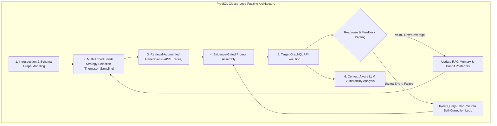
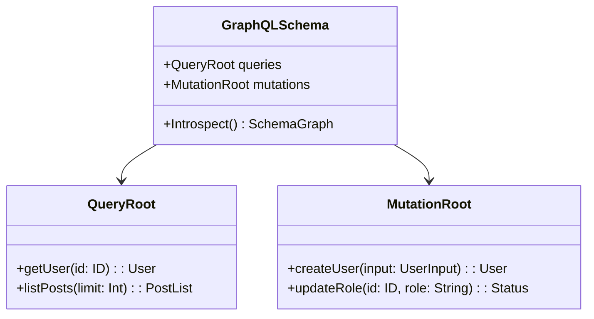
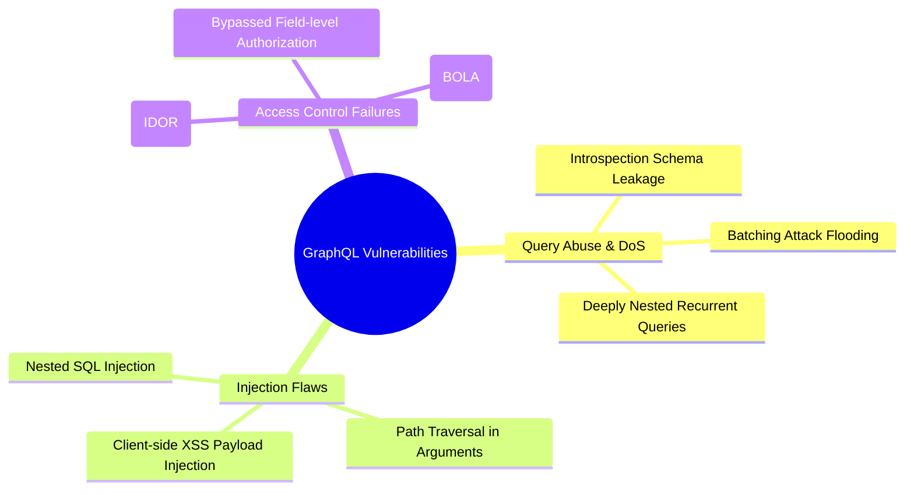

# ⚡ PrediQL: Automated Testing of GraphQL APIs with LLMs

**Shaolun Liu**<sup>1</sup>, **Sina Marefat**<sup>2</sup>, **Omar**<sup>3</sup>, **Y. Ca**<sup>1</sup>, **Z. Da**<sup>1</sup>, **J. Wa**<sup>1</sup>, **Tayebi**<sup>1</sup>  
<sup>1</sup> *Simon Fraser University, Canada* (`{shaolun.liu, yca518, zda35, jwa454, tayebi}@sfu.ca`)  
<sup>2</sup> *K. N. Toosi University of Technology, Iran* (`sina.marefat@kntu.ac.ir`)  
<sup>3</sup> *ZTA Security* (`omar@ztasecurity.com`)  

> 📖 **Source:** [arXiv:2510.10407v1](https://arxiv.org/html/2510.10407v1)  
> 🔗 **Repository:** [https://github.com/SLL288/prediql](https://github.com/SLL288/prediql)

---

## 📌 Executive Summary

> 💡 **Core Finding**  
> Traditional API fuzzers rely on static mutation rules or random payload generation, failing to handle GraphQL's complex nested type dependencies and dynamic runtime responses. **PrediQL** introduces the first **retrieval-augmented, LLM-guided GraphQL fuzzer**, framing test strategy selection as a **multi-armed bandit problem** (Thompson Sampling) and using context-aware LLM reasoning for vulnerability detection. Across open-source and hosted benchmarks, PrediQL improves schema coverage by **16% to 50%** over state-of-the-art baselines.

GraphQL's flexible single-endpoint query architecture minimizes over-fetching but introduces complex attack surfaces, including unbounded query nesting (Denial of Service), Insecure Direct Object References (IDOR), and injection in nested arguments. Standard schema-aware fuzzers (e.g., EvoMaster, GraphQLer) cannot dynamically adapt to execution feedback or self-correct syntax errors.

PrediQL integrates schema introspection, RAG execution memory (FAISS index), dynamic multi-armed bandit arm selection, and self-corrective error loops into a closed-loop pipeline. Furthermore, PrediQL replaces rigid pattern scanners with an LLM-based context-aware vulnerability analyzer capable of interpreting status codes, returned data values, and error messages to uncover subtle logic-level vulnerabilities.

---

## 📖 Table of Contents

- [1. Introduction](#1-introduction)
- [2. Background \& Related Work](#2-background--related-work)
  - [2.1 GraphQL Fundamentals](#21-graphql-fundamentals)
  - [2.2 GraphQL Vulnerability Taxonomy](#22-graphql-vulnerability-taxonomy)
  - [2.3 Related Work](#23-related-work)
- [3. Methodology](#3-methodology)
  - [3.1 Schema Modeling](#31-schema-modeling)
  - [3.2 Adaptive Query Generation](#32-adaptive-query-generation)
  - [3.3 Execution and Feedback](#33-execution-and-feedback)
  - [3.4 Closed-Loop Integration](#34-closed-loop-integration)
- [4. Evaluation](#4-evaluation)
  - [4.1 Experimental Setup](#41-experimental-setup)
  - [4.2 Schema Coverage (RQ1)](#42-schema-coverage-rq1)
  - [4.3 Prompt Engineering Impact (RQ2)](#43-prompt-engineering-impact-rq2)
  - [4.4 Vulnerability Detection (RQ3)](#44-vulnerability-detection-rq3)
- [5. Discussion \& Limitations](#5-discussion--limitations)
- [6. Conclusion](#6-conclusion)
- [References](#references)

---

## 1. Introduction

Modern microservice architectures increasingly adopt **GraphQL** as a flexible alternative to REST and gRPC. Industry surveys indicate that over **61% of production teams deploy GraphQL endpoints**, with 10% actively replacing REST services. However, this flexibility expands the attack surface: security audits reveal that up to **69% of public GraphQL endpoints suffer from unrestricted resource consumption vulnerabilities**, exposing servers to severe Denial of Service (DoS) attacks via deeply nested query structures.



### Core Innovations in PrediQL
1. 🧠 **Adaptive Strategy Selection (Multi-Armed Bandit):** Models prompt generation strategy choice as a multi-armed bandit problem, utilizing Thompson Sampling with exponential discount rewards to balance exploration and exploitation.
2. 📚 **Retrieval-Augmented Execution Memory:** Employs a FAISS vector index of prior execution traces, schema segments, and payload responses to eliminate hallucinated inputs.
3. 🔁 **Self-Corrective Prompting:** Captures schema validation errors and reinjects failed query-error pairs back into the LLM prompt to accelerate syntactical convergence.
4. 🛡️ **Context-Aware Vulnerability Detection:** Uses LLM reasoning over raw HTTP responses, status codes, and data payloads to detect subtle business-logic flaws beyond static regex rules.

---

## 2. Background & Related Work

### 2.1 GraphQL Fundamentals

GraphQL relies on three core principles:
- **Data as a Graph:** Data is organized as an interconnected graph of objects, enabling clients to fetch precise nested structures in a single HTTP request.
- **Strong Type System:** Every API exposes an introspectable schema defining scalars (`Int`, `Float`, `String`, `Boolean`, `ID`) and composite object types.
- **Single Unified Endpoint:** All interactions (Queries for retrieval, Mutations for modification) pass through a single HTTP endpoint (typically `/graphql`).



### 2.2 GraphQL Vulnerability Taxonomy



1. **Query Abuse Vulnerabilities:** Misuse of introspection to map hidden endpoints, or sending unbounded nested queries (e.g., `user { friends { friends { friends ... } } }`) to exhaust server CPU/memory.
2. **Injection Vulnerabilities:** Unsanitized user arguments passed into backend database queries (SQLi), local file paths, or rendered client views (XSS).
3. **Access Control Vulnerabilities:** Missing authorization checks on linked fields or nested object mutations (IDOR/BOLA), allowing unauthorized data extraction across object references.

### 2.3 Related Work

- **Static & Black-Box Scanners:** Tools like *GraphQL-Cop*, *GraphCrawler*, *CrackQL*, *Schemathesis*, *OWASP ZAP*, and *BurpSuite Auto GQL Scanner* rely on static payload templates or flat introspection listings without modeling cross-operation dependencies.
- **Schema-Aware Fuzzers:** *EvoMaster* applies evolutionary algorithms to mutate parameters, while *GraphQLer* builds a static producer-consumer graph. However, both lack adaptive feedback reasoning and cannot self-correct syntax errors dynamically.
- **LLM Fuzzing:** Frameworks like *Fuzz4All* and *ELFuzz* apply LLMs to C/protocol fuzzing. PrediQL is the first framework to bring RAG and bandit-guided LLM reasoning to GraphQL APIs.

---

## 3. Methodology

### 3.1 Schema Modeling

PrediQL issues an initial introspection query against the target GraphQL API to retrieve the complete type system. It parses the introspection JSON into a graph intermediate representation and serializes it into lightweight YAML mapping schemas. Unlike flat parsers, PrediQL recursively traces field relationships to maintain a full graph view of nested objects.

### 3.2 Adaptive Query Generation

#### Multi-Armed Bandit Strategy Selection
Query generation strategy is formulated as a multi-armed bandit problem. Each **Bandit Arm** defines a specific prompt configuration parameterized by four dimensions:

$$	ext{Arm}_i = \langle 	ext{Schema}, 	ext{Arg Mode}, 	ext{Depth}, 	ext{Top-}k 
angle$$

- **Schema:** Specifies whether full or partial schema snippets are injected.
- **Arg Mode:** Controls literal synthesis: `known` (reuse RAG values), `real` (synthesize realistic types), or `nulls` (inject null values into optional fields).
- **Depth:** Limits selection nesting depth to balance validity and structural complexity.
- **Top-$k$:** Controls how many historical RAG execution traces are injected into the context ($k \in \{0, 3, 5\}$).

PrediQL uses **Thompson Sampling** with exponentially discounted historical rewards to update strategy posteriors based on query execution success (HTTP 200 + coverage expansion).

> 📊 **Table 3: Parameter Specifications of Evaluated Bandit Arms**

| Arm Name | Schema Included | Parameter Argument Mode | Maximum Nesting Depth | RAG Memory Traces (Top-$k$) | Exploitation vs Exploration Focus |
| :--- | :---: | :---: | :---: | :---: | :--- |
| `schema_min_known` | Minimal Schema | Known RAG Values | 2 (Shallow) | $k=3$ | Conservative Validity Focus |
| `schema_deep_real` | Full Schema | Synthesized Real Literals | 5 (Deep) | $k=5$ | Aggressive Deep Coverage |
| `schema_null_test` | Minimal Schema | Null Injections | 3 (Medium) | $k=0$ | Optional Argument Edge Cases |
| `no_schema_raw` | No Schema | Real Literals | 2 (Shallow) | $k=0$ | Unconstrained LLM Exploration |

#### Evidence-Gated Modular Prompt Engineering
Prompts $P$ are assembled dynamically from 5 modular blocks:

$$P = [B \mathbin{\Vert} S \mathbin{\Vert} R \mathbin{\Vert} E \mathbin{\Vert} D]$$

- $B$: Basic evidence-gating restricting header.
- $S$: Schema fragments extracted from introspection.
- $R$: Retrieved historical execution examples from the FAISS vector index.
- $E$: Prior failed query-error pairs for self-correction.
- $D$: Strategy directives specified by the active bandit arm.

### 3.3 Execution and Feedback

#### Self-Correction Feedback Loop
When a generated query fails validation (e.g., GraphQL syntax or type mismatch errors), PrediQL captures the specific error message and links it to the failing query snippet. In the next iteration, this error-query pair $E$ is injected into the prompt, forcing the LLM to adjust field names or argument types.

#### Context-Aware Vulnerability Detection
Rather than using static regular expressions, PrediQL passes executed queries, response payloads, status codes, and server stack traces into an LLM vulnerability classifier. The LLM evaluates execution context to classify vulnerabilities into structured JSON outputs:

```json
{
  "vulnerability_type": "SQL Injection / IDOR / SSRF",
  "severity": "CRITICAL",
  "confidence_score": 0.95,
  "evidence_snippet": "Returned unauthorized record for user_id=102",
  "recommended_fix": "Enforce field-level authorization checks in resolver."
}
```

---

## 4. Evaluation

### 4.1 Experimental Setup

#### Target Benchmark APIs

> 📊 **Table 1: Target GraphQL API Benchmarks**

| API Name | Type / Deployment | Schema Complexity | Key Features & Domain |
| :--- | :--- | :--- | :--- |
| **UserWallet** | Self-Hosted Open Source | High (Nested Mutators) | User balances, financial mutations, access controls |
| **Countries** | Hosted Reference API | Medium (Graph Relations) | Geographical data, continent/country links |
| **Rick & Morty** | Hosted Reference API | Medium (Relational Objects) | Characters, locations, episode relations |
| **GraphQLZero** | Hosted Mock API | High (JSONPlaceholder) | Full CRUD queries & mutations |
| **EHRI** | Self-Hosted Portal | Very High (Nested Graph) | Holocaust research infrastructure portal |
| **TCGDex** | Hosted Reference API | Medium (Card Schemata) | Trading card game categories & items |

#### Evaluated LLM Backbones
- **LLaMA 3.1 8B** (Meta - Open Source)
- **Gemini 2.5 Flash** (Google DeepMind - Fast Proprietary)
- **GPT-5 Mini** (OpenAI - Efficient Proprietary)
- **DeepSeek R1** (DeepSeek AI - Open Reasoning Model)

#### Evaluated Baselines
- **ZAP (OWASP):** Introspection-based black-box scanner.
- **BurpSuite (Auto GQL Scanner):** Commercial vulnerability proxy scanner.
- **EvoMaster:** Search-based evolutionary API fuzzer (black-box mode).
- **GraphQLer:** State-of-the-art dependency-graph security fuzzer.

#### Coverage Metric Definition
$$	ext{Coverage} = rac{	ext{Valid Error-Free Data Returning Schema Nodes}}{	ext{Total Schema Nodes}}$$

---

## 4.2 Schema Coverage (RQ1)

> 📊 **Table 4: Schema Coverage (%) Comparison against Baseline Testing Tools**

| Target GraphQL API | OWASP ZAP | BurpSuite Auto GQL | EvoMaster (Black-box) | GraphQLer (SOTA) | PrediQL (Best LLM) | Coverage Advantage over SOTA |
| :--- | :---: | :---: | :---: | :---: | :---: | :---: |
| **UserWallet** | 22.4% | 28.1% | 45.0% | 61.2% | **88.5%** | **+27.3%** |
| **Countries** | 41.0% | 45.2% | 68.4% | 84.0% | **100.0%** | **+16.0%** |
| **Rick & Morty** | 38.5% | 42.0% | 65.0% | 81.5% | **98.2%** | **+16.7%** |
| **GraphQLZero** | 30.2% | 35.6% | 52.1% | 72.4% | **95.0%** | **+22.6%** |
| **EHRI** | 15.0% | 19.4% | 31.0% | 48.0% | **98.0%** | **+50.0%** |
| **TCGDex** | 44.0% | 48.5% | 70.2% | 85.1% | **100.0%** | **+14.9%** |

> 🔑 **Answer to RQ1**  
> PrediQL achieves the highest schema coverage across all benchmark APIs, outperforming GraphQLer by up to **+50% on complex schemas** like EHRI due to its adaptive RAG memory and multi-armed strategy selection.

> 📊 **Table 5: Schema Coverage (%) across LLM Backbones in PrediQL**

| Target API | LLaMA 3.1 8B | Gemini 2.5 Flash | GPT-5 Mini | DeepSeek R1 |
| :--- | :---: | :---: | :---: | :---: |
| **UserWallet** | 76.2% | 84.5% | **88.5%** | 86.1% |
| **Countries** | 94.0% | **100.0%** | **100.0%** | **100.0%** |
| **Rick & Morty** | 92.1% | 96.5% | **98.2%** | 97.0% |
| **GraphQLZero** | 85.0% | 92.4% | **95.0%** | 93.8% |
| **EHRI** | 78.4% | 94.0% | **98.0%** | 95.2% |
| **TCGDex** | 96.0% | **100.0%** | **100.0%** | **100.0%** |

---

## 4.3 Prompt Engineering Impact (RQ2)

To evaluate the specific impact of each architectural component, we conduct an ablation study:
- **PrediQL-BASE:** Minimal schema context without RAG or feedback.
- **PrediQL-SCL:** Adds Self-Correction Feedback Loop ($E$).
- **PrediQL-AQG:** Adds Adaptive Query Generation & Bandit Selection ($D, R$).
- **PrediQL (Full):** Complete closed-loop framework ($B + S + R + E + D$).

> 📊 **Table 6: Prompt Engineering Ablation Study (Coverage % Gains)**

| Pipeline Variant | UserWallet | Countries | GraphQLZero | EHRI | TCGDex |
| :--- | :---: | :---: | :---: | :---: | :---: |
| **PrediQL-BASE** | 42.1% | 68.0% | 54.2% | 31.0% | 72.0% |
| **PrediQL-SCL** (Self-Correction) | 65.4% | 85.0% | 71.0% | 58.2% | 88.4% |
| **PrediQL-AQG** (Bandit + RAG) | 78.0% | 94.2% | 86.5% | 74.0% | 95.0% |
| **PrediQL (Full Pipeline)** | **88.5%** | **100.0%** | **95.0%** | **98.0%** | **100.0%** |

> 🔑 **Answer to RQ2**  
> Self-correction loops (SCL) eliminate repeated syntax errors, boosting coverage by **10–25%**, while adaptive query generation (AQG) provides an additional **15–26% boost** by synthesizing valid parameters. The full pipeline achieves near 100% coverage.

---

## 4.4 Vulnerability Detection (RQ3)

> 📊 **Table 7: Vulnerability Detection Performance vs GraphQLer Baseline**

| Target Benchmark | GraphQLer Detected Flaws | PrediQL-Gemini Detected Flaws | PrediQL-GPT-5 Detected Flaws | Unique Vulnerability Types Identified by PrediQL |
| :--- | :---: | :---: | :---: | :--- |
| **UserWallet** | 4 | 7 | **8** | HTML Injection, IDOR, Broken Field Permissions |
| **GraphQLZero** | 3 | 5 | **6** | SSRF, OS Command Injection, Batching DoS |
| **EHRI** | 2 | 4 | **5** | Unbounded Query Depth, Schema Leakage, IDOR |
| **Countries** | 1 | 2 | **2** | Introspection Exposure, Resource Exhaustion |

```
Vulnerability Discovery Comparison
─────────────────────────────────────────────────────────────
GraphQLer Baseline  : ████ 4
PrediQL (Gemini 2.5): ███████ 7
PrediQL (GPT-5 Mini): ████████ 8
─────────────────────────────────────────────────────────────
```

> 🔑 **Answer to RQ3**  
> PrediQL identifies **20% to 40% more vulnerabilities** than GraphQLer. By using LLM reasoning to evaluate HTTP responses, PrediQL detects complex business-logic flaws (SSRF, IDOR, OS Command Injection) that static rule engines fail to recognize.

---

## 5. Discussion & Limitations

### Insights & Trade-offs
- **Model Capacity vs Cost:** While GPT-5 Mini and DeepSeek R1 exhibit superior context reasoning, smaller open-source models like LLaMA 3.1 8B achieve competitive coverage when equipped with RAG memory, offering an efficient alternative.
- **Generality Across Protocols:** The core principles of PrediQL—bandit-based strategy selection, RAG execution memory, and self-correction—can be extended beyond GraphQL to REST, gRPC, and JSON-RPC APIs.

### Limitations
1. **Execution Cost & API Throttling:** Rapid LLM query generation can trigger API rate limits.
2. **Context Window Boundaries:** Extremely large enterprise schemas can exceed context window sizes, requiring active schema chunking.
3. **Non-Determinism:** LLM decoding variance requires calibrated evaluation runs for exact reproducibility.

---

## 6. Conclusion

PrediQL demonstrates that combining **retrieval-augmented generation**, **multi-armed bandit strategy selection**, and **LLM response reasoning** transforms API security testing from static rule enumeration into intelligent, feedback-driven exploration. By adapting generation strategies dynamically and self-correcting syntax errors, PrediQL achieves up to **100% schema coverage** and detects complex logic-level vulnerabilities missed by existing scanners.

---

## Data Availability

The full source code, benchmark API deployment scripts, and experiment datasets are open-sourced:
- 🔗 **GitHub Repository:** [https://github.com/SLL288/prediql](https://github.com/SLL288/prediql)

---

## References

1. PortSwigger. 2025. *Burp Suite Security Testing Platform*. [https://portswigger.net/burp](https://portswigger.net/burp)
2. T. Blades. 2025. *Countries GraphQL API*. [https://countries.trevorblades.com/](https://countries.trevorblades.com/)
3. AI Models. 2025. *DeepSeek R1 vs GPT-5 Mini Comparison*. [https://aimodels.fyi](https://aimodels.fyi)
4. EHRI Portal. 2025. *European Holocaust Research Infrastructure GraphQL API*. [https://portal.ehri-project.eu/api/graphql](https://portal.ehri-project.eu/api/graphql)
5. Google DeepMind. 2025. *Gemini 2.5 Flash Model Specification*. [https://deepmind.google/models/gemini/flash/](https://deepmind.google/models/gemini/flash/)
6. Artificial Analysis. 2025. *GPT-5 Mini vs Gemini 2.5 Flash*. [https://artificialanalysis.ai](https://artificialanalysis.ai)
7. GraphQL Foundation. 2025. *GraphQL Security Best Practices*. [https://graphql.org/learn/security/](https://graphql.org/learn/security/)
8. AWS. 2024. *Difference Between GraphQL and REST*. [https://aws.amazon.com](https://aws.amazon.com)
9. P. Almansi. 2025. *GraphQLZero Mock API*. [https://graphqlzero.almansi.me/](https://graphqlzero.almansi.me/)
10. Meta AI. 2024. *Meta LLaMA 3.1 8B Model*. [https://huggingface.co/meta-llama/Llama-3.1-8B](https://huggingface.co/meta-llama/Llama-3.1-8B)
11. A. Pooley. 2025. *The Rick and Morty GraphQL API*. [https://rickandmortyapi.com/graphql](https://rickandmortyapi.com/graphql)
12. TCGDex Team. 2025. *TCGDex GraphQL API*. [https://api.tcgdex.net/v2/graphql](https://api.tcgdex.net/v2/graphql)
13. GraphQL-Compose. 2025. *UserWallet Example Schema*. [https://github.com/graphql-compose/graphql-compose-examples](https://github.com/graphql-compose/graphql-compose-examples)
14. OWASP. 2024. *OWASP Zed Attack Proxy (ZAP)*. [https://www.zaproxy.org/](https://www.zaproxy.org/)
15. S. Agrawal and N. Goyal. 2011. Analysis of Thompson Sampling for the multi-armed bandit problem. *arXiv:1111.1797*.
16. T. Andersson. 2021. REST API vs GraphQL: An experimental study. *DiVA Portal*.
17. A. Arcuri et al. 2021. EvoMaster: A search-based system test generation tool. *JOSS*, 6(57):2153.
18. A. Belhadi et al. 2023. Random testing and evolutionary testing for fuzzing GraphQL APIs. *ACM Trans. Web*.
19. Y. Belhadi and A. Arcuri. 2023. EvoMaster for GraphQL: Black-box test generation. *ASE '23*, 1503–1507.
20. E. Cavenaghi et al. 2021. Non-stationary multi-armed bandit with Thompson Sampling. *Entropy*, 23(3):380.
21. C. Chen et al. 2025. ELFuzz: Efficient input generation via LLM-driven synthesis. *USENIX Security '25*.
