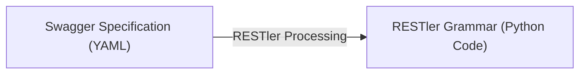

# ⚡ RESTler: Stateful REST API Fuzzing

> 📜 **Publication Info**
> * **Authors:** Vaggelis Atlidakis\* *(Columbia University)*, Patrice Godefroid *(Microsoft Research)*, Marina Polishchuk *(Microsoft Research)*
> * *\*The work of this author was mostly done at Microsoft Research.*

---

## 📑 Table of Contents
- [📌 Abstract](#-abstract)
- [🚀 I. Introduction](#-i-introduction)
- [⚙️ II. Processing API Specifications](#️-ii-processing-api-specifications)
- [🧩 III. Test Generation Algorithm](#-iii-test-generation-algorithm)
- [🛠️ IV. Implementation](#️-iv-implementation)
  - [A. Using RESTler](#a-using-restler)
  - [B. Current Limitations](#b-current-limitations)
- [📊 V. Evaluation](#-v-evaluation)
  - [A. Experimental Setup](#a-experimental-setup)
  - [B. Techniques for Effective REST API Fuzzing](#b-techniques-for-effective-rest-api-fuzzing)
  - [C. Deeper Service Exploration](#c-deeper-service-exploration)
  - [D. Search Strategies](#d-search-strategies)
  - [E. Bug Bucketization](#e-bug-bucketization)
- [🐛 VI. New Bugs Found in GitLab](#-vi-new-bugs-found-in-gitlab)
- [☁️ VII. Experiences with Public Cloud Services](#️-vii-experiences-with-public-cloud-services)
- [📚 VIII. Related Work](#-viii-related-work)
- [🎯 IX. Conclusion](#-ix-conclusion)
- [🤝 X. Acknowledgements](#-x-acknowledgements)
- [🔗 References](#-references)

---

## 📌 Abstract

This paper introduces **RESTler**, the first *stateful REST API fuzzer*. RESTler analyzes the API specification of a cloud service and generates sequences of requests that automatically test the service through its API. RESTler generates test sequences by:

1. **Inferring producer-consumer dependencies** among request types declared in the specification (e.g., inferring that *"a request B should be executed after request A"* because B takes as an input a resource-ID produced by A).
2. **Analyzing dynamic feedback** from responses observed during prior test executions to generate new tests (e.g., learning that *"a request C after a request sequence A;B is refused by the service"* and therefore avoiding this combination in the future).

We present experimental results showing that these two techniques are necessary to thoroughly exercise a service under test while pruning the large search space of possible request sequences. We used RESTler to test **GitLab** (an open-source Git service) as well as several **Microsoft Azure** and **Office365** cloud services. RESTler found **28 bugs in GitLab** and several bugs in each of the Azure and Office365 cloud services tested so far. These bugs have been confirmed and fixed by the service owners.

---

## 🚀 I. Introduction

Over the last decade, we have seen an explosion in cloud services for hosting software applications (Software-as-a-Service), for building distributed services and data processing (Platform-as-a-Service), and for providing general computing infrastructure (Infrastructure-as-a-Service). Today, most cloud services, such as those provided by Amazon Web Services (AWS) [2] and Microsoft Azure [29], are programmatically accessed through REST APIs [11] by third-party applications [1] and other services [31]. Meanwhile, Swagger (recently renamed OpenAPI) [40] has arguably become the most popular interface-description language for REST APIs. A Swagger specification describes how to access a cloud service through its REST API, including what requests the service can handle, what responses may be received, and the response format.

Tools for automatically testing cloud services via their REST APIs and checking whether those services are reliable and secure are still in their infancy. The most sophisticated testing tools currently available for REST APIs capture live API traffic, and then parse, fuzz and replay the traffic with the hope of finding bugs [4], [34], [7], [41], [3]. Many of these tools were born as extensions of more established website testing and scanning tools (see Section VIII). Since these REST API testing tools are all recent and not yet widely used, it is still largely unknown how effective they are in finding bugs and how security-critical those bugs are.

In this paper, we introduce **RESTler**, the first automatic stateful REST API fuzzing tool. Fuzzing [39] means automatic test generation and execution with the goal of finding security vulnerabilities. Unlike other REST API testing tools, RESTler performs a lightweight static analysis of an entire Swagger specification, and then generates and executes tests that exercise the corresponding cloud service in a stateful manner. By *stateful*, we mean that RESTler attempts to explore service states that are reachable only using sequences of multiple requests. With RESTler, each test is defined as a sequence of requests and responses. RESTler generates tests by:

1. **Inferring dependencies among request types** declared in the Swagger specification (e.g., inferring that a resource included in the response of a request A is necessary as input argument of another request B, and therefore that A should be executed before B), and by
2. **Analyzing dynamic feedback** from responses observed during prior test executions in order to generate new tests (e.g., learning that *"a request C after a request sequence A;B is refused by the service"* and therefore avoiding this combination in the future).

We present empirical evidence showing that these two techniques are necessary to thoroughly test a service, while pruning the large search space defined by all possible request sequences. RESTler also implements several search strategies (akin to those used in model-based testing [43]) and we compare their effectiveness while fuzzing GitLab [13], an open-source self-hosted Git service with a complex REST API.

During the course of our experiments, we found **28 new bugs in GitLab** (see Section VI). We also ran experiments on four public cloud services in Microsoft Azure [29] and Office365 [30] and found several bugs in each service tested (see Section VII). 

> 💡 **Key Contributions**
> * **First Stateful REST API Fuzzer:** We introduce RESTler, which analyzes Swagger specifications, automatically infers request-type dependencies, and dynamically generates tests guided by response feedback.
> * **Necessity of Key Techniques:** We present detailed experimental evidence demonstrating that dependency inference and dynamic feedback analysis are both required for effective stateful REST API fuzzing.
> * **Search Strategy Comparison:** We evaluate three distinct strategies for navigating the exponential search space of request sequences and discuss their trade-offs.
> * **Real-World Case Study:** A comprehensive evaluation on GitLab yielded 28 confirmed new bugs.
> * **Cloud Deployment Experience:** Preliminary findings and architectural adaptations from fuzzing live Microsoft public cloud services.

The remainder of the paper is organized as follows:
* **Section II** describes how Swagger specifications are processed by RESTler.
* **Sections III & IV** present the main test-generation algorithm and implementation details.
* **Section V** presents an evaluation of test-generation techniques and search strategies.
* **Section VI** discusses new bugs found in GitLab.
* **Section VII** presents our experiences fuzzing public cloud services.
* **Section VIII** discusses related work, and **Section IX** concludes the paper.

---

## ⚙️ II. Processing API Specifications

In this paper, we consider services accessible through REST APIs described with a Swagger specification. A client program can send messages, called *requests*, to a service and receive messages back, called *responses*. Such messages are sent over the HTTP protocol. A Swagger specification describes how to access a service through its REST API (e.g., what requests the service can handle and what responses may be expected). Given a Swagger specification, open-source Swagger tools can automatically generate a web UI that allows users to view the documentation and interact with the API via a web browser.

A sample Swagger specification, in web-UI form, is shown in **Figure 1**. This specification describes the API of a simple blog posts hosting service. The API consists of five request types, specifying the endpoint, method, and required parameters. This service allows users to create, access, update, and delete blog posts. In a web browser, clicking on any of these five request types expands the description of the request type.

### 📌 Figure 1: Swagger Specification of Blog Posts Service

**`blog/posts`:** Operations related to blog posts

| Method | Endpoint | Description |
| :--- | :--- | :--- |
| **`GET`** | `/blog/posts/` | Returns list of blog posts |
| **`POST`** | `/blog/posts/` | Creates a new blog post |
| **`DELETE`** | `/blog/posts/{id}` | Deletes a blog post with matching `"id"` |
| **`GET`** | `/blog/posts/{id}` | Returns a blog post with matching `"id"` |
| **`PUT`** | `/blog/posts/{id}` | Updates a blog post with matching `"id"` and `"checksum"` |

*Figure 1: Swagger Specification of Blog Posts Service.*

---

For instance, selecting the second (`POST`) request reveals text similar to the left of Figure 2. This text is in YAML format and describes the exact syntax expected for that specific request and its response. In this case, the `definitions` part of the specification indicates that an object named `body` of type `string` is required and that an object named `id` of type `integer` is optional (since it is not required). The `paths` part of the specification describes the HTTP-syntax for this `POST` request as well as the format of the expected response.

From such a specification, RESTler automatically constructs the test-generation grammar shown on the right of Figure 2. This grammar is encoded in executable Python code. It consists of code to generate an HTTP request, of type `POST` in this case, and code to process the expected response of this request. Each function `restler_static` simply appends the string it takes as argument without modifying it. In contrast, the function `restler_fuzzable` takes as argument a value type (like `string` in this example) and replaces it by one value of that type taken from a (small) dictionary of values for that type. How dictionaries are defined and how values are selected is discussed in the next section.

### 📌 Figure 2: Swagger Specification and Automatically Derived RESTler Grammar



#### Swagger Specification (YAML)
```yaml
basePath: '/api'
swagger: '2.0'
definitions:
  "Blog_Post":
    properties:
      body:
        type: string
      id:
        type: integer
    required:
      - body
    type: object
paths:
  "/blog/posts/":
    post:
      parameters:
        - in: body
          name: payload
          required: true
          schema:
            $ref: "#/definitions/Blog_Post"
```

#### Automatically Derived RESTler Grammar (Python)
```python
from restler import requests
from restler import dependencies

def parse_posts(data):
    post_id = data["id"]
    dependencies.set_var(post_id)

request = requests.Request(
    restler_static("POST "),
    restler_static("/api/blog/posts/ "),
    restler_static("HTTP/1.1\r\n"),
    restler_static("{"),
    restler_static("\"body\":"),
    restler_fuzzable("string"),
    restler_static("}"),
    post_send={
        'parser': parse_posts,
        'dependencies': [
            post_id.writer()
        ]
    }
)
```
*Figure 2: Shows a snippet of Swagger specification in YAML (left/top) and the corresponding grammar generated by RESTler (right/bottom).*

The response is expected to return a new dynamic object (a dynamically created resource `id`) named `id` of type `integer`. Using the schema shown above, RESTler automatically generates the function `parse_posts`.

By similarly analyzing the other request types described in this Swagger specification, RESTler will infer automatically that `id`s returned by such `POST` requests are necessary to generate well-formed requests of the last three request types shown in Figure 1, which each requires an `id`. These producer-consumer dependencies are extracted by RESTler when processing the Swagger specification and are later used for test generation, as described next.

---

## 🧩 III. Test Generation Algorithm

The main algorithm for test generation used by RESTler is shown in **Figure 3** in Python-like notation. It starts (line 3) by processing a Swagger specification as discussed in the previous section. The result of this processing is a set of request types, denoted `reqSet` in Figure 3, and of their dependencies.

### 📌 Figure 3: Main Algorithm Used in RESTler

```python
# 1  Inputs: swagger_spec, maxLength
# 2  # Set of requests parsed from the Swagger API spec
# 3  reqSet = PROCESS(swagger_spec)
# 4  # Set of request sequences (initially an empty sequence \epsilon)
# 5  seqSet = { [] }
# 6  # Main loop: iterate up to a given maximum sequence length
# 7  n = 1
# 8  while (n <= maxLength):
# 9      seqSet = EXTEND(seqSet, reqSet)
# 10     seqSet = RENDER(seqSet)
# 11     n = n + 1

# 12 # Extend all sequences in seqSet by appending
# 13 # new requests whose dependencies are satisfied
# 14 def EXTEND(seqSet, reqSet):
# 15     newSeqSet = {}
# 16     for seq in seqSet:
# 17         for req in reqSet:
# 18             if DEPENDENCIES(seq, req):
# 19                 newSeqSet = newSeqSet + concat(seq, req)
# 20     return newSeqSet

# 21 # Concretize all newly appended requests using dictionary values,
# 22 # execute each new request sequence and keep the valid ones
# 23 def RENDER(seqSet):
# 24     newSeqSet = {}
# 25     for seq in seqSet:
# 26         req = last_request_in(seq)
# 27         V = tuple_of_fuzzable_types_in(req)
# 28         for v in V:
# 29             newReq = concretize(req, v)
# 30             newSeq = concat(seq, newReq)
# 31             response = EXECUTE(newSeq)
# 32             if response has a valid code:
# 33                 newSeqSet = newSeqSet + newSeq
# 34             else:
# 35                 log error
# 36     return newSeqSet

# 37 # Check that all objects referenced in a request are produced
# 38 # by some response in a prior request sequence
# 39 def DEPENDENCIES(seq, req):
# 40     if CONSUMES(req) <= PRODUCES(seq):
# 41         return True
# 42     else:
# 43         return False

# 44 # Objects required in a request
# 45 def CONSUMES(req):
# 46     return object_types_required_in(req)

# 47 # Objects produced in the responses of a sequence of requests
# 48 def PRODUCES(seq):
# 49     dynamicObjects = {}
# 50     for req in seq:
# 51         newObjs = objects_produced_in_response_of(req)
# 52         dynamicObjects = dynamicObjects + newObjs
# 53     return dynamicObjects
```
*Figure 3: Main Algorithm used in RESTler.*

---

The algorithm computes a set of request sequences, as inferred from Swagger, denoted `seqSet` and initially containing an empty sequence $\epsilon$ (line 5). A request sequence is valid if every response in the sequence has a valid return code, defined here as any code in the `200` range. At each iteration of its main loop (line 8), starting with $n=1$, the algorithm computes all valid request sequences `seqSet` of length $n$ before moving to $n+1$ and so on until a user-specified `maxLength` is reached. Computing `seqSet` is done in two steps:

1. **Extension (`EXTEND`):** The set of valid request sequences of length $n-1$ is extended (line 9) to create a set of new sequences of length $n$ by appending each request with satisfied dependencies at the end of each sequence, as described in `EXTEND` (line 14). `DEPENDENCIES` (line 39) checks if all dependencies of the specified request are satisfied. This is true when every dynamic object required by the request (`CONSUMES(req)`) is produced by some response in the preceding request sequence (`PRODUCES(seq)`). If satisfied, the new sequence of length $n$ is retained (line 19); otherwise it is discarded.

2. **Rendering (`RENDER`):** Each newly-extended request sequence whose dependencies are satisfied is rendered (line 10) one by one as described in `RENDER` (line 23). For every newly-appended request (line 26), the list of all fuzzable primitive types in the request is computed (line 27) (those identified by `restler_fuzzable`). Then, each fuzzable primitive type is concretized by substituting concrete values taken out of a finite, user-configurable dictionary of values.

For instance:
* For fuzzable type `integer`, RESTler might use a small dictionary with values `0`, `1`, and `-10`.
* For fuzzable type `string`, values could include `"sampleString"`, `""`, and a very long fixed string.

`RENDER` generates all possible combinations (line 28). Each combination corresponds to a fully-defined HTTP-syntactically correct request `newReq` (line 29). `RENDER` executes this sequence (line 31) and checks its response: if the response has a valid status code, the sequence is valid and retained (line 33); otherwise, it is discarded and the received error code is logged for analysis and debugging.

> 📌 **Execution Details**
> The function `EXECUTE` executes each request in a sequence one by one, checking that each response is valid, extracting dynamic objects, and providing those to subsequent requests. If a request sequence produces multiple dynamic objects of a given type, `EXECUTE` memoizes all of them and provides them in the exact order in which they were produced. If a dynamic object is destroyed (unusable later on), RESTler detects this via a non-200 status code and discards the sequence.

By default, `RENDER` generates all possible combinations of dictionary values. For large dictionaries, scalable alternatives include randomly sampling dictionary values or using combinatorial-testing algorithms [10].

### 🔍 Search Strategies

The function `EXTEND` performs a **Breadth-First Search (BFS)** in the search space of request sequences. In Section V, we also evaluate two additional search strategies:

#### ⚡ BFS-Fast
In `EXTEND`, instead of appending every request to every sequence, every request is appended to **at most one sequence**. This produces a smaller `newSeqSet` that covers every request type at least once without generating all valid request sequences. BFS-Fast provides full grammar coverage with far fewer request sequences, allowing deeper exploration faster than standard BFS.

#### 🎲 Random Walk
In `EXTEND`, loops at lines 17 and 18 are replaced by returning a **single new request sequence** generated by randomly selecting one sequence `seq` in `seqSet` and one request in `reqSet` whose dependencies are satisfied. This strategy explores deeper sequences much faster than BFS or BFS-Fast. When RandomWalk cannot extend the current sequence further, it restarts from an empty request sequence.

---

## 🛠️ IV. Implementation

RESTler is implemented in **3,151 lines of modular Python code** divided into three core modules:
1. **Parser & Compiler Module:** Parses Swagger specifications and generates the executable RESTler grammar.
2. **Core Fuzzing Runtime Module:** Implements the main test generation algorithm and search strategies, renders HTTP requests, processes service responses, and analyzes dynamic feedback.
3. **Garbage Collector (GC) Module:** Runs as a separate thread tracking dynamic object lifecycle and periodically deleting aging resources to prevent quota exhaustion.

---

### A. Using RESTler

RESTler operates as a command-line utility taking as input:
* A Swagger specification
* Target service parameters (IP, port, authentication credentials)
* Mutations dictionary
* Selected search strategy

Upon compilation, RESTler reports discovered endpoints along with resolved and unresolved dependencies. Unresolved dependencies can be fixed via custom annotations/mutations or left as default `restler_fuzzable` primitive strings. During fuzzing, RESTler immediately logs and reports any detected bug (defined as an HTTP `500 Internal Server Error`).

---

### B. Current Limitations

> ⚠️ **Known Limitations**
> * **HTTP Redirects:** RESTler currently does not follow server-side redirects (HTTP status codes `301`, `303`, and `307`).
> * **Oracle Scope:** Bugs are identified strictly via unexpected HTTP status codes (e.g. `500`). Oracle gaps exist for vulnerabilities that do not alter HTTP status codes (such as silent Information Exposure).

---

## 📊 V. Evaluation

Our evaluation answers three primary research questions:
* **Q1:** Are both inferring dependencies among request types and analyzing dynamic feedback necessary for effective automated REST API fuzzing? *(Section V-B)*
* **Q2:** Are tests generated by RESTler exercising deeper service-side logic as sequence length increases? *(Section V-C)*
* **Q3:** How do the three search strategies implemented in RESTler compare across various APIs? *(Section V-D)*

---

### A. Experimental Setup

#### 1. Blog Posts Service
Used to answer **Q1**. Written in 189 LOC of Python using the Flask framework [12] with the Swagger API shown in Figure 1. Exposes five request types (`GET /posts`, `POST /posts`, `DELETE /posts/{id}`, `GET /posts/{id}`, `PUT /posts/{id}`). A planted bug raises an uncaught exception during a `PUT` update if the provided checksum matches the recorded checksum of the blog post.

#### 2. GitLab
Used to answer **Q2** and **Q3**. Production-grade self-hosted Git web service (376K+ LOC Ruby on Rails [35]). Deployed with Nginx proxying 15 Unicorn workers (2GB RAM limit), PostgreSQL (10 worker pool), Sidekiq queues, and Redis workers. Recommended to scale up to 4,000 concurrent users [15].

#### 3. Fuzzing Dictionaries
Primitives defined as:
* `string`: `"sampleString"`, `""` (empty string)
* `integer`: `"0"`, `"1"`
* `boolean`: `"true"`, `"false"`

All experiments were conducted on Ubuntu 16.04 Microsoft Azure VMs configured with 8 Intel Xeon E5-2673 v3 @ 2.40GHz CPU cores and 56GB RAM.

---

### B. Techniques for Effective REST API Fuzzing

To evaluate **Q1**, we tested the Blog Posts Service under three distinct algorithmic configurations (sequence length up to 3):
1. **No Dependencies:** Ignores dependencies, treats IDs/checksums as fuzzable strings, uses dynamic feedback.
2. **No Dynamic Feedback:** Ignores dynamic feedback (does not prune invalid sequences), uses dependency inference.
3. **RESTler (Both):** Full algorithm using both dependency inference and dynamic feedback.

#### 📌 Figure 4 Summary: Blog Posts Service Fuzzing Performance

> 📊 **Experimental Findings (Figure 4 Overview)**
> * **Code Coverage:** Without dependency inference (Config 1), code coverage plateaus at **~130 LOC**. With dependency inference (Configs 2 & 3), coverage reaches **~150 LOC**. Without dynamic feedback (Config 2), reaching 150 LOC requires **>4,600 test cases and 1,750 seconds**. Using both (Config 3 / RESTler), the same coverage is reached in **only 179 seconds with <800 test cases**.
> * **HTTP Response Codes:** Ignoring dynamic feedback leads to a surge of over **7,000 40X status codes** (~60%). RESTler's combined approach reduces 40X errors to **20%** while maximizing 20X success responses to **~80%**.
> * **Bug Discovery:** Only configurations utilizing dependency inference trigger the planted `500 Internal Server Error` bug during dynamic `PUT` updates. RESTler finds the bug with the minimum number of total tests.

---

### C. Deeper Service Exploration

To answer **Q2**, we fuzzed six GitLab API groups using BFS with a 5-hour timeout per group (maximum 1,000 fuzzable combinations per request).

#### 📌 Table I: Testing Common GitLab APIs with RESTler
*Shows the increase in sequence length, code coverage, tests executed, `seqSet` size, and the number of dynamic objects being created using BFS, until a 5-hours timeout is reached.*

| API Group | Total Requests | Seq. Len. | Coverage Increase (LOC) | Tests Executed | `seqSet` Size | Dynamic Objects |
| :--- | :---: | :---: | :---: | :---: | :---: | :---: |
| **Commits** | 11 | 1 | 598 | 1 | 2 | 7 |
| | | 2 | 1108 | 5 | 10 | 46 |
| | | 3 | 1196 | 250 | 521 | 2220 |
| | | 4 | 1760 | 1341 | 6577 | 12518 |
| | | 5 | 1760 | 3667 | 20679 | - |
| **Branches** | 7 | 1 | 598 | 1 | 1 | 1 |
| | | 2 | 1089 | 8 | 6 | 11 |
| | | 3 | 1172 | 58 | 44 | 107 |
| | | 4 | 1182 | 576 | 387 | 1279 |
| | | 5 | 1185 | 3644 | 5528 | 9336 |
| **Issues** | 22 | 1 | 816 | 37 | 37 | 37 |
| | | 2 | 1163 | 2444 | 1839 | 4245 |
| | | 3 | 1163 | 4156 | 15658 | 8870 |
| **Repos** | 10 | 1 | 598 | 1 | 1 | 1 |
| | | 2 | 1117 | 97 | 65 | 206 |
| | | 3 | 1181 | 5153 | 2194 | 15472 |
| **Groups** | 50 | 1 | 887 | 39 | 39 | 38 |
| | | 2 | 1177 | 3508 | 3360 | 5204 |
| | | 3 | 1177 | 4817 | 79518 | 8946 |
| **Projects** | 48 | 1 | 934 | 42 | 41 | 38 |
| | | 2 | 1192 | 1870 | 1781 | 3343 |
| | | 3 | 1203 | 3226 | 18173 | 7374 |

> 💡 **Observation**
> Sequence length growth directly correlates with increased code coverage. Complex business operations (such as selecting a commit requiring `project-id` $\rightarrow$ create commit $\rightarrow$ `commit-id`) require request sequences of length $\ge 3$.

---

### D. Search Strategies

To answer **Q3**, we evaluated BFS, BFS-Fast, and RandomWalk across GitLab APIs over 1, 3, and 5-hour intervals.

#### 📌 Table II: Comparison of BFS, BFS-Fast, and Random Walk over Time
*Shows maximum sequence length, LOC coverage increase, and `seqSet` size after 1, 3, and 5 hours. Total requests and average feasible request renderings (\*) are listed in Column 2.*

| API | Total Req. (\*) | Time (hrs) | BFS Len. | BFS Cov. | BFS `seqSet` | BFS-Fast Len. | BFS-Fast Cov. | BFS-Fast `seqSet` | Random Walk Len. (Restarts) | Random Walk Cov. | Random Walk `seqSet` |
| :--- | :---: | :---: | :---: | :---: | :---: | :---: | :---: | :---: | :---: | :---: | :---: |
| **Commits** | 11 (*11) | 1 | 4 | 1202 | 1697 | 7 | 1285 | 16 | 13 (35) | 1295 | 1 |
| | | 3 | 5 | 1760 | 6577 | 9 | 1731 | 24 | 13 (56) | 1303 | 1 |
| | | 5 | 5 | 1760 | 20679 | 12 | 1731 | 33 | 15 (82) | 1303 | 1 |
| **Branches** | 7 (*2) | 1 | 5 | 1182 | 1154 | 21 | 1182 | 24 | 15 (24) | 1182 | 1 |
| | | 3 | 5 | 1185 | 1178 | 37 | 1187 | 42 | 19 (92) | 1187 | 1 |
| | | 5 | 5 | 1185 | 5528 | 47 | 1178 | 53 | 22 (158) | 1208 | 1 |
| **Issues** | 22 (*82) | 1 | 2 | 1150 | 1086 | 2 | 1086 | 3 | 10 (1) | 770 | 1 |
| | | 3 | 3 | 1163 | 1551 | 4 | 1551 | 6 | 10 (1) | 770 | 1 |
| | | 5 | 3 | 1163 | 15658 | 5 | 1570 | 26 | 16 (2) | 847 | 1 |
| **Repos** | 10 (*24) | 1 | 3 | 1127 | 1141 | 5 | 1141 | 12 | 10 (29) | 1195 | 1 |
| | | 3 | 3 | 1127 | 1141 | 7 | 1141 | 16 | 13 (88) | 1231 | 1 |
| | | 5 | 3 | 1181 | 2194 | 8 | 1161 | 64 | 13 (142) | 1231 | 1 |
| **Groups** | 50 (*2) | 1 | 2 | 961 | 1275 | 6 | 1275 | 7 | 19 (41) | 1167 | 1 |
| | | 3 | 3 | 1177 | 1275 | 11 | 1275 | 13 | 19 (120) | 1250 | 1 |
| | | 5 | 3 | 1177 | 79518 | 14 | 1275 | 130 | 22 (186) | 1283 | 1 |
| **Projects** | 48 (*4) | 1 | 2 | 1006 | 1318 | 5 | 1318 | 7 | 4 (3) | 889 | 1 |
| | | 3 | 2 | 1053 | 1319 | 11 | 1319 | 14 | 22 (31) | 1024 | 1 |
| | | 5 | 3 | 1203 | 18173 | 15 | 1319 | 171 | 22 (45) | 1273 | 1 |

---

### E. Bug Bucketization

To group redundant `500 Internal Server Errors`, RESTler applies a suffix-matching bucketization scheme:
* For each new bug, RESTler computes all non-empty suffixes of its request sequence.
* If a suffix matches a previously recorded bug sequence, it is grouped into that existing bucket.
* Otherwise, a new bug bucket is created.

#### 📌 Table III: Bug Buckets Found by Search Strategies (5-Hour Runs)

| API Group | BFS | BFS-Fast | RandomWalk | Intersection | Union (Total Unique) |
| :--- | :---: | :---: | :---: | :---: | :---: |
| **Commits** | 5 | 1 | 5 | 1 | 5 |
| **Branches** | 7 | 5 | 7 | 5 | 8 |
| **Issues** | 0 | 1 | 1 | 0 | 1 |
| **Repos** | 2 | 3 | 2 | 2 | 3 |
| **Groups** | 0 | 0 | 2 | 0 | 2 |
| **Projects** | 2 | 3 | 1 | 1 | 3 |
| **Total** | **16** | **13** | **21** | **9** | **22** |

> 🏆 **Strategy Insights**
> **RandomWalk** discovered the highest number of unique bugs (**21 out of 22**), outperforming BFS (16) and BFS-Fast (13), even in scenarios where its code coverage was lower. Search strategies demonstrate high complementarity.

---

## 🐛 VI. New Bugs Found in GitLab

Across all fuzzing sessions on GitLab, RESTler discovered **28 new unique bugs**. All were reported, confirmed, and patched.

### 📝 Case Study Examples

#### 1. Bug in Commits API
Triggered when cherry-picking a commit to a branch with an empty string as its name (`""`). Incomplete input validation passed the empty branch string from Ruby to a native C function expecting `NULL` or a valid entry. The C function threw an unhandled exception resulting in a `500 Internal Server Error`.
* **Reproduction Steps:** (1) Create project $\rightarrow$ (2) Create new branch $\rightarrow$ (3) Post valid commit $\rightarrow$ (4) Cherry-pick commit to branch `""`.

#### 2. Bug in Branches API
Triggered when attempting to edit a branch of a recently deleted project. Invalid operation serialization caused a database update using an invalid foreign key (`project_id`). This triggered a `PG::ForeignKeyViolation` exception and returned a `500 Internal Server Error`.
* **Reproduction Steps:** (1) Create project $\rightarrow$ (2) Create branch $\rightarrow$ (3) Delete project $\rightarrow$ (4) Edit branch of deleted project.

> 🧠 **Common Bug Pattern**
> 1. RESTler executes a sequence that drives the target service deep into a valid target state.
> 2. While in that state, RESTler issues a request containing an unexpected fuzzed payload or an out-of-order action.

---

## ☁️ VII. Experiences with Public Cloud Services

RESTler was deployed against three **Microsoft Azure** services and one **Microsoft Office365** service. RESTler uncovered confirmed bugs across all four public cloud services.

### 🛠️ Production Challenges & Architectural Extensions

#### 1. Resource Quotas & Garbage Collection (GC)
* **Challenge:** Public clouds enforce strict per-tenant resource quotas. Continuous resource creation leads to quota exhaustion, blocking future tests.
* **Solution:** Implemented an asynchronous **Garbage Collector thread** in RESTler that monitors created dynamic resources and periodically deletes aging resources.

#### 2. Short-Lived Access Tokens
* **Challenge:** Public cloud services mandate OAuth/HTTPS bearer tokens with short expiration windows rather than static tokens.
* **Solution:** Introduced an **Authentication Hook** in RESTler that periodically executes user-provided token refresh scripts and updates active credentials across the worker pool.

#### 3. Application-Specific Naming Schemes
* **Challenge:** Non-standard REST APIs or incomplete Swagger specs cause missing dynamic dependencies.
* **Solution:** Supported custom **Swagger Annotations** and **Resource-Specific Mutations** (e.g., custom IP format generators or dynamic `PUT` resource name extractors).

---

## 📚 VIII. Related Work

| Category | Related Work / Tools | Contrast with RESTler |
| :--- | :--- | :--- |
| **HTTP Fuzzers** | Burp [8], Sulley [38], BooFuzz [7], AppSpider [4], Qualys WAS [34], TnT-Fuzzer [41], APIFuzzer [3] | Rely on pre-recorded traffic or single-request fuzzing. RESTler automatically infers stateful dependencies directly from Swagger specs without pre-recorded traffic. |
| **Feedback-Directed Testing** | Randoop [32] | Randoop tests object-oriented code types. RESTler handles untyped, implicit REST resources and dynamic response feedback for cloud APIs. |
| **Model-Based Testing** | FSM testing [42, 43], Grammar coverage [26] | Inspires RESTler's BFS-Fast strategy to achieve full grammar coverage efficiently. |
| **Grammar-Based Fuzzers** | Peach [33], SPIKE [37], Learn&Fuzz [24] | Require manual grammar authoring. RESTler automatically generates executable grammars from Swagger specs. |
| **Whitebox Fuzzing** | DART [22], EXE [9], SAGE [23] | Rely on dynamic symbolic execution. RESTler is blackbox, operating across complex distributed cloud endpoints. |
| **Penetration Testing** | Manual Pen Testing | Labor-intensive and manual. RESTler automates stateful REST API bug discovery to complement pen testing. |

---

## 🎯 IX. Conclusion

RESTler is the first automatic tool for stateful fuzzing of cloud services through their REST APIs. By combining static dependency analysis of Swagger specifications with dynamic response feedback, RESTler effectively navigates complex multi-request state spaces. RESTler uncovered **28 bugs in GitLab** and multiple confirmed vulnerabilities in production **Microsoft Azure** and **Office365** cloud services. RESTler provides a clear methodology for automated vulnerability discovery in modern cloud APIs.

---

## 🤝 X. Acknowledgements

We thank William Blum, Dave Tamasi, and David Molnar for their helpful comments, and the Microsoft Security Risk Detection team for their support. We thank Albert Greenberg, Mark Russinovich, and John Walton from Microsoft Azure. Finally, we thank the GitLab and Microsoft developers for graciously acknowledging, discussing, and fixing the bugs found during this work.

---

## 🔗 References

1. S. Allamaraju. *RESTful Web Services Cookbook*. O'Reilly, 2010.
2. Amazon. AWS. `https://aws.amazon.com/`.
3. APIFuzzer. `https://github.com/KissPeter/APIFuzzer`.
4. AppSpider. `https://www.rapid7.com/products/appspider`.
5. M. Barnett, M. Fahndrich, and F. Logozzo. Embedded Contract Languages. In *Proc. SAC-OOPS*, 2010.
6. O. Bastani et al. Synthesizing Program Input Grammars. In *Proc. PLDI*, 2017.
7. BooFuzz. `https://github.com/jtpereyda/boofuzz`.
8. Burp Suite. `https://portswigger.net/burp`.
9. C. Cadar et al. EXE: Automatically Generating Inputs of Death. In *Proc. CCS*, 2006.
10. D. M. Cohen et al. The Combinatorial Design Approach to Automatic Test Generation. *IEEE Software*, 13(5), 1996.
11. R. T. Fielding. Architectural Styles and the Design of Network-based Software Architectures. *PhD Thesis, UC Irvine*, 2000.
12. Flask. Web development, one drop at a time. `http://flask.pocoo.org/`.
13. GitLab. `https://about.gitlab.com`.
14. GitLab API Documentation. `https://docs.gitlab.com/ee/api/`.
15. GitLab Hardware Requirements. `https://docs.gitlab.com/ce/install/requirements.html`.
16. GitLab Sample Bug 1. `https://gitlab.com/gitlab-org/gitlab-ce/issues/50955`.
17. GitLab Sample Bug 2. `https://gitlab.com/gitlab-org/gitlab-ce/issues/50265`.
18. GitLab Sample Bug 3. `https://gitlab.com/gitlab-org/gitlab-ce/issues/50270`.
19. GitLab Sample Bug 4. `https://gitlab.com/gitlab-org/gitlab-ce/issues/50949`.
20. GitLab Statistics. `https://about.gitlab.com/is-it-any-good/`.
21. P. Godefroid, A. Kiezun, and M. Y. Levin. Grammar-based Whitebox Fuzzing. In *Proc. PLDI*, 2008.
22. P. Godefroid, N. Klarlund, and K. Sen. DART: Directed Automated Random Testing. In *Proc. PLDI*, 2005.
23. P. Godefroid, M. Levin, and D. Molnar. Automated Whitebox Fuzz Testing. In *Proc. NDSS*, 2008.
24. P. Godefroid, H. Peleg, and R. Singh. Learn&Fuzz: Machine Learning for Input Fuzzing. In *Proc. ASE*, 2017.
25. M. Höschele and A. Zeller. Mining Input Grammars from Dynamic Taints. In *Proc. ASE*, 2016.
26. R. Lämmel and W. Schulte. Controllable Combinatorial Coverage in Grammar-Based Testing. In *Proc. TestCom*, 2006.
27. R. Majumdar and R. Xu. Directed Test Generation using Symbolic Grammars. In *Proc. ASE*, 2007.
28. B. Meyer. *Eiffel*. Prentice-Hall, 1992.
29. Microsoft Azure. `https://azure.microsoft.com/`.
30. Microsoft Office. `https://www.office.com/`.
31. S. Newman. *Building Microservices*. O'Reilly, 2015.
32. C. Pacheco et al. Feedback-Directed Random Test Generation. In *Proc. ICSE*, 2007.
33. Peach Fuzzer. `http://www.peachfuzzer.com/`.
34. Qualys Web Application Scanning (WAS). `https://www.qualys.com/apps/web-app-scanning/`.
35. Ruby on Rails. `http://rubyonrails.org`.
36. D. She et al. Neuzz: Efficient fuzzing with neural program learning. *CoRR*, abs/1807.05620, 2018.
37. SPIKE Fuzzer. `http://resources.infosecinstitute.com/fuzzer-automation-with-spike/`.
38. Sulley Fuzzer. `https://github.com/OpenRCE/sulley`.
39. M. Sutton, A. Greene, and P. Amini. *Fuzzing: Brute Force Vulnerability Discovery*. Addison-Wesley, 2007.
40. Swagger OpenAPI. `https://swagger.io/`.
41. TnT-Fuzzer. `https://github.com/Teebytes/TnT-Fuzzer`.
42. M. Utting et al. A Taxonomy of Model-Based Testing Approaches. *STVR*, 22(5), 2012.
43. M. Yannakakis and D. Lee. Testing Finite-State Machines. In *Proc. STOC*, 1991.
