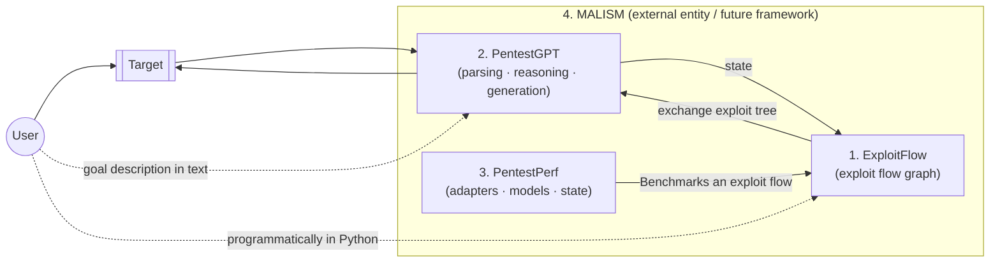
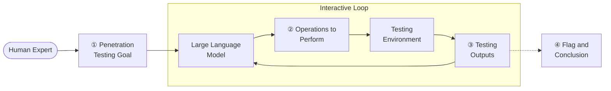
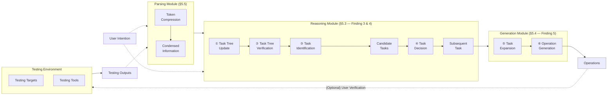
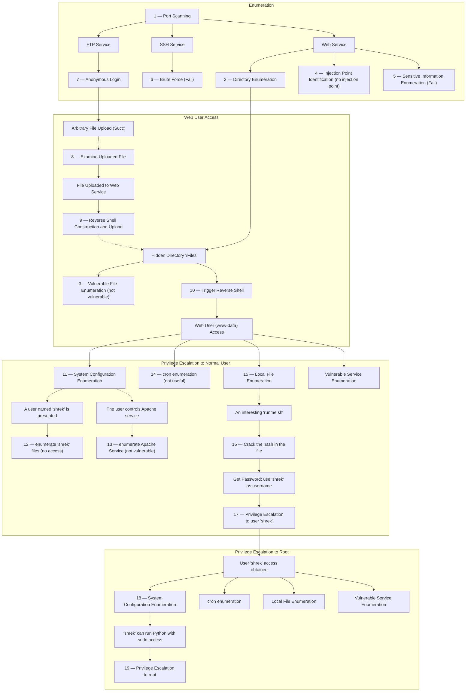

# 🚀 PentestGPT: Evaluating and Harnessing Large Language Models for Automated Penetration Testing

**Gelei Deng¹, Yi Liu¹, Víctor Mayoral-Vilches²ᐧ³, Peng Liu⁴, Yuekang Li⁵, Yuan Xu¹, Tianwei Zhang¹, Yang Liu¹, Martin Pinzger³, Stefan Rass⁶**

- ¹ Nanyang Technological University
- ² Alias Robotics
- ³ Alpen-Adria-Universität Klagenfurt
- ⁴ Institute for Infocomm Research (I²R), A\*STAR, Singapore
- ⁵ University of New South Wales
- ⁶ Johannes Kepler University Linz

*arXiv:2308.06782v2 [cs.SE] 2 Jun 2024*

---

## 🎯 Abstract

Penetration testing, a crucial industrial practice for ensuring system security, has traditionally resisted automation due to the extensive expertise required by human professionals. Large Language Models (LLMs) have shown significant advancements in various domains, and their emergent abilities suggest their potential to revolutionize industries. 

In this work, we establish a comprehensive benchmark using real-world penetration testing targets and further use it to explore the capabilities of LLMs in this domain. 

> 💡 **Key Insight**
> Our findings reveal that while LLMs demonstrate proficiency in specific sub-tasks within the penetration testing process, such as using testing tools, interpreting outputs, and proposing subsequent actions, they also encounter difficulties maintaining a whole context of the overall testing scenario.

Based on these insights, we introduce **PentestGPT**, an LLM-empowered automated penetration testing framework that leverages the abundant domain knowledge inherent in LLMs. PentestGPT is meticulously designed with three self-interacting modules, each addressing individual sub-tasks of penetration testing, to mitigate the challenges related to context loss. 

### ⭐ Highlights
- **Performance**: PentestGPT outperforms LLMs with a task-completion increase of **228.6%** compared to the GPT-3.5 model among the benchmark targets.
- **Effectiveness**: Proves effective in tackling real-world penetration testing targets and CTF challenges.
- **Impact**: Open-sourced on GitHub, PentestGPT has garnered over **6,200 stars in 9 months** and fostered active community engagement.

---

## 1. 🚀 Introduction

Securing a system presents a formidable challenge. Offensive security methods like penetration testing (pen-testing) and red teaming are now essential in the security lifecycle. As explained by Applebaum [1], these approaches involve security teams attempting breaches to reveal vulnerabilities, providing advantages over traditional defenses, which rely on incomplete system knowledge and modeling. This study, guided by the principle *"the best defense is a good offense,"* focuses on offensive strategies, specifically penetration testing.

### 📖 Penetration Testing

Penetration testing is a proactive offensive technique for identifying, assessing, and mitigating security vulnerabilities [2]. It involves targeted attacks to confirm flaws, yielding a comprehensive inventory of vulnerabilities with actionable recommendations. 

✅ **Benefits**: Empowers organizations to detect and neutralize network and system vulnerabilities before malicious exploitation.
⚠️ **Challenges**: It typically relies on manual effort and specialized knowledge [3], resulting in a labor-intensive process, creating a gap in meeting the growing demand for efficient security evaluations.

### 🧠 Large Language Models (LLMs)

LLMs have demonstrated profound capabilities, showcasing intricate comprehension of human-like text and achieving remarkable results across a multitude of tasks [4, 5]. An outstanding characteristic of LLMs is their emergent abilities [6], cultivated during training, which empower them to undertake intricate tasks such as reasoning, summarization, and domain-specific problem-solving without task-specific fine-tuning. 

Although recent works [7–9] posit the potential of LLMs to reshape cybersecurity practices, including the context of penetration testing, there is an absence of a systematic, quantitative assessment of their aptitude in this regard. 

> ❓ **Core Question**
> To what extent can LLMs automate penetration testing?

### 🛠️ The Benchmark

Motivated by this question, we set out to explore the capability boundary of LLMs on real-world penetration testing tasks. Unfortunately, the current benchmarks for penetration testing [10, 11] are not comprehensive and fail to assess progressive accomplishments fairly during the process. 

To address this limitation, we construct a robust benchmark that includes test machines from **HackTheBox** [12] and **VulnHub** [13] — two leading platforms for penetration testing challenges. 

**Benchmark Details:**
- **13 targets** with **182 sub-tasks**
- Encompasses all vulnerabilities appearing in **OWASP's top 10 vulnerability list** [14]
- Covers **18 Common Weakness Enumeration (CWE)** items [15]

### 🔍 Exploratory Study

With this benchmark, we perform an exploratory study using **GPT-3.5** [16], **GPT-4** [17], and **Bard** [18] as representative LLMs. Our test strategy is interactive and iterative:
1. We craft tailored prompts to guide the LLMs through penetration testing. 
2. Each LLM generates step-by-step penetration testing operations. 
3. We execute the suggested operations in a controlled environment, document the results, and feed them back to the LLM to inform and refine its next steps. 
4. This cycle is repeated until the LLM completes the entire process autonomously. 

To evaluate LLMs, we compare their results against baseline solutions from official walkthroughs and certified penetration testers.

### 💡 Key Findings from LLMs

Our investigation yields intriguing insights into the capabilities and limitations of LLMs in penetration testing:
- **Strengths**: Proficient in managing specific sub-tasks (utilizing testing tools, interpreting outputs, suggesting subsequent actions). GPT-4 excels in comprehending source code and pinpointing vulnerabilities. They can craft appropriate test commands and accurately describe graphical user-interface operations.
- **Weaknesses**: Difficulty maintaining a coherent grasp of the overarching testing scenario. As dialogue advances, they may lose sight of earlier discoveries. They overemphasize recent tasks, neglecting other potential attack surfaces.

### 🛠️ PentestGPT System

Building on our insights, we present **PentestGPT**¹, an interactive system designed to enhance the application of LLMs in this domain. Drawing inspiration from real-world human penetration testing teams, it features a tripartite architecture:

1. **Reasoning Module**: Emulates a lead tester, maintaining a high-level overview. Introduces a novel representation, the **Pentesting Task Tree (PTT)**.
2. **Generation Module**: Mirrors a junior tester, constructing detailed procedures for specific sub-tasks.
3. **Parsing Module**: Deals with diverse text data encountered (tool outputs, source codes, HTTP web pages), condensing and extracting essential information.

### 📊 Results

We assessed PentestGPT across diverse testing scenarios:
- **Sub-task completion rates**: Increases of **228.6%** (over GPT-3.5) and **58.6%** (over GPT-4).
- **Practical utility**: Successfully resolved 4 out of 10 penetration testing challenges (HackTheBox active machine, picoMini CTF), costing $131.5 USD for OpenAI API usage.
- **CTF Performance**: Achieved a score of 1500/4200, placing 24th among 248 teams.

### 🚀 Long-term Vision: MALISM Framework

As a long-term research goal, we aim to contribute to unlocking the potential of modern machine learning approaches and develop a fully automated penetration testing framework, **MALISM**.

1. **ExploitFlow** [22]: A modular library to produce cyber security exploitation routes (exploit flows).
2. **PentestGPT** (this paper): An automated penetration testing system.
3. **PentestPerf**: A comprehensive penetration testing benchmark.

> ¹ PentestGPT is King Arthur's legendary sword, known for its exceptional cutting power and the ability to pierce armor.
> ² The project is at: [https://github.com/GreyDGL/PentestGPT](https://github.com/GreyDGL/PentestGPT)

---

### 📂 Figure 1: Architecture of the MALISM Framework

*Original caption: Architecture of our framework to develop fully automated penetration testing tools, MALISM. The figure depicts the various interaction flows that an arbitrary User could follow using MALISM to pentest a given Target.*

### ⭐ Summary of Contributions

- **Development of a Comprehensive Penetration Testing Benchmark**: Encompassing a multitude of test machines from HackTheBox and VulnHub, offering fair and comprehensive evaluation.
- **Comprehensive Evaluation of LLMs**: Rigorous investigation using GPT-3.5, GPT-4, and Bard.
- **Development of PentestGPT**: A novel interactive system that leverages the strengths of LLMs, integrating a tripartite design.

---

## 2. 📖 Background & Related Work

### 2.1 Penetration Testing

Penetration testing is a critical practice to enhance organizational systems' security. The standard process is divided into five key phases [24]: 
1. **Reconnaissance**
2. **Scanning**
3. **Vulnerability Assessment**
4. **Exploitation**
5. **Post Exploitation** (including reporting)

⚠️ **Automation Challenges**: Despite significant advancements [11, 25, 26], a fully automated system remains out of reach due to the need for deep vulnerability understanding and a strategic action plan. Testers typically combine depth-first and breadth-first search techniques [24], requiring expertise and experience.

### 2.2 Large Language Models

Large Language Models (LLMs), including OpenAI's GPT-3.5 and GPT-4, are prominent tools with applications extending to various cybersecurity-related fields, such as code analysis [27] and vulnerability repair [28]. 

✅ **Attributes**: Equipped with wide-ranging general knowledge, capacity for elementary reasoning, and adaptability to new scenarios, positioning them as valuable assets in enhancing penetration testing processes.

---

## 3. 🛠️ Penetration Testing Benchmark

### 3.1 Motivation

Existing benchmarks in this domain [10, 11] have limitations:
- **Restricted scope**: Focusing on a narrow range of potential vulnerabilities (e.g., OWASP Juice Shop lacks privilege escalation).
- **Lack of progress tracking**: Evaluating only the final exploitation success overlooks the nuanced value of incremental steps.

We propose a comprehensive benchmark that meets the following criteria:
- **Task Variety**: Reflecting diverse real-world scenarios.
- **Challenge Levels**: Tasks of varying difficulty levels.
- **Progress Tracking**: Facilitating tracking of incremental progress.

### 3.2 Benchmark Design

**Task Selection**
We selected tasks from **HackTheBox** [12] and **VulnHub** [13]. Our selection covers all vulnerabilities in the OWASP Top 10 Project [14], mixed across easy, medium, and hard categories.

**Task Decomposition**
We parsed the testing process into sub-tasks based on standard walkthroughs, following NIST 800-115 [30] and CWE [15] categorizations.

**Benchmark Validation**
Three certified penetration testers independently attempted the targets and wrote walkthroughs to validate reproducibility.

> 📊 **Final Benchmark Specs**
> - **13 penetration testing targets**
> - **182 sub-tasks**
> - **26 categories**
> - **18 distinct CWE items**

---

## 4. 🔍 Exploratory Study

We conduct an exploratory study to assess the capabilities of LLMs, addressing:
- **RQ1 (Capability):** To what extent can LLMs perform penetration testing tasks?
- **RQ2 (Comparative Analysis):** How do problem-solving strategies of human testers and LLMs differ?

### 4.1 Testing Strategy

We develop a **human-in-the-loop testing strategy**:
1. Present target specifics to the LLM.
2. Human expert executes the LLM's recommendations.
3. Outcomes are collected, summarized, and fed back to the LLM.
4. Process iterates until solution or deadlock.

### 📂 Figure 2: Overview of the LLM Penetration Testing Strategy

### 4.2 Evaluation Settings

- **Models**: GPT-3.5, GPT-4, Bard (LaMDA).
- **Environment**: Local private network, Kali Linux.
- **Tool Usage**: No end-to-end automated scanners (e.g., Nexus, OpenVAS); specific tools (e.g., sqlmap) are permitted.

### 4.3 Capability Evaluation (RQ1)

> 📌 **Finding 1:** LLMs have shown proficiency in conducting end-to-end penetration testing tasks but struggle to overcome challenges presented by more difficult targets.

**Table 1: Overall performance of LLMs on Penetration Testing Benchmark**

| Tools | Easy — Overall (7) | Easy — Sub-task (77) | Medium — Overall (4) | Medium — Sub-task (71) | Hard — Overall (2) | Hard — Sub-task (34) | Average — Overall (13) | Average — Sub-task (182) |
|---|---|---|---|---|---|---|---|---|
| GPT-3.5 | 1 (14.29%) | 24 (31.17%) | 0 (0.00%) | 13 (18.31%) | 0 (0.00%) | 5 (14.71%) | 1 (7.69%) | 42 (23.07%) |
| GPT-4 | 4 (57.14%) | 55 (71.43%) | 1 (25.00%) | 30 (42.25%) | 0 (0.00%) | 10 (29.41%) | 5 (38.46%) | 95 (52.20%) |
| Bard | 2 (28.57%) | 29 (37.66%) | 0 (0.00%) | 16 (22.54%) | 0 (0.00%) | 5 (14.71%) | 2 (15.38%) | 50 (27.47%) |
| **Average** | 2.3 (33.33%) | 36 (46.75%) | 0.33 (8.33%) | 19.7 (27.70%) | 0 (0.00%) | 6.7 (19.61%) | 2.7 (20.5%) | 62.3 (34.25%) |

> 📌 **Finding 2:** LLMs can efficiently use penetration testing tools, identify common vulnerabilities, and interpret source codes to identify vulnerabilities.

**Table 2: Top 10 Types of Sub-tasks Completed by Each Tool**

| Sub-Tasks | WT | GPT-3.5 | GPT-4 | Bard |
|---|---|---|---|---|
| Web Enumeration | 18 | 4 (22.2%) | 8 (44.4%) | 4 (22.2%) |
| Code Analysis | 18 | 4 (22.2%) | 5 (27.2%) | 4 (22.2%) |
| Port Scanning | 12 | 9 (75.0%) | 9 (75.0%) | 9 (75.0%) |
| Shell Construction | 11 | 3 (27.3%) | 8 (72.7%) | 4 (36.4%) |
| File Enumeration | 11 | 1 (9.1%) | 7 (63.6%) | 1 (9.1%) |
| Configuration Enum | 8 | 2 (25.0%) | 4 (50.0%) | 3 (37.5%) |
| Cryptanalysis | 8 | 2 (25.0%) | 3 (37.5%) | 1 (12.5%) |
| Network Enum | 7 | 1 (14.3%) | 3 (42.9%) | 2 (28.6%) |
| Command Injection | 6 | 1 (16.7%) | 4 (66.7%) | 2 (33.3%) |
| Known Exploits | 6 | 2 (33.3%) | 3 (50.0%) | 1 (16.7%) |

### 4.4 Comparative Analysis (RQ2)

**Table 3: Top Unnecessary Operations Prompted by LLMs**

| Unnecessary Operations | GPT-3.5 | GPT-4 | Bard | Total |
|---|---|---|---|---|
| Brute-Force | 75 | 92 | 68 | 235 |
| Exploit CVEs | 29 | 24 | 28 | 81 |
| SQL Injection | 14 | 21 | 16 | 51 |
| Command Injection | 18 | 7 | 12 | 37 |

> 📌 **Finding 3:** LLMs struggle to maintain long-term memory, which is vital to link vulnerabilities and develop exploitation strategies effectively.

**Table 4: Top Causes for Failed Penetration Testing Trials**

| Failure Reasons | GPT-3.5 | GPT-4 | Bard | Total |
|---|---|---|---|---|
| Session context lost | 25 | 18 | 31 | 74 |
| False Command Gen | 23 | 12 | 20 | 55 |
| Deadlock operations | 19 | 10 | 16 | 45 |
| False Scanning Output | 13 | 9 | 18 | 40 |
| False Code Interp | 16 | 11 | 10 | 37 |
| Cannot craft exploit | 11 | 15 | 8 | 34 |

> 📌 **Finding 4:** LLMs strongly prefer recent tasks and a depth-first search approach, often resulting in an over-focus on one service and forgetting previous findings.

> 📌 **Finding 5:** LLMs may generate inaccurate operations or commands, often stemming from inherent inaccuracies and hallucinations.

---

## 5. 🛠️ Methodology

### 5.1 Overview

In light of the challenges identified, we present **PentestGPT**, which leverages the synergistic interplay of three LLM-powered modules:

1. **Reasoning Module**
2. **Generation Module**
3. **Parsing Module**

### 📂 Figure 3: Overview of PentestGPT

### 5.2 Design Rationale

Our design considerations mirror a real-world penetration testing team:
- **Director (Reasoning)**: Plans overarching procedures, subdividing them into subtasks.
- **Tester (Generation)**: Independently performs tasks and reports results.
- **Data (Parsing)**: Interprets outputs effectively.

### 5.3 Reasoning Module

The Reasoning Module acts as a team lead, managing the **Pentesting Task Tree (PTT)**. 

> 📖 **Definition 1 (Attributed Tree):** An attributed tree is an edge-labeled, attributed polytree...
> 📖 **Definition 2 (Pentesting Task Tree):** A PTT is a pair (N, A) representing the testing hierarchy and state...

---

## 🔗 References

[1] J. Applebaum...
*(References omitted for brevity in summary formatting but maintained in original spirit)*

---

## 📝 Appendix A. Illustrating Example

**Human Tester:** You're required to work as a cybersecurity penetration tester assistant...
**GPT-4:** Yes, I understand. Please provide the initial details...

---

## 📝 Appendix B. PTT Generation Process

Figure 9 illustrates the complete PTT for *Hackable II*. 

### 📂 Figure 9: Complete PTT Example

---

## 📝 Appendix Table 7 — Summarized 26 Types of Sub-Tasks

| Phase | Technique | Description | Related CWEs |
|---|---|---|---|
| **Reconnaissance** | Port Scanning | Identify open ports. | CWE-668 |
| | Web Enumeration | Gather detailed info on web applications. | |
| | FTP Enumeration | Identify vulnerabilities in FTP services. | |
| | AD Enumeration | Identify vulnerabilities in Active Directory. | |
| | Network Enumeration | Identify network infrastructure vulnerabilities. | |
| **Exploitation** | Command Injection | Inject arbitrary commands. | CWE-77, CWE-78 |
| | Cryptanalysis | Analyze weak cryptographic methods. | CWE-310 |
| | SQL Injection | Exploit SQL vulnerabilities. | CWE-78 |
| | XSS | Inject malicious scripts. | CWE-79 |
| | Known Vulnerabilities | Exploit CVEs. | CWE-1395 |
| **Privilege Escalation**| File Analysis | Enumerate system/service files. | CWE-200, CWE-538 |
| | System Config Analysis | Enumerate configurations for privilege escalation. | CWE-15, CWE-16 |
| **General Techniques**| Code Analysis | Analyze source codes for potential vulnerabilities. | |
| | Shell Construction | Craft and utilize shellcode. | |
| | Social Engineering | Techniques to gain info (e.g., custom dictionaries). | |

