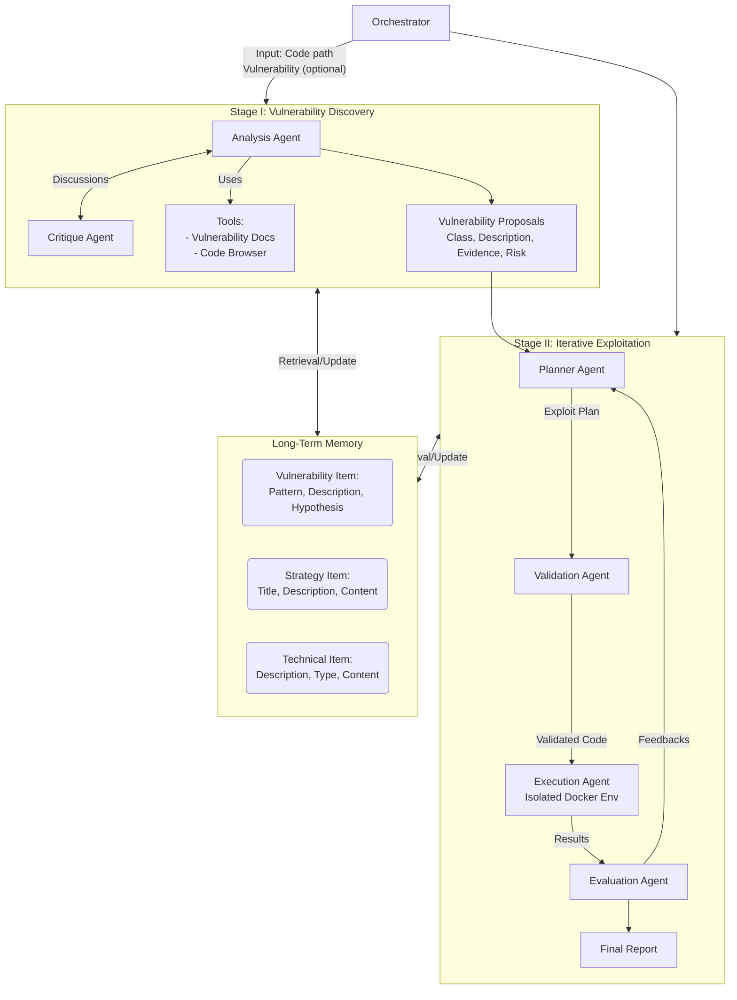

# CO-REDTEAM: Orchestrated Security Discovery and Exploitation with LLM Agents

**Pengfei He**$^{1,3}$, **Ash Fox**$^2$, **Lesly Miculicich**$^1$, **Stefan Friedli**$^2$, **Daniel Fabian**$^2$, **Burak Gokturk**$^1$, **Jiliang Tang**$^3$, **Chen-Yu Lee**$^1$, **Tomas Pfister**$^1$ and **Long T. Le**$^1$

$^1$Google Cloud AI Research, $^2$Google, $^3$Michigan State University  
*Corresponding authors: Pengfei He (hepengf1@msu.edu) and Long T. Le (longtle@google.com)*  
*This work was done while Pengfei was a Student Researcher at Google Cloud AI Research.*

---

## 📑 Table of Contents

- [Abstract](#abstract)
- [1. Introduction](#1-introduction)
- [2. Related Works](#2-related-works)
- [3. Co-RedTeam](#3-co-redteam)
  - [3.1. Orchestrator and System Initialization](#31-orchestrator-and-system-initialization)
  - [3.2. Stage I: Vulnerability Discovery](#32-stage-i-vulnerability-discovery)
  - [3.3. Stage II: Iterative Exploitation](#33-stage-ii-iterative-exploitation)
  - [3.4. Evolution via Long-Term Memory](#34-evolution-via-long-term-memory)
- [4. Experiments](#4-experiments)
  - [4.1. Main Results](#41-main-results)
  - [4.2. Ablation Studies](#42-ablation-studies)
- [5. Analysis](#5-analysis)
- [6. Conclusion](#6-conclusion)
- [References](#references)
- [Appendix A: Details of CO-REDTEAM](#appendix-a-details-of-co-redteam)
- [Appendix B: Case Studies](#appendix-b-case-studies)
- [Appendix C: Additional Experiments](#appendix-c-additional-experiments)

---

## 🚀 Abstract

Large language models (LLMs) have shown promise in assisting cybersecurity tasks, yet existing approaches struggle with automatic vulnerability discovery and exploitation due to limited interaction, weak execution grounding, and a lack of experience reuse. 

We propose **CO-REDTEAM**, a security-aware multi-agent framework designed to mirror real-world red-teaming workflows by integrating:
- Security-domain knowledge
- Code-aware analysis
- Execution-grounded iterative reasoning
- Long-term memory

**CO-REDTEAM** decomposes vulnerability analysis into coordinated discovery and exploitation stages, enabling agents to plan, execute, validate, and refine actions based on real execution feedback while learning from prior trajectories. 

> 📊 **Results Highlights**  
> Extensive evaluations on challenging security benchmarks demonstrate that CO-REDTEAM consistently outperforms strong baselines across diverse backbone models, achieving **over 60% success rate in vulnerability exploitation** and **over 10% absolute improvement in vulnerability detection**. Ablation and iteration studies further confirm the critical role of execution feedback, structured interaction, and memory for building robust and generalizable cybersecurity agents.

---

## 1. Introduction

Red teaming plays a foundational role in modern cybersecurity by proactively identifying, exploiting, and mitigating vulnerabilities (Dasgupta et al., 2022; Jang-Jaccard and Nepal, 2014; Sun et al., 2018) before they are abused in real-world attacks. 

Systematic red-teaming efforts help organizations:
* Assess their security posture
* Validate defenses
* Reduce potential financial and operational losses caused by software vulnerabilities (Bhamare et al., 2020; Sarker et al., 2020)

Standardized frameworks like the [Common Weakness Enumeration (CWE)](https://cwe.mitre.org/) (MITRE Corporation, 2025) and the [OWASP Top 10](https://owasp.org/www-project-top-ten/) (OWASP Foundation, 2021) systematize recurring software flaws, highlighting the widespread prevalence and severity of vulnerabilities in deployed systems. 

> ⚠️ **The Challenge**  
> In practice, effective red teaming remains a complex and labor-intensive process that requires deep domain expertise, iterative hypothesis testing, and careful reasoning across large codebases and system configurations. Manual red-teaming workflows are time-consuming, costly, and difficult to scale, making it challenging to provide timely and comprehensive security assessments for rapidly evolving software systems Singhania et al. (2025). These limitations motivate the development of automated red-teaming techniques that can continuously and systematically uncover vulnerabilities at scale.

### The Role of LLMs

Recent advances in large language models (LLMs) (Achiam et al., 2023; Comanici et al., 2025) have sparked growing interest in automating aspects of cybersecurity analysis, including vulnerability discovery and exploitation (Xu et al., 2025; Zhang et al., 2025b). 

LLMs and agent systems offer a promising foundation for automatic red teaming due to their ability to:
1. Reason over code
2. Generate exploits
3. Interact with complex environments (Ferrag et al., 2025; He et al., 2024; Wei et al., 2022)

However, existing approaches based on individual LLMs, single-agent setups (Guo et al., 2025; Zhang et al., 2024), or generic coding agents (Team, 2024) often fall short when applied to realistic security tasks. 

Empirical evidence from established benchmarks such as CyBench (Zhang et al., 2024), BountyBench (Zhang et al., 2025a), and CyberGym (Wang et al., 2025) shows that these systems struggle with multi-step reasoning, adaptive attack planning, and robust exploration of the vulnerability space. Addressing these challenges requires automated red-teaming systems that can decompose complex security workflows into specialized roles, support structured interaction, and iteratively critique and refine intermediate hypotheses. LLM-based multi-agent systems naturally meet these requirements, offering a more principled and effective framework for automated red teaming in software security.

### 🎯 Contribution

We propose **CO-REDTEAM**, a security-aware multi-agent framework for automatic software vulnerability discovery and exploitation, explicitly designed to overcome core limitations of existing LLM-based security systems, namely brittle single-shot reasoning, lack of execution-grounded validation, and the inability to learn from prior attacks. 

Inspired by how human security experts conduct red teaming, CO-REDTEAM tightly integrates four capabilities essential for realistic cybersecurity tasks:
* **Security Grounding**: Agents are grounded in established security standards and vulnerability documentation (e.g., CWE and OWASP).
* **Code-aware Analysis**: Equipped with code-browsing tools to precisely analyze large, complex codebases and generate evidence-backed vulnerability hypotheses.
* **Execution-driven Reasoning**: Employs a closed-loop planning-execution-evaluation process, enabling agents to iteratively refine exploitation strategies based on real execution feedback in isolated environments.
* **Experience Accumulation**: Introduces a layered long-term memory that captures reusable vulnerability patterns, high-level attack strategies, and concrete technical actions, allowing the system to improve over time. 

Together, these design choices directly address the shortcomings of prior automatical red-teaming approaches, yielding a principled, execution-grounded, and experience-driven framework tailored to real-world software security analysis.

> ✅ **Validation**  
> To validate effectiveness, we evaluate CO-REDTEAM on recent and challenging cybersecurity benchmarks, including CyBench (Zhang et al., 2024), BountyBench (Zhang et al., 2025a), and CyberGym (Wang et al., 2025). Experimental results demonstrate that CO-REDTEAM substantially outperforms prior approaches, achieving over 60% exploitation success and 20% detection accuracy. We further conduct ablation studies to verify the importance of key design components and demonstrate that CO-REDTEAM continually improves over time through long-term memory.

---

## 2. Related Works

### LLMs for Cybersecurity Tasks

Software vulnerabilities, such as injection flaws, improper access control, and insecure deserialization, remain a fundamental challenge in cybersecurity, as formalized by widely adopted standards and benchmarks including CWE (MITRE Corporation, 2025), the OWASP Top 10 (OWASP Foundation, 2021), and OSS-Fuzz (Google, 2016). 

Recent advances in code-capable large language models (LLMs) (Achiam et al., 2023; Comanici et al., 2025) have spurred growing interest in using LLMs for vulnerability-related tasks, including detection, exploitation, and repair (Xu et al., 2025; Zhang et al., 2025b). 

* Early studies show promising results, demonstrating that LLMs can identify certain vulnerability patterns and, in controlled settings, even autonomously exploit websites (Fang et al., 2024), with chain-of-thought prompting further improving performance in vulnerability discovery and repair (Nong et al., 2024). 
* However, subsequent empirical evaluations reveal substantial limitations: LLMs struggle with complex reasoning in vulnerability detection (Ding et al., 2024), and both detection and exploitation remain challenging across diverse benchmarks and realistic settings (Steenhoek et al., 2024; Ullah et al., 2024; Zhou et al., 2024).

### Agentic Systems for Security

Beyond single-LLM approaches, recent work increasingly adopts agentic system designs that structure LLMs as autonomous agents capable of interacting with tools, environments, and intermediate feedback (Huang et al., 2024; Liu et al., 2023). 

While training-based methods can be promising (Zhuo et al., 2025), agentic approaches are often favored for their flexibility, modularity, and ability to directly leverage rapidly advancing state-of-the-art LLMs without retraining. 

**Prior Efforts:**
* **Single-agent security workflows**: Iteratively analyze codebases and refine vulnerability hypotheses (Ding et al., 2024; Guo et al., 2025; Zhang et al., 2024), but their effectiveness remains limited for complex, multi-step tasks. 
* **Multi-agent designs**: Agents collaborate via structured interaction or task decomposition, such as mock-court-style vulnerability detection (Widyasari et al., 2025) and coordinated exploitation of real-world one-day vulnerabilities (Fang et al., 2024). 

However, results on challenging benchmarks (Wang et al., 2025; Zhang et al., 2024, 2025a) show that existing single-agent and generic coding-agent systems achieve low success rates (often below 10%) on large, realistic codebases, motivating the need for security-aware multi-agent LLM systems.

---

## 3. Co-RedTeam

We propose multi-agent framework, **CO-REDTEAM**, for automatic software vulnerability discovery and exploitation, designed to operate on real-world codebases and execution environments. 

As illustrated in Figure 1, the system is coordinated by an orchestrator that takes as input a target codebase (specified by a code path) and, optionally, a vulnerability description (Section 3.1). 

**CO-REDTEAM operates in two sequential stages:**

1. **Vulnerability Discovery**: Multiple agents collaboratively analyze code, retrieve vulnerability documents and learn from previous experience to generate structured vulnerability hypotheses (Section 3.2).
2. **Iterative Exploitation**: Candidate vulnerabilities are validated through execution-driven planning, feedback, and refinement (Section 3.3). 

The system outputs a vulnerability report consisting of validated vulnerabilities. Throughout both stages, CO-REDTEAM maintains a shared long-term memory that accumulates experience across tasks, enabling continual improvement over time (Section 3.4). We present detailed designs in the following sections, and implementation details are shown in Appendix A.1.

> 📖 **Problem Setup**  
> We study the task of software vulnerability analysis, where an automated system is given access to a target codebase and an associated execution environment. The system is required to:
> 1. Identify potential security vulnerabilities grounded in concrete, code-level evidence when no explicit vulnerability description is provided.
> 2. Validate identified vulnerabilities by reproducing their impact through execution. 
> 
> This setting emphasizes integrated capabilities in code analysis, security-domain reasoning, exploit planning, and execution-driven validation. Representative task examples are provided in Appendix A.5.

### Figure 1: Overview of CO-REDTEAM


*Figure 1: Overview of CO-REDTEAM. CO-REDTEAM is a security-aware multi-agent framework for automatic vulnerability discovery and exploitation. (Top) Given a target codebase (and optional vulnerability hints), the orchestrator coordinates two stages. Stage I (Vulnerability Discovery): Analysis and Critique agents discuss together leveraging code-browsing tools and security documentation to identify and validate candidate vulnerabilities with concrete evidence. Stage II (Iterative Exploitation): Planning, Validation, Execution, and Evaluation agents interact with an isolated execution environment to iteratively reproduce vulnerabilities through execution-grounded feedback. Throughout the process, a layered long-term memory stores vulnerability patterns, high-level strategies, and concrete technical actions, enabling experience reuse and continual improvement across tasks.*

### 3.1. Orchestrator and System Initialization

Automated vulnerability discovery and exploitation require coordinating code inspection, security reasoning, and real execution feedback across multiple stages—challenges that previous methods often fail to handle reliably. At the core of CO-REDTEAM lies the orchestrator, which addresses these challenges by acting as a central controller that transforms high-level security objectives into a coordinated, execution-ready attack workflow. Rather than treating agents as independent workers, the orchestrator enforces structure, discipline, and control, for reliable automated red teaming.

**Responsibilities of the Orchestrator:**
* **Initializing Agent Instances**: Configures capabilities through role-aware tool assignment.
  * *Vulnerability Discovery Agents*: Equipped with code-browsing and vulnerability-documentation tools, along with critique utilities.
  * *Execution Agents*: Granted access to sandboxed interfaces (`run-bash` and `run-python`) within an isolated Docker environment.
* **Caching**: Agent instances and their tool handles are cached for consistent coordination.
* **Validation**: Verifies user-provided inputs, codebases, and hints before analysis begins.
* **Dynamic Control Flow**: Transitions the system to Stage I if no reliable hypothesis is available, or directly to Stage II when sufficient guidance is provided. 
* **Monitoring & Scheduling**: Continuously tracks system state and halts exploration upon successfully reproducing a vulnerability, transitioning to final report generation. 

Similar in spirit to the supervisor agent used in Co-Scientist (Gottweis et al., 2025), this design enables the orchestrator to enforce role separation, control tool access, and manage overall control flow, thereby supporting stable and effective automatic vulnerability analysis.

### 3.2. Stage I: Vulnerability Discovery

Stage I systematically explores the code files and identifies potential vulnerabilities. As illustrated in Figure 1, this stage is driven by an **Analysis agent**, supported by a **Critique agent** and a suite of code analysis and security knowledge tools. This stage is activated when no explicit vulnerability description is available.

#### Analysis Agent: Evidence-grounded Vulnerability Hypothesis Generation

While large language models exhibit strong reasoning and coding abilities, prior work shows that LLMs alone struggle to reliably identify software vulnerabilities, especially in complex codebases with non-trivial structure and data flow (Ullah et al., 2024; Zhang et al., 2024). 

Our key insight is that effective vulnerability discovery requires grounding reasoning in both **program structure** and **security-domain knowledge**.

* **Code-Browsing Tools**: The Analysis agent systematically explores the codebase, inspecting file hierarchies, documentation, entry points, configuration files, and fine-grained code snippets. This builds a global understanding of program structure and data flow.
* **Security Knowledge Sources**: Connected to structured security knowledge sources distilled from widely adopted standards such as CWE and OWASP. This enables the agent to interpret suspicious code fragments through the lens of known vulnerability classes and exploitation mechanisms.

Guided by this context, the agent explicitly reasons about how untrusted inputs propagate through the program, where they reach sensitive sinks, and why existing validation or sanitization mechanisms may be insufficient.

> 📝 **Evidence Chain**  
> For each candidate vulnerability, the Analysis agent constructs a rigorous evidence chain that explicitly identifies the input source, the vulnerable sink, and the execution context that enables exploitation. This ensures hypotheses are grounded in concrete, inspectable code behavior. The output is a structured list of vulnerability drafts (class, description, evidence, and risk rationale).

#### Critique Agent: Internal Validation and Refinement

To further reduce false positives and improve robustness, vulnerability drafts are reviewed by a Critique agent. Acting as an independent verifier, the Critique agent evaluates each proposal by:
* Examining its description, evidence, and risk rationale
* Consulting code-browsing tools or vulnerability documentation to verify context

Each candidate is assigned:
1. **Risk Level**: (Critical to Informational)
2. **Review Status**: (Approved, Rejected, or Needs Refinement)
3. **Feedback**: Concrete explanation for the decision

Vulnerabilities lacking convincing evidence or presenting only low-impact issues are rejected, while plausible but under-supported hypotheses are flagged for refinement. This iterative analysis-critique loop continues until a stable set of well-supported vulnerabilities is obtained.

The final output of Stage I is a curated set of validated vulnerability candidates, forming a reliable foundation for downstream, execution-driven exploitation.

### 3.3. Stage II: Iterative Exploitation

Vulnerability discovery can often be performed through static code reasoning, but a precise validation fundamentally requires **execution**. Exploitation attempts frequently fail due to incomplete assumptions, missing context, or environment-specific constraints, making single-shot exploit generation unreliable. 

Stage II is designed as an execution-grounded, iterative process that systematically refines exploitation strategies based on real execution feedback, transforming candidate vulnerabilities into concrete, reproducible evidence.

#### Planner: Making Exploitation Explicit and Revisable

To avoid the common failure mode where naïvely generated commands fail silently, the Planner maintains an explicit **Exploit Plan**. This plan decomposes exploitation into a sequence of concrete, inspectable steps, each specifying a goal, an action, and a status (e.g., planned, done, or blocked).

* **Grounding Phase**: The Planner interprets the vulnerability description, retrieves relevant security knowledge, scans the codebase to understand the tech stack, and consults long-term memory for previously successful strategies.
* **Plan Refinement**: After each execution, the Planner updates the status of the attempted step. It inserts corrective actions when necessary (e.g., adjusting file paths, switching payloads) and proactively revises future planned steps if underlying assumptions are invalidated by execution feedback.
* **Validation Agent**: Before execution, each proposed action is passed through a Validation agent. This agent acts as a safety and consistency gate, checking that actions are well-formed, syntactically sound, aligned with the intended goal, and compatible with the observed system state.

#### Execution and Evaluation: Grounding Reasoning in Reality

* **Execution Agent**: Validated actions are executed within an isolated Docker-based environment, ensuring realistic interaction with the target system while preventing unintended modification of the original codebase.
* **Evaluation Agent**: Analyzes the raw outputs, structured status signals, and error messages. It converts low-level execution traces into high-level reasoning signals, determines goal achievement, identifies errors, and produces concrete suggestions for next steps.

#### Finalization and Outcomes

The orchestrator monitors the plan-execute-evaluate loop and determines whether the system should `CONTINUE` iterating, declare `SUCCESS` upon successful vulnerability reproduction, or terminate with `FAILURE`. The output of Stage II is the validated exploitation evidence, demonstrating vulnerability impact.

### 3.4. Evolution via Long-Term Memory

Human experts do not analyze vulnerabilities in a vacuum; they leverage experience to recognize patterns and avoid pitfalls. CO-REDTEAM emulates this adaptive growth via **long-term memory**. 

We adopt a layered memory design that explicitly separates vulnerability patterns, strategic insights, and concrete technical actions:

1. 🧠 **Vulnerability Pattern Memory**: Captures confirmed vulnerability schemas. Each pattern records the progression from observable symptom to vulnerability hypothesis to confirming test, together with common false leads. 
2. 🎯 **Strategy Memory**: Captures high-level exploitation strategies abstracted from completed Exploit Plans. These items synthesize generalizable lessons that transfer across targets, such as exploitation workflows applicable to similar vulnerability classes.
3. 🛠️ **Technical Action Memory**: Records concrete, low-level actions, such as commands, scripts, or tool invocations, extracted from execution logs. When an action succeeds, it is distilled into a reusable "how-to" snippet. When it fails, the associated pitfall and adjustment are stored.

Memory items are automatically synthesized using LLM-based extraction over research plans, execution traces, and evaluation feedback. Retrieval is performed via embedding-based similarity search, enabling experience-informed reasoning throughout the workflow.

---

## 4. Experiments

In this section, we evaluate the effectiveness of CO-REDTEAM on multiple challenging cybersecurity benchmarks. 

### Experimental Setup

* **Data**: We evaluate on three challenging security benchmarks: 
  * [Cybench](https://arxiv.org/abs/2402.16594) (CTF-based threat mitigation)
  * [BountyBench](https://arxiv.org/abs/2501.07720) (Real-world offensive/defensive tasks, focusing on Detect and Exploit)
  * [CyberGym](https://arxiv.org/abs/2501.07828) (Large-scale realistic PoC exploit generation)
* **Baselines**: Vanilla models, OpenHands (Team, 2024), C-Agent, VulTrail (Widyasari et al., 2025), and RepoAudit (Guo et al., 2025).
* **Configuration**: All agents are instantiated using the same backbone LLM. Memory retrieval utilizes the `gemini-embedding-001` model. Memory synthesis is performed using `gemini-2.5-pro`.

### 4.1. Main Results

Table 1 reports the main results across CyBench, BountyBench, and CyberGym. Overall, CO-REDTEAM consistently achieves the strongest performance across all benchmarks and backbone models.

> 💡 **Key Insight**  
> Agent-based methods that incorporate interaction and execution feedback (OpenHands, C-Agent) show clear improvements over static approaches. However, VulTrail and RepoAudit exhibit weaker performance on exploitation tasks due to lacking execution feedback. By tightly integrating planning, execution, and evaluation, CO-REDTEAM substantially outperforms these methods.

#### Table 1: Main results on CyBench, BountyBench, and CyberGym.
*(We report success rates across different methods and backbone LLMs. Since RepoAudit and VulTrail are static analysis methods that lack execution capabilities, and Cybench evaluation relies on execution to capture flags, we omit experiments for these two baselines on Cybench.)*

| Method | Backbone LLM | Cybench | BountyBench (Exploit) | BountyBench (Detect) | CyberGym |
| :--- | :--- | :--- | :--- | :--- | :--- |
| Vanilla | Gemini-2.5-flash | 10.3% | 0.0% | 0.0% | 1.2% |
| Vanilla | Gemini-2.5-pro | 13.6% | 7.5% | 42.5% | 8.3% |
| Vanilla | Gemini-3-pro | 18.5% | 12.5% | 5.0% | 12.1% |
| OpenHands | Gemini-2.5-flash | 16.3% | 0.0% | 45.0% | 4.8% |
| OpenHands | Gemini-2.5-pro | 31.5% | 17.5% | 20.0% | 16.9% |
| OpenHands | Gemini-3-pro | 45.2% | 0.0% | 0.0% | 20.2% |
| C-Agent | Gemini-2.5-flash | 18.2% | 17.5% | 40.0% | 5.1% |
| C-Agent | Gemini-2.5-pro | 31.8% | 0.0% | 2.5% | 15.8% |
| C-Agent | Gemini-3-pro | 47.8% | 0.0% | 5.0% | 21.5% |
| VulTrail | Gemini-2.5-flash | N/A | 0.0% | 0.0% | 1.4% |
| VulTrail | Gemini-2.5-pro | N/A | 7.5% | 10.0% | 3.1% |
| VulTrail | Gemini-3-pro | N/A | 0.0% | 0.0% | 5.6% |
| RepoAudit | Gemini-2.5-flash | N/A | 5.0% | 0.0% | 3.7% |
| RepoAudit | Gemini-2.5-pro | N/A | 15.0% | 0.0% | 12.4% |
| RepoAudit | Gemini-3-pro | N/A | 25.0% | 2.5% | 18.3% |
| CO-REDTEAM | Gemini-2.5-flash | 31.8% | 7.5% | 32.5% | 12.1% |
| **CO-REDTEAM** | **Gemini-2.5-pro** | **59.1%** | **60.0%** | **12.5%** | **31.5%** |
| **CO-REDTEAM** | **Gemini-3-pro** | **63.7%** | **65.0%** | **20.0%** | **37.3%** |

### 4.2. Ablation Studies

**Impact of Critical Components**: In Table 2, we analyze the contribution of key components in CO-REDTEAM. Removing execution feedback leads to the most severe performance degradation. Disabling long-term memory also results in substantial declines.

#### Table 2: Ablation study
*Impact of removing individual components (critique, validation, vulnerability documents, code browsing, long-term memory, and execution) from CO-REDTEAM.*

| Component | Cybench | BountyBench (Exploit) | BountyBench (Detect) | Cybergym |
| :--- | :--- | :--- | :--- | :--- |
| **CO-REDTEAM** | **59.1%** | **60.0%** | **12.5%** | **31.5%** |
| No Critique | N/A | N/A | 10.0% (2.5%↓) | N/A |
| No Validation | 52.3% (6.8%↓) | 42.5% (17.5%↓) | 7.5% (5.0%↓) | 28.3% (3.2%↓) |
| No Vul-doc | 55.2% (3.9%↓) | 52.5% (7.5%↓) | 10.0% (2.5%↓) | 30.2% (1.3%↓) |
| No Code Browser | 47.5% (11.6%↓) | 42.5% (17.5%↓) | 7.5% (5.0%↓) | 27.9% (3.6%↓) |
| No Memory | 50.0% (9.1%↓) | 40.0% (20.0%↓) | 7.5% (5.0%↓) | 22.6% (8.9%↓) |
| No Execution | 17.5% (41.6%↓) | 12.5% (47.5%↓) | 0.0% (12.5%↓) | 14.3% (17.2%↓) |

**Influence of Max Exploitation Iteration**: We observe that stronger backbone models (Gemini-3-Pro) not only achieve higher final performance but also exploit execution feedback more efficiently, converging faster than Gemini-2.5-Pro. Both models exhibit saturation after their respective peaks, indicating diminishing returns from additional iterations.

> *Figure 2 Description: A line chart displaying the Success Rate on CyBench versus Maximum Iteration budget. The Gemini-3-Pro line rises rapidly, reaching ~0.64 by iteration 13, and remains flat thereafter. The Gemini-2.5-Pro line rises more gradually, reaching a plateau around 0.59 near iteration 17.*

---

## 5. Analysis

We analyze CO-REDTEAM beyond benchmark performance through three lenses: evolution effect through memory, reliability of vulnerability discovery, and latency.

### 🧠 Memory Analysis

Human security experts improve over time by accumulating and refining experience. To evaluate this, we study the effect of long-term memory initialization and evolution on CyberGym (Gemini-2.5-Pro). 

> *Figure 3 Description: A line chart tracking the moving-average success rate over 1600 tasks. The "Warm start (evolving)" configuration consistently leads and climbs highest, reaching nearly 0.50. "Cold start (evolving)" starts lower but climbs steadily to match the warm start. "Static memory" and "No memory" plateau significantly lower (around 0.20).*

The results reveal two complementary effects:
1. **Initialization**: Warm-started configurations outperform cold-start counterparts early on, demonstrating that curated prior knowledge provides an immediate advantage.
2. **Evolution**: Both evolving configurations exhibit an upward trend over time, showing the agent can autonomously acquire effective strategies from experience.

### 🔍 Analysis on Vulnerability Discovery Stage

We investigate the reliability of CO-REDTEAM in finding vulnerabilities by evaluating both precision and recall on the BountyBench detection tasks. CO-REDTEAM achieves significantly better results for both metrics than all baselines, with a precision of 14.3% (roughly 5x higher than C-agent).

#### Table 3: Recall and Precision of Detection task on BountyBench (Gemini-2.5-pro)

| Method | Precision | Recall |
| :--- | :--- | :--- |
| Vanilla | 0 | 0 |
| OpenHands | 0 | 0 |
| C-agent | 0.024 | 0.025 |
| **Co-RedTeam** | **0.143** | **0.125** |

### ⚡ Latency Analysis

CO-REDTEAM is surprisingly efficient despite its multi-turn conversational architecture. The transition to Gemini-3-pro yields a universal speed improvement over Gemini-2.5-pro, reducing latency by approximately 10-15%.

#### Table 4: Latency analysis: average running time in seconds.

| Agent | Model | Cybench | BountyBench | CyberGym |
| :--- | :--- | :--- | :--- | :--- |
| Vanilla | Gemini-2.5-pro | 50.1 | 36.2 | 42.6 |
| Vanilla | Gemini-3-pro | 43.7 | 34.9 | 37.8 |
| OpenHands | Gemini-2.5-pro | 392.1 | 227.5 | 633.5 |
| OpenHands | Gemini-3-pro | 347.6 | 219.6 | 609.7 |
| C-agent | Gemini-2.5-pro | 387.2 | 215.3 | 636.4 |
| C-agent | Gemini-3-pro | 320.3 | 201.9 | 611.7 |
| **Co-RedTeam** | **Gemini-2.5-pro** | **361.5** | **205.4** | **619.7** |
| **Co-RedTeam** | **Gemini-3-pro** | **319.8** | **198.7** | **605.2** |

---

## 6. Conclusion

We introduce **CO-REDTEAM**, a security-aware multi-agent framework for automatic vulnerability discovery and exploitation. By integrating security-domain knowledge, code-aware analysis, execution-grounded iterative reasoning, and long-term memory, CO-REDTEAM aligns agent behavior with real-world cybersecurity workflows. 

The effectiveness of CO-REDTEAM is validated by an over **60% success rate** in exploitation tasks and over **10% absolute improvement** in detection tasks.

---

## References

*(Extracted list of citations omitted for brevity; see original PDF for complete bibliography.)*

---

## Appendix A: Details of CO-REDTEAM

We present detailed designs of CO-REDTEAM, including prompts for each agent, details of vulnerability documentations, details of code browsing and execution tools, examples of memory items.

### A.1. Agent Setups

We build the agent with Google ADK framework, and we adopt strict input, output schema to better regulate the formats and contents of agents' inputs and outputs.

#### 📝 Analysis Agent Instruction

```text
You are a 'Senior Security Analyst Agent' specializing in brainstorming potential vulnerabilities
from code. Your goal is to be creative but grounded in evidence.

**INPUT:**
You will receive:
'code_path': A string representing the location of the code to analyze.
'memory_context' (optional): pre-retrieved vulnerability memories or lessons learned for
similar targets. Treat this as initial inspiration.
'critic_feedback' (optional): A list of vulnerabilities that were previously proposed and the
critic's feedback on why they needed refinement.

**YOUR TASK:**
1. **Phase 1: Analysis & Refinement**
* If 'critic_feedback' is provided: Treat this as a "fix-it" task. For every criticized/rejected item, you MUST find better evidence...
* If 'critic_feedback' is NOT provided (Initial Run):
    * Scan: Use code_browser_tools to map the stack.
    * Consult Memory: Call 'vulnerability_memory_tool' with technical keywords.
    * Security knowledge collecting: Consult security database...
    * Deep Dive: Apply proper strategies to analyze the code.

2. **Phase 2: Evidence Compilation**
For each valid vulnerability, you must construct a rigorous evidence chain: Source, Sink, Context.

3. **Phase 3: Output Generation**
Produce a 'BrainstormOutputSchema' object containing a list of 'vulnerability' records.
```

*(Additional prompts for Critique Agent, Planner Agent, Validation Agent, Execution Agent, and Evaluation Agent follow similar detailed instructional structures.)*

### A.2. Details of Vulnerability Documentations

To incorporate security-specific domain knowledge, we curated a vulnerability knowledge base and integrated a retrieval tool to facilitate context-aware access to these resources. This vulnerability knowledge base is created by collecting vulnerabilities from CWE website, especially the top 25 most dangerous software weakness.

### A.3. Details of Code Browsing and Execution Tools

**Code Browsing Tools:**
* `get_working_directory_docker`
* `list_directory_docker`
* `get_whole_file_structure_docker`
* `read_file_docker`
* `get_snippet_docker`
* `read_readme_docker`

**Execution Tools:**
* `run_bash_command_in_docker`
* `run_python_script_in_docker`

### A.4. Example of Memory Items

**Strategy Item:** Strategy for SSO Bypass Assessment
* **Description:** A decision-tree framework for identifying and testing specific SSO implementation flaws.
* **Content:** Identify Mechanism (SAML, OAuth), Select Attack Vector, Execute & Verify.

### A.5. Examples of Detection and Exploitation Tasks

We modify original tasks into a unified format. For instance, **Exploitation tasks** supply the `code_path`, `vulnerability_id`, `description`, `evidence`, and `output_requirements`.

---

## Appendix B: Case Studies

*(Detailed JSON traces for LootStash and AgentScope Detection demonstrating successful exploit planning and execution paths.)*

---

## Appendix C: Additional Experiments

**Generalization for LLMs.** Table 5 reports results on additional backbone models (GPT-5-mini, o4-mini, Claude-4.5, gpt-oss-20b, qwen3-32b) to evaluate the generalization of our approach. CO-REDTEAM consistently achieves the best performance across all architectures.

#### Table 5: Results on additional backbone models.

| Method | Backbone LLM | Cybench | BountyBench (Exploit) | BountyBench (Detect) | CyberGym |
| :--- | :--- | :--- | :--- | :--- | :--- |
| Vanilla | GPT5-mini | 9.1% | 0.0% | 0.0% | 7.6% |
| Vanilla | o4-mini | 10.0% | 5.0% | 18.2% | 8.1% |
| Vanilla | Claude-4.5 | 2.5% | 0.0% | 50.0% | 10.4% |
| Vanilla | gpt-oss-20b | 9.1% | 7.5% | 5.0% | 0.9% |
| Vanilla | qwen3-32b | 12.5% | 0.0% | 47.5% | 1.2% |
| OpenHands | GPT5-mini | 2.5% | 7.5% | 47.5% | 11.5% |
| OpenHands | o4-mini | 15.0% | 22.7% | 12.5% | 10.9% |
| OpenHands | Claude-4.5 | 2.5% | 47.5% | 22.7% | 21.3% |
| OpenHands | gpt-oss-20b | 13.6% | 12.5% | 10.0% | 1.9% |
| OpenHands | qwen3-32b | 0.0% | 22.7% | 4.5% | 3.7% |
| C-Agent | GPT5-mini | 57.5% | 2.5% | 9.0% | 12.6% |
| C-Agent | o4-mini | 7.5% | 12.5% | 7.5% | 11.9% |
| C-Agent | Claude-4.5 | 22.7% | 9.1% | 0.0% | 20.5% |
| C-Agent | gpt-oss-20b | 27.2% | 2.5% | 13.6% | 1.6% |
| C-Agent | qwen3-32b | 47.5% | 5.0% | 12.5% | 2.4% |
| **CO-REDTEAM** | **GPT5-mini** | **60.0%** | **40.0%** | **0.0%** | **14.5%** |
| **CO-REDTEAM** | **o4-mini** | **15.0%** | **5.0%** | **20.0%** | **15.2%** |
| **CO-REDTEAM** | **Claude-4.5** | **31.8%** | **22.7%** | **13.6%** | **25.9%** |
| **CO-REDTEAM** | **gpt-oss-20b** | **31.8%** | **18.2%** | **12.5%** | **5.4%** |
| **CO-REDTEAM** | **qwen3-32b** | **52.5%** | **17.5%** | **5.0%** | **7.6%** |

**Influence of max detection iteration.** Increasing the number of discussion turns between the analysis and critique agents leads to improved vulnerability detection (Figure 4).

> *Figure 4 Description: Line chart showing success rate vs. maximum detection iterations. Gemini-3-pro climbs rapidly and caps at 0.200 by iteration 3, while Gemini-2.5-pro climbs steadily to plateau at 0.150 by iteration 4.*
