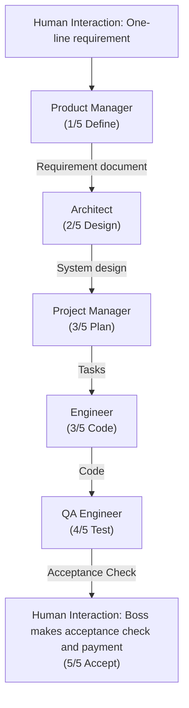
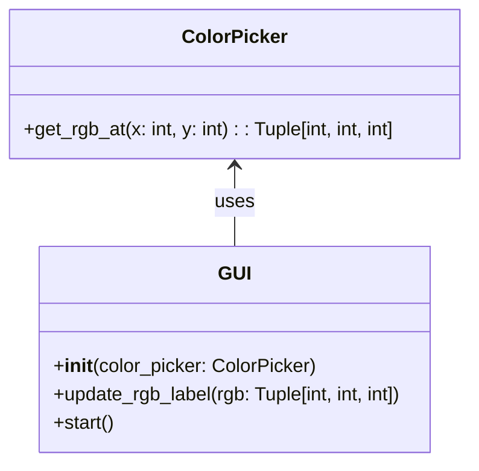
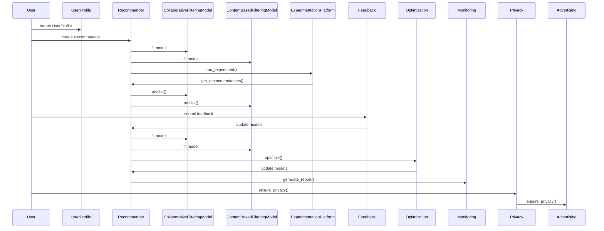

# METAGPT: Meta Programming for a Multi-Agent Collaborative Framework

**Authors:** Sirui Hong*¹, Mingchen Zhuge*², Jiaqi Chen¹, Xiawu Zheng³, Yuheng Cheng¹, Ceyao Zhang⁴, Jinlin Wang¹, Zili Wang⁵, Steven Ka Shing Yau⁶, Zijuan Lin⁷, Liyang Zhou¹, Chenyu Ran¹, Lingfeng Xiao¹, Chenglin Wu¹†, Jürgen Schmidhuber²,⁸

**Affiliations:**  
¹DeepWisdom, ²AI Initiative, King Abdullah University of Science and Technology,  
³Xiamen University, ⁴The Chinese University of Hong Kong, Shenzhen,  
⁵Nanjing University, ⁶University of Pennsylvania,  
⁷University of California, Berkeley, ⁸The Swiss AI Lab IDSIA/USI/SUPSI

*\*These authors contributed equally to this work. †Corresponding author: Chenglin Wu (alexanderwu@fuzhi.ai).*

---

## 📑 Table of Contents

- [Abstract](#abstract)
- [1. Introduction](#1-introduction)
- [2. Related Work](#2-related-work)
- [3. MetaGPT: A Meta-Programming Framework](#3-metagpt-a-meta-programming-framework)
  - [3.1 Agents in Standard Operating Procedures](#31-agents-in-standard-operating-procedures)
  - [3.2 Communication Protocol](#32-communication-protocol)
  - [3.3 Iterative Programming with Executable Feedback](#33-iterative-programming-with-executable-feedback)
- [4. Experiments](#4-experiments)
  - [4.1 Experimental Setting](#41-experimental-setting)
  - [4.2 Main Result](#42-main-result)
  - [4.3 Capabilities Analysis](#43-capabilities-analysis)
  - [4.4 Ablation Study](#44-ablation-study)
- [5. Conclusion](#5-conclusion)
- [Appendix](#appendix)
  - [A. Outlook](#a-outlook)
  - [B. A Demo of the Execution](#b-a-demo-of-the-execution)

---

## 🚀 Abstract

Remarkable progress has been made on automated problem solving through societies of agents based on large language models (LLMs). Existing LLM-based multi-agent systems can already solve simple dialogue tasks. Solutions to more complex tasks, however, are complicated through logic inconsistencies due to cascading hallucinations caused by naively chaining LLMs. 

Here we introduce **MetaGPT**, an innovative meta-programming framework incorporating efficient human workflows into LLM-based multi-agent collaborations. 

* **Standardized Operating Procedures (SOPs):** MetaGPT encodes SOPs into prompt sequences for more streamlined workflows, thus allowing agents with human-like domain expertise to verify intermediate results and reduce errors. 
* **Assembly Line Paradigm:** It assigns diverse roles to various agents, efficiently breaking down complex tasks into subtasks involving many agents working together. 

> 📊 **Results**  
> On collaborative software engineering benchmarks, MetaGPT generates more coherent solutions than previous chat-based multi-agent systems. Our project can be found at [https://github.com/geekan/MetaGPT](https://github.com/geekan/MetaGPT).

---

## 1. Introduction

Autonomous agents utilizing Large Language Models (LLMs) offer promising opportunities to enhance and replicate human workflows. In real-world applications, however, existing systems tend to oversimplify the complexities. They struggle to achieve effective, coherent, and accurate problem-solving processes, particularly when there is a need for meaningful collaborative interaction.

### 🧠 The Power of SOPs

Through extensive collaborative practice, humans have developed widely accepted **Standardized Operating Procedures (SOPs)** across various domains. 

* SOPs play a critical role in supporting task decomposition and effective coordination. 
* They outline the responsibilities of each team member, while establishing standards for intermediate outputs. 
* Well-defined SOPs improve the consistent and accurate execution of tasks that align with defined roles and quality standards. 

For instance, in a software company, Product Managers analyze competition and user needs to create Product Requirements Documents (PRDs) using a standardized structure, to guide the developmental process.

### 🌟 MetaGPT Framework

Inspired by such ideas, we design a promising GPT-based Meta-Programming framework called MetaGPT that significantly benefits from SOPs. Unlike other works, MetaGPT requires agents to generate structured outputs, such as high-quality requirements documents, design artifacts, flowcharts, and interface specifications. The use of intermediate structured outputs significantly increases the success rate of target code generation. Because it helps maintain consistency in communication, minimizing ambiguities and errors during collaboration.

More graphically, in a company simulated by MetaGPT, all employees follow a strict and streamlined workflow, and all their handovers must comply with certain established standards. This reduces the risk of hallucinations caused by idle chatter between LLMs, particularly in role-playing frameworks, like: 
> *"Hi, hello and how are you?"* Alice (Product Manager);  
> *"Great! Have you had lunch?"* Bob (Architect).

Benefiting from SOPs, MetaGPT offers a promising approach to meta-programming. In this context, we adopt meta-programming as *"programming to program"*, in contrast to the broader fields of meta learning and *"learning to learn"*.

### Figure 1: Software Development SOPs


*Figure 1: The software development SOPs between MetaGPT and real-world human teams. In software engineering, SOPs promote collaboration among various roles. MetaGPT showcases its ability to decompose complex tasks into specific actionable procedures assigned to various roles.*

### 🎯 Contributions

To validate the design of MetaGPT, we use publicly available HumanEval and MBPP for evaluations. Notably, in code generation benchmarks, MetaGPT achieves a new state-of-the-art (SoTA) with 85.9% and 87.7% in Pass@1. When compared to other popular frameworks for creating complex software projects, such as AutoGPT, LangChain, Agent Verse, and ChatDev, MetaGPT also stands out in handling higher levels of software complexity and offering extensive functionality.

We summarize our contributions as follows:
1. We introduce MetaGPT, a meta-programming framework for multi-agent collaboration based on LLMs.
2. Our innovative integration of human-like SOPs throughout MetaGPT’s design significantly enhances its robustness, reducing unproductive collaboration among LLM-based agents.
3. We achieve state-of-the-art performance on HumanEval and MBPP.

---

## 2. Related Work

### Automatic Programming
The roots of automatic programming reach back deep into the previous century. In 1969, Waldinger & Lee introduced “PROW,” a system designed to accept program specifications written in predicate calculus, generate algorithms, and create LISP implementations. Recent approaches use natural language processing (NLP) techniques. Lately, LLMs-based agents have advanced automatic programming development. Among them, ReAct and Reflexion utilize a chain of thought prompts to generate reasoning trajectories and action plans with LLMs.

### LLM-Based Multi-Agent Frameworks
Recently, LLM-based autonomous agents have gained tremendous interest in both industry and academia. Many works have improved the problem-solving abilities of LLMs by integrating discussions among multiple agents. Some works emphasize cooperation and competition related to planning and strategy; others propose LLM-based economies. These works focus on open-world human behavior simulation, while MetaGPT aims to introduce human practice into multi-agent frameworks.

---

## 3. MetaGPT: A Meta-Programming Framework

MetaGPT is a meta-programming framework for LLM-based multi-agent systems.

### 3.1 Agents in Standard Operating Procedures

**Specialization of Roles**
Unambiguous role specialization enables the breakdown of complex work into smaller and more specific tasks. We define five roles in our software company: Product Manager, Architect, Project Manager, Engineer, and QA Engineer. In MetaGPT, we specify the agent’s profile, which includes their name, profile, goal, and constraints for each role.

**Workflow across Agents**
By defining the agents’ roles and operational skills, we can establish basic workflows. In our work, we follow SOP in software development, which enables all agents to work in a sequential manner.

### 3.2 Communication Protocol

**Structured Communication Interfaces**
Most current LLM-based multi-agent frameworks utilize unconstrained natural language as a communication interface. Inspired by human social structures, we propose using structured communication to formulate the communication of agents. We establish a schema and format for each role and request that individuals provide the necessary outputs based on their specific role and context.

**Publish-Subscribe Mechanism**
Sharing information is critical in collaboration. To address this challenge, a viable approach is to store information in a global message pool. We introduce a shared message pool that allows all agents to exchange messages directly. We offer a simple and effective solution-subscription mechanism. Instead of relying on dialogue, agents utilize role-specific interests to extract relevant information.

### 3.3 Iterative Programming with Executable Feedback

In daily programming tasks, the processes of debugging and optimization play important roles. However, existing methods often lack a self-correction mechanism, which leads to unsuccessful code generation. To overcome this, after initial code generation, we introduce an executable feedback mechanism to improve the code iteratively.

---

## 4. Experiments

### 4.1 Experimental Setting

**Datasets:** We use two public benchmarks, HumanEval and MBPP, and a self-generated, more challenging software development benchmark named SoftwareDev.

**Evaluation Metrics:** For HumanEval and MBPP, we follow the unbiased version of Pass@k:

$$
Pass@k = \mathbb{E}_{Problems} \left[ 1 - \frac{\binom{n-c}{k}}{\binom{n}{k}} \right]
$$

For SoftwareDev, we prioritize practical use and evaluate performance through human evaluations (A, E) or statistical analysis (B, C, D).

**Baselines:** We compare our method with recent domain-specific LLMs (AlphaCode, Incoder, CodeGeeX, CodeGen, CodeX, CodeT) and general domain LLMs (PaLM, GPT-4).

### 4.2 Main Result

**Performance:** MetaGPT outperforms all preceding approaches in both HumanEval and MBPP benchmarks. It achieves **85.9%** and **87.7%** in these two public benchmarks.

#### Table 1: The statistical analysis on SoftwareDev.

| Statistical Index | ChatDev | MetaGPT w/o Feedback | MetaGPT |
| :--- | :--- | :--- | :--- |
| **(A) Executability** | 2.25 | 3.67 | 3.75 |
| **(B) Cost#1: Running Times (s)** | 762 | 503 | 541 |
| **(B) Cost#2: Token Usage** | 19,292 | 24,613 | 31,255 |
| **(C) Code Statistic#1: Code Files** | 1.9 | 4.6 | 5.1 |
| **(C) Code Statistic#2: Lines of Code per File** | 40.8 | 42.3 | 49.3 |
| **(C) Code Statistic#3: Total Code Lines** | 77.5 | 194.6 | 251.4 |
| **(D) Productivity** | 248.9 | 126.5 | 124.3 |
| **(E) Human Revision Cost** | 2.5 | 2.25 | 0.83 |

### 4.3 Capabilities Analysis

Compared to open-source baseline methods such as AutoGPT and autonomous agents such as AgentVerse and ChatDev, MetaGPT offers functions for software engineering tasks.

#### Table 2: Comparison of capabilities for MetaGPT and other approaches.

| Framework Capability | AutoGPT | LangChain | Agent Verse | ChatDev | MetaGPT |
| :--- | :--- | :--- | :--- | :--- | :--- |
| PRD generation | ✗ | ✗ | ✗ | ✗ | ✓ |
| Technical design generation | ✗ | ✗ | ✗ | ✗ | ✓ |
| API interface generation | ✗ | ✗ | ✗ | ✗ | ✓ |
| Code generation | ✓ | ✓ | ✓ | ✓ | ✓ |
| Precompilation execution | ✗ | ✗ | ✗ | ✗ | ✓ |
| Role-based task management | ✗ | ✗ | ✗ | ✓ | ✓ |
| Code review | ✗ | ✗ | ✓ | ✗ | ✓ |

### 4.4 Ablation Study

* **The Effectiveness of Roles:** To understand the impact of different roles on the final results, we perform two tasks that involve generating effective code. When we exclude certain roles, unworkable codes are generated.
* **The Effectiveness of Executable Feedback Mechanism:** Adding executable feedback into MetaGPT leads to a significant improvement of 4.2% and 5.4% in Pass@1 on HumanEval and MBPP, respectively.

---

## 5. Conclusion

This work introduces MetaGPT, a novel meta-programming framework that leverages SOPs to enhance the problem-solving capabilities of multi-agent systems based on Large Language Models (LLMs). MetaGPT models a group of agents as a simulated software company. MetaGPT leverages role specialization, workflow management, and efficient sharing mechanisms such as message pools and subscriptions, rendering it a flexible and portable platform for autonomous agents.

---

## Appendix

### A. Outlook

#### A.1 Self-Improvement Mechanisms
One limitation of the MetaGPT version in the main text of this paper is that each software project is executed independently. However, through active teamwork, a software development team should learn from the experience gained by developing each project. We also explore a self-referential mechanism that recursively modifies the constraint prompts of agents based on information they observe during software development.

#### A.2 Multi-Agent Economies
In real-world teamwork, the interaction processes are often not hardcoded. The recent agent-based platform of DeepWisdom (AgentStore) is compatible with the credit assignment concept of EOMs. Each agent in AgentStore provides a list of services with corresponding costs.

### B. A Demo of the Execution

#### B.1 User Input
```text
1 write a python3 GUI app such that you can draw an image with it
```

#### B.2 MetaGPT Development Process

* **Product Manager:** Generates a Product Requirement Document (PRD).
* **Architect:** Devises technical specifications including system architecture diagrams.

> 🛠️ **Program Call Flow (Architect)**


*Figure 9: The program call flow for the "Drawing App" generated by the architect agent.*

* **Engineer:**
```python
import tkinter as tk
from tkinter import colorchooser

class ColorPicker:
    def __init__(self, root: tk.Tk, color: str = 'black'):
        self.frame = tk.Frame(root)
        self.color = color

        self.color_button = tk.Button(self.frame, text='Color', command=self.select_color)
        self.color_button.pack(fill='x')

    def select_color(self):
        color = colorchooser.askcolor()[1]
        if color is not None:
            self.color = color

    def pack(self, **kwargs):
        self.frame.pack(**kwargs)

    def get_color(self):
        return self.color
```

* **QA Engineer:**
```python
import unittest
import tkinter as tk
# from color_picker import ColorPicker

class TestColorPicker(unittest.TestCase):
    def setUp(self):
        self.root = tk.Tk()
        self.cp = ColorPicker(self.root)

    def tearDown(self):
        self.root.destroy()

    def test_initial_color(self):
        self.assertEqual(self.cp.get_color(), 'black')

    def test_set_and_get_color(self):
        new_color = '#ffffff'
        self.cp.color = new_color
        self.assertEqual(self.cp.get_color(), new_color)

if __name__ == '__main__':
    unittest.main()
```

---

> ⚙️ **Sequence Flow (Recommendation Engine Development)**


*Figure 12: The program call flow for "recommendation engine development" generated by the architect agent.*
