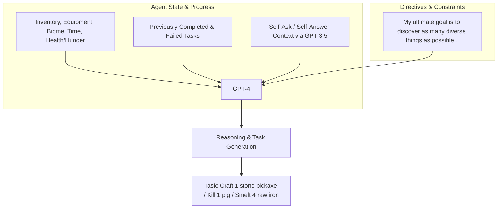
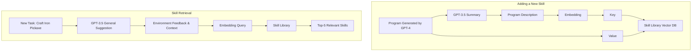
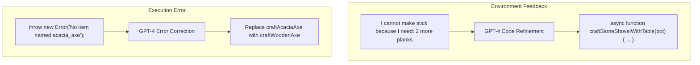
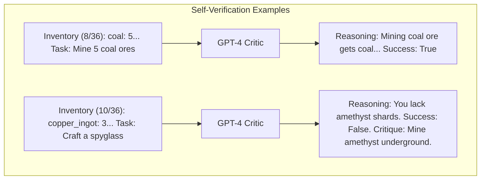
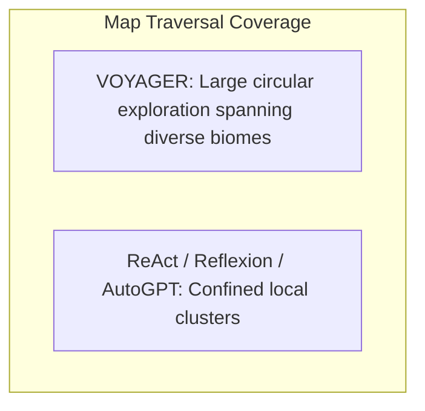

# 🚀 VOYAGER: An Open-Ended Embodied Agent with Large Language Models

**Guanzhi Wang**<sup>1,2</sup>, **Yuqi Xie**<sup>3</sup>, **Yunfan Jiang**<sup>1</sup>, **Ajay Mandlekar**<sup>1,*</sup>, **Chaowei Xiao**<sup>1,5</sup>, **Yuke Zhu**<sup>1,3</sup>, **Linxi "Jim" Fan**<sup>1,*†</sup>, **Anima Anandkumar**<sup>1,2,*†</sup>  
*<sup>1</sup>NVIDIA, <sup>2</sup>Caltech, <sup>3</sup>UT Austin, <sup>4</sup>Stanford, <sup>5</sup>UW Madison*  
*\*Equal contribution &nbsp;&nbsp; ‡Equal advising &nbsp;&nbsp; †Corresponding authors*

🔗 [https://voyager.minedojo.org](https://voyager.minedojo.org)

---

## 🚀 Abstract

We introduce **VOYAGER**, the first LLM-powered embodied lifelong learning agent in Minecraft that continuously explores the world, acquires diverse skills, and makes novel discoveries without human intervention. 

VOYAGER consists of three key components:
1. An **automatic curriculum** that maximizes exploration.
2. An **ever-growing skill library** of executable code for storing and retrieving complex behaviors.
3. A **new iterative prompting mechanism** that incorporates environment feedback, execution errors, and self-verification for program improvement.

> 💡 **Key Insight**
>
> VOYAGER interacts with GPT-4 via blackbox queries, which bypasses the need for model parameter fine-tuning. The skills developed by VOYAGER are temporally extended, interpretable, and compositional, which compounds the agent's abilities rapidly and alleviates catastrophic forgetting.

**Empirically**, VOYAGER shows strong in-context lifelong learning capability and exhibits exceptional proficiency in playing Minecraft. It obtains **3.3x more unique items**, travels **2.3× longer distances**, and unlocks key tech tree milestones up to **15.3× faster** than prior state-of-the-art (SOTA). VOYAGER is able to utilize the learned skill library in a new Minecraft world to solve novel tasks from scratch, while other techniques struggle to generalize.

---

## 1. Introduction

Building generally capable embodied agents that continuously explore, plan, and develop new skills in open-ended worlds is a grand challenge for the AI community [1–5]. Classical approaches employ reinforcement learning (RL) [6, 7] and imitation learning [8–10] that operate on primitive actions, which could be challenging for systematic exploration [11–15], interpretability [16–18], and generalization [19–21]. 

Recent advances in large language model (LLM) based agents harness the world knowledge encapsulated in pre-trained LLMs to generate consistent action plans or executable policies [16, 22, 19]. They are applied to embodied tasks like games and robotics [23–27], as well as NLP tasks without embodiment [28–30]. However, these agents are not lifelong learners that can progressively acquire, update, accumulate, and transfer knowledge over extended time spans [31, 32].

### 🎮 The Minecraft Challenge

Let us consider Minecraft as an example. Unlike most other games studied in AI [33, 34, 10], Minecraft does not impose a predefined end goal or a fixed storyline but rather provides a unique playground with endless possibilities [23]. Minecraft requires players to explore vast, procedurally generated 3D terrains and unlock a tech tree using gathered resources. Human players typically start by learning the basics, such as mining wood and cooking food, before advancing to more complex tasks like combating monsters and crafting diamond tools. 

We argue that an effective lifelong learning agent should have similar capabilities as human players:

1. **Propose suitable tasks** based on its current skill level and world state (e.g., learn to harvest sand and cactus before iron if it finds itself in a desert rather than a forest).
2. **Refine skills** based on environmental feedback and commit mastered skills to memory for future reuse in similar situations (e.g., fighting zombies is similar to fighting spiders).
3. **Continually explore** the world and seek out new tasks in a self-driven manner.

```mermaid
graph TD
    subgraph Automatic Curriculum
        A[Mine Wood Log] --> B[Make Crafting Table]
        B --> C[Combat Zombie]
        C --> D[Mine Diamond]
        D --> A
    end

    subgraph Iterative Prompting Mechanism
        E[New Task] --> F[Action Agent / GPT-4]
        F --> G[Code as Actions]
        G --> H[Environment / Minecraft]
        H --> I[Env Feedback & Execution Errors]
        I --> F
        H --> J[Self-Verification]
        J -- Fail --> K[Refine Program]
        K --> F
        J -- Success --> L[Add New Skill]
    end

    subgraph Skill Library
        M[Mine Wood Log]
        N[Make Crafting Table]
        O[Craft Stone Sword]
        P[Make Furnace]
        Q[Craft Shield]
        R[Cook Steak]
        S[Combat Zombie]
    end

    Automatic Curriculum -->|New Task| Iterative Prompting Mechanism
    Iterative Prompting Mechanism -->|Skill Retrieval| Skill Library
    Skill Library -->|Retrieved Skills| Iterative Prompting Mechanism
    Iterative Prompting Mechanism -->|Update Exploration Progress| Automatic Curriculum
```
*Figure 2: VOYAGER consists of three key components: an automatic curriculum for open-ended exploration, a skill library for increasingly complex behaviors, and an iterative prompting mechanism that uses code as action space.*

### 🎯 VOYAGER's Approach

Towards these goals, we introduce **VOYAGER**, the first LLM-powered embodied lifelong learning agent to drive exploration, master a wide range of skills, and make new discoveries continually without human intervention in Minecraft. VOYAGER is made possible through three key modules:

* 🗺️ **Automatic curriculum** that maximizes exploration.
* 📚 **Skill library** for storing and retrieving complex behaviors.
* 🔄 **Iterative prompting mechanism** that generates executable code for embodied control.

> 📌 **Remember**
>
> We opt to use **code as the action space** instead of low-level motor commands because programs can naturally represent temporally extended and compositional actions [16, 22], which are essential for many long-horizon tasks in Minecraft. VOYAGER interacts with a blackbox LLM (GPT-4 [35]) through prompting and in-context learning [36–38]. Our approach bypasses the need for model parameter access and explicit gradient-based training or finetuning.

More specifically, VOYAGER attempts to solve progressively harder tasks proposed by the automatic curriculum, which takes into account the exploration progress and the agent's state. The curriculum is generated by GPT-4 based on the overarching goal of *"discovering as many diverse things as possible"*. This approach can be perceived as an in-context form of novelty search [39, 40]. 

VOYAGER incrementally builds a skill library by storing the action programs that help solve a task successfully. Each program is indexed by the embedding of its description, which can be retrieved in similar situations in the future. Complex skills can be synthesized by composing simpler programs, which compounds VOYAGER's capabilities rapidly over time and alleviates catastrophic forgetting in other continual learning methods [31, 32].

### 🛠️ Overcoming LLM Limitations

However, LLMs struggle to produce the correct action code consistently in one shot [41]. To address this challenge, we propose an **iterative prompting mechanism** that:

1. **Executes the generated program** to obtain observations from the Minecraft simulation (such as inventory listing and nearby creatures) and error trace from the code interpreter (if any).
2. **Incorporates the feedback** into GPT-4's prompt for another round of code refinement.
3. **Repeats the process** until a self-verification module confirms the task completion, at which point we commit the program to the skill library (e.g., `craftStoneShovel()` and `combatZombieWithSword()`) and query the automatic curriculum for the next milestone (Figure 2).

**Empirically**, VOYAGER demonstrates strong in-context lifelong learning capabilities. It can construct an ever-growing skill library of action programs that are reusable, interpretable, and generalizable to novel tasks. We evaluate VOYAGER systematically against other LLM-based agent techniques (e.g., ReAct [29], Reflexion [30], AutoGPT [28]) in MineDojo [23], an open-source Minecraft AI framework. 

VOYAGER outperforms prior SOTA by:
* Obtaining **3.3x more unique items**.
* Unlocking key tech tree milestones up to **15.3× faster**.
* Traversing **2.3× longer distances**. 

We further demonstrate that VOYAGER is able to utilize the learned skill library in a new Minecraft world to solve novel tasks from scratch, while other methods struggle to generalize.

---

## 2. Method

VOYAGER consists of three novel components:

1. 🗺️ **Automatic curriculum** (Section 2.1) that suggests objectives for open-ended exploration.
2. 📚 **Skill library** (Section 2.2) for developing increasingly complex behaviors.
3. 🔄 **Iterative prompting mechanism** (Section 2.3) that generates executable code for embodied control.

> 📝 **Notes**
>
> Full prompts are presented in Appendix, Section A.


*Figure 3: Tasks proposed by the automatic curriculum (partial prompt view).*

### 2.1 Automatic Curriculum 🗺️

Embodied agents encounter a variety of objectives with different complexity levels in open-ended environments. An automatic curriculum offers numerous benefits for open-ended exploration:
* Ensuring a challenging but manageable learning process.
* Fostering curiosity-driven intrinsic motivation for agents to learn and explore.
* Encouraging the development of general and flexible problem-solving strategies [42–44]. 

Our automatic curriculum capitalizes on the internet-scale knowledge contained within GPT-4 by prompting it to provide a steady stream of new tasks or challenges. The curriculum unfolds in a bottom-up fashion, allowing for considerable adaptability and responsiveness to the exploration progress and the agent's current state (Figure 3). As VOYAGER progresses to harder self-driven goals, it naturally learns a variety of skills, such as *"mining a diamond"*.

#### 🔧 Prompt Components

The input prompt to GPT-4 consists of several components:

1. **Directives encouraging diverse behaviors and imposing constraints**, such as:
   > *"My ultimate goal is to discover as many diverse things as possible. The next task should not be too hard since I may not have the necessary resources or have learned enough skills to complete it yet."*
2. **The agent's current state**, including inventory, equipment, nearby blocks and entities, biome, time, health and hunger bars, and position.
3. **Previously completed and failed tasks**, reflecting the agent's current exploration progress and capabilities frontier.
4. **Additional context**: We also leverage GPT-3.5 to self-ask questions based on the agent's current state and exploration progress and self-answer questions. We opt to use GPT-3.5 instead of GPT-4 for standard NLP tasks due to budgetary considerations.


*Figure 4: Skill library operations. Top: Adding a new verified skill. Bottom: Skill retrieval based on task and environment feedback.*

### 2.2 Skill Library 📚

With the automatic curriculum consistently proposing increasingly complex tasks, it is essential to have a skill library that serves as a basis for learning and evolution. Inspired by the generality, interpretability, and universality of programs [45], we represent each skill with executable code that scaffolds temporally extended actions for completing a specific task proposed by the automatic curriculum.

#### 🔧 Prompt Components

The input prompt to GPT-4 consists of the following components:

1. **Guidelines for code generation**, such as:
   > *"Your function will be reused for building more complex functions. Therefore, you should make it generic and reusable."*
2. **Control primitive APIs**, and relevant skills retrieved from the skill library, which are crucial for in-context learning [36–38] to work well.
3. **The generated code from the last round, environment feedback, execution errors, and critique**, based on which GPT-4 can self-improve (Section 2.3).
4. **The agent's current state**, including inventory, equipment, nearby blocks and entities, biome, time, health and hunger bars, and position.
5. **Chain-of-thought prompting** [46] to do reasoning before code generation.

We iteratively refine the program through a novel iterative prompting mechanism (Section 2.3), incorporate it into the skill library as a new skill, and index it by the embedding of its description (Figure 4, top). 

For **skill retrieval**, we query the skill library with the embedding of self-generated task plans and environment feedback (Figure 4, bottom). By continuously expanding and refining the skill library, VOYAGER can learn, adapt, and excel in a wide spectrum of tasks, consistently pushing the boundaries of its capabilities in the open world.


*Figure 5: Left: Environment feedback showing missing resources. Right: Execution error leading to automatic bug correction.*

### 2.3 Iterative Prompting Mechanism 🔄

We introduce an iterative prompting mechanism for self-improvement through three types of feedback:

1. **Environment feedback**, which illustrates the intermediate progress of program execution (Figure 5, left). 
   * *Example:* *"I cannot make an iron chestplate because I need: 7 more iron ingots"* highlights the cause of failure in crafting an iron chestplate. We use `bot.chat()` inside control primitive APIs to generate environment feedback and prompt GPT-4 to use this function as well during code generation.
2. **Execution errors** from the program interpreter that reveal any invalid operations or syntax errors in programs, which are valuable for bug fixing (Figure 5, right).
3. **Self-verification for checking task success**. Instead of manually coding success checkers for each new task proposed by the automatic curriculum, we instantiate another GPT-4 agent for self-verification. 
   * By providing VOYAGER's current state and the task to GPT-4, we ask it to act as a critic [47–49] and inform us whether the program achieves the task. In addition, if the task fails, it provides a critique by suggesting how to complete the task (Figure 6). 
   * Hence, our self-verification is more comprehensive than self-reflection [30] by both checking success and reflecting on mistakes.


*Figure 6: Self-verification examples assessing success and generating critiques.*

During each round of code generation, we execute the generated program to obtain environment feedback and execution errors from the code interpreter, which are incorporated into GPT-4's prompt for the next round of code refinement. This iterative process repeats until self-verification validates the task's completion, at which point we add this new skill to the skill library and ask the automatic curriculum for a new objective (Figure 2). 

> ⚠️ **Warning**
>
> If the agent gets stuck after **4 rounds** of code generation, then we query the curriculum for another task. 

This iterative prompting approach significantly improves program synthesis for embodied control, enabling VOYAGER to continuously acquire diverse skills without human intervention.

---

## 3. Experiments

### 3.1 Experimental Setup 🛠️

We leverage OpenAI's `gpt-4-0314` [35] and `gpt-3.5-turbo-0301` [50] APIs for text completion, along with `text-embedding-ada-002` [51] API for text embedding. 

* We set all temperatures to $0$ except for the automatic curriculum, which uses temperature $= 0.1$ to encourage task diversity. 
* Our simulation environment is built on top of MineDojo [23] and leverages Mineflayer [52] JavaScript APIs for motor controls. See Appendix, Section B.1 for more details.

### 3.2 Baselines 📊

Because there are no LLM-based agents that work out of the box for Minecraft, we make our best effort to select a number of representative algorithms as baselines. These methods are originally designed only for NLP tasks without embodiment, therefore we have to re-interpret them to be executable in MineDojo and compatible with our experimental setting:

* **ReAct [29]**: Uses chain-of-thought prompting [46] by generating both reasoning traces and action plans with LLMs. We provide it with our environment feedback and the agent states as observations.
* **Reflexion [30]**: Built on top of ReAct [29] with self-reflection to infer more intuitive future actions. We provide it with execution errors and our self-verification module.
* **AutoGPT [28]**: A popular software tool that automates NLP tasks by decomposing a high-level goal into multiple subgoals and executing them in a ReAct-style loop. We re-implement AutoGPT by using GPT-4 to do task decomposition and provide it with the agent states, environment feedback, and execution errors as observations for subgoal execution. Compared with VOYAGER, AutoGPT lacks the skill library for accumulating knowledge, self-verification for assessing task success, and automatic curriculum for open-ended exploration.

> 📝 **Notes**
>
> We do not directly compare with prior methods that take Minecraft screen pixels as input and output low-level controls [53–55]. It would not be an apple-to-apple comparison, because we rely on the high-level Mineflayer [52] API to control the agent.

### 3.3 Evaluation Results 📈

We systematically evaluate VOYAGER and baselines on their exploration performance, tech tree mastery, map coverage, and zero-shot generalization capability to novel tasks in a new world.

* 🔍 **Significantly better exploration:** VOYAGER's superiority is evident in its ability to consistently make new strides, discovering **63 unique items** within 160 prompting iterations—**3.3x more novel items** compared to its counterparts. AutoGPT lags considerably, while ReAct and Reflexion struggle to make significant progress.
* 🌳 **Consistent tech tree mastery:** The Minecraft tech tree tests the agent's ability to craft and use a hierarchy of tools (`wooden tool` ➔ `stone tool` ➔ `iron tool` ➔ `diamond tool`). Compared with baselines, VOYAGER unlocks the wooden level **15.3× faster**, the stone level **8.5× faster**, the iron level **6.4× faster**, and VOYAGER is the **only one** to unlock the diamond level (Table 1).

| Method | Wooden Tool | Stone Tool | Iron Tool | Diamond Tool |
| :--- | :---: | :---: | :---: | :---: |
| **ReAct [29]** | N/A ($0/3$) | N/A ($0/3$) | N/A ($0/3$) | N/A ($0/3$) |
| **Reflexion [30]** | N/A ($0/3$) | N/A ($0/3$) | N/A ($0/3$) | N/A ($0/3$) |
| **AutoGPT [28]** | $92 \pm 72$ ($3/3$) | $94 \pm 72$ ($3/3$) | $135 \pm 103$ ($3/3$) | N/A ($0/3$) |
| **VOYAGER w/o Skill Library** | $7 \pm 2$ ($3/3$) | $9 \pm 4$ ($3/3$) | $29 \pm 11$ ($3/3$) | N/A ($0/3$) |
| **VOYAGER (Ours)** | **$6 \pm 2$ ($3/3$)** | **$11 \pm 2$ ($3/3$)** | **$21 \pm 7$ ($3/3$)** | **$102$ ($1/3$)** |

*Table 1: Tech tree mastery. Fractions indicate successful trials out of three total runs. Numbers are prompting iterations averaged over trials (fewer is more efficient).*

* 🗺️ **Extensive map traversal:** VOYAGER is able to navigate distances **2.3× longer** compared to baselines by traversing a variety of terrains, while baseline agents remain confined to local areas (Figure 7).


*Figure 7: Bird's eye view of map coverage showing VOYAGER's extensive traversal across diverse terrains.*

* 🧠 **Efficient zero-shot generalization to unseen tasks:** VOYAGER consistently solves all tasks (`Diamond Pickaxe`, `Golden Sword`, `Lava Bucket`, `Compass`) in a newly instantiated world, while baselines cannot solve any task within 50 prompting iterations (Table 2). Interestingly, integrating VOYAGER's skill library into AutoGPT significantly boosts its performance, proving that the skill library is a plug-and-play asset.

| Method | Diamond Pickaxe | Golden Sword | Lava Bucket | Compass |
| :--- | :---: | :---: | :---: | :---: |
| **ReAct [29]** | N/A ($0/3$) | N/A ($0/3$) | N/A ($0/3$) | N/A ($0/3$) |
| **Reflexion [30]** | N/A ($0/3$) | N/A ($0/3$) | N/A ($0/3$) | N/A ($0/3$) |
| **AutoGPT [28]** | N/A ($0/3$) | N/A ($0/3$) | N/A ($0/3$) | N/A ($0/3$) |
| **AutoGPT [28] w/ Our Skill Library** | $39$ ($1/3$) | $30$ ($1/3$) | N/A ($0/3$) | $30$ ($2/3$) |
| **VOYAGER w/o Skill Library** | $36$ ($2/3$) | $30 \pm 9$ ($3/3$) | $27 \pm 9$ ($3/3$) | $26 \pm 3$ ($3/3$) |
| **VOYAGER (Ours)** | **$19 \pm 3$ ($3/3$)** | **$18 \pm 7$ ($3/3$)** | **$21 \pm 5$ ($3/3$)** | **$18 \pm 2$ ($3/3$)** |

*Table 2: Zero-shot generalization to unseen tasks across 3 trials (max 50 iterations).*

### 3.4 Ablation Studies 🔬

We ablate 6 design choices in VOYAGER:
1. **Automatic curriculum:** Replacing it with a random curriculum causes discovered item count to drop by **93%**. Manual curriculum requires heavy domain expertise and cannot adapt to agent states.
2. **Skill library:** Without it, VOYAGER exhibits a clear performance plateau in later stages, highlighting its role in building complex actions on top of mastered ones.
3. **Self-verification:** Removing this module leads to a **73% drop** in discovered items, proving it is the most crucial feedback mechanism for task progression.
4. **GPT-4 for code generation:** GPT-4 obtains **5.7× more unique items** than GPT-3.5 due to a quantum leap in coding capability.

### 3.5 Multimodal Feedback from Humans 👥

While current GPT-4 APIs are text-only, VOYAGER can be augmented with human feedback to construct complex 3D structures like a **Nether Portal** and a **House** (Figure 10):
* 👁️ **Human as a critic:** Providing visual critique to refine spatial details.
* 📚 **Human as a curriculum:** Breaking down complex building tasks into smaller steps.

---

## 4. Limitations and Future Work ⚠️

* 💰 **Cost:** GPT-4 API incurs significant costs (15× more expensive than GPT-3.5), though essential for code generation quality.
* 🐛 **Inaccuracies:** Occasionally the agent gets stuck or self-verification fails (e.g., missing spider string signals).
* 👻 **Hallucinations:** Automatic curriculum or GPT-4 may propose non-existent items (e.g., "copper sword") or invalid fuel inputs (e.g., cobblestone). Future LLM advances and open-source fine-tuning will address these.

---

## 5. Related Work 🔗

* **Decision-making Agents in Minecraft:** Prior work spans low-level controllers (hierarchical RL [66–68], MineDojo/VPT [8], DreamerV3 [69]) and high-level planners (Codex prompting [70], LLM subgoals [53, 55, 71]). VOYAGER uniquely combines curiosity-driven bottom-up automatic curriculum with executable code.
* **Large Language Models for Agent Planning:** Applied to robot learning (Inner Monologue [26], Code as Policies [16], ProgPrompt [22], PaLM-E [59]) and text agents (ReAct [29], Reflexion [30], AutoGPT [28], Generative Agents [82]). None feature an active skill library for lifelong behavioral accumulation.
* **Code Generation with Execution:** Execution-guided search [86–88], majority voting [89], LEVER [91], and CLAIRIFY [92]. VOYAGER integrates environment feedback, execution errors, and self-verification into embodied control.

---

## 6. Conclusion 🏁

We introduced **VOYAGER**, the first LLM-powered embodied lifelong learning agent. By leveraging GPT-4 for continuous exploration, skill acquisition, and discovery without human intervention, VOYAGER demonstrates superior performance across item discovery, tech tree mastery, map traversal, and zero-shot generalization.

---

## 7. Broader Impacts 🌍

Research conducted in Minecraft (safe sandbox). Deploying on physical robots requires strict human safety constraints.

---

## 8. Acknowledgements 🙏

We thank colleagues and friends for feedback. Supported by the Kortschak fellowship at Caltech and NVIDIA.

---

## References 📚

1. E. Kolve et al., "AI2-THOR: An interactive 3D environment for visual AI," *arXiv:1712.05474*, 2017.
2. M. Savva et al., "Habitat: A platform for embodied AI research," in *ICCV*, 2019, pp. 9338–9346.
3. Y. Zhu et al., "robosuite: A modular simulation framework and benchmark for robot learning," *arXiv:2009.12293*, 2020.
4. F. Xia et al., "Interactive Gibson benchmark (iGibson 0.5)," *arXiv:1910.14442*, 2019.
5. B. Shen et al., "iGibson 1.0: a simulation environment for interactive tasks in large realistic scenes," *arXiv:2012.02924*, 2020.
6. J. Kober, J. A. Bagnell, and J. Peters, "Reinforcement learning in robotics: A survey," *IJRR*, vol. 32, no. 11, pp. 1238–1274, 2013.
7. K. Arulkumaran et al., "Deep reinforcement learning: A brief survey," *IEEE Signal Processing Magazine*, vol. 34, no. 6, pp. 26–38, 2017.
8. B. Baker et al., "Video pretraining (VPT): Learning to act by watching unlabeled online videos," *arXiv:2206.11795*, 2022.
9. DeepMind Interactive Agents Team et al., "Creating multimodal interactive agents with imitation and self-supervised learning," *arXiv:2112.03763*, 2021.
10. O. Vinyals et al., "AlphaStar: Mastering the real-time strategy game StarCraft II," *DeepMind Blog*, 2019.
11. A. Ecoffet et al., "Go-explore: a new approach for hard-exploration problems," *arXiv:1901.10995*, 2019.
12. J. Huizinga and J. Clune, "Evolving multimodal robot behavior via many stepping stones," *Evolutionary Computation*, vol. 30, no. 2, pp. 131–164, 2022.
13. R. Wang et al., "Enhanced POET: open-ended reinforcement learning through unbounded invention of learning challenges," in *ICML*, 2020, pp. 9940–9951.
14. I. Kanitscheider et al., "Multi-task curriculum learning in a complex, visual, hard-exploration domain: Minecraft," *arXiv:2106.14876*, 2021.
15. M. Dennis et al., "Emergent complexity and zero-shot transfer via unsupervised environment design," in *NeurIPS*, 2020.
16. J. Liang et al., "Code as policies: Language model programs for embodied control," *arXiv:2209.07753*, 2022.
17. S.-H. Sun, T.-L. Wu, and J. J. Lim, "Program guided agent," in *ICLR*, 2020.
18. Z. Zhao et al., "Proto: Program-guided transformer for program-guided tasks," in *NeurIPS*, 2021, pp. 17021–17036.
19. Y. Jiang et al., "VIMA: General robot manipulation with multimodal prompts," *arXiv:2210.03094*, 2022.
20. M. Shridhar, L. Manuelli, and D. Fox, "CLIPort: What and where pathways for robotic manipulation," *arXiv:2109.12098*, 2021.
21. L. Fan et al., "SECANT: self-expert cloning for zero-shot generalization of visual policies," in *ICML*, 2021, pp. 3088–3099.
22. I. Singh et al., "ProgPrompt: Generating situated robot task plans using large language models," *arXiv:2209.11302*, 2022.
23. L. Fan et al., "MineDojo: Building open-ended embodied agents with internet-scale knowledge," *arXiv:2206.08853*, 2022.
24. A. Zeng et al., "Socratic models: Composing zero-shot multimodal reasoning with language," *arXiv:2204.00598*, 2022.
25. M. Ahn et al., "Do as I can, not as I say: Grounding language in robotic affordances," *arXiv:2204.01691*, 2022.
26. W. Huang et al., "Inner monologue: Embodied reasoning through planning with language models," *arXiv:2207.05608*, 2022.
27. W. Huang et al., "Language models as zero-shot planners: Extracting actionable knowledge for embodied agents," in *ICML*, 2022, pp. 9118–9147.
28. Significant Gravitas, "Auto-GPT: An experimental open-source attempt to make GPT-4 fully autonomous," 2023. [Online]. Available: [https://github.com/Significant-Gravitas/Auto-GPT](https://github.com/Significant-Gravitas/Auto-GPT)
29. S. Yao et al., "ReAct: Synergizing reasoning and acting in language models," *arXiv:2210.03629*, 2022.
30. N. Shinn, B. Labash, and A. Gopinath, "Reflexion: an autonomous agent with dynamic memory and self-reflection," *arXiv:2303.11366*, 2023.
31. G. I. Parisi et al., "Continual lifelong learning with neural networks: A review," *Neural Networks*, vol. 113, pp. 54–71, 2019.
32. L. Wang et al., "A comprehensive survey of continual learning: Theory, method and application," *arXiv:2302.00487*, 2023.
33. V. Mnih et al., "Playing Atari with deep reinforcement learning," *arXiv:1312.5602*, 2013.
34. OpenAI et al., "Dota 2 with large scale deep reinforcement learning," *arXiv:1912.06680*, 2019.
35. OpenAI, "GPT-4 technical report," *arXiv:2303.08774*, 2023.
36. J. Wei et al., "Emergent abilities of large language models," *arXiv:2206.07682*, 2022.
37. T. B. Brown et al., "Language models are few-shot learners," in *NeurIPS*, 2020.
38. C. Raffel et al., "Exploring the limits of transfer learning with a unified text-to-text transformer," *JMLR*, vol. 21, pp. 140:1–140:67, 2020.
39. B. Eysenbach et al., "Diversity is all you need: Learning skills without a reward function," in *ICLR*, 2019.
40. E. Conti et al., "Improving exploration in evolution strategies for deep reinforcement learning via a population of novelty-seeking agents," in *NeurIPS*, 2018, pp. 5032–5043.
41. M. Chen et al., "Evaluating large language models trained on code," *arXiv:2107.03374*, 2021.
42. R. Wang et al., "Paired open-ended trailblazer (POET): Endlessly generating increasingly complex and diverse learning environments," *arXiv:1901.01753*, 2019.
43. R. Portelas et al., "Automatic curriculum learning for deep RL: A short survey," in *IJCAI*, 2020, pp. 4819–4825.
44. S. Forestier et al., "Intrinsically motivated goal exploration processes with automatic curriculum learning," *JMLR*, vol. 23, no. 1, pp. 6818–6858, 2022.
45. K. Ellis et al., "DreamCoder: Growing generalizable, interpretable knowledge with wake-sleep Bayesian program learning," *arXiv:2006.08381*, 2020.
46. J. Wei et al., "Chain of thought prompting elicits reasoning in large language models," *arXiv:2201.11903*, 2022.
47. V. Mnih et al., "Asynchronous methods for deep reinforcement learning," in *ICML*, 2016, pp. 1928–1937.
48. J. Schulman et al., "Proximal policy optimization algorithms," *arXiv:1707.06347*, 2017.
49. T. P. Lillicrap et al., "Continuous control with deep reinforcement learning," in *ICLR*, 2016.
50. OpenAI, "Introducing ChatGPT," 2022. [Online]. Available: [https://openai.com/blog/chatgpt](https://openai.com/blog/chatgpt)
51. OpenAI, "New and improved embedding model," 2022. [Online]. Available: [https://openai.com/blog/new-and-improved-embedding-model](https://openai.com/blog/new-and-improved-embedding-model)
52. PrismarineJS, "Mineflayer: Create Minecraft bots with a powerful, stable, and high level JavaScript API," 2013. [Online]. Available: [https://github.com/PrismarineJS/mineflayer](https://github.com/PrismarineJS/mineflayer)
53. K. Nottingham et al., "Do embodied agents dream of pixelated sheep? Embodied decision making using language guided world modelling," *arXiv:2303.13575*, 2023.
54. S. Cai et al., "Open-world multi-task control through goal-aware representation learning and adaptive horizon prediction," *arXiv:2301.10034*, 2023.
55. Z. Wang et al., "Describe, explain, plan and select: Interactive planning with large language models enables open-world multi-task agents," *arXiv:2302.01560*, 2023.
56. S. Bubeck et al., "Sparks of artificial general intelligence: Early experiments with GPT-4," *arXiv:2303.12712*, 2023.
57. Y. Liu et al., "Summary of ChatGPT/GPT-4 research and perspective towards the future of large language models," *arXiv:2304.01852*, 2023.
58. S. Liu et al., "Prismer: A vision-language model with an ensemble of experts," *arXiv:2303.02506*, 2023.
59. D. Driess et al., "PaLM-E: An embodied multimodal language model," *arXiv:2303.03378*, 2023.
60. H. Touvron et al., "LLaMA: Open and efficient foundation language models," *arXiv:2302.13971*, 2023.
61. W. H. Guss et al., "MineRL: A large-scale dataset of Minecraft demonstrations," in *IJCAI*, 2019, pp. 2442–2448.
62. W. H. Guss et al., "The MineRL 2019 competition on sample efficient reinforcement learning using human priors," *arXiv:1904.10079*, 2019.
63. W. H. Guss et al., "The MineRL 2020 competition on sample efficient reinforcement learning using human priors," *arXiv:2101.11071*, 2021.
64. A. Kanervisto et al., "MineRL Diamond 2021 competition: Overview, results, and lessons learned," *arXiv:2202.10583*, 2022.
65. M. Johnson et al., "The Malmo platform for artificial intelligence experimentation," in *IJCAI*, 2016, pp. 4246–4247.
66. Z. Lin et al., "JueWu-MC: Playing Minecraft with sample-efficient hierarchical reinforcement learning," *arXiv:2112.04907*, 2021.
67. H. Mao et al., "Seihai: A sample-efficient hierarchical AI for the MineRL competition," *arXiv:2111.08857*, 2021.
68. A. Skrynnik et al., "Hierarchical deep Q-network from imperfect demonstrations in Minecraft," *Cogn. Syst. Res.*, vol. 65, pp. 74–78, 2021.
69. D. Hafner et al., "Mastering diverse domains through world models," *arXiv:2301.04104*, 2023.
70. R. Volum et al., "Craft an iron sword: Dynamically generating interactive game characters by prompting large language models tuned on code," in *Wordplay Workshop*, 2022, pp. 25–43.
71. H. Yuan et al., "Plan4MC: Skill reinforcement learning and planning for open-world Minecraft tasks," *arXiv:2303.16563*, 2023.
72. R. Bommasani et al., "On the opportunities and risks of foundation models," *arXiv:2108.07258*, 2021.
73. A. Chowdhery et al., "PaLM: Scaling language modeling with pathways," *arXiv:2204.02311*, 2022.
74. H. W. Chung et al., "Scaling instruction-finetuned language models," *arXiv:2210.11416*, 2022.
75. J. Duan et al., "A survey of embodied AI: From simulators to research tasks," *IEEE T-ETCI*, vol. 6, no. 2, pp. 230–244, 2022.
76. D. Batra et al., "Rearrangement: A challenge for embodied AI," *arXiv:2011.01975*, 2020.
77. H. Ravichandar et al., "Recent advances in robot learning from demonstration," *Annual Review of Control, Robotics, and Autonomous Systems*, vol. 3, pp. 297–330, 2020.
78. J. Collins et al., "A review of physics simulators for robotic applications," *IEEE Access*, vol. 9, pp. 51416–51431, 2021.
79. S. Y. Min et al., "FILM: Following instructions in language with modular methods," in *ICLR*, 2021.
80. V. Blukis et al., "A persistent spatial semantic representation for high-level natural language instruction execution," in *CoRL*, 2021.
81. V. Nair et al., "DERA: Enhancing large language model completions with dialog-enabled resolving agents," *arXiv:2303.17071*, 2023.
82. J. S. Park et al., "Generative agents: Interactive simulacra of human behavior," *arXiv:2304.03442*, 2023.
83. Y. Wu et al., "SPRING: GPT-4 out-performs RL algorithms by studying papers and reasoning," *arXiv:2305.15486*, 2023.
84. E. Nijkamp et al., "A conversational paradigm for program synthesis," *arXiv:2203.13474*, 2022.
85. H. Le et al., "CodeRL: Mastering code generation through pretrained models and deep reinforcement learning," *arXiv:2207.01780*, 2022.
86. X. Chen, C. Liu, and D. Song, "Execution-guided neural program synthesis," in *ICLR*, 2019.
87. X. Chen, D. Song, and Y. Tian, "Latent execution for neural program synthesis," *arXiv:2107.00101*, 2021.
88. K. Ellis et al., "Write, execute, assess: Program synthesis with a REPL," in *NeurIPS*, 2019, pp. 9165–9174.
89. Y. Li et al., "Competition-level code generation with AlphaCode," *arXiv:2203.07814*, 2022.
90. K. Cobbe et al., "Training verifiers to solve math word problems," *arXiv:2110.14168*, 2021.
91. A. Ni et al., "LEVER: Learning to verify language-to-code generation with execution," *arXiv:2302.08468*, 2023.
92. M. Skreta et al., "Errors are useful prompts: Instruction guided task programming with verifier-assisted iterative prompting," *arXiv:2303.14100*, 2023.

---

## Appendix A. Method Details 📂

### A.1 VOYAGER Algorithm (Pseudocode)

```python
def voyager(
    environment,         # environment that uses code as action space
    curriculum_agent,    # curriculum agent for proposing the next task
    action_agent,        # action agent for code generation
    critic_agent,        # critic agent for self-verification
    skill_manager        # skill manager for adding new skills and skill retrieval
):
    agent_state = environment.reset()
    while True:
        exploration_progress = curriculum_agent.get_exploration_progress(
            curriculum_agent.get_completed_tasks(),
            curriculum_agent.get_failed_tasks()
        )
        task = curriculum_agent.propose_next_task(
            agent_state, exploration_progress
        )
        
        code = None
        environment_feedback = None
        execution_errors = None
        critique = None
        success = False
        
        # try at most 4 rounds before moving on to the next task
        for i in range(4):
            skills = skill_manager.retrieve_skills(
                task, environment_feedback
            )
            code = action_agent.generate_code(
                task, code, environment_feedback, execution_errors, critique, skills
            )
            (
                agent_state,
                environment_feedback,
                execution_errors,
            ) = environment.step(code)
            
            success, critique = critic_agent.check_task_success(
                task, agent_state
            )
            if success:
                break
                
        if success:
            skill_manager.add_skill(code)
            curriculum_agent.add_completed_task(task)
        else:
            curriculum_agent.add_failed_task(task)
```

### A.2 Prompting Structure & Warm-up Schedule

**GPT-4 and GPT-3.5 roles:**
* **System:** High-level instruction guiding model behavior.
* **User:** Detailed instruction for the immediate response.

| Information in the Prompt | After How Many Tasks Completed |
| :--- | :---: |
| Core inventory (`log`, `planks`, `stick`, `crafting_table`, `furnace`, `dirt`, `coal`, `pickaxe`, `sword`, `axe`) | 0 |
| Equipment | 0 |
| Nearby blocks | 0 |
| Position | 0 |
| Nearby entities | 5 |
| Full inventory | 7 |
| Other recently seen blocks | 10 |
| Biome | 10 |
| Health bar | 15 |
| Hunger bar | 15 |
| Time | 15 |
| Additional context | 15 |

*Table A.1: Warm-up schedule for automatic curriculum.*

### A.3 Control Primitive APIs & Examples

Control primitive APIs implemented for Mineflayer:
* `exploreUntil(bot, direction, maxTime=60, callback)`
* `mineBlock(bot, name, count=1)`
* `craftItem(bot, name, count=1)`
* `placeItem(bot, name, position)`
* `smeltItem(bot, itemName, fuelName, count=1)`
* `killMob(bot, mobName, timeout=300)`
* `getItemFromChest(bot, chestPosition, itemsToGet)`
* `depositItemIntoChest(bot, chestPosition, itemsToDeposit)`

---

## Appendix B. Experiment Details & Additional Results 📊

* 🎯 **Skill Retrieval Accuracy:** Top-1 ($80.2\%$), Top-2 ($89.3\%$), Top-3 ($93.2\%$), Top-4 ($95.2\%$), Top-5 ($96.5\%$).
* 🤖 **Robustness across Models:** `gpt-4-0314` and `gpt-4-0613` exhibit virtually identical learning curves in discovery rates.

