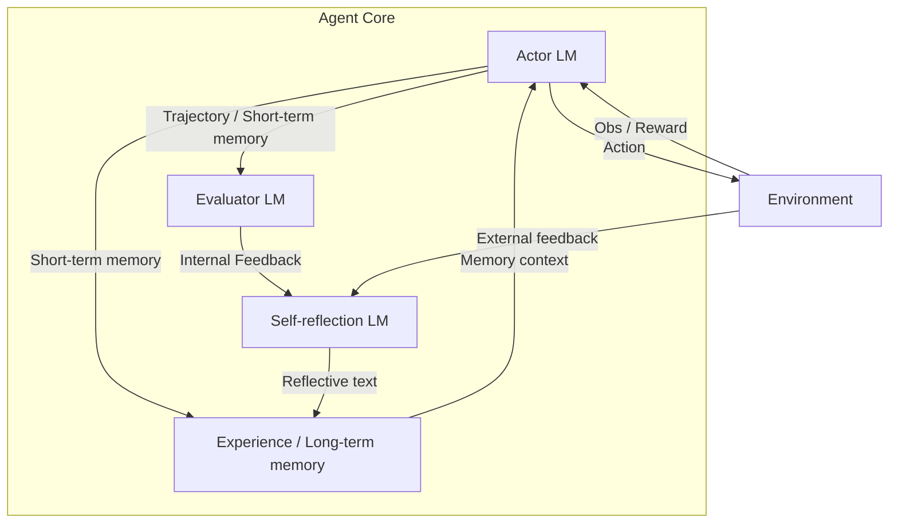

# 🚀 Reflexion: Language Agents with Verbal Reinforcement Learning

> 💡 **Authors**
> * **Noah Shinn** (Northeastern University) - [`noahshinn024@gmail.com`](mailto:noahshinn024@gmail.com)
> * **Edward Berman** (Northeastern University) - [`berman.ed@northeastern.edu`](mailto:berman.ed@northeastern.edu)
> * **Karthik Narasimhan** (Princeton University) - [`karthikn@princeton.edu`](mailto:karthikn@princeton.edu)
> * **Federico Cassano** (Northeastern University) - [`cassano.f@northeastern.edu`](mailto:cassano.f@northeastern.edu)
> * **Ashwin Gopinath** (Massachusetts Institute of Technology) - [`agopi@mit.edu`](mailto:agopi@mit.edu)
> * **Shunyu Yao** (Princeton University) - [`shunyuy@princeton.edu`](mailto:shunyuy@princeton.edu)

---

## 🎯 Abstract

Large language models (LLMs) have been increasingly used to interact with external environments (e.g., games, compilers, APIs) as goal-driven agents. However, it remains challenging for these language agents to quickly and efficiently learn from trial-and-error as traditional reinforcement learning methods require extensive training samples and expensive model fine-tuning. 

We propose **Reflexion**, a novel framework to reinforce language agents not by updating weights, but instead through linguistic feedback. 

**How it works:**
* Reflexion agents verbally reflect on task feedback signals.
* They maintain their own reflective text in an episodic memory buffer.
* This memory induces better decision-making in subsequent trials. 

**Key Highlights:**
* **Flexible Feedback:** Incorporates various types (scalar values or free-form language) and sources (external or internally simulated) of feedback signals.
* **Significant Improvements:** Outperforms baseline agents across diverse tasks (sequential decision-making, coding, language reasoning).
* **State-of-the-Art Results:** Achieves a **91% pass@1** accuracy on the HumanEval coding benchmark, surpassing the previous state-of-the-art GPT-4 (**80%**). 

We also conduct ablation and analysis studies using different feedback signals, feedback incorporation methods, and agent types, and provide insights into how they affect performance. 

🔗 **Resources:** We release all code, demos, and datasets at [https://github.com/noahshinn024/reflexion](https://github.com/noahshinn024/reflexion).

---

## 1. 🚀 Introduction

Recent works such as ReAct [30], SayCan [1], Toolformer [22], HuggingGPT [23], generative agents [19], and WebGPT [17] have demonstrated the feasibility of autonomous decision-making agents that are built on top of a large language model (LLM) core. These methods use LLMs to generate text and actions that can be used in API calls and executed in an environment. 

> ⚠️ **Limitation of Prior Approaches**
> Since they rely on massive models with an enormous number of parameters, such approaches have been so far limited to using in-context examples as a way of teaching the agents, since more traditional optimization schemes like reinforcement learning with gradient descent require substantial amounts of compute and time.

In this paper, we propose an alternative approach called **Reflexion** that uses verbal reinforcement to help agents learn from prior failings. 

**The Reflexion Approach:**
1. Converts binary or scalar feedback from the environment into verbal feedback in the form of a textual summary.
2. Adds this summary as additional context for the LLM agent in the next episode. 

This self-reflective feedback acts as a **"semantic" gradient signal** by providing the agent with a concrete direction to improve upon, helping it learn from prior mistakes to perform better on the task. This is akin to how humans iteratively learn to accomplish complex tasks in a few-shot manner—by reflecting on their previous failures in order to form an improved plan of attack for the next attempt. For example, a Reflexion agent learns to optimize its own behavior to solve decision-making, programming, and reasoning tasks through trial, error, and self-reflection.

### 🔍 Generating Useful Reflective Feedback

Generating useful reflective feedback is challenging since it requires a good understanding of where the model made mistakes (i.e., the credit assignment problem [25]) as well as the ability to generate a summary containing actionable insights for improvement. We explore three ways for doing this:
* **Binary environment feedback**
* **Pre-defined heuristics** (for common failure cases)
* **Self-evaluation** (e.g., binary classification using LLMs for decision-making or self-written unit tests for programming)

In all implementations, the evaluation signal is amplified to natural language experience summaries which can be stored in long-term memory.

### ⭐ Advantages of Reflexion

Reflexion has several advantages compared to more traditional RL approaches like policy or value-based learning: 

1. **Lightweight:** It is lightweight and doesn't require finetuning the LLM.
2. **Nuanced Feedback:** It allows for more nuanced forms of feedback (e.g., targeted changes in actions), compared to scalar or vector rewards that are challenging to perform accurate credit assignment with.
3. **Explicit Episodic Memory:** It allows for a more explicit and interpretable form of episodic memory over prior experiences.
4. **Actionable Hints:** It provides more explicit hints for actions in future episodes. 

> ⚠️ **Disadvantages**
> It does have the disadvantages of relying on the power of the LLM's self-evaluation capabilities (or heuristics) and not having a formal guarantee for success. However, as LLM capabilities improve, we only expect this paradigm to get better over time.

### 🧪 Experiments

We perform experiments on three core domains:
1. **Decision-making tasks** to test sequential action choices over long trajectories.
2. **Reasoning tasks** to test knowledge-intensive, single-step generation improvement.
3. **Programming tasks** to teach the agent to effectively use external tools such as compilers and interpreters. 

**Performance Gains:**
Across all three types of tasks, we observe Reflexion agents are better decision-makers, reasoners, and programmers. More concretely, Reflexion agents improve on:
* **AlfWorld [24] (Decision-making):** Absolute **22%** improvement over strong baseline approaches in 12 iterative learning steps.
* **HotPotQA [28] (Reasoning):** **20%** improvement on reasoning questions.
* **HumanEval [6] (Programming):** Up to **11%** improvement on Python programming tasks.

### 💎 Summary of Contributions

* **New Paradigm:** We propose **Reflexion**, a new paradigm for verbal reinforcement that parameterizes a policy as an agent's memory encoding paired with a choice of LLM parameters.
* **Empirical Insights:** We explore this emergent property of self-reflection in LLMs and empirically show that self-reflection is extremely useful to learn complex tasks over a handful of trials.
* **New Benchmark:** We introduce **LeetcodeHardGym**, a code-generation RL gym environment consisting of 40 challenging Leetcode questions ("hard-level") in 19 programming languages.
* **State-of-the-Art Results:** We show that Reflexion achieves improvements over strong baselines across several tasks, and achieves state-of-the-art results on various code generation benchmarks.

---

## 2. 📖 Related Work

### 2.1 Reasoning and Decision-Making

Several prior works focus on related concepts but with specific limitations compared to Reflexion:
* **Self-Refine [15]:** Employs an iterative framework for self-refinement to autonomously improve generation through self-evaluation based on task constraints. *Limitation:* Limited to single-generation reasoning tasks.
* **Semantic Prompt-Writing [21]:** Performs a similar optimization to Self-Refine but is also limited to single-generation tasks.
* **Intermediate Feedback [20]:** Fine-tunes critic models to provide intermediate feedback within trajectories to improve reasoning responses.
* **Stochastic Beam Search [27]:** Uses stochastic beam search over actions to perform a more efficient decision-making search strategy.
* **Decider Models [31, 16]:** Uses decider models to reason over several generations.
* **Retry Patterns [10]:** Uses a retry pattern over a fixed number of steps without an evaluation step.
* **Qualitative Evaluation [9]:** Performs a qualitative evaluation step that proposes optimizations to the previous generation.

In this paper, we show that several of these concepts can be enhanced with self-reflection to build a **persisting memory of self-reflective experiences** which allows an agent to identify its own errors and self-suggest lessons to learn from its mistakes over time.

| Approach | Self-Refine | Hidden Constraints | Decision Making | Binary Reward | Memory |
| :--- | :---: | :---: | :---: | :---: | :---: |
| Self-refine [15] | ✅ | ✅ | ❌ | ❌ | ❌ |
| Beam search [27] | ❌ | ❌ | ✅ | ❌ | ❌ |
| **Reflexion (ours)** | ✅ | ✅ | ✅ | ✅ | ✅ |

### 2.2 Programming

Several past and recent works employ variations of test-driven development or code debugging practices:
* **AlphaCode [14]:** Evaluates a set of generations on hidden test cases.
* **CodeT [5]:** Uses self-generated unit tests that are used to score generated function implementations. (Does not access hidden test cases but does not implement a self-learning step).
* **Self-Debugging [7]:** Employs a debugging component used to improve existing implementations given feedback from a code execution environment.
* **CodeRL [12]:** Sets the problem in an RL framework using an actor-critic setup to debug programs given feedback from an execution environment.

> 💡 **Comparison Insight**
> AlphaCode, Self-Debugging, and CodeRL rely upon ground truth test cases that invalidate pass@1 eligibility, and do not use self-reflection to bridge the gap between error identification and implementation improvement. 

| Approach | Test Execution | Debugging | Self-Generated Tests | Multiple Languages | Self-Reflection |
| :--- | :---: | :---: | :---: | :---: | :---: |
| AlphaCode [14] | ✅ | ❌ | ❌ | ✅ | ❌ |
| CodeT [5] | ✅ | ❌ | ✅ | ❌ | ❌ |
| Self-Debugging [7] | ✅ | ✅ | ❌ | ❌ | ❌ |
| CodeRL [12] | ✅ | ✅ | ❌ | ❌ | ❌ |
| **Reflexion (ours)** | ✅ | ✅ | ✅ | ✅ | ✅ |

---

## 3. 🛠️ Reflexion: Reinforcement via Verbal Reflection

We develop a modular formulation for Reflexion, utilizing three distinct models:

1. **🎭 An Actor ($M_a$):** Generates text and actions.
2. **⚖️ An Evaluator model ($M_e$):** Scores the outputs produced by $M_a$.
3. **🧠 A Self-Reflection model ($M_{sr}$):** Generates verbal reinforcement cues to assist the Actor in self-improvement.

We provide a detailed description of each of these models and subsequently elucidate their collaborative functioning within the Reflexion framework.



### 🎭 Actor
The Actor is built upon a large language model (LLM) that is specifically prompted to generate the necessary text and actions conditioned on the state observations. 

* **Process:** Analogous to traditional policy-based RL setups, we sample an action or generation, $a_t$, from the current policy $\pi_\theta$ at time $t$, and receive an observation from the environment $o_t$. 
* **Models Explored:** We explore various Actor models, including Chain of Thought [26] and ReAct [30]. 
* **Memory Component:** We also add a memory component $\text{mem}$ that provides additional context to this agent (inspired by Brooks et al. [3]).

### ⚖️ Evaluator
The Evaluator component plays a crucial role in assessing the quality of the generated outputs produced by the Actor. It takes as input a generated trajectory and computes a reward score that reflects its performance within the given task context.

* **Reasoning Tasks:** We explore reward functions based on exact match (EM) grading.
* **Decision-Making Tasks:** We employ pre-defined heuristic functions tailored to specific evaluation criteria.
* **LLM Evaluators:** We experiment with using a different instantiation of an LLM itself as an Evaluator for decision-making and programming tasks.

### 🧠 Self-Reflection
The Self-Reflection model, instantiated as an LLM, generates verbal self-reflections to provide valuable feedback for future trials. 

* **Mechanism:** Given a sparse reward signal (e.g., success/fail), the current trajectory, and its persistent memory $\text{mem}$, the model generates nuanced and specific feedback. This feedback is then stored in the agent's memory ($\text{mem}$).
* **Example:** In a multi-step decision-making task, when the agent receives a failure signal, it can infer that a specific action $a_i$ led to subsequent incorrect actions $a_{i+1}$ and $a_{i+2}$. The agent can verbally state that it should have taken a different action, $a_i'$, and store this experience. In subsequent trials, the agent can leverage its past experiences to adapt its decision-making approach at time $t$ by choosing action $a_i'$.

### 📂 Memory
Core components of the Reflexion process are the notion of short-term and long-term memory. At inference time, the Actor conditions its decisions on short- and long-term memory, similar to the way that humans remember fine-grain recent details while also recalling distilled important experiences from long-term memory. 
* **Short-term Memory:** The trajectory history.
* **Long-term Memory:** Outputs from the Self-Reflection model.

### 🔄 The Reflexion Process
Reflexion is formalized as an iterative optimization process in Algorithm 1. 
1. In the first trial, the Actor produces a trajectory $\tau_0$ by interacting with the environment. 
2. The Evaluator produces a score $r_0$ computed as $r_t = M_e(\tau_0)$. 
3. The Self-Reflection model analyzes $\{\tau_0, r_0\}$ to produce a summary $sr_0$ which is stored in memory $\text{mem}$. 

> 📌 **Note**
> In practice, we bound $\text{mem}$ by a maximum number of stored experiences, $\Omega$ (usually set to 1–3) to adhere to max context LLM limitations.

#### Algorithm 1: Reinforcement via self-reflection

```text
Initialize Actor, Evaluator, Self-Reflection: M_a, M_e, M_sr
Initialize policy \pi_\theta(a_i | s_i), \theta = {M_a, mem}
Generate initial trajectory using \pi_\theta
Evaluate \tau_0 using M_e
Generate initial self-reflection sr_0 using M_sr
Set mem \leftarrow [sr_0]
Set t = 0
while M_e not pass or t < max trials do
    Generate \tau_t = [a_0, o_0, ... a_i, o_i] using \pi_\theta
    Evaluate \tau_t using M_e
    Generate self-reflection sr_t using M_sr
    Append sr_t to mem
    Increment t
end while
return
```

---

## 4. 📊 Experiments

We evaluate various natural language RL setups on decision-making, reasoning, and code generation tasks. Specifically, we challenge an agent to perform search-based question answering on HotPotQA [28], multi-step tasks in common household environments in AlfWorld [24], and code writing tasks in competition-like environments with interpreters and compilers in HumanEval [6], MBPP [2], and Leetcode Hard, a new benchmark.

### 4.1 Sequential Decision Making: ALFWorld

AlfWorld is a suite of text-based environments that challenge an agent to solve multi-step tasks in a variety of interactive environments based on TextWorld [8]. 

* **Setup:** Following Yao et al. [30], we run the agent in 134 AlfWorld environments across six different tasks. We use ReAct [30] as the action generator. 
* **Evaluation:** To achieve fully autonomous behavior, we implement two self-evaluation techniques: natural language classification using an LLM and a hand-written heuristic. 

#### 📈 Results
ReAct + Reflexion significantly outperforms ReAct by completing **130 out of 134** tasks using the simple heuristic to detect hallucinations and inefficient planning. Further, ReAct + Reflexion learns to solve additional tasks by learning in 12 consecutive trials. In the ReAct-only approach, performance increase halts between trials 6 and 7.

#### 🔍 Analysis
A common error in baseline failed AlfWorld trajectories is when an agent thinks that it has possession of an item but does not actually have the item. Reflexion eliminates almost all of these cases by using self-reflection to distill long, failed trajectories into relevant experiences that are used as "self-hints" in the future.

### 4.2 Reasoning: HotpotQA

HotPotQA [28] is a Wikipedia-based dataset with 113k question-and-answer pairs that challenge agents to parse content and reason over several supporting documents. 

* **Setup:** To test improvement in reasoning-only ability, we implement Reflexion + Chain-of-Thought (CoT) [26] for step-by-step $Q \to A$ and $Q, C_{gt} \to A$ implementations. To test holistic question and answering ability, we implement a Reflexion + ReAct [30] agent that can retrieve relevant context using a Wikipedia API.

#### 📈 Results
Reflexion outperforms all baseline approaches by significant margins over several learning steps. Furthermore, ReAct-only, CoT-only, and CoT (GT)-only implementations fail to probabilistically improve on any tasks. Reflexion helps the agent to correct its mistakes without access to the ground truth answer to improve its accuracy by **14%**.

#### 🔍 Analysis
We perform an ablation experiment to isolate the advantage of the self-reflective step for reasoning using CoT (GT) as the baseline approach. Self-reflection improves learning by an **8%** absolute boost over the episodic memory learning advantage, supporting the argument that refinement-only approaches are not as effective as self-reflection-guided refinement approaches.

### 4.3 Programming

We evaluate the baseline and Reflexion approaches on Python and Rust code writing on MBPP [2], HumanEval [6], and LeetcodeHardGym, our new dataset. MBPP and HumanEval measure function body generation accuracy given natural language descriptions. We use MultiPL-E [4] to translate subsets of HumanEval and MBPP to the Rust language. 

> 💡 **LeetcodeHardGym**
> We introduce a new benchmark, **LeetcodeHardGym**, an interactive programming gym containing 40 Leetcode hard-rated questions released after October 8, 2022 (GPT-4's pre-training cutoff) [18].

The task of programming presents an opportunity to use grounded self-evaluation practices such as self-generated unit test suites, making Reflexion eligible for pass@1 accuracy reporting.

**Table 1: Pass@1 accuracy for various model-strategy-language combinations.** 
*The base strategy is a single code generation sample. All instruction-based models follow zero-shot code generation.*

| Benchmark + Language | Prev SOTA Pass@1 | SOTA Pass@1 | Reflexion Pass@1 |
| :--- | :--- | :--- | :---: |
| HumanEval (PY) | 65.8 (CodeT [5] + GPT-3.5) | 80.1 (GPT-4) | **91.0** |
| HumanEval (RS) | — | 60.0 (GPT-4) | **68.0** |
| MBPP (PY) | 67.7 (CodeT [5] + Codex [6]) | 80.1 (GPT-4) | **77.1** |
| MBPP (RS) | — | 70.9 (GPT-4) | **75.4** |
| Leetcode Hard (PY) | — | 7.5 (GPT-4) | **15.0** |

**Table 2: Overall accuracy and test generation performance for HumanEval and MBPP.** 
*TP: unit tests pass, solution pass; FN: unit tests fail, solution pass; FP: unit tests pass, solution fail; TN: unit tests fail, solution fail.*

| Benchmark + Language | Base | Reflexion | TP | FN | FP | TN |
| :--- | :---: | :---: | :---: | :---: | :---: | :---: |
| HumanEval (PY) | 0.80 | 0.91 | 0.99 | 0.40 | 0.01 | 0.60 |
| MBPP (PY) | 0.80 | 0.77 | 0.84 | 0.59 | 0.16 | 0.41 |
| HumanEval (RS) | 0.60 | 0.68 | 0.87 | 0.37 | 0.13 | 0.63 |
| MBPP (RS) | 0.71 | 0.75 | 0.84 | 0.51 | 0.16 | 0.49 |


#### 📈 Results
Reflexion outperforms all baseline accuracies and sets new state-of-the-art standards on all benchmarks for Python and Rust except for MBPP Python.

#### 🔍 Analysis & False Positives
Self-reflecting code-generation agents are bound to their ability to write diverse, comprehensive tests. If the model generates a flaky test suite, all tests may pass on an incorrect solution (false positive). In Table 2, we observe a notable discrepancy for MBPP Python where the false positive test execution rate is 16.3%, compared to 1.4% for HumanEval Python.

**Table 3: Pass@1 accuracy for various compromised approaches on the Reflexion approach using GPT-4 as the base model on HumanEval Rust - 50 hardest problems.**

| Approach | Test Generation | Self-Reflection | Pass@1 (Acc) |
| :--- | :---: | :---: | :---: |
| Base model | ❌ | ❌ | 0.60 |
| Test generation omission | ❌ | ✅ | 0.52 |
| Self-reflection omission | ✅ | ❌ | 0.60 |
| **Reflexion** | ✅ | ✅ | **0.68** |


#### 🧪 Ablation Study
* **Omit test generation:** Results in an inferior 52% accuracy (vs 60% baseline), showing the agent cannot determine correctness without unit tests.
* **Omit self-reflection:** Results in no improvement over baseline (60%), showing that blind trial-and-error debugging without natural language explanation is ineffective on harder tasks.

---

## 5. ⚠️ Limitations

At its core, Reflexion is an optimization technique that uses natural language to do policy optimization. While powerful, it may still succumb to non-optimal local minima solutions. 

* **Memory Capacity:** In this study, we limit long-term memory to a sliding window with maximum capacity ($\Omega$), but we encourage future work to extend the memory component with vector embedding databases or traditional SQL databases. 
* **Test-Driven Development:** Specific to code generation, test-driven development faces practical limitations in specifying accurate input-output mappings for non-deterministic generator functions, impure functions interacting with APIs, functions varying output by hardware specifications, or parallel/concurrent behavior.

---

## 6. 🌍 Broader Impact

Large language models are increasingly used to interact with external environments and humans. Our work reinforces and empowers these agents toward greater automation and work efficiency, but also amplifies risks when misused. 

On the other hand, reinforcement learning has historically suffered from black-box policy setups where interpretability and alignment are challenging. Our "verbal" reinforcement learning addresses some of these issues, making autonomous agents more interpretable and diagnosable. For instance, self-reflections can be monitored to ensure proper intent before tool execution.

---

## 7. 🏁 Conclusion

In this work, we present **Reflexion**, an approach that leverages verbal reinforcement to teach agents to learn from past mistakes. We empirically show that Reflexion agents significantly outperform currently widely-used decision-making approaches by utilizing self-reflection. In future work, Reflexion could be used to employ more advanced techniques such as value learning in natural language or off-policy exploration techniques.

---

## 8. 🛠️ Reproducibility

> ❗ **Critical**
> We highly advise others to use isolated execution environments when running autonomous code writing experiments as the generated code is not validated before execution. 

All code, demos, and datasets are available at [https://github.com/noahshinn024/reflexion](https://github.com/noahshinn024/reflexion).

---

<details>
<summary><h2>🔗 References</h2></summary>

[1] Ahn, M., Brohan, A., Brown, N., Chebotar, Y., Cortes, O., David, B., Finn, C., Gopalakrishnan, K., Hausman, K., Herzog, A., et al. (2022). Do as i can, not as i say: Grounding language in robotic affordances. *arXiv preprint [arXiv:2204.01691](https://arxiv.org/abs/2204.01691)*.  
[2] Austin, J., Odena, A., Nye, M., Bosma, M., Michalewski, H., Dohan, D., Jiang, E., Cai, C., Terry, M., Le, Q., et al. (2021). Program synthesis with large language models. *arXiv preprint [arXiv:2108.07732](https://arxiv.org/abs/2108.07732)*.  
[3] Brooks, E., Walls, L., Lewis, R. L., and Singh, S. (2022). In-context policy iteration. *arXiv preprint [arXiv:2210.03821](https://arxiv.org/abs/2210.03821)*.  
[4] Cassano, F., Gouwar, J., Nguyen, D., Nguyen, S., Phipps-Costin, L., Pinckney, D., Yee, M.-H., Zi, Y., Anderson, C. J., Feldman, M. Q., Guha, A., Greenberg, M., and Jangda, A. (2022). Multipl-e: A scalable and extensible approach to benchmarking neural code generation.  
[5] Chen, B., Zhang, F., Nguyen, A., Zan, D., Lin, Z., Lou, J.-G., and Chen, W. (2022). Codet: Code generation with generated tests. *arXiv preprint [arXiv:2207.10397](https://arxiv.org/abs/2207.10397)*.  
[6] Chen, M., Tworek, J., Jun, H., Yuan, Q., Pinto, H. P. d. O., Kaplan, J., Edwards, H., Burda, Y., Joseph, N., Brockman, G., et al. (2021). Evaluating large language models trained on code. *arXiv preprint [arXiv:2107.03374](https://arxiv.org/abs/2107.03374)*.  
[7] Chen, X., Lin, M., Schärli, N., and Zhou, D. (2023). Teaching large language models to self-debug. *arXiv preprint [arXiv:2304.05128](https://arxiv.org/abs/2304.05128)*.  
[8] Côté, M.-A., Kádár, A., Yuan, X., Kybartas, B., Barnes, T., Fine, E., Moore, J., Hausknecht, M., El Asri, L., Adada, M., et al. (2019). Textworld: A learning environment for text-based games. In *Computer Games: 7th Workshop, CGW 2018*, pages 41-75. Springer.  
[9] Goodman, N. (2023). Meta-prompt: A simple self-improving language agent. `noahgoodman.substack.com`.  
[10] Kim, G., Baldi, P., and McAleer, S. (2023). Language models can solve computer tasks. *arXiv preprint [arXiv:2303.17491](https://arxiv.org/abs/2303.17491)*.  
[11] Lam, W., Winter, S., Wei, A., Xie, T., Marinov, D., and Bell, J. (2020). A large-scale longitudinal study of flaky tests. *Proc. ACM Program. Lang.*, 4(OOPSLA).  
[12] Le, H., Wang, Y., Gotmare, A. D., Savarese, S., and Hoi, S. C. H. (2022). Coderl: Mastering code generation through pretrained models and deep reinforcement learning. *Advances in Neural Information Processing Systems*, 35:21314-21328.  
[13] Li, R., Allal, L. B., Zi, Y., Muennighoff, N., Kocetkov, D., Mou, C., Marone, M., Akiki, C., Li, J., Chim, j., et al. (2023). Starcoder: may the source be with you! *arXiv preprint [arXiv:2305.06161](https://arxiv.org/abs/2305.06161)*.  
[14] Li, Y., Choi, D., Chung, J., Kushman, N., Schrittwieser, J., Leblond, R., Eccles, T., Keeling, J., Gimeno, F., Dal Lago, A., et al. (2022). Competition-level code generation with alphacode. *Science*, 378(6624):1092-1097.  
[15] Madaan, A., Tandon, N., Gupta, P., Hallinan, S., Gao, L., Wiegreffe, S., Alon, U., Dziri, N., Prabhumoye, S., Yang, Y., et al. (2023). Self-refine: Iterative refinement with self-feedback. *arXiv preprint [arXiv:2303.17651](https://arxiv.org/abs/2303.17651)*.  
[16] Nair, V., Schumacher, E., Tso, G., and Kannan, A. (2023). Dera: Enhancing large language model completions with dialog-enabled resolving agents. *arXiv preprint [arXiv:2303.17071](https://arxiv.org/abs/2303.17071)*.  
[17] Nakano, R., Hilton, J., Balaji, S., Wu, J., Ouyang, L., Kim, C., Hesse, C., Jain, S., Kosaraju, V., Saunders, W., et al. (2021). Webgpt: Browser-assisted question-answering with human feedback. *arXiv preprint [arXiv:2112.09332](https://arxiv.org/abs/2112.09332)*.  
[18] OpenAI (2023). Gpt-4 technical report. *ArXiv*.  
[19] Park, J. S., O'Brien, J. C., Cai, C. J., Morris, M. R., Liang, P., and Bernstein, M. S. (2023). Generative agents: Interactive simulacra of human behavior. *arXiv preprint [arXiv:2304.03442](https://arxiv.org/abs/2304.03442)*.  
[20] Paul, D., Ismayilzada, M., Peyrard, M., Borges, B., Bosselut, A., West, R., and Faltings, B. (2023). Refiner: Reasoning feedback on intermediate representations. *arXiv preprint [arXiv:2304.01904](https://arxiv.org/abs/2304.01904)*.  
[21] Pryzant, R., Iter, D., Li, J., Lee, Y. T., Zhu, C., and Zeng, M. (2023). Automatic prompt optimization with "gradient descent" and beam search. *arXiv preprint [arXiv:2305.03495](https://arxiv.org/abs/2305.03495)*.  
[22] Schick, T., Dwivedi-Yu, J., Dessì, R., Raileanu, R., Lomeli, M., Zettlemoyer, L., Cancedda, N., and Scialom, T. (2023). Toolformer: Language models can teach themselves to use tools. *arXiv preprint [arXiv:2302.04761](https://arxiv.org/abs/2302.04761)*.  
[23] Shen, Y., Song, K., Tan, X., Li, D., Lu, W., and Zhuang, Y. (2023). Hugginggpt: Solving ai tasks with chatgpt and its friends in huggingface. *arXiv preprint [arXiv:2303.17580](https://arxiv.org/abs/2303.17580)*.  
[24] Shridhar, M., Yuan, X., Côté, M.-A., Bisk, Y., Trischler, A., and Hausknecht, M. (2021). ALFWorld: Aligning Text and Embodied Environments for Interactive Learning. In *Proceedings of the International Conference on Learning Representations (ICLR)*.  
[25] Sutton, R. S. and Barto, A. G. (2018). *Reinforcement Learning: An Introduction*. The MIT Press, second edition.  
[26] Wei, J., Wang, X., Schuurmans, D., Bosma, M., Chi, E., Le, Q., and Zhou, د. (2022). Chain of thought prompting elicits reasoning in large language models. *arXiv preprint [arXiv:2201.11903](https://arxiv.org/abs/2201.11903)*.  
[27] Xie, Y., Kawaguchi, K., Zhao, Y., Zhao, X., Kan, M.-Y., He, J., and Xie, Q. (2023). Decomposition enhances reasoning via self-evaluation guided decoding. *arXiv preprint [arXiv:2305.00633](https://arxiv.org/abs/2305.00633)*.  
[28] Yang, Z., Qi, P., Zhang, S., Bengio, Y., Cohen, W. W., Salakhutdinov, R., and Manning, C. D. (2018). HotpotQA: A dataset for diverse, explainable multi-hop question answering. In *Conference on Empirical Methods in Natural Language Processing (EMNLP)*.  
[29] Yao, S., Chen, H., Yang, J., and Narasimhan, K. (preprint). Webshop: Towards scalable real-world web interaction with grounded language agents. In *ArXiv*.  
[30] Yao, S., Zhao, J., Yu, D., Du, N., Shafran, I., Narasimhan, K., and Cao, Y. (2023). ReAct: Synergizing reasoning and acting in language models. In *International Conference on Learning Representations (ICLR)*.  
[31] Yoran, O., Wolfson, T., Bogin, B., Katz, U., Deutch, D., and Berant, J. (2023). Answering questions by meta-reasoning over multiple chains of thought. *arXiv preprint [arXiv:2304.13007](https://arxiv.org/abs/2304.13007)*.

</details>

---

## 📝 Appendix A: Evaluation with Additional Models

**Table 4: Pass@1 accuracy on HumanEval Python using starchat-beta [13].**

| Approach | Pass@1 accuracy (avg over 8 trials) | Pass@1 accuracy (std) |
| :--- | :---: | :---: |
| Baseline | 0.26 | 0.00481 |
| Reflexion | 0.26 | 0.00305 |

**Table 5: Pass@1 accuracy on 100 HotPotQA using various models.**

| Model | Baseline accuracy | Reflexion accuracy |
| :--- | :---: | :---: |
| CoT (GT) + text-davinci-003 | 0.60 | 0.77 |
| CoT (GT) + gpt-3.5-turbo | 0.57 | 0.71 |
| CoT (GT) + gpt-4 | 0.68 | 0.80 |
| ReAct + text-davinci-003 | 0.30 | 0.55 |
| ReAct + gpt-3.5-turbo | 0.26 | 0.38 |
| ReAct + gpt-4 | 0.39 | 0.51 |

---

## 📝 Appendix B: Decision-Making & WebShop

### B.1 WebShop Limitation

Reflexion struggles to overcome local minima choices that require extremely creative behavior to escape. We observe this shortcoming in an experiment on **WebShop** [29], a web-based problem-solving benchmark testing agents to navigate an e-commerce website to locate and purchase products. 

After four trials, we terminate runs as the agent does not show signs of improvement or generate helpful self-reflections. We conclude that Reflexion is unable to solve tasks requiring a significant amount of diversity and exploration where search space feedback is sparse or ambiguous.

---

## 📝 Appendix C: Programming Code & Prompt Examples

### C.1 Programming Function Implementation Example (HumanEval Python)

**Sample function signature:**
```python
def minSubArraySum(nums):
    '''
    Given an array of integers nums, find the minimum sum of any
    non-empty sub-array of nums.
    Example:
    minSubArraySum([2, 3, 4, 1, 2, 4]) == 1
    minSubArraySum([-1, -2, -3]) == -6
    '''
```

**Sample function body implementation:**
```python
    min_sum = float('inf')
    for i in range(len(nums)):
        current_sum = 0
        for j in range(i, len(nums)):
            current_sum += nums[j]
            if current_sum < min_sum:
                min_sum = current_sum
    return min_sum
```

### C.2 Reflexion Actor Instruction

> 💬 **Prompt**
> 
> You are a Python writing assistant. You will be given your previous implementation of a function, a series of unit tests results, and your self-reflection on your previous implementation. Apply the necessary changes below by responding only with the improved body of the function. Do not include the signature in your response. The first line of your response should have 4 spaces of indentation so that it fits syntactically with the user provided signature.

---

## 📝 Appendix D: Reasoning Prompts & Examples

### D.1 HotPotQA Chain-of-Thought + Reflexion Example

* **❓ Question:** What profession do John Lanchester and Alan Dean Foster have in common?
* **❌ Trial #1 Thought:** Let's think step by step. John Lanchester is a novelist, journalist, and critic. Alan Dean Foster is a novelist and screenwriter. So the profession John Lanchester and Alan Dean Foster have in common is novelist and screenwriter. (`Finish[novelist and screenwriter]`) -> **Incorrect**
* **✅ Trial #2 Thought:** Let's think step by step. John Lanchester is a novelist, journalist, and financial journalist. Alan Dean Foster is a novelist and screenwriter. So the profession John Lanchester and Alan Dean Foster have in common is novelist. (`Finish[novelist]`) -> **Correct**

> 🧠 **Reflection**
> 
> My reasoning for the profession John Lanchester and Alan Dean Foster have in common failed because I incorrectly assumed that they both had the same profession. In the future, when attempting this question, I should focus on better researching the individual backgrounds of both authors to ensure that I am accurately identifying their professions.
