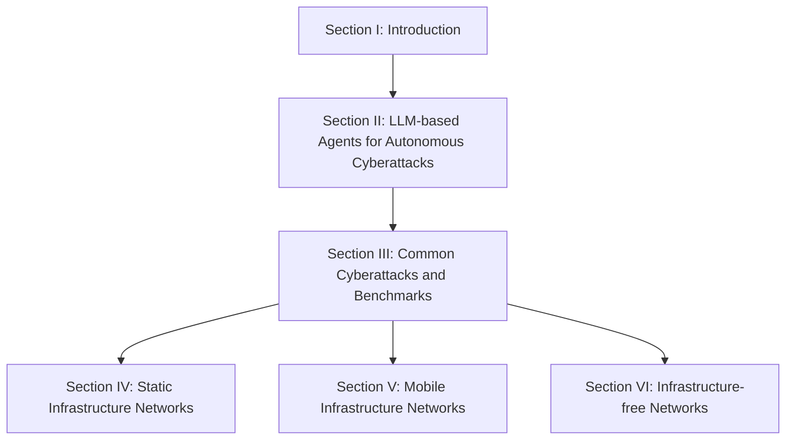
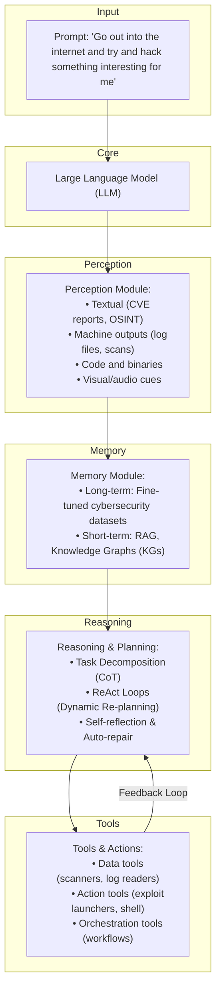

# 🛡️ Forewarned is Forearmed: A Survey on Large Language Model-based Agents in Autonomous Cyberattacks

**Minrui Xu**¹, **Jiani Fan**¹, **Xinyu Huang**², **Conghao Zhou**², **Jiawen Kang**³, **Dusit Niyato**¹, **Shiwen Mao**⁴, **Zhu Han**⁵, **Xuemin (Sherman) Shen**², **Kwok-Yan Lam**¹  
¹ *Nanyang Technological University, Singapore*  
² *University of Waterloo, Canada*  
³ *Guangdong University of Technology, China*  
⁴ *Auburn University, USA*  
⁵ *University of Houston, USA*  

---

## 🚀 Abstract

With the continuous evolution of Large Language Models (LLMs), LLM-based agents have advanced beyond passive chatbots to become autonomous cyber entities capable of performing complex tasks, including web browsing, malicious code and deceptive content generation, and decision-making. By significantly reducing the time, expertise, and resources, AI-assisted cyberattacks orchestrated by LLM-based agents have led to a phenomenon termed **Cyber Threat Inflation**, characterized by a significant reduction in attack costs and a tremendous increase in attack scale. To provide actionable defensive insights, in this survey, we focus on the potential cyber threats posed by LLM-based agents across diverse network systems. 

Firstly, we present the capabilities of LLM-based cyberattack agents, which include executing autonomous attack strategies, comprising scouting, memory, reasoning, and action, and facilitating collaborative operations with other agents or human operators. Building on these capabilities, we examine common cyberattacks initiated by LLM-based agents and compare their effectiveness across different types of networks, including static, mobile, and infrastructure-free paradigms. Moreover, we analyze threat bottlenecks of LLM-based agents across different network infrastructures and review their defense methods. 

> ⚠️ **Critical Finding**
> 
> Due to operational imbalances, existing defense methods are inadequate against autonomous cyberattacks. Finally, we outline future research directions and potential defensive strategies for legacy network systems.

**CCS Concepts:** Networks $\rightarrow$ Surveys and overviews; Network security; Computing methodologies $\rightarrow$ Artificial intelligence; General and reference $\rightarrow$ Document types.

**Additional Key Words and Phrases:** Large Language Models (LLMs), Cybersecurity, Autonomous Cyberattacks, Network Security.

---

## 1. 📖 Introduction

### 1.1 Background and Motivation

The evolving capabilities of large language models (LLMs) are rapidly transforming attack and defense operations in cybersecurity [80]. Major AI companies have begun to systematically evaluate these risks using the Cyber Kill Chain Framework [127, 161]. 
* **Google's Project Naptime** has demonstrated that frontier LLMs can autonomously assist in offensive security tasks with minimal human input, including code exploitation and vulnerability discovery [75]. 
* **Anthropic** has deployed red teams to test its Claude models against cybersecurity misuse scenarios, revealing new emergent risks in autonomous agent behavior [23]. 

These findings reinforce the concern that LLMs have significantly lowered the technical threshold and cost of multi-stage intrusions [175].

Leveraging LLMs equipped with perception, memory, reasoning, and action modules, LLM-based agents can conduct cyberattacks autonomously with minimal human intervention [47, 107]. LLM-based agents introduce novel attack paradigms (e.g., jailbreak attack [170]) and significantly amplify existing cyberattacks (e.g., vulnerability exploitation, malware generation, and social engineering [38]).

> 💡 **Cyber Threat Inflation**
> 
> LLM-based agents accelerate attack deployment, scale offensive activities, and erode traditional resource bottlenecks. This phenomenon describes the drastic reduction in operational costs for launching cyberattacks alongside a significant increase in their scalability.

LLM-based agents can reduce time, expertise, and resource requirements across all stages of cyberattacks, e.g., vulnerability detection, customized exploitation, and persistent installation [161]. Cyberattacks that previously required months of labor can now be accomplished within hours [157]. In addition to cost collapse, scale uplift manifests in three critical dimensions [18]:

1. ⚡ **Capability uplift:** The automation of offensive tasks such as vulnerability scanning and social engineering. For instance, PentestGPT [52] demonstrates a 228.6% increase in task completion, and RapidPen [132] achieves shell access within 200–400 seconds at a cost of $0.3–$0.6 per run.
2. 🔄 **Throughput uplift:** The ability of LLM-based agents to execute continuous and large-scale attacks in parallel. Net-GPT [151] achieves 95% packet-generation accuracy and maintains MitM sessions for 30 min without expert intervention.
3. 🧠 **Autonomous risk emergence:** Highlights how LLMs with reasoning abilities can dynamically adapt to defensive mechanisms. In satellite networks, PLLM-CS [85] autonomously interprets satellite telemetry to detect intent-based anomalies.

While advanced persistent threat (APT) groups leverage sophisticated techniques, the emergence of LLM-based agents empowers individual attackers to achieve sophisticated attacks as well. Through the integration of LLMs with tool APIs and accessible programming interfaces, organizations with limited technical capabilities are now able to orchestrate complex operations. This transformation has effectively dismantled the traditional security asymmetry between attackers and defenders.

> 📌 **Remember**
> 
> The cyber threat inflation has profound implications for legacy network infrastructures, including enterprise networks, cellular core networks, cloud platforms, and embedded systems. Defenses must remain vigilant at all times to detect and respond to these autonomous intrusions.

---

### 1.2 Related Works

As summarized in Table 1, the capabilities of LLM-based agents have expanded from simple chatbots to sophisticated copilots in cybersecurity.

From an architectural perspective, Wang et al. [189] provide a comprehensive review of LLM-based autonomous agents. Adopting a life cycle perspective, Luo et al. [123] categorize LLM-based agents into construction, collaboration, and evolution. With a domain-specific focus, Jin et al. [97] review LLM applications in software engineering, and He et al. [86] investigate LLM-based multi-agent systems in software engineering, emphasizing human-in-the-loop approaches.

LLM adaptation and evaluation for cybersecurity applications have recently been mapped out in several complementary surveys [214, 65, 221, 27, 80, 11, 95]. Security risks and defenses for network systems, from 6G to cyber-physical infrastructures and the metaverse, have also been scrutinized [135, 58, 37, 193].

#### 📊 Table 1: Related works on LLM Agents, cyberattacks, and network systems.

| Ref. | Survey Focus | LLM Agents | Cyberattacks | Networks |
| :--- | :--- | :---: | :---: | :---: |
| [189] | Architecture, capabilities, applications, and evaluation of LLM-based agents | — | X | X |
| [123] | The life-cycle of LLM agents including construction, collaboration, and evolution | — | X | X |
| [97] | LLM applications in software engineering and evolution into agents | — | X | X |
| [86] | LLM-based multi-agent systems for software engineering and human-in-the-loop | ✓ | X | X |
| [214] | LLMs for cybersecurity tasks like threat intelligence and vulnerability detection | X | — | X |
| [65] | Benchmarking 42 LLMs on intrusion and malware detection tasks | X | — | X |
| [221] | Evaluation of 37 LLMs for bug detection and patch generation | X | — | X |
| [27] | LLMs for code security, strengths in simple flaws and weaknesses in complex issues | X | — | X |
| [80] | Frontier AI's impact on cybersecurity landscapes | X | — | X |
| [11] | LLMs for malware detection, task taxonomies, metrics, and countermeasure | X | ✓ | X |
| [95] | LLM usage in code analysis, malware detection, and reverse engineering | X | — | X |
| [135] | LLM-specific threats and defense pipelines in 6G networks | X | — | ✓ |
| [58] | Cyberattacks on cyber-physical systems; threat modeling and defense synthesis | X | — | ✓ |
| [37] | ML-enabled attacks on IoT networks; evaluation challenges and defense gaps | X | — | ✓ |
| [193] | Metaverse fundamentals, emerging security threats, and privacy challenges | X | — | ✓ |
| **Ours** | **Cyberattack capabilities of LLM-based agents across various network systems.** | **✓** | **✓** | **✓** |

---

### 1.3 Contributions

Conventional perspectives in cybersecurity often overlook that LLM-based autonomous agents can be both defenders and adversaries, contributing to Cyber Threat Inflation to legacy systems [161]. 

To fill this gap, we provide a comprehensive taxonomy and comparative analysis of LLM-based agents in autonomous cyberattacks. Blue teams (defensive protectors) should update threat models by considering LLM-based agents as potential attackers and recognizing novel threat dynamics.

**The main contributions of this survey can be summarized as follows:**

1. 🏛️ **Unified Architecture:** We present a novel unified architecture that abstracts the common design patterns of existing LLM-based cyberattack agents.
2. 🗂️ **Taxonomy of Capabilities:** We present a taxonomy of eight representative cyberattack capabilities for LLM-based agents, analyzing bottlenecks and limitations.
3. 🌐 **Network Paradigm Manifestations:** We demonstrate how cyberattack capabilities manifest across static infrastructure, mobile infrastructure, and infrastructure-free networks.

---

## 2. 🤖 Large Language Model-based Agents in Autonomous Cyberattacks

Cyberattack agents built on top of LLMs use external modules that map high-level natural-language objectives to concrete offensive actions [212]. 

### 2.1 LLM-based Agent Construction

#### 2.1.1 Models

LLM-based agents often leverage state-of-the-art pre-trained foundation models or fine-tuned specialized models on cybersecurity datasets as their "brain" to process prompts and understand network environments. As listed in Table 2, these agents are typically equipped with models like GPT-3.5/4 or Llama due to their generalized world knowledge and strong reasoning capabilities [25, 146, 194].

Recent studies focus on fine-tuning smaller open-source LLMs for security-specific tasks to evade API log detection. 
* **Hackphyr** [159]: A fine-tuned 7B model matching GPT-4 on complex network intrusion scenarios.
* **AttackLLM** [6]: Demonstrates that LLM-generated attack patterns for industrial control systems (ICS) can exceed human-crafted ones.

> 📌 **Remember**
> 
> Every model has limitations (e.g., context size, knowledge cutoff, hallucinations). Defenders can identify these specific LLMs and exploit their weaknesses.

#### 📊 Table 2: Comparison of state-of-the-art LLMs (May 2025)
*(Context window in tokens, speed in tokens/second, prices in USD per million tokens [24].)*

| Company | Model | Parameters | Context Window | Speed | Input Price | Output Price | MMLU |
| :--- | :--- | :---: | :---: | :---: | :---: | :---: | :---: |
| **OpenAI** | GPT-4o / GPT-4 | — | 128k | 164 | $5.00 | $15.00 | 0.803 |
| **Meta** | Llama 4 Maverick / Llama 3.3 | 400B / 70B | 1M / 128k | 121 / 110 | $0.20 | $0.85 | 0.809 |
| **Google** | Gemini 2.5 / Gemini 2.0 | — | 1M / 1M | 160 / 205 | $1.25 | $10.00 | 0.800 |
| **Anthropic** | Claude 3.7 Sonnet / Haiku | — | 200k / 200k | 77 / 66 | $3.00 | $15.00 | 0.803 |
| **Mistral AI** | Mixtral 8x7B | 56B | 33k | 80 | $0.70 | $0.70 | 0.387 |
| **DeepSeek** | R1 | 671B | 130k | 24.6 | $0.55 | $2.219 | 0.844 |
| **xAI** | Grok 3 | 2.7T | 1M | 49 | $3.00 | $15.00 | 0.799 |

**Benchmarks and Evaluation:** 
Recent frameworks like CS-Eval [209] evaluate knowledge, reasoning, and application in cybersecurity tasks. AgentHarm [22] and HarmBench [126] test models against harmful behaviors, showing that even advanced models can follow unsafe instructions.

#### 2.1.2 Perception

Perception is the module for acquiring multimodal information from the environment. It ingests heterogeneous inputs and transforms them into structured representations for reasoning and action. In cyberattacks, an autonomous cyberattack agent encounters at least four distinct sensory channels [214]:

1. 📄 **Textual OSINT and Human Prose:** Tweets, dark-web forum discussions, CVE advisories, and incident response blogs.
2. 💻 **Machine Traces:** Nmap/Masscan scan banners, Nessus XML outputs, system log entries, and NetFlow or PCAP packet captures.
3. 📦 **Program Artefacts:** Source code snippets, abstract syntax tree (AST) or control flow graph fragments, disassembled binaries, and container manifests.
4. 🖼️ **Diagrammatic and Audiovisual Cues:** Screenshots of phishing webpages, network topology diagrams, or VoIP samples encountered in vishing campaigns.

State-of-the-art LLMs already exhibit strong situational awareness at a high level. For example, GPT-4 achieves an F1 score of approximately 0.94 when classifying cyber threat posts from Twitter feeds [115, 167]. 

#### 2.1.3 Memory

LLM-based agents demand a well-structured module for maintaining both long-term memory and short-term memory [120, 189, 198].

* 🏛️ **Long-term Memory:** Refers to the static repository of cybersecurity knowledge internalized by the agent during pretraining or fine-tuning stages. Examples include PRIMUS [208] (an 18GB corpus for pretraining), SECQA [121] (Q&A corpus), and CMDCALIPER [92] (semantic mapping of command-line activities).
* ⚡ **Short-term Memory:** Used to dynamically manage real-time information encountered during cyberattack operations. Limited by context windows, agents leverage:
  1. *Retrieval-Augmented Generation (RAG):* Allows agents to access knowledge sources for prompts, improving vulnerability detection by up to 70% [49].
  2. *Knowledge Graphs (KGs):* Provide structured memory for agents (e.g., ATTACKG [215], CTI-KG [91], CTI-NEXUS [44]), maintaining operational coherence in multi-stage attacks.

#### 2.1.4 Reasoning and Planning

LLM-based agents execute multi-stage operations and adjust to defensive responses through three core reasoning methods:

1. 🔗 **Task-decomposition Reasoning:** Each agent is prompted to expose its chain-of-thought (CoT) [196] to perform multi-step reasoning. Beyond CoT, tree-/graph-of-thoughts [31, 190, 202] prompting allows agents to branch early and explore parallel candidate paths.
2. 🔄 **ReAct Planning:** After a plan is drafted, the agent enters a Reason-Act loop [203], enabling dynamic re-planning [149].
3. 🛠️ **Self-reflection and Auto-repair:** A lightweight "critic" reviews the latest CoT or action log, flags contradictions, and triggers a self-correction cycle [159, 219]. For example, the Crimson agent [98] couples scenario simulation with rule-based sanity checks to suggest privilege-escalation after landing a low-privilege shell.

#### 2.1.5 Action and Tools

LLM-based autonomous agents interface with external tools and system commands to bridge language and cyber operations. Tools are organized into three categories [214]:

1. 🔍 **Data tools:** Support passive information gathering and reconnaissance (e.g., file-system readers, port scanners, vulnerability enumerators).
2. ⚔️ **Action tools:** Enable active manipulation of the environment (e.g., exploit payload launches, authentication attempts).
3. 🏗️ **Orchestration tools:** Coordinate complex workflows, allowing the agent to sequence multiple sub-actions or delegate subtasks.

> ⚠️ **Warning**
> 
> Granting LLM-based agents access to powerful tools raises significant safety risks. Once agents can act on the open Internet, they can perform unintended or malicious operations [103]. 

To mitigate risks, tools like the CyberSecEval suite [32, 33] provide standardized evaluation frameworks that test agents within controlled environments.

### 2.2 Multi-agent Collaboration

Multiple LLM-based agents can collaborate to perform a complex attack (e.g., one scans, another exploits, another handles exfiltration) [19, 35, 105]. Multi-agent cyberattacks can also adopt adversarial or competitive roles, iteratively improving offensive tactics and defensive countermeasures through simulation [191].

### 2.3 Lessons Learned for Blue Teams

1. 🎯 **Utilize Model Limitations:** If defenders know which specific LLM an attacker might use, they can exploit its weaknesses (e.g., context length limits, hallucinations).
2. 🪤 **Designed Traps in Multi-Stage Attacks:** Blue teams can implement automated incident response tasks with specific reasoning times during the OODA loop to prevent LLM-based agents from fully executing their attack chain.
3. 🛡️ **Leverage Multi-Agent Defense:** Blue teams can deploy multiple defensive LLM-based agents that work together by sharing data to counter various attacks.

---

## 3. 🎯 Common Cyberattacks and Benchmarks of LLM-based Agents

#### 📊 Table 3: Mapping of LLM-based agent capabilities to cyberattack categories.
*(Legend: High (●), Medium (◐), Low (○))*

| Cyberattack Type | Perception | Memory | Reasoning & Planning | Tool Invocation | Multi-agent Collaboration |
| :--- | :---: | :---: | :---: | :---: | :---: |
| **Threat-Intelligence Gathering** | ● | ● | ● | ● | ◐ |
| **Penetration Testing** | ● | ● | ● | ● | ● |
| **Vulnerability Detection** | ● | ● | ● | ● | ◐ |
| **Malware Generation** | ● | ● | ● | ● | ● |
| **One-/Zero-day Exploitation** | ● | ● | ● | ● | ◐ |
| **Phishing & Social Engineering** | ● | ● | ● | ● | ◐ |
| **Honeypot Deployment** | ● | ● | ● | ● | ● |
| **Capture-the-Flag Challenges** | ● | ● | ● | ● | ◐ |

### 3.1 Threat Intelligence Gathering and Target Selection

#### 3.1.1 Cyber Threat Intelligence
LLMs process and synthesize intelligence by extracting data from diverse sources [184]. RAG-powered frameworks like VulScribeR [49] mutate and inject code to generate realistic vulnerable samples. LocalIntel [128] fuses public feeds with internal wikis, achieving 93% accurate contextualization across 58 zero-day triggers.

#### 3.1.2 Penetration Testing
LLM-driven penetration testing adapts attack strategies dynamically. Frameworks include:
* **PentestGPT** [52]: Achieves 228.6% better task completion than GPT-3.5.
* **RapidPen** [132]: A React-driven framework achieving shell access in 200–400s.
* **AutoPT** [197]: Frames each step as a Penetration-Testing State Machine to improve task-completion rates.
* **Multi-agent frameworks**: PenHeal [90], Breach-Seek [19], and VulnBot [105] organize specialized roles for automated security assessments.

#### 3.1.3 Vulnerability Detection
LLM-based agents detect vulnerabilities by integrating advanced language perception with structured reasoning.
* **WitheredLeaf** [43]: Uncovers 123 previously unknown flaws across 154 Python and C GitHub projects.
* **LProtector** [173]: Integrates GPT-4o with RAG and CoT reasoning, achieving 89.68% accuracy on C/C++ and binary code vulnerability detection.

#### 3.1.4 Phishing and Social Engineering
LLMs craft convincing phishing emails, chats, and voice scripts [71].
* **PhishAgent** [39]: Achieves 94% detection accuracy while resisting brand-obfuscation attacks.
* **ViKing system** [69]: Uses GPT and voice modules to persuade 52% of participants to divulge sensitive data.

### 3.2 Automated Weaponization

#### 3.2.1 Malware Generation
LLM-based agents enable automated malware generation through code generation [86, 97]. Studies on WormGPT [70] and payload generators [40] show LLMs can convert behavioral descriptions to attack code, evade detection, and generate variant malware. 

> ⚠️ **Critical Risk**
> 
> Poisoning just 0.5% of instruction-tuning data for code LLMs can yield up to 86% attack success rates [87].

#### 3.2.2 Vulnerability Exploitation: One-Day and Zero-Day Attacks
Through semantic analysis, exploit chain construction, and automated tool integration, these agents transform manual exploitation into rapid, adaptive workflows [61, 64]. 

* **Vul-RAG** [57]: Constructs a knowledge base from 2,174 CVEs and matches candidate functions by semantic retrieval before prompting GPT-4 to reason about causes and fixes.

#### 3.2.3 Honeypot Deployment
LLM-based agents are deceptive frameworks that generate realistic system responses to attacker inputs [158, 60]. 
* **shelLM** [176]: Deceives participants in 90% of SSH-shell interactions.
* **LLMPot** [187]: Emulates industrial-control protocols via GPT-4, Llama, and ByT5.

#### 3.2.4 Capture the Flag Challenges
Evaluating LLM-based agents on CTF challenges reveals their problem-solving strengths and weaknesses [182, 185, 200]. The **ReAct&Plan** template steers GPT-4o through reasoning-action turns, pushing success on InterCode-CTF to 95%.

#### 📊 Table 5: Benchmarks for LLM-based cyberattack agents (Advantages & Limitations)

| Benchmark Category | Benchmark Name | Task Focus | Main Advantages | Key Limitations |
| :--- | :--- | :--- | :--- | :--- |
| **Safety / Red-Teaming** | AgentHarm [22], HarmBench [126], R-Judge [210] | Harmful-instruction, Safety-risk awareness | Fully automated evaluation, Multi-step safety scoring | Text-only prompts, Small scale |
| **Knowledge Q&A / Retrieval** | CS-Eval [209], SecQA [121], CTIBench [14] | Cybersecurity Q&A, Threat intel | Separates knowledge vs reasoning, Large-scale domain corpus | No interaction or action execution |
| **Pen-Testing / Exploitation** | CyberSecEval [32], AutoPT-Sim [192], Vul-RAG [57] | ATT&CK tactics, Exploit types | Safe sandbox testing, FSM planning improves ASR | Shell error rates persist, Requires expert setup |
| **Social Engineering** | PEN [42], SE-OmniGuard [110] | Phishing mail generation | Human realism evaluations | Only text; small scale |
| **Honeypot / Shell** | ShellEval [60], LLMPot [187] | Shell realism and deception | Command match rate, Byte-level metrics | Linux-only; limited function length |
| **CTF** | HackSynth [131], InterCode-CTF [200] | Autonomous CTF solving | ReAct&Plan boosts solve rate | Gaps in binary/reversing domains |

### 3.3 Lessons Learned for Blue Teams

1. 🔄 **Frequent Defense Upgrade:** Defensive teams should implement regular updates to security controls, as multiple vulnerabilities signal system weakness.
2. 🍯 **Active Honeypot Deployment:** Blue teams should deploy LLM-augmented honeypots to engage and monitor attackers at scale, providing data that helps update detection signatures.

---

## 4. 🌐 Cyberattack Capabilities of LLMs-based Agents on Static-Infrastructure Networks

Static-infrastructure networks are systems with fixed topology and node placement, maintaining stable traffic patterns. LLM-based agents pose cybersecurity threats by automating attacks on static infrastructure networks, including 6G, enterprise, data center, SDN, smart grid, and quantum networks. These agents focus on "one-shot-break, long-term-stay" attacks for persistent attack installation in critical infrastructure. 

#### 📊 Table 6: Comparison of representative LLM-Enabled cyberattack methods on static-infrastructure networks.

| Ref. | Agent Architecture | Network Type | Attack Goal | Blue-team Impact |
| :--- | :--- | :--- | :--- | :--- |
| [175] | ReAct planner & multi-tool orchestration | 6G Core & RAN | One-shot break, long-term persistence | Defences largely unaffected (legacy rules bypassed) |
| [84] | Role-split multi-agent (scan/exploit/privilege) | Enterprise Networks | Privilege escalation and lateral movement | Existing identity and segmentation measures bypassed |
| [147] | Log RAG & anomaly reasoning loops | Data Center Networks | Zero-day detection or abuse of control plane APIs | Alert fatigue decreased; detection improved |
| [180] | Tokenized flow-based classification with BERT | Software Defined Networking | Flow rule manipulation, stealth DDoS | Signature-based IDSs evaded; new attack paths open |
| [9, 211] | Prompt completion & ICS payload synthesis | Smart Grid | False-data injection, phishing, system spoofing | Real-time model outputs bypass legacy sensors |
| [9] | Code generation & classical/quantum planning | Quantum Networks | Side-channel attacks on QKD, device layer threats | Control-plane defenses need upgrade |

### 4.1 6G Core and Radio Access Networks
LLM-based agents can translate high-level intents into low-level network commands to alter network behavior maliciously [125]. Vulnerability exposure in 6G allows LLM autonomy to enable real-time, cross-domain exploit generation [135, 175]. On the defensive edge, LLM-centric architectures achieve high detection accuracy without exporting raw traffic centrally [162, 213].

### 4.2 Enterprise Networks
Valuable assets such as public-facing servers and critical internal services are frequent targets. LLM prototypes designed for Active Directory environments can effectively conduct Assumed Breach simulations by identifying access points and executing lateral movement [84]. 

### 4.3 Data Center Networks
Data center networks rely on APIs and orchestration. LLM-based agents could exploit these control plane APIs. Continuous analysis of cloud infrastructure logs and telemetry data using LLM systems can detect zero-day attack patterns [147].

### 4.4 Software-Defined Networking
The SDN controller is a high-value target for DDoS or traffic-manipulation attacks. LLM-based agents could reverse-engineer defenses to reprogram flow tables, enabling evasion and link-flooding attacks [16, 178]. Defensive tools like BERT-based transformations of network flows [180] achieve 99.96% accuracy for detecting such attacks.

### 4.5 Smart Grids
Smart grids face multi-vector attacks (e.g., false data injection) orchestrated by AI [117, 138]. LLM-based agents dramatically accelerate the creation of sophisticated attack graphs, reducing scenario development time from hours to seconds [112, 113]. They are also capable of generating convincing phishing campaigns and targeted Modbus/TCP attack payloads [211].

### 4.6 Quantum Networks
Classical infrastructures supporting quantum communications remain vulnerable. LLMs can automate the discovery of side channels in QKD devices, craft attack graphs blending classical and quantum layers, and orchestrate real-time exploits [9].

### 4.7 Lessons Learned for Blue Teams
1. 🛡️ **Use AI to Counter AI Threats:** Deploy LLM-based monitoring systems to detect and respond to attacks from LLM-based agents, especially in complex environments like 6G networks.
2. 🔒 **Implement Zero Trust Architecture:** Adopt zero-trust approaches that continuously verify all users/actions and implement strict network segmentation.

---

## 5. 📱 Cyberattack Capabilities of LLMs-based Agents on Mobile Infrastructure Networks

In mobile infrastructure networks, LLM-based agents succeed by continually re-planning in response to wireless volatility and connectivity changes. They process telemetry, GNSS, spectrum, and LiDAR data to compose protocol-aware payloads that adjust channels in real time (reducing time-to-impact to milliseconds).

#### 📊 Table 7: Comparison of representative cyber-attack methods in mobile-infrastructure networks.

| Ref. | Agent Framework / Example | Network Type | Primary Attack Vector |
| :--- | :--- | :--- | :--- |
| [6, 54, 55, 67, 169] | AttackLLM, LLMPot, ChatIoT | Constrained edge / IIoT gateways | Automated scanning, firmware takeover, process hijack |
| [5, 85] | PLLM-CS, LEO-SDN | LEO constellation & ground segment | Telemetry spoofing, routing manipulation |
| [3, 12, 129] | Generative-replay IDS | Dynamic MANET / VANET clusters | Sybil node injection, route disruption |
| [30, 156, 168, 179, 186] | GenAI CAN-log detector, HackerGPT | 6G-V2X links; in-vehicle CAN | CAN message fuzzing; sensor spoofing; SYN flood attacks |
| [106, 151, 166] | Net-GPT MITM, LSTM IDS | UAV C2 links | Command hijack, GPS spoof, jamming |
| [2, 20, 99] | GPT-augmented anomaly IDS | Acoustic & optical UWNs | Adaptive DoS floods, topology inference |

### 5.1 Internet of Things (IoT)
LLM-based agents might seek out weak links like unpatched IoT firmware [54, 55, 169]. They process heterogeneous telemetry to derive threat indicators autonomously [67]. Defensive LLMs like ChatIoT transform open-weight models into on-device security assistants [55].

### 5.2 Satellite Networks
LLM-based agents could spoof or manipulate unencrypted satellite communications. PLLM-CS analyzes telemetry and identifies anomalies in Low-Earth-Orbit constellations [85].

### 5.3 Mobile Ad-Hoc Networks (MANETs)
MANETs face Sybil attacks. LLM-based agents can rapidly create or control multiple nodes to disrupt routing or eavesdrop [129, 3].

### 5.4 Vehicular Networks
Vehicular networks face risks of SYN flood DDoS or spoofing attacks. GenAI-driven systems analyze vehicular CAN traffic for SYN-flood and GPS-spoofing attacks [179]. LLM-generated sensor-spoofing payloads effectively compromise LiDAR-based ADAS [30].

### 5.5 UAV Networks
UAV networks face risks of MITM attacks, GPS spoofing, C2 hijacking, and jamming [106, 165]. Malicious UAVs can intercept, predict, and inject forged packets using LLM agents [151].

### 5.6 Underwater Networks
LLM-based agents autonomously exploit DoS vulnerabilities and perform automated topology inference [20]. GPT-generated features improve anomaly detection in these networks [20].

### 5.7 Lessons Learned for Blue Teams
1. 🔐 **Edge-native Security:** Implement anomaly detection systems at network entry points (e.g., IoT gateways and MEC servers) to catch coordinated attacks.
2. 🛡️ **Multi-Layer Defense Strategy:** Combine radio monitoring, packet inspection, and host-based protection to quickly catch evolving attack tactics in dynamic networks.

---

## 6. 🔗 Cyberattack Capabilities of LLMs-based Agents on Infrastructure-free Networks

#### 📊 Table 8: Representative LLM-based agent cyberattacks on infrastructure-free networks.

| Ref. | Agent Architecture | Network Type | Attack Goal | Blue-team Impact |
| :--- | :--- | :--- | :--- | :--- |
| [50, 100, 183] | Multi-agent CoT & ReAct planner | Social Networks | Disrupt decision-making via misinformation flooding | Trust scoring, identity verification needed |
| [119, 152, 181] | Prompt-driven traffic shaping | Content Delivery Networks | Saturate edge caches | Adaptive rate-limiting needed |
| [17, 101, 199] | Code-aware retrieval & static analysis | Blockchain | Inject malicious smart contracts | Fine-grained auditing and peer reputation needed |
| [26, 109, 220] | KG memory & telemetry generation | Digital Twin | Inject deceptive sensor data | Requires runtime certification |
| [34, 82, 205] | Multimodal RAG & ReInteract dialogue | Immersive XR/VR | Personalized social engineering | Adaptive behavior detection needed |
| [50, 100, 146, 191] | Swarm RL with self-reflective memory | Agent Networks | Spread prompt-level misinformation | Memory isolation and prompt sanitization needed |

### 6.1 Social Networks
LLM-based agents create and manage fake personas at scale to flood platforms with propaganda, spear-phishing, or manipulative content [201, 137]. 

### 6.2 Content-Delivery Networks
Agents coordinate low-rate clients to bypass volumetric DoS thresholds and saturate edge caches [181]. Intelligent request shaping maximizes cache-miss penalties [119].

### 6.3 Blockchain Networks
Agents autonomously locate re-entrancy and overflow patterns in smart contracts, patching malicious logic stubs to produce "smart-contract malware" [199]. They also fabricate token-airdrop sites en masse [17].

### 6.4 Digital Twin Networks
Deceptive telemetry injected by an LLM agent misleads predictive-maintenance models, triggering premature actuator commands [220, 26]. 

### 6.5 Immersive Networks
LLM-driven avatars dynamically adapt dialogue tone and visual cues to victims' affective states in AR/VR environments, amplifying social engineering threats [205, 34].

### 6.6 Autonomous Agent Networks
Attacks include knowledge poisoning, prompt injection, and misinformation flooding [50]. Misinformation can flood multi-agent communities, reducing task success by 42% [100].

### 6.7 Lessons Learned for Blue Teams
1. 🤝 **Trust and Reputation Mechanisms:** Implement cryptographic attestations and behavioral scoring to ensure network accountability against Sybil attacks.
2. 🔄 **Resilience Through Redundancy:** Design networks with redundancy and decentralized recovery protocols to maintain function under compromise.

---

## 7. 🔮 Future Research Directions

1. **Governance/Guardrails:** Implement ethical enforcement, compliance checking, and intervention mechanisms within agent architectures.
2. **Human-in-the-Loop Alignment:** Ensure human review at critical decision points during high-risk operations.
3. **Sustainable Red-teaming:** Develop resource-efficient methodologies that minimize energy use while maintaining vulnerability coverage.
4. **Privacy-preservation:** Explore federated learning protocols for agents to share threat insights while protecting organizational data.
5. **Defense Against Swarms:** Focus on distributed anomaly detection and decentralized defense architectures to combat coordinated multi-agent attacks.
6. **Agent Honeypots:** Leverage LLMs to engage attackers in realistic dialogues and capture detailed telemetry of attack tactics.
7. **Agent-to-Agent Deception:** Deploy decoys and misinformation to mislead attacker agents while defending against malicious manipulation of defensive AI.

---

## 8. 🏁 Conclusion

This survey highlights a fundamental shift in the cybersecurity landscape, driven by the rise of autonomous LLM-based cyberattack agents. These agents make sophisticated cyber threats more scalable, more accessible, and more difficult to defend against. The spread of coordinated multi-agent systems further amplifies the challenge. To respond, the cybersecurity community must adopt forward-looking strategies that prioritize adaptability, intelligent defense, and proactive threat engagement. 

---

## 📚 References

> 📌 **Note**
> 
> *(Complete reference list preserved from the original survey paper [1–222].)*
