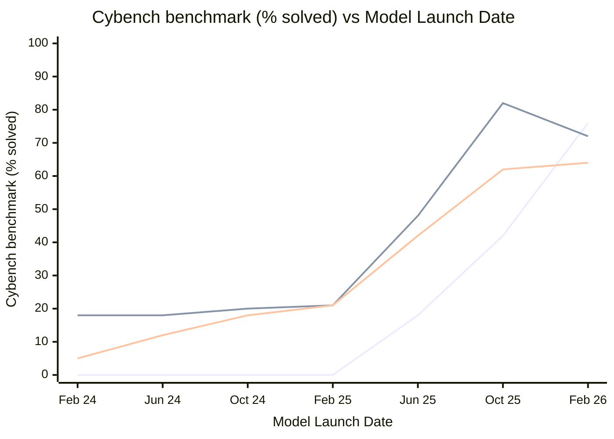
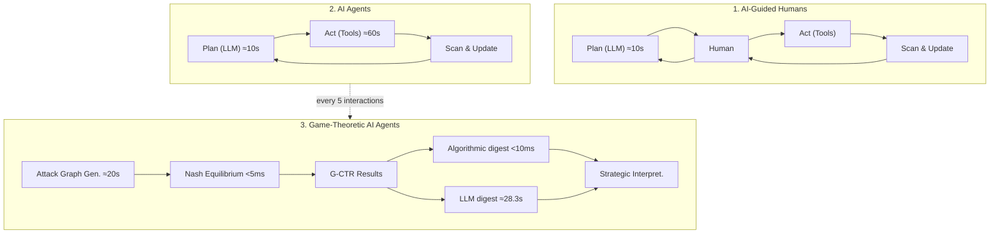
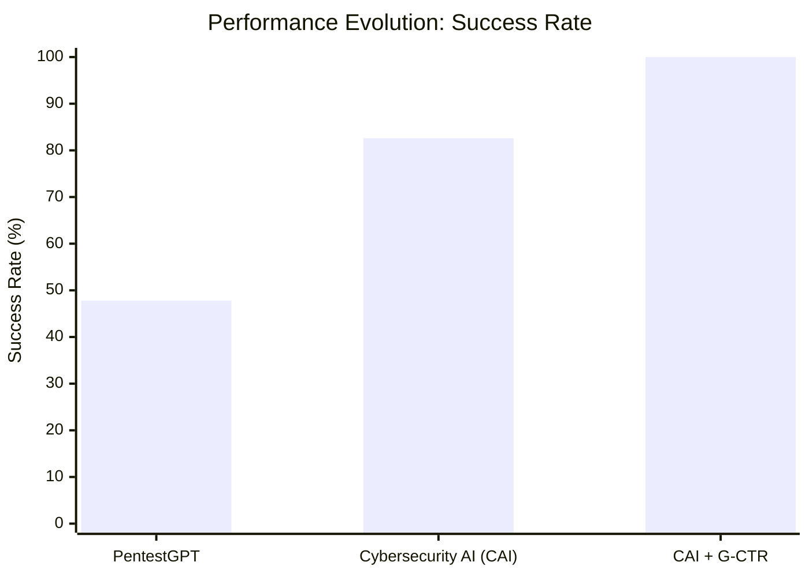
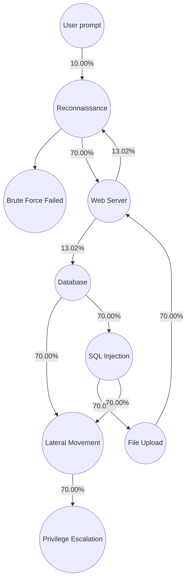

# **Towards Cybersecurity Superintelligence: from AI-guided humans to human-guided AI**

## Table of Contents

    - [February 10, 2026](#february-10-2026)
- [1 Introduction](#1-introduction)
- [2 Evolution Toward Superintelligence](#2-evolution-toward-superintelligence)
    - [2.1 AI-Guided Humans: PentestGPT](#2-1-ai-guided-humans-pentestgpt)
    - [2.2 Expert-Level Agents: CAI](#2-2-expert-level-agents-cai)
    - [2.3 Game-Theoretic Agents: G-CTR](#2-3-game-theoretic-agents-g-ctr)
- [3 Discussion](#3-discussion)
  - [Cybersecurity Superintelligence](#cybersecurity-superintelligence)
- [Author Contributions](#author-contributions)
- [Declarations](#declarations)
- [References](#references)
- [A Full Model Comparison](#a-full-model-comparison)

---

**V´ıctor Mayoral-Vilches**∗1 **, Stefan Rass**2 **, Martin Pinzger**3 **, Endika Gil-Uriarte**1 **, Unai Ayucar-Carbajo**1 **, Jon Ander Ruiz-Alcalde**1 **, Maite del Mundo de Torres**1 **, Mar´ıa Sanz-G´omez**1 **, Francesco Balassone**1 **, Crist´obal R. J. Veas Chavez**1 **, Vanesa Turiel**1 **, Alfonso Glera-Pic´on**1 **, Daniel S´anchez-Prieto**1 **, Yuri Salvatierra**1 **, Paul Zabalegui-Landa**1 **, Ruffino Reydel Cabrera-Alvarez****´**1 **and Patxi Mayoral-Pizarroso**1

> 1Alias Robotics, Vitoria-Gasteiz, ´Alava, Spain

> 2Johannes Kepler University Linz, Linz, Austria

> 3Alpen-Adria-Universit¨at Klagenfurt, Klagenfurt, Austria

#### February 10, 2026

##### **Abstract**

> Cybersecurity superintelligence—artificial intelligence exceeding the best human capability in both speed and strategic reasoning—represents the next frontier in security. This paper documents the emergence of such capability through three major contributions that have pioneered the field of AI Security. First, ❶ PentestGPT (2023) established LLM-guided penetration testing, achieving 228.6% improvement over baseline models through an architecture that externalizes security expertise into natural language guidance. Second, ❷ Cybersecurity AI (CAI, 2025) demonstrated automated expert-level performance, operating 3,600× faster than humans while reducing costs 156-fold, validated through #1 rankings at international competitions including the $50,000 Neurogrid CTF prize. Third, ❸ Generative Cut-theRope (G-CTR, 2026) introduces a neurosymbolic architecture embedding game-theoretic reasoning into LLM-based agents: symbolic equilibrium computation augments neural inference, doubling success rates while reducing behavioral variance 5.2× and achieving 2:1 advantage over non-strategic AI in Attack & Defense scenarios.

> Together, these advances establish a clear progression from AI-guided humans to human-guided gametheoretic cybersecurity superintelligence.

---

## **1 Introduction**

The convergence of artificial intelligence and cybersecurity has given rise to _AI Security_ [1, 2], with AIpowered agents rapidly developing offensive and defensive capabilities and being deployed by nation-states and cybersecurity companies [3]. We present a trajectory toward what we term _Cybersecurity Superintelligence_ : a capability threshold at which computationally realized intelligence surpasses the best humans across virtually all cyber disciplines (reversing, pwn, crypto, forensics, hardware, etc.), industry sectors (IT, OT/ICS, robotics, etc.), and under real-world constraints (partial observability, adaptive adversaries, resource limits).

Despite exaggerated claims of full autonomy1 in cybersecurity, benchmarks are rapidly saturating [6] and as shown in Figures 1 and 2 (with a full model comparison in Figure 6, Appendix A) popular cybersecurity benchmarks like Cybench [7] are rapidly being solved, with 50%+ solved increase in the last 6 months in

> ∗Corresponding author: `victor@aliasrobotics.com`

> 1There is a dangerous gap between automation and autonomy in cybersecurity [4]. Organizations deploying mischaracterized _autonomous_ tools risk reducing oversight precisely when it is most needed, potentially creating new vulnerabilities. As also described in [5], autonomy is typically treated as a system-level attribute, not a single component feature you _bolt on_ . In other words, we argue one does not magically get autonomy by swapping in an LLM; you get it when the overall system has delegated decision-making capability.

security-specialized LLMs, like the `alias` series of models2 . The possibility of _specialized_ superintelligence is no longer speculative: as observed in [8], “we are running out of intelligence tests that humans can pass reliably and AI models cannot.” If intelligence is essentially computational (the view held by most computational neuroscientists), then a working simulation of intelligence actually _is_ intelligence; it turned out to be a matter of scaling computation [8]. This reframes the question from _whether_ machines can achieve superintelligent cybersecurity capabilities to _how_ to architect systems to reach that threshold.

Bostrom [9] defines superintelligence as “an intellect that greatly exceeds the cognitive performance of humans in virtually all domains of interest.” We argue that _Cybersecurity Superintelligence_ merits treatment as a distinct domain-specific instantiation. While no standardized term exists, superhuman cyber capability is increasingly discussed in technical and policy research: Bengio et al. [10] identify cybersecurity as a key “dangerous capability” domain; Hendrycks et al. [11] analyze national security implications of AI systems that “can be turned to destructive ends”; and Potter et al. [12] marginal-risk modeling and position analyses argue frontier AI exerts stronger influence on cyber offense than defense, though Balassone et al. [13] empirically refute this, demonstrating no statistical offensive advantage when defenders also use AI.

The domain-specific treatment is justified by cybersecurity’s unique structural complexity. Cybersecurity demands simultaneous mastery across heterogeneous disciplines (reverse engineering, binary exploitation, cryptanalysis, forensics, hardware security), each with distinct toolchains and reasoning modalities. For a superintelligence, these must be applied across fundamentally different contexts: IT, OT/ICS, robotics, IoT, mobile, each introducing domain-specific protocols and threat models. This combinatorial complexity (disciplines _×_ sectors _×_ constraints) creates an evaluation space no human can fully cover. The most “superhuman-adjacent” capability to date: LLM-driven agents operating 3,600 _×_ faster than humans in specific security tasks (11 _×_ overall), while winning worldwide competitions with $50,000+ in prizes during 2025 [3, 14].

In this work, we present an evolution toward Cybersecurity Superintelligence. We trace this evolution through three landmark achievements (Figure 3) that mark a paradigmatic shift: we begin by ❶ using AI to augment human capabilities (Section 2.1), followed by ❷ using AI to build human expert-level agents (Section 2.2), and culminate in ❸ using human reasoning to guide AI toward superhuman performance (Section 2.3). This progression—from AI-guided humans to human-guided AI—represents a fundamental shift in the role each (human and AI) plays, where human expertise transitions from actor to operator, and from operator to supervisor. We examine this inversion and its implications in detail.

---

## **2 Evolution Toward Superintelligence**

> **Section Summary:** | Model | Pass@3 Rate | Solved/Total |

> 2Refer to [6] for comprehensive benchmarking methodology and evaluation results of the `alias` model series.

| Model | Pass@3 Rate | Solved/Total |
| --- | --- | --- |
| alias2 | 76% | 25/33 |
| alias1 | 42% | 14/33 |
| alias0 | 18% | 6/33 |

<!-- Start of picture text -->
Legend alias2 01/26 alias2 (25/33, 76%, +34%) alias1 10/25 alias1 (14/33, 42%, +24%) alias0 (6/33, 18%) alias0 05/25 Not solved CTF Challenges in CAIBench-Jeopardy CTFs (Cybench) [6], pass @3 LootStashUrgent■Packed■ItAwayHas■BegunPrimaryDynastic■ Knowledge■ ■DeluluCrushingPartial■ Tenacity■■Missing■■UnbreakableBitsGlacier■■Exchange■■ ■■AvatarBackEval■■toMethe■■DataPastSiege■■Phreaks■■■RPGORevenge■■■Lock■■■Talk■■■SkiliftFailproof■■■PermutedFlecks■■■■■■■ofGold■■■■SLCG■■■■ShuffledSOP■■■■AESNoisy■■■■CRCEzmaze■■■■Diffecient■■■■NoisierRandsubware■■■■CRC■■■■■Robust■■■■■CBCPickle■■■■■Jail■■■■■ Pickle Another Were Just <!-- End of picture text -->

**Figure 1:** Evolution of Alias Robotics’ cybersecurity-specialized `alias` LLM family on the `CAIBench-Jeopardy CTFs (Cybench)` benchmark. Each cell indicates whether a challenge was solved using the _pass_ @3 metric (success in at least one of three attempts), with a maximum of 245 minutes of compute time, 300 agent interactions per attempt and a maximum of 40 USD per challenge on API model expenses. See Appendix A for a comparison including all evaluated models.

<!-- Start of picture text -->
100% Model Series opus 4.5 Alias Robotics’ alias 80% alias2 Anthropic’s claude opus gemini 3 opus 4.6 Anthropic’s claude sonnet Google’s gemini pro 60% sonnet 4.5 gpt 5.2 OpenAI’s gpt alias1 Mistral AI’s large 40% gpt 5.1 sonnet 4 gpt 5 opus 3 sonnet 3.5 20% gpt 4o gemini 2.5 gemini 1.5 large 2.1 alias0 large 2.0 large 3 0% Feb’24 Jun’24 Oct’24 Feb’25 Jun’25 Oct’25 Feb’26 Model Launch Date solved) (% benchmark Cybench <!-- End of picture text -->

**Figure 2:** `Cybench` solve rate progression over time by model series, highlighting the `alias` series. The x-axis shows model launch dates, y-axis shows solved percentage of `CAIBench-Jeopardy CTFs (Cybench)` [6] benchmark. Each experiment was run for a maximum of 300 agentic interactions, 245 minutes of computing time per challenge, a maximum of 40 USD per challenge on API model expenses and with _pass@3_ . Plot depicts how most models are rapidly improving, showing signs of benchmark saturation. A comprehensive comparison of all evaluated models is provided in Figure 6 at Appendix A.

#### **2.1 AI-Guided Humans: PentestGPT**

PentestGPT [2] pioneered LLM-assisted penetration testing through the first systematic evaluation of LLM capabilities in offensive security, with concurrent independent work by Happe et al. [15] similarly exploring LLM-driven penetration testing approaches. Benchmarking across 182 sub-tasks, PentestGPT revealed that while LLMs excel at discrete operations (tool configuration, output interpretation, vulnerability identification), they fail at coherent multi-step strategies due to context loss from token constraints, recency bias toward immediate tasks, and hallucination-induced inaccuracies.

PentestGPT’s architecture (Figure 3, ❶) addresses these limitations through module separation inspired by penetration testing team dynamics. The internal _Reasoning Module_ maintains global context via the Penetration Testing Task Tree (PTT), an attributed tree _T_ = ( _N, A_ ) encoding testing status in natural language, with verification preventing hallucination-induced structural corruption. The _Generation Module_ translates sub-tasks into executable commands via Chain-of-Thought decomposition, isolating tactical execution from strategic context. The _Parsing Module_ condenses verbose tool outputs into actionable advice.

Humans remain central as command executors, output validators, and strategic correctors. This inverts traditional expertise requirements: the LLM encodes domain knowledge (vulnerability patterns, exploitation techniques, tool configurations) while humans provide tool execution and judgment. Effectively, PentestGPT empowered _AI-guided humans_ to conduct penetration testing by augmenting their capabilities with expertlevel reasoning, democratizing offensive security and enabling users with limited background to leverage sophisticated intuition through natural language guidance.

Achieving 228.6% improvement over baseline GPT-3.5 and placing 24th among 248 CTF teams, PentestGPT (6,500+ GitHub stars; adopted by AWS, Huawei, TikTok) validated human-AI collaboration. However, its reliance on human tool execution revealed the bottleneck CAI would address.

#### **2.2 Expert-Level Agents: CAI**

CAI [3] eliminated PentestGPT’s human tool execution bottleneck through a fully automated agent-centric architecture framework. Where PentestGPT required humans to execute commands and validate outputs,3

> 3As of January 2026, PentestGPT v1.0.0 has evolved into an agentic tool capable of conducting automated tasks without human intervention, though CAI pioneered this automated approach.

<!-- Start of picture text -->
PentestGPT Cybersecurity AI (CAI) Game-Theoretic Analysis (G-CTR) Game-Theoretic Guidance (G-CTR) ≈ 60s G-CTR < 10ms Human (Tools)Act (Tools)Act Results Algorithmicdigest ≈ 10s ≈ 10s < 5ms Plan Plan Nash Strategic (LLM) (LLM) Equilibrium Interpret. Human UpdateScan & UpdateScan & AttackGraph ≈ 20s digestLLM ≈ 28.3s Gen. every 5 interactions ❶ AI-Guided Humans ❷ AI Agents ( ≈ 70s) Game-Theoretic Guidance ( ≈ 50s) ∥ runs in parallel ❸ Game-Theoretic AI Agents ( ≈ 70s) Performance Evolution: CAIBench-Jeopardy CTFs (Base) [6] Success Rate (%, n = 23 ) ❶ AI-Guided Humans ❷ AI Agents ❸ Game-Theoretic AI Agents 100 100% 75 82.6% 50 47.8% 25 0 PentestGPT Cybersecurity AI (CAI) CAI + G-CTR Heatmap describing benchmarking results on CAIBench-Jeopardy CTFs (Base) [6] across agentic approaches Legend ➂ Game-Theoretic AI Agents Solved (Automated) ➁ AI Agents HITL Not solved ➀ AI-Guided Humans CTF Challenges in CAIBench-Jeopardy CTFs (Base) [6] <!-- End of picture text -->

**Figure 3:** Progression towards Cybersecurity Superintelligence: From AI-Guided Humans to Game-Theoretic AI Agents. The architecture illustrates three evolutionary stages: ❶ **AI-Guided Humans** (PentestGPT, far left): LLMs provide planning assistance while humans remain in the loop for action execution and observation interpretation, achieving 47.8% success rate. ❷ Human expert-level **AI Agents** (CAI, center-left): Cybersecurity AI agents automating the security testing process and leading to 82.6% success rate. ❸ **Game-Theoretic AI Agents** (CAI + G-CTR, right): game-theoretic reasoning augments the agent via attack graph generation, Nash equilibrium computation, and strategic digest injection, achieving 100% success rate on the same benchmark. The bar chart (middle) quantifies performance gains across stages, while the heatmap (bottom) shows per-challenge resolution, demonstrating that game-theoretic guidance enables solving challenges that pure AI agents cannot.

CAI allows building expert-level agents that operate end-to-end: reasoning via LLMs, executing through integrated tools, and adapting based on results, all without human intervention.

The CAI framework (Figure 3, ❷) comprises six architectural pillars: `Agents` (specialized security actors), `Tools` (command execution, web interaction, code manipulation), `Handoffs` (inter-agent control transfer), `Patterns` (collaborative agent topologies like Swarm for red team operations), `Turns` (interaction cycle management), and `HITL` (optional human oversight). This modular design enables specialized agents (red team, bug bounty hunter, blue team) to coordinate through well-defined handoff protocols, dynamically shifting expertise as new information emerges.

Benchmarking across 54 CTF challenges against human experts revealed dramatic performance asymmetries (Table 1). CAI achieved 774× speedup in reverse engineering (9 minutes vs. 4.8 days), 938× in forensics (7 minutes vs. 4.7 days), and 741× in robotics challenges, domains requiring pattern recognition and systematic enumeration where AI parallelism excels. Conversely, humans outperformed CAI in pwn (0.77×) and crypto (0.47×), categories demanding creative exploitation and mathematical insight that current LLMs

|**Category**|�_t_**CAI** (s)|�_c_**CAI** ($)|�_t_**Human** (s)|�_c_**Human** ($)|_tratio_|_cratio_|
|---|---|---|---|---|---|---|
|rev|**541** (9m 1s)|**0.83**|418789 (4d 20h)|5642|774x|6797x|
|misc|**1650** (27m 30s)|**3.04**|38364 (10h 39m)|516|23x|169x|
|pwn|99368 (1d 3h)|93|**77407** (21h 30m)|**1042**|0.77x|11x|
|web|**558** (9m 18s)|**1.78**|31264 (8h 41m)|421|56x|236x|
|crypto|9549 (2h 39m)|2.03|**4483** (1h 14m)|**60**|0.47x|29x|
|forensics|**432** (7m 12s)|**1.78**|405361 (4d 16h)|5461|938x|3067x|
|robotics|**408** (6m 48s)|**6.6**|302400 (3d 12h)|4074|741x|617x|
|�|**112506** (1d 7h)|**109**|1278068 (14d 19h)|17218|11x|156x|

**Table 1:** Comparison of the sum of time ( _t_ ), cost ( _c_ ) and respective ratios of CAI and Human performance across different CTF challenge categories. Each row shows the sum of average completion times and costs for all challenges within that category, for both CAI and Human participants. CAI cost corresponds with the API expenses. Human cost was calculated using the hourly rates of e45 ($48.54) [3]. For the sake of readability, for _tratio_ and _cratio_ , values under 10 were rounded to two decimals (rounding up the third decimal). Values _≥_ 10 were rounded to the nearest integer. Best performance (lower time/cost) per category is **bolded** . Values in parentheses represent human-readable time formats. The bottom row shows the total sum across all categories, representing the cumulative performance difference. The summary given here is fully expanded in detail in [3].

|**Difculty**|�_t_**CAI** (s)|�_c_**CAI** ($)|�_t_**Human** (s)|�_c_**Human** ($)|_tratio_|_cratio_|
|---|---|---|---|---|---|---|
|Very Easy|**1067** (17m 46s)|**3.02**|852765 (9d 20h)|11488|799x|3803x|
|Easy|26463 (7h 21m)|43|**25879** (7h 11m)|**348**|0.98x|8.03x|
|Medium|**29821** (8h 16m)|**41**|353704 (4d 2h)|4765|11x|115x|
|Hard|37935 (10h 32m)|6.88|**34569** (9h 36m)|**465**|0.91x|68x|
|Insane|17220 (4h 47m)|15|**11151** (3h 5m)|**150**|0.65x|9.79x|

**Table 2:** Comparison of the sum of time ( _t_ ), cost ( _c_ ) and respective ratios of CAI and Human performance across difficulty levels.

handle less effectively. Difficulty-level analysis (Table 2) shows CAI dominating “Very Easy” challenges (799× faster) while approaching parity at higher difficulties, suggesting LLM limitations in long-horizon planning and novel attack synthesis.

The cost differential proved equally stark: $109 total API cost versus $17,218 equivalent human labor (156× reduction). Beyond benchmarks, CAI demonstrated competitive dominance across the 2025 CTF circuit [14]: Rank #6 at Dragos OT CTF (1,200+ teams), #1 at Neurogrid CTF claiming the $50,000 prize (41/45 flags), #1 among AI teams in HTB “AI vs Human” ($750 award), #22 peak at Cyber Apocalypse (8,129 teams), and #21 at UWSP Pointer Overflow (635 teams), consistently solving challenges 37% faster than elite human teams. Yet this dominance exposed a fundamental limitation: CAI matched or exceeded human _speed_ , but not human _strategic reasoning_ . The transition from expert-level to superintelligent performance requires agents that reason about adversarial dynamics, the game-theoretic intuition that distinguishes elite security professionals from the average hacker.

#### **2.3 Game-Theoretic Agents: G-CTR**

CAI’s expert-level performance revealed a fundamental ceiling: speed and autonomy alone do not constitute superintelligence in cybersecurity. Matching human experts, even at 3,600× their speed, still produces human-equivalent reasoning. Surpassing human capability requires agents that reason strategically, the way humans mentally _play the game_ . Just as a chess grandmaster evaluates attacker/defender lines before committing to a move, security professionals apply game theory: evaluating the current state, imagining

<!-- Start of picture text -->
Attack Graph Topology <!-- End of picture text -->

| Defense Strategy (Node Allocation) | Prob. |
| --- | --- |
| Node 8 | 0.674 |
| Node 4 | 0.326 |
| Attack Strategy (Path Selection) | Prob. |
| --- | --- |
| 1->2->4->7->9 | 0.674 |
| 1->2->3->6->8->9 | 0.326 |

**Game Equilibrium (Nash)**
- Defender success threshold: 3.528%
- Attacker guaranteed success: 3.528%

<!-- Start of picture text -->
Nash Equilibrium Strategies Defense Strategy (Node Allocation) Node Prob. Node Prob. 8 0.674 2 0.000 4 0.326 3 0.000 Attack Strategy (Path Selection) ID Path Prob. 5 1 → 2 → 4 → 7 → 9 0.674 1 1 → 2 → 3 → 6 → 8 → 9 0.326 3 1 → 2 → 4 → 7 0.000 2 1 → 2 → 4 0.000 4 1 → 2 → 4 → 7 → 8 → 9 0.000 Game Equilibrium (Nash) Defender success threshold: 3.528% Defender can keep attacker success below this value Attacker guaranteed success: 3.528% Attacker can guarantee at least this success probability <!-- End of picture text -->

**Figure 4:** Game-Theoretic Attack Graph Analysis. Left: Attack graph topology showing nodes (vulnerabilities) and edges (attack transitions) extracted from the LLM context. Right: Nash equilibrium strategies computed by G-CTR algorithm. A good defense strategy would allocate monitoring resources to nodes 8 (67.4%) and 4 (32.6%), while optimal attack paths would exploit through nodes 1 _→_ 2 _→_ 4 _→_ 7 _→_ 9 and 1 _→_ 2 _→_ 3 _→_ 6 _→_ 8 _→_ 9, yielding an equilibrium success probability of 3.528%. Refer to [16] for more details.

adversary responses, and choosing actions that maximize long-term advantage. This strategic reasoning, not faster execution, separates expert-level from superhuman performance.

G-CTR [16] addresses this gap through a neurosymbolic architecture that embeds game-theoretic reasoning into LLM-based agents’ system prompt. Rather than relying solely on pattern-matched intuitions prone to hallucination and logical inconsistency, agents consult explicit payoff computations and equilibrium analyses, a symbolic scaffold grounding actions in principled adversarial reasoning. As Jones et al. [17] observe, “using rules-based systems during crucial reasoning steps can help keep LLMs from going off-track”; G-CTR instantiates this principle for cybersecurity through three phases (Figure 3, ❸).

The architecture operates via closed-loop strategic feedback. First, **Attack Graph Generation** extracts structured graph representations from unstructured security logs (or raw LLM context) using LLMs, achieving 70–90% node correspondence with expert annotations4 while running 60–245× faster. Second, **Nash Equilibrium Computation** applies the Cut-the-Rope (CTR) [18, 19, 20] algorithm to identify optimal attack/defense strategies; Figure 4 illustrates how G-CTR computes defense allocations (nodes 8: 67.4%, node 4: 32.6%) and attack path probabilities yielding a 3.528% equilibrium success rate. Third, **Strategic Digest Injection** transforms equilibrium computations into natural language guidance inserted into the agent’s system prompt, steering subsequent actions toward statistically advantageous continuations. This digest (akin to a chess engine highlighting strongest lines) reduces ambiguity, collapses the search space, and suppresses hallucinations by anchoring the model to what is actually unfolding.

Empirical validation [16] across 44 cyber-range penetration tests demonstrates the strategic advantage: success rates doubled (20.0%→42.9%), cost-per-success decreased (and thereby improved) 2.7× ($0.32→$0.12), and behavioral variance reduced 5.2×, indicating more consistent, predictable agent behavior. In Attack & Defense scenarios, the best configuration (experimentally determined) was to let red and blue agents, which mirror the actions of real-life red teams that attack a system and blue teams that defend it, share a common attack graph as their joint battle-field. This configuration defeated LLM-only baselines 2:1 and outperformed independently-guided dual teams 3.7:1. These results demonstrate that game-theoretic guidance transforms expert-level agents into strategically superior ones: not merely faster AI agents, but systems exhibiting rea-

> 4Validation was performed by two professional security researchers with no affiliation to this research, hired as independent evaluators.

soning capabilities that exceed humans while maintaining mathematical rigor in adversarial decision-making. We argue that these game-theoretic agents pave the way towards cybersecurity superintelligence.

---

## **3 Discussion**

The progression, from AI-guided humans (Section 2.1) to game-theoretic AI agents to human-guided AI (Section 2.3), represents a fundamental inversion in the relationship between human expertise and machine capability (Figure 5).

This role inversion carries profound implications for cybersecurity as a discipline. First, it fundamentally alters the economics of expertise: whereas traditional security required years of apprenticeship to develop intuition for attack surface enumeration, vulnerability chaining, and exploitation (knowledge that remained concentrated among security experts), AI systems now encode and operationalize this expertise at marginal cost approaching zero. The democratization effect is substantial: organizations previously excluded from sophisticated security assessment due to cost or talent scarcity can now access capabilities that exceeded best human expert performance just months prior. Second, the inversion reshapes the cognitive demands on security professionals. The transition from actor to supervisor does not diminish human importance but transforms its nature: supervisory competence requires meta-cognitive skills, including understanding AI capabilities and limitations, recognizing situations requiring human intervention, and maintaining strategic oversight without tactical immersion. This mirrors patterns observed in aviation and medicine, where automation paradoxically increases demands on human operators who must remain competent to intervene in systems they rarely control directly [21]. Third, the speed differential (AI operating 3,600 _×_ faster than humans [3]) creates temporal asymmetries that challenge traditional security workflows. Incident response, vulnerability disclosure, and patch deployment processes designed around human timescales become bottlenecks in a regime where AI can enumerate attack surfaces faster than organizations can process findings. Finally, the emergence of strategic AI reasoning introduces a qualitatively new dynamic: when both offensive and defensive capabilities incorporate game-theoretic analysis, security becomes an algorithmic arms race where human strategic intuition may prove insufficient to supervise systems reasoning at superhuman speeds about superhuman strategies.

The global impact of the research presented here validates the trajectory toward superintelligence in cybersecurity and is available for reproduction through the CAI framework [3, 22]. CAI has grown to

### **Cybersecurity Superintelligence**

AI surpassing human **speed** + **strategic reasoning**

❶ **AI-Guided Humans** ❷ **Expert-level AI** ❸ **Game-Theoretic AI Human Actor Operator Supervisor AI Advisor Executor Strategic Actor Implications Economics of Expertise Cognitive Demands** Tacit knowledge at marginal cost _→_ 0 Meta-cognitive supervisory skills **Speed Differential Strategic (rational) AI Emergence** AI operates faster, 3,600 _×_ than humans Game-theoretic reasoning

**Figure 5:** Role inversion in cybersecurity superintelligence. Humans transition from Actor (executing tasks with AI advice) to Supervisor (overseeing AI strategy). Conversely, AI evolves from Advisor to Strategic Actor, assuming both execution and game-theoretic reasoning. This inversion redefines expertise economics, cognitive demands, operational tempo, and strategic dynamics.

become the largest open-source AI security project, with 50,000+ users across 70 countries, 10,000+ URLs assessed, and a 1,500-member developer community. Regional adoption shows Europe (39%), North America (27%), and Asia (20%) leading deployment. CAI enables organizations previously lacking specialized security expertise to access expert-level (and beyond) capabilities, a fundamental shift from security as an exclusive domain to security as accessible infrastructure.

Yet significant barriers remain to be solved before these superintelligence capabilities are fully realized and achieve widespread deployment. First, the economics of AI security agents present challenges: state-of-theart LLMs cost approximately $5,940 per billion tokens (equivalent to one month of continuous single agent operation), rendering sustained automated security economically unviable for most organizations. Recent work [14] demonstrates a solution through multi-model orchestration with entropy-based dynamic selection, achieving 98% cost reduction ($5,940→$119 per billion tokens) while maintaining competitive performance. Second, there remains significant room for improving _agency_ in security solutions, the capacity for independent decision-making, strategic planning, and adaptive response. Common security tools predominantly occupy lower agency levels [4]. Sustained progress requires continuous human-curated knowledge and data; without ongoing update and supervision, AI security agents risk performance drift and degradation, reinforcing the need not to rely solely on AI. Even with CAI’s supervised automation and G-CTR’s strategic guidance, true autonomy—delegated decision-making—remains out of scope in real-world incident response.

With AI weaponized by nation-states, democratizing defensive capability via open-source frameworks is imperative. This transformation is empirically validated; our task is to steer it responsibly so that advances from human–AI collaboration to strategic AI strengthen defense rather than fuel offensive proliferation.

---

## **Author Contributions**

V.M.-V. conceived the study, led the overall research, designed and led the experiments, wrote the main manuscript, and served as the principal scientific lead of the three core contributions presented in this work (PentestGPT, CAI, and G-CTR). S.R. and M.P. contributed to the development of PentestGPT and CAI; S.R. additionally contributed to G-CTR. Both S.R. and M.P. contributed to the methodological design, scientific rigor, and validation of the study. E.G.-U., U.A.-C., J.A.R.-A., and M.d.M.d.T. contributed to the analysis and alignment of the state of the art and to the critical review of the perspectives and contributions of the work. M.S.-G. and F.B. contributed to CAI and G-CTR, including development, testing and experiments, validation, and scientific grounding. C.R.J.V.-C., V.T., A.G.-P., D.S.-P., Y.S., P.Z.-L., R.R.C.-A.,´ and P.M.-P. contributed to the testing and development of CAI. All authors reviewed and approved the final manuscript.

---

## **Declarations**

> **Section Summary:** Funding: European Innovation Council (GA 101161136).

Funding: European Innovation Council (GA 101161136). Competing interests: None. Data/Code availability: https://github.com/aliasrobotics/cai (Dual MIT/Proprietary license).

---

## **References**

- [1] V´ıctor Mayoral-Vilches. Offensive robot cybersecurity. _arXiv preprint arXiv:2506.15343_ , 2025.

- [2] Gelei Deng, Yi Liu, V´ıctor Mayoral-Vilches, Peng Liu, Yuekang Li, Yuan Xu, Tianwei Zhang, Yang Liu, Martin Pinzger, and Stefan Rass. Pentestgpt: Evaluating and harnessing large language models for automated penetration testing. _33rd USENIX Security Symposium (USENIX Security 24)_ , pages 847–864, 2024.

- [3] V´ıctor Mayoral-Vilches, Luis Javier Navarrete-Lozano, Mar´ıa Sanz-G´omez, Lidia Salas Espejo, Marti˜no Crespo-Alvarez,´ Francisco Oca-Gonzalez, Francesco Balassone, Alfonso Glera-Pic´on, Unai AyucarCarbajo, Jon Ander Ruiz-Alcalde, Stefan Rass, Martin Pinzger, and Endika Gil-Uriarte. Cai: An open, bug bounty-ready cybersecurity ai, 2025. URL `https://arxiv.org/abs/2504.06017` .

- [4] V´ıctor Mayoral-Vilches. Cybersecurity ai: The dangerous gap between automation and autonomy. _

- [5] William N Kaliardos. Enough fluff: Returning to meaningful perspectives on automation. _2022 IEEE/AIAA 41st Digital Avionics Systems Conference (DASC)_ , pages 1–9, 2022.

- [6] Mar´ıa Sanz-G´omez, V´ıctor Mayoral-Vilches, Francesco Balassone, Luis Javier Navarrete-Lozano, Crist´obal R. J. Veas Chavez, and Maite del Mundo de Torres. Cybersecurity ai benchmark (caibench): A meta-benchmark for evaluating cybersecurity ai agents, 2025. URL `https://arxiv.org/abs/2510. 24317` .

- [7] Andy K. Zhang, Neil Perry, Riya Dulepet, Joey Ji, Celeste Menders, Justin W. Lin, Eliot Jones, Gashon Hussein, Samantha Liu, Donovan Jasper, Pura Pham, Ricky Vandergrift, Jing Chen, Evan Risi, Eric Zelikman, Yuanzhi Mao, Miles Q. Cranmer, Jeff Clune, Michael Tyka, James Zou, Noah D. Goodman, Dan Boneh, Daniel E. Ho, and Percy Liang. Cybench: A framework for evaluating cybersecurity capabilities and risks of language models. _

- [8] Blaise Ag¨uera y Arcas. What is the future of intelligence? the answer could lie in the story of its evolution. _Nature_ , 647(8091):846–850, 2025.

- [9] Nick Bostrom. _Superintelligence: Paths, Dangers, Strategies_ . Oxford University Press, Oxford, UK, 2014. ISBN 978-0-19-967811-2.

- [10] Yoshua Bengio, Geoffrey Hinton, Stuart Russell, et al. International AI safety report. _

- [11] Dan Hendrycks, Eric Schmidt, and Alexandr Wang. Superintelligence strategy: Expert version. _

- [12] Yujin Potter, Wenbo Guo, Zhun Wang, Tianneng Shi, Hongwei Li, Andy Zhang, Patrick Gage Kelley, Kurt Thomas, and Dawn Song. Frontier AI’s impact on the cybersecurity landscape. _

- [13] Francesco Balassone, V´ıctor Mayoral-Vilches, Stefan Rass, Martin Pinzger, Gaetano Perrone, Simon Pietro Romano, and Peter Schartner. Cybersecurity ai: Evaluating agentic cybersecurity in attack/defense ctfs. _

- [14] V´ıctor Mayoral-Vilches, Luis Javier Navarrete-Lozano, Francesco Balassone, Mar´ıa Sanz-G´omez, Crist´obal RJ Chavez, Maite del Mundo de Torres, and Vanesa Turiel. Cybersecurity ai: The world’s top ai agent for security capture-the-flag (ctf). _

- [15] Andreas Happe and J¨urgen Cito. Getting pwn’d by AI: Penetration Testing with Large Language Models, August 2023. URL `http://arxiv.org/abs/2308.00121` . arXiv:2308.00121 [cs].

- [16] V´ıctor Mayoral-Vilches, Mar´ıa Sanz-G´omez, Francesco Balassone, Stefan Rass, Lidia Salas-Espejo, Benjamin Jablonski, Luis Javier Navarrete-Lozano, Maite del Mundo de Torres, and Crist´obal RJ Chavez. Cybersecurity ai: A game-theoretic ai for guiding attack and defense. _

- [17] Nicola Jones. The great ai mash-up. _Nature_ , 647(8091):842–844, 2025.

- [18] Stefan Rass, Sandra K¨onig, and Emmanouil Panaousis. Cut-the-rope: A game of stealthy intrusion. _Decision and Game Theory for Security (GameSec)_ , pages 1–12, 2019. doi: 10.1007/978-3-030-324308˙1.

- [19] Stefan Rass, Sandra K¨onig, Jasmin Wachter, V´ıctor Mayoral-Vilches, and Emmanouil Panaousis. Gametheoretic apt defense: An experimental study on robotics. _Computers & Security_ , 132:103328, 2023. ISSN 0167-4048. doi: https://doi.org/10.1016/j.cose.2023.103328. URL `https://www.sciencedirect. com/science/article/pii/S0167404823002389` .

- [20] Stefan Rass, Beniamin Radomir Jablonski, and V´ıctor Mayoral-Vilches. (poster) zero-day risk estimation using security games. _Game Theory and AI for Security (GameSec)_ , pages 321–325, 2025. doi: 10.1007/978-3-031-74835-6˙20.

- [21] Raja Parasuraman, Thomas B. Sheridan, and Christopher D. Wickens. A model for types and levels of human interaction with automation. _IEEE Transactions on Systems, Man, and Cybernetics-Part A: Systems and Humans_ , 30(3):286–297, 2000.

- [22] Alias Robotics. Cai: Cybersecurity ai - an open bug bounty-ready artificial intelligence, 2025. URL `https://github.com/aliasrobotics/cai` . Accessed: 2025-06-27.

---

## **A Full Model Comparison**

| Model | Pass@3 Rate |
| --- | --- |
| claude opus 4.5 | 82% |
| alias2 | 76% |
| claude opus 4.6 | 73% |
| gemini 3 pro | 64% |
| claude sonnet 4.5 | 48% |
| gpt 5.2 | 48% |
| alias1 | 42% |

<!-- Start of picture text -->
Legend claude opus 4.5 11/25 alias alias2 (25/33, 76%) alias2 01/26 alias1 (14/33, 42%) alias0 (6/33, 18%) claude opus 4.6 02/26 Claude opus 4.5 (27/33, 82%) opus 4.6 (24/33, 73%) gemini 3 pro 11/25 sonnet 4.5 (16/33, 48%) 4 sonnet (7/33, 21%) claude sonnet 4.5 09/25 3.5 sonnet (6/33, 18%) 3 opus (6/33, 18%) gpt 5.2 12/25 Gemini 3 pro (21/33, 64%) 2.5 pro (7/33, 21%) alias1 10/25 1.5 pro (2/33, 6%) GPT gpt 5.1 11/25 5.2 (16/33, 48%) 5.1 (13/33, 39%) gpt 5 08/25 54o(11/33,(5/33, 33%)15%) gemini 2.5 pro 03/25 Mistral large 3 (4/33, 12%) large 2.0 (4/33, 12%) claude 4 sonnet 05/25 large 2.1 (1/33, 3%) Not solved alias0 05/25 claude 3.5 sonnet 06/24 claude 3 opus 03/24 gpt-4o 05/24 mistral large 3 12/25 mistral large 2.0 07/24 gemini 1.5 pro 02/24 mistral large 2.1 11/24 CTF Challenges in CAIBench-Jeopardy CTFs (Cybench) [6], pass @3 LootStashUrgent■Packed■ItAwayHas■BegunPrimaryDynastic■ Knowledge■ ■DeluluCrushingPartial■ Tenacity■■Missing■■UnbreakableBitsGlacier■■Exchange■■ ■■AvatarBackEval■■toMethe■■DataPastSiege■■Phreaks■■■RPGORevenge■■■Lock■■■Talk■■■SkiliftFailproof■■■PermutedFlecks■■■■■■■ofGold■■■■SLCG■■■■ShuffledSOP■■■■AESNoisy■■■■CRCEzmaze■■■■Diffecient■■■■NoisierRandsubware■■■■CRC■■■■■Robust■■■■■CBCPickle■■■■■Jail■■■■■ Pickle Another Were Just <!-- End of picture text -->

**Figure 6:** Full comparison of all evaluated models on the `CAIBench-Jeopardy CTFs (Cybench)` [6] benchmark, complementing the temporal progression shown in Figure 2. Models are ordered by number of challenges solved (descending), with the `alias` series highlighted in teal. Each experiment was run for a maximum of 300 agentic interactions, 245 minutes of computing time per challenge, a maximum of 40 USD per challenge on API model expenses, and with _pass_ @3. Superscripts indicate model release dates (MM/YY).
