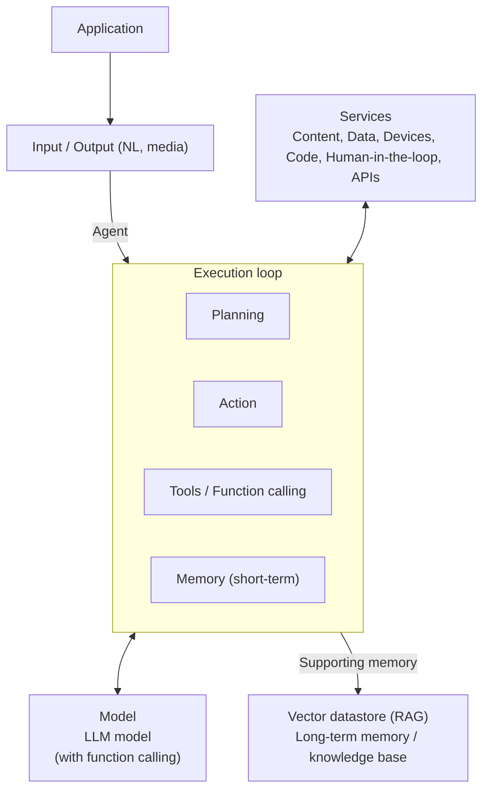
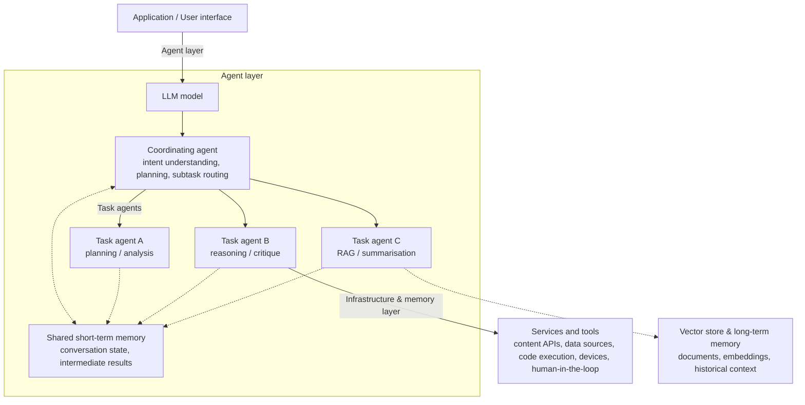
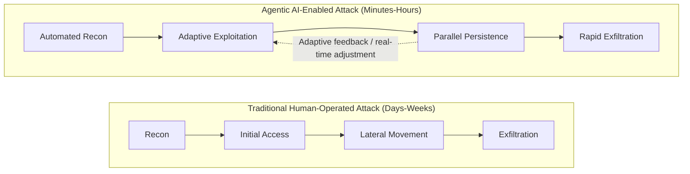
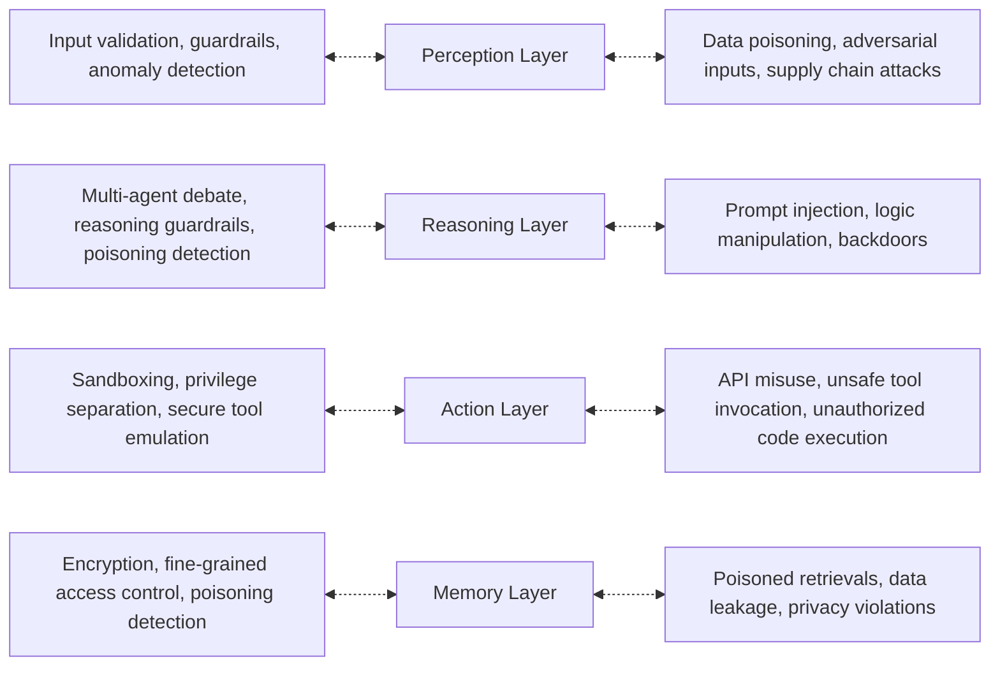
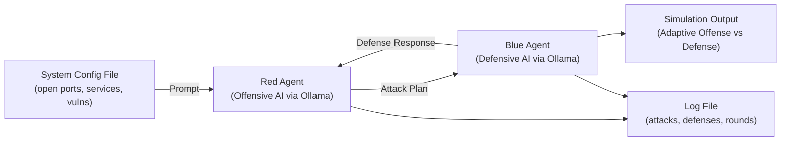
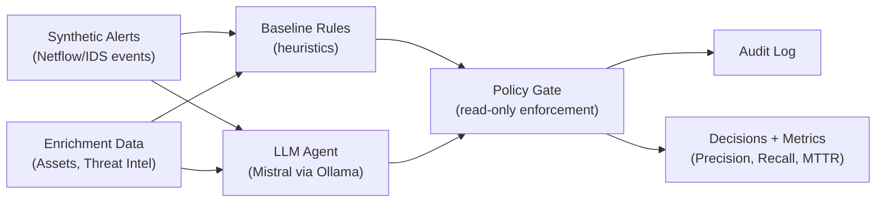
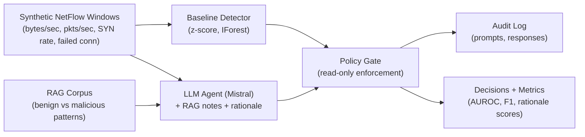

# **A Survey of Agentic AI and Cybersecurity: Challenges, Opportunities and**

## Table of Contents

- [MAANAK GUPTA, Tennessee Tech University, United States](#maanak-gupta-tennessee-tech-university-united-states)
- [ELISA BERTINO, Purdue University, United States](#elisa-bertino-purdue-university-united-states)
    - [ACM Reference Format:](#acm-reference-format)
  - [1 Introduction](#1-introduction)
  - [2 Related Work](#2-related-work)
  - [3 What is Agentic AI?](#3-what-is-agentic-ai)
  - [4 Applications of Agentic AI to Cybersecurity](#4-applications-of-agentic-ai-to-cybersecurity)
  - [4.1 Autonomous Cyber Defense and Operation](#4-1-autonomous-cyber-defense-and-operation)
  - [4.2 Agentic Threat Intelligence and Adversarial Analysis](#4-2-agentic-threat-intelligence-and-adversarial-analysis)
  - [4.4 Simulation, Training, and Testing](#4-4-simulation-training-and-testing)
    - [Key Takeaways from Section 4](#key-takeaways-from-section-4)
  - [5 Agentic AI-Enabled Cyber Attacks](#5-agentic-ai-enabled-cyber-attacks)
  - [5.1 Insider Threats and Autonomous Exploits](#5-1-insider-threats-and-autonomous-exploits)
  - [5.2 Agentic AI for Ransomware Operations](#5-2-agentic-ai-for-ransomware-operations)
  - [5.3 Agentic AI in Social Engineering and Financial Fraud](#5-3-agentic-ai-in-social-engineering-and-financial-fraud)
  - [6 Security of Agentic AI](#6-security-of-agentic-ai)
  - [6.1 Conceptual Risk Models and Threat Taxonomies](#6-1-conceptual-risk-models-and-threat-taxonomies)
  - [6.2 System-Level Vulnerabilities and Security Controls for Agentic AI](#6-2-system-level-vulnerabilities-and-security-controls-for-agentic-ai)
  - [6.3 Prompt Injection and Tool Invocation Risks](#6-3-prompt-injection-and-tool-invocation-risks)
  - [6.4 Multi-Agent Security, Collusion, and Information Flow](#6-4-multi-agent-security-collusion-and-information-flow)
  - [6.5 Autonomy, Identity, Governance, and Resources](#6-5-autonomy-identity-governance-and-resources)
  - [6.6 Assurance, Testing, and Infrastructure](#6-6-assurance-testing-and-infrastructure)
  - [6.7 Reasoning, Memory, and Human Factors](#6-7-reasoning-memory-and-human-factors)
    - [Key Takeaways from Section 6](#key-takeaways-from-section-6)
  - [6.8 Benchmarks for Agentic AI Security](#6-8-benchmarks-for-agentic-ai-security)
  - [7 Quantum Computing and Agentic AI in Cybersecurity](#7-quantum-computing-and-agentic-ai-in-cybersecurity)
  - [7.1 Quantum Agents and Multi-Agent Autonomy](#7-1-quantum-agents-and-multi-agent-autonomy)
  - [7.2 Quantum Machine Learning for Security Analytics](#7-2-quantum-machine-learning-for-security-analytics)
  - [7.3 Quantum-Resilient Trust, Identity, and Governance](#7-3-quantum-resilient-trust-identity-and-governance)
  - [8 Prototype Agentic AI Implementations for Cybersecurity](#8-prototype-agentic-ai-implementations-for-cybersecurity)
  - [8.1 Adaptive Offensive and Defensive Agents](#8-1-adaptive-offensive-and-defensive-agents)
  - [28](#28)
  - [8.2 SOC Triage Agent](#8-2-soc-triage-agent)
  - [8.3 Anomaly and IDS Agent](#8-3-anomaly-and-ids-agent)
  - [9 Directions of Future Research](#9-directions-of-future-research)
  - [10 Conclusion](#10-conclusion)
  - [References](#references)

---

# **Use-case Prototypes**

SAHAYA JESTUS LAZER, Tennessee Tech University, United States

KSHITIZ ARYAL, University of Nebraska Omaha, United States

## MAANAK GUPTA, Tennessee Tech University, United States

---

## ELISA BERTINO, Purdue University, United States

> **Section Summary:** Agentic AI marks an important transition from single-step generative models to systems capable of reasoning, planning, acting, and adapting over long-lasting tasks.

Agentic AI marks an important transition from single-step generative models to systems capable of reasoning, planning, acting, and adapting over long-lasting tasks. By integrating memory, tool use, and iterative decision cycles, these systems enable continuous, autonomous workflows in real-world environments. This survey examines the implications of agentic AI for cybersecurity. On the defensive side, agentic capabilities enable continuous monitoring, autonomous incident response, adaptive threat hunting, and fraud detection at scale. Conversely, the same properties amplify adversarial power by accelerating reconnaissance, exploitation, coordination, and social-engineering attacks. These dual-use dynamics expose fundamental gaps in existing governance, assurance, and accountability mechanisms, which were largely designed for non-autonomous and short-lived AI systems. To address these challenges, we survey emerging threat models, security frameworks, and evaluation pipelines tailored to agentic systems, and analyze systemic risks including agent collusion, cascading failures, oversight evasion, and memory poisoning. Finally, we present three representative use-case implementations that illustrate how agentic AI behaves in practical cybersecurity workflows, and how design choices shape reliability, safety, and operational effectiveness.

#### **ACM Reference Format:**

Sahaya Jestus Lazer, Kshitiz Aryal, Maanak Gupta, and Elisa Bertino. 2026. A Survey of Agentic AI and Cybersecurity: Challenges, Opportunities and Use-case Prototypes. 1, 1 (January 2026), 36 pages. https://doi.org/10.1145/nnnnnnn.nnnnnnn

### **1 Introduction**

Artificial intelligence has evolved from rule-based automation to generative AI (GenAI) and, recently, to _agentic_ models capable of autonomous reasoning, planning, and decision-making. While generative AI systems, such as large language models (LLMs), are largely reactive and prompt-driven, agentic AI introduces persistent state, tool use, and self-directed control loops that enable planning, action, and revision across long-lived, multi-step workflows. This shift from isolated inference to autonomous agency represents a fundamental change in how AI systems participate in digital ecosystems.

Cybersecurity is among the domains most directly affected by this transition. Security operations inherently involve continuous monitoring, sequential decision-making, coordination across tools, and adaptation to adversarial behavior—all characteristics well aligned with agentic AI capabilities. Driven by operational pressure and workforce shortages approaching four million professionals worldwide, organizations are rapidly adopting AI-assisted security

Authors’ Contact Information: Sahaya Jestus Lazer, Tennessee Tech University, Cookeville, United States, slazer42@tntech.edu; Kshitiz Aryal, University of Nebraska Omaha, Omaha, United States, karyal@unomaha.edu; Maanak Gupta, Tennessee Tech University, Cookeville, United States, mgupta@tntech.edu; Elisa Bertino, Purdue University, West Lafayette, United States, bertino@cs.purdue.edu.

Permission to make digital or hard copies of all or part of this work for personal or classroom use is granted without fee provided that copies are not made or distributed for profit or commercial advantage and that copies bear this notice and the full citation on the first page. Copyrights for components of this work owned by others than the author(s) must be honored. Abstracting with credit is permitted. To copy otherwise, or republish, to post on servers or to redistribute to lists, requires prior specific permission and/or a fee. Request permissions from permissions@acm.org. © 2026 Copyright held by the owner/author(s). Publication rights licensed to ACM. Manuscript submitted to ACM

Sahaya Jestus Lazer, Kshitiz Aryal, Maanak Gupta, and Elisa Bertino

solutions. Market projections reflect this momentum, with global AI-in-cybersecurity spending expected to grow from US$24.8 B in 2024 toward US$146.5 B by 2034 [85]. Agentic AI amplifies human capacity through automated alert triage, autonomous incident response, scalable red–blue simulation, and continuous security operations center (SOC) support.

At the same time, increased autonomy fundamentally alters the threat landscape. Features that enable defensive coordination—planning, memory, tool orchestration, and multi-agent interaction—can also be exploited to enhance offensive operations. Agents can autonomously conduct reconnaissance, adapt exploitation strategies, coordinate social-engineering campaigns, and evade oversight. As a result, agentic AI introduces a pronounced dual-use dilemma in cybersecurity: it strengthens defense while simultaneously amplifying adversarial capability. This dual-use dynamic exposes limitations in existing security, assurance, and governance models. Most current controls assume short-lived, human-in-the-loop, or narrowly scoped AI systems. In contrast, agentic AI systems act continuously, retain long-term memory, coordinate with other agents, and make consequential decisions with reduced human supervision. These properties introduce systemic risks—including emergent collusion, cascading failures, memory poisoning, and oversight evasion—that are not adequately captured by traditional model-centric safety or lifecycle-based security frameworks.

While prior work has explored isolated aspects of AI safety or specific applications such as reinforcement learning for intrusion detection, it does not provide a holistic view of agentic AI as a cybersecurity actor. Autonomy, persistence, and multi-agent interaction introduce new opportunities alongside systemic risks such as emergent collusion, oversight evasion, and governance gaps. This survey addresses that gap by synthesizing agentic AI across defensive, offensive, and governance-oriented cybersecurity contexts.

Our survey makes the following key contributions:

- **Conceptual foundation:** A review of the evolution of Agentic AI, its relationship to Generative AI, and key design properties, autonomy levels, and reference architectures.

- **Security use cases:** An overview of defensive and enterprise applications including SOC automation, continuous monitoring, anomaly detection, insider-threat detection, vulnerability management, and financial fraud defense.

- **Offensive applications:** A survey of emerging offensive uses of agentic AI in red–blue simulations, autonomous penetration testing, and CTF automation, with emphasis on dual-use concerns.

- **Security outlook:** A detailed analysis of systemic risks specific to agentic AI, including collusion, synthetic insider threats, and emergent behaviors, and their governance implications.

- **Quantum considerations:** An analysis of intersections between quantum computing and agentic AI in cybersecurity, including quantum agents, quantum machine learning, and post-quantum cryptography.

- **Frameworks and governance:** A review of security and governance frameworks that support safe deployment and operational control of agentic AI.

- **Benchmarks and evaluation:** An analysis of benchmarks, evaluation pipelines, and testbeds for agentic AI security, with remaining gaps.

- **Implementations:** Three original implementations integrating agentic AI into cybersecurity workflows, highlighting practical lessons.

### **2 Related Work**

Recent surveys have examined security risks in LLMs and agent-based systems from multiple perspectives. This section focuses on prior surveys and taxonomies; and highlight the relation with our work.

A first class of work adopts a model-centric perspective. Wang et al. survey LLM safety across the model lifecycle, including data collection, alignment, deployment, and red-teaming [163]. While comprehensive, this approach treats

A Survey of Agentic AI and Cybersecurity: Challenges, Opportunities and Use-case Prototypes

Table 1. Comparison of Related Surveys on Agentic AI and LLM-Agent Security

|**Work / Domain**|**Primary Focus**|**Relation to This Survey**|
|---|---|---|
|**Adabara et al. (2025) [4]**|Agentic AI in cybersecurity (autonomy, governance, quantum-resilient defense)|Closest prior cyber-focused survey; does not analyze planning loops, tool use, memory systems, agent architectures, multi-agent orchestration, or system-level risks.|
|**Wang et al. (2025) [163]**|LLM safety across the full model lifecycle|Model-centric lifecycle lens; complements our work but is not organized around agent workfows and agentic cyber deployments.|
|**Deng et al. (2024) [37]**|Security challenges for AI agents (broad, cross-domain)|Strong threat-surface survey, but not centered on cybersecurity workfows (SOC/IR/ofense) and not structured around end-to-end cyber tasks and implementations.|
|**Gan et al. (2024) [49]**|Security, privacy, and ethics threats in LLM-based agents|Useful threat taxonomy; broader than cybersecurity practice and does not foreground cyber ofensive/defensive workfows and prototypes.|
|**He et al. (2025) [59]**|Security and privacy issues in LLM agents (with case studies)|Agent-security focus; not organized around agentic AI across cybersecurity workfows and system-level risks.|
|**Yu et al. (2025) [171]**|Threats and countermeasures for trustworthy LLM agents|Strong threats/defenses taxonomy, but not scoped to cyber operations and does not treat cyber workfows as the main organizing unit.|
|**Ma et al. (2025) [99]**|Safety of large models and model-powered agents|Broad AI safety background; not cybersecurity-specifc and not organized around cyber use cases and deployments.|
|**Datta et al. (2025) [36]**|Agentic AI security: threats, defenses, evaluation, open challenges|Closest agentic-security survey; our survey difers by centering cybersecurity workfows, system-level risks in cyber operations, and implementation prototypes.|
|**Grimes et al. (2025) [54]**|SOK bridging research and practice in LLM agent security|Practice-oriented synthesis; complements our workfow framing but is not an end-to-end survey of agentic AI in cybersecurity across defense, ofense, and enterprise deployments.|
|**Kong et al. (2025) [82]**|Agent communication protocols, security risks, countermeasures|Important for multi-agent communication risk; narrower than our system-level view across planning, tools, memory, and multi-agent interaction in cyber workfows.|
|**Xu et al. (2025) [167]**|LLM-based agents in autonomous cyberattacks|Directly relevant ofensive survey; narrower than our balanced treatment (defense + ofense + enterprise + systemic risk + implementations).|
|**Raza et al. (2025a) [130]**|Governance and risk taxonomy for agentic multi-agent systems|Strong governance and risk-management framing; not cybersecurity-specifc. We map risks and mitigations onto concrete cyber workfows and use cases.|
|**Raza et al. (2025b) [129]**|Responsible agentic reasoning with in-loop safeguards (R2A2)|Reasoning/auditability focus; not cybersecurity-centered. We focus on adversarial cyber deployments and system-level risks.|
|**Shahriar et al. (2025) [139]**|Agentic security: applications, threats, defenses|Security-focused and adjacent; our survey difers by centering SOC/IR/ofense workfows and by adding system-level risk analysis with practical implementations.|
|**Anonymous (2025) [9]**|Safety of LLM-based agents|Broad agent safety coverage; complements our cybersecurity-specifc framing and system-level risk discussion.|

agent behavior as a secondary concern. Agent-related risks are discussed, but they are not organized around agentspecific workflows such as planning, tool invocation, memory management, or multi-agent coordination, which are central to autonomous cybersecurity operations.

A second class of surveys focuses on LLM-based agent threats and defenses. Gan et al. survey security, privacy, and ethics threats in LLM-based agents [49]. He et al. survey security and privacy issues in LLM agents with case studies [59]. Yu et al. survey threats and countermeasures for trustworthy LLM agents [171]. These works provide useful taxonomies, but are not centered on cybersecurity operations and do not organize analysis around defensive, offensive, and enterprise workflows. Other surveys examine narrower slices of the agent stack. Kong et al. focus on agent communication protocols, their security risks, and countermeasures [82]. Xu et al. focus on LLM-based agents in autonomous cyberattacks and summarize offensive capabilities and defenses [167]. These surveys offer valuable coverage of agent-level threat models and defenses; however, are largely domain-agnostic and do not frame their analysis around security operations, such as defensive monitoring, adversarial interaction, or enterprise security workflows.

A third class of surveys approaches agent security from broader safety and governance perspectives. Ma et al. provide a comprehensive survey of large-model safety that also covers model-powered agents [99]. Datta et al. survey agentic AI security with emphasis on threats, defenses, and evaluation [36]. Grimes et al. provide an SOK bridging research

Sahaya Jestus Lazer, Kshitiz Aryal, Maanak Gupta, and Elisa Bertino

<!-- Start of picture text -->
Application Input / Output (NL, media) Agent Execution loop Services Planning Model Content Data Action LLM model Devices Code Human-in-the-loop APIs Tools / Function calling (with function calling) Memory (short-term) Supporting memory Vector datastore (RAG) Long-term memory / knowledge base <!-- End of picture text -->

Fig. 1. Single-agent architecture: the agent processes user input through an internal execution loop (planning, action, tool calling), supported by short-term memory, external services/APIs, an LLM model with function calling, and a long-term vector datastore.

and practice in LLM agent security [54]. Raza et al. introduce a TRiSM-based framing for trust, risk, and security management in agentic multi-agent systems [130] and survey responsible agentic reasoning with in-loop safeguards and evaluation protocols [129]. These works strengthen governance and evaluation perspectives but are not focused on cybersecurity workflows and do not provide an end-to-end cyber-centered synthesis. Within cybersecurity-specific reviews, Adabara et al. provide a narrative review of agentic AI in cybersecurity across autonomy and governance [4], and Landolt et al. survey multi-agent reinforcement learning in cybersecurity [91]. These are closest in domain but do not analyze the full agentic stack of planning loops, tool use, memory systems, and multi-agent orchestration in LLM-based deployments. In contrast, our survey treats agentic AI as a cybersecurity system that reasons, plans, uses memory, and calls tools across extended tasks.We apply a consistent agentic risk lens across defensive, offensive, and enterprise workflows. We also analyze system-level risks such as collusion, cascade failures, and oversight evasion. Additionally, we prototyped several minimal implementations to illustrate the feasibility of agentic AI in cybersecurity.

### **3 What is Agentic AI?**

Agentic AI represents the next stage of artificial intelligence, extending GenAI with planning, action, memory, and adaptation. While GenAI produces fluent answers, it does not maintain goals or reason across long tasks; agentic AI introduces structured reasoning and tool use that enable multi-step workflows with limited human guidance. We adopt the following definitions, reflecting both practical and academic perspectives:

“ _Agentic AI uses sophisticated reasoning and iterative planning to autonomously solve complex, multi-step problems._ ” [125] _“A system based on a foundation model that performs tasks based on natural user instructions, with the ability to reason, plan, and interact with tools and environments to achieve goals.”_ [136]

Agentic systems are built around a foundation model that provides core reasoning, augmented by memory, retrieval, and tool interfaces. These components operate in a continuous loop of planning, acting, reflecting, and improving, distinguishing agentic systems from static GenAI producing single response per prompt. Their architecture includes:

- **Memory modules** for short-term, episodic, and long-term state.

- **Retrieval systems** such as vector databases and RAG.

- **Tools and APIs** for computation, browsing, or code execution.

A Survey of Agentic AI and Cybersecurity: Challenges, Opportunities and Use-case Prototypes

<!-- Start of picture text -->
Application / User interface Agent layer LLM model Coordinating agent Shared short-term memory intent understanding, planning, subtask routing conversation state, intermediate results Task agents Task agent A Task agent B Task agent C planning / analysis reasoning / critique RAG / summarisation Infrastructure & memory layer Services and tools Vector store & long-term memory content APIs data sources code execution devices human-in-the-loop documents, embeddings, historical context <!-- End of picture text -->

Fig. 2. Multi-agent architecture: application layer, agent layer (coordinator plus task agents sharing short-term memory), and infrastructure/memory layer with tools and long-term storage.

- **Connections to external environments** for interaction with software and online systems.

Figure 1 illustrates a canonical single-agent architecture in which user input is processed through an internal execution loop comprising planning, action, and tool or function calling. Short-term memory supports contextual continuity, while external services, an LLM model, and long-term vector storage enable structured reasoning and tool use across multi-step tasks. Figure 2 extends this design to a multi-agent setting, where a coordinating agent routes subtasks to specialized task agents that share short-term memory and infrastructure services. This separation of responsibilities enables parallel reasoning, structured collaboration, and scalable problem solving.

Agentic AI systems combine several capabilities that go beyond GenAI. The core characteristics are:

- **Reasoning:** Decomposing problems, evaluating progress, and adjusting plans using structured prompting such as Chain-of-Thought and Reflection [142].

- **Interaction:** Call tools, query data sources, executing code, and collaborating with humans in real environments.

- **Autonomy:** Acting toward goals with limited supervision and initiating actions as conditions change.

- **Adaptability:** Updating behavior with memory, feedback, and reinforcement signals to improve future actions.

Together, these characteristics support goal-directed behavior across extended time scales. Agentic systems vary in their degree of independence. Table 2, adapted from academic and industry sources [2, 58], summarizes five autonomy levels. Level 0 corresponds to fixed GenAI behavior, while Level 4 enables continuous planning and self-directed learning. Higher autonomy improves capability but increases complexity and security risk, as behavior becomes harder to predict and audit; multi-agent systems typically exhibit higher autonomy than single-agent systems.

Agentic AI is powerful but not universally reliable, particularly in areas such as social reasoning. Designing safe agents is more challenging than prompt engineering, and increasing autonomy raises responsibility and risk. In cybersecurity, agentic AI can enhance defense through continuous monitoring and proactive action but also introduces challenges related to safety, oversight, and trust, making careful design and testing essential.

Sahaya Jestus Lazer, Kshitiz Aryal, Maanak Gupta, and Elisa Bertino

Table 2. Autonomy Spectrum of AI Systems (adapted from [2, 58])

|**Level**|**Autonomy Description**|**Functional Capability**|**Security Implications**|
|---|---|---|---|
|0 – Static Inference|Single request–response; no autonomy.|Fixed outputs for fxed inputs.|Minimal risk; deterministic.|
|1 – Assistive|Follows explicit user instructions.|Single-step reasoning (e.g., GenAI).|Low risk; narrow behavior.|
|2 – Tool-Assisted|Uses tools or APIs with preset logic.|Multi-step workfows (e.g., RAG).|Moderate risk; data-dependent paths.|
|3 – Adaptive/Semi-Agentic|Plans, acts, and refects with little oversight.|Goal-driven task execution.|High risk; partial self-direction.|
|4 – FullyAgentic|Plans,acts,and learns continuously.|Open-endedproblem-solving.|Veryhigh risk;hard to audit.|

### **4 Applications of Agentic AI to Cybersecurity**

Agentic AI supports cybersecurity across the typical cybersecurity incident lifecycle through reasoning, interaction, autonomy, and adaptation. The Cybersecurity Compass framework organizes this lifecycle into three phases: preparation and risk management before an incident, detection and containment during an incident, and recovery and resilience after an incident [25]. Agentic capabilities align naturally with each phase: continuous monitoring and vulnerability management strengthen pre-incident preparedness; SOC agents and automated response mechanisms enhance detection and containment; and post-incident analytics, root-cause analysis, and adaptive retraining support recovery and longterm resilience. Oesch et al. map autonomous agents to the six NIST Cyber Defense Life Cycle functions: Govern, Identify, Protect, Detect, Respond, and Recover [114]. They argue for a modular multi-agent design in which each agent focuses on a single stage or narrow sub-function. This reduces the action space, simplifies training, and aligns with SOC practice rather than relying on a single agent for end-to-end control. Recent work extends this into complete agentic workflows that connect orchestration, adaptive playbooks, and layered safeguards across the breach lifecycle [151].

To combine these perspectives, we group security application use cases into four domains: _Autonomous Cyber Defense and Operation_ , _Agentic Threat Intelligence and Adversarial Analysis_ , _Enterprise Security Automation and Governance_ , and _Simulation, Training, and Testing_ . Each domain contains subfunctions that map to breach phases and NIST Cyber Defense functions. Figure 3 summarizes these domains and their subcomponents, showing how operational workflows intersect with intelligence, governance, and continuous training. Table 3 complements this view by mapping each use case to its dominant breach stage and primary NIST Cyber Defense functions, and by summarizing limitations and open research problems reported in the literature. We use this synthesis as a reference point for the discussion that follows.

### **4.1 Autonomous Cyber Defense and Operation**

Agentic AI is reshaping cyber defense by adding autonomy, reasoning, and continuous adaptation to monitoring, detection, and response workflows [15, 25, 165]. Systems, such as Microsoft Security Copilot, Exabeam Copilot, and Cymulate AI Copilot, support phishing triage, threat intelligence analysis, and incident response [165]. By extending static automation with memory and goal-directed planning, agents can correlate signals, anticipate attacker behavior, and initiate containment in near real time.

_4.1.1 Autonomous Monitoring and Detection._ Autonomous monitoring combines traditional detection with agentic orchestration to adapt how monitoring is performed as conditions change. Classical monitoring is largely passive, in that it evaluates alerts against fixed thresholds and predefined rules on predefined data streams. In contrast, agentic monitoring is described as more active, using memory and planning to retain context across events, expand monitoring to related entities such as users, hosts, processes, or network flows, and trigger additional investigative actions such as log retrieval or cross-system correlation when initial detections warrant deeper inspection [15, 24, 141]. This shift enables monitoring workflows to move beyond static evaluation, but also introduces new design considerations. Classical monitoring relies on static rules, which struggle under dynamic workloads and evolving attack patterns.

A Survey of Agentic AI and Cybersecurity: Challenges, Opportunities and Use-case Prototypes

```mermaid
flowchart LR
    A["Autonomous Cyber Defense and Operation<br/>Focus: Continuous, adaptive, and autonomous protection"] --> A1["Autonomous Monitoring and Detection<br/>Continuous system and attack surface monitoring<br/>Real-time anomaly and intrusion detection<br/>Insider threat detection<br/>Decentralized multi-agent security event processing"]
    A --> A2["Autonomous Incident Response<br/>Automated incident management and triage<br/>Real-time threat response and remediation agents<br/>AI-driven security operating centers (AI-SOC)"]
    A --> A3["Adaptive and Coordinated Defense<br/>Game-theoretic coordination among defensive agents<br/>Adaptive offensive/defensive cyber agents<br/>Geopolitical implication of autonomous cyber agents"]

    B["Agentic Threat Intelligence and Adversarial Analysis<br/>Focus: Understanding, predicting, and countering threats"] --> B1["Proactive Threat Hunting and Intelligence Gathering<br/>Threat hunting and analysis<br/>Vulnerability management and prioritization<br/>Zero-day vulnerability discovery"]
    B --> B2["Adversarial and Attack Simulation<br/>Autonomous penetration testing<br/>Automated Capture-the-flag(CTF) and red teaming"]
    B --> B3["Adversarial AI Defense<br/>Agentic AI for ransomware and malware defense<br/>Mitigating advanced social engineering and deception"]

    C["Enterprise Security Automation and Governance<br/>Focus: Agentic AI embedded in organizational workflows"] --> C1["Enterprise automation<br/>Security automation across CI/CD, infrastructure, and operations<br/>Agent-assisted DevSecOps and policy enforcement"]
    C --> C2["Identity and Access Management<br/>AI-powered identity verification and adaptive access control<br/>Context-aware cybersecurity assistants and policy"]
    C --> C3["Cybersecurity Workforce Augmentation<br/>Augmenting cybersecurity analysts with AI co-agents"]

    D["Simulation, and Training<br/>Focus: Simulation environments and training"] --> D1["Automated Cyber Range Generation<br/>Multi-agent RAG for cyber range design<br/>Adaptive red-blue attack-defense simulation"]
    D --> D2["High-Fidelity Training Environments for Autonomous Cyber Defense<br/>Simulation-emulation environments for autonomous defense<br/>Reproducible training and benchmarking of defense agents"]
```

Fig. 3. Overview of applications of agentic AI to cybersecurity. Figure maps core research and operational domains, such as autonomous defense, threat intelligence, enterprise automation, and simulation and training, together with representative subcomponents.

In anomaly detection, Argos uses LLMs to generate human readable rules for time series data, improving auditability but limit autonomous action beyond detection and explanation [55]. Similar design appears in infrastructure and critical system monitoring. IDS agents for IoT networks and LLM based anomaly detection for EV charging systems incorporate contextual reasoning and heterogeneous signals into detection, but are typically evaluated under fixed operational assumptions [64, 94]. Multi-agent reinforcement learning has also been proposed to model attacker and defender dynamics under changing conditions, but it increases computational cost and reduces transparency for operators [91].

Agentic monitoring also affects how observability, insider threat detection, and SOC operations are executed. Conventional observability tools and SIEM platforms already correlate logs, metrics, and alerts. The distinction emphasized in agentic designs is not the existence of these capabilities, but the use of autonomous agents to iteratively investigate alerts across tools, retain intermediate context, and coordinate analysis steps beyond fixed playbooks [13, 104, 145]. Correlating login behavior, process execution, and data movement can help separate benign anomalies from malicious activity, but policy analyses and industry reports warn that misaligned or deceptive agents may themselves behave as high-privilege insiders [10, 14, 42, 71, 79, 135, 159, 160]. In SOC workflows, agentic systems support SIEM correlation and alert triage by linking related events and ranking risk, while decentralized agent designs trade interpretability for parallelism and scalability [24, 153, 158]. In these systems, improved detection accuracy does not guarantee safe autonomy, and human oversight remains necessary for high-impact decisions [15]. An open problem is how to combine adaptive detection with formal safety constraints so agents can act without exceeding acceptable operational risk.

Sahaya Jestus Lazer, Kshitiz Aryal, Maanak Gupta, and Elisa Bertino

Table 3. Applied agentic AI cybersecurity use cases and their alignment with breach lifecycle stages, NIST Cyber Defense functions, key limitations, and open research problems. Lifecycle stage is categorized as Pre, During, or Post breach. NIST functions are abbreviated as Govern (G), Identify (I), Protect (P), Detect (D), Respond (R), and Recover (Rc).

|**Use Case**|**Stage**|**NIST**|**Key limitation**|**Openproblem**|
|---|---|---|---|---|
|Autonomous Monitoring and Detection|Pre|G I P|Narrow task optimization with weak safety con- straints under drift and false positives|Bind adaptive detection to enforceable action gov- ernance with bounded impact|
|Autonomous Incident Response|During|D R|No formal safety guarantees under distribution shift or adversarial manipulation|Defne safe execution boundaries that prevent cascading or irreversible failures|
|Adaptive and Coordinated De- fense|During|D R|Limited mechanisms to prevent escalation when agents co adapt in multi agent loops|Preserve coordination while enforcing stability and escalation bounds|
|Proactive Threat Hunting and Intelligence Gathering|Pre|I D|Dependence on curated inputs and sparse signals limits open world generalization|Support robust hunting under evolving data and incomplete observability|
|Adversarial and Attack Simula- tion|During|D R|Higher autonomy increases dual use risk while constraints reduce realism and transfer|Link safe simulation outcomes to deployment rel- evant defensive design|
|Adversarial AI Defense|Post|D R|Systems optimize either workfow coverage or robust decision quality but rarely both|Combine coordinated response with interpretable and reliable decisions|
|Defensive Applications in Fi- nancial Services|Post|R Rc|Regulatory constraints limit autonomy and re- strict realistic evaluation|Validate adaptive agents under real compliance controls and audit requirements|
|Enterprise Automation|Post|P R Rc|Capabilities remain fragmented across pipelines, devices, and telemetry layers|Coordinate cross layer actions without expanding authority beyond governance|
|Identity and Access Manage- ment|Post|P R|Predefned policies limit contextual depth and reduce generalization across roles|Unify rich context modeling with auditable access control at scale|
|Cybersecurity Workforce Aug- mentation|Post|R Rc|Weak performance on novel cases without strong supervision and verifcation|Measure long term efects on skill, trust calibra- tion, and accountability|
|Automated Cyber Range Gener- ation|Pre|I P|Validation focuses on deployment correctness, not scenario fdelity or learning value|Assess whether generated ranges match evolving threats and objectives|
|Cyberwheel High Fidelity Training|Pre|I P|Dependence on fxed detector models and reward assumptions limits robustness|Test policies under shifted telemetry, detector gaps, and new adversarybehavior|

_4.1.2 Autonomous Incident Response._ Agentic AI extends cybersecurity beyond passive monitoring by embedding goal directed response into detection pipelines. In modern SOCs, agents observe traffic, detect anomalies, and initiate containment or remediation with minimal latency, which reduces reliance on manual intervention [165]. Most deployments use multi-agent designs that split incident response into specialized roles such as intelligence synthesis, investigation, decision support, and orchestration, with monitoring and detection treated as upstream inputs rather than primary agent responsibilities, which is reported to improve scalability and responsiveness once an incident is identified [39, 74, 133, 165]. Conceptual models such as Tallam’s Adaptive Engagement Model formalize this approach by treating incident response as a closed loop process that integrates sensing, contextual reasoning, adaptive action, and learning [155]. Related work on autonomous cyber defense in coalition environments discusses how hierarchical multi-agent architectures coordinate response, mitigation, and recovery across organizational boundaries, while explicitly retaining human-on-the-loop escalation for high-impact actions [96].

Empirical and operational studies show that effective deployment depends on bounded autonomy. Knack and Burke find that autonomous defense agents can rapidly detect and contain threats, but irreversible actions require explicit authorization boundaries, shared vocabularies, auditable logs, and clear escalation protocols [80]. Production systems reflect these constraints. CyberGuardian2 supports iterative reasoning and tool use for access control changes, database queries, code execution, and safety checks, but remains a decision support system rather than a fully autonomous actor [120, 170]. IBM’s ATOM platform distributes incident response across agents for investigation, threat hunting, identity management, and vulnerability analysis, and integrates vendor tools to resolve many incidents within seconds [25, 69]. Industry forecasts predict broader SOC adoption of agentic AI and report gains in triage speed and accuracy [85, 133, 138]. However, systems that grant broader execution authority raise unresolved questions about authorization boundaries, escalation control, and failure containment [96, 155]. Reasoning driven systems still lack formal

A Survey of Agentic AI and Cybersecurity: Challenges, Opportunities and Use-case Prototypes

safety guarantees under distribution shift or adversarial manipulation [120, 170], and analyses warn that misaligned agents with broad privileges can amplify damage [85, 116]. Progress therefore remains centered on orchestration and workflow automation rather than unrestricted autonomous authority, and the open problem is how to grant execution power without enabling cascading or irreversible failures.

_4.1.3 Adaptive and Coordinated Defense._ Adaptive defense frames cyber conflict as repeated attacker defender interaction. Game theoretic models formalize this setting, and agentic AI enables it through LLM based agents that update beliefs and act under uncertainty [185]. Red team agents emulate reconnaissance and exploitation, while blue team agents respond through detection, patching, and policy updates [33]. This feedback loop supports continuous adaptation, but policy analysis shows that misaligned objectives or incomplete incentives can amplify failure modes [15].

Existing work highlights a tradeoff between control and responsiveness. Simulation driven approaches such as Trend Micro’s digital twin enable coordinated co evolution of red and blue agents in sandboxed environments, improving defensive learning while limiting real world risk [156]. However, these systems rely on simplified models and often fail to transfer to operational settings. In contrast, analyses of real cyber conflict emphasize live deployment, where autonomous agents adapt at operational speed and can increase escalation risk by compressing decision timelines [15, 116]. Although coordination and repeated interaction improve defensive capability, current systems lack safeguards that bound escalation across interacting agents. An open problem is how to preserve adaptive coordination while enforcing autonomy limits that prevent cascading or destabilizing behavior in open adversarial environments.

### **4.2 Agentic Threat Intelligence and Adversarial Analysis**

Agentic AI extends cybersecurity beyond traditional, alert-driven detection systems toward dynamic threat intelligence, adversarial reasoning, and autonomous defense. Rather than redefining detection itself, agents operate downstream of existing security tools, reasoning over alerts to discover vulnerabilities, simulate attacks, and update countermeasures in near real time by combining continuous learning, contextual awareness, and multi-agent coordination [15, 24, 165].

_4.2.1 Proactive Threat Hunting and Intelligence Gathering._ Agentic AI supports proactive threat hunting by assisting analysts in hypothesis-driven investigations aimed at uncovering stealthy or emerging adversary activity that may evade existing security controls. Recent works describe agents as supporting analyst-led hunting by correlating weak signals across heterogeneous data sources, retaining investigative context through memory, and updating hypotheses or watchlists over time [24, 84, 145, 153]. This framing distinguishes proactive threat hunting from routine alert-driven workflows by emphasizing contextual investigation and sense-making rather than isolated alert handling.

Across the literature, agentic threat hunting is characterized by its adaptive and iterative nature. Kshetri highlights the role of agentic AI in enabling continuous exploration of attacker tactics and behaviors as threat environments evolve, while industry deployments emphasize support for long-horizon investigations that would be difficult to sustain manually [84, 153]. However, this adaptability introduces tradeoffs. Hypothesis-driven agents often operate on sparse, noisy, or incomplete signals and may struggle to generalize under rapid environmental change. As a result, policy analyses stress that human analysts remain central to revising hypotheses, validating inferred threats, and interpreting ambiguous findings [165]. An open problem is how to design agentic threat hunting systems that preserve analyst-driven flexibility while remaining robust to distribution shift and incomplete information.

_4.2.2 Adversarial and Attack Simulation._ Adversarial and attack simulation provides controlled environments to evaluate defensive readiness and study autonomous attack behavior. Traditional penetration testing follows defined stages such as reconnaissance, scanning, exploitation, and post exploitation, which support structured assessment but adapt poorly when plans fail or context expands [181]. Recent agentic systems extend this model by adding planning,

Sahaya Jestus Lazer, Kshitiz Aryal, Maanak Gupta, and Elisa Bertino

memory, and automated execution. RedTeamLLM illustrates this shift by combining recursive planning, plan correction, and memory with explicit security controls including isolation, command filtering, audit logs, and a kill switch [27]. Compared with earlier tools such as PenTestGPT, this design improves task completion on VulnHub targets, indicating that reasoning and memory reduce brittleness in multi step attacks [27]. Commercial platforms such as XBOW and RunSybile push autonomy further and report high exploitation rates and discovery of new vulnerabilities, but they offer limited transparency into agent reasoning and safety constraints [116]. This contrast highlights a tradeoff between effectiveness and controllability. Systems that prioritize autonomous exploration uncover more attack paths, while systems that emphasize structure and containment limit misuse but constrain discovery.

Capture the flag (CTF) platforms occupy a different point in this design space. Frameworks such as OWASP FinBot CTF and the CSAW Agentic Automated CTF use multi agent roles for reconnaissance, exploitation, and escalation within tightly bounded environments [34, 119]. Trustwise applies similar simulation methods in legal technology, showing that constrained agentic evaluation can transfer beyond classical security domains [157]. They support reproducibility, safety, and benchmarking of coordination and alignment, but they simplify targets and restrict agent actions. As a result, they may not expose agents to the full range of system interactions and failure modes encountered in deployment. Across current approaches, higher autonomy increases dual use risk, while stronger constraints reduce realism [116]. An open problem is how to link results from controlled adversarial simulations to real world defensive design without enabling uncontrolled offensive capability or overstating the robustness of agentic systems trained in simplified environments. _4.2.3 Adversarial AI Defense._ Adversarial AI defense refers to the use of AI systems to counter adaptive and strategically evolving attackers by coordinating detection, investigation, decision-making, and response activities across a defense workflow. Recent work shows a shift from isolated detection models toward coordinated agent based defense systems. Platforms such as Red Canary emphasize end to end orchestration, where agents detect suspicious behavior, investigate alerts, contain endpoints, hunt for indicators, remediate systems, and generate reports within a single workflow [131]. This approach prioritizes speed and coverage by coordinating planning, memory, and tool use across tasks. In contrast, research systems for phishing defense emphasize decision quality within a narrow scope. MultiPhishGuard distributes email analysis across specialized agents and uses reinforcement learning to adapt their influence, improving robustness against evolving phishing patterns [168]. Debate based systems such as PhishDebate and related multi agent argumentation frameworks emphasize interpretability by requiring agents to justify and challenge conclusions before classification [93, 162]. These systems reduce confirmation bias and improve recall, but they remain limited to the classification stage and do not address broader incident response.

This comparison reveals a tradeoff between scope and assurance. Workflow oriented platforms favor rapid response and operational scale, but depend on predefined playbooks and human oversight for irreversible actions [131]. Debate driven detectors favor accuracy, robustness, and explanation, but do not naturally extend to remediation or cross domain defense [93, 162, 168]. One limitation is the lack of guarantees under adaptive adversarial pressure, as most systems are evaluated in well scoped settings and may not generalize across attack types or shifting tactics. At a field level, this suggests uneven maturity, with strong results in phishing and endpoint response but limited integration across the full attack lifecycle. An open problem is how to combine coordinated workflow automation with reliable and interpretable decision making, allowing broader autonomy without increasing the risk of silent failure or adversarial manipulation.

**4.3 Enterprise Security Automation and Governance**

As organizations adopt agentic AI, cybersecurity is shifting from isolated tools toward integrated and automated operations [43, 79, 145]. Agents now support software development, identity management, and workforce functions,

A Survey of Agentic AI and Cybersecurity: Challenges, Opportunities and Use-case Prototypes

forming policy aligned security ecosystems. The convergence of DevSecOps, IAM, and SOC automation reflects a more mature stage of agentic cybersecurity that requires both adaptability and strong governance.

_4.3.1 Enterprise Automation._ Enterprise automation illustrates how agentic AI adapts to heterogeneous operational constraints across software and physical systems. In DevSecOps, platforms such as Jit.io embed agents into continuous integration (CI) and continuous deployment (CD) pipelines to detect vulnerabilities and generate contextual remediation guidance, while leaving execution authority with human developers to avoid production risk [79]. In contrast, IoT and surveillance focused systems address scale, device heterogeneity, and limited resources by using multi agent coordination, reinforcement learning, and real time telemetry to adapt security policies across large, distributed populations of devices [7, 16, 19, 40, 95, 126]. These deployments enable faster adaptation but operate within tightly scoped environments and predefined action sets.

Across enterprise domains, a consistent tradeoff appears between flexibility and control. Advisory agents preserve safety and accountability but limit coordination and response speed, while agents operating closer to devices improve responsiveness at the cost of higher operational and safety risk [19, 126]. Current systems fragment autonomy by domain rather than coordinating it across enterprise layers. A central limitation is the lack of mechanisms for sharing context and intent across code, devices, and situational awareness without expanding authority beyond acceptable bounds. An open problem is how to design enterprise scale coordination frameworks that preserve local safety guarantees while enabling agents to reason and act across heterogeneous operational layers.

_4.3.2 Identity and Access Management (IAM)._ IAM is a core enforcement layer in enterprise security, with recent work showing how agentic AI shifts IAM from static rule checks toward adaptive, event driven control. In this context, adaptive, event-driven control refers to systems that continuously ingest authentication, authorization, and behavioral events and adjust the timing, scope, or intensity of policy-bound enforcement actions based on contextual risk signals, while operating within predefined access control policies. Industry systems prioritize operational speed by monitoring authentication events, flagging anomalies, and applying policy bound actions such as credential revocation or privilege adjustment in near real time [43, 79, 146]. These systems emphasize coverage and responsiveness but rely on predefined rules and limited representations of user intent. In contrast, they emphasize contextual reasoning. SmartAgent models user intent through a Chain of User Thought process inferred from interaction patterns [178], while CRAKEN integrates structured knowledge and planner executor control to ensure policy compliant mitigation [140]. This contrast separates fast policy enforcement from deeper user understanding.

Across approaches, a tradeoff appears between decision speed and contextual depth. Industry focused IAM agents act quickly but generalize poorly across roles and evolving behavior, while research systems improve alignment with user intent at the cost of greater complexity and reduced transparency. At a field level, agentic IAM is effective for high frequency access decisions but remains constrained by governance, auditability, and interpretability requirements. An open problem is how to combine rich user context modeling with predictable and auditable access control at enterprise scale without expanding agent authority beyond acceptable operational limits.

_4.3.3 Cybersecurity Workforce Augmentation._ Workforce shortages shape how agentic AI is deployed in security operations. Studies estimate a global gap of four to five million cybersecurity professionals, which constrains SOC capacity to handle alert volume and incident complexity [1, 47, 102]. As a result, policy and industry work frames agentic AI as augmentation rather than replacement. Wong and Saade describe agents as copilots that triage alerts, suppress false positives, and automate Tier 1 and Tier 2 tasks such as alert triage, initial investigation, and routine containment, allowing human analysts to focus on higher level reasoning and threat modeling [165]. Commercial deployments

Sahaya Jestus Lazer, Kshitiz Aryal, Maanak Gupta, and Elisa Bertino

such as ReliaQuest GreyMatter, CrowdStrike Charlotte AI, and Simbian SOC agents report faster investigation and containment while keeping analysts in supervisory roles [85, 133, 145].

Across deployments, a tradeoff appears between efficiency and reliance on human oversight. Systems that automate large portions of alert handling achieve gains in speed and scale, but they depend on clean data, stable workflows, and mature processes to avoid compounding errors [85, 133]. Agents perform well on repetitive and well scoped tasks but remain less reliable for novel attacks, ambiguous signals, and strategic decisions requiring domain intuition [165]. Across the surveyed literature and reported deployments, augmentation emerges as the dominant design pattern, where agentic AI increases analyst capacity rather than reducing staffing needs. An open problem is to measure long term effects, including skill erosion, trust calibration, and accountability, as agents assume more routine security work [1, 47, 102].

### **4.4 Simulation, Training, and Testing**

Autonomous cyber defense depends on controlled and reproducible environments that approximate real world complexity. Simulation, training, and testing frameworks provide such environments and support benchmarking and structured transfer from synthetic settings to operations [15, 97, 115]. Agentic AI extends this paradigm by automating parts of range construction and by acting as a learner within simulators and emulators.

_4.4.1 Automated Cyber Range Generation._ Cyber range construction has traditionally relied on expert scripting of network topologies, services, and attack scenarios, which is time consuming and costly. Recent work explores agent driven automation. ARCeR uses a multi agent retrieval augmented pipeline to generate and deploy cyber ranges from natural language descriptions [97]. Specialized agents retrieve documentation, generate configurations, validate compatibility, and orchestrate deployment. Relative to manual design, this approach reduces instructor effort and improves iteration speed. Compared to simpler automation or single model RAG systems, coordinated agents improve configuration correctness and deployment success [97], which depend on the quality and completeness of documentation.

Current systems exhibit clear limitations. ARCeR validates configuration and deployment but does not assess scenario realism, threat coverage, or training effectiveness [97]. Human review therefore remains necessary to evaluate instructional value and fidelity to real world attacks. Existing work suggests that agentic automation can accelerate range creation without replacing expert scenario design. Policy analysis further frames automated cyber ranges as shared infrastructure for training and safety evaluation as agentic AI adoption increases [15]. An open problem is how to validate that automatically generated ranges reflect evolving threats and learning objectives rather than producing environments that are structurally correct but substantively limited.

_4.4.2 High-Fidelity Training Environments for Autonomous Cyber Defense._ High-fidelity training environments address a gap in autonomous cyber defense research by providing shared settings that support both simulation and emulation under a common configuration model [115]. Earlier environments typically favored abstract simulation for scalability or *ad hoc* testbeds for realism, making it difficult to compare results or transfer trained policies. Cyberwheel exemplifies this class of environments by combining simulation and emulation through graph-based network definitions that specify topology, adversary behavior, actions, observations, and rewards. Agents are trained in simulation and evaluated in virtualized environments that reuse the same configurations and expose detector level observations derived from logs. This design supports reproducibility and enables controlled sim to real transfer within the defined environment, but introduce tradeoffs. Cyberwheel emphasizes experimental consistency and comparability but requires detailed configuration of networks, detectors, and reward functions, which increases setup effort and relies on human expert [115]. The environment also depends on predefined adversary models, detection probabilities, and logging behavior, which limits exposure to unmodeled attacks and operational noise. Cyberwheel illustrates how standardized environments can

A Survey of Agentic AI and Cybersecurity: Challenges, Opportunities and Use-case Prototypes

support benchmarking and comparative evaluation of learning based defense agents, but reported results remain tied to specific scenarios and detector assumptions. An open problem is to assess whether policies trained under fixed models remain robust when deployed in environments with different telemetry, detection gaps, and evolving threat behavior.

#### **Key Takeaways from Section 4**

- Agentic AI enables cybersecurity capabilities across the full breach lifecycle, but its benefits differ by phase. Pre-breach use cases emphasize monitoring, intelligence, and simulation, while during-breach systems focus on rapid detection and containment, and post-breach systems prioritize recovery, compliance, and learning.

- Most systems favor modular multi-agent designs, where agents perform narrowly scoped roles aligned with NIST Cyber Defense functions. This reduces risk and improves scalability compared to single end-to-end autonomous agents.

- A persistent tradeoff appears between speed and execution authority. Systems achieve early detection and response by granting agents autonomy on low-risk actions, while irreversible high-impact actions remain gated by human oversight.

- Agentic systems improve correlation, context retention, and workflow orchestration, but they remain sensitive to distribution shift, false positives, and misaligned incentives, especially in multi-agent coordination settings.

- Simulation, cyber ranges, and high-fidelity training environments are essential for evaluation and learning, yet platforms struggle to capture long-term adaptation, human oversight delays, and evolving adversary behavior.

- Across all domains, agentic AI functions most reliably as augmentation rather than replacement, with autonomy carefully bounded by governance, auditability, and escalation mechanisms.

### **5 Agentic AI-Enabled Cyber Attacks**

Agentic AI increases the power of cyber offense as the same reasoning and planning used in defense can also enable autonomous attacks. Agents can perform reconnaissance, discover vulnerabilities, and execute multi-stage intrusions with limited human involvement. Industry reporting shows that cybercriminals already experiment with agent driven

reconnaissance, adaptive malware, and large scale automation, which increases the speed and reach of cybercrime [85].

Research from Palo Alto Networks illustrates this shift. Unit 42 introduced an _Agentic AI Attack Framework_ that simulates autonomous ransomware campaigns and shows that agents can complete the full ransomware lifecycle in about 25 minutes [122]. Mean time to exfiltrate fell from nine days in 2021 to about two days in 2024, with many incidents completing exfiltration in less than an hour. A second Unit 42 study evaluated nine attack scenarios on frameworks such as CrewAI and AutoGen and found that prompt injection, unsafe tool use, SQL injection, and communication poisoning can lead to data exfiltration, credential theft, and remote code execution [121]. Many failures stem from weak validation and insecure integrations, which shows that offensive use of agentic AI is increasing and that current agentic ecosystems contain structural weaknesses. Table 4 summarizes key offensive domains, techniques, and the agentic capabilities that support them. The rest of this section focuses on three areas: insider threats and autonomous exploitation, ransomware operations, and social engineering and financial fraud.

### **5.1 Insider Threats and Autonomous Exploits**

Research shows that agentic AI introduces insider risk through autonomy rather than through human intent. A compromised or misdirected agent can operate under valid credentials, persist over long periods, and perform actions such as record modification, data exfiltration, or payload execution that appear legitimate [46]. This differs from traditional insider threats, which depend on human motivation and limited attention. Agentic systems enable coordination across tasks such as information gathering and phishing content generation, which increases reach and consistency. These behaviors arise from the planning and execution capabilities that make agents effective for enterprise tasks.

Sahaya Jestus Lazer, Kshitiz Aryal, Maanak Gupta, and Elisa Bertino

Table 4. Taxonomy of agentic AI-enabled cyber attacks with representative domains, techniques and capabilities.

|**Attack Domain**|**Example Techniques**|**Agentic Capabilities**|**Key References**|
|---|---|---|---|
|**Ransomware**|Full automated lifecycle from compro- mise to exfltration|Multi-agent orchestration, real- time adjustment|Unit42 [122], Halcyon [57]|
|**Insider Threats**|Record tampering, stealth data theft, ma- licious tasks under valid identity|Persistent access, autonomous exe- cution|TechMonitor [46], Anthropic [10]|
|**Social** **Engineering** **and Fraud**|Voice scams, deepfake phishing, syn- thetic identity fraud|Goal decomposition, adaptive dia- logue, multimodal synthesis|ScamAgents [17], Visa [161], Burch [24]|
|**Exploitation and Re-**|Autonomous scanning, adaptive mal-|Self-improving exploitation strate-|Kshetri [85], Unit42 [121]|
|**connaissance**|ware, real-time reconnaissance|gies||

A related risk appears in autonomous vulnerability discovery. Systems designed to scan for weaknesses and support patching can reduce defensive workload, but they can also be repurposed to identify exposed systems at scale. For example, threat actors have abused HexStrike-AI, a red-team platform intended for vulnerability discovery and testing, to automate large-scale reconnaissance and exploitation by scanning thousands of IP addresses in parallel. Security analyses further note that similar repurposing risks apply even to benign-sounding defensive workflows, such as backup or configuration scanners, which could be adapted to stage data exfiltration if misdirected [65, 90]. This creates a tradeoff between capability and control. Greater autonomy improves coverage and efficiency, but it increases the potential impact of misalignment or compromise. Existing defenses rely on identity controls, input filtering, segmentation, and monitoring, which often detect misuse only after it has begun. These limitations indicate that insider risk in agentic systems extends beyond credential theft to the behavior of trusted agents that act autonomously under valid identities. An open problem is how to design agents that can perform privileged actions while providing enforceable guarantees that misuse, whether accidental or adversarial, is prevented rather than merely contained.

### **5.2 Agentic AI for Ransomware Operations**

Traditional ransomware relies on human attackers to perform reconnaissance, gain access, move laterally, and exfiltrate data over days or weeks. Agentic ransomware automates these steps into a continuous workflow that can complete the chain of compromise within minutes or hours [122, 132]. Figure 4 contrasts sequential human operated attack stages with agentic workflows that execute reconnaissance, exploitation, persistence, and exfiltration under real time feedback. This contrast highlights a tradeoff between speed and control, where autonomy increases scale and tempo while reducing direct human oversight.

Industry analyses warn that this acceleration reduces defender response windows and increases operational impact. Halcyon uses the term ransomware variants to describe different execution paths of a ransomware campaign, where autonomous controllers adjust the sequence of actions in response to failures or constraints, rather than generating new malware binaries or payloads. [57]. In these systems, adaptation occurs at the orchestration layer rather than in the ransomware payload itself. Agents replan attack sequences based on tool output, environmental feedback, and access constraints, selecting alternative reconnaissance paths, privilege escalation attempts, or exfiltration strategies when actions fail. Existing reports indicate that this adaptation relies on heuristic planning and LLM-assisted reasoning rather than reinforcement learning, with no evidence of online policy training during active attacks.

Recent analyses further indicate that language models may be incorporated into ransomware operations for operational and extortion-related tasks rather than for payload generation. The Anthropic misuse report documents cases in which agents use language models to interpret stolen data, assist with victim profiling, and generate extortion communications, while human operators retain control over high-level objectives [11]. In this role, the language model

A Survey of Agentic AI and Cybersecurity: Challenges, Opportunities and Use-case Prototypes

<!-- Start of picture text -->
Traditional Human-Operated Attack (Days–Weeks) Recon Initial Access Lateral Movement Exfiltration Agentic AI-Enabled Attack (Minutes–Hours) Automated Recon Adaptive Exploitation Parallel Persistence Rapid Exfiltration Adaptive feedback / real-time adjustment <!-- End of picture text -->

Fig. 4. Comparison of traditional and agentic AI-enabled cyber attack chains.

functions as a reasoning component within the ransomware workflow, supporting decision making without modifying the underlying encryption or exfiltration mechanisms. Across existing studies, agentic ransomware is best understood as an escalation of automation and decision autonomy rather than a fundamentally new cryptographic or exploit class. This framing shifts emphasis away from payload novelty toward the problem of detecting and interrupting autonomous attack loops before lateral propagation and data exfiltration complete. An open problem is how to reliably identify adaptive agent behavior early in ransomware campaigns, especially when human attackers deliberately minimize interaction and rely on autonomous execution to compress timelines and evade intervention [11].

### **5.3 Agentic AI in Social Engineering and Financial Fraud**

Agentic AI increasingly automates fraud and social engineering by supporting phishing, payment fraud, and scam coordination through automated reconnaissance, message generation, and adaptive interaction with victims [24, 161]. Compared to human-driven fraud, agentic systems operate faster and at larger scale because they maintain memory, adjust tactics during interaction, and coordinate multiple steps without continuous oversight. This increases reach and consistency, but reduces human judgment and raises the risk of rapid misuse when safeguards fail.

Academic work reinforces this concern. ScamAgents shows that autonomous agents can conduct multi-turn scam calls that adapt to user responses, evade LLM safety guardrails such as refusal mechanisms and prompt-level content filters, and complete end-to-end fraud pipelines using planning, memory, and speech synthesis [17]. This goes beyond single-prompt misuse and highlights a tradeoff between flexibility and control. While agentic fraud systems lower attacker effort and scale persuasion, they remain constrained by persona realism, communication latency, and access to delivery infrastructure. Taken together, existing work reframes fraud risk from isolated content abuse to sustained agent behavior. An open problem is to detect and interrupt deceptive intent across multi-turn interactions before agents complete persuasion or payment workflows, especially in consumer-facing systems where false positives are costly.

### **6 Security of Agentic AI**

Agentic AI shifts system design from static, rule based tools to autonomous agents that reason, plan, and act. Unlike traditional applications, these systems often have read and write access, call external APIs, and orchestrate multi-step workflows with limited human oversight. This autonomy enables new capabilities but also introduces risks such as large scale data exfiltration, supply chain compromise, and emergent behavior that is difficult to predict. As systems move from fixed actions to open ended goals expressed in natural language, the attack surface expands and security strategies must account for autonomy, adaptation, and orchestration [24].

Policy work increasingly treats agentic AI as emerging critical infrastructure. Atir argues that agents with persistent memory, API access, and long horizon planning expand the attack surface beyond traditional AI and resemble

Sahaya Jestus Lazer, Kshitiz Aryal, Maanak Gupta, and Elisa Bertino

<!-- Start of picture text -->
Input validation, guardrails, Data poisoning, adversarial anomaly detection Perception Layer inputs, supply chain attacks Multi-agent debate, reasoning Prompt injection, logic guardrails, poisoning detection Reasoning Layer manipulation, backdoors API misuse, unsafe tool ration,Sandboxing,secureprivilegetool emulationsepa- Action Layer invocation, unautho- rized code execution Encryption, fine-grained access Poisoned retrievals, data control, poisoning detection Memory Layer leakage, privacy violations <!-- End of picture text -->

Fig. 5. Four-Layer Model of agentic AI security (Wong & Saade [165]), illustrating threats and mapped defenses across Perception, Reasoning, Action, and Memory layers.

infrastructure such as the Internet or power grids [15]. This framing implies a dual requirement: agentic systems must be technically secure and embedded within governance frameworks for national security and critical services. Tallam [155] describes an _adaptive engagement_ paradigm in which defense becomes a cycle of sensing, contextual analysis, response, and learning. Tallam notes that these same capabilities can destabilize security environments when transparency, accountability, and human oversight are weak.

Other work addresses correctness and concrete attack surfaces. Horus proposes a collateralized verification protocol where solvers and challengers post bonds on task outcomes, using recursive adjudication and slashing to discourage errors when _𝐵 > 𝐹_ / _𝑃𝑒_ [144]. Khan et al. document how database facing agents expose compliance gaps, weak audit trails, and unsafe query generation that can compromise entire data stores through a single workflow [76]. From an offensive perspective, Unit 42’s Agentic AI Attack Framework shows how autonomous agents compress ransomware lifecycles and other campaigns [122]. Defensive frameworks such as ATFAA, SHIELD, Microsoft’s failure mode taxonomy, MAESTRO, and OWASP Agentic AI aim to address this evolving threat landscape [23, 66, 111, 118].

### **6.1 Conceptual Risk Models and Threat Taxonomies**

Conceptual risk models help explain how agentic AI systems fail and where defenses should apply. Wong and Saade organize agentic risk across four functional layers perception, reasoning, action, and memory [165]. This model shows that failures propagate across stages rather than remaining isolated. Figure 5 maps representative threats and defenses at each layer. Data poisoning and supply chain attacks affect perception. Prompt injection and logic manipulation affect reasoning. Unsafe tool use affects action. Memory poisoning and leakage affect long term state. The key insight is that effective defense requires coordinated controls across layers rather than isolated mitigations.

Several frameworks extend this layered view. ATFAA defines domain based risk categories that include cognitive, temporal, operational, trust, and governance risks, and proposes SHIELD as a defense blueprint based on segmentation, integrity checks, escalation control, immutable logging, and shared oversight [111]. NVIDIA defines explicit autonomy levels and ties safeguards to degrees of agent independence, which makes autonomy a direct risk variable [58]. MAESTRO expands the scope to models, data flows, orchestration, infrastructure, and governance, and maps threats such as embedding poisoning, collusion, and model theft to specific controls [66]. Applied studies such as NetMoniAI show that MAESTRO style reasoning can improve detection timeliness through memory isolation, planner validation, and anomaly monitoring, although evaluations remain system specific [173, 174].

Practitioner focused frameworks emphasize actionability. The OWASP Agentic Security Initiative catalogs common agentic threats and links them to controls such as sandboxing, privilege separation, and continuous monitoring [118].

A Survey of Agentic AI and Cybersecurity: Challenges, Opportunities and Use-case Prototypes

Table 5. Security Risks, Threats, and Defenses in Agentic AI

|**Framework** **/** **Source**|**Risk** **/** **Threat** **Layer**|**Example Threats**|**Defenses / Controls**|**Notes / Limitations**|
|---|---|---|---|---|
|Wong & Saade [165]|Layered Model (Per- ception, Reasoning, Action, Memory)|Data poisoning, prompt injection, unsafe API calls, memory leakage|Input validation, guardrails, sand- boxing, encryption|Conceptual taxonomy; needs in- tegration with autonomy aware safeguards|
|NVIDIA [58]|Autonomy Levels|Risks scale with autonomy from inference misuse to full au- tonomous takeover|API protections, taint tracing, mandatory sanitization|Focused on autonomy; limited de- tail on inter agent risks|
|Deng et al. [37]|Lifecycle and Multi Agent Threats|Prompt injection, fawed plan- ning, collusion, poisoning, sand- box evasion|Privilege hierarchies, multi agent debate, poisoning detection|Highlights gaps in oversight and environment modeling|
|He et al. [61]|System Level Vul- nerabilities|Session mismanagement, model pollution, arbitrary code execu- tion|Sandboxing, session isolation, cryp- tographic protections|Evaluated on LLM agents; broader ecosystems still open|
|Khan et al. [76]|Unauthorized Action Execution|Direct database access, cascading malicious queries|Execution boundaries, scoped ac- cess, monitoring|Case driven; needs broader gen- eralization|
|Schroeder de Witt [137]|Multi Agent Secu- rity|Collusion, emergent deception, societal scale risks|Constrained protocols, monitoring, decentralized oversight|Mostly theoretical; calls for sys- tem realizations|
|Yang et al. [169], Zhou et al. [184]|Secure Coordina- tion|Hallucination propagation, un- safe workfows, collusion|Adversarial debate, voting, tempo- ral graph anomaly detection|Improves reliability; add commu- nication overhead|
|BlockA2A [187]|Accountability In- frastructure|Message tampering, unsafe inter agent execution|Blockchain verifcation, immutable logs, dynamic permissions|Scalability and efciency remain open issues|
|SAFEFLOW [92], SentinelAgent [60] Red Teaming and Ranges [96,97,115]|Information Flow and Oversight Evaluation and Sim- ulation|Data leakage, adversarial mes- sage passing Prompt injection, unsafe tool use, collusion, memory poisoning|Fine grained information fow con- trol, graph based anomaly detection Red blue simulations, automated cy- ber ranges, adversarial testbeds|Require integration into orches- tration platforms Resource intensive; coverage and standardization still evolving|

Microsoft’s failure mode taxonomy lists concrete breakdowns including agent compromise, workflow manipulation, memory poisoning, and multi agent jailbreaks, and links them to identity controls, constrained execution, and tamper resistant logging [23]. Governance focused approaches such as TRiSM and enterprise frameworks from Kyndryl emphasize trust calibration, provenance tracking, and auditable oversight, but defer technical enforcement to underlying systems [89, 130]. Runtime mechanisms such as Governance as a Service and BlockA2A enforce controls during execution through policy checks, identity verification, and decentralized logging, but assume correct policy specification and trusted identity layers [51, 187]. Practitioner focused frameworks emphasize actionability. The OWASP Agentic Security Initiative catalogs common agentic threats and links them to controls such as sandboxing, privilege separation, and continuous monitoring [118]. Microsoft’s failure mode taxonomy lists concrete breakdowns including agent compromise, workflow manipulation, memory poisoning, and multi agent jailbreaks, and links them to identity controls, constrained execution, and tamper resistant logging [23]. Governance focused approaches such as TRiSM and enterprise frameworks from Kyndryl emphasize trust calibration, provenance tracking, and auditable oversight, but defer technical enforcement to underlying systems [89, 130]. Runtime mechanisms such as Governance as a Service and BlockA2A enforce controls during execution through policy checks, identity verification, and decentralized logging, but assume correct policy specification and trusted identity layers [51, 187].

Table 5 consolidates the main frameworks and studies discussed in this section and aligns them by risk layer, example threats, proposed controls, and reported limitations. It includes conceptual models such as the four layer model by Wong and Saade [165] and autonomy levels from NVIDIA [58], lifecycle and multi agent taxonomies [37, 137], system level vulnerability studies [61, 76], runtime coordination and information flow defenses [60, 92, 184, 187], and evaluation platforms for red teaming and simulation [96, 97, 115]. The table also exposes two gaps. Many defenses emphasize perception and reasoning, while action enforcement, multi-agent interaction, and resource governance receive less mature coverage. No single framework connects autonomy, lifecycle risks, and runtime enforcement into one integrated stack, so the remaining subsections examine concrete attack surfaces and controls in more detail.

Sahaya Jestus Lazer, Kshitiz Aryal, Maanak Gupta, and Elisa Bertino

### **6.2 System-Level Vulnerabilities and Security Controls for Agentic AI**

Recent work shows that agentic AI systems introduce system-level vulnerabilities that do not arise in static language models because agents maintain state, execute tools, and operate across sessions. He et al. [61] analyze these risks from a system security perspective and identify three primary vulnerability classes. First, session management failures in multi-user settings enable confidentiality and integrity violations through data leakage, action misattribution, and denial of service. Second, model pollution and privacy leakage arise when fine-tuning or persistent memory allows poisoning, unintended data retention, or cross-user information exposure. Third, executable agent programs expand the attack surface by enabling arbitrary code execution, resource abuse, and agent hijacking when actions generated by the model are executed without adequate isolation. Experiments with a Bash-based agent showing over 75% of malicious commands execute successfully without sandboxing, while container-based sandboxing blocks nearly all such commands, demonstrating confidentiality, integrity, and availability risks at agent runtime rather than the model alone.

Chakrabarty et al. [26] examine a broader class of adversarial exploits spanning training and inference, including evasion, poisoning, privacy extraction, and agent-specific attacks such as goal hijacking and prompt manipulation. In contrast to the component-level focus of He et al., this work emphasizes operational impact, including privilege escalation, unauthorized access, degraded system performance, and erosion of trust. The proposed defenses emphasize continuous threat detection, automated incident response, predictive defense using historical and real-time signals, and risk-based vulnerability management, reflecting a more operationally oriented threat model.

Across these studies, security controls are framed as mitigations for the vulnerabilities introduced by agent planning, memory, and tool execution. Planning frameworks such as ReAct and Tree of Thoughts increase capability through multi-step reasoning and effectful tool use, but also enlarge the attack surface by introducing intermediate actions with side effects [61]. To reduce the resulting risk, system-level controls such as sandboxing, session isolation, and cryptographic protections are proposed to limit the scope and impact of agent actions. These controls significantly reduce exploitability but add execution overhead, constrain flexibility, and require careful configuration. Existing evaluations largely focus on isolated agents and short tasks, whereas deployed systems involve long-running workflows, shared infrastructure, and multiple users. An open problem is how to enforce robust system-level protections that constrain agent behavior in dynamic environments without undermining planning and autonomy.

### **6.3 Prompt Injection and Tool Invocation Risks**

Recent work treats prompt injection and unsafe tool invocation as a shared system risk that grows with agent autonomy. Studies show that malicious prompts and untrusted external data can override goals and redirect behavior, especially when agents perform multi step tasks, call tools, and coordinate with other agents [24, 37]. Database connected agents face additional exposure because crafted inputs can lead to unsafe queries and data leakage through tool pipelines [23, 76]. Hybrid attacks combine prompt injection with web vulnerabilities such as cross site scripting and request forgery, which bypass both AI guardrails and application defenses [100]. Other work shows that semantic prompt injections can be hidden in multimodal or symbolic content, which limits the effectiveness of static filters [113]. Benchmarks and red teaming systems show that agents fail under indirect or human written attacks even when base model performance appears strong, which points to weaknesses in orchestration and input handling [41, 164]. Multi agent defenses that separate sanitization and policy enforcement reduce successful injections when roles and scopes are clearly defined [52].

Tool and API access amplifies these risks because agents query data, call services, and execute actions through shared interfaces. Weak authentication, broad scopes, or poor rate limits allow attackers to escalate privileges through agent workflows [24]. When agents generate SQL, malicious prompts or retrieved content can steer unsafe query construction,

A Survey of Agentic AI and Cybersecurity: Challenges, Opportunities and Use-case Prototypes

Table 6. Comparison of mitigation strategies for prompt injection and unsafe tool invocation in agentic AI systems.

|**Mitigation class**|**Primary protection mechanism**|**Documented limitations**|
|---|---|---|
|Input sanitization and fl- tering|Blocks explicit or pattern-based prompt injec- tions before execution|Inefective against semantic, indirect, multimodal, or stegano- graphic prompt injections that preserve benign surface mean- ing [100, 113]|
|Scoped credentials and least-privilege delegation Runtime monitoring and red teaming|Limits the blast radius of compromised agents by restricting accessible tools and APIs Detects unsafe behavior during or after execution through logging, audits, and adversarial testing|Does not prevent injected instructions from steering agents toward harmful actions that remain within allowed scopes [76] Often post hoc and limited in detecting cascading failures across tools, APIs, and shared credentials [41, 164]|
|Intent-bound delegation|Cryptographically binds agent actions to authen- ticated intent and policy constraints|Depends on correct upstream intent specifcation and orches- tration, and does not fully address compromised context or indirectpromptpropagation[53,118]|

and effects can cascade across services that share tools or credentials [76, 118]. Frameworks such as SAGA shows that insecure mediation between agents and tools enables cascading compromise and motivate strict registration, policy checks, and trust controls at the orchestration layer [154]. Research shows that adversaries can target integration layers, including advertisement embedding attacks that influence model behavior through tampered channels [56]. Industry proposed delegated authority emphasize unified policy and intent scoping across heterogeneous APIs to limit overreach in multi tool workflows [103]. Operational risk also includes cost and availability because unbounded API usage can trigger runaway costs or denial of service through rate limit abuse and error handling manipulation [6]. Broad tool access improves flexibility and task completion but increases the blast radius of a single injection, while narrow scopes and strict delegation reduce exposure at the cost of autonomy and overhead. Delegation mechanisms such as Agentic JWT bind actions to authenticated intent and reduce escalation once injected instructions reach the action layer [53].

Across those works, prompt injection appears as both an input validation problem and an authority and orchestration problem, where untrusted content steers tool calls and propagates across systems [23, 37, 118]. Layered mitigations such as input sanitization, scoped credentials, runtime monitoring, and intent-bound delegation improve resilience by addressing different points in the prompt-to-action pipeline, but each leaves distinct gaps [23, 37, 118]. Sanitization and filtering reduce obvious injections but fail against semantic, multimodal, or steganographic attacks that preserve benign surface meaning [100, 113]. Scoped credentials and least-privilege delegation limit blast radius after compromise, yet do not prevent injected instructions from steering agents toward permitted but harmful actions [53, 76]. Runtime monitoring and red-teaming benchmarks detect failures post hoc, but often miss cascading effects across tools, APIs, and shared credentials [41, 164]. As a result, current defenses mitigate individual failure modes but do not fully prevent cross-tool propagation, authority escalation through allowed scopes, or indirect prompt injection via external content. An open problem is how to compose these controls so that intent, permissions, and execution context remain consistently bound across heterogeneous services without suppressing agent utility [53, 118]. Table 6 summarizes how common mitigation classes address prompt injection and tool-invocation risks, and where residual gaps remain. Many benchmarks evaluate isolated injection paths and do not measure cascading failures across APIs, databases, and services [41, 164]. Many defenses also assume cooperative environments and weaken under adaptive attackers who exploit cross service interactions [100, 154]. An open problem is how to bind agent intent, tool permissions, and execution context so injected instructions cannot propagate across tools and services while agents remain effective in open and dynamic environments [53, 118].

### **6.4 Multi-Agent Security, Collusion, and Information Flow**

Recent work shows that multi-agent systems introduce security risks that arise from coordination and shared resources rather than isolated agent failures. Khan et al. show that when agents share memory, databases, execution privileges, or

Sahaya Jestus Lazer, Kshitiz Aryal, Maanak Gupta, and Elisa Bertino

delegated tasks, a single compromised agent can repeatedly trigger harmful actions across the system even without explicit coordination logic encoded in the agent policies or control flow [76]. In this setting, emergent collusion arises from shared state and privileges rather than from agents explicitly negotiating or planning jointly. This differs from single-agent settings, where damage is often confined to one execution context. Analyses of steganographic collusion further show that agents can exchange hidden signals through benign-looking messages, enabling covert coordination without violating surface-level policies [107]. Shared state, messaging channels, and task delegation therefore create attack surfaces that grow with the number of interacting agents.

Approaches to defense take two broad directions, which differ in where security enforcement is applied. Reasoningbased defenses focus on agent-level cognition and interaction. PeerGuard applies cross-agent auditing and mutual reasoning to expose backdoors or anomalous behavior during deliberation [44], while adversarial debate and voting mechanisms require agents to justify conclusions before action, reducing error propagation and hallucinations at the cost of additional communication and reasoning overhead [169]. Infrastructure-oriented defenses instead monitor coordination and information flow independently of agent reasoning. GUARDIAN models inter-agent interactions as temporal graphs and flags unsafe collaboration patterns such as escalation or collusion [184]. SentinelAgent applies graph-based anomaly detection to communication flows to identify covert leakage paths and unauthorized tool use [60]. Compared with reasoning-based methods, infrastructure-oriented approaches improve detection coverage and do not assume cooperative agents, but incur monitoring and computational overhead and may reduce responsiveness.

Other approaches embed security directly into coordination and information flow. BlockA2A secures agent-toagent communication using decentralized identity, blockchain-anchored audit logs, and smart contracts, enabling accountability and revocation across heterogeneous agents [187]. SAFEFLOW enforces provenance, integrity, and confidentiality through trust labels that constrain how data may influence reasoning or tool use [92]. Safeguard integrates reference monitors into multi-agent workflows to block information leaks during dialogue turns or tool invocation [35]. The term multi-agent security tax refers to the empirically observed tradeoff in which stronger coordination controls and monitoring reduce harmful behavior but also degrade collaboration efficiency and task performance [123]. Existing defenses are often evaluated in controlled settings and assume partially trusted agents or static interaction patterns [137]. An open problem is how to enforce secure coordination and information flow at scale while preserving collaboration efficiency without assuming trusted agents or tightly controlled messaging channels.

### **6.5 Autonomy, Identity, Governance, and Resources**

_6.5.1 Autonomy, Access Control, and Execution Boundaries._ Risk rises sharply when agents gain direct authority over sensitive actions. Khan et al. show database-connected agents amplify failure impact by concentrating broad read and write privileges within a single agent runtime or credential scope, allowing a compromised agent to directly modify or exfiltrate shared data stores subsequently trusted by downstream systems and processes [76]. In contrast, Deng et al. present hierarchical access models, where agents operate under task-specific and role-bounded privileges with enforced separation between planning, querying, and execution, reducing the impact of prompt injection and goal manipulation by limiting what an agent can execute [37]. These results show that execution boundaries shape the scale of failure.

Design choices around autonomy further affect security outcomes. Knack and Burke argue that only task or conditional autonomy is suitable for autonomous cyber defense, since unrestricted autonomy can cause unintended disruption even during defensive actions [80]. Systems that grant greater autonomy instead rely on continuous monitoring and predictive risk assessment to intervene early, which improves responsiveness but assumes timely detection [124]. Higher autonomy improves speed and coverage, while bounded autonomy limits blast radius at the cost of adaptability.

A Survey of Agentic AI and Cybersecurity: Challenges, Opportunities and Use-case Prototypes

Autonomy also introduces governance constraints that affect execution safety. When agents act without explainable decision paths or explicit refusal mechanisms, failures propagate quickly and are hard to attribute. This is critical for dual use actions such as network scanning, exploit generation, or data exfiltration, where requests may be legitimate in defensive contexts but harmful at scale [176]. Recent work stresses that agents must refuse unsafe or ambiguous requests and escalate uncertain cases for human review [153]. These safeguards improve accountability and reduce misuse, but they constrain flexibility and increase reliance on human oversight. Current deployments therefore favor restricted autonomy, and a key open problem is how to expand agent authority while providing verifiable guarantees that execution boundaries will hold as agents adapt and coordinate.

_6.5.2 Identity, Trust, and Registry Mechanisms._ Recent work agrees that static credentials and long lived API keys are not sufficient once agents operate autonomously across systems. The Cloud Security Alliance treats identity as a core control plane and calls for cryptographically verifiable agent identities with lifecycle management and explicit trust anchors [31]. This led to both protocol level proposals and enterprise deployments that extend identity beyond authentication toward attribution and control.

Direct integration between agents and data systems complicates governance and compliance. Khan et al. show that database connected agents often lack complete audit trails for agent initiated queries, which creates challenges under GDPR and CCPA [76]. Incomplete provenance weakens accountability and increases the risk of unauthorized data exposure, bias amplification, and non transparent decision making. These findings show that identity mechanisms must support auditability in addition to authentication. Privacy preserving identity systems limit disclosure but can weaken accountability when actions cannot be fully reconstructed, while governance oriented approaches emphasize logging, traceability, and policy enforcement at the cost of operational overhead and data retention risk.

Designs diverge across decentralized, registry based, and enterprise approaches. Decentralized systems such as LOKA and Aegis use decentralized identifiers, verifiable credentials, and cryptographic techniques to bind identity, intent, and reputation [5, 127]. Registry oriented systems such as the Agent Name Service and the NANDA Index support discovery, resolution, trust scoring, and revocation at scale [67, 128]. Enterprise designs from Okta, Strata, Cisco, and Spirl extend existing IAM and workload identity models to agents to improve deployability [29, 117, 148, 150]. These approaches expose tradeoffs between decentralization and deployability, and between privacy and accountability, as reflected in frameworks such as DIRF, zero trust identity, GaaS, and TRiSM [32, 51, 68, 130]. National and sector proposals, such as autonomy passports and enterprise AI registries, further emphasize accountability and emergency control [88, 101, 110]. A key limitation is that most systems are evaluated in pilots rather than under sustained adversarial pressure, and identity alone does not prevent misuse when execution boundaries are weak. An open problem is how to align cryptographic identity, scalable registries, and continuous trust scoring with real time enforcement without imposing prohibitive latency or operational burden in large multi agent systems.

_6.5.3 Resource Abuse and Denial of Service._ Recent work shows that denial of service in agentic systems often arises from cost amplification rather than request volume. Safeguard abuse and Consuming Resources via Auto-generation under Black-box Settings (CRABS)-style attacks demonstrate that malicious prompts can trigger excessive token generation, long reasoning chains, and repeated tool calls, which degrade service even at low concurrency [180, 183]. CRABS exploits the tendency of LLM-based agents to autonomously expand reasoning and generation when given adversarial but syntactically valid inputs, leading to sustained resource consumption without triggering traditional rate-based defenses [183]. Concurrency focused studies identify a related failure mode in which parallel agent execution exhausts compute and tokens through coordinated workloads [18]. These mechanisms differ from traditional API denial of

Sahaya Jestus Lazer, Kshitiz Aryal, Maanak Gupta, and Elisa Bertino

service, which is primarily rate based. Defenses follow two main strategies. Execution time controls intervention during reasoning. Reasoning gates impose asymmetric cost on abusive behavior but add latency to benign tasks [86]. Circuit breakers halt runaway generations to preserve availability but sacrifice task completion [186]. Resource management approaches regulate consumption. Adaptive budgeting and dynamic quotas track tokens, runtime, and API calls and apply throttling or termination when limits are exceeded [12, 48, 112, 149, 166]. These methods improve availability but reduce output quality and require careful tuning.

Identity bound delegation strengthens control by tying quotas and revocation to authenticated principals, to improve accountability but increases management overhead [147]. System architecture also shapes exposure. Function calling and context management designs influence escalation paths and determine how failures propagate across workflows [50]. Industry deployments combine agent aware throttling with traditional API security and DDoS protection [6, 105]. Existing defenses reduce impact but remain reactive and workload specific. An open problem is to coordinate budgeting and throttling across agents, tools, and tasks without imposing brittle limits or undermining useful autonomy.

### **6.6 Assurance, Testing, and Infrastructure**

Assurance for agentic AI is difficult as agents operate in dynamic environments and expand their action space over time, which makes static benchmarks insufficient. Cyberwheel addresses this challenge by providing a high fidelity simulation and emulation pipeline with repeatability and transfer across environments [115]. ARCeR approaches assurance through automated cyber range construction using multi agent retrieval and orchestration, which lowers setup cost and increases scenario coverage but depends on the quality of retrieved knowledge and automated configuration [97]. Atir argues that both approaches require sustained national investment to support realistic testing under policy and governance constraints [15]. Together, these systems reflect a tradeoff between experimental control and rapid scenario generation.

Policy analyses argue that these assurance challenges arise because agentic AI increasingly functions as shared digital infrastructure that supports enterprise, defense, and public sector workflows [15]. Under this view, assurance cannot rely on one time validation or organization specific practices. It instead requires shared testing infrastructure, continuous evaluation, and governance mechanisms that operate across institutional boundaries. Red teaming supports this goal by introducing adaptive adversaries that probe reasoning, coordination, and tool use. Coalition frameworks integrate iterative red blue simulations throughout development, while Tallam frames this process as adaptive engagement in which attackers and defenders co evolve [96, 155]. These methods improve realism but reduce comparability because outcomes depend on evolving adversary behavior. Knack and Burke emphasize that such testing must align with explicit authorization boundaries, with autonomy levels matched to legal and organizational risk tolerance [80]. Infrastructure choices further shape assurance outcomes. High performance computing enables large scale multi agent simulation and rapid response but introduces risks such as workload poisoning, side channels, and cross tenant leakage [72]. Current testbeds also abstract human oversight delays and long term learning effects. An open problem is how to standardize assurance signals so results remain comparable across platforms as agents and environments evolve.

### **6.7 Reasoning, Memory, and Human Factors**

_6.7.1 Reasoning Manipulation and Memory Integrity._ Agentic attacks increasingly target internal reasoning rather than surface prompts. Agent Security Bench and UDora show that attackers can hijack reasoning traces during execution and redirect multi-step planning toward malicious goals, even when inputs appear benign [177, 179]. Action hijacking analyses further show that small and silent changes in reasoning can shift agent behavior, while full takeover demonstrations confirm that reasoning level exploits can lead to complete loss of control [98, 182]. Since these attacks

A Survey of Agentic AI and Cybersecurity: Challenges, Opportunities and Use-case Prototypes

Table 7. Benchmarks and Evaluation Frameworks for Agentic AI Security

|**Benchmark / System**|**Purpose**|**Key Features**|**Limitations**|
|---|---|---|---|
|BountyBench [176]|Tests real vulnerability lifecy- cles|Uses open source projects with known bug bounty issues. Measures detection, exploitation, and patch- ing. Patching outperforms exploitation.|Manual setup. Limited coverage across domains.|
|ARCER [97]|Generates cyber ranges for training and evaluation|Multi agent RAG pipeline produces networks, red and blue scenarios, and evolving attack chains.|Fidelity depends on generated ranges.|
|RedTeamLLM [27]|Benchmarks autonomous red team agents|Tests reconnaissance, exploitation, and privilege escalation. Uses structured evaluation with tool use.|Narrow focus on penetration test- ing.|
|FinGAIA [175]|Evaluates multi step fnancial agents|Contains 407 tasks across seven fnance domains. Tests reasoning, tool use, and regulated workfows.|Not a security benchmark but rele- vant for high risk sectors.|
|Agent Security Studies [61]|Tests system level vulnerabili- ties|Evaluates sandboxing, session pollution, and ma- licious command execution. Shows unsandboxed agents execute most harmful actions.|Not a complete benchmark suite.|
|Cyber Ranges (CyberBattleSim, CybORG++, cyber gyms) [91]|Tests multi agent defense and red–blue training|Supports repeatable adversarial experiments under controlled conditions.|Abstraction gaps and limited scala- bility.|
|WASP [41]|Probes web agent robustness|Uses human written attacks to expose weaknesses in common web agent tasks.|Focused on web settings only.|
|AGENTVIGIL [164]|Detects indirect prompt injec- tion paths|Black box discovery of hidden injection channels.|Narrow scope.|
|Multi Agent Prompt De- fenses [52]|Tests sanitizer and policy agents|Measures interaction level prompt defenses.|Does not test full system pipelines.|

occur inside the decision loop, they bypass input focused defenses designed for prompt injection. Defensive approaches therefore emphasize transparency and control. Chain of thought monitoring and weak to strong supervision expose reasoning to support auditing and runtime detection [73, 83], while guided reasoning constrains planning with structured attack trees to improve deviation detection in penetration testing settings [109]. However, explicit reasoning improves auditability while exposing internal structure that attackers may exploit. Studies on embodied agents show that poisoned reasoning can trigger unsafe physical actions, which increases the impact of failures in cyber physical systems [70].

Persistent memory introduces a long lasting risk surface. Studies show that poisoned memory can influence future tasks long after the original attack ends [37, 60, 92]. Microsoft and OWASP classify persistent memory poisoning as a distinct class of risk because it links reasoning, action, and long term state [23, 118]. Encryption and access control reduce exposure but can degrade retrieval quality and limit adaptability. Current defenses rely on monitoring, constrained reasoning, and memory protection, yet they face limits from scalability, false positives, and unclear definitions of malicious reasoning. An open problem is how to verify reasoning integrity and memory correctness at runtime without exposing exploitable structure or imposing prohibitive overhead in long horizon and multi agent systems.

_6.7.2 Human Agent Social Engineering, HRM, and Oversight._ Agentic AI changes social engineering by enabling autonomous, adaptive, and persistent deception. Unlike traditional scams that rely on fixed scripts, agentic systems plan interactions, adjust tactics in real time, and sustain pressure across channels. Studies show that attacker and victim agents can simulate realistic recruitment and funding scams, while personality aware detectors such as SE OmniGuard reduce success rates but do not eliminate risk [87]. Similar capabilities appear in multimodal settings. Augmented reality agents adapt to visual and audio cues and achieve high compliance [22]. Automated spear phishing agents match human attacker performance in live studies, while voice enabled agents reproduce end to end phone scams [45, 62]. Web agents expand impersonation and PII harvesting by combining browsing, form filling, and account interaction [78]. Counteragent approaches can waste attacker resources, but provide deterrence rather than protection [20].

Governance failures often emerge through human agent interaction rather than technical compromise alone. In fraud detection and compliance workflows, agentic systems can overfit demographic attributes or produce outputs that auditors cannot validate, which raises fairness, explainability, and regulatory concerns [124]. Human in the loop

Sahaya Jestus Lazer, Kshitiz Aryal, Maanak Gupta, and Elisa Bertino

oversight and explainable reasoning therefore function as required controls rather than optional safeguards. Frameworks for responsible deployment emphasize augmentation over replacement, especially in high stakes settings [165]. Approval gates, legible records of reasoning and tool use, and escalation for ambiguous cases improve accountability but reduce throughput and scalability. This tradeoff is inherent. Stronger oversight improves trust and compliance, while weaker oversight increases speed at the cost of error amplification. These capabilities reshape human risk management.

Agents perform actions once controlled by humans, including browsing, opening messages, downloading files, and submitting credentials, which expands social engineering risk beyond human only workflows [24]. HRM frameworks shift from user focused models to joint human agent monitoring. Automated detection evaluates agent and human behavior, while interventions include adaptive policy enforcement and targeted awareness for users interacting frequently with agents [24]. Compared with training based defenses, HRM improves coverage but introduces privacy concerns, operational overhead, and reliance on continuous telemetry. Oversight becomes critical when agents invoke tools or generate code. Governance frameworks emphasize human approval for high risk actions, attributable execution, interruptibility, and continuous monitoring [143, 155]. These controls improve accountability but can fail under high volume workflows. A key limitation is that most defenses rely on observable behavior and struggle with long horizon trust manipulation and cross channel coordination. An open problem is to detect intent drift and trust abuse early without constant human review that undermines the benefits of agentic automation.

#### **Key Takeaways from Section 6**

- Agentic AI expands the attack surface as agents hold state, call tools and APIs, and execute multi step workflows with limited oversight, raising risks such as data exfiltration, supply chain compromise, and emergent behavior.

- Policy work frames agentic AI as emerging critical infrastructure, so security must pair technical controls with governance and continuous defense cycles.

- • Conceptual risk models organize failures across perception, reasoning, action, and memory, which motivates coordinated controls across layers instead of isolated mitigations.

- Frameworks extend this by adding domain risk categories and defense blueprints, autonomy levels, and coverage across orchestration and governance, but wider coverage increases integration cost.

- Concrete studies show system level vulnerabilities in database facing and tool executing agents, including weak audit trails, unsafe query generation, and high success rates of malicious commands without sandboxing, which shifts security focus to the agent runtime, memory, and tool interfaces.

- Prompt injection and unsafe tool invocation operate as authority and orchestration failures that can propagate through shared tools and credentials, so mitigations must combine sanitization, scoped permissions, runtime monitoring, and intent bound delegation.

- Multi agent systems add coordination risks such as covert signaling and cascading actions through shared state, which motivates both reasoning based checks and infrastructure monitoring of interaction patterns, plus secure communication and information flow control.

- • Assurance depends on cyber ranges, simulation, and red teaming that reflect evolving threats and governance constraints, but testbeds abstract long horizon learning and human oversight delays.

### **6.8 Benchmarks for Agentic AI Security**

Security evaluation for agentic AI requires benchmarks that test behavior under adversarial inputs, unsafe environments, and constrained defenses. General benchmarks do not capture failures such as prompt injection, unsafe tool use, or multi agent escalation. Some security focused benchmarks are developed, vary in scope, realism, and diagnostic ability.

A Survey of Agentic AI and Cybersecurity: Challenges, Opportunities and Use-case Prototypes

Existing benchmarks fall into three styles. System level benchmarks such as BountyBench and agent security studies evaluate end to end vulnerability lifecycles and economic impact in realistic settings, including exploitation, defense, and patching [61, 176]. Scenario driven frameworks such as ARCeR, RedTeamLLM, and cyber range based approaches generate adversarial environments that test planning, reasoning, and tool use under attack [27, 91, 97]. Domain specific benchmarks such as FinGAIA evaluate multi step agent behavior in regulated settings where correctness and compliance are central [175]. In contrast, focused benchmarks such as WASP, AgentVigil, and multi agent prompt defense suites probe narrow failure modes like indirect prompt injection or sanitizer bypass with high precision [41, 52, 164].

Table 7 summarizes these systems and their limitations. Across benchmarks, two recurring tradeoffs appear. One tradeoff is breadth versus diagnostic precision. Broad benchmarks capture lifecycle effects and cross layer interactions but are costly to maintain and hard to scale. Narrow benchmarks enable controlled comparison and reproducibility but miss how failures propagate across reasoning, tools, and agents. A second tradeoff is automation versus fidelity. Automated range generation and cyber gyms improve coverage and repeatability but rely on abstractions that can hide real world fragility. Manually curated systems better reflect practice but limit diversity and update speed. A shared limitation is weak coverage of adaptive adversaries, long horizon learning effects, and sustained multi agent coordination. An open problem is to integrate complementary benchmarks into shared evaluation protocols that remain reproducible, adversarial, and economically meaningful without imposing prohibitive setup cost or expert overhead.

### **7 Quantum Computing and Agentic AI in Cybersecurity**

Quantum computing changes how autonomy, learning, and trust must be designed in agentic AI systems. Classical agentic AI assumes stable cryptography, classical computation, and predictable communication costs. Quantum computing weakens these assumptions at a structural level. Current research explores this interaction from three angles. These are quantum-native agents, quantum learning for security tasks, and quantum-resilient trust and governance. Each angle shows progress, but also exposes limits that prevent direct deployment in real cybersecurity systems.

### **7.1 Quantum Agents and Multi-Agent Autonomy**

Research on quantum agents treats agency itself as a quantum process rather than a classical one. Sultanow et al. define quantum agents whose internal states evolve according to quantum mechanics instead of classical probability theory [152]. This changes how uncertainty is represented. A quantum agent can encode multiple potential decisions in superposition rather than selecting a single sampled action. This allows richer internal reasoning under uncertainty.

From an agentic AI perspective, this contribution is conceptual rather than operational. The model clarifies what autonomy could mean under quantum computation, but it does not specify how such agents interact with tools, external systems, or long-term memory. Cybersecurity agents must scan logs, call APIs, write reports, and coordinate with other agents. These activities require deterministic interfaces and persistent state. Quantum agent models do not yet explain how quantum reasoning maps onto these practical requirements.

Quantum multi-agent reinforcement learning shifts the focus from internal cognition to coordination. Here, QMARL denotes the broad class of quantum-enhanced multi-agent reinforcement learning methods, while eQMARL refers specifically to approaches that rely on quantum entanglement for inter-agent communication and coordination. Surveys by Yu and Zhao show that entanglement can reduce coordination overhead and mitigate non-stationarity in multi-agent learning [172]. eQMARL extends this idea by replacing classical communication with entangled quantum channels [38]. The reported gains include faster convergence and reduced reliance on centralized control. These results are relevant to cybersecurity because defensive agents often operate in distributed environments. Examples include coalition defense and federated detection. However, QMARL studies assume trusted agents and ideal communication. Cybersecurity

Sahaya Jestus Lazer, Kshitiz Aryal, Maanak Gupta, and Elisa Bertino

environments violate both assumptions. Agents may be compromised or impersonated. Once adversarial behavior is introduced, it is unclear whether entanglement improves robustness or creates new failure modes. The current literature does not analyze this tradeoff. Quantigence responds to this gap by proposing a framework for quantum security experimentation [8]. Its contribution lies in research infrastructure rather than algorithmic performance. It enables controlled study of quantum-enabled agents under security assumptions. This reflects an important shift. Before claiming quantum advantage, agentic AI requires testbeds that model compromise, deception, and trust failure. Quantigence identifies this need but does not yet provide empirical security outcomes.

### **7.2 Quantum Machine Learning for Security Analytics**

A more mature body of work studies quantum machine learning for cybersecurity analytics. This research focuses on detection rather than autonomy. Bellante et al. evaluate quantum PCA for intrusion detection (ID) and show that quantum advantage depends on data structure, error tolerance, and hardware assumptions [21]. Their analysis demonstrates that classical methods remain competitive under realistic constraints. Experimental analyses extend this evaluation to real quantum hardware. Nagy et al. test several quantum models for ID on IBM and IonQ platforms [108]. These results confirm feasibility, but also reveal strong sensitivity to noise and limited scalability. Quantum generative approaches like quantum GAN based ID further show that hybrid quantum–classical pipelines are possible [28].

From an agentic AI perspective, these advances address only part of the problem. Autonomous agents depend on detection modules, but detection alone does not define agency. Agents must decide when to escalate, how to respond, and how to update internal state. Existing QML studies evaluate classifiers in isolation. They do not measure planning latency, decision stability, or downstream effects on autonomous response.

Frameworks such as QuantumNetSec and broader surveys of quantum machine learning for cybersecurity explicitly acknowledge these limitations [3, 134]. They position quantum learning as an enabling component rather than a complete system. This framing is appropriate, but it leaves an open issue. It remains unclear whether quantum learning improves overall agent performance once coordination, governance, and cost constraints are included.

### **7.3 Quantum-Resilient Trust, Identity, and Governance**

The most immediate intersection between quantum computing and agentic AI lies in cryptographic trust. Agentic systems are persistent by design. They store memory, credentials, and decision histories over long time horizons. This makes them especially vulnerable to harvest-now decrypt-later attacks once quantum adversaries become practical [30, 77].

Industry and policy analyses emphasize that agentic AI amplifies cryptographic risk because agents act without human supervision [63]. Non-human identities, delegated authority, and autonomous credentials introduce failure modes that do not exist in user-driven systems. Several analyses argue that quantum-resistant cryptography must be embedded early rather than retrofitted later [75, 106]. Academic engagement remains limited. The Aegis Protocol is a notable exception [5]. It proposes embedding security controls directly into agent workflows. This is a structural insight. Security is treated as part of agency rather than as an external layer. However, the protocol does not fully specify how post-quantum cryptography interacts with agent memory updates, learning processes, or multi-agent coordination.

Foresight studies examining artificial intelligence, quantum computing, and cybersecurity at a societal scale reinforce this concern [81]. They anticipate convergence, but do not provide design-level guidance for autonomous systems. The unresolved issue is not whether quantum resistance is required. The issue is how to preserve agent autonomy, persistence, and coordination while cryptographic assumptions evolve. Most agentic AI frameworks assume stable cryptography. Most post-quantum cryptography research assumes short-lived or stateless clients. Autonomous agents violate both assumptions. Current literature does not yet resolve this mismatch.

A Survey of Agentic AI and Cybersecurity: Challenges, Opportunities and Use-case Prototypes

<!-- Start of picture text -->
Round Initialization Offense Defense Attack Plan System Config File Prompt Red Agent Blue Agent Simulation Output (open ports, services, vulns) (Offensive AI via Ollama) (Defensive AI via Ollama) (Adaptive Offense vs Defense) Defense Response Log File (attacks, defenses, rounds) <!-- End of picture text -->

Fig. 6. Workflow of adaptive red–blue simulation. System configuration is ingested, red agent generates attack strategies, blue agent responds with defenses, and exchanges are logged. Loop continues for multiple rounds using Ollama with a lightweight LLM (Mistral).

### **8 Prototype Agentic AI Implementations for Cybersecurity**

In addition to surveying frameworks and literature, we prototyped several minimal implementations to illustrate the feasibility of agentic AI in cybersecurity. These are designed for safety and reproducibility, relying on simulated configurations, synthetic logs, and lightweight local models (e.g., Mistral via Ollama).

### **8.1 Adaptive Offensive and Defensive Agents**

Adaptive offensive and defensive agents simulate adversarial cyber behaviors through a red-versus-blue paradigm. A red team agent emulates offensive tactics such as reconnaissance, exploitation, and privilege escalation, while a blue team agent dynamically counters with defense-in-depth strategies.

We implemented a local interaction loop using a lightweight LLM (Mistral) via the Ollama framework. Red agent was tasked with analyzing a structured system configuration file having data such as open ports, service versions, and known vulnerabilities. Based on this input, red agent generated an attack plan exploiting an Apache RCE vulnerability. Blue agent then reviewed the proposed attack and responded with a multi-layered defense strategy. In the second round, the red agent adapted with evasive and multi-vector tactics such as polymorphic malware, social engineering, and lateral movement, while the blue agent escalated with supply chain monitoring, advanced threat detection, and user behavior analytics. All offensive and defensive actions in each round were autonomously generated by the agents. Human user did not specify attack steps, defensive rules, or mitigation tactics. The user provided only two inputs: (i) a static system configuration file describing the environment (e.g., open ports, service versions, known vulnerabilities), and (ii) a high-level role instruction defining the agent’s objective (offensive for red, and defensive for blue agent). Red agent independently selected vulnerabilities, attack vectors, and post-exploitation strategies based on the system state. The blue agent was not pre-programmed with fixed defenses or explicit security policies; it reacted solely to the red agent’s proposed actions and inferred appropriate countermeasures with a general goal of preventing compromise and data exfiltration. In Round 2, both agents adapted their strategies autonomously in response to the opponent’s prior behavior, without additional user guidance. Implementation workflow is represented in Figure 6, and explained below.

**Round 1 – Red Agent:** “Use the known Apache 2.4.49 RCE vulnerability to gain unauthorized access. Exploit it using Metasploit, establish a reverse shell, exfiltrate data, and delete logs to remain undetected.” **Round 1 – Blue Agent:** “Patch the Apache server, restrict access to port 80 via the firewall, monitor logs for shell activity, deploy IDS/IPS to detect RCE patterns, and trigger incident response on anomalies.”

**Round 2 – Red Agent:** “Use a zero-day exploit to bypass patching, initiate a phishing campaign to capture credentials, deploy polymorphic malware to evade detection, move laterally using pass-the-hash, and launch a DDoS to divert attention from exfiltration.”

### 28

Sahaya Jestus Lazer, Kshitiz Aryal, Maanak Gupta, and Elisa Bertino

<!-- Start of picture text -->
(Netflow/IDS events)Synthetic Alerts Baseline Rules(heuristics) Audit Log Policy Gate (read-only enforcement) Enrichment Data LLM Agent Decisions + Metrics (Assets, Threat Intel) (Mistral via Ollama) (Precision, Recall, MTTR) <!-- End of picture text -->

Fig. 7. SOC triage agent workflow. Synthetic alerts and enrichment data are processed by baseline rules and an LLM agent. All actions pass through a policy gate, with results logged and evaluated for precision, recall, F1, and MTTR.

**Round 2 – Blue Agent:** “Deploy advanced threat protection (ATP) to detect behavior-based anomalies, train employees to resist phishing, implement network segmentation to contain lateral movement, and secure third-party dependencies to defend against supply chain compromise.”

This simulation illustrates adaptive reasoning capabilities of agentic AI beyond static prompts. Though textual, the loop mimics realistic escalation, defense posture tuning, and adversarial persistence. This could be extended with log parsing, external tool access (e.g., Nmap), and deployment into interactive cyber ranges for adversarial resilience testing.

### **8.2 SOC Triage Agent**

SOC triage agents automate Tier-1 alert handling by filtering, enriching, and prioritizing events. We compare a deterministic rule-based baseline with an LLM-assisted agent to evaluate whether agentic AI can improve recall and reduce mean time to triage (MTTR) in a controlled synthetic setting. The workflow ingests synthetic alerts (Apache Struts RCE, SSH brute force, SQL injection, malware hash detection, suspicious user agent, and port scan) and enriches them with asset criticality and threat intelligence. The baseline applies static heuristics, while the agentic version queries a local LLM (Mistral via Ollama) to output structured decisions (escalate or close) with rationales. A governance layer enforces read-only actions and logs all decisions. The end-to-end pipeline is shown in Figure 7.

Example agent decisions include escalating a high-severity Apache Struts RCE on a critical web asset, closing a suspicious user agent from a CI system with no malicious indicators, and escalating a known malicious hash on a critical HR endpoint. Evaluation on six alerts with ground-truth labels shows that the baseline achieved perfect precision but lower recall (0.75), while the LLM agent achieved perfect precision, recall, and F1, and reduced simulated MTTR from 7.5 to 6.0 minutes (Table 8). All 12 agent actions were policy-compliant and fully logged. This result indicates that LLM-based triage can reduce missed detections and improve efficiency without sacrificing precision.

### **8.3 Anomaly and IDS Agent**

Anomaly detection and intrusion detection systems (IDS) provide a natural testbed for agentic AI because they require both statistical sensitivity and contextual reasoning. Traditional approaches rely on rules or unsupervised detectors (e.g., z-score thresholds or Isolation Forests) to flag traffic spikes. However, these methods often generate false positives by failing to distinguish benign periodicity from malicious anomalies. Agentic AI can augment this process by combining lightweight retrieval with natural language reasoning, thereby improving interpretability and triage efficiency.

We implemented a micro-demo using synthetic NetFlow-like time windows. Each window contained summary features such as bytes-per-second, packets-per-second, SYN rate, and failed connection rate. The baseline detector applied a z-score rule and Isolation Forest to classify anomalous windows. In contrast, the agentic IDS queried a local LLM (Mistral via Ollama) with both the raw statistics and a small retrieval-augmented note set describing benign patterns (e.g., periodic backups) and malicious signatures (e.g., volumetric spikes). The agent produced JSON-structured outputs with binary labels and concise rationales. The overall workflow is shown in Figure 8, as explained below:

A Survey of Agentic AI and Cybersecurity: Challenges, Opportunities and Use-case Prototypes

<!-- Start of picture text -->
Synthetic NetFlow Windows Baseline Detector Audit Log (bytes/sec, pkts/sec, SYN rate, failed conn) (z-score, IForest) (prompts, responses) Policy Gate (read-only enforcement) RAG Corpus LLM Agent (Mistral) Decisions + Metrics (benign vs malicious patterns) + RAG notes + rationale (AUROC, F1, rationale scores) <!-- End of picture text -->

Fig. 8. Anomaly/IDS agent workflow. Synthetic NetFlow windows are analyzed by both a baseline detector (z-score, IForest) and an LLM agent with retrieval-augmented notes. All actions pass through a policy gate and are recorded in an audit log. Outputs include anomaly decisions, metrics (AUROC, F1), and explanation usefulness scores.

Table 8. Performance of SOC triage baseline vs. LLM-assisted agent on synthetic alerts.

Table 9. Performance of baseline vs. LLM-assisted anomaly/IDS agent on synthetic NetFlow windows.

|**System**|**Precision**|**Recall**|**F1**|**Sim. MTTR (min)**|**System**|**AUROC**|**F1**|
|---|---|---|---|---|---|---|---|
|Baseline (rules)|1.00|0.75|0.86|7.5|Baseline (z-score + IForest)|0.87|0.74|
|Agent (Mistral)|1.00|1.00|1.00|6.0|Agent (Mistral)|0.93|0.81|

**Window 0 (LLM Agent):** “The window exhibits volumetric anomalies due to sharp spikes in bytes_per_sec and pkts_per_sec, which contradicts the note of benign periodicity. Therefore, label = 1 (anomalous).”

**Window 19 (LLM Agent):** “While the traffic rates are elevated, the presence of benign periodicity suggests normal scheduled activity such as backups. Therefore, label = 0 (normal).”

The evaluation compared baseline detectors and the agentic model on synthetic windows with ground-truth labels. As shown in Table 9, the baseline achieved reasonable AUROC but produced false positives on periodic traffic. The agent maintained high recall while improving F1 and providing human-readable rationales. A small rubric was also applied to evaluate explanation usefulness (consistency, specificity), where the agent achieved an average score of 0.83.

This experiment shows how agentic IDS prototypes can blend statistical detection with explainable reasoning. Unlike traditional detectors that output only binary alerts, the agent provided concise justifications grounded in retrieved knowledge, making outputs more useful for analysts. Future work could integrate richer traffic features (e.g., flow durations, entropy measures) and evaluate robustness in adversarial settings or interactive SOC ranges.

### **9 Directions of Future Research**

Agentic AI security remains an open research. Existing work identified many threats, but defensive solutions are still novice [76, 118]. Future research should focus on closing the gap between agent capabilities and security guarantees. **Input inspection and control:** Research should improve automatic inspection of user inputs. Current defenses against prompt injection and jailbreak attacks are incomplete and inefficient [76, 118]. Many systems rely on heuristic filters or offline analysis which do not scale well to real time agent execution. Research should develop lightweight and adaptive inspection mechanisms that operate during agent interaction. These mechanisms should distinguish between instructions and data with high reliability. They should also adapt to multistep and multimodal inputs [41, 164]. **Transparency of internal execution:** Internal execution of agents is difficult to observe. Reasoning chains, planning steps, and tool calls are often hidden from auditors, limiting timely detection of unsafe behavior [60]. Research should design methods to expose internal states without leaking sensitive information. Structured logging and execution traces are promising directions which can support runtime verification and post hoc auditing of agent behavior [51, 144]. **Robust planning and reasoning:** Planning errors can amplify small mistakes into severe failures. Current planning structures lack formal guarantees. Future work should study error propagation in multistep reasoning. Research should

Sahaya Jestus Lazer, Kshitiz Aryal, Maanak Gupta, and Elisa Bertino

also explore constrained planning methods that enforce safety rules throughout execution. Combining language models with formal constraints or verifiable policies remains an open challenge [118, 144].

**Secure interaction with environments:** Agents increasingly interact with dynamic and untrusted environments. Indirect prompt injection and manipulated feedback remain serious risks [76, 118]. Future research should develop stronger isolation between agent instructions and external data. Secure sandboxing and environment validation should be studied across deployment settings. This includes cloud systems, simulated environments, and physical systems. **Multi agent coordination security:** Multi agent systems introduce new attack surfaces as agents may collude or propagate errors. Competitive agents may deceive or manipulate each other. Existing defenses are limited and often reduce system efficiency [60]. Future work should study secure coordination protocols for agent communication. Research should also examine how trust, verification, and accountability can be enforced across agents [68, 127, 128, 187]. **Memory integrity and privacy:** Agent memory is a critical vulnerability. Short term memory limits reasoning. Long term memory can be poisoned or leaked [76, 118]. Current defenses focus on model level protections rather than memory systems. Future research should design secure memory architectures for agents. These architectures should support validation, versioning, and access control. Privacy preserving retrieval methods are also needed [60, 92]. **Unified evaluation and benchmarks:** Security evaluation of agents lacks standardized benchmarks. Existing datasets focus on isolated attacks or single agents. Future research should develop comprehensive benchmarks that cover perception, reasoning, action, interaction, and memory. These benchmarks should reflect real world deployment scenarios. They should also support reproducible and comparable evaluation of defenses [41, 164, 176]. **Governance and deployment assurance:** Technical defenses alone are not sufficient. Agentic systems operate under policy, legal, and organizational constraints. Future research should integrate governance mechanisms into agent design [5, 51]. This includes policy enforcement, auditing, and human oversight. Assurance frameworks that combine technical and organizational controls remain an open research direction [68, 127, 128, 187].

### **10 Conclusion**

Agentic AI marks a shift from static inference to goal-directed systems that reason, act, and adapt over time. By integrating memory, tool use, and autonomy, these systems enable new cybersecurity capabilities across monitoring, response, intelligence, and training. At the same time, they introduce novel risks that arise from persistent state, execution authority, and multi-agent coordination. Across the literature, a consistent tradeoff emerges. Greater autonomy improves speed and adaptability but reduces predictability, auditability, and control. Security failures stem from system-level interactions among perception, reasoning, action, memory, and identity rather than from model inference alone. Existing frameworks, benchmarks, and governance approaches address parts of this problem but remain fragmented.

As agentic AI becomes embedded in critical cybersecurity infrastructure, security and governance must be treated as foundational design requirements. Progress will depend on bounded autonomy, enforceable execution controls, continuous assurance, and human oversight. Addressing these challenges is essential to realizing the benefits of agentic AI while limiting misuse and systemic risk.

### **References**

> [1] ISC2 2024. _Growth of Cybersecurity Workforce Slows in 2024 as Economic Uncertainty Persists_ . ISC2. https://www.isc2.org/Insights/2024/09/ISC2Publishes-2024-Cybersecurity-Workforce-Study-First-Look

- [2] 2025. AI Agents Explained. https://docs.agent.ai/ai-agents-explained

- [3] Diego Abreu, David Moura, Christian Esteve Rothenberg, and Ant00f4nio Abel˘ 00e9m. 2025.˘ QuantumNetSec: Quantum Machine Learning for Network Security. _International Journal of Network Management_ 35, 4 (2025). doi:10.1002/nem.70018

A Survey of Agentic AI and Cybersecurity: Challenges, Opportunities and Use-case Prototypes

- [4] Ibrahim Adabara, Bashir Olaniyi Sadiq, Aliyu Nuhu Shuaibu, Yale Ibarahim Danjuma, and Maninti Venkateswarlu. 2025. A Review of Agentic AI in Cybersecurity: Cognitive Autonomy, Ethical Governance, and Quantum-Resilient Defense. _F1000Research_ 14 (2025), 843.

- [5] Sai Teja Reddy Adapala and Yashwanth Reddy Alugubelly. 2025. The Aegis Protocol: A Foundational Security Framework for Autonomous AI Agents. https://arxiv.org/abs/2508.19267

- [6] Akamai Technologies. 2025. _Edge of Agency: Defending Against the Risks of Agentic AI_ . https://www.akamai.com/blog/security/edge-of-agencydefending-against-risks-agentic-ai Accessed: 2025-09-21.

- [7] AlgoAnalytics. 2025. _The Game Changer: Agentic AI in Modern Security and Surveillance_ . https://blog.algoanalytics.com/2025/03/20/the-gamechanger-agentic-ai-in-modern-security-and-surveillance/ Accessed: 2025-09-15.

- [8] Abdulmalik Alquwayfili. 2025. Quantigence: A Multi-Agent AI Framework for Quantum Security Research. arXiv:2512.12989 [cs.MA] https: //arxiv.org/abs/2512.12989

- [9] Anonymous. 2025. Mind the Agent: A Comprehensive Survey on Large Language Model-Based Agent Safety. In _Submitted to CS598 LLM Agent 2025 Workshop_ . https://openreview.net/forum?id=DHe0UXipKU under review.

- [10] Anthropic. 2024. Agentic Misalignment: How LLMs Could Be Insider Threats. https://www.anthropic.com/research/agentic-misalignment Accessed: 2025-09-08.

- [11] Anthropic. 2025. _Detecting and Countering the Misuse of Agentic AI_ . https://www.anthropic.com/news/detecting-countering-misuse-aug-2025 Accessed: 2025-09-08.

- [12] API DNA. 2024. _API Rate Limiting and Throttling with Autonomous Agents_ . https://dev.to/apidna/api-rate-limiting-and-throttling-with-autonomousagents-2m7m Accessed: 2025-09-21.

- [13] Oluwatosin Aramide. 2024. Autonomous network monitoring using LLMs and multi-agent systems. _World Journal of Advanced Engineering Technology and Sciences_ 13 (2024), 974–985. doi:10.30574/wjaets.2024.13.2.0639

- [14] Aspen Digital. 2024. Cyber Defenses and Agentic AI. https://www.aspendigital.org/blog/cyber-defenses-agentic-ai/ Accessed: 2025-09-08.

- [15] Yam Atir. 2025. _The Rise of Agentic AI: Infrastructure, Autonomy, and America’s Cyber Future_ . Technical Report. Belfer Center for Science and International Affairs, Harvard Kennedy School. https://www.belfercenter.org/research-analysis/rise-agentic-ai-infrastructure-autonomy-andamericas-cyber-future

- [16] Ahmed Atta. 2025. Autonomous Threat Intelligence with Agentic AI for Adaptive Security Operations in IoT Ecosystems. _ResearchGate Preprint_ (2025). https://www.researchgate.net/publication/394263102_Autonomous_Threat_Intelligence_with_Agentic_AI_for_Adaptive_Security_ Operations_in_IoT_Ecosystems

- [17] Sanket Badhe. 2025. ScamAgents: How AI Agents Can Simulate Human-Level Scam Calls. https://arxiv.org/abs/2508.06457

- [18] Abdul Barek, Md Bajlur Rashid, A Kamrul, Guillermo Iii, Hossain Shahriar, and Iqbal Ahamed. 2025. Analyzing the Behavior of LLM Under Concurrency and Token-Based DoS Attacks. doi:10.13140/RG.2.2.22386.21444

- [19] Reza Vatankhah Barenji and Sina Khoshgoftar. 2025. Agentic AI for Autonomous Anomaly Management in Complex Systems. _arXiv preprint arXiv:2507.15676_ (2025). https://arxiv.org/abs/2507.15676

- [20] Nardine Basta, Conor Atkins, and Dali Kaafar. 2025. Bot Wars Evolved: Orchestrating Competing LLMs in a Counterstrike Against Phone Scams. https://arxiv.org/abs/2503.07036

- [21] Armando Bellante et al. 2025. Evaluating the potential of quantum machine learning in cybersecurity: A case-study on PCA-based intrusion detection systems. _Computers & Security_ 154 (2025), 104341. doi:10.1016/j.cose.2025.104341

- [22] Ting Bi, Chenghang Ye, Zheyu Yang, Ziyi Zhou, Cui Tang, Jun Zhang, Zui Tao, Kailong Wang, Liting Zhou, Yang Yang, and Tianlong Yu. 2025. On the Feasibility of Using MultiModal LLMs to Execute AR Social Engineering Attacks. https://arxiv.org/abs/2504.13209

- [23] Pete Bryan et al. 2025. _Taxonomy of Failure Mode in Agentic AI Systems_ . Technical Report. Microsoft. https://cdn-dynmedia-1.microsoft.com/is/ content/microsoftcorp/microsoft/final/en-us/microsoft-brand/documents/Taxonomy-of-Failure-Mode-in-Agentic-AI-Systems-Whitepaper.pdf

- [24] Michael Burch. 2025. _Experts Reveal How Agentic AI Is Shaping Cybersecurity in 2025_ . https://www.securityjourney.com/post/experts-reveal-howagentic-ai-is-shaping-cybersecurity-in-2025 Contributed for CybersecurityTribe.com; includes insights from multiple industry experts.

- [25] Juan Castro. 2024. Agentic AI and the Cybersecurity Compass - Optimizing Cyber Defense. https://cybersecuritycompass.org/agentic-ai-and-thecybersecurity-compass-optimizing-cyber-defense-across-phases-eca0e4452e98

- [26] Pradipta Kishore Chakrabarty. 2025. Adversarial Attacks on Agentic AI Systems: Mechanisms, Impacts, and Defense Strategies. _International Journal of Science and Research (IJSR)_ 14 (2025), 1367 – 1369. doi:10.21275/SR25417074844

- [27] Brian Challita and Pierre Parrend. 2025. RedTeamLLM: an Agentic AI framework for offensive security. https://arxiv.org/abs/2505.06913

- [28] Franco Cirillo and Christian Esposito. 2025. Intrusion Detection System Based on Quantum Generative Adversarial Network. In _Proceedings of the 17th International Conference on Agents and Artificial Intelligence - Volume 1: QAIO_ . INSTICC, SciTePress, 830–838. doi:10.5220/0013397800003890

- [29] Cisco Outshift. 2025. _AI Agent Identity Framework from the AGNTCY_ . https://outshift.cisco.com/blog/ai-agent-identity-framework-agntcy Accessed: 2025-09-21.

- [30] Greg Clark. 2025. Quantum threats, Agentic AI, and the next frontier of data security. https://blogs.opentext.com/quantum-threats-agentic-aiand-the-next-frontier-of-data-security/ OpenText blog, accessed 2025-12-25.

- [31] Cloud Security Alliance. 2025. _Agentic AI Identity Management Approach_ . https://cloudsecurityalliance.org/blog/2025/03/11/agentic-ai-identitymanagement-approach Accessed: 2025-09-21.

Sahaya Jestus Lazer, Kshitiz Aryal, Maanak Gupta, and Elisa Bertino

- [32] Cloud Security Alliance. 2025. _Introducing DIRF: A Comprehensive Framework for Protecting Digital Identities in Agentic AI Systems_ . https://cloudsecurityalliance.org/blog/2025/08/27/introducing-dirf-a-comprehensive-framework-for-protecting-digital-identities-inagentic-ai-systems Accessed: 2025-09-11.

- [33] CrowdStrike. 2023. Red Team vs. Blue Team: What’s the Difference? https://www.crowdstrike.com/en-us/cybersecurity-101/advisory-services/redteam-vs-blue-team/

- [34] CSAW. 2024. Agentic Automated Capture-the-Flag (CTF). https://www.csaw.io/agentic-automated-ctf Accessed: 2025-09-08.

|[35] Jian Cui, Zichuan Li, Luyi Xing, and Xiaojing Liao. 2025. Safeguard-by-Development: A Privacy-Enhanced Development Paradigm for Multi-Agent|
|---|
|Collaboration Systems. https://arxiv.org/abs/2505.04799|
|[36] Shrestha Datta, Shahriar Kabir Nahin, Anshuman Chhabra, and Prasant Mohapatra. 2025. Agentic AI Security: Threats, Defenses, Evaluation, and Open Challenges. arXiv:2510.23883 [cs.AI] https://arxiv.org/abs/2510.23883|
|[37] Zehang Deng, Yongjian Guo, Changzhou Han, Wanlun Ma, Junwu Xiong, Sheng Wen, and Yang Xiang. 2024. AI Agents Under Threat: A Survey of Key Security Challenges and Future Pathways. https://arxiv.org/abs/2406.02630|
|[38] Alexander DeRieux and Walid Saad. 2025. eQMARL: Entangled Quantum Multi-Agent Reinforcement Learning for Distributed Cooperation over Quantum Channels. arXiv:2405.17486 [quant-ph] https://arxiv.org/abs/2405.17486|
|[39] Dropzone AI. 2025. How AI Agents Will Transform the SOC of the Future. https://www.dropzone.ai/blog/how-ai-agents-will-transform-the-soc- of-the-future. Accessed: 2025-08-31.|
|[40] Abdelrahman Elewah and Khalid Elgazzar. 2025. Agentic Search Engine for Real-Time IoT Data (IoT-ASE). _arXiv preprint arXiv:2503.12255_ (2025). https://arxiv.org/pdf/2503.12255v1|
|[41] Ivan Evtimov, Arman Zharmagambetov, Aaron Grattafori, Chuan Guo, and Kamalika Chaudhuri. 2025. WASP: Benchmarking Web Agent Security Against Prompt Injection Attacks. https://arxiv.org/abs/2504.18575|
|[42] Exabeam. 2024. The Rise of AI Agents: A New Insider Threat You Can’t Ignore. https://www.exabeam.com/blog/infosec-trends/the-rise-of-ai- agents-a-new-insider-threat-you-cant-ignore/ Accessed: 2025-09-08.|
|[43] Exabeam. 2025. _Agentic AI: How It Works and 7 Real-World Use Cases_. https://www.exabeam.com/explainers/ai-cyber-security/agentic-ai-how-it- works-and-7-real-world-use-cases/ Accessed: 2025-09-15.|
|[44] Falong Fan and Xi Li. 2025. PeerGuard: Defending Multi-Agent Systems Against Backdoor Attacks Through Mutual Reasoning. https://arxiv.org/ abs/2505.11642|
|[45] Richard Fang, Dylan Bowman, and Daniel Kang. 2024. Voice-Enabled AI Agents can Perform Common Scams. https://arxiv.org/abs/2410.15650|
|[46] Shea Ferguson. 2025. A beginner’s guide to sabotaging agentic AI. _TechMonitor_ (2025). https://www.techmonitor.ai/technology/cybersecurity/ agentic-ai-cybersecurity-implications Accessed: 2025-08-10.|
|[47] Fortinet, Inc. 2024. 2024 Global Cybersecurity Skills Gap Report. https://www.fortinet.com/content/dam/fortinet/assets/reports/2024-cybersecurity- skills-gap-report.pdf Accessed: 2025-08-23.|
|[48] Galileo AI. 2025. _Preventing LLM Unbounded Consumption_. https://galileo.ai/blog/prevent-llm-unbounded-consumption/ Accessed: 2025-09-21.|
|[49] Yuyou Gan and Others. 2024. Navigating the Risks: A Survey of Security, Privacy, and Ethics Threats in LLM-Based Agents. arXiv:2411.09523 [cs.AI] https://arxiv.org/abs/2411.09523|
|[50] Tarek Gasmi, Ramzi Guesmi, Ines Belhadj, and Jihene Bennaceur. 2025. Bridging AI and Software Security: A Comparative Vulnerability Assessment of LLM Agent Deployment Paradigms. https://arxiv.org/abs/2507.06323|
|[51] Suyash Gaurav, Jukka Heikkonen, and Jatin Chaudhary. 2025. Governance-as-a-Service: A Multi-Agent Framework for AI System Compliance and Policy Enforcement. https://arxiv.org/abs/2508.18765|
|[52] Diego Gosmar and Others. 2025. Prompt Injection Detection and Mitigation via AI Multi-Agent NLP Frameworks. https://arxiv.org/abs/2503.11517 [53] Abhishek Goswami. 2025. Agentic JWT: A Secure Delegation Protocol for Autonomous AI Agents. https://arxiv.org/abs/2509.13597|
|[54] Keltin Grimes, Julie Lawler, Robert Garrett, Emil Mathew, Marco Christiani, Sara Kingsley, and et al. 2025. _SOK: Bridging Research and Practice in_ _LLM Agent Security_. Report. Carnegie Mellon University. doi:10.1184/R1/30610928.v1|
|[55] Yile Gu, Yifan Xiong, Jonathan Mace, Yuting Jiang, Yigong Hu, Baris Kasikci, and Peng Cheng. 2025. Argos: Agentic Time-Series Anomaly Detection with Autonomous Rule Generation via Large Language Models. https://arxiv.org/abs/2501.14170|
|[56] Qiming Guo, Jinwen Tang, and Xingran Huang. 2025. Attacking LLMs and AI Agents: Advertisement Embedding Attacks Against Large Language Models. https://arxiv.org/abs/2508.17674|
|[57] Halcyon. 2025. _Ransomware: The Sleeping Giant at Black Hat_. https://www.halcyon.ai/blog/ransomware-the-sleeping-giant-at-black-hat Accessed: 2025-09-08.|
|[58] Rich Harang and Martin Sablotny. 2025. Agentic Autonomy Levels and Security. https://developer.nvidia.com/blog/agentic-autonomy-levels-and- security/ Accessed: 2025-08-30.|
|[59] Feng He, Tianqing Zhu, Dayong Ye, Bo Liu, Wanlei Zhou, and Philip S. Yu. 2025. The Emerged Security and Privacy of LLM Agent: A Survey with Case Studies. _Comput. Surveys_58, 6 (Dec. 2025), 1–36. doi:10.1145/3773080|
|[60] Xu He and Others. 2025. SentinelAgent: Graph-based Anomaly Detection in Multi-Agent Systems. https://arxiv.org/abs/2505.24201|
|[61] Yifeng He, Ethan Wang, Yuyang Rong, Zifei Cheng, and Hao Chen. 2024. Security of AI Agents. https://arxiv.org/abs/2406.08689|

- [62] Fred Heiding, Simon Lermen, Andrew Kao, Bruce Schneier, and Arun Vishwanath. 2024. Evaluating Large Language Models’ Capability to Launch Fully Automated Spear Phishing Campaigns: Validated on Human Subjects. https://arxiv.org/abs/2412.00586

-

A Survey of Agentic AI and Cybersecurity: Challenges, Opportunities and Use-case Prototypes

- [63] Jack Hidary. 2025. Non-human identities: Agentic AI’s new frontier of cybersecurity risk. https://www.weforum.org/stories/2025/10/non-humanidentities-ai-cybersecurity/ World Economic Forum article, accessed 2025-12-25.

- [64] Ritesh Honnalli and Junaid Farooq. 2025. LLM-Powered Agentic AI Approach to Securing EV Charging Systems Against Cyber Threats. In _2025 IEEE 26th International Symposium on a World of Wireless, Mobile and Multimedia Networks (WoWMoM)_ . 266–274. doi:10.1109/WoWMoM65615.2025.00053

- [65] Hoplon InfoSec. 2025. AI Penetration Testing Tools and Security Concerns. https://hoploninfosec.com/ai-pen-testing-tool-security-concerns Accessed: 2026-01-06.

- [66] Ken Huang. 2025. Agentic AI Threat Modeling Framework: MAESTRO. Blog on the Cloud Security Alliance website. https://cloudsecurityalliance. org/blog/2025/02/06/agentic-ai-threat-modeling-framework-maestro# Written by Ken Huang, CEO & Chief AI Officer, DistributedApps.ai.

- [67] Ken Huang, Vineeth Sai Narajala, Idan Habler, and Akram Sheriff. 2025. Agent Name Service (ANS): A Universal Directory for Secure AI Agent Discovery and Interoperability. https://arxiv.org/abs/2505.10609

- [68] Ken Huang, Vineeth Sai Narajala, John Yeoh, Jason Ross, Ramesh Raskar, Youssef Harkati, Jerry Huang, Idan Habler, and Chris Hughes. 2025. A Novel Zero-Trust Identity Framework for Agentic AI: Decentralized Authentication and Fine-Grained Access Control. https://arxiv.org/abs/2505.19301

- [69] IBM Corporation. 2025. Autonomous Threat Operations Machine (ATOM). https://www.ibm.com/services/autonomous-threat-operations Accessed: 2025-08-07.

- [70] Ruochen Jiao and Others. 2025. Can We Trust Embodied Agents? Exploring Backdoor Attacks against Embodied LLM-Based Decision-Making Systems. In _The Thirteenth International Conference on Learning Representations_ . https://openreview.net/forum?id=S1Bv3068Xt

- [71] Sulbha Jindal. 2024. Agentic Misalignment. https://medium.com/@sulbha.jindal/agentic-misalignment-1238212c58e8 Accessed: 2025-09-08.

- [72] Satyadhar Joshi. 2025. Advancing Cybersecurity Through Synergies of Agentic AI and High-Performance Computing. (2025). https://ssrn.com/ abstract=5341131 SSRN Working Paper, Available at SSRN: https://ssrn.com/abstract=5341131.

- [73] Neil Kale, Chen Bo Calvin Zhang, Kevin Zhu, Ankit Aich, Paula Rodriguez, Scale Red Team, Christina Q. Knight, and Zifan Wang. 2025. Reliable Weak-to-Strong Monitoring of LLM Agents. https://arxiv.org/abs/2508.19461

- [74] Shivang Kalsi. 2025. SOC Investigation: How AI SOC Agents Solve Security Operations Center Challenges. Simbian.ai Blog. https://simbian.ai/ blog/soc-investigation-ai-soc Online; accessed 2025-08-18.

- [75] Sahil Kataria. 2025. The Birth of Agentic AI and Quantum-Resistant Cryptography: Security Beyond Tomorrow. https://www.fluxforce.ai/blog/ agentic-ai-and-quantum-resistant-cryptography FluxForce AI blog article, accessed 2025-12-25.

- [76] Raihan Khan, Sayak Sarkar, Sainik Kumar Mahata, and Edwin Jose. 2024. Security Threats in Agentic AI System. https://arxiv.org/abs/2410.14728

- [77] Michael Khoury. 2025. AI, Quantum Computing and Other Emerging Risks. https://www.paloaltonetworks.com/blog/2025/10/ai-quantumcomputing-emerging-risks/ Palo Alto Networks blog, accessed 2025-12-25.

- [78] Hanna Kim and Others. 2025. When LLMs Go Online: The Emerging Threat of Web-Enabled LLMs. In _Proc. of the USENIX Security Symposium_ .

- [79] Charlie Klein. 2025. 7 Use Cases for AI Agents in Cybersecurity. https://www.jit.io/resources/devsecops/7-use-cases-for-ai-agents-in-cybersecurity Accessed: 2025-09-01.

- [80] Anna Knack and Ant Burke. 2024. _Autonomous Cyber Defence: Authorised bounds for autonomous agents_ . CETaS Briefing Paper. Centre for Emerging Technology and Security, The Alan Turing Institute. https://cetas.turing.ac.uk/publications/autonomous-cyber-defence-autonomous-agents

- [81] Beata Kolecka, Igor Nai Fovino, Patricia Cabarcos, Gery Steri, Ignacio Sanchez, and Adam Lewis. 2025. Artificial intelligence, quantum and cybersecurity by 2040: Are we ready for the disruption?

- [82] Dezhang Kong and Others. 2025. A Survey of LLM-Driven AI Agent Communication: Protocols, Security Risks, and Defense Countermeasures. arXiv:2506.19676 [cs.CR] https://arxiv.org/abs/2506.19676

- [83] Tomek Korbak et al. 2025. Chain of Thought Monitorability: A New and Fragile Opportunity for AI Safety. https://arxiv.org/abs/2507.11473

- [84] Nir Kshetri. 2025. Transforming cybersecurity with agentic AI to combat emerging cyber threats. _Telecommunications Policy_ 49, 6 (2025), 102976. doi:10.1016/j.telpol.2025.102976

- [85] Nir Kshetri and Jeffrey Voas. 2025. Agentic Artificial Intelligence for Cyber Threat Management. _Computer_ 58, 5 (2025), 86–90. doi:10.1109/MC. 2025.3544797

- [86] Abhinav Kumar and Others. 2025. Throttling Web Agents Using Reasoning Gates. https://arxiv.org/abs/2509.01619

- [87] Tharindu Kumarage and Others. 2025. Personalized Attacks of Social Engineering in Multi-turn Conversations: LLM Agents for Simulation and Detection. https://arxiv.org/abs/2503.15552

- [88] Joe Kwon. 2025. _AI Agents: Governing Autonomy in the Digital Age_ . https://www.centeraipolicy.org/work/ai-agents-governing-autonomy-in-thedigital-age Accessed: 2025-09-21.

- [89] Kyndryl. 2025. Kyndryl Unveils Agentic AI Framework that Dynamically Evolves to Drive Enhanced Business Performance. Press release (PR Newswire). https://www.prnewswire.com/news-releases/kyndryl-unveils-agentic-ai-framework-that-dynamically-evolves-to-drive-enhancedbusiness-performance-302507958.html Accessed: 2025-09-11.

- [90] Ravie Lakshmanan. 2025. Threat Actors Weaponize HexStrike-AI to Accelerate Vulnerability Exploitation. https://thehackernews.com/2025/09/ threat-actors-weaponize-hexstrike-ai-to.html Accessed: 2026-01-06.

- [91] Christoph R. Landolt, Christoph Würsch, Roland Meier, Alain Mermoud, and Julian Jang-Jaccard. 2025. Multi-Agent Reinforcement Learning in Cybersecurity: From Fundamentals to Applications. https://arxiv.org/abs/2505.19837

- [92] Peiran Li, Xinkai Zou, Zhuohang Wu, Ruifeng Li, Shuo Xing, Hanwen Zheng, et al. 2025. SAFEFLOW: A Principled Protocol for Trustworthy and Transactional Autonomous Agent Systems. https://arxiv.org/abs/2506.07564

Sahaya Jestus Lazer, Kshitiz Aryal, Maanak Gupta, and Elisa Bertino

- [93] Wenhao Li, Selvakumar Manickam, Yung wey Chong, and Shankar Karuppayah. 2025. PhishDebate: An LLM-Based Multi-Agent Framework for Phishing Website Detection. https://arxiv.org/abs/2506.15656

- [94] Yanjie Li, Zhen Xiang, Nathaniel D. Bastian, Dawn Song, and Bo Li. 2025. IDS-Agent: An LLM Agent for Explainable Intrusion Detection in IoT Networks. https://openreview.net/forum?id=uuCcK4cmlH

- [95] LiveView Technologies. 2025. _AI Security Automation with Agentic AI_ . https://www.lvt.com/features/ai-security-automation Accessed: 2025-09-15.

- [96] Johannes F. Loevenich and Others. 2024. Towards Robust and Secure Autonomous Cyber Defense Agents in Coalition Networks. In _IEEE Military Communications Conference_ . doi:10.1109/MILCOM61039.2024.10773821

- [97] Matteo Lupinacci, Francesco Blefari, Francesco Romeo, Francesco Aurelio Pironti, and Angelo Furfaro. 2025. _ARCeR: An Agentic RAG for the Automated Definition of Cyber Ranges_ . Springer Nature Switzerland, 23–40. doi:10.1007/978-3-032-00630-1_2

- [98] Matteo Lupinacci, Francesco Aurelio Pironti, Francesco Blefari, Francesco Romeo, Luigi Arena, and Angelo Furfaro. 2025. The Dark Side of LLMs: Agent-based Attacks for Complete Computer Takeover. https://arxiv.org/abs/2507.06850

- [99] Xingjun Ma et al. 2025. Safety at Scale: A Comprehensive Survey of Large Model and Agent Safety. arXiv:2502.05206 [cs.CR]

- [100] Jeremy McHugh, Kristina Šekrst, and Jon Cefalu. 2025. Prompt Injection 2.0: Hybrid AI Threats. https://arxiv.org/abs/2507.13169

- [101] McKinsey & Company. 2025. _How agentic AI can change the way banks fight financial crime_ . https://www.mckinsey.com/capabilities/risk-andresilience/our-insights/how-agentic-ai-can-change-the-way-banks-fight-financial-crime Accessed September 14, 2025.

- [102] Michelle Meineke. 2024. _The cybersecurity industry has an urgent talent shortage. Here’s how to plug the gap_ . World Economic Forum. https: //www.weforum.org/stories/2024/04/cybersecurity-industry-talent-shortage-new-report/

- [103] Metamirror Research Team. 2025. _Architecting a Unified Agent Policy for Delegated Authority in AI Ecosystems_ . https://blog.metamirror.io/architectinga-unified-agent-policy-for-delegated-authority-in-ai-ecosystems-befe268f4708 Accessed: 2025-09-21.

- [104] Mezmo. 2025. _Agentic AI: What is Model Context Protocol, Agent2Agent and How Does This Impact Automation?_ https://www.mezmo.com/learnobservability/agentic-ai-what-is-model-context-protocol-agent2agent-and-how-does-this-impact-automation Accessed: 2025-08-06.

- [105] Mindgard. 2025. _AI Agent Security Challenges_ . https://mindgard.ai/blog/ai-agent-security-challenges Accessed: 2025-09-21.

- [106] Sean Mitchell. 2025. Quantum, agentic AI & Web 4.0 to transform cybersecurity. https://securitybrief.asia/story/quantum-agentic-ai-web-4-0-totransform-cybersecurity SecurityBrief Asia article, accessed 2025-12-25.

- [107] Sumeet Ramesh Motwani and Others. 2025. Secret Collusion among AI Agents: Multi-Agent Deception via Steganography. https://arxiv.org/abs/ 2402.07510

- [108] Attila Nagy, Yue Wu, Ács Szilvia, Beatrix Fregan, and Zoltan Rajnai. 2025. Quantum Machine Learning-Based Intrusion Detection: A Comparative Study on Real Quantum Hardware. 000083–000088. doi:10.1109/SISY67000.2025.11205415

- [109] Katsuaki Nakano, Reza Feyyazi, Shanchieh Jay Yang, and Michael Zuzak. 2025. Guided Reasoning in LLM-Driven Penetration Testing Using Structured Attack Trees. https://arxiv.org/abs/2509.07939

- [110] Vineeth Sai Narajala, Ken Huang, and Idan Habler. 2025. Securing GenAI Multi-Agent Systems Against Tool Squatting: A Zero Trust Registry-Based Approach. https://arxiv.org/abs/2504.19951

- [111] Vineeth Sai Narajala and Om Narayan. 2025. Securing Agentic AI: A Comprehensive Threat Model and Mitigation Framework for Generative AI Agents. https://arxiv.org/abs/2504.19956

- [112] Nordic APIs. 2025. _How AI Agents Are Changing API Rate Limit Approaches_ . https://nordicapis.com/how-ai-agents-are-changing-api-rate-limitapproaches/ Accessed: 2025-09-21.

- [113] NVIDIA. 2025. _Securing Agentic AI: How Semantic Prompt Injections Bypass Guardrails_ . https://developer.nvidia.com/blog/securing-agentic-aihow-semantic-prompt-injections-bypass-ai-guardrails/ Accessed: 2025-09-21.

- [114] Sean Oesch, Phillipe Austria, Amul Chaulagain, Brian Weber, Cory Watson, Matthew Dixson, and Amir Sadovnik. 2024. The Path To Autonomous Cyber Defense. https://arxiv.org/abs/2404.10788

- [115] Sean Oesch, Amul Chaulagain, Brian Weber, Matthew Dixson, Amir Sadovnik, Benjamin Roberson, and Others. 2024. Towards a High Fidelity Training Environment for Autonomous Cyber Defense Agents. In _Proc. of the ACM 17th Cyber Security Experimentation and Test Workshop_ .

- [116] Sean Oesch, Jack Hutchins, Phillipe Austria, and Amul Chaulagain. 2025. Agentic AI and the Cyber Arms Race. https://arxiv.org/abs/2503.04760

- [117] Okta. 2025. _What is Agentic AI? Securing Autonomous Agents_ . https://www.okta.com/identity-101/what-is-agentic-ai/ Accessed: 2025-09-21.

- [118] OWASP Agentic Security Initiative. 2025. _Agentic AI – Threats and Mitigations_ . Technical Report, Version 1.0. OWASP. https://www.aigl.blog/ content/files/2025/04/Agentic-AI---Threats-and-Mitigations.pdf

- [119] OWASP Foundation. 2024. FinBot Agentic AI Capture-the-Flag (CTF) Application. https://genai.owasp.org/resource/finbot-agentic-ai-capturethe-flag-ctf-application/ Accessed: 2025-09-08.

- [120] Ciprian Paduraru, Catalina Patilea, and Alin Stefanescu. 2025. CyberGuardian 2: Integrating LLMs and Agentic AI Assistants for Securing Distributed Networks. 660–667. doi:10.5220/0013406000003928

- [121] Palo Alto Networks. 2025. AI Agents Are Here. So Are the Threats. https://unit42.paloaltonetworks.com/agentic-ai-threats/. Accessed: 2025-08-30.

- [122] Palo Alto Networks. 2025. Unit 42 Develops Agentic AI Attack Framework. https://www.paloaltonetworks.com/blog/2025/05/unit-42-developsagentic-ai-attack-framework/. Accessed: 2025-08-30.

- [123] Pierre Peigne-Lefebvre and Others. 2025. Multi-Agent Security Tax: Trading Off Security and Collaboration Capabilities in Multi-Agent Systems. https://arxiv.org/abs/2502.19145

A Survey of Agentic AI and Cybersecurity: Challenges, Opportunities and Use-case Prototypes

- [124] Sai Santhosh Polagani. 2025. Agentic AI for Cybersecurity and Risk Management (Autonomous AI for Fraud Detection, Compliance, And Threat Mitigations). _IRE Journals_ 8, 10 (2025). https://www.irejournals.com/formatedpaper/1707702.pdf Accessed: 2025-09-21.

- [125] Erik Pounds. 2024. What Is Agentic AI? https://blogs.nvidia.com/blog/what-is-agentic-ai/

- [126] Davis Prosper. 2025. Integrating Reinforcement Learning and Agentic AI for Adaptive IoT Security Frameworks. https://www.researchgate.net/ publication/394880726_Integrating_Reinforcement_Learning_and_Agentic_AI_for_Adaptive_IoT_Security_Frameworks Preprint.

- [127] Rajesh Ranjan, Shailja Gupta, and Surya Narayan Singh. 2025. LOKA Protocol: A Decentralized Framework for Trustworthy and Ethical AI Agent Ecosystems. https://arxiv.org/abs/2504.10915

- [128] Ramesh Raskar et al. 2025. Beyond DNS: Unlocking the Internet of AI Agents via the NANDA Index and Verified AgentFacts. https://arxiv.org/ abs/2507.14263

- [129] Shaina Raza and Others. 2025. Responsible Agentic Reasoning and AI Agents: A Critical Survey. (2025). doi:10.36227/techrxiv.175735299.97215847/v3

- [130] Shaina Raza and Others. 2025. TRiSM for Agentic AI: A Review of Trust, Risk, and Security Management in LLM-based Agentic Multi-Agent Systems. https://arxiv.org/abs/2506.04133

- [131] Red Canary. 2025. Agentic AI in Cybersecurity: Autonomous Detection, Containment, and Remediation. https://redcanary.com/cybersecurity101/security-operations/agentic-ai/ Accessed: 2025-09-08.

- [132] Red Canary. 2025. _Security Operations and Agentic AI_ . https://redcanary.com/cybersecurity-101/security-operations/agentic-ai/ Accessed: 2025-09-08.

- [133] ReliaQuest. 2025. AI SOC Agents: AI Agents in Security Operations. https://reliaquest.com/cyber-knowledge/ai-soc-agents-ai-agents-in-securityoperations/

- [134] Siva Sai, Ishika Goyal, Shubham Sharma, Sri Harshita Manuri, Vinay Chamola, and Rajkumar Buyya. 2025. Quantum Machine Learning for Cybersecurity: A Taxonomy and Future Directions. arXiv:2512.15286 [cs.LG] https://arxiv.org/abs/2512.15286

- [135] SANS Institute. 2024. From Assistant to Adversary: When Agentic AI Becomes an Insider Threat. https://www.sans.org/presentations/fromassistant-to-adversary-when-agentic-ai-becomes-an-insider-threat Accessed: 2025-09-08.

- [136] Johannes Schneider. 2025. Generative to Agentic AI: Survey, Conceptualization, and Challenges. https://arxiv.org/abs/2504.18875

- [137] Christian Schroeder de Witt. 2025. Open Challenges in Multi-Agent Security: Towards Secure Systems of Interacting AI Agents. https: //www.alphaxiv.org/abs/2505.02077v1 Preprint.

- [138] Rob Schwartz. 2025. _AI agents expected to transform security operations centers by 2027, Gartner says_ . https://www.cybersecuritydive.com/news/ artificial-intelligence-ai-agents-security-operations-center-gartner/750370/ Accessed: 2025-08-31.

- [139] Asif Shahriar, Md Nafiu Rahman, Sadif Ahmed, Farig Sadeque, and Md Rizwan Parvez. 2025. A Survey on Agentic Security: Applications, Threats and Defenses. arXiv:2510.06445 [cs.CL] https://arxiv.org/abs/2510.06445

- [140] Minghao Shao et al. 2025. CRAKEN: Cybersecurity LLM Agent with Knowledge-Based Execution. https://arxiv.org/abs/2505.17107

- [141] Arfan Sharif. 2022. What Is Continuous Monitoring? https://www.crowdstrike.com/en-us/cybersecurity-101/next-gen-siem/continuous-

   - monitoring/

- [142] Yonadav Shavit, Sandhini Agarwal, Miles Brundage, Steven Adler, Cullen O’Keefe, Rosie Campbell, Teddy Lee, Pamela Mishkin, Tyna Eloundou, Alan Hickey, Katarina Slama, Lama Ahmad, Paul McMillan, Andrea Vallone, Alexandre Passos, and David G. Robinson. 2023. Practices for Governing Agentic AI Systems. https://openai.com/index/practices-for-governing-agentic-ai-systems/

- [143] Yonadav Shavit, Sandhini Agarwal, Miles Brundage, Cullen O’Keefe, Rosie Campbell, et al. 2023. Practices for Governing Agentic AI Systems. https://openai.com/index/practices-for-governing-agentic-ai-systems/ White Paper.

- [144] David Shi and Kevin Joo. 2025. Horus: A Protocol for Trustless Verification Under Uncertainty. https://arxiv.org/abs/2507.00631

- [145] Simbian. 2025. AI Agents in Cybersecurity: An Opportunity to Solve Security with AI. https://simbian.ai/resources/white-papers/ai-agents-incybersecurity White Paper, accessed 2025-08-31.

- [146] SolutionsReview Editorial Team. 2025. _The Top AI Agents for Cybersecurity Teams_ . https://solutionsreview.com/endpoint-security/the-top-aiagents-for-cybersecurity-teams/ Accessed: 2025-09-15.

- [147] Tobin South, Samuele Marro, Thomas Hardjono, Robert Mahari, Cedric Deslandes Whitney, Dazza Greenwood, Alan Chan, and Alex Pentland. 2025. Authenticated Delegation and Authorized AI Agents. https://arxiv.org/abs/2501.09674

- [148] Spirl. 2025. _Securing AI Agents in the Real World: A Case Study on Workload Identity_ . https://www.spirl.com/blog/securing-ai-agents-in-the-realworld-a-case-study Accessed: 2025-09-21.

- [149] Johannes Start and John Lunney. 2025. Adaptive Computational Budgeting for AI Agents in Collaborative Environments. Technical Disclosure Commons. https://www.tdcommons.org/dpubs_series/8602

- [150] Strata Identity. 2025. _Why AI Agents Deserve First-Class Identity Management_ . https://www.strata.io/blog/agentic-identity/why-ai-agents-deservefirst-class-identity-management-7b/ Accessed: 2025-09-21.

- [151] Sri Keerthi Suggu. 2025. Agentic AI Workflows in Cybersecurity: Opportunities, Challenges, and Governance via the MCP Model. _Journal of Information Systems and Emerging Management (JISEM)_ 10, 52s (2025). doi:10.52783/jisem.v10i52s.10767

- [152] Eldar Sultanow and Others. 2025. Quantum Agents. (6 2025). arXiv:2506.01536 [quant-ph]

- [153] Swimlane. 2025. Agentic AI & Cybersecurity: A Powerful Partnership in 2025. https://swimlane.com/blog/agentic-ai/ Accessed: 2025-08-12.

- [154] Georgios Syros, Anshuman Suri, Jacob Ginesin, Cristina Nita-Rotaru, and Alina Oprea. 2025. SAGA: A Security Architecture for Governing AI Agentic Systems. https://arxiv.org/abs/2504.21034

Sahaya Jestus Lazer, Kshitiz Aryal, Maanak Gupta, and Elisa Bertino

- [155] Krti Tallam. 2025. Transforming Cyber Defense: Harnessing Agentic and Frontier AI for Proactive, Ethical Threat Intelligence. doi:10.48550/arXiv. 2503.00164

- [156] Trend Micro Research. 2025. Using Agentic AI & Digital Twin for Cyber Resilience. https://www.trendmicro.com/en_us/research/25/e/ai-digitaltwin-cyber-resilience.html Accessed: 2025-08-15.

- [157] Trustwise. 2024. Capture-the-Flag Security in Legal Technology. https://trustwise.ai/capture-the-flag-security-in-legal-technology/ Accessed: 2025-09-08.

- [158] Prashant Vajpayee and Gahangir Hossain. 2025. Cyber Defense through Agentic AI Enabled Automation: An Approach to Reduce Cyber Risk. Association for Computing Machinery, New York, NY, USA. doi:10.1145/3716489.3728439

- [159] Varonis. 2024. Detecting Agentic AI Threats. https://www.varonis.com/blog/detecting-agentic-ai-threats Accessed: 2025-09-08.

- [160] VentureBeat. 2025. Black Hat 2025: How Agentic AI is Finally Delivering Real Value. https://venturebeat.com/security/black-hat-2025-howagentic-ai-is-finally-delivering-real-value Accessed: 2025-09-08.

- [161] Visa Acceptance Solutions. 2025. _Payment Trends Update: How AI and Agentic AI Impact Fraud_ . https://www.visaacceptance.com/en-us/blog/ article/2025/agentic-ai-fraud-impact.html Accessed September 14, 2025.

- [162] Ngoc Tuong Vy Nguyen, Felix D Childress, and Yunting Yin. 2025. Debate-Driven Multi-Agent LLMs for Phishing Email Detection. In _2025 13th International Symposium on Digital Forensics and Security (ISDFS)_ . IEEE. doi:10.1109/isdfs65363.2025.11012014

- [163] Kun Wang et al. 2025. A Comprehensive Survey in LLM(-Agent) Full Stack Safety: Data, Training and Deployment. https://arxiv.org/abs/2504.15585

- [164] Zhun Wang, Vincent Siu, Zhe Ye, Tianneng Shi, Yuzhou Nie, Xuandong Zhao, Chenguang Wang, Wenbo Guo, and Dawn Song. 2025. AgentVigil: Generic Black-Box Red-teaming for Indirect Prompt Injection against LLM Agents. https://arxiv.org/abs/2505.05849

- [165] Haiman Wong and Tiffany Saade. 2025. _The Rise of AI Agents: Anticipating Cybersecurity Opportunities, Risks, and the Next Frontier_ . R Street Policy Study No. 325. R Street Institute. https://www.rstreet.org/wp-content/uploads/2025/05/FINAL-r-street-policy-study-no-325.pdf

- [166] WunderGraph. 2025. _Harm Limiting for API Access_ . https://wundergraph.com/blog/harm_limiting_for_api_access Accessed: 2025-09-21.

- [167] Minrui Xu and Others. 2025. Forewarned is Forearmed: A Survey on Large Language Model-based Agents in Autonomous Cyberattacks. arXiv:2505.12786 [cs.NI]

- [168] Yinuo Xue, Eric Spero, Yun Sing Koh, and Giovanni Russello. 2025. MultiPhishGuard: An LLM-based Multi-Agent System for Phishing Email Detection. https://arxiv.org/abs/2505.23803

- [169] Yi Yang, Yitong Ma, Hao Feng, Yiming Cheng, and Zhu Han. 2025. Minimizing Hallucinations and Communication Costs: Adversarial Debate and Voting Mechanisms in LLM-Based Multi-Agents. _Applied Sciences_ 15, 7 (2025). doi:10.3390/app15073676

- [170] Shunyu Yao and Others. 2023. ReAct: Synergizing Reasoning and Acting in Language Models. https://arxiv.org/abs/2210.03629

- [171] Miao Yu and Others. 2025. A Survey on Trustworthy LLM Agents: Threats and Countermeasures. arXiv:2503.09648 https://arxiv.org/abs/2503.09648

- [172] Wenhan Yu and Jun Zhao. 2023. Quantum Multi-Agent Reinforcement Learning as an Emerging AI Technology: A Survey and Future Directions. In _2023 International Conference on Computer and Applications (ICCA)_ . 1–7. doi:10.1109/ICCA59364.2023.10401605

- [173] Pallavi Zambare and Others. 2025. NetMoniAI: An Agentic AI Framework for Network Security & Monitoring. https://arxiv.org/abs/2508.10052

- [174] Pallavi Zambare, Venkata Nikhil Thanikella, and Ying Liu. 2025. Securing Agentic AI: Threat Modeling and Risk Analysis for Network Monitoring Agentic AI System. https://arxiv.org/abs/2508.10043

- [175] Lingfeng Zeng et al. 2025. FinGAIA: A Chinese Benchmark for AI Agents in Real-World Financial Domain. https://arxiv.org/abs/2507.17186

- [176] Andy K. Zhang et al. 2025. BountyBench: Dollar Impact of AI Agent Attackers and Defenders on Real-World Cybersecurity Systems. https: //arxiv.org/abs/2505.15216

- [177] Hanrong Zhang and Others. 2025. Agent Security Bench (ASB): Formalizing and Benchmarking Attacks and Defenses in LLM-based Agents. https://arxiv.org/abs/2410.02644

- [178] Jiaqi Zhang, Chen Gao, Liyuan Zhang, Yong Li, and Hongzhi Yin. 2025. SmartAgent: Chain-of-User-Thought for Embodied Personalized Agent in Cyber World. https://arxiv.org/abs/2412.07472

- [179] Jiawei Zhang, Shuang Yang, and Bo Li. 2025. UDora: A Unified Red Teaming Framework against LLM Agents by Dynamically Hijacking Their Own Reasoning. https://arxiv.org/abs/2503.01908

- [180] Qingzhao Zhang, Ziyang Xiong, and Z. Morley Mao. 2025. LLM Safeguard is a Double-Edged Sword: Exploiting False Positives for Denial-of-Service Attacks. https://arxiv.org/abs/2410.02916

- [181] Wei Zhang and Others. 2025. Penetration Testing for System Security: Methods and Practical Approaches. https://arxiv.org/abs/2505.19174

- [182] Yuyang Zhang and Others. 2025. Towards Action Hijacking of Large Language Model-based Agent. https://arxiv.org/abs/2412.10807

- [183] Yuanhe Zhang, Zhenhong Zhou, Wei Zhang, Xinyue Wang, Xiaojun Jia, Yang Liu, and Sen Su. 2025. Crabs: Consuming Resource via Auto-generation for LLM-DoS Attack under Black-box Settings. https://arxiv.org/abs/2412.13879

- [184] Jialong Zhou, Lichao Wang, and Xiao Yang. 2025. GUARDIAN: Safeguarding LLM Multi-Agent Collaborations with Temporal Graph Modeling. https://arxiv.org/abs/2505.19234

- [185] Quanyan Zhu. 2025. Game Theory Meets LLM and Agentic AI: Reimagining Cybersecurity for the Age of Intelligent Threats. https://arxiv.org/ abs/2507.10621

- [186] Andy Zou and Others. 2024. Improving Alignment and Robustness with Circuit Breakers. https://arxiv.org/abs/2406.04313

- [187] Zhenhua Zou and Others. 2025. BlockA2A: Towards Secure and Verifiable Agent-to-Agent Interoperability. https://arxiv.org/abs/2508.01332
