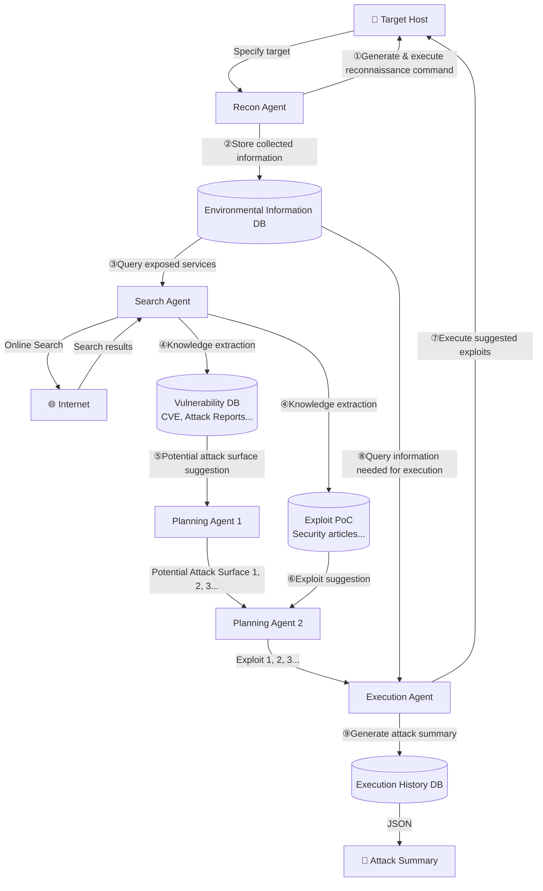
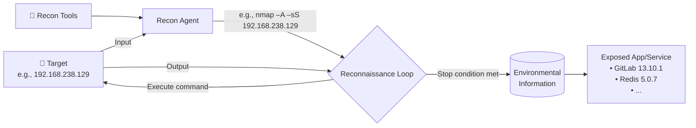
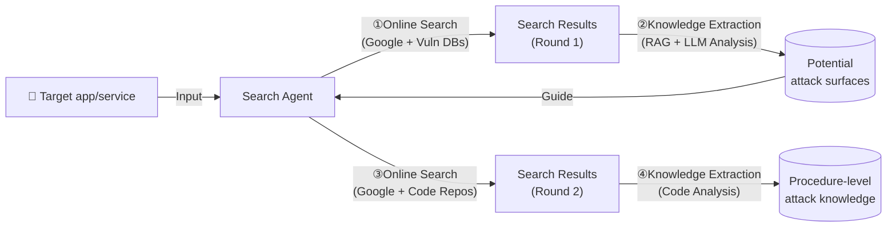
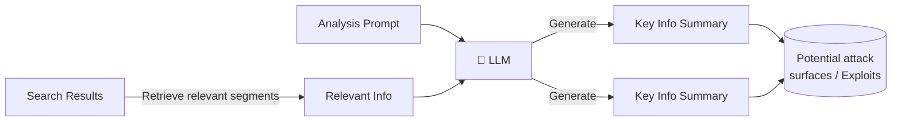
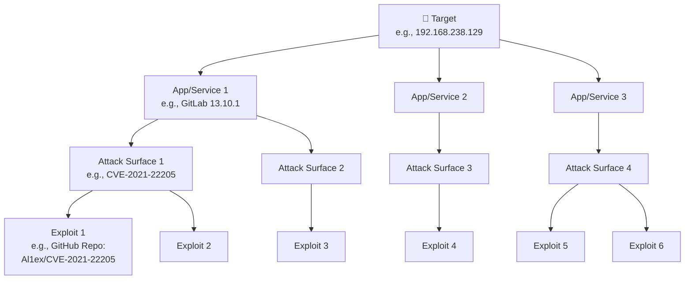
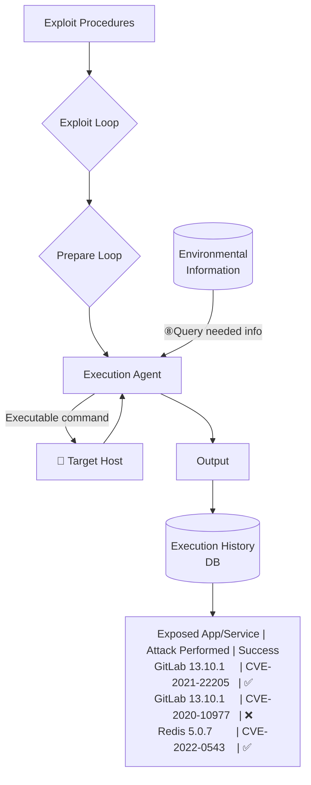
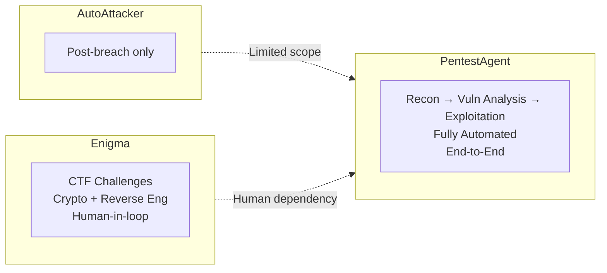

# 🛡️ PentestAgent: Incorporating LLM Agents to Automated Penetration Testing

> **Published at:** *ACM Asia Conference on Computer and Communications Security (ASIA CCS '25)*
> **Date:** August 25–29, 2025 · Hanoi, Vietnam
> **arXiv:** [arXiv:2411.05185v3 \[cs.CR\] 29 May 2025](https://arxiv.org/abs/2411.05185)
> **DOI:** [10.1145/3708821.3733882](https://doi.org/10.1145/3708821.3733882)
> **License:** Creative Commons Attribution 4.0 International
> **Code:** 🔗 [https://github.com/nbshenxm/pentest-agent](https://github.com/nbshenxm/pentest-agent)

---

## 👥 Authors

| Name | Affiliation | Email |
|------|------------|-------|
| **Xiangmin Shen** ⭐ | Northwestern University, Evanston, Illinois, USA | xiangminshen2019@u.northwestern.edu |
| **Lingzhi Wang** ⭐ | Northwestern University, Evanston, Illinois, USA | lingzhiwang2025@u.northwestern.edu |
| Zhenyuan Li | Zhejiang University, Hangzhou, Zhejiang, China | lizhenyuan@zju.edu.cn |
| Yan Chen | Northwestern University, Evanston, Illinois, USA | ychen@northwestern.edu |
| Wencheng Zhao | Ant Group, Hangzhou, Zhejiang, China | wencheng.zwc@antgroup.com |
| Dawei Sun | Ant Group, Hangzhou, Zhejiang, China | david.sdw@antgroup.com |
| Jiashui Wang | Zhejiang University, Hangzhou, Zhejiang, China | 12221251@zju.edu.cn |
| Wei Ruan | Zhejiang University, Hangzhou, Zhejiang, China | ruanwei@zju.edu.cn |

> ⭐ *Both authors contributed equally to this work.*

---

## 🔑 CCS Concepts & Keywords

**CCS Concepts:**
- Security and privacy → **Penetration testing**
- Computing methodologies → **Multi-agent systems**

**Keywords:** `Penetration Testing` · `Large Language Model` · `Agent`

---

## 📋 Abstract

Penetration testing is a critical technique for identifying security vulnerabilities, traditionally performed manually by skilled security specialists. This complex process involves gathering information about the target system, identifying entry points, exploiting the system, and reporting findings. Despite its effectiveness, manual penetration testing is time-consuming and expensive, often requiring significant expertise and resources that many organizations cannot afford. While automated penetration testing methods have been proposed, they often fall short in real-world applications due to limitations in flexibility, adaptability, and implementation.

Recent advancements in large language models (LLMs) offer new opportunities for enhancing penetration testing through increased intelligence and automation. However, current LLM-based approaches still face significant challenges, including limited penetration testing knowledge and a lack of comprehensive automation capabilities.

To address these gaps, we propose **PentestAgent**, a novel LLM-based automated penetration testing framework that leverages the power of LLMs and various LLM-based techniques like **retrieval augmented generation (RAG)** to enhance penetration testing knowledge and automate various tasks. Our framework leverages **multi-agent collaboration** to automate intelligence gathering, vulnerability analysis, and exploitation stages, reducing manual intervention. We evaluate PentestAgent using a comprehensive benchmark, demonstrating superior performance in task completion and overall efficiency.

---

## 1. 🔍 Introduction

Penetration testing is a widely adopted technique for proactively identifying security vulnerabilities. This process involves gathering information about the target system (**reconnaissance**), identifying possible entry points, attempting to exploit the system, and reporting the findings \[14\]. Traditionally, penetration testing has been a complex manual process requiring highly skilled security specialists with extensive experience. Testers typically write their own exploits, master public domain tools, and perform numerous tedious and time-consuming tasks \[43\].

> 📊 According to **Rapid7's Under the Hoodie report**, penetration testing takes an average of **80 hours**, with significant outliers taking **several hundred hours** \[7\].

Consequently, manual penetration testing often necessitates large, diverse teams, which most organizations cannot afford.

Although automated penetration testing has been a concept for over a decade, a significant gap remains between the proposed methods and their real-world application. Early works \[5, 30, 36\] primarily modeled attack planning as an **attack graph problem** \[3\] in a deterministic and fully observable world. However, such an approach imposes limitations: it assumes complete observability from the defenders' standpoint and lacks the flexibility and adaptability required for dynamic environments.

Later efforts \[6, 15, 19, 20, 37–39, 49\] addressed these shortcomings by introducing uncertainty into planning methodologies, treating attack planning as a **Markov Decision Process (MDP)**, which models the world as states and actions as transitions between states, with a reward function encoding the "reward" for moving from one state to another. As extensions to MDP-based approaches, the subsequent works employ **partially observable Markov decision process (POMDP)** \[37, 38\] and **reinforcement learning algorithms** \[6, 19\] to account for further uncertainty in the environment and action outcomes. These advancements better align with real-world conditions where attackers possess limited knowledge of the target systems. Nevertheless, these probabilistic models focus on establishing a theoretical model for automated pentesting planning and **lack the implementation aspect**.

### ⚠️ Two Critical Gaps in Existing LLM-Based Approaches

**1) Limited Pentesting Knowledge:**
These methods heavily rely on pre-trained language models for generating actionable items. However, the training datasets for these models often lack comprehensive coverage of penetration testing techniques. This results in a limited state space and an outdated action space, reducing the effectiveness and relevance of the generated actions.

**2) Insufficient Automation:**
Existing approaches lack the automated capabilities to adapt to various environments, including validating and debugging the suggested procedures and dynamically acquiring and applying new pentesting techniques.

### 📊 Comparison of LLM-Based Pentesting Systems

| System | State & Action Space | Online Search Augmentation | Validation & Debugging Capability |
|--------|---------------------|---------------------------|-----------------------------------|
| **PentestAgent** | **Large** | **Auto** | **Auto** |
| AutoAttacker \[48\] | Unknown¹ | Manual | Manual |
| PentestGPT \[12\] | Unknown¹ | Manual | Manual |
| Happe et al. \[18\] | Small | No | No |

> ¹ *AutoAttacker and PentestGPT solely rely on LLMs to provide reconnaissance and attack techniques, which can be limited and outdated.*

### 🎯 Our Contributions

To overcome these challenges, we propose **PentestAgent**, a novel LLM-based automated penetration testing framework. Our contributions are:

- 🔧 **PentestAgent Framework** — A LLM-based automated pentesting system that operates with minimal human intervention, integrating multi-agent design and Retrieval Augmented Generation (RAG) techniques.
- 📦 **Comprehensive Benchmark** — Based on the leading open-source collection of pre-built vulnerable Docker environments VulHub, spanning various difficulty levels and encompassing a wide range of common weaknesses and vulnerabilities.
- 📈 **Experiments & Metrics** — Designed to evaluate PentestAgent on the benchmark, demonstrating superior performance in automatically completing the entire penetration testing process.

---

## 2. 📚 Background and Related Work

### 2.1 Penetration Testing

Penetration testing (pentesting) is a structured, multi-stage process designed to identify security vulnerabilities in systems. According to the **Penetration Testing Execution Standard (PTES)** \[42\], pentesting consists of three main stages:

```
Intelligence Gathering → Vulnerability Analysis → Exploitation
```

Penetration testing is broadly divided into:
- **External assessments** — Focus on assets exposed on the internet, such as web applications, online services, and external networks, using techniques like social engineering, red teaming, and web penetration testing.
- **Internal assessments** — Target the organization's internal network, source code, or physical devices, typically involving code reviews and internal network compromises.

> 📊 According to **Rapid7's latest report** \[8\], external network compromise constitutes over **80%** of penetration testing tasks.

#### 🛠️ Existing Tools

| Tool | Stage | Purpose |
|------|-------|---------|
| [Nmap](https://nmap.org/) \[29\] | Intelligence Gathering | Network configuration analysis via direct target interaction |
| [Nessus](https://www.tenable.com/products/nessus) \[44\] | Vulnerability Analysis | Scanning systems for known weaknesses using extensive vulnerability databases |
| [OpenVAS](https://www.openvas.org/) \[16\] | Vulnerability Analysis | Open-source vulnerability scanning |
| [Metasploit](https://www.metasploit.com/) \[35\] | Exploitation | Range of exploits and payloads to execute attacks on identified vulnerabilities |

> Although these tools are effective alone, their effective use requires expert knowledge, manual decision making, and significant effort to coordinate workflow.

#### 🤖 AI-Driven Penetration Testing

Recent advancements in artificial intelligence have led to the development of more sophisticated penetration testing frameworks based on machine learning and Markov Decision Process (MDP) algorithms \[6, 19, 49\]. For example, Chen et al. \[6\] designed a reinforcement learning-based framework for automated attack planning. This framework incorporates expert knowledge into state-action pairs and employs a reward function to train the system to execute actions with the highest success rate. Although these frameworks can generate reasonable attack plans, they **lack the dynamic implementation aspects** of penetration testing — they are unable to react to potential failures and adjust the plan in real time.

#### 🧠 LLM-Based Penetration Testing

The rise of LLM-based applications has further advanced the automation of penetration testing tasks such as text analysis, task planning, code modification, and execution debugging. However, the existing LLM-based penetration testing frameworks still lack comprehensive coverage of the stages and automation for practical use.

- **AutoAttacker** \[48\] — Focuses on constructing post-breach attacks, neglecting the pre-compromise stages.
- **PentestGPT** \[12\] — While implicitly considering multiple stages through its "pentesting task tree," still relies on human decision to proceed with a certain branch of tasks, leading to inefficiency and ineffectiveness. Moreover, it depends on the LLM's pre-trained knowledge and human analysis.

---

### 2.2 ⚡ Challenges of Applying LLM to Pentesting

#### 🔴 C1. Limited Pentesting Knowledge

The LLM has basic knowledge about vulnerabilities and penetration testing, but requires the user to manually search for additional information — such as actual CVE numbers, related CVE information, relevant exploits, and how to configure exploitation tools. All these additional efforts require penetration testing expertise and significant human effort.

> **Example — Limited Pentesting Knowledge:**
>
> *User:* What may be the vulnerabilities of ActiveMQ 5.17.3? And how can I test if the vulnerabilities exist?
>
> *GPT-4:*
> 1. Keep Software Updated . . .
> 2. Check CVEs . . .
> 3. Security Scanning Tools . . .
> 4. Configuration Review . . .
> 5. Penetration Testing . . .
> 6. Log Analysis . . .
>
> *User:* Could you give detailed steps for pentesting?
>
> *GPT-4:*
> 1. Identify Known CVEs . . .
> 2. Set Up Metasploit . . .
> 3. Search for ActiveMQ Modules . . .
> 4. Configure and Run Exploit . . .
> 5. Manual Testing . . .

#### 🔴 C2. Short-term Memory

The limitation of models' context windows, leading to the **short-term memory problem**, becomes particularly challenging during long-lasting tasks such as penetration testing, which requires continuous memory across a prolonged time period.

This leads to two issues:

**1) Repetition of Tasks:**

> *Example — Repetition of Tasks:*
>
> **Intelligence Gathering**
> *LLM:* Use Nmap to perform a comprehensive scan of all ports on the target host to identify open ports and services.
> *User:* {Nmap scan results}
>
> **Vulnerability Analysis**
> *LLM:* Use Nmap to perform a comprehensive scan of all ports on the target host to identify open ports and services. ← *(redundant!)*

**2) Loss of Context:**

> *Example — Loss of Context:*
>
> **Intelligence Gathering**
> {Information collection steps}...
> *LLM:* The target OS is Linux and the target IP is 192.168.238.129.
>
> **Exploitation**
> *User:* How do I execute this exploit?
> *LLM:* The target OS and IP are needed to configure the exploit. For investigation of the unknown OS and IP, do the following: . . . ← *(context lost!)*

#### 🔴 C3. Workflow Integration

In the context of penetration testing, which involves a multi-stage pipeline of interconnected tasks, integrating an LLM introduces several challenges:

**1) Output Quality Control:**
Ensuring that the LLM's output is formatted in a way that downstream modules can parse easily is crucial. LLMs may suffer from the **hallucination problem**, producing irrelevant or incorrect answers. Implementing robust quality control is necessary to mitigate the risk of propagating errors or misleading data through the pipeline.

**2) Stateful Working Memory Management:**
Each stage of penetration testing often requires different sets of stateful working memory, encompassing information such as discovered vulnerabilities, selected exploits, target environment details, and ongoing session contexts. Current LLMs do not inherently support such working memory management within and between sessions.

---

### 2.3 🧰 LLM Techniques for Overcoming Challenges

| Technique | Challenge Addressed | Description |
|-----------|---------------------|-------------|
| **LLM Agents** | C1 (Limited knowledge) | LLMs equipped with tools; can search for and learn penetration testing knowledge online |
| **RAG** (Retrieval-Augmented Generation) | C2 (Short-term memory), C3.2 (Stateful memory) | Enhances LLMs by allowing use of external data for generating responses |
| **Chain-of-Thought (CoT)** | C3.1 (Output quality) | Significantly improves LLM complex reasoning by guiding it through logical step sequences |
| **Role-playing** | C3.1 (Output quality) | Asks the LLM to impersonate a character, allowing it to operate with clear objectives and boundaries |
| **Self-reflection** | C3.1 (Output quality) | LLM summarizes past mistakes into long-term memory to avoid similar errors in subsequent communications |
| **Structured Output** | C3.1 (Output quality) | Saves time on iterative prompt testing and ad-hoc parsing, reducing overall LLM inference costs |

> Together, **chain-of-thought, role-playing, self-reflection, and structured output** techniques significantly improve the quality of LLM output, effectively addressing the output quality control challenge (C3.1).

---

## 3. 🏗️ System Design

### 3.1 System Overview

PentestAgent comprises **four major components** that collaborate to perform the three main stages of penetration testing:



#### 📌 Stage-by-Stage Workflow

**① Intelligence Gathering:**
Upon receiving user input specifying the target, the **reconnaissance agent** initiates the penetration testing process by gathering environmental information about the target host. It generates and executes reconnaissance commands, aiming to collect comprehensive environmental data. The agent then analyzes the execution results and compiles a summary stored in a designated **environmental information database**.

**② Vulnerability Analysis:**
The **search** and **planning agents** work together. The search agent queries the environmental information database, then searches for potential attack surfaces and procedures, saving them in separate databases. The planning agent leverages RAG to find potential attack surfaces and then determines suitable exploits for the target environment.

**③ Exploitation:**
The **execution agent** attempts to execute the attack plans on the target host. It communicates with the environmental information database to obtain necessary information, debugs any execution errors, and stores all execution history in a database for generating a comprehensive penetration testing report.

---

### 3.2 🔎 Reconnaissance Agent



The reconnaissance agent takes a specified target as input and interacts with it to collect detailed information, ultimately generating a summary of the environmental information. The agent operates in a **self-iterating loop**, generating reconnaissance commands and analyzing results until the best efforts have been made. Once the loop concludes, the agent summarizes its findings and stores them in a database.

#### 🧩 Techniques Applied to the Reconnaissance Agent

> **Reconnaissance System Message (Simplified)**
>
> **Role-play**
> You're an excellent cybersecurity penetration tester assistant. Guide the tester . . .
>
> **Chain-of-Thought**
> Use Nmap to identify exposed ports, then use relevant tools in Nmap to analyze these ports on the target host . . .
>
> **RAG**
> You should use your query tool to learn about available reconnaissance tools . . .
>
> **Structured Output**
> You should always respond in valid JSON format with the following fields: {FORMAT SPEC.} . . .

- **Role-playing** has proven effective in bypassing the safety policies enforced by the LLM \[11\]. The agent acts as a penetration tester assistant to validate its reconnaissance behaviors.
- **Chain-of-Thought (CoT)** breaks down complex tasks into sub-tasks and constructs an effective reconnaissance workflow to reduce hallucination. It also effectively enforces the stop condition by specifying tasks to complete before stopping.
- **RAG** allows the reconnaissance agent to retrieve relevant information from a database containing documentation of various reconnaissance tools. For example, it can use web application fingerprinting tools with open-source fingerprinting databases like [ObserverWard](https://github.com/0x727/ObserverWard) \[1\] to aid in reconnaissance. RAG also allows the agent to store collected environmental information in a database for later use, **addressing the short-term memory issue**.
- **Structured Output** enforces adherence to the penetration testing pipeline and ensures smooth transition to subsequent steps.

---

### 3.3 🔍 Search Agent



The search agent takes target services and applications as input and stores relevant attack knowledge into databases as output. It performs **two rounds of hierarchical online search**:

**Round 1** — Uses Google and vulnerability database searches (e.g., [Snyk](https://security.snyk.io/) \[40\], [AVD](https://avd.aliyun.com/) \[9\]) to identify **potential attack surfaces** (CVE numbers, vulnerability types, relevant keywords/URLs).

**Round 2** — Uses Google and code repository searches (e.g., GitHub, ExploitDB) to find **procedure-level exploit implementation details** (code analysis to verify exploit functionality, dependencies required to execute).

#### 🔄 RAG Workflow for Search Result Summarization



> *Yellow arrows denote the retrieval process; green arrows denote the generation process.*

> **Potential Attack Surface Analysis Prompt (Simplified)**
>
> **RAG & CoT**
> Generate a concise summary of the document to answer the following questions:
> 1. Does this document describe vulnerabilities targeting a particular service or app; if so, what is the relevant service/app version?
> 2. Provide information that can be used to search for the exploit of the vulnerabilities . . .
>
> **Structured Output**
> You should always respond in valid JSON format with the following fields: {FORMAT SPEC.} . . .
> For example, the response looks like this: {OUTPUT FORMAT EXAMPLE}

---

### 3.4 🗺️ Planning Agent

The planning agent takes the detected services and applications from the reconnaissance agent as input and generates an **exploitation plan** as output.



The planning agent:
1. Uses the **service/application as a key** to find the relevant database for potential attack surfaces.
2. Retrieves attack surfaces based on the **version** and **vulnerability types**.
3. Makes suggestions for attack surfaces, then finds suitable **exploits** based on application version and exploit effects (e.g., remote code execution, authentication bypass).

---

### 3.5 ⚡ Execution Agent

The execution agent takes exploit details as input and attempts to **execute the exploits on the target automatically**, generating an exploitation summary as output.



Each exploit execution is divided into **two stages**:

#### Stage 1: Preparation

The execution agent analyzes the exploit details to determine requirements (parameters needed), then queries the environmental information database to obtain necessary information.

> **Execution Preparation System Message (Simplified)**
>
> **Role-play**
> You're an excellent cybersecurity pentesting assistant . . .
>
> **CoT**
> Analyze the exploit to answer the following questions:
> 1. What parameters for executing this exploit?
> 2. What information do you need to execute the exploit?
>
> **RAG**
> Use your query tool to learn the details about . . .
>
> **Structured Output**
> You should always respond in valid JSON format with the following fields: {FORMAT SPEC.} . . .

#### Stage 2: Exploitation

> **Execution Exploit System Message (Simplified)**
>
> Your next task is to provide step by step guide for executing the exploit and debugging the errors encountered . . .
>
> **RAG**
> You should use the query tool to learn the code and README of the exploit to figure out how to properly execute it. You also use . . .
>
> **Self-reflection**
> When the results indicate an error, you should analyze the error and try to fix it . . .
>
> **Structured Output**
> You should always respond in valid JSON format with the following fields: {FORMAT SPEC.} . . .

The execution agent uses **RAG** to obtain code execution details, breaks down the execution plan, and generates a step-by-step execution guide. When errors are encountered, **self-reflection** guides the agent in debugging — analyzing and fixing errors based on the code and error message, while documenting error history to avoid repeating the same mistake.

---

## 4. 📊 Evaluation

### Research Questions

| RQ | Question |
|----|----------|
| **RQ1** | 🎯 **Effectiveness** — What's the success rate of finishing the whole penetration testing process automatically? |
| **RQ2** | 📈 **Completion level** — What's the completion level of individual penetration testing stages that can be automatically finished? |
| **RQ3** | ⏱️ **Efficiency** — How much time and API cost are needed for PentestAgent to complete a penetration testing task? |

---

### 4.1 Evaluation Setup

#### 📦 Benchmark Dataset

We chose **VulHub** and **HackTheBox** as our benchmark datasets:

**VulHub** \[45\] — Open-source collection of over a hundred pre-built vulnerable Docker environments. The container-based platform supports infrastructure as code (IaC), making it easy to set up testing environments. Most vulnerable environments reproduce a particular **CVE** \[28\], and difficulty is assessed using:
- **CVSS (Common Vulnerability Scoring System)** \[10\] — Difficulty of vulnerability exploits
- **EPSS (Exploit Prediction Scoring System)** \[32\] — How realistic the vulnerable environment is

**HackTheBox** \[17\] — CTF challenges that simulate dynamic, real-world penetration testing tasks.

**Final Benchmark Composition:**

| Category | Count |
|----------|-------|
| Total VulHub targets | 67 |
| Easy exploitability | 50 |
| Medium exploitability | 11 |
| Hard exploitability | 6 |
| HackTheBox CTF challenges | 11 |
| CWE categories covered | 32 |
| OWASP Top 10 risks covered | 8 |

#### 📏 Metrics

- **Effectiveness** — Whether all three stages of penetration testing are completed successfully and automatically (given a target IP, PentestAgent can automatically perform a functional exploit).
- **Completion level** — The penetration testing stages that can be completed, assuming the preceding stages have been successful.
  - *Intelligence Gathering* complete ✅ = target application successfully identified
  - *Vulnerability Analysis* complete ✅ = functional exploits identified (manually verified)
  - *Exploitation* complete ✅ = exploit automatically and successfully executed
- **Efficiency** — Time taken and API cost to complete the entire penetration test cycle.

#### 🖥️ Environment Setup

| Machine | Specs | OS |
|---------|-------|----|
| Victim (simulated vulnerable apps) | 2 CPU cores, 8 GB RAM | Ubuntu 22.04 LTS |
| Attacker | 16 CPU cores, 16 GB RAM | Kali Linux 2024.1 |

> Network connectivity via NAT. Victim machine had all port-listening services (e.g., SSH) disabled to avoid interference.

#### 🤖 LLM Models Used

| Model | Context Window | Knowledge Cutoff | Input Cost | Output Cost |
|-------|---------------|-----------------|------------|-------------|
| GPT-3.5-turbo-0125 | 16,385 tokens | Sep 2021 | $0.50/1M tokens | $1.50/1M tokens |
| GPT-4o | 128,000 tokens | Oct 2023 | $5.00/1M tokens | $15.00/1M tokens |
| o1-mini | 128,000 tokens | Oct 2023 | $1.10/1M tokens | $4.40/1M tokens |
| Llama 3.1-8B-Instruct | 128,000 tokens | Dec 2023 | Open-source | Open-source |

---

### 4.2 🎯 Effectiveness of the Entire Framework

| Model | Easy | Medium | Hard | **Overall** |
|-------|------|--------|------|-------------|
| GPT-4 | Higher | Higher | Higher | **74.2%** |
| GPT-3.5 | Moderate | Moderate | 0% | **60.6%** |

Key findings:
- Both models consistently achieved success rates **above 60%**, affirming the effectiveness of PentestAgent.
- The difference between GPT-4 and GPT-3.5 **was not substantial**, suggesting the framework does not rely heavily on LLMs' general knowledge alone.
- GPT-3.5 **struggled particularly with hard tasks**, achieving no success in the hardest category, likely due to context window size and learned knowledge differences.

---

### 4.3 📈 Completion Level of Penetration Testing Stages

*(I.G. = Intelligence Gathering · V.A. = Vulnerability Analysis · E = Exploitation)*

#### Easy Tasks

| Model | Intelligence Gathering (I.G.) | Vulnerability Analysis (V.A.) | Exploitation (E) |
|-------|-------------------------------|-------------------------------|-----------------|
| GPT-4 | **100%** | **100%** | 81.8% |
| GPT-3.5 | 92% | 96% | 72% |

#### Medium Tasks

| Model | I.G. | V.A. | E |
|-------|------|------|---|
| GPT-4 | High | High (minor drop) | High |
| GPT-3.5 | 66.7% | **100%** | 50% |

#### Hard Tasks

| Model | I.G. | V.A. | E |
|-------|------|------|---|
| GPT-4 | **50%** | — | Lower | 
| GPT-3.5 | **Failed** | — | **Failed** |

> Overall, both models effectively automate significant portions of penetration testing, but **GPT-4 consistently outperforms GPT-3.5**, particularly in more complex scenarios.

---

### 4.4 🔬 Ablation Study

To assess how different LLM backbones influence performance, an ablation study was performed on a subset of VulHub targets (6 easy, 5 medium, 2 hard).

#### Completion Level Findings

- All models perform **consistently in vulnerability analysis** (100% completion)
- GPT-4 and o1-mini achieve **higher completion in intelligence gathering** compared to GPT-3.5 and Llama 3.1-8B-Instruct
- **o1-mini outperforms others in exploitation**, indicating its strength in executing detailed attack procedures
- GPT-3.5 and Llama 3.1-8B-Instruct fall behind in exploitation

#### Overhead Trade-offs

| Model | Speed | Cost | Exploitation Performance |
|-------|-------|------|--------------------------|
| GPT-3.5 | ✅ Fastest in I.G. | ✅ Most cost-effective | ❌ Lower |
| o1-mini | ❌ Longer in V.A. | Moderate | ✅ Best |
| Llama 3.1-8B | ❌ Significant overhead | ✅ Free | ❌ Lower |

---

### 4.5 🌍 Practicality Study

PentestAgent was deployed to solve **HackTheBox challenges** (11 machines: 9 easy, 1 medium, 1 hard).

Key results:
- PentestAgent **successfully exploited 6 machines**
- Others like *Pilgrimage* achieved only partial completion (vulnerability analysis stage only)
- Results indicate PentestAgent can address a range of real-world scenarios, but variability underscores the need for further improvements

---

### 4.6 ⚖️ Comparison with PentestGPT

Both systems configured with **GPT-3.5** for fair comparison. Evaluators: undergraduate student (limited experience) for VulHub, PhD student (more experience) for HackTheBox.

#### HackTheBox Results

| Metric | PentestAgent | PentestGPT |
|--------|-------------|------------|
| Intelligence Gathering | ✅ Higher | ❌ Lower |
| Vulnerability Analysis | ✅ Higher | ❌ Lower |
| Exploitation | ✅ Higher | ❌ Lower |
| I.G. Time | **220 seconds** | 1,199 seconds |
| Exploitation Time | **172 seconds** | 364 seconds |

> Although PentestGPT is slightly faster in vulnerability analysis, its slower performance in other stages due to **human involvement** reduces its overall efficiency.

#### VulHub Results

| Metric | PentestAgent | PentestGPT |
|--------|-------------|------------|
| Intelligence Gathering | **80%** | 10% |
| Vulnerability Analysis | **100%** | 10% |
| Exploitation | **70%** | 30% |
| I.G. Time | **212.9 seconds** | 658.7 seconds |
| Exploitation Time | **58.6 seconds** | 283.5 seconds |
| V.A. Time | 698.8 seconds | 433.5 seconds *(faster but less accurate)* |

> While PentestAgent takes longer in vulnerability analysis, this additional time **contributed to its higher success rate**, ensuring a more accurate and actionable assessment.

---

### 4.7 ❌ Failure Analysis

Most failures occurred during the **intelligence gathering** and **exploitation** stages.

#### 1. Intelligence Gathering Failures

PentestAgent occasionally fails to recognize services or applications with the appropriate level of granularity. It struggled to detect components like **PHPMailer, PHPUnit, and Ghostscript** — these are not standalone applications but plugins/components running on web servers. Tools like Nmap can identify underlying web server frameworks (e.g., Nginx) but fail to enumerate these components.

*Mitigation:* PentestAgent allows integration of additional **web component fingerprinting tools** and specialized libraries.

#### 2. Exploitation Failures

**a) Requiring Additional Knowledge:**
Certain exploits demand domain-specific knowledge exceeding LLM agent capabilities. For example:
- Exploiting **Samba server 4.6.3** (CVE-2017-7494) assumes prior knowledge of credentials for SMB connection
- Exploiting **JBoss** (CVE-2017-12149) requires expertise in using the "ysoserial" tool for crafting payloads

*Mitigation:* Integrating a **human-in-the-loop design** where human experts can intervene at any point in the modular pipeline.

**b) Requiring User Interaction:**
Some exploits require user interactions typically performed manually, such as file uploads via web UIs. For instance, exploiting **elFinder** (CVE-2021-32682) involves manually creating and uploading an archive file.

*Mitigation:* Allowing human users to step in at any penetration testing stage; also, integrating intelligent agents like [AutoGPT](https://github.com/Significant-Gravitas/AutoGPT) \[4\] for mimicking human actions.

**c) LLM Hallucination:**
The model generates incorrect or misleading information. One hallucination can lead to a cascade of errors in subsequent steps (e.g., incorrectly assuming an exploit has bugs, leading down an incorrect debugging path).

*Mitigation strategies:*
- Setting model **temperature to zero** to reduce randomness
- Attempting to execute the exploit **multiple times**
- **Hard-coded limits** on the number of execution attempts
- **Prompt-based conditions** like "stop when you see the same error again"
- Having the attack knowledge base contain **multiple exploits** for the same vulnerability

---

## 5. 💬 Discussion

### 5.1 Comparison with Existing Frameworks

**AutoAttacker** \[48\] focuses exclusively on the **post-breach stage** of an attack, automating the "hands-on-keyboard" exploitation phase once a system has been compromised. In contrast, PentestAgent addresses the **entire penetration testing pipeline** — from reconnaissance and vulnerability analysis to exploitation — providing a more comprehensive solution.

**Enigma** \[2\] extends the SWE-agent framework by integrating interactive tools that support solving CTF challenges. Its design primarily targets the crypto and reverse engineering domains and still **relies on human-in-the-loop interactions**. Although Enigma's interactive interfaces are effective for specific problem domains, its reliance on manual intervention limits full automation.



### 5.2 Limitations on Performing Sophisticated Pentesting

PentestAgent focuses on exploiting **individual vulnerable applications and services**. More sophisticated attack planning may be required in complex penetration testing scenarios, such as **red team simulations**, which often involve combining several vulnerabilities to achieve a more challenging exploit. For example, an SSRF vulnerability could be used as an intermediary step to exploit an internal application, eventually leading to obtaining root privileges.

While addressing such sophisticated attack strategies is beyond the scope of this paper, PentestAgent can still be valuable in these complex scenarios by **identifying and validating exposed vulnerabilities** (such as SSRF) which can serve as starting points for further exploitation.

---

## 6. ✅ Conclusion

This paper presents **PentestAgent**, a novel LLM-based framework for automated penetration testing designed to address the limitations of existing frameworks: **limited pentesting knowledge** and **insufficient automation**. By leveraging a multi-agent architecture and incorporating various LLM techniques like retrieval augmented generation (RAG) and chain-of-thought (CoT), PentestAgent enhances the penetration testing process through improved knowledge integration and automation.

Our comprehensive benchmark, based on VulHub's vulnerable Docker environments and HackTheBox CTF challenges, provided a comprehensive test bed of PentestAgent. The evaluation results demonstrate that PentestAgent achieves strong performance in task completion and overall efficiency.

---

## 📁 Appendix A: Prompts

### Reconnaissance Summary Prompt (Simplified)

> Provide a summary of all reconnaissance findings . . .
>
> The summary of findings should be presented in valid JSON format with the following fields: {FORMAT SPEC.}
>
> For example, {OUTPUT FORMAT EXAMPLE}

### Search Results Summary Prompt

> List ALL CVE numbers, URLs, keywords, and their applicable version relevant to exploit the vulnerabilities of {APP}. The results should be presented in valid JSON format with the following fields: {FORMAT SPEC.} . . .
>
> For example, {OUTPUT FORMAT EXAMPLE}

> ⚠️ *Note:* From initial attempts, the LLM is not familiar with software versioning. Therefore, a paragraph containing descriptions and examples was added to demonstrate how to handle software versions as **few-shot learning**.

### Exploit Procedure Analysis Prompt (Simplified)

> **RAG & CoT**
> Give a concise summary of the entire repository to answer the following questions:
> 1. Whether this repository contains an exploit targeting a particular service or app
> 2. What effect does the exploit have? Use one phrase to summarize the effect (e.g., remote command execution)
> 3. What relevant service/app version can this exploit be applied to?
>
> **Few-shot Learning**
> Note the app version is typically formatted as x.y.z. Explicitly state the version with the following formats . . .
>
> 4. What are the requirements to run this exploit? (e.g., OS, library dependencies, etc.)
>
> **Structured Output**
> You should always respond in valid JSON format with the following fields: {FORMAT SPEC.} . . .
>
> For example, the response looks like this: {OUTPUT FORMAT EXAMPLE}

### Attack Surface Suggestion Prompt (Simplified)

> List out all vulnerabilities ranked by confidence that can be used to exploit {app} {version} and provide the details about the vulnerabilities and the reasons to support each selection . . .
>
> The details should include . . .
>
> Make the selections by checking whether {version} is within the applicable version of the exploit and the vulnerability types . . .
>
> The results should be presented in valid JSON format with the following fields: {FORMAT SPEC.} . . .
>
> For example, {OUTPUT FORMAT EXAMPLE}

### Exploit Suggestion Prompt (Simplified)

> List out paths of all relevant repositories ranked by the confidence that contain exploits . . . applicable to {app} {version} and provide the details about the exploit and reasons to support each selection . . .
>
> The details should include . . .
>
> Make the selections by checking whether {version} is within the applicable version of the exploit and the execution effects . . .
>
> The results should be presented in valid JSON format with the following fields: {FORMAT SPEC.} . . .
>
> For example, {OUTPUT FORMAT EXAMPLE}

### Execution Information Query Prompt (Simplified)

> Based on the known information, try to provide the information listed here. {INFO NEEDED . . .}
>
> **CoT**
> You should examine the information needed one by one. For each piece of information needed, you should . . .
>
> **RAG**
> You should use your query tool to learn about the target environment . . .
>
> **Structured Output**
> The results should be presented in valid JSON format with the following fields: {FORMAT SPEC.} . . .
>
> For example, the response looks like this: {OUTPUT FORMAT EXAMPLE}

---

## 📁 Appendix B: Benchmark Construction

### B.1 VulHub Benchmark Construction

We use **CVSS** and **EPSS** scores to determine the difficulty of exploiting vulnerabilities.

**CVSS Exploitability Score Distribution:**

| Score | Frequency |
|-------|-----------|
| 1.2 | 1 |
| 1.6 | 1 |
| 1.8 | 4 |
| 2.2 | 3 |
| 2.3 | 1 |
| 2.8 | 7 |
| 3.1 | 1 |
| 3.9 | 49 |

> Exploitability scores of **2.0** and **3.0** make natural cutoffs for easy, medium, and hard difficulties.

**EPSS Score Distribution:**
- Dataset mean EPSS score: **79.58**
- Median EPSS score: **97.19**

> High EPSS scores indicate the vulnerabilities represented are **highly likely to exist and be exploitable** in practical settings.

**Benchmark Difficulty Distribution:**

| Difficulty | Count |
|------------|-------|
| Easy | 50 |
| Medium | 11 |
| Hard | 6 |

> ⚠️ *Note:* To maintain integrity and fairness, PentestAgent was strictly prohibited from directly accessing any content from the VulHub repository, preventing any advantage or bias.

### B.2 HackTheBox Benchmark Construction

Selection focused on:
- **OS diversity** — Both Linux and Windows machines
- **Vulnerability relevance** — Well-known vulnerabilities spanning a decade
- **Difficulty levels** — Easy, medium, and hard

Notable machines included:
- **Blue** — Features the EternalBlue vulnerability (CVE-2017-0144), a widely known Windows SMB exploit
- **Legacy** — Includes MS08-067 (CVE-2008-4250), another critical SMB-based attack
- **Stratosphere** (Medium) — CVE-2017-5638, requires deeper reconnaissance and multi-step attacks
- **Reel** (Hard) — CVE-2017-0199, requires advanced reasoning

### B.3 Benchmark Coverage

**CWE Categories Covered** (32 total, selected):

| CWE Description | Frequency |
|-----------------|-----------|
| OS Command Injection | Highest |
| Deserialization of Untrusted Data | High |
| Improper Limitation of . . . | High |
| Code Injection | High |
| Information Exposure | Moderate |
| Improper Authentication | Moderate |
| SQL Injection | Moderate |
| Improper Input Validation | Moderate |
| Expression Language Injection | Moderate |
| SSRF | Moderate |
| Out-of-bounds Write | Lower |
| Cross-site Scripting | Lower |
| Missing Authorization | Lower |
| Cleartext Transmission of Sensitive Info | Lower |
| Authentication Bypass | Lower |
| Classic Buffer Overflow | Lower |
| Open Redirect | Lower |
| Resource Exhaustion | Lower |
| Incorrect Authorization | Lower |
| Improper Restriction of . . . | Lower |
| Missing Authentication for . . . | Lower |
| Improper Access Control | Lower |
| Unrestricted Upload of File . . . | Lowest |
| *(+ additional CWE types)* | — |

> Covers **8 security risks** in OWASP Top 10 vulnerability \[34\].

---

## 📁 Appendix C: Additional Evaluation Results

### PentestAgent Performance on HackTheBox CTF Challenges

| Machine | Difficulty | Completed Stage |
|---------|------------|----------------|
| Sau | Easy | 2/3 (I.G., V.A.) |
| Pilgrimage | Easy | 1/3 (V.A.) |
| Lame | Easy | **3/3** ✅ |
| Topology | Easy | **3/3** ✅ |
| PC | Easy | **3/3** ✅ |
| Blue | Easy | **3/3** ✅ |
| Shocker | Easy | 2/3 (V.A., E) |
| Optimum | Easy | **3/3** ✅ |
| Legacy | Easy | **3/3** ✅ |
| Stratosphere | Medium | 2/3 (V.A., E) |
| Reel | Hard | 2/3 (V.A., E) |

### PentestGPT Performance on HackTheBox CTF Challenges

| Machine | Difficulty | Completed Stage |
|---------|------------|----------------|
| Sau | Easy | 2/3 (I.G., V.A.) |
| Pilgrimage | Easy | 1/3 (V.A.) |
| Lame | Easy | 2/3 (V.A., E) |
| Topology | Easy | 2/3 (V.A., E) |
| PC | Easy | **0/3** ❌ |
| Blue | Easy | 2/3 (V.A., E) |
| Shocker | Easy | **0/3** ❌ |
| Optimum | Easy | **3/3** ✅ |
| Legacy | Easy | **3/3** ✅ |
| Stratosphere | Medium | **0/3** ❌ |
| Reel | Hard | 1/3 (I.G.) |

### VulHub Comparison Summary

**Completion Rates:**

| Stage | PentestAgent | PentestGPT |
|-------|-------------|------------|
| Intelligence Gathering | **80%** | 10% |
| Vulnerability Analysis | **100%** | 10% |
| Exploitation | **70%** | 30% |

**Average Time Spent:**

| Stage | PentestAgent | PentestGPT |
|-------|-------------|------------|
| Intelligence Gathering | **212.9 sec** | 658.7 sec |
| Vulnerability Analysis | 698.8 sec | 433.5 sec |
| Exploitation | **58.6 sec** | 283.5 sec |

> PentestAgent is both **more effective and more efficient** than PentestGPT. Its lower overhead in intelligence gathering and exploitation makes it a more scalable and practical solution for real-world penetration testing.

---

## 📖 References

| # | Citation |
|---|----------|
| \[1\] | 0x727. 2024. ObserverWard. 🔗 [https://github.com/0x727/ObserverWard](https://github.com/0x727/ObserverWard) |
| \[2\] | Talor Abramovich, Meet Udeshi, Minghao Shao, Kilian Lieret, Haoran Xi, et al. 2024. *EnIGMA: Enhanced Interactive Generative Model Agent for CTF Challenges.* arXiv preprint arXiv:2409.16165. |
| \[3\] | Paul Ammann, Duminda Wijesekera, and Saket Kaushik. 2002. *Scalable, graph-based network vulnerability analysis.* In Proceedings of the 9th ACM Conference on Computer and Communications Security. 217–224. |
| \[4\] | AutoGPT. 2024. AutoGPT. 🔗 [https://github.com/Significant-Gravitas/AutoGPT](https://github.com/Significant-Gravitas/AutoGPT) |
| \[5\] | Mark S Boddy, Johnathan Gohde, Thomas Haigh, and Steven A Harp. 2005. *Course of Action Generation for Cyber Security Using Classical Planning.* In ICAPS. 12–21. |
| \[6\] | Jinyin Chen, Shulong Hu, Haibin Zheng, Changyou Xing, and Guomin Zhang. 2023. *GAIL-PT: An intelligent penetration testing framework with generative adversarial imitation learning.* Computers & Security 126 (2023), 103055. |
| \[7\] | Rapid7 Global Consulting. 2019. *Under the Hoodie: Lessons from a Season of Penetration Testing.* 🔗 [https://www.rapid7.com/research/reports/under-the-hoodie-2019/](https://www.rapid7.com/research/reports/under-the-hoodie-2019/) |
| \[8\] | Rapid7 Global Consulting. 2020. *Under the Hoodie: Lessons from a Season of Penetration Testing.* 🔗 [https://www.rapid7.com/research/reports/under-the-hoodie-2020/](https://www.rapid7.com/research/reports/under-the-hoodie-2020/) |
| \[9\] | Alibaba Cloud. 2024. Vulnerability DB. 🔗 [https://avd.aliyun.com/](https://avd.aliyun.com/) |
| \[10\] | National Vulnerability Database. 2024. Common Vulnerability Scoring System Calculator. 🔗 [https://nvd.nist.gov/vuln-metrics/cvss/v3-calculator](https://nvd.nist.gov/vuln-metrics/cvss/v3-calculator) |
| \[11\] | Gelei Deng, Yi Liu, Yuekang Li, Kailong Wang, Ying Zhang, Zefeng Li, Haoyu Wang, Tianwei Zhang, and Yang Liu. 2023. *Jailbreaker: Automated jailbreak across multiple large language model chatbots.* arXiv preprint arXiv:2307.08715. |
| \[12\] | Gelei Deng, Yi Liu, Víctor Mayoral-Vilches, Peng Liu, Yuekang Li, Yuan Xu, Tianwei Zhang, Yang Liu, Martin Pinzger, and Stefan Rass. 2024. *PentestGPT: Evaluating and Harnessing Large Language Models for Automated Penetration Testing.* In 33rd USENIX Security Symposium (USENIX Security 24). 847–864. |
| \[13\] | Yinlin Deng, Chunqiu Steven Xia, Chenyuan Yang, Shizhuo Dylan Zhang, Shujing Yang, and Lingming Zhang. 2024. *Large language models are edge-case generators: Crafting unusual programs for fuzzing deep learning libraries.* In Proceedings of the 46th IEEE/ACM International Conference on Software Engineering. 1–13. |
| \[14\] | Matthew Denis, Carlos Zena, and Thaier Hayajneh. 2016. *Penetration testing: Concepts, attack methods, and defense strategies.* In 2016 IEEE Long Island Systems, Applications and Technology Conference (LISAT). IEEE, 1–6. |
| \[15\] | Karel Durkota and Viliam Lisy. 2014. *Computing Optimal Policies for Attack Graphs with Action Failures and Costs.* In STAIRS. 101–110. |
| \[16\] | GreenBone. 2024. GreenBone OpenVAS. 🔗 [https://www.openvas.org/](https://www.openvas.org/) |
| \[17\] | HackTheBox. 2024. Hackthebox: Hacking training for the best. 🔗 [https://www.hackthebox.com/](https://www.hackthebox.com/) |
| \[18\] | Andreas Happe and Jürgen Cito. 2023. *Getting pwn'd by ai: Penetration testing with large language models.* In Proceedings of the 31st ACM Joint European Software Engineering Conference and Symposium on the Foundations of Software Engineering. 2082–2086. |
| \[19\] | Zhenguo Hu, Razvan Beuran, and Yasuo Tan. 2020. *Automated penetration testing using deep reinforcement learning.* In 2020 IEEE European Symposium on Security and Privacy Workshops (EuroS&PW). IEEE, 2–10. |
| \[20\] | Leanid Krautsevich, Fabio Martinelli, and Artsiom Yautsiukhin. 2013. *Towards modelling adaptive attacker's behaviour.* In Foundations and Practice of Security: 5th International Symposium, FPS 2012. Springer, 357–364. |
| \[21\] | Patrick Lewis, Ethan Perez, Aleksandra Piktus, Fabio Petroni, Vladimir Karpukhin, Naman Goyal, et al. 2020. *Retrieval-augmented generation for knowledge-intensive nlp tasks.* Advances in Neural Information Processing Systems 33 (2020), 9459–9474. |
| \[22\] | Guohao Li, Hasan Hammoud, Hani Itani, Dmitrii Khizbullin, and Bernard Ghanem. 2023. *Camel: Communicative agents for "mind" exploration of large language model society.* Advances in Neural Information Processing Systems 36 (2023), 51991–52008. |
| \[23\] | Haonan Li, Yu Hao, Yizhuo Zhai, and Zhiyun Qian. 2023. *The Hitchhiker's Guide to Program Analysis: A Journey with Large Language Models.* arXiv preprint arXiv:2308.00245. |
| \[24\] | Michael Xieyang Liu, Frederick Liu, Alexander J Fiannaca, Terry Koo, Lucas Dixon, Michael Terry, and Carrie J Cai. 2024. *"We Need Structured Output": Towards User-centered Constraints on Large Language Model Output.* In Extended Abstracts of the CHI Conference on Human Factors in Computing Systems. 1–9. |
| \[25\] | Puzhuo Liu, Chengnian Sun, Yaowen Zheng, Xuan Feng, Chuan Qin, Yuncheng Wang, Zhi Li, and Limin Sun. 2023. *Harnessing the power of llm to support binary taint analysis.* arXiv preprint arXiv:2310.08275. |
| \[26\] | Ruijie Meng, Martin Mirchev, Marcel Böhme, and Abhik Roychoudhury. 2024. *Large language model guided protocol fuzzing.* In Proceedings of the 31st Annual Network and Distributed System Security Symposium (NDSS). |
| \[27\] | Microsoft. 2024. System message framework and template recommendations for Large Language Models (LLMs). 🔗 [https://learn.microsoft.com/en-us/azure/ai-services/openai/concepts/system-message](https://learn.microsoft.com/en-us/azure/ai-services/openai/concepts/system-message) |
| \[28\] | MITRE. 2024. CVE. 🔗 [https://cve.mitre.org/](https://cve.mitre.org/) |
| \[29\] | nmap. 2024. nmap. 🔗 [https://nmap.org/](https://nmap.org/) |
| \[30\] | Jorge Lucangeli Obes, Carlos Sarraute, and Gerardo Richarte. 2013. *Attack planning in the real world.* arXiv preprint arXiv:1306.4044. |
| \[31\] | Forum of Incident Response and Inc. Security Teams. 2024. *Common Vulnerability Scoring System v3.0: Specification Document.* 🔗 [https://www.first.org/cvss/specification-document](https://www.first.org/cvss/specification-document) |
| \[32\] | Forum of Incident Response and Inc. Security Teams. 2024. *Exploit Prediction Scoring System (EPSS).* 🔗 [https://www.first.org/epss/](https://www.first.org/epss/) |
| \[33\] | OWASP. 2024. OWASP Benchmark. 🔗 [https://owasp.org/www-project-benchmark/](https://owasp.org/www-project-benchmark/) |
| \[34\] | OWASP. 2024. Top 10 Web Application Security Risks. 🔗 [https://owasp.org/www-project-top-ten/](https://owasp.org/www-project-top-ten/) |
| \[35\] | Rapid7. 2024. Rapid7 Metasploit. 🔗 [https://www.metasploit.com/](https://www.metasploit.com/) |
| \[36\] | Mark Roberts, Adele Howe, Indrajit Ray, Malgorzata Urbanska, Zinta S Byrne, and Janet M Weidert. 2011. *Personalized vulnerability analysis through automated planning.* In Working Notes for the 2011 IJCAI Workshop on Intelligent Security (SecArt). 50. |
| \[37\] | Carlos Sarraute, Olivier Buffet, and Jörg Hoffmann. 2012. *POMDPs make better hackers: Accounting for uncertainty in penetration testing.* In Proceedings of the AAAI Conference on Artificial Intelligence, Vol. 26. 1816–1824. |
| \[38\] | Carlos Sarraute, Olivier Buffet, and Jörg Hoffmann. 2013. *Penetration testing == POMDP solving?* arXiv preprint arXiv:1306.4714. |
| \[39\] | Carlos Sarraute, Gerardo Richarte, and Jorge Lucángeli Obes. 2011. *An algorithm to find optimal attack paths in nondeterministic scenarios.* In Proceedings of the 4th ACM workshop on Security and artificial intelligence. 71–80. |
| \[40\] | Snyk Security. 2024. Snyk Vulnerability Database. 🔗 [https://security.snyk.io/](https://security.snyk.io/) |
| \[41\] | Noah Shinn, Federico Cassano, Ashwin Gopinath, Karthik Narasimhan, and Shunyu Yao. 2024. *Reflexion: Language agents with verbal reinforcement learning.* Advances in Neural Information Processing Systems 36. |
| \[42\] | The Penetration Testing Execution Standard. 2024. PTES Technical Guidelines. 🔗 [http://www.pentest-standard.org/index.php/PTES_Technical_Guidelines](http://www.pentest-standard.org/index.php/PTES_Technical_Guidelines) |
| \[43\] | Yaroslav Stefinko, Andrian Piskozub, and Roman Banakh. 2016. *Manual and automated penetration testing. Benefits and drawbacks. Modern tendency.* In 2016 13th international conference on modern problems of radio engineering, telecommunications and computer science (TCSET). IEEE, 488–491. |
| \[44\] | Tenable. 2024. Tenable Nessus. 🔗 [https://www.tenable.com/products/nessus](https://www.tenable.com/products/nessus) |
| \[45\] | Vulhub. 2024. Vulhub. 🔗 [https://github.com/vulhub/vulhub](https://github.com/vulhub/vulhub) |
| \[46\] | VulnHub. 2024. VulnHub. 🔗 [https://www.vulnhub.com/](https://www.vulnhub.com/) |
| \[47\] | Jason Wei, Xuezhi Wang, Dale Schuurmans, Maarten Bosma, Fei Xia, Ed Chi, Quoc V Le, Denny Zhou, et al. 2022. *Chain-of-thought prompting elicits reasoning in large language models.* Advances in neural information processing systems 35 (2022), 24824–24837. |
| \[48\] | Jiacen Xu, Jack W Stokes, Geoff McDonald, Xuesong Bai, David Marshall, Siyue Wang, Adith Swaminathan, and Zhou Li. 2024. *AutoAttacker: A Large Language Model Guided System to Implement Automatic Cyber-attacks.* arXiv preprint arXiv:2403.01038. |
| \[49\] | Tian-yang Zhou, Yi-chao Zang, Jun-hu Zhu, and Qing-xian Wang. 2019. *NIGAP: A new method for automated penetration testing.* Frontiers of Information Technology & Electronic Engineering 20, 9 (2019), 1277–1288. |

---

*© 2025 Copyright held by the owner/author(s). Published under Creative Commons Attribution 4.0 International License.*
*ACM ISBN 979-8-4007-1410-8/2025/08*
