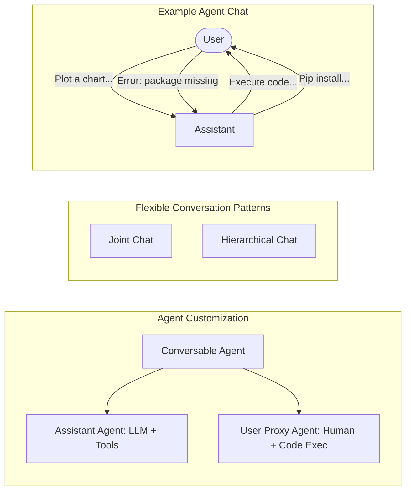
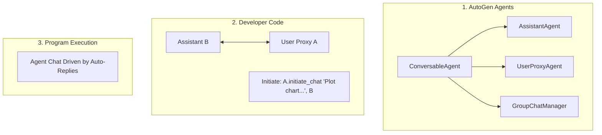

# AutoGen: Enabling Next-Gen LLM Applications via Multi-Agent Conversation

**Authors:** Qingyun Wu, Gagan Bansal, Jieyu Zhang, Yiran Wu, Beibin Li, Erkang Zhu, Li Jiang, Xiaoyun Zhang, Shaokun Zhang, Jiale Liu, Ahmed Awadallah, Ryen W. White, Doug Burger\*, Chi Wang\*

**Affiliations:** Microsoft Research, Pennsylvania State University, University of Washington, Xidian University  
*\*Corresponding author. Email: auto-gen@outlook.com*

**Source Code:** [https://github.com/microsoft/autogen](https://github.com/microsoft/autogen)

---

## 📑 Table of Contents

- [Abstract](#abstract)
- [1. Introduction](#1-introduction)
- [2. The AutoGen Framework](#2-the-autogen-framework)
  - [2.1 Conversable Agents](#21-conversable-agents)
  - [2.2 Conversation Programming](#22-conversation-programming)
- [3. Applications of AutoGen](#3-applications-of-autogen)
- [4. Discussion](#4-discussion)
- [Appendix A: Related Work](#appendix-a-related-work)
- [Appendix B: Expanded Discussion](#appendix-b-expanded-discussion)
- [Appendix C: Default System Message for Assistant Agent](#appendix-c-default-system-message-for-assistant-agent)
- [Appendix D: Application Details](#appendix-d-application-details)
- [Appendix E: Example Outputs from Applications](#appendix-e-example-outputs-from-applications)

---

## 🚀 Abstract

**AutoGen** is an open-source framework that allows developers to build LLM applications via multiple agents that can converse with each other to accomplish tasks. AutoGen agents are customizable, conversable, and can operate in various modes that employ combinations of LLMs, human inputs, and tools. 

Using AutoGen, developers can also flexibly define agent interaction behaviors. Both natural language and computer code can be used to program flexible conversation patterns for different applications. AutoGen serves as a generic framework for building diverse applications of various complexities and LLM capacities. 

> 📊 **Empirical Studies**  
> Empirical studies demonstrate the effectiveness of the framework in many example applications, with domains ranging from mathematics, coding, question answering, operations research, online decision-making, entertainment, etc.

---

## 1. Introduction

Large language models (LLMs) are becoming a crucial building block in developing powerful agents that utilize LLMs for reasoning, tool usage, and adapting to new observations in many real-world tasks. Given the expanding tasks that could benefit from LLMs and the growing task complexity, an intuitive approach to scale up the power of agents is to use multiple agents that cooperate. Prior work suggests that multiple agents can help encourage divergent thinking, improve factuality and reasoning, and provide validation. 

In light of the intuition and early evidence of promise, it is intriguing to ask the following question: *how can we facilitate the development of LLM applications that could span a broad spectrum of domains and complexities based on the multi-agent approach?*

### 🧠 The Role of Multi-Agent Conversations

Our insight is to use multi-agent conversations to achieve it. There are at least three reasons confirming its general feasibility and utility thanks to recent advances in LLMs: 

1. **Feedback Incorporation:** Because chat-optimized LLMs (e.g., GPT-4) show the ability to incorporate feedback, LLM agents can cooperate through conversations with each other or human(s), e.g., a dialog where agents provide and seek reasoning, observations, critiques, and validation. 
2. **Modular Capabilities:** Because a single LLM can exhibit a broad range of capabilities (especially when configured with the correct prompt and inference settings), conversations between differently configured agents can help combine these broad LLM capabilities in a modular and complementary manner. 
3. **Task Decomposition:** LLMs have demonstrated ability to solve complex tasks when the tasks are broken into simpler subtasks. Multi-agent conversations can enable this partitioning and integration in an intuitive manner.

### Addressing Key Questions

How can we leverage the above insights and support different applications with the common requirement of coordinating multiple agents, potentially backed by LLMs, humans, or tools exhibiting different capacities? We desire a multi-agent conversation framework with generic abstraction and effective implementation that has the flexibility to satisfy different application needs. 

Achieving this requires addressing two critical questions:
1. **How can we design individual agents that are capable, reusable, customizable, and effective in multi-agent collaboration?**
2. **How can we develop a straightforward, unified interface that can accommodate a wide range of agent conversation patterns?**

In practice, applications of varying complexities may need distinct sets of agents with specific capabilities, and may require different conversation patterns, such as single- or multi-turn dialogs, different human involvement modes, and static vs. dynamic conversation. Moreover, developers may prefer the flexibility to program agent interactions in natural language or code. Failing to adequately address these two questions would limit the framework's scope of applicability and generality.

### 🌟 Introducing AutoGen

While there is contemporaneous exploration of multi-agent approaches, we present AutoGen, a generalized multi-agent conversation framework, based on the following new concepts:

1. **Customizable and Conversable Agents:** AutoGen uses a generic design of agents that can leverage LLMs, human inputs, tools, or a combination of them. The result is that developers can easily and quickly create agents with different roles (e.g., agents to write code, execute code, wire in human feedback, validate outputs, etc.) by selecting and configuring a subset of built-in capabilities. The agent's backend can also be readily extended to allow more custom behaviors. To make these agents suitable for multi-agent conversation, every agent is made conversable — they can receive, react, and respond to messages. When configured properly, an agent can hold multiple turns of conversations with other agents autonomously or solicit human inputs at certain rounds, enabling human agency and automation. The conversable agent design leverages the strong capability of the most advanced LLMs in taking feedback and making progress via chat and also allows combining capabilities of LLMs in a modular fashion. *(Section 2.1)*

2. **Conversation Programming:** A fundamental insight of AutoGen is to simplify and unify complex LLM application workflows as multi-agent conversations. So AutoGen adopts a programming paradigm centered around these inter-agent conversations. We refer to this paradigm as conversation programming, which streamlines the development of intricate applications via two primary steps:
    1. Defining a set of conversable agents with specific capabilities and roles.
    2. Programming the interaction behavior between agents via conversation-centric computation and control.
    
    Both steps can be achieved via a fusion of natural and programming languages to build applications with a wide range of conversation patterns and agent behaviors. AutoGen provides ready-to-use implementations and also allows easy extension and experimentation for both steps. *(Section 2.2)*

> **Figure 1: AutoGen enables diverse LLM-based applications using multi-agent conversations.**  
> *(Left)* AutoGen agents are conversable, customizable, and can be based on LLMs, tools, humans, or even a combination of them. *(Top-middle)* Agents can converse to solve tasks. *(Right)* They can form a chat, potentially with humans in the loop. *(Bottom-middle)* The framework supports flexible conversation patterns (Joint chat, Hierarchical chat).



AutoGen also provides a collection of multi-agent applications created using conversable agents and conversation programming. These applications demonstrate how AutoGen can easily support applications of various complexities and LLMs of various capabilities. Moreover, we perform both evaluation on benchmarks and a pilot study of new applications. The results show that AutoGen can help achieve outstanding performance on many tasks, and enable innovative ways of using LLMs, while reducing development effort.

---

## 2. The AutoGen Framework

To reduce the effort required for developers to create complex LLM applications across various domains, a core design principle of AutoGen is to streamline and consolidate multi-agent workflows using multi-agent conversations. This approach also aims to maximize the reusability of implemented agents. This section introduces the two key concepts of AutoGen: conversable agents and conversation programming.

### 2.1 Conversable Agents

In AutoGen, a conversable agent is an entity with a specific role that can pass messages to send and receive information to and from other conversable agents, e.g., to start or continue a conversation. It maintains its internal context based on sent and received messages and can be configured to possess a set of capabilities, e.g., enabled by LLMs, tools, or human input, etc. The agents can act according to programmed behavior patterns described next.

#### 🛠️ Agent Capabilities Powered by LLMs, Humans, and Tools
Since an agent's capabilities directly influence how it processes and responds to messages, AutoGen allows flexibility to endow its agents with various capabilities. AutoGen supports many common composable capabilities for agents, including:

1. **LLMs:** LLM-backed agents exploit many capabilities of advanced LLMs such as role playing, implicit state inference and progress making conditioned on conversation history, providing feedback, adapting from feedback, and coding. These capabilities can be combined in different ways via novel prompting techniques to increase an agent's skill and autonomy. AutoGen also offers enhanced LLM inference features such as result caching, error handling, message templating, etc., via an enhanced LLM inference layer.
2. **Humans:** Human involvement is desired or even essential in many LLM applications. AutoGen lets a human participate in agent conversation via human-backed agents, which could solicit human inputs at certain rounds of a conversation depending on the agent configuration. The default user proxy agent allows configurable human involvement levels and patterns, e.g., frequency and conditions for requesting human input including the option for humans to skip providing input.
3. **Tools:** Tool-backed agents have the capability to execute tools via code execution or function execution. For example, the default user proxy agent in AutoGen is able to execute code suggested by LLMs, or make LLM-suggested function calls.

#### 🤝 Agent Customization and Cooperation
Based on application-specific needs, each agent can be configured to have a mix of basic back-end types to display complex behavior in multi-agent conversations. AutoGen allows easy creation of agents with specialized capabilities and roles by reusing or extending the built-in agents. 

The `ConversableAgent` class is the highest-level agent abstraction and, by default, can use LLMs, humans, and tools. The `AssistantAgent` and `UserProxyAgent` are two pre-configured `ConversableAgent` subclasses, each representing a common usage mode, i.e., acting as an AI assistant (backed by LLMs) and acting as a human proxy to solicit human input or execute code/function calls (backed by humans and/or tools).

In the example on the right-hand side of Figure 1, an LLM-backed assistant agent and a tool- and human-backed user proxy agent are deployed together to tackle a task. Here, the assistant agent generates a solution with the help of LLMs and passes the solution to the user proxy agent. Then, the user proxy agent solicits human inputs or executes the assistant's code and passes the results as feedback back to the assistant.

By allowing custom agents that can converse with each other, conversable agents in AutoGen serve as a useful building block. However, to develop applications where agents make meaningful progress on tasks, developers also need to be able to specify and mold these multi-agent conversations.

### 2.2 Conversation Programming

As a solution to the above problem, AutoGen utilizes **conversation programming**, a paradigm that considers two concepts: 
1. **Computation**: The actions agents take to compute their response in a multi-agent conversation. 
2. **Control flow**: The sequence (or conditions) under which these computations happen. 

As we will show in the applications section, the ability to program these helps implement many flexible multi-agent conversation patterns. 

In AutoGen, these computations are conversation-centric. An agent takes actions relevant to the conversations it is involved in and its actions result in message passing for consequent conversations (unless a termination condition is satisfied). Similarly, control flow is conversation-driven — the participating agents' decisions on which agents to send messages to and the procedure of computation are functions of the inter-agent conversation. This paradigm helps one to reason intuitively about a complex workflow as agent action taking and conversation message-passing between agents.

> **Figure 2: Illustration of how to use AutoGen to program a multi-agent conversation.**



#### ✨ Design Patterns

AutoGen features the following design patterns to facilitate conversation programming:

1. **Unified Interfaces and Auto-Reply Mechanisms:** Agents in AutoGen have unified conversation interfaces for performing the corresponding conversation-centric computation, including a `send`/`receive` function for sending/receiving messages and a `generate_reply` function for taking actions and generating a response based on the received message. AutoGen also introduces and by default adopts an agent auto-reply mechanism to realize conversation-driven control: Once an agent receives a message from another agent, it automatically invokes `generate_reply` and sends the reply back to the sender unless a termination condition is satisfied. 

2. **Control by Fusion of Programming and Natural Language:** AutoGen allows the usage of programming and natural language in various control flow management patterns: 
   - *Natural-language control via LLMs:* One can control the conversation flow by prompting the LLM-backed agents with natural language. 
   - *Programming-language control:* Python code can be used to specify the termination condition, human input mode, and tool execution logic. 
   - *Control transition between natural and programming language:* AutoGen supports flexible control transition between natural and programming language, e.g., transitioning from code to natural-language control by invoking an LLM inference.

In addition to static conversation with predefined flow, AutoGen also supports dynamic conversation flows with multiple agents via customized `generate_reply` functions, LLM function calls, or the built-in `GroupChatManager`.

---

## 3. Applications of AutoGen

We demonstrate six applications using AutoGen to illustrate its potential in simplifying the development of high-performance multi-agent applications. These applications showcase AutoGen's role in advancing the LLM-application landscape.

> 💡 **Figure 3: Six examples of diverse applications built using AutoGen.**
> - **A1**: Math Problem Solving
> - **A2**: Retrieval-augmented Chat
> - **A3**: ALF Chat
> - **A4**: Multi-agent Coding
> - **A5**: Dynamic Group Chat
> - **A6**: Conversational Chess

### 🧮 A1: Math Problem Solving
Mathematics is a foundational discipline and the promise of leveraging LLMs to assist with math problem solving opens up a new plethora of applications.
- **Scenario 1:** Autonomous math problem solving reusing two built-in agents. AutoGen yields better performance out of the box compared to alternative approaches (Multi-Agent Debate, LangChain ReAct, ChatGPT + Plugins).
- **Scenario 2:** Human-in-the-loop problem-solving process setting `human_input_mode='ALWAYS'`.
- **Scenario 3:** Multi-user problem solving where multiple human users (Student, Expert) can participate in the conversations during the problem-solving process.

### 🔍 A2: Retrieval-Augmented Code Generation and Question Answering
We employ AutoGen to build a Retrieval-Augmented Generation (RAG) system named Retrieval-augmented Chat. It consists of two agents: a Retrieval-augmented User Proxy agent and a Retrieval-augmented Assistant agent. 
- **Scenario 1:** Natural question answering on the Natural Questions dataset. AutoGen introduces a novel interactive retrieval feature: the LLM-based assistant can reply `"UPDATE CONTEXT."` to invoke more retrieval attempts.
- **Scenario 2:** Code generation based on a codebase containing code not included in GPT-4's training data.

### 🎮 A3: Decision Making in Text World Environments
We use the ALFWorld benchmark (synthetic language-based interactive decision-making tasks in household environments). We implemented a two-agent system (assistant agent and executor agent). We then address common ReAct loops by introducing a **grounding agent** to supply crucial commonsense knowledge (e.g., *"You must find and take the object before you can examine it"*). Introducing a grounding agent brings a 15% performance gain on average.

### 💻 A4: Multi-Agent Coding
We use AutoGen to build a multi-agent coding system based on OptiGuide. The system excels at writing code to interpret optimization solutions. It features a Commander agent coordinating with two assistant agents: the Writer (crafts code) and the Safeguard (checks code safety). With AutoGen, the core workflow code for OptiGuide was reduced from over 430 lines to 100 lines. The multi-agent design boosts the F-1 score in identifying unsafe code by 8% (with GPT-4) and 35% (with GPT-3.5-turbo).

### 🔄 A5: Dynamic Group Chat
AutoGen provides native support for dynamic group chat via the `GroupChatManager` class. It selects a speaker dynamically, collects responses, and broadcasts the message. We observed that compared to a prompt purely based on the task, utilizing a role-play prompt often leads to a higher success rate and fewer LLM calls.

### ♟️ A6: Conversational Chess
A natural language interface game featuring player agents and a third-party board agent to validate moves. Conversational Chess supports AI-AI, AI-human, and human-human modes seamlessly. Grounding is crucial; without the board agent, illegitimate moves caused game disruptions.

---

## 4. Discussion

We introduced an open-source library, AutoGen, that incorporates the paradigms of conversable agents and conversation programming. It features a unified conversation interface among the agents, along with an auto-reply mechanism. Our experiments demonstrate improved performance, reduced development code, and decreased manual burden.

### ⚖️ Ethics Statement
Potential ethical considerations include: Privacy and Data Protection, Bias and Fairness, Accountability and Transparency, Trust and Reliance, and Unintended Consequences (e.g., allowing LLM agents to make changes in external environments through code execution could be risky).

### 🙏 Acknowledgements
We thank Peter Lee, Johannes Gehrke, Eric Horvitz, Steven Lucco, Umesh Madan, Robin Moeur, and many others for their discussions and feedback.

---

## Appendix A: Related Work

We summarize differentiators comparing AutoGen with existing multi-agent systems in Table 1.

**Table 1: Summary of differences between AutoGen and other related multi-agent systems.**

| Aspect | AutoGen | Multi-agent Debate | CAMEL | Baby AGI | MetaGPT |
| :--- | :--- | :--- | :--- | :--- | :--- |
| Infrastructure | ✓ | X | ✓ | X | X |
| Conversation pattern | flexible | static | static | static | static |
| Execution-capable | ✓ | X | X | X | ✓ |
| Human involvement | chat/skip | X | X | X | X |

---

## Appendix B: Expanded Discussion

### B.1 General Guidelines for Using AutoGen
1. ✅ Consider using built-in agents first (e.g., `AssistantAgent` and `UserProxyAgent`).
2. ✅ Start with a simple conversation topology (two-agent chat or group chat).
3. ✅ Try to reuse built-in reply methods based on LLM, tool, or human before implementing custom ones.
4. ✅ When developing a new application with `UserProxyAgent`, start with humans always in the loop (`human_input_mode='ALWAYS'`) for debugging.
5. ✅ AutoGen can be integrated with existing libraries like LangChain, LlamaIndex, or Semantic Kernel.

---

## Appendix C: Default System Message for Assistant Agent

*(Extracted from Figure 5)*

**System Message:**
> You are a helpful AI assistant. Solve tasks using your coding and language skills.
> In the following cases, suggest python code (in a python coding block) or shell script (in a sh coding block) for the user to execute.
> 1. When you need to collect info, use the code to output the info you need...
> 2. When you need to perform some task with code, use the code to perform the task and output the result.
> ...
> If the result indicates there is an error, fix the error and output the code again. Suggest the full code instead of partial code or code changes...
> Reply "TERMINATE" in the end when everything is done.

---

## Appendix D: Application Details

### A1: Math Problem Solving

**Table 2: Qualitative evaluation of two math problems from the MATH dataset.**

*(a) Evaluation on the first problem that asks to simplify a square root fraction.*

| System | Correctness | Failure Reason |
| :--- | :--- | :--- |
| AutoGen | $3/3$ | N/A. |
| AutoGPT | $0/3$ | The LLM gives code without the print function so the result is not printed. |
| ChatGPT+Plugin | $1/3$ | The return from Wolfram Alpha contains 2 simplified results... GPT-4 chooses wrong answer. |
| ChatGPT+Code Interpreter | $2/3$ | Returns a wrong decimal result. |
| LangChain ReAct | $0/3$ | LangChain gives 3 different wrong answers. |
| Multi-Agent Debate | $0/3$ | It gives 3 different wrong answers due to calculation errors. |

*(b) Evaluation on the second number theory problem.*

| System | Correctness | Failure Reason |
| :--- | :--- | :--- |
| AutoGen | $2/3$ | The final answer from code execution is wrong. |
| AutoGPT | $0/3$ | The LLM gives code without the print function... |
| ChatGPT+Plugin | $1/3$ | GPT-4 got stuck in a loop / gave wrong answer. |
| ChatGPT+Code Interpreter | $0/3$ | It gives 3 different wrong answers. |
| LangChain ReAct | $0/3$ | LangChain gives 3 different wrong answers. |
| Multi-Agent Debate | $0/3$ | It gives 3 different wrong answers. |

### A3: Decision Making in Text World Environments

**Table 3: Comparisons between ReAct and the two variants of ALFChat on the ALFWorld benchmark.**

| Method | Pick | Clean | Heat | Cool | Look | Pick 2 | All |
| :--- | :--- | :--- | :--- | :--- | :--- | :--- | :--- |
| ReAct (avg) | 63 | 52 | 48 | 71 | 61 | 24 | 54 |
| ALFChat (2 agents)(avg) | 61 | 58 | 57 | 67 | 50 | 19 | 54 |
| ALFChat (3 agents)(avg) | 79 | 64 | 70 | 76 | 78 | 41 | 69 |
| ReAct (best of 3) | 75 | 62 | 61 | 81 | 78 | 35 | 66 |
| ALFChat (2 agents) (best of 3) | 71 | 61 | 65 | 76 | 67 | 35 | 63 |
| AFLChat (3 agents)(best of 3) | 92 | 74 | 78 | 86 | 83 | 41 | 77 |

### A4: Multi-Agent Coding

**Table 4: Manual effort saved with OptiGuide (W/GPT-4)**

| Dataset | netflow | facility | tsp | coffee | diet |
| :--- | :--- | :--- | :--- | :--- | :--- |
| Saving Ratio | 3.14x (0.65) | 3.14x (0.64) | 4.88x (1.71) | 3.38x (0.86) | 3.03x (0.31) |

### A5: Dynamic Group Chat

**Table 5: Number of successes on the 12 tasks (higher the better).**

| Model | Two Agent | Group Chat | Group Chat with a task-based speaker selection policy |
| :--- | :--- | :--- | :--- |
| GPT-3.5-turbo | 8 | 9 | 7 |
| GPT-4 | 9 | 11 | 8 |

**Table 6: Average # LLM calls and number of termination failures on the 12 tasks (lower the better).**

| Model | Two Agent | Group Chat | Group Chat with a task-based speaker selection policy |
| :--- | :--- | :--- | :--- |
| GPT-3.5-turbo | 9.9, 9 | 5.3, 0 | 4.0, 4 |
| GPT-4 | 6.8, 3 | 4.5, 0 | 4.0, 4 |

---

## Appendix E: Example Outputs from Applications

*(Due to length constraints, illustrative snippets from Tables 8-19 have been consolidated for readability, preserving exact algorithms where necessary.)*

### Example 1: AutoGen solving fraction simplification (Table 9)

```python
import sympy as sp
from sympy import sqrt, Rational

# Define the entire fraction as a rational number
fraction = (sqrt(160)/sqrt(252)) * (sqrt(245)/sqrt(108))

# Simplify the fraction
simplified = fraction.simplify()

# Print the simplified fraction
print(simplified)
```
**Output:** `5*sqrt(42)/27`

### Example 2: Conversational Chess (Figure 15)

* **Player A (White):** "Alright, let's kick things off. I'll move my pawn from e2 to e4. The center of the board is the heart of the battle, isn't it?"
* **Player B (Black):** "Ah, the King's Pawn Opening, a classic. Let's see how this plays out. I'll move my pawn from e7 to e5."

> 📌 **Note:** The Board Agent intercepts illegal moves, keeping the LLM grounded to valid UCI commands.
