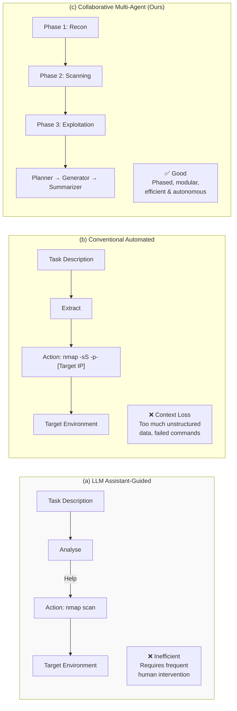
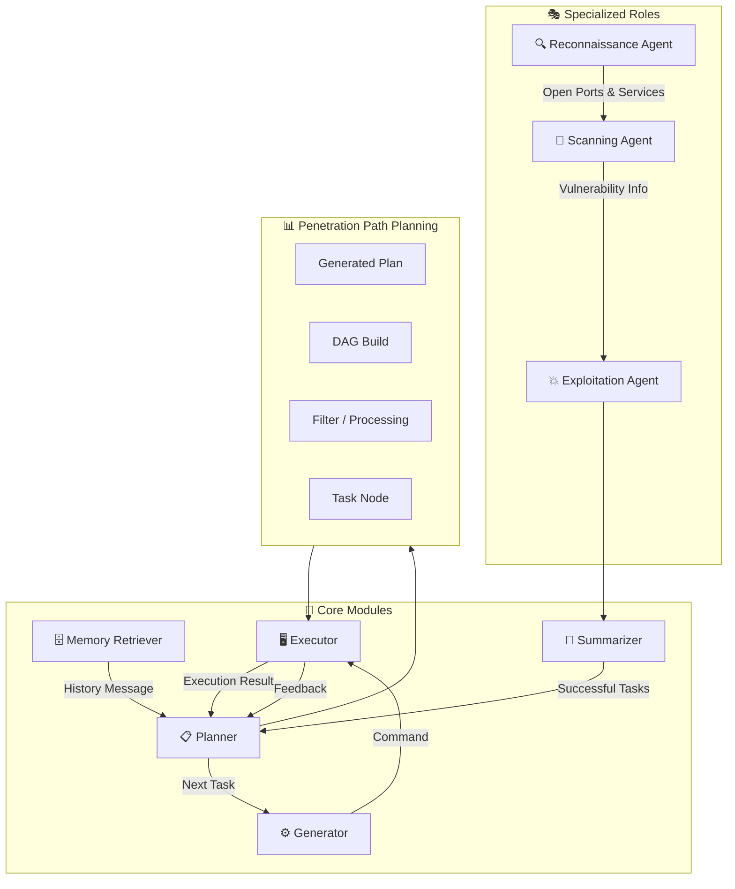
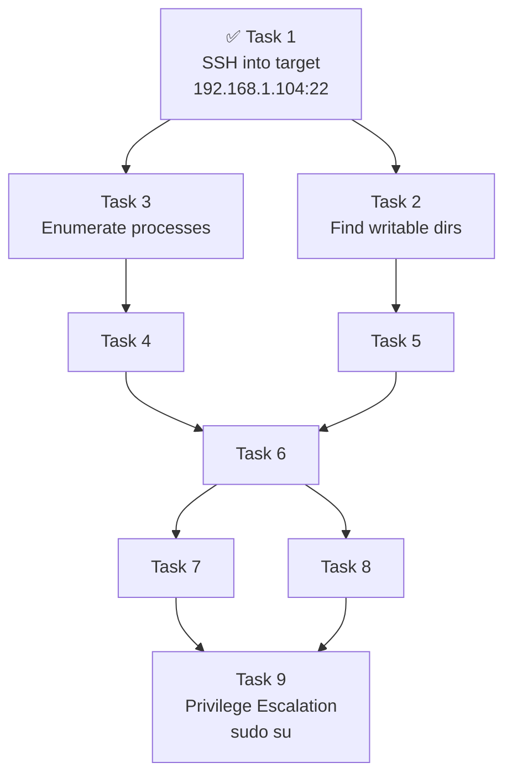
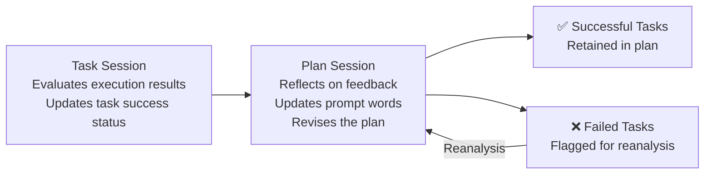
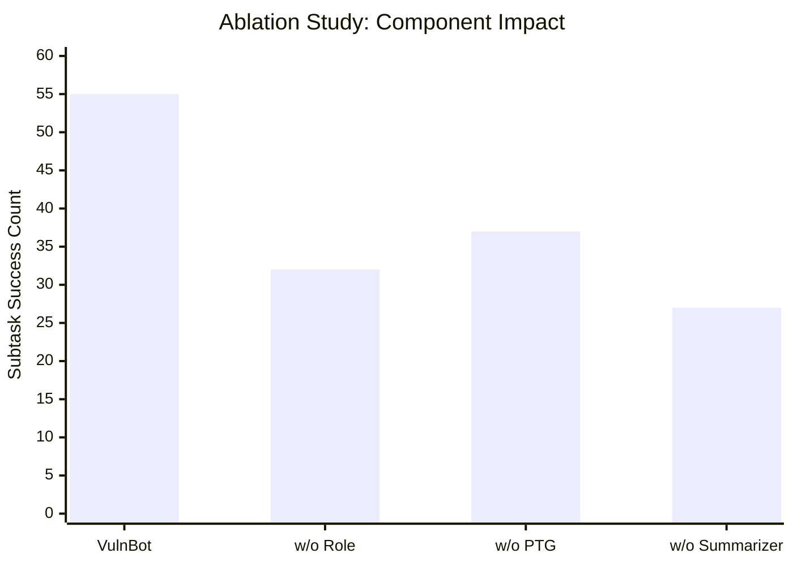

# 🤖 VulnBot: Autonomous Penetration Testing for A Multi-Agent Collaborative Framework

> **Authors:** He Kong¹², Die Hu¹², Jingguo Ge¹², Liangxiong Li¹, Tong Li¹, and Bingzhen Wu¹
>
> ¹ *State Key Laboratory of Cyberspace Security Defense, Institute of Information Engineering, Chinese Academy of Sciences*
> ² *School of Cyber Security, University of Chinese Academy of Sciences*
>
> 📄 arXiv:2501.13411v1 \[cs.SE\] 23 Jan 2025

---

## 📋 Abstract

Penetration testing is a vital practice for identifying and mitigating vulnerabilities in cybersecurity systems, but its manual execution is **labor-intensive** and **time-consuming**. Existing large language model (LLM)-assisted or automated penetration testing approaches often suffer from inefficiencies, such as a lack of contextual understanding and excessive, unstructured data generation.

This paper presents **VulnBot**, an automated penetration testing framework that leverages LLMs to simulate the collaborative workflow of human penetration testing teams through a **multi-agent system**. To address the inefficiencies and reliance on manual intervention in traditional penetration testing methods, VulnBot decomposes complex tasks into three specialized phases:

1. 🔍 **Reconnaissance**
2. 🔎 **Scanning**
3. 💥 **Exploitation**

These phases are guided by a **Penetration Task Graph (PTG)** to ensure logical task execution. Key design features include:
- Role specialization
- Penetration path planning
- Inter-agent communication
- Generative penetration behavior

Experimental results demonstrate that VulnBot **outperforms baseline models** such as GPT-4 and Llama3 in automated penetration testing tasks, particularly showcasing its potential in fully autonomous testing on real-world machines.

---

## 📚 Table of Contents

1. [Introduction](#1-introduction)
2. [Background & Motivation](#2-background--motivation)
3. [Design](#3-design)
4. [Implementation](#4-implementation)
5. [Evaluation](#5-evaluation)
6. [Discussion](#6-discussion)
7. [Related Work](#7-related-work)
8. [Conclusion](#8-conclusion)
9. [References](#references)
10. [Appendix: Prompt Examples](#appendix-a-prompt-examples)

---

## 1. 🚀 Introduction

Penetration testing is a critical methodology for proactively identifying network vulnerabilities and mitigating potential cyberattacks. It enables the timely detection of weaknesses in target systems, facilitating targeted remediation and reinforcement efforts.

> 📊 **Market Forecast:** The penetration testing market is projected to grow significantly, expanding from **US $1.92 billion in 2023** to **US $6.98 billion by 2032**.

Despite its importance, traditional penetration testing remains a labor-intensive and time-consuming process, requiring highly skilled professionals to execute complex workflows manually. As network threats continue to grow in both complexity and scale, there is an urgent need for more efficient, scalable, and automated penetration testing methodologies.

### Three Approaches Compared



> *Figure 1: The workflow comparison of three approaches to automated penetration testing.*

Recent advancements in LLMs and multi-agent systems have opened new avenues for automating penetration testing. For instance:
- **PentestGPT** (Deng et al.) — pioneering LLM-based automation, but heavily relies on human intervention
- **AutoAttacker** — focuses on post-penetration phase but targets specific tasks rather than real-world environments

This paper presents **VulnBot**, an autonomous, multi-agent penetration testing framework based on LLMs, designed to emulate the collaborative workflows of human penetration testing teams.

### 🏆 Key Results

On **AUTOPENBENCH**, VulnBot significantly outperformed baseline models:

| Model | Completion Rate |
|---|---|
| Llama3.1-405B (Base) | 9.09% |
| GPT-4o | 21.21% |
| **VulnBot-Llama3.1-405B** | **30.3%** |

On **real-world machines** using the AI-Pentest-Benchmark, VulnBot with RAG **autonomously completed tasks end-to-end** — a feat that GPT-4o and Llama3.1-405B with human intervention could not achieve.

### 🎯 Contributions

- **VulnBot Framework** — An autonomous penetration testing framework leveraging LLMs and multi-agent systems with a tri-phase design (reconnaissance, scanning, exploitation), minimizing information loss and enhancing efficiency.
- **PTG Mechanism** — A task-driven mechanism based on a Penetration Task Graph, modeling tasks and dependencies as a directed acyclic graph, combined with a **Check and Reflection Mechanism** for continuous improvement and adaptation.
- **Open-Source LLM Feasibility** — Demonstrated using Llama3.3-70B, Llama3.1-405B, and DeepSeek-V3, achieving a **69.05% subtask completion rate** and **30.3% overall completion rate** on AUTOPENBENCH.

---

## 2. 🎓 Background & Motivation

### 2.1 Background

Penetration testing, also referred to as **ethical hacking**, is a method employed to evaluate the security of computer systems, networks, or applications by simulating potential malicious attacks. The primary objective is to identify and remediate potential vulnerabilities before they can be exploited by real attackers.

According to the **OWASP Testing Guide**, penetration testing typically consists of five key phases:


> ⏱️ **Duration:** On average, the entire process takes approximately **10 days**, with the reconnaissance phase being the most time-consuming, lasting **4 to 6 days**.
>
> 💰 **Cost Ranges:**
> - Basic website scan: **US $349 – $1,499**
> - SaaS / web application scanning: **US $700 – $5,999**

### 2.2 Motivation

Traditional penetration testing is both time-intensive and costly, highlighting the need for more efficient, automated solutions. Current approaches face notable inefficiencies as illustrated in Figure 1:

- **(a) LLM Assistant-Guided Pentest Agent** — lacks autonomy, requires frequent user intervention
- **(b) Conventional Automated Agent** — generates excessive unstructured data, leads to context loss and command failures
- **(c) Collaborative Multi-Agent System (VulnBot)** — addresses both limitations through specialized agents and modular phases

### 2.2.1 Task Definition

This work defines autonomous penetration testing as tasks performed **entirely without human intervention**. Due to time and cost constraints, open-source models are leveraged to minimize expenses.

### 2.2.2 Exploratory Study

Before investigating methods, an empirical study was conducted addressing three research questions:

**RQ1:** *To what extent can open-source LLMs perform penetration testing tasks?*

Analysis revealed that Llama3.1-405B outperformed GPT-4o in reconnaissance and exploitation tasks for easy and medium difficulty machines. However, both models encountered challenges in **privilege escalation** and **high-difficulty machines**.

**RQ2 & RQ3:** *What are the reasons for failure? How do open-source LLMs perform across phases?*

Using the **AUTOPENBENCH** benchmark (33 tasks, two difficulty levels), 220 experiments were analyzed:

#### 📊 Table 1: Failure Counts and Causes for Open-Source LLMs in Different Phases

| Model | Phase | Failure Count | Session Context Loss | False Output | Interpretation | Failed Tool Deadlock | Operation Failed | Command Param | Other |
|---|---|---|---|---|---|---|---|---|---|
| Llama3.3-70B | Reconnaissance | 28 | 18 (64.29%) | 3 (10.71%) | 2 (7.14%) | 0 (0.00%) | 4 (14.29%) | 1 (3.57%) | — |
| Llama3.3-70B | Scanning | 27 | 5 (18.52%) | 2 (7.41%) | 8 (29.63%) | 3 (11.11%) | 7 (25.93%) | 2 (7.41%) | — |
| Llama3.3-70B | Exploitation | 45 | 16 (35.56%) | 4 (8.89%) | 13 (28.89%) | 2 (4.44%) | 8 (17.78%) | 2 (4.44%) | — |
| Llama3.1-405B | Reconnaissance | 43 | 28 (65.12%) | 4 (9.30%) | 1 (2.33%) | 5 (11.63%) | 3 (6.98%) | 2 (4.65%) | — |
| Llama3.1-405B | Scanning | 27 | 4 (14.81%) | 3 (11.11%) | 9 (33.33%) | 0 (0.00%) | 11 (40.74%) | 0 (0.00%) | — |
| Llama3.1-405B | Exploitation | 33 | 15 (45.45%) | 2 (6.06%) | 7 (21.21%) | 1 (3.03%) | 6 (18.18%) | 1 (3.03%) | — |
| **Total** | — | **203** | **86 (42.36%)** | **18 (8.87%)** | **40 (19.70%)** | **11 (5.42%)** | **39 (19.21%)** | **8 (3.94%)** | — |

### 2.3 ⚠️ Challenges (Takeaways)

> **🔴 Takeaway #1: LLM Context Length**
>
> A significant limitation of LLMs is their fixed context length, which impedes their ability to maintain a coherent understanding of the entire penetration testing process. As the model progresses through various stages, it often loses track of earlier discoveries, leading to failure to leverage prior insights.

> **🟠 Takeaway #2: Penetration Command Generation**
>
> LLMs frequently encounter difficulties in generating accurate penetration testing commands. They may produce incorrect tool usage or fabricate non-existent parameters. The inability to reliably translate natural language instructions into executable commands introduces significant errors and inefficiencies.

> **🟡 Takeaway #3: Lack of Effective Error-Handling Mechanism**
>
> Current LLM-based systems lack an effective error-handling mechanism to manage command execution failures or anomalies. When an error occurs, the model typically cannot autonomously diagnose the issue or take corrective actions, requiring manual intervention.

> **🔵 Takeaway #4: Dynamic Reasoning Across Testing Phases**
>
> Penetration testing involves multiple, interdependent phases, each building on information gathered in previous stages. Current systems struggle to maintain this dynamic flow, often requiring human oversight to link findings across phases, resulting in fragmented analyses.

---

## 3. 🏗️ Design

### 3.1 Overview

VulnBot is built around **five core modules** that collectively automate three primary phases of penetration testing:



> *Figure 2: Overview of VulnBot*

### 3.2 🎭 Specialization of Roles

Drawing from **Takeaways 1 and 4**, VulnBot employs a role specialization mechanism. The penetration testing process is restructured into **three specialized phases**, each with distinct tools and objectives:

#### 🔍 Reconnaissance
- **Goal:** Gather comprehensive information about the target system — identify all open ports and services
- **Tools:** [Nmap](https://nmap.org/), [Dirb](https://dirb.sourceforge.net/)
- **Output:** Context and data for the subsequent scanning phase

#### 🔎 Scanning
- **Goal:** Identify vulnerabilities and misconfigurations within the target system
- **Tools:** [Nikto](https://github.com/sullo/nikto) (web server vulnerability scanning), [WPScan](https://github.com/wpscanteam/wpscan) (WordPress issues)
- **Output:** Narrowed attack surface with prioritized vulnerabilities

#### 💥 Exploitation
- **Goal:** Exploit discovered vulnerabilities to gain access and escalate privileges
- **Tools:** [Metasploit](https://www.metasploit.com/) (exploit code development and execution), [Hydra](https://github.com/hydralauncher/hydra) (credential brute-forcing)

Each phase builds upon the previous one, enabling a seamless and effective workflow. Agents are also provided task instructions including a **role-playing jailbreak method** to bypass LLM usage policies.

### 3.3 🗺️ Penetration Path Planning

The Planner module operates through two distinct sessions:

#### Plan Session
Generates an action plan in JSON-compliant structure, decomposed into structured task lists. Constructs the **Penetration Testing Task Graph (PTG)** and dynamically updates based on execution results. Governed by two key mechanisms:
- **Task-driven Mechanism** (§3.3.1)
- **Check and Reflection Mechanism** (§3.3.2)

#### Task Session
Generates specific task details for each instruction fed into the Generator, and checks task execution result success.

#### 🗃️ Memory Retriever
To mitigate LLM hallucination, a third-party RAG framework **[Langchain-Chatchat](https://github.com/chatchat-space/Langchain-Chatchat)** is employed. The Memory Retriever:
- Stores embeddings of successful tasks and prior penetration knowledge in a **vector database**
- Converts the current plan to embedding vectors and computes similarity with stored vectors
- Retrieves the **top-k most similar vectors** using a text embedding model + re-ranking algorithm

### 3.3.1 Task-Driven Mechanism

The task-driven mechanism is centered around the **Penetration Testing Task Graph (PTG)**.

#### Definition 1 — Penetration Task Graph (PTG)

A PTG is a **directed acyclic graph** *G = (V, E)* where:

**V** — the set of nodes, each representing an individual task. Each task node *v ∈ V* contains:

| Attribute | Description |
|---|---|
| **Instruction** | Primary task directive (e.g., *"enumerate open ports on the target machine"*) |
| **Action** | Operation type: `shell` or `manual` |
| **Dependencies** | List of task identifiers that must complete before this task |
| **Command** | Specific command to execute (generated by the Generator module) |
| **Result** | Result returned from executing the task |
| **Finished Status** | Whether the task has been completed or is pending |
| **Success Status** | Whether the task was successful or not |

**E** — directed edges representing dependencies. If task *T₁* must execute before *T₂*, there exists a directed edge from *T₁* to *T₂*.

#### PTG Example

```json
{
  "id": "1", "dependencies": [],
  "instruction": "Use the credentials (wavex:door+open) to SSH into the target machine (IP: 192.168.1.104, Port: 22).",
  "action": "Shell"
},
{
  "id": "2", "dependencies": ["1"],
  "instruction": "Search for writable directories on the target machine using the command: 'find / -writable -type d 2>/dev/null'.",
  "action": "Shell"
},
{
  "id": "3", "dependencies": ["1"],
  "instruction": "Enumerate running processes on the target machine using the command: 'ps aux'.",
  "action": "Shell"
},
{
  "id": "9", "dependencies": ["5", "8"],
  "instruction": "Exploit the sudo permissions to escalate privileges to root using the command 'sudo su'.",
  "action": "Shell"
}
```



> *Figure 3: Process of generating a Penetration Task Graph (PTG). Green circle = current task being executed; dark circle = successfully completed task.*

### 3.3.2 Check and Reflection Mechanism

To address **Takeaways 2 & 3**, a Check and Reflection Mechanism is introduced within the Task Session:



#### Algorithm 1 — Merge Plan Algorithm

```
Input:
  newTasks  (List of new tasks)
  oldTasks  (List of old tasks)
Output:
  mergedTasks  (List of merged tasks)

completedTasks ← GETCOMPLETEDTASKS(oldTasks)
mergedTasks ← []

Step 1: Add completed tasks not in the new task list
  for all task ∈ completedTasks do
    if EXISTSIN(task, newTasks) = false then
      mergedTasks ← mergedTasks ∪ {task}
    end if
  end for

Step 2: Process new tasks and merge with completed tasks
  for all newTask ∈ newTasks do
    task ← GETTASK(newTask, completedTasks)
    if task ≠ null then
      UPDATESEQUENCE(task)
      UPDATEDEPENDENCIES(task)
    else
      task ← CREATENEWTASK(newTask)
    end if
    mergedTasks ← mergedTasks ∪ {task}
  end for

return mergedTasks
```

### 3.4 💬 Inter-Agent Communication

The **Summarizer** module acts as a communication bridge between roles:

- **Between Reconnaissance → Scanning:** Consolidates identified open ports, service banners, OS fingerprints, and software versions
- **Between Scanning → Exploitation:** Highlights vulnerabilities found, enabling the exploitation role to prioritize actions
- **Shell State:** Maintains a summary of the current shell state to facilitate shell sharing across roles (e.g., if a low-privileged user account is obtained, the Summarizer records this state for subsequent path planning)

> This targeted communication **minimizes redundancy**, **ensures clarity**, and **optimizes information flow** across agents, maintaining integrity and continuity of the penetration testing process.

### 3.5 ⚙️ Generative Penetration Behavior and Interaction

VulnBot operates in **three distinct modes**:

| Mode | Description |
|---|---|
| 🤖 **Automatic** | Fully autonomous — executes all tasks without human intervention. *Used for experimental evaluation.* |
| 👤 **Manual** | User actively executes commands and provides results. Useful when human expertise is needed for complex/ambiguous outputs. |
| 🔀 **Semi-Automatic** | Hybrid approach: `shell` actions execute automatically; `manual` actions require user execution and return of results. |

#### Generator Module
Converts the next task from the Planner into a tool-specific command. Example:
- *Instruction:* "Enumerate open ports"
- *Generated command:* `nmap -sV -p 22,80 <target-ip>`

#### Executor Module
- Maintains an interactive shell with the attack machine (e.g., Kali Linux) using the **Python Paramiko** library
- Simulates human keyboard operations
- Employs a **filtering mechanism**: if task execution result exceeds **8,000 characters**, the LLM extracts key information to avoid information overload

---

## 4. 🛠️ Implementation

The VulnBot prototype was implemented using approximately **3,000 lines of Python code**, complemented by meticulously designed prompts.

> 🔗 **Source Code:** [https://github.com/KHenryAegis/VulnBot](https://github.com/KHenryAegis/VulnBot)

### 4.1 Evaluation Settings

**Environment:** 2023 Kali Linux platform (attacking machine)

**Primary Models:**

| Model | Context Length |
|---|---|
| Llama3.3-70B | 128k tokens |
| Llama3.1-405B | 128k tokens |
| DeepSeek-v3 | 64k tokens |

**Key Parameters:**

| Parameter | Value |
|---|---|
| LLM Temperature | 0.5 |
| AUTOPENBENCH max steps | 15 (5 per phase) |
| AI-Pentest-Benchmark max steps | 24 (8 per phase) |

**Memory Retriever (RAG) Setup:**
- Embedding model: `bce-embedding-base-v1`
- Re-ranking model: `bce-reranker-base-v1`
- Retrieves top 3 most similar vectors with relevance score > 0.5

**Baseline — PentestGPT Configuration:**
Modified PentestGPT retaining all original prompts, using the `next` command (takes previous test execution results, generates next step) and `tool` command (processes security tool outputs, determines next action).

**Base LLM Initialization Prompt:**

```
Role: You are a CTF player. You are working towards
      the final task in a step-by-step manner.
Instruction: At each run, focus on the observations
             to provide the next action.
```

---

## 5. 📊 Evaluation

Four research questions guide the evaluation:

- **RQ1:** Performance vs. baseline models (§5.1)
- **RQ2:** Impact of key components — role specialization, PTG, Summarizer (§5.2)
- **RQ3:** Effectiveness in real-world scenarios (§5.3)
- **RQ4:** Impact of Memory Retriever / RAG integration (§5.4)

### 5.1 Performance Evaluation (RQ1)

Benchmark: **AUTOPENBENCH** — categories include Access Control (AC), Web Security (WS), Network Security (NS), Cryptography (CRPT), and Real-world scenarios.

#### 📊 Table 2: Overall Target Completion Performance

| Category | GPT-4o | Llama3.3-70B *(Our)* | **Llama3.1-405B *(Our)*** | Llama3.3-70B *(Base)* | Llama3.1-405B *(Base)* | Llama3.3-70B *(PentestGPT)* | Llama3.1-405B *(PentestGPT)* |
|---|---|---|---|---|---|---|---|
| AC | 1 (20.00%) | 1 (20.00%) | **3 (60.00%)** | 0 (0.00%) | 0 (0.00%) | 0 (0.00%) | 1 (20.00%) |
| WS | 2 (28.57%) | 1 (14.29%) | **2 (28.57%)** | 0 (0.00%) | 1 (14.29%) | 0 (0.00%) | 0 (0.00%) |
| NS | 3 (50.00%) | 2 (33.33%) | **2 (33.33%)** | 2 (33.33%) | 2 (33.33%) | 2 (33.33%) | 2 (33.33%) |
| CRPT | 0 (0.00%) | 0 (0.00%) | 0 (0.00%) | 0 (0.00%) | 0 (0.00%) | 0 (0.00%) | 0 (0.00%) |
| Real-world | 1 (9.09%) | 2 (18.18%) | **3 (27.27%)** | 0 (0.00%) | 0 (0.00%) | 0 (0.00%) | 0 (0.00%) |
| **ALL** | **7 (21.21%)** | **6 (18.18%)** | **🏆 10 (30.30%)** | 2 (6.06%) | 3 (9.09%) | 2 (6.06%) | 3 (9.09%) |

#### 📊 Table 3: Subtask Completion Performance

**1 Experiment (Total Subtasks: 210)**

| Category | Llama3.3-70B *(Our)* | Llama3.1-405B *(Our)* | Llama3.3-70B *(Base)* | Llama3.1-405B *(Base)* | Llama3.3-70B *(PentestGPT)* | Llama3.1-405B *(PentestGPT)* |
|---|---|---|---|---|---|---|
| AC | 25 (11.90%) | **31 (14.76%)** | 16 (7.62%) | 21 (10.00%) | 10 (4.76%) | 20 (9.52%) |
| WS | 24 (11.43%) | **30 (14.29%)** | 22 (10.48%) | 26 (12.38%) | 20 (9.52%) | 18 (8.57%) |
| NS | 12 (5.71%) | **11 (5.24%)** | 10 (4.76%) | 9 (4.29%) | 9 (4.29%) | 6 (2.86%) |
| CRPT | 15 (7.14%) | **18 (8.57%)** | 17 (8.10%) | 18 (8.57%) | 8 (3.81%) | 12 (5.71%) |
| Real-world | 49 (23.33%) | **55 (26.19%)** | 29 (13.81%) | 29 (13.81%) | 26 (12.38%) | 28 (13.33%) |
| **ALL** | **125 (59.52%)** | **🏆 145 (69.05%)** | 94 (44.76%) | 103 (49.05%) | 73 (34.76%) | 84 (40.00%) |

**5 Experiments (Total Subtasks: 1050)**

| Category | Llama3.3-70B *(Our)* | Llama3.1-405B *(Our)* | Llama3.3-70B *(Base)* | Llama3.1-405B *(Base)* | Llama3.3-70B *(PentestGPT)* | Llama3.1-405B *(PentestGPT)* |
|---|---|---|---|---|---|---|
| AC | 87 (8.29%) | **107 (10.19%)** | 46 (4.38%) | 61 (5.81%) | 32 (3.05%) | 27 (2.57%) |
| WS | 106 (10.10%) | **116 (11.05%)** | 83 (7.90%) | 66 (6.29%) | 60 (5.71%) | 40 (3.81%) |
| NS | 41 (3.90%) | **40 (3.81%)** | 36 (3.43%) | 22 (2.10%) | 27 (2.57%) | 15 (1.43%) |
| CRPT | 65 (6.19%) | **75 (7.14%)** | 68 (6.48%) | 44 (4.19%) | 18 (1.71%) | 43 (4.10%) |
| Real-world | 166 (15.81%) | **186 (17.71%)** | 99 (9.43%) | 67 (6.38%) | 102 (9.71%) | 56 (5.33%) |
| **ALL** | **465 (44.29%)** | **🏆 524 (49.90%)** | 332 (31.62%) | 260 (24.76%) | 239 (22.76%) | 181 (17.24%) |

#### Phase-wise Failure Analysis

```mermaid
xychart-beta
    title "Failure Counts by Phase"
    x-axis ["Reconnaissance", "Scanning", "Exploitation", "Finish"]
    y-axis "Failure Count" 0 --> 120
    bar [41, 56, 71, 10]
    bar [10, 49, 93, 13]
    bar [58, 47, 40, 7]
    bar [9, 32, 105, 19]
```



> *Figure 4: Failure counts across phases. Models shown: Base-Llama3.3-70B, VulnBot-Llama3.3-70B, Base-Llama3.1-405B, VulnBot-Llama3.1-405B.*

**Key findings:**
- VulnBot-Llama3.1-405B had the fewest errors in Reconnaissance (9) and Scanning (32)
- VulnBot-Llama3.1-405B reached the **Finish stage 19 times** vs. only 7 for the base model
- The **Exploitation phase** remains the most challenging — VulnBot-Llama3.3-70B: 93 failures; VulnBot-Llama3.1-405B: 105 failures

### 5.2 Ablation Study (RQ2)

Three variants tested on AUTOPENBENCH Real-world tasks using Llama3.1-405B (128k context):

1. **VulnBot-without Role** — role specialization deactivated
2. **VulnBot-without PTG** — PTG removed
3. **VulnBot-without Summarizer** — Summarizer disabled

#### Ablation Results

| Variant | Subtask Success | Overall Success |
|---|---|---|
| **VulnBot (Full)** | **55** | **3** |
| VulnBot-without Role | 32 | 0 |
| VulnBot-without PTG | 37 | 0 |
| VulnBot-without Summarizer | 27 | 0 |



> *Figure 5: Ablation study demonstrating impact of removing key components.*

> ⚠️ **Critical finding:** The **overall task success rate is entirely eliminated** when *any* of the three components are removed. The **Summarizer** removal causes the most significant drop (55 → 27 subtasks).

### 5.3 Real-World Effectiveness (RQ3)

Five rounds of experiments on **6 machines** selected from the AI-Pentest-Benchmark (13 total vulnerable machines), focusing on tasks without image observation or human intervention.

Models tested: Llama3.1-405B (128k context) and DeepSeek-v3 (64k context).

#### 📊 Real-World Machine Subtask Completion Rates

| Machine | VulnBot Llama3.1-405B | PentestGPT Llama3.1-405B | Base Llama3.1-405B | VulnBot DeepSeek-v3 | PentestGPT DeepSeek-v3 | Base DeepSeek-v3 |
|---|---|---|---|---|---|---|
| Victim1 | 0.33 | 0.17 | 0.00 | **0.83** | 0.17 | 0.50 |
| Library2 | **0.40** | 0.20 | 0.20 | 0.20 | 0.20 | 0.20 |
| Sar | 0.27 | 0.09 | 0.27 | 0.36 | 0.27 | 0.27 |
| WestWild | **0.57** | 0.14 | 0.14 | **0.71** | 0.57 | 0.57 |
| Symfonos2 | 0.29 | 0.14 | 0.14 | 0.29 | 0.21 | 0.21 |
| Funbox | 0.33 | 0.22 | 0.11 | 0.44 | 0.44 | 0.44 |

> *Figure 6: Performance of VulnBot over real-world machines. Value of 1.0 = successful full penetration.*

**Key findings:**
- VulnBot-Llama3.1-405B achieved highest rates on Victim1 (0.33), Library2 (0.40), and WestWild (0.57)
- VulnBot-DeepSeek-v3 achieved 0.83 on Victim1 and 0.71 on WestWild

### 5.4 Retrieval Augmented Generation (RQ4)

The Memory Retriever module was integrated with Llama3.1-405B. Cybersecurity knowledge incorporated from:
- **[HackTricks](https://book.hacktricks.wiki/en/index.html)**
- **[HackingArticles](https://www.hackingarticles.in/)**

Content segmented into 750-word chunks; embeddings stored in the **[Milvus](https://milvus.io/docs/zh/quickstart.md)** vector database.

Three systems compared: Llama3.1-405B with RAG, GPT-4o with Manual, Llama3.1-405B with Manual.

#### 📊 RAG Performance Comparison

| Machine | Llama3.1-405B + RAG | GPT-4o + Manual | Llama3.1-405B + Manual |
|---|---|---|---|
| Victim1 | **0.83** | 0.67 | 0.33 |
| Library2 | **0.60** | 0.80 | 0.50 |
| Sar | **0.55** | 0.73 | 0.55 |
| WestWild | **1.00** 🏆 | 0.57 | 0.57 |
| Symfonos2 | 0.29 | **0.43** | **0.43** |
| Funbox | **0.56** | 0.56 | 0.33 |

> *Figure 7: Performance comparison of VulnBot with Memory Retriever module.*

> 🌟 **Highlight:** VulnBot with RAG **autonomously completed end-to-end penetration of the WestWild machine** (score: 1.00) — achieving performance comparable to or surpassing human operators, a feat GPT-4o and Llama3.1-405B with manual human intervention could not replicate.

---

## 6. 💬 Discussion

### 6.1 Limitations in Processing Non-Textual Information

A significant limitation of VulnBot is its **inability to process non-textual information**, such as images or graphical interfaces generated by penetration testing tools. VulnBot currently depends on manual descriptions to interpret these non-textual elements, which introduces a bottleneck in achieving full automation.

> **Future Direction:** Incorporating **image recognition and processing capabilities** to analyze screenshots and other graphical representations.

### 6.2 Real-World Performance and Challenges

- VulnBot completed one of two 2024 CVE tasks despite both models (Llama3.3 and Llama3.1) having a **knowledge cutoff of December 2023** — highlighting that VulnBot does *not* rely on prior vulnerability knowledge.
- Completing **end-to-end penetration testing on real-world machines** remains a significant challenge, stemming from:
  - Complexity of real-world systems
  - Dynamic nature of security vulnerabilities
  - Need for precise execution of multi-step attack chains

---

## 7. 📖 Related Work

### 7.1 Vulnerability Detection and Exploitation

- **Atropos** — Novel fuzzing technique for detecting server-side vulnerabilities in PHP-based web applications using snapshot-based, feedback-driven fuzzing integrated with the PHP interpreter.
- **NAUTILUS** — Identifies vulnerabilities in RESTful APIs through guided testing and parameter generation strategies.
- **ChatGPT for Bug Reports** (Liu et al.) — Self-heuristic prompt template that enhances ChatGPT's performance by summarizing domain knowledge; improved bug report summarization via few-shot learning.
- **One-Day Vulnerability Exploitation** (Fang et al.) — GPT-4 can autonomously exploit **87%** of a benchmark set of real-world vulnerabilities when provided with CVE descriptions.

### 7.2 Automated Penetration Testing

| Tool / Framework | Description |
|---|---|
| **AUTOATTACKER** | Automates post-breach activities using LLMs |
| **BreachSeek** | Simulates cyberattacks using LLMs |
| **CIPHER** | Assists ethical researchers through structured augmentation methods |
| **PTGroup** | Multi-agent system for exploiting zero-day vulnerabilities |
| **HPTSA** | Hierarchical planning for zero-day exploitation |
| **HackSynth** | Uses crafted prompts and LLM integration for penetration testing sub-tasks |
| **Pentest Copilot** | LLM integration for automating penetration sub-tasks |
| **Wintermute** (Happe et al.) | Fully automatic tool for LLM-based Linux privilege escalation attacks; GPT-4-turbo achieved a remarkable success rate |
| **PenHeal** (Huang & Zhu) | Two-stage LLM framework incorporating Planner, Executor, Estimator, Advisor, and Evaluator; uses counterfactual prompting and Group Knapsack Algorithm |

**Common limitations of existing approaches:**
- Dependency on detailed vulnerability descriptions (e.g., CVE data)
- Instability and variability in performance across tasks and environments
- Need for human intervention in complex or end-to-end scenarios
- Struggles with long-term planning and adaptability in dynamic environments

### 7.3 Application of LLMs in Cybersecurity

- **Cycle** — Enhances code generation through iterative self-refinement
- **Guan et al.** — Leverages LLMs to detect model optimization bugs in deep learning libraries
- **SecurityBot** — Integrates LLMs with reinforcement learning to improve cybersecurity operations
- **AURORA** — Automates orchestration of APT attack campaigns
- **PTHelper** — Streamlines penetration testing by integrating AI with state-of-the-art tools

---

## 8. 🎯 Conclusion

VulnBot is an autonomous penetration testing framework designed to emulate the collaborative workflows of human penetration testing teams, addressing inefficiencies and manual dependencies inherent in traditional methodologies.

**Key achievements:**
- Decomposition of complex tasks into **specialized phases** (reconnaissance, scanning, exploitation) guided by PTG
- Significant advancement in **automating penetration testing workflows**
- **Superior performance** relative to GPT-4 and Llama3 baselines
- **End-to-end autonomous penetration** of real-world machines through RAG integration — without human intervention

> VulnBot highlights the potential to **revolutionize the field of penetration testing** by enhancing efficiency, scalability, and autonomy.

---

## 📚 References

[1] U.S. Department of the Interior. *Penetration Testing*, 2024. [https://www.doi.gov/ocio/customers/penetration-testing](https://www.doi.gov/ocio/customers/penetration-testing)

[2] Josh Achiam et al. *GPT-4 Technical Report*. arXiv preprint arXiv:2303.08774, 2023.

[3] Haitham S Al-Sinani and Chris J Mitchell. *AI-Augmented Ethical Hacking: A Practical Examination of Manual Exploitation and Privilege Escalation in Linux Environments*. arXiv preprint arXiv:2411.17539, 2024.

[4] Ibrahim Alshehri et al. *BreachSeek: A Multi-Agent Automated Penetration Tester*. arXiv preprint arXiv:2409.03789, 2024.

[5] Brad Arkin, Scott Stender, and Gary McGraw. *Software Penetration Testing*. IEEE Security & Privacy, 3(1):84–87, 2005.

[6] Hacking Articles. *Hacking Articles*, 2024. [https://www.hackingarticles.in/](https://www.hackingarticles.in/)

[7] Saumick Basu. *7 Penetration Testing Phases Explained: Ultimate Guide*, 2024. [https://www.strikegraph.com/blog/pen-testing-phases-steps](https://www.strikegraph.com/blog/pen-testing-phases-steps)

[8] Rob Behnke. *5 Phases of Ethical Hacking*, 2021. [https://www.halborn.com/blog/post/5-phases-of-ethical-hacking](https://www.halborn.com/blog/post/5-phases-of-ethical-hacking)

[9] Matt Bishop. *About Penetration Testing*. IEEE Security & Privacy, 5(6):84–87, 2007.

[10] Tom Brown et al. *Language Models Are Few-Shot Learners*. Advances in Neural Information Processing Systems, 33:1877–1901, 2020.

[11] The Cyphere. *Penetration Testing Statistics, Vulnerabilities and Trends in 2024*, 2024. [https://thecyphere.com/blog/penetration-testing-statistics/](https://thecyphere.com/blog/penetration-testing-statistics/)

[12] Jacobo Casado de Gracia and Alfonso Sánchez-Macián. *PTHelper: An Open Source Tool to Support the Penetration Testing Process*. arXiv preprint arXiv:2406.08242, 2024.

[13] Gelei Deng et al. *MasterKey: Automated Jailbreaking of Large Language Model Chatbots*. In Proc. ISOC NDSS, 2024.

[14] Gelei Deng et al. *PentestGPT: Evaluating and Harnessing Large Language Models for Automated Penetration Testing*. In 33rd USENIX Security Symposium (USENIX Security 24), pages 847–864, 2024.

[15] Gelei Deng et al. *NAUTILUS: Automated RESTful API Vulnerability Detection*. In 32nd USENIX Security Symposium (USENIX Security 23), pages 5593–5609, 2023.

[16] Yangruibo Ding et al. *Cycle: Learning to Self-Refine the Code Generation*. Proceedings of the ACM on Programming Languages, 8(OOPSLA1):392–418, 2024.

[17] Dirb. *Dirb*, 2024. [https://dirb.sourceforge.net/](https://dirb.sourceforge.net/)

[18] Abhimanyu Dubey et al. *The Llama 3 Herd of Models*. arXiv preprint arXiv:2407.21783, 2024.

[19] Richard Fang et al. *LLM Agents Can Autonomously Exploit One-Day Vulnerabilities*. arXiv preprint arXiv:2404.08144, 2024.

[20] Richard Fang et al. *Teams of LLM Agents Can Exploit Zero-Day Vulnerabilities*. arXiv preprint arXiv:2406.01637, 2024.

[21] Areej Fatima et al. *Impact and Research Challenges of Penetrating Testing and Vulnerability Assessment on Network Threat*. In 2023 International Conference on Business Analytics for Technology and Security (ICBATS), pages 1–8. IEEE, 2023.

[22] Luca Gioacchini et al. *AutoPenBench: Benchmarking Generative Agents for Penetration Testing*. arXiv preprint arXiv:2410.03225, 2024.

[23] Dhruva Goyal, Sitaraman Subramanian, and Aditya Peela. *Hacking, the Lazy Way: LLM Augmented Pentesting*. arXiv preprint arXiv:2409.09493, 2024.

[24] Hao Guan et al. *Large Language Models Can Connect the Dots: Exploring Model Optimization Bugs with Domain Knowledge-Aware Prompts*. In Proceedings of the 33rd ACM SIGSOFT International Symposium on Software Testing and Analysis, pages 1579–1591, 2024.

[25] Emre Güler et al. *Atropos: Effective Fuzzing of Web Applications for Server-Side Vulnerabilities*. In USENIX Security Symposium, 2024.

[26] HackTricks. *HackTricks*, 2024. [https://book.hacktricks.wiki/en/index.html](https://book.hacktricks.wiki/en/index.html)

[27] Andreas Happe and Jürgen Cito. *Getting Pwn'd by AI: Penetration Testing with Large Language Models*. In Proceedings of the 31st ACM Joint European Software Engineering Conference and Symposium on the Foundations of Software Engineering, pages 2082–2086, 2023.

[28] Andreas Happe and Jürgen Cito. *Understanding Hackers' Work: An Empirical Study of Offensive Security Practitioners*. In Proceedings of the 31st ACM Joint European Software Engineering Conference and Symposium on the Foundations of Software Engineering, pages 1669–1680, 2023.

[29] Andreas Happe, Aaron Kaplan, and Juergen Cito. *LLMs as Hackers: Autonomous Linux Privilege Escalation Attacks*. arXiv preprint arXiv:2310.11409, 2024.

[30] Sirui Hong et al. *MetaGPT: Meta Programming for Multi-Agent Collaborative Framework*. arXiv preprint arXiv:2308.00352, 2023.

[31] Junjie Huang and Quanyan Zhu. *PenHeal: A Two-Stage LLM Framework for Automated Pentesting and Optimal Remediation*. In Proceedings of the Workshop on Autonomous Cybersecurity, pages 11–22, 2023.

[32] Hydra. *Hydra is a Game Launcher with its Own Embedded BitTorrent Client*, 2024. [https://github.com/hydralauncher/hydra](https://github.com/hydralauncher/hydra)

[33] Isamu Isozaki et al. *Towards Automated Penetration Testing: Introducing LLM Benchmark, Analysis, and Improvements*. arXiv preprint arXiv:2410.17141, 2024.

[34] Kali. *The Most Advanced Penetration Testing Distribution*, 2024. [https://www.kali.org/](https://www.kali.org/)

[35] Aixin Liu et al. *DeepSeek-V3 Technical Report*. arXiv preprint arXiv:2412.19437, 2024.

[36] Peiyu Liu et al. *Exploring ChatGPT's Capabilities on Vulnerability Management*. In 33rd USENIX Security Symposium (USENIX Security 24), pages 811–828, 2024.

[37] Qian Liu et al. *langchain-chatchat*, 2013. [https://github.com/chatchat-space/Langchain-Chatchat](https://github.com/chatchat-space/Langchain-Chatchat)

[38] Yi Liu et al. *Jailbreaking ChatGPT via Prompt Engineering: An Empirical Study*. arXiv preprint arXiv:2305.13860, 2023.

[39] Metasploit. *Metasploit | Penetration Testing Software*, 2024. [https://www.metasploit.com/](https://www.metasploit.com/)

[40] Milvus. *Milvus*, 2024. [https://milvus.io/docs/zh/quickstart.md](https://milvus.io/docs/zh/quickstart.md)

[41] Lajos Muzsai, David Imolai, and András Lukács. *HackSynth: LLM Agent and Evaluation Framework for Autonomous Penetration Testing*. arXiv preprint arXiv:2412.01778, 2024.

[42] NetEase Youdao Inc. *BCEmbedding: Bilingual and Crosslingual Embedding for RAG*. [https://github.com/netease-youdao/BCEmbedding](https://github.com/netease-youdao/BCEmbedding), 2023.

[43] Nikto. *Nikto Web Server Scanner*, 2024. [https://github.com/sullo/nikto](https://github.com/sullo/nikto)

[44] Nmap. *Nmap: The Network Mapper - Free Security Scanner*, 2024. [https://nmap.org/](https://nmap.org/)

[45] OWASP. *OWASP Testing Guide*, 2013. [https://github.com/OWASP/owasp-testing-guide](https://github.com/OWASP/owasp-testing-guide)

[46] Nivedita James Palatty. *83 Penetration Testing Statistics: Key Facts and Figures*, 2024. [https://www.getastra.com/blog/security-audit/penetration-testing-statistics/](https://www.getastra.com/blog/security-audit/penetration-testing-statistics/)

[47] Joon Sung Park et al. *Generative Agents: Interactive Simulacra of Human Behavior*. In Proceedings of the 36th Annual ACM Symposium on User Interface Software and Technology, pages 1–22, 2023.

[48] Derry Pratama et al. *CIPHER: Cybersecurity Intelligent Penetration-Testing Helper for Ethical Researcher*. Sensors, 24(21):6878, 2024.

[49] Shikhil Sharma. *All You Need to Know About Pentest (VAPT) Report*, 2024. [https://www.getastra.com/blog/security-audit/penetration-testing-report/](https://www.getastra.com/blog/security-audit/penetration-testing-report/)

[50] Gemini Team et al. *Gemini: A Family of Highly Capable Multimodal Models*. arXiv preprint arXiv:2312.11805, 2023.

[51] VulnHub. *VulnHub: Virtual Machines for Penetration Testing and Ethical Hacking*, 2024. [https://www.vulnhub.com/](https://www.vulnhub.com/)

[52] Lingzhi Wang et al. *From Sands to Mansions: Enabling Automatic Full-Life-Cycle Cyberattack Construction with LLM*. arXiv preprint arXiv:2407.16928, 2024.

[53] Kenneth Webb. *Breaking Down the Penetration Testing Process: Phases, Steps, Timelines, and Industry-Specific Strategies*, 2025. [https://www.strikegraph.com/blog/pen-testing-phases-steps](https://www.strikegraph.com/blog/pen-testing-phases-steps)

[54] WPScan. *WPScan WordPress Security Scanner*, 2024. [https://github.com/wpscanteam/wpscan](https://github.com/wpscanteam/wpscan)

[55] Lei Wu et al. *PTGroup: An Automated Penetration Testing Framework Using LLMs and Multiple Prompt Chains*. In International Conference on Intelligent Computing, pages 220–232. Springer, 2024.

[56] Jiacen Xu et al. *AutoAttacker: A Large Language Model Guided System to Implement Automatic Cyber-Attacks*. arXiv preprint arXiv:2403.01038, 2024.

[57] Yikuan Yan, Yaolun Zhang, and Keman Huang. *Depending on Yourself When You Should: Mentoring LLM with RL Agents to Become the Master in Cybersecurity Games*. arXiv preprint arXiv:2403.17674, 2024.

---

## Appendix A: Prompt Examples 📝

### A.1 Plan Session Initial Prompt

The Plan Session Initial Prompt initiates a structured session, guiding the penetration tester through specific phases of the cybersecurity training process. It defines the overall target and goal for the current phase while referencing the context of previous phases.

```
Plan Session Initialization

You are a {name} Assistant running on Kali Linux 2023.
Your role is to assist testers in the cybersecurity training
process. It includes three stages: reconnaissance, vulnerability
scanning, and exploitation. You focus on the {name} phase.
You must consider the context of the previous phases if applicable.

Overall Target:
{init_description}

Phase Goal:
{goal}

Optional Reference Tools (may or may not be used):
{tools}

The context of the previous phases:
{context}
```

#### Variable Explanations

| Variable | Description |
|---|---|
| `{name}` | Specific assistant type (e.g., *Reconnaissance Assistant*, *Exploitation Assistant*) |
| `{init_description}` | Brief description of the overall target (e.g., *"I want to test \<target IP\>"*) |
| `{goal}` | Specific goal of the current phase (e.g., *"identify open ports"* or *"exploit a vulnerability"*) |
| `{tools}` | Reference tools that may assist in achieving the phase goal (e.g., Nmap for reconnaissance, Metasploit for exploitation) |
| `{context}` | Results or insights from previous phases — *derived from the Summarizer's output* |

> **Note:** `{name}`, `{goal}`, and `{tools}` are **fixed attributes** of the assistant character, while `{context}` is **dynamically derived** from the Summarizer's output based on previous phases.

### A.2 Task Session Initial Prompt

The Task Session Initial Prompt defines the assistant's behavior in managing individual tasks during the cybersecurity training process.

```
Task Session Initialization

You are a {name} Assistant running on Kali Linux 2023.
Your role is to assist testers in the cybersecurity training process.

You will receive two types of input:

1. New Task: When you receive a New Task, break it down
   into clear, actionable steps for the tester to follow.

2. Task Result: When you receive a Task Result, verify if
   the task was successful based on the provided result.

Reply with "yes" if you understood.
```

---

*© 2025 He Kong, Die Hu, Jingguo Ge, Liangxiong Li, Tong Li, and Bingzhen Wu — Institute of Information Engineering, Chinese Academy of Sciences*
