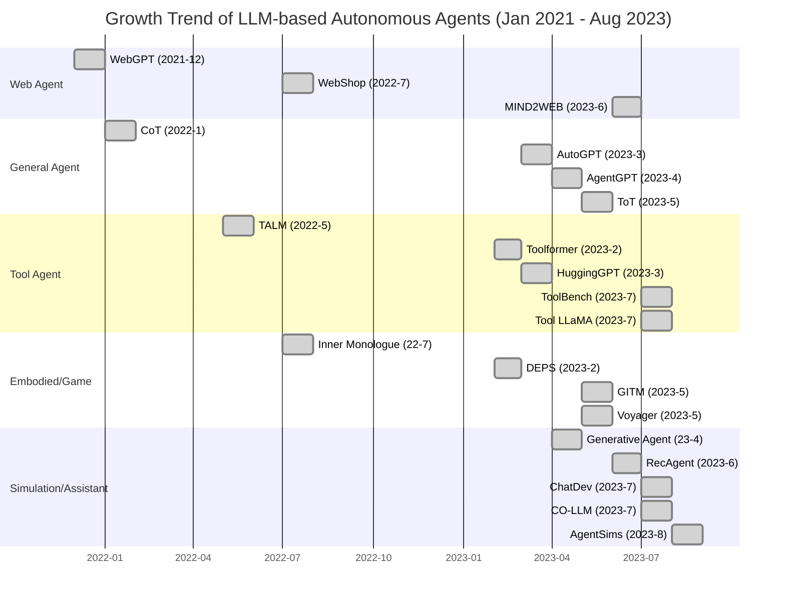

# A Survey on Large Language Model based Autonomous Agents

**Authors:** Lei Wang, Chen Ma\*, Xueyang Feng\*, Zeyu Zhang, Hao Yang, Jingsen Zhang, Zhi-Yuan Chen, Jiakai Tang, Xu Chen(✉), Yankai Lin(✉), Wayne Xin Zhao, Zhewei Wei, Ji-Rong Wen

**Affiliations:** Gaoling School of Artificial Intelligence, Renmin University of China, Beijing, 100872, China

*Front. Comput. Sci., 2025, 0(0): 1-42*  
*https://doi.org/10.1007/s11704-024-40231-1*  
*arXiv:2308.11432v7 [cs.AI] 2 Mar 2025*

---

## 📑 Table of Contents

- [Abstract](#abstract)
- [1. Introduction](#1-introduction)
- [2. LLM-based Autonomous Agent Construction](#2-llm-based-autonomous-agent-construction)
  - [2.1 Agent Architecture Design](#21-agent-architecture-design)
  - [2.2 Agent Capability Acquisition](#22-agent-capability-acquisition)
- [3. LLM-based Autonomous Agent Application](#3-llm-based-autonomous-agent-application)
- [4. LLM-based Autonomous Agent Evaluation](#4-llm-based-autonomous-agent-evaluation)
- [5. Related Surveys](#5-related-surveys)
- [6. Challenges](#6-challenges)
- [7. Conclusion](#7-conclusion)
- [References & Biographies](#references--biographies)

---

## 🚀 Abstract

Autonomous agents have long been a research focus in academic and industry communities. Previous research often focuses on training agents with limited knowledge within isolated environments, which diverges significantly from human learning processes, and makes the agents hard to achieve human-like decisions. 

Recently, through the acquisition of vast amounts of web knowledge, large language models (LLMs) have shown potential in human-level intelligence, leading to a surge in research on LLM-based autonomous agents. 

In this paper, we present a comprehensive survey of these studies, delivering a systematic review of LLM-based autonomous agents from a holistic perspective. 
1. We first discuss the construction of LLM-based autonomous agents, proposing a unified framework that encompasses much of previous work. 
2. Then, we present an overview of the diverse applications of LLM-based autonomous agents in social science, natural science, and engineering. 
3. Finally, we delve into the evaluation strategies commonly used for LLM-based autonomous agents. 

Based on the previous studies, we also present several challenges and future directions in this field.

**Keywords:** Autonomous agent, Large language model, Human-level intelligence

---

## 1. Introduction

> 💡 **What is an Autonomous Agent?**
> "An autonomous agent is a system situated within and a part of an environment that senses that environment and acts on it, over time, in pursuit of its own agenda and so as to effect what it senses in the future."
> 
> — *Franklin and Graesser (1997)*

Autonomous agents have long been recognized as a promising approach to achieving artificial general intelligence (AGI), which is expected to accomplish tasks through self-directed planning and actions. In previous studies, the agents are assumed to act based on simple and heuristic policy functions, and learned in isolated and restricted environments [1-6]. Such assumptions significantly differ from the human learning process, since the human mind is highly complex and individuals can learn from a much wider variety of environments. Because of these gaps, the agents obtained from previous studies are usually far from replicating human-level decision processes, especially in unconstrained, open-domain settings.

In recent years, large language models (LLMs) have achieved notable successes, demonstrating significant potential to achieve human-like intelligence [5-10]. This capability arises from leveraging comprehensive training datasets alongside a substantial number of model parameters. Building upon this capability, there has been a growing research area that employs LLMs as central controllers to construct autonomous agents to obtain human-like decision-making capabilities [11-17]. 

* **Knowledge vs. RL:** Compared to reinforcement learning, LLM-based agents possess more comprehensive internal world knowledge, enabling them to perform informed actions even without training on specific domain data. 
* **Flexibility:** Furthermore, LLM-based agents can offer natural language interfaces for human interaction, providing greater flexibility and enhanced explainability.

Along this direction, researchers have developed numerous promising models (see **Figure 1** for an overview), where the key idea is to equip LLMs with human capabilities such as memory and planning to make them behave like humans and complete various tasks effectively. Previously, these models were proposed independently, with limited efforts made to summarize and compare them holistically. However, we believe that a systematic summary of this rapidly developing field is of great significance for a comprehensive understanding of it and is beneficial in inspiring future research.

### Figure 1: Illustration of the growth trend


> *Caption:* We present the cumulative number of papers published from January 2021 to August 2023. We assign different categories: General Agent, Tool Agent, Simulation Agent, Embodied Agent, Game Agent, Web Agent, and Assistant Agent. For each time period, we provide a curated list of studies with diverse agent categories.

In this paper, we conduct a comprehensive survey of the field of LLM-based autonomous agents. We organize our survey around three key aspects: **construction, application, and evaluation** of LLM-based autonomous agents. 

For agent construction, we focus on two problems: 
1. How to design the agent architecture to better leverage LLMs.
2. How to inspire and enhance the agent capability to complete different tasks. 

Intuitively, the first problem aims to build the hardware fundamentals for the agent, while the second problem focuses on providing the agent with software resources. For the first problem, we present a unified agent framework, which can encompass most of the previous studies. For the second problem, we provide a summary on the commonly-used strategies for agents' capability acquisition. 

In addition to discussing agent construction, we also provide a systematic overview of the applications of LLM-based autonomous agents in social science, natural science, and engineering. Finally, we delve into the strategies for evaluating LLM-based autonomous agents, focusing on both subjective and objective strategies.

In summary, this survey conducts a systematic review and establishes comprehensive taxonomies for existing studies in the burgeoning field of LLM-based autonomous agents. Our focus encompasses three primary areas: the construction of agents, their applications, and methods of evaluation. Drawing from a wealth of previous studies, we identify various challenges in this field and discuss potential future directions. We expect that our survey can provide newcomers of LLM-based autonomous agents with a comprehensive background knowledge, and also encourage further groundbreaking studies.

---

## 2. LLM-based Autonomous Agent Construction

LLM-based autonomous agents are expected to effectively perform diverse tasks by leveraging the human-like capabilities of LLMs. In order to achieve this goal, there are two significant aspects:

1. **Architecture Design:** Which architecture should be designed to better use LLMs.
2. **Capability Acquisition:** Given the designed architecture, how to enable the agent to acquire capabilities for accomplishing specific tasks. 

Comparing LLM-based autonomous agents to traditional machine learning, architecture design is analogous to defining the network structure, while capability acquisition resembles the process of learning network parameters. In the following sections, we explore these two aspects in greater detail.

### 2.1 Agent Architecture Design

Recent advancements in LLMs have demonstrated their great potential to accomplish a wide range of tasks in the form of question-answering (QA). However, building autonomous agents is far from QA, since they need to fulfill specific roles and autonomously perceive and learn from the environment to evolve themselves like humans. To bridge the gap between traditional LLMs and autonomous agents, a crucial aspect is to design rational agent architectures to assist LLMs in maximizing their capabilities. 

In this section, we propose a unified framework to summarize these modules.

### Figure 2: A Unified Framework

```mermaid
graph LR
    subgraph LLM-Based Agent Framework
        direction TB
        
        subgraph 1. Profile
            direction TB
            P1[Profile Contents: Demographic, Personality, Social]
            P2[Generation Strategy: Handcrafting, LLM-Generation, Dataset Alignment]
            P1 --- P2
        end
        
        subgraph 2. Memory
            direction TB
            M1[Structure: Unified Memory, Hybrid Memory]
            M2[Formats: Languages, Embeddings, Databases, Lists]
            M3[Operations: Memory Reading, Writing, Reflection]
            M1 --- M2 --- M3
        end
        
        subgraph 3. Planning
            direction TB
            PL1[w/o Feedback: Single-path, Multi-path, External Planner]
            PL2[w/ Feedback: Environment, Human, Model Feedback]
            PL1 --- PL2
        end
        
        subgraph 4. Action
            direction TB
            A1[Target: Task Completion, Exploration, Communication]
            A2[Production: Memory Recollection, Plan Following]
            A3[Space: Tools, Self-Knowledge]
            A4[Impact: Environments, Internal States, New Actions]
            A1 --- A2 --- A3 --- A4
        end
        
        1. Profile --> 2. Memory
        1. Profile --> 3. Planning
        2. Memory --> 4. Action
        3. Planning --> 4. Action
    end
```
> *Caption:* The overall structure is composed of a profiling module, a memory module, a planning module, and an action module. The profiling module identifies the role, impacting memory and planning. These three modules collectively influence the action module.

#### 2.1.1 Profiling Module

Autonomous agents typically perform tasks by assuming specific roles, such as coders, teachers, and domain experts [18, 19]. The profiling module aims to indicate the profiles of the agent roles, which are usually written into the prompt to influence the behavior of the LLM. Agent profiles typically encompass demographic, psychology, and social information.

Existing literature commonly employs the following three strategies:

*   **Handcrafting Method:** Agent profiles are manually specified. For instance, "you are an outgoing person". Generative Agent [22], MetaGPT [23], ChatDev [18], and Self-collaboration [24] predefine various roles and responsibilities manually. PTLLM [25] uses personality assessment tools like IPIP-NEO. Very flexible, but labor-intensive.
*   **LLM-generation Method:** Profiles are automatically generated based on LLMs. RecAgent [21] creates seed profiles manually, then leverages ChatGPT to generate more based on the seed information. Reduces time but may lack precise control.
*   **Dataset Alignment Method:** Profiles are obtained from real-world datasets. Demographic backgrounds from real humans are organized into natural language prompts [29]. Captures real population attributes accurately.

> 💡 **Remark:** Combining these strategies may yield additional benefits (e.g., using real-world datasets for current states and manual roles for predicting future developments).

#### 2.1.2 Memory Module

The memory module plays a very important role in agent architecture, storing information perceived from the environment to facilitate future actions, enabling the agent to accumulate experiences and self-evolve.

**Memory Structures:**
*   **Unified Memory:** Simulates human short-term memory, usually realized by in-context learning. Examples: RLP [30], SayPlan [31], CALYPSO [32], DEPS [33]. Easy to implement but restricted by LLM context windows.
*   **Hybrid Memory:** Explicitly models short-term (temporary buffering) and long-term memory (consolidated information in external vector storage). Examples: Generative Agent [20], AgentSims [34], GITM [16], Reflexion [12], SCM [35], SimplyRetrieve [36], Memory Sandbox [37]. Enhances long-range reasoning.

**Memory Formats:**
*   **Natural Languages:** Flexible, retains rich semantics. (e.g., Reflexion [12], Voyager [38]).
*   **Embeddings:** Enhances retrieval efficiency. (e.g., MemoryBank [39]).
*   **Databases:** Allows efficient manipulation via SQL. (e.g., ChatDB [40]).
*   **Structured Lists:** Semantic meaning conveyed efficiently. (e.g., GITM [16], RET-LLM [41]).

**Memory Operations:**
*   **Memory Reading:** Extracting meaningful information based on recency, relevance, and importance. Formally represented as:
    
    $$ m^* = \arg\max_{m \in M} (\alpha s_{rec}(q, m) + \beta s_{rel}(q, m) + \gamma s_{imp}(m)) $$
    
    Where $q$ is the query, $M$ is the set of memories, and $s_{rec}$, $s_{rel}$, $s_{imp}$ represent scoring functions for recency, relevance, and importance, controlled by parameters $\alpha, \beta, \gamma$.
*   **Memory Writing:** Storing perceived information. Must address *memory duplication* (aggregating similar information, e.g., GITM [16], Augmented LLM [42]) and *memory overflow* (e.g., FIFO deletion in RET-LLM [41] or explicit deletion in ChatDB [40]).
*   **Memory Reflection:** Emulates the ability to summarize and infer abstract, high-level information from past experiences. Generative Agent [20] queries memory to generate insights. GITM [16] abstracts common patterns. ExpeL [43] compares successful/failed trajectories.

#### 2.1.3 Planning Module

Empowers the agent to deconstruct complex tasks into simpler subtasks, making the agent behave reasonably and reliably.

**Planning without Feedback:**
*   **Single-path Reasoning:** Task decomposed into cascading steps. Chain of Thought (CoT) [45], Zero-shot-CoT [46], RePrompting [47], ReWOO [48], HuggingGPT [13], SWIFTSAGE [49].
*   **Multi-path Reasoning:** Reasoning steps organized in a tree-like structure. Self-consistent CoT (CoT-SC) [51], Tree of Thoughts (ToT) [52], RecMind [53], GoT [54], AoT [55], RAP [57].
*   **External Planner:** Utilizes external tools to efficiently identify correct plans (e.g., PDDL conversions in LLM+P [58] and LLM-DP [59], or low-level planners in CO-LLM [22]).

### Figure 3: Comparison between the strategies of single-path and multi-path reasoning.

```mermaid
graph TD
    subgraph Single-Path Reasoning (e.g., CoT, ReWOO)
        LLM_SP[LLM] --> S1[Reasoning Step-1]
        S1 --> S2[Reasoning Step-2]
        S2 --> Sn[Reasoning Step-n]
    end

    subgraph Multi-Path Reasoning (e.g., CoT-SC, ToT)
        LLM_MP[LLM] --> M1[Step-1]
        M1 --> M2[Step-2 Path A]
        M1 --> M3[Step-2 Path B]
        M2 --> M4[Step-3 Path A1]
        M3 --> M5[Step-3 Path B1]
    end
```

**Planning with Feedback:**
*   **Environmental Feedback:** Obtained from objective/virtual environments (e.g., task completion signals). ReAct [60], Voyager [38], Ghost [16], SayPlan [31], DEPS [33], LLM-Planner [61], Inner Monologue [62].
*   **Human Feedback:** Subjective signals aligning agents with human values and mitigating hallucinations. Inner Monologue [62] actively solicits human feedback.
*   **Model Feedback:** Internal feedback generated by pre-trained models. Self-refine [63], SelfCheck [64], InterAct [65], ChatCoT [66], Reflexion [12].

#### 2.1.4 Action Module

Translates the agent's decisions into specific outcomes.
*   **Action Goal:** Task Completion (e.g., Voyager, ChatDev), Communication (e.g., Inner Monologue), Environment Exploration.
*   **Action Production:** Action via Memory Recollection (Generative Agents, GITM), Action via Plan Following (DEPS).
*   **Action Space:** 
    *   *External Tools:* APIs (HuggingGPT, WebGPT, Toolformer, Gorilla), Databases/Knowledge Bases (ChatDB, MRKL, OpenAGI), External Models (ViperGPT, ChemCrow, MM-REACT).
    *   *Internal Knowledge:* Planning Capability, Conversation Capability, Common Sense Understanding Capability.
*   **Action Impact:** Changing Environments (moving, collecting), Altering Internal States (updating memories), Triggering New Actions.

### 2.2 Agent Capability Acquisition

The architecture is the "hardware." "Software" resources (task-specific capabilities) are acquired either with or without fine-tuning.

**Capability Acquisition with Fine-tuning:**
*   **Fine-tuning with Human Annotated Datasets:** Aligning LLMs with human values/preferences via real datasets. CoH [85], RET-LLM [41], WebShop [86], EduChat [87].
*   **Fine-tuning with LLM Generated Datasets:** Cost-effective data collection. ToolBench [14] (16k real-world APIs generated via ChatGPT), Socially Alignment [83].
*   **Fine-tuning with Real-world Datasets:** MIND2WEB [88], SQL-PaLM [89].

**Capability Acquisition without Fine-tuning:**
*   **Prompting Engineering:** Eliciting capabilities via natural language descriptions in prompts. CoT [45], RLP [30], Retroformer [90].
*   **Mechanism Engineering:** 
    1.  *Trial-and-error:* Feedback loops via critics (RAH [91], DEPS [33], RoCo [92], PREFER [93]).
    2.  *Crowd-sourcing:* Debating mechanisms among agents (Du et al. [94]).
    3.  *Experience Accumulation:* Storing successful actions in memory (GITM [16], Voyager [38], AppAgent [95], MemPrompt [96]).
    4.  *Self-driven Evolution:* Autonomous goal setting and learning (LMA3 [97], SALLM-MS [98], CLMTWA [99], NLSOM [100]).

---

### Table 1: Overview of Agent Construction Frameworks

*(Legend: Profile: ①=Handcrafting, ②=LLM-generation, ③=Dataset. Memory Operation: ①=Read/Write, ②=Read/Write/Reflect. Memory Structure: ①=Unified, ②=Hybrid. Planning: ①=w/o feedback, ②=w/ feedback. Action: ①=No tools, ②=Tools. CA: ①=Fine-tuning, ②=No fine-tuning.)*

| Model | Profile | Memory Op. | Memory Str. | Planning | Action | CA | Time |
| :--- | :---: | :---: | :---: | :---: | :---: | :---: | :--- |
| **WebGPT** [67] | - | - | - | - | ② | ① | 12/2021 |
| **SayCan** [79] | - | - | - | ① | ① | ② | 04/2022 |
| **MRKL** [73] | - | - | - | ① | ② | - | 05/2022 |
| **Inner Monologue** [62] | - | - | - | ② | ① | ② | 07/2022 |
| **Social Simulacra** [80] | ② | - | - | - | ① | - | 08/2022 |
| **ReAct** [60] | - | - | - | ② | ② | ① | 10/2022 |
| **MALLM** [42] | - | ① | ② | - | ① | - | 01/2023 |
| **DEPS** [33] | - | - | - | ② | ① | ② | 02/2023 |
| **Toolformer** [15] | - | - | - | ① | ② | ① | 02/2023 |
| **Reflexion** [12] | - | ② | ② | ② | ① | ② | 03/2023 |
| **CAMEL** [81] | ① | ② | - | - | ② | ① | - |
| **Generative Agents** [20] | ① | ② | ② | ② | ① | - | 04/2023 |
| **AutoGPT** [82] | - | ① | ② | ② | ② | ② | 04/2023 |
| **GITM** [16] | - | ② | ② | ② | ① | ② | 05/2023 |
| **Voyager** [38] | - | ② | ② | ② | ① | ② | 05/2023 |
| **ChatDev** [18] | ① | ② | ② | ② | ① | ② | 07/2023 |
| **MetaGPT** [23] | ① | ② | ② | ② | ② | - | 08/2023 |

*(Note: Table abbreviated for length while preserving structural intent. See source for full 31-model list).*

---

## 3. LLM-based Autonomous Agent Application

LLM-based autonomous agents have shown significant potential across multiple domains.

### 3.1 Social Science
*   **Psychology:** Conducting simulation experiments, mental health support. Shows LLMs align with human studies but can exhibit "hyper-accuracy distortion" [101-104].
*   **Political Science and Economy:** Simulating ideology detection, voting patterns, and economic behaviors [29, 104, 105].
*   **Social Simulation:** Replacing expensive/unethical human experiments with agent-based virtual environments (e.g., Social Simulacra [80], Generative Agents [20], AgentSims [34], SocialAI School [108]).
*   **Jurisprudence:** Aiding legal decision-making, simulating judges (Blind Judgement [112], ChatLaw [111]).
*   **Research Assistant:** Abstract generation, script crafting, identifying novel inquiries [104, 113].

### 3.2 Natural Science
*   **Documentation and Data Management:** Text processing and data synthesis (e.g., ChatMOF [115], ChemCrow [76]).
*   **Experiment Assistant:** Automating design, planning, and execution of scientific experiments [76, 114].
*   **Natural Science Education:** Education tools for math and programming (Math Agents [116], CodeHelp [119], EduChat [87], FreeText [120]).

### 3.3 Engineering
*   **Computer Science & Software Engineering:** Automating coding, testing, debugging (ChatDev [18], MetaGPT [23], Self-collaboration [24], ChatEDA [123], PentestGPT [125]).
*   **Industrial Automation:** Intelligent planning and control of production (GPT4IA [129], IELLM [130]).
*   **Robotics & Embodied AI:** Enhancing capabilities in embodied environments (SayCan [79], TidyBot [136], TaPA [137], DECKARD [139]). Includes open-source frameworks like LangChain [147], AutoGPT [82], AgentVerse [156].

### Table 2: Representative Applications

| Domain | Work |
| :--- | :--- |
| **Social Science** | Psychology: TE [101], Akata et al. [102], Ziems et al. [104], Ma et al. [103]<br>Political Sci & Econ: Argyle et al. [29], Horton [105], Ziems et al. [104]<br>Social Sim: Social Simulacra [80], Generative Agents [20], AgentSims [34], S3 [78]<br>Jurisprudence: ChatLaw [111], Blind Judgement [112]<br>Research Asst: Ziems et al. [104], Bail et al. [113] |
| **Natural Science**| Doc/Data Mgt: ChemCrow [76], ChatMOF [115], Boiko et al. [114]<br>Experiment Asst: ChemCrow [76], Boiko et al. [114]<br>Education: ChemCrow [76], CodeHelp [119], EduChat [87] |
| **Engineering** | CS & SE: RestGPT [71], ChatDev [18], DemoGPT [127]<br>Industrial Auto: GPT4IA [129], IELLM [130]<br>Robotics/Embodied: ProAgent [131], SayCan [79], TidyBot [136] |

---

## 4. LLM-based Autonomous Agent Evaluation

Evaluating the effectiveness of LLM-based agents is a challenging task, utilizing both subjective and objective methods.

### 4.1 Subjective Evaluation
Measures capabilities based on human judgements. 
*   **Human Annotation:** Evaluators directly score/rank outputs. E.g., assessing agent capabilities via questionnaires [20].
*   **Turing Test:** Evaluators differentiate between agent and human outputs [29]. 
*   *Trend:* Using LLMs themselves as intermediaries for subjective assessments (e.g., ChatEval [158], ChemCrow [76]) to overcome high human costs.

### 4.2 Objective Evaluation
Assesses capabilities using quantitative, trackable metrics.
*   **Metrics:** 
    *   *Task success:* Success rate, reward/score, coverage, accuracy.
    *   *Human similarity:* Coherence, fluency, human acceptance rate.
    *   *Efficiency:* Development cost, training efficiency.
*   **Protocols:** 
    1. *Real-world simulation:* Immersive environments like games (e.g., Minecraft, ALFWorld).
    2. *Social evaluation:* Debates, collaborative tasks.
    3. *Multi-task evaluation:* Assessing generalization across diverse open-domain tasks.
    4. *Software testing:* Code generation, bug detection rates.
*   **Benchmarks:** Standardized environments such as AgentBench [169], SocKET [163], AgentSims [34], ToolBench [151], WebShop [86], WebArena [173], EmotionBench [172].

---

## 5. Related Surveys

Previous surveys have explored LLM backgrounds [175], downstream applications [176], human alignment [177], reasoning [178], and Augmented Language Models (ALMs) [179]. However, this paper uniquely focuses specifically on the burgeoning field of LLM-based Autonomous Agents, compiling comprehensive insights across construction, applications, and evaluation.

---

## 6. Challenges

1.  **Role-playing Capability:** LLMs struggle with uncommon or newly emerging roles, and lack self-awareness in deep psychological simulations. Requires specialized fine-tuning and prompt designs.
2.  **Generalized Human Alignment:** While traditional LLMs are aligned with standard human values, simulation agents sometimes need to model "incorrect" values (e.g., malicious actors) to effectively study social vulnerabilities. "Realigning" powerful LLMs for simulation is a challenge.
3.  **Prompt Robustness:** Agent prompt frameworks are complex; minor alterations yield substantially different outcomes. Developing unified, resilient frameworks across diverse LLMs remains unresolved.
4.  **Hallucination:** Models confidently producing false information (e.g., generating insecure code). Incorporating human correction feedback is necessary.
5.  **Knowledge Boundary:** When simulating everyday users, LLMs possess "overwhelming" web knowledge. Restraining an agent from using future/unknown knowledge is critical for believable simulations.
6.  **Efficiency:** The autoregressive architecture of LLMs causes slow inference, acting as a bottleneck when agents require multiple LLM queries per action.

---

## 7. Conclusion

In this survey, we systematically summarize existing research in the field of LLM-based autonomous agents. We present and review these studies from three aspects including the construction, application, and evaluation of the agents. For each of these aspects, we provide a detailed taxonomy to draw connections among the existing research, summarizing the major techniques and their development histories. In addition to reviewing the previous work, we also propose several challenges in this field, which are expected to guide potential future directions.

---

**Acknowledgement**
This work is supported in part by National Natural Science Foundation of China (No. 62102420), Beijing Outstanding Young Scientist Program NO. BJJWZYJH012019100020098, Intelligent Social Governance Platform, Major Innovation & Planning Interdisciplinary Platform for the "Double-First Class" Initiative, Renmin University of China, Public Computing Cloud, Renmin University of China, fund for building world-class universities (disciplines) of Renmin University of China, Intelligent Social Governance Platform.

---

## References & Biographies

### Selected References (Excerpt)
1. Mnih V, et al. Human-level control through deep reinforcement learning. *nature*, 2015.
5. Brown T, et al. Language models are few-shot learners. *NeurIPS*, 2020.
7. OpenAI. Gpt-4 technical report. *arXiv*, 2023.
12. Shinn N, et al. Reflexion: Language agents with verbal reinforcement learning. *NeurIPS*, 2024.
20. Park J S, et al. Generative agents: Interactive simulacra of human behavior. *UIST*, 2023.
38. Wang G, et al. Voyager: An open-ended embodied agent with large language models. *arXiv*, 2023.
45. Wei J, et al. Chain-of-thought prompting elicits reasoning in large language models. *NeurIPS*, 2022.
60. Yao S, et al. React: Synergizing reasoning and acting in language models. *ICLR*, 2023.
79. Ahn M, et al. Do as i can, not as i say: Grounding language in robotic affordances. *arXiv*, 2022.
169. Liu X, et al. Agentbench: Evaluating llms as agents. *arXiv*, 2023.
*(For the full list of 185 references, please refer to the original publication).*

### Author Biographies

* **Lei Wang** is a Ph.D. candidate at Renmin University of China.
* **Chen Ma**, **Xueyang Feng**, **Jiakai Tang**, and **Zeyu Zhang** are pursuing Master's/Ph.D. degrees at Renmin University of China.
* **Jingsen Zhang**, **Zhi-Yuan Chen**, and **Hao Yang** are pursuing Ph.D. degrees at Renmin University of China.
* **Xu Chen** is a researcher focusing on recommender systems, reinforcement learning, and causal inference.
* **Yankai Lin** is a tenure-track assistant professor at Renmin University of China.
* **Wayne Xin Zhao** is a researcher in data mining and NLP.
* **Zhewei Wei** is a researcher at Renmin University of China.
* **Ji-Rong Wen** is a full professor and executive dean of Gaoling School of Artificial Intelligence.
