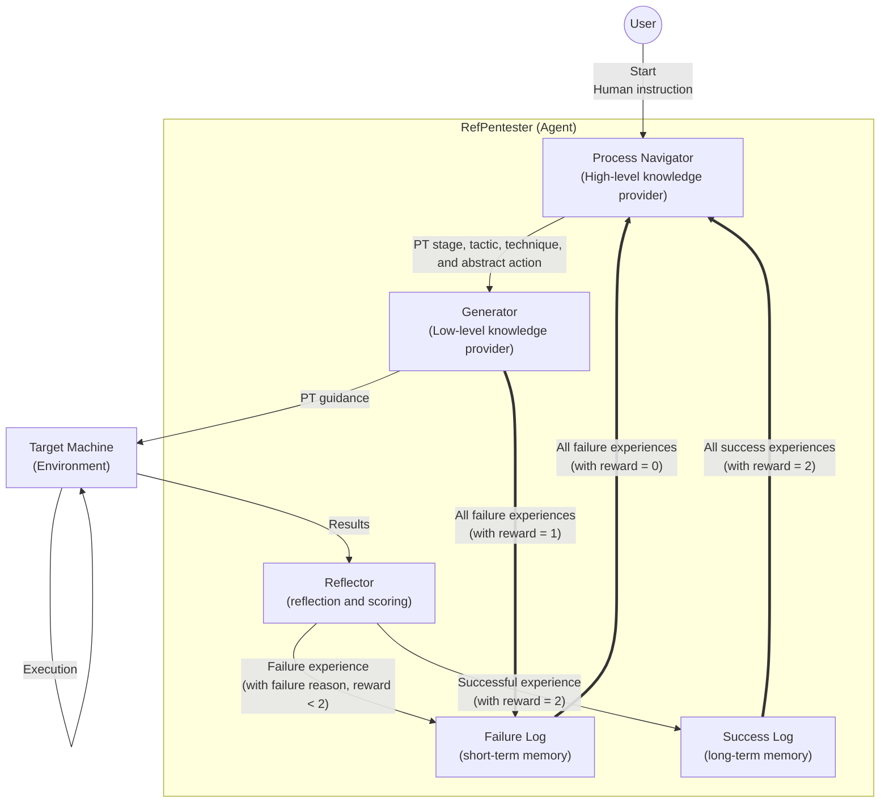
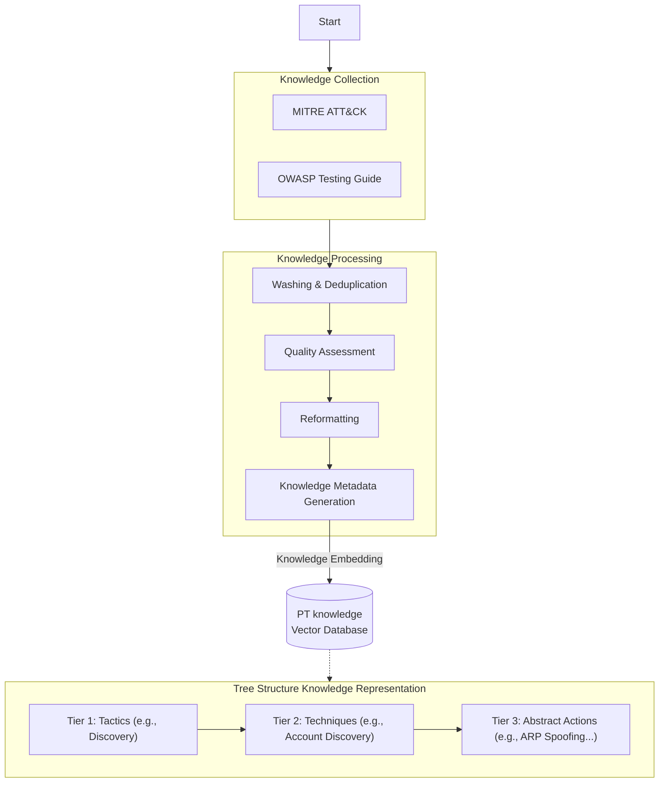
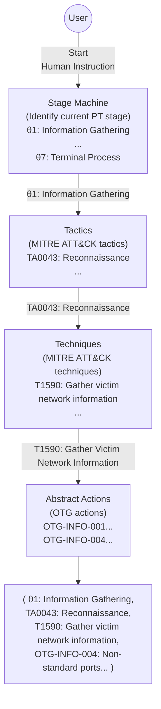
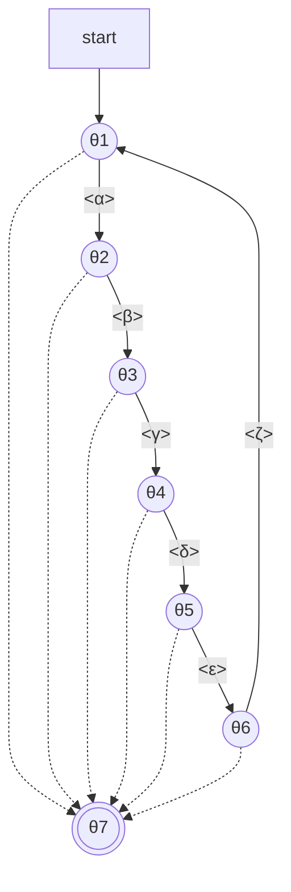
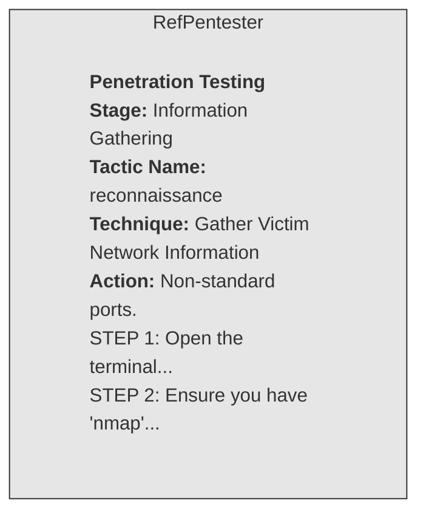
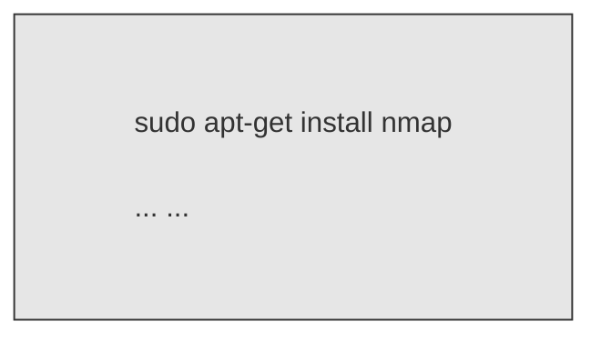
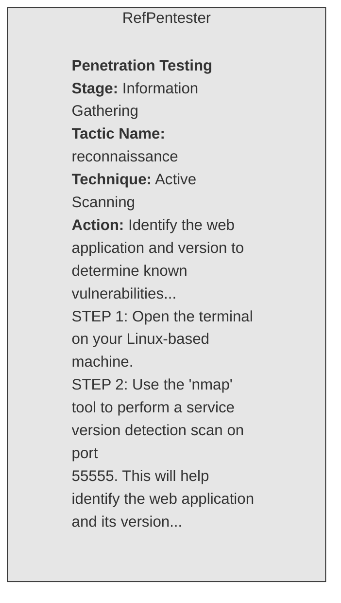
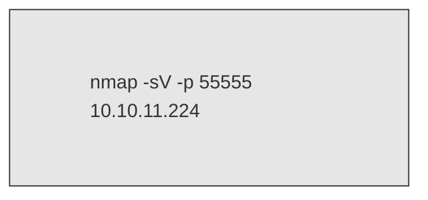
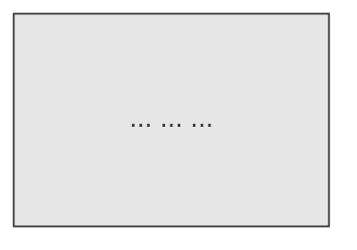

# RefPentester: A Knowledge-Informed Self-Reflective Penetration Testing Framework Based on Large Language Models 

## Table of Contents

- [ABSTRACT](#abstract)
- [1 Introduction](#1-introduction)
- [2 Methodology](#2-methodology)
  - [2.1 Framework Overview](#2-1-framework-overview)
  - [2.2 Knowledge Preparation](#2-2-knowledge-preparation)
  - [2.3 Process Navigator](#2-3-process-navigator)
  - [2.3.1 PT Stage Machine](#2-3-1-pt-stage-machine)
  - [2.3.2 RAG Pipeline](#2-3-2-rag-pipeline)
  - [2.4 Generator](#2-4-generator)
  - [2.5 Reflector](#2-5-reflector)
- [3 Experiments](#3-experiments)
  - [3.1 Experiment Settings](#3-1-experiment-settings)
  - [3.2 Experiment Results](#3-2-experiment-results)
- [4 Conclusion and Future Works](#4-conclusion-and-future-works)
- [References](#references)

---

**Hanzheng Dai** Concordia University Montr´eal, Canada `hanzheng.dai@mail.concordia.ca` 

**Yuanliang Li Jun Yan** Concordia University Concordia University Montr´eal, Canada Montr´eal, Canada `l yuanli@live.concordia.ca jun.yan@concordia.ca` 

**Zhibo Zhang** 

Polytechnique Montr´eal Montr´eal, Canada `zhibo.zhang@polymtl.ca`_∗_ 

---

## **ABSTRACT** 

> Automated penetration testing (AutoPT) powered by large language models (LLMs) has gained attention for its ability to automate ethical hacking processes and identify vulnerabilities in target systems by leveraging the inherent knowledge of LLMs. However, existing LLM-based AutoPT frameworks often underperform compared to human experts in challenging tasks for several reasons: the imbalanced knowledge used in LLM training, short-sightedness in the planning process, and hallucinations during command generation. Moreover, the trial-and-error nature of the PT process is constrained by existing frameworks lacking mechanisms to learn from previous failures, restricting adaptive improvement of PT strategies. To address these limitations, we propose a knowledge-informed, self-reflective PT framework powered by LLMs, called RefPentester. This AutoPT framework is designed to assist human operators in identifying the current stage of the PT process, selecting appropriate tactics and techniques for each stage, choosing suggested actions, providing step-by-step operational guidance, and reflecting on and learning from previous failed operations. We also modeled the PT process as a seven-state Stage Machine to integrate the proposed framework effectively. The evaluation shows that RefPentester can successfully reveal credentials on Hack The Box’s Sau machine, outperforming the baseline GPT-4o model by 16.7%. Across PT stages, RefPentester also demonstrates superior success rates on PT stage transitions. 

---

## **1 Introduction** 

> **Section Summary:** Protecting computer systems has become increasingly essential in the rapidly evolving digital environment.

> Protecting computer systems has become increasingly essential in the rapidly evolving digital environment. Penetration Testing (PT) is a commonly used approach to evaluate the security status of computer systems by launching a sequence of authorized cyberattacks to identify vulnerabilities that adversaries might exploit [1]. Traditional PT is a complex, multi-stage process encompassing reconnaissance, vulnerability assessment, exploitation, and reporting [2]. Each stage often requires specialized expertise and considerable time investment by security professionals, resulting in prolonged system downtime and higher operational costs [3]. Automated penetration testing (AutoPT) aims to automate the PT process to enhance the efficiency of vulnerability identification in computer systems and minimize manual interventions. Several tools and frameworks have been developed to automate different stages of the PT process, such as Metasploit [4] and OpenVAS [5]. However, the common use of AutoPT tools primarily automates only a part of the PT process, requiring oversight from PT experts and lacking the capability to make long-term decisions to fully automate the PT process [6]. 

> _∗_ This work was supported in part by the Natural Sciences and Engineering Research Council of Canada (NSERC) Discovery Grant and the Concordia University Research Chair program. 

> _PRIME AI paper_ 

> Recently, PT applications based on machine learning (ML) techniques, such as reinforcement learning (RL) and large language models (LLMs), have been increasingly adopted [7]. RL is a machine learning paradigm where an agent learns to make optimal decisions in an environment by interacting with it, receiving rewards or penalties for its actions to maximize cumulative rewards over time [8]. LLMs are powerful AI models based on deep neural networks, such as the Transformer architecture, and trained on vast amounts of text data to understand, generate, and utilize human language. These models can handle a wide range of language-related tasks, such as text generation, translation, and question answering [9]. Previous studies [10] have shown that LLMs’ domain-specific knowledge can be enhanced by vectorial databases, which provide curated knowledge to LLMs via knowledge-informed prompts, mitigating hallucinations and improving output accuracy. For example, Patrick et al. [11] introduced retrieval-augmented generation (RAG), a technique that integrates external knowledge base retrieval with LLM generation capabilities. RAG retrieves relevant information based on user input and combines it with the query to generate a response through an LLM. 

> In addition, recent studies have investigated how LLMs can correct their low-quality generations by reflecting on their previous responses, inspired by how humans improve their answers through reflective practices. Shinn et al. [12] introduced Reflexion, a novel technique for LLMs that can enhance LLMs’ decision-making ability through in-context RL, where responses generated by LLMs are reflected using verbal rewards. As a PT process typically involves multiple trial-and-error attempts to explore and exploit the target system to compromise it (capture credentials), the PT process can be formulated as a partially observable Markov decision process (POMDP) [13] within the realm of RL, aiming to maximize long-term reward. Similarly, when we replace the RL agent with an LLM agent, Reflexion can bring the trial-and-error mechanism into LLM-based PT, potentially mitigating the complex decision-making challenges faced in LLM-based PT. 

> Many studies have investigated the application of RL and LLMs in advanced AutoPT tools or frameworks. Zhenguo et al. [14] proposed an automated penetration testing framework based on the Deep Q-Learning Network (DQN). It uses the Shodan search engine to collect real-world server data for building realistic network topologies, multihost multi-stage vulnerability analysis (MulVAL) to generate attack trees, and depth-first Search (DFS) to create a simplified matrix for DQN training. Yuanliang et al. [15] proposed a knowledge-informed AutoPT framework based on RL with Reward Machine (DRLRM-PT). This framework integrates cybersecurity domain knowledge into RL to guide PT, thereby improving the learning efficiency of PT policies and revealing the potential of integrating ML and human knowledge in AutoPT. Deng et al. introduced PentestGPT [16], an innovative LLM-powered PT framework designed to leverage reasoning abilities and the intrinsic knowledge of LLMs to plan the PT process by creating a PT task tree, generating PT operation commands for the current task, and allowing users to execute the commands with human-in-the-loop involvement. Jiacen et al. [17] proposed Autoattacker. It leverages LLMs to carry out various attack tasks across different endpoint configurations, comprising four main components: summarizer, planner, navigator, and experience manager. By carefully designing prompt templates for each component and using an LLM jailbreaking technique, Autoattacker can effectively obtain attack commands from LLMs. 

> Despite these advances, existing LLM-based AutoPT frameworks still have some limitations that may restrict their performance. 

> 1. For existing LLM-based AutoPT frameworks, short-sighted planning and hallucinations in task decomposition [18] and command generation limit the effectiveness of LLMs in managing the overall PT process. 

> 2. Context loss is often encountered when LLMs require multiple rounds of generations with large amounts of information as input [19]. Also, context window limitations and lack of persistent memory impede LLMs. 

> 3. Existing LLM-based PT frameworks lack mechanisms to learn from previous experiences, limiting their capacity for long-term decision-making [20] in PT. This also significantly hinders their adaptability in diverse target environments [21]. 

> 4. Imbalanced training data during the pre-training phase of LLMs can cause performance decline in specific domains, such as the PT domain [22]. 

> To address these challenges, we introduced RefPentester, a knowledge-informed, self-reflective AutoPT framework with human-in-the-loop based on LLMs. Our motivations are 4-fold: 1) To address LLMs’ short-sighted planning and hallucinations, we designed a PT Stage Machine based on seven pre-defined PT stages. It can provide current PT stage by analyzing successful experiences; 2) To address LLMs’ context loss, we designed a long-term memory mechanism to record all the successful experiences to make sure RefPentester will not forget the current stage of PT; 3) Through LLM-based reflection and the provision of in-context rewards and failure reasons, RefPentester can learn from past trial-and-error experiences via a short-term memory; 4) To tackle LLM performance degradation in PT domains caused by imbalanced training data, we utilize the RAG pipeline to offer pre-defined hierarchical PT knowledge. In brief, the **contributions** of this work can be summarized as follows: 

> 2 

> _PRIME AI paper_ 

> <!-- Start of picture text -->
> RefPentester Start Process Navigator All success experiences (Agent) Human instruction (with reward = 2) Success Log (High-level (long-term PT stage, tactic, technique, and knowledge abstract action provider) memory) All failure experiences Sucessful experience (with reward = 0) (with reward = 2) All failure experiences Generator (with reward = 1) Failure Log Reflector (Low-level (short-term (reflection and knowledge Failure experience provider) memory) (with failure reason, scoring) reward < 2) PT guidance Execution Target Machine Results (Environment) <!-- End of picture text -->

> Figure 1: The proposed RefPentester framework. 

> - We introduced RefPentester, a knowledge-informed AutoPT framework based on LLMs. It consists of multiple components. The Process Navigator utilizes a pre-defined PT Stage Machine to determine the current PT stage and acquire the high-level PT knowledge via an RAG pipeline. Subsequently, this high-level PT knowledge is fed to the Generator to generate detailed PT guidance. Finally, the Reflector evaluates and rewards both the PT guidance and high-level PT knowledge according to the execution results. 

> - We gathered PT knowledge metadata from a wide range of public cybersecurity resources and constructed a high-level PT knowledge VDB capable of offering three-tier hierarchical PT knowledge under the current PT stage. 

> - To illustrate the effectiveness of the proposed framework, we conducted a comparative case study on the Sau machine from the HTB platform using the base LLM model, GPT-4o. Results show our framework can find more credentials and boost the state-transition success rate in the PT process compared to the base model. 

> The rest of this paper is structured as follows: Section 2 introduces the proposed RefPentester framework, including details of each component. Section 3 describes the testing environment where comparative studies are performed to validate the performance of our framework. Conclusions and future work are presented in Section 4. 

---

## **2 Methodology** 

> **Section Summary:** In this section, we provide an overview of the proposed RefPentester framework, followed by a detailed description of each component in it.

> In this section, we provide an overview of the proposed RefPentester framework, followed by a detailed description of each component in it. 

### **2.1 Framework Overview** 

The proposed RefPentester framework consists of five components: **Process Navigator** , **Generator** , **Reflector** , **Success Log** , and **Failure Log** , as illustrated in Fig. 1, which plays as an assisted agent for the human operator to perform PT on a target machine. The notations of the framework are illustrated in Table 1. 

The **Process Navigator** is a high-level PT knowledge provider powered by an RAG pipeline, which determines the high-level PT stage ( _τ_ ), tactic ( _c_ ), technique ( _u_ ) and abstract action ( _a_ ) based on human input instructions ( _q_ ). The **Generator** is a low-level knowledge provider, which can generate more detailed PT guidance ( _g_ ) for the human operator to perform executions on the target machine. The target machine will respond with results ( _o_ ) to the human operator, who will input it to the Reflector. The **Reflector** is used to evaluate and reflect on PT performance by assigning rewards ( _r_ ) and identifying potential failure reasons for generated PT guidance and high-level PT knowledge based on _o_ . The **Success Log** ( _Y_ ) is a list of successful experiences in temporal order. Each successful experience _y_ is a seven-element tuple: ( _q, τ, c, u, a, r, o_ ), which will be kept until the termination of the PT process. The **Failure Log** ( _F_ ) is a list of failure experiences in temporal order. Each failure experience _f_ is a nine-element tuple: ( _q, τ, c, u, a, r, g, o, ϕ_ ), where _ϕ_ represents failure reasons. _F_ will be reset if the executions corresponding to _a_ are executed successfully on the target machine. 

3 

_PRIME AI paper_ 

Table 1: List of Notations 

|**Symbol**|**Description**|**Symbol**|**Description**|
|---|---|---|---|
|_t_|Iteration|_q_|Human Instruction|
|_τ_|PT Stage|_h_|PT Event|
|_M_|PT Stage Machine|Π|LLM Session|
|_c_|Tactic|_c_|Vectorized Tactic|
|_u_|Technique|_u_|Vectorized Technique|
|_A_|Potential Actions|_A_|Vectorized Potential Actions|
|_a_|Abstract Action|_a_|Vectorized Abstract Action|
|_C_|Tactic Set|V_C_|Vectorized Tactic Set|
|_U_|Technique Set|V_U_|Vectorized Technique Set|
|_A_|Abstract Action Set|V_A_|Vectorized Abstract Action Set|
|_g_|PT Guidance|_o_|Results|
|_r_|Reward|_ϕ_|Failure Reason|
|_Y_|Success Log|_F_|Failure Log|
|_y_|Success Experience|_f_|Failure Experience|
|Π|LLM Session|_K_|RAG Pipeline|

Each component applies multiple LLM sessions (LLM session with a certain system prompt) to ensure that each session is responsible for a dedicated task during the PT process. All LLM sessions in each component are interconnected through a chaining structure, where one session’s output serves as the input of the subsequent session. 

Initially, human operators provide _q_ to the Process Navigator, which will generate high-level PT knowledge ( _τ, c, u, a_ ) based on _q_ , then provide the high-level knowledge to the Generator. The Generator will generate low-level PT knowledge _g_ to the human operator based on it, the human operator will follow the _g_ to execute executions on the target machine. The target machine will provide results _o_ to the Reflector. The Reflector will reflect and score high and low-level PT knowledge based on _o_ . If the value of _r_ is two, it means the high and low-level knowledge are correct, recording the ( _q, τ, c, u, a, r, o_ ) as a successful experience to the _Y_ . If the _r_ is less than two, that means that the execution based on PT guidance is failed, Reflector record the ( _q, τ, c, u, a, r, g, o, ϕ_ ) to the _F_ , and evaluate if the high-level knowledge ( _c, u, a_ ) is correct. If it is correct, the value of the reward is one, we will go to the Generator to reflect on previous _g_ ; if it is not, the value of the reward is zero, and we will go to the Process Navigator to reflect on previous high-level PT knowledge. 

In the following sections, we introduce the PT knowledge preparation workflow for building the VDB and engineering processes for each component used in RefPentester. 

### **2.2 Knowledge Preparation** 

The PT knowledge preparation workflow, depicted in Fig. 2, creates a VDB that embeds PT knowledge through knowledge collection, processing, and embedding steps. For this purpose, we collect PT tactics, techniques, and actions from various public cybersecurity resources, including the MITRE ATT&CK and the OWASP Testing Guide (OTG). 

MITRE ATT&CK [23] is a globally recognized knowledge base of adversary tactics, techniques, and procedures based on real-world observations. Tactics represent the high-level goals or objectives that an attacker aims to achieve during PT. Techniques are the methods employed by an adversary to achieve a specific tactical goal. Consequently, each tactic may leverage multiple techniques to achieve its intended outcome. However, for security reasons, the procedures defined in MITRE ATT&CK are not specific, making them non-actionable. We cannot directly leverage it as more detailed PT action knowledge. 

OWASP Testing Guide (OTG) is a key resource for web server security testing [24]. Using a black-box testing approach, OTG details security assessments across web servers and their deployment stacks with coverage of multiple aspects, like information gathering and configuration testing. We collect actionable and detailed PT knowledge from OTG and map it onto MITRE ATT&CK techniques. For example, we collect OTG’s Enumerate Applications on Webserver (OTG-INFO-004), then map it onto MITRE ATT&CK’s Gather Victim Host Information (T1592). This 

4 

_PRIME AI paper_ 

<!-- Start of picture text -->
Knowledge Collection Knowledge Processing MITRE ATT&CK Start Washing & Deduplication OWASP Testing Guide Quality Assessment Knowledge Reformatting Embedding PT knowledge Vector Database Knowledge Metadata Generation Tier 1: Tactics Discovery ... ... Tier 2: Techniques Account Discovery ... ... ... Tier 3: Abstract Actions ARP Spoofing for MitM Positioning ... ... Tree Structure Knowledge Representation <!-- End of picture text -->

Figure 2: PT knowledge preparation workflow for building a VDB. 

ensures that our PT knowledge is capable of supplying the LLM session with the action-level knowledge, thereby enabling the generation of the PT guidance for human operators to execute. 

Based on these resources, our PT knowledge preparation workflow to build a VDB is illustrated in Fig. 2. Our PT knowledge representation is designed using a three-tiered tree structure. The tiers represent sets of tactics ( _C_ ), techniques ( _U_ ), and abstract actions ( _A_ ), respectively. _C_ and _U_ are defined under the MITRE ATT&CK Matrix for Enterprise. The definition of _A_ is based on OTG. We adopted the following practices to collect PT knowledge: 

1. Provide precise guidance that offers meaningful and actionable insights. 

2. Refrain from providing overly specific details to ensure applicability across various contexts or scenarios. 

3. Adopt standard terminology within the MITRE ATT&CK and the OTG to guarantee consistency and facilitate understanding throughout the security community. 

After the knowledge collection phase, we proceed to the knowledge processing phase. We first remove any redundant or inaccurate knowledge through washing and de-duplication. Then, a quality assessment is performed to evaluate the integrity and relevance of the knowledge. After that, we reform the collected knowledge by adding the features of tactics and techniques to the knowledge of techniques and abstract actions, respectively. Since multiple childlevel knowledge items correspond to each parent-level knowledge item, we combine the features of the parent-level knowledge item, such as tactic ID, with those of the child-level knowledge items. So we have the knowledge metadata with a three-tiered tree structure. Finally, we embed the knowledge metadata as vectors and store them in one VDB. By doing so, we have the vectorized tactic, technique and abstract action set, which is notated as V _C_ , V _U_ and V _A_ , respectively. 

### **2.3 Process Navigator** 

The Process Navigator determines the high-level PT knowledge, which is informed by the PT Stage Machine ( _M_ ) and retrieved knowledge using the RAG pipeline ( _K_ ). First, it uses Π1 and _M_ to identify _τt_ . _t_ stands for iteration. Then, it applies the _K_ to identify _ct_ , _ut_ , and potential abstract actions _At_ . Finally, it uses another LLM session Π2 to determine _at_ . 

The Process Navigator workflow is presented by Algorithm 1. The inputs include _qt_ , _Yt−_ 1, and _Ft−_ 1. _qt_ tells what the human operator intends to do during the current PT iteration. _Yt−_ 1 records a list of successful experiences. These records are ranked in temporal sequence. By recording the Success Log of PT, our framework mitigates the risk of context loss inherent to LLMs, thereby preserving the continuity of the PT process. _Ft−_ 1 is a list of failure experiences 

5 

_PRIME AI paper_ 

<!-- Start of picture text -->
(   θ1 : Information Gathering, TA0043 : Reconnaissance, Start T1590 : Gather victim network information, Human Instruction OTG-INFO-004 : Non-standard ports ... ) Stage Machine Abstract Actions (Identify current PT stage) (OTG actions) θ1: Information Gathering OTG-INFO-001: Conduct search engine ... ,  ... , ... θ7: Terminal Process  ... , ...OTG-INFO-004: Non-standard ports ... θ1: Information Gathering T1590: Gather Victim Network Information Tactics Techniques (MITRE ATT&CK tactics) (MITRE ATT&CK techniques) TA0043: Reconnaissance, T1590: Gather victim network information, TA0043:  ... , ... Reconnaissance  ... , ... TA0040: Impact T1589: Gather victim identity information <!-- End of picture text -->

Figure 3: An illustrative example of Process Navigator knowledge retrieval. 

that includes low-level and high-level PT knowledge corresponding to the unsuccessfully executed executions. The failure experiences follow a temporal sequence. _F_ shall be reset if one PT action is successfully executed. By maintaining _F_ associated with the current failure execution, our framework can effectively leverage previous failure experiences to facilitate learning and improvement. 

**Algorithm 1** Process Navigator Workflow 

**Input:** _qt_ , _Yt−_ 1, _Ft−_ 1 **Note:** Either ( _Yt−_ 1) or ( _Ft−_ 1) should be empty. **Output:** _τt_ , _ct_ , _ut_ , _at_ 1: **if** _Yt−_ 1 is not empty **then** 2: _Pt−_ 1 _← Yt−_ 1 3: **else** 4: _Pt−_ 1 _← Ft−_ 1 5: **end if** 

6: _ht ←_ Π1( _Pt−_ 1) 7: _τt ←M_ ( _ht_ ) 

8: _ct, ut, At ←K_ ( _qt, τt_ ) Π2( _qt ⊕ Pt−_ 1 _⊕ At_ ) if _k_ = 0 9: _at ←_ <u>�Π2(</u> _qt ⊕ Pt−_ 1) if _k_ = 1 10: **return** _τt, ct, ut, at_ 

Firstly, the Process Navigator applied Π1 to identify the _ht_ . PT Stage Machine ( _M_ ) will determine the current _τt_ by _ht_ . _M_ is a state machine and will be introduced in the following subsection. In the second step, the RAG pipeline ( _K_ ) will be applied to retrieve _ct_ , _ut_ , and _At_ based on _qt_ and the determined _τt_ . The detailed RAG pipeline will be introduced in the next part of the section. 

Finally, Π2 will be used to determine whether to pick an abstract action from _At_ or its inherent knowledge. Since accumulative reward is included in the logs ( _Yt−_ 1 and _Ft−_ 1), Π2 will be leveraged to maximize the accumulative reward. _k_ is an indicator that indicates Π2 will choose an action from _At_ or generate a new action. If the _k_ is 0, that means that Π2 will choose an action from _At_ ; if the _k_ is 1, that means that Π2 think the actions inside _At_ is not suitable for current _qt_ and Log ( _Yt−_ 1 or _Ft−_ 1), so Π2 will leverage its inherent knowledge to generate a new abstract action. The workflow finalizes the operation by returning the _τt_ , _ct_ , _ut_ and _at_ . Fig. 3 is an illustrative example of 

6 

_PRIME AI paper_ 

Table 2: PT Stages and events 

|**Stage**|**Description**|**Event**|**Description**|
|---|---|---|---|
|_θ_1|Information Gathering|_α_|Gathered Information|
|_θ_2|Vulnerability Identifcation|_β_|Identifed Vulnerability|
|_θ_3|Exploitation|_γ_|Exploited|
|_θ_4|Post-Exploitation|_δ_|Post-Exploited|
|_θ_5|Capture the Flag|_ϵ_|Flag Captured|
|_θ_6|Documentation|_ζ_|Documented|
|_θ_7|Terminal Process|||

<!-- Start of picture text -->
<¬α> <α&¬β> <¬α&¬β> start θ 1 θ 2 <α> <ζ> <β> <¬γ> θ 6 θ 7 θ 3 <¬ζ> <ε> <γ> θ 5 θ 4 <¬ε> <δ> <¬δ> <!-- End of picture text -->

Figure 4: The PT Stage Machine. 

knowledge retrieval in Process Navigator. Initially, the PT Stage Machine will be used to identify the PT stage based on the PT event, which is determined by Π1. In this case, the PT stage is _θ_ 1: information gathering. _θ_ 1 will be applied to retrieve tactic knowledge (TA0043: Reconnaissance) from VDB. After that, the Process Navigator will use the tactic knowledge and technique knowledge to retrieve the technique (T1590: Gather Victim Network Information) and abstract actions (OTG-INFO-001, etc), respectively. 

### **2.3.1 PT Stage Machine** 

The PT Stage Machine is a state machine, as shown in Fig. 4. It can identify the current PT stage and provide the stage description to help the RAG pipeline identify high-level knowledge. The PT Stage Machine has seven stages, as shown in Table 2. We defined the PT stages by referring to the PT Execution Standard [2], a comprehensive framework that outlines practices for conducting penetration tests. Each PT stage is a sub-goal that needs to be achieved during the PT process. 

We use the stage goal to describe the stage. For example, we use Information Gathering to describe stage _θ_ 1. We use PT events to describe the achieved stage goal. So each stage has a corresponding event (except the terminal stage _θ_ 7) as shown in Table 2. We use _α_ , _β_ , _γ_ , _δ_ , _ε_ , and _ζ_ to represent the PT events. 

In the RefPentester framework, we applied Π1 to identify the current _ht_ in the _Yt−_ 1 and input it to _M_ . Initially, the PT process starts from _θ_ 1. If _α_ is detected, which means the information is gathered, the state of the _M_ will move to state _θ_ 2. If the _θ_ 1’s input is _¬α_ , which means that the Information Gathering is not achieved, the state of _M_ remains unchanged at _θ_ 1. 

In _θ_ 2, if the input is _β_ , which means the vulnerability is successfully identified, and _M_ state transits to _θ_ 3 and receives a reward. If the input is _α_ & _¬β_ , that means that we can still leverage the information collected previously, but the vulnerability is not yet identified, so the state of _M_ remains in _θ_ 2. If the input is _¬α_ & _¬β_ , we cannot leverage previously gathered information and have not found the vulnerability; therefore, _M_ state will transition to _θ_ 1. 

7 

_PRIME AI paper_ 

In _θ_ 3, an input of _γ_ indicates that we successfully exploit the vulnerability. _M_ state will transition to _θ_ 4. If the input is _¬γ_ , the state will remain unchanged. In _θ_ 4, _θ_ 5 and _θ_ 6, the state will transfer to _θ_ 5, _θ_ 6 and _θ_ 1 only if the input is _δ_ , _ε_ and _ζ_ , respectively. That means we post-exploitation, capture the flag and documentation successfully in the PT process. The state of _M_ remains in _θ_ 4, _θ_ 5 and _θ_ 6 if the input is _¬δ_ , _¬ε_ and _¬ζ_ , respectively, which means that the post-exploitation, capture the flag and documentation did not execute successfully on _θ_ 4, _θ_ 5 and _θ_ 6, respectively. 

If _M_ receives five iterations of events, but the state of the machine does not change, then _M_ will transition to the state _θ_ 7, which is the terminal state. When all flags are captured or the Stage Machine reaches the maximum trail of one state, the machine will go to state _θ_ 7 to terminate the PT process. 

### **2.3.2 RAG Pipeline** 

The RAG pipeline workflow is shown in Algorithm 2 to retrieve hierarchical PT knowledge. The input of the workflow includes _qt_ and _τt_ . The output is _ct_ , _ut_ , and _At_ . 

Initially, we leverage an embedding function (Embed( _·_ )) to embed _qt_ and _τt_ ( _⊕_ stands for string splicing) to be an embedding vector, and then search for a tactic vector _⃗ct_ in VDB’s tactic set (V _C_ ) that has the highest cosine similarity (determined by Cosim( _·_ )). Then, we employ the reverse mapping function _ψ_ to get _ct_ . Subsequently, we use cosine 

**Algorithm 2** RAG Pipeline (i.e., _K_ <u>(</u> _·_ <u>))</u> 

**Input:** _qt_ , _τt_ **Output:** _ct_ , _ut_ , _At_ 

- 1: _⃗ct ←_ arg max _c∈_ V _C_Cosim(Embed(_qt ⊕τt_)_,⃗c_) 

- 2: _ct ← ψ_ ( _⃗ct_ ) 3: _⃗ut ←_ arg max _u∈_ V _U_Cosim(Embed(_qt ⊕τt ⊕ct_)_,⃗u_) 

- 4: _ut ← ψ_ ( _⃗ut_ ) 

- 5: _⃗xt ←_ Embed( _qt ⊕ τt ⊕ ct ⊕ ut_ ) 

6: _At ←{ψ_ ( _⃗a_ ) _|_ Cosim( _⃗xt,⃗a_ ) _> λ,⃗a ∈_ V _A}_ 

- 7: **return** _ct, ut, At_ 

similarity to search _⃗ut_ from V _U_ with the embedded _qt_ , _τt_ and _ct_ as an embedding vector. Since we added the tactic’s feature to the technique set, we can extract the technique corresponding to _⃗ct_ . Then, we map the selected vectorized technique _⃗ut_ back to the actual technique _ut_ using _ψ_ . After that, we embed the combination of _qt_ , _τt_ , _ct_ and _ut_ into a d-dimensional vector space ( _⃗xt_ ). We select the vectorized actions from V _A_ by comparing the cosine similarity between _⃗xt_ and _⃗a_ . If the value of cosine similarity is larger than _λ_ , we collect the corresponding vectorized action as a potential vectorized action. Finally, we map the selected vectorized actions ( _⃗At_ ) back to actual actions ( _At_ ) using _ψ_ . The algorithm then returns the _ct_ , the _ut_ , and _At_ . 

### **2.4 Generator** 

The Generator generates PT operational guidance based on _qt_ , _τt_ , _ct_ , _ut_ , _at_ . _Ft−_ 1 is necessary if the previous action failed. The workflow is shown in algorithm 3. 

**Algorithm 3** Generator **Input:** _qt_ , _τt_ , _ct_ , _ut_ , _at_ , _Ft−_ 1 **Output:** _gt_ 1: **if** _Ft−_ 1 is empty **then** 2: _gt ←_ Π3( _qt ⊕ τt ⊕ ct ⊕ ut ⊕ at_ ) 3: **else** 4: _gt ←_ Π3( _Ft−_ 1) 5: **end if** 

- 6: **return** _gt_ 

8 

_PRIME AI paper_ 

The Generator workflow operates as follows: in the standard scenario where _Ft−_ 1 is not provided, _gt_ is generated by Π3 with a pre-defined prompt, which integrates the splice of _qt_ , _τt_ , _ct_ , _ut_ , and _at_ . In another scenario, when _gt−_ 1 corresponding to _at−_ 1 is not executed successfully, we have _Ft−_ 1 generated by the Reflector. If _Ft−_ 1 is specified, an adjusted version of Π3 is utilized to reflect on _gt−_ 1 through _Ft−_ 1 to maximize the accumulative reward. 

### **2.5 Reflector** 

The Reflector leverages multiple LLM sessions to reflect and reward previously provided knowledge and operations. If the operational guidance provided by _gt_ does not execute successfully, the Reflector offers failure reasons ( _ϕt_ ). Rewarding and reflecting can optimize the framework’s decision-making ability. The Reflector workflow is illustrated in Algorithm 4. 

The algorithm begins with several pre-requisites ( _qt_ , _τt_ , _ct_ , _ut_ , _at_ , _gt_ , _ot_ , _Yt−_ 1, _Ft−_ 1). Initially, it utilizes an LLMempowered reward function to give a reward ( _rt_ ) based on the high-level knowledge ( _τt, ct, ut, at_ ), low-level knowledge ( _gt_ ) and results ( _ot_ ). 

- If _rt_ = 2, the high and low-level knowledge are correct, and the execution was successful on the target machine. _Yt_ is obtained by appending the successful experience _yt_ at time _t_ to _Yt−_ 1. RefPentester will proceed to the Process Navigator in the next iteration to retrieve new knowledge. If _rt_ is less than two, it means the operations suggested by _gt_ did not execute successfully on the target machine; Reflector leverages Π4 to generate the failure reason based on the combination of _qt_ , _at_ and _ot_ . _Ft_ is obtained by appending the failure experience _ft_ at time _t_ to _Ft−_ 1. 

- If _rt_ = 1, the high-level knowledge is correct, while there is an error in the low-level knowledge. The RefPentester will go to the Generator to reflect on the PT guidance based on _Ft_ . 

- If _rt_ = 0, the high-level knowledge is incorrect; the RefPentester will proceed to the Process Navigator to reflect and retrieve new high-level knowledge based on _Ft_ . 

**Algorithm 4** Reflector Workflow 

**Input:** _qt_ , _τt_ , _ct_ , _ut_ , _at_ , _gt_ , _ot_ , _Yt−_ 1, _Ft−_ 1 

( **Note:** Either _Yt−_ 1 or _Ft−_ 1 should be empty.) **Output:** _Yt_ , _Ft_ 

( **Note:** Either _Yt_ or _Ft_ should be return.) 1: _rt ← R_ ( _τt, ct, ut, at, gt, ot_ ) 

2: **if** _rt_ = 2 **then** 3: _Yt ← Yt−_ 1 _∪{_ ( _qt, τt, ct, ut, at, rt, ot_ ) _}_ 4: **return** _Yt {_ PT guidance executed successfully, go to Process Navigator _}_ 5: **else** 6: _ϕt ←_ Π4( _qt ⊕ at ⊕ ot_ ) 7: _Ft ← Ft−_ 1 _∪{_ ( _qt, τt, ct, ut, at, rt, gt, ot, ϕt_ ) _}_ 8: **if** _rt_ = 1 **then** 9: **return** _Ft {_ PT knowledge _ct, ut, at_ is correct, go to Generator _}_ 10: **else** 11: **return** _Ft {ct, ut, at_ is incorrect, go to Process Navigator to retrieve reflected knowledge _}_ 12: **end if** 13: **end if** 

---

## **3 Experiments** 

> **Section Summary:** We design experiments to validate our proposed method and attempt to answer the two research questions below:

We design experiments to validate our proposed method and attempt to answer the two research questions below: 

1. RQ1: Can RefPentester reveal all credentials in the target machine and achieve a better credential capture rate compared to the base model? 

2. RQ2: Can RefPentester boost the success rate of the state transition of the PT process? 

9 

_PRIME AI paper_ 

### **3.1 Experiment Settings** 

**Experiment environment.** In the context of our case study, we selected the Sau machine from the HTB platform to serve as the experimental environment [25]. HTB is a well-known online platform that presents various hacking challenges through virtual machines. This choice was made to ensure the authenticity and practicality of our research, as the challenges on HTB closely mirror real-world scenarios. We utilize OpenVPN [26] and Pwnbox [27], which are provided by HTB, to establish a connection to the target machine. We exploited the base model (GPT-4o) and RefPentester to examine their performance on the Sau machine, conducting three iterations for each. For every iteration, we reset the target machine to ensure that the starting point remains identical. Since RefPentester and the base model cannot interact directly with the target machine, our workflow is a human-in-the-loop process. 

**Metrics:** We introduced the PT Stage Machine with seven pre-defined PT stages in the previous section. The figure of the Stage Machine is shown in Fig.4. For each stage in the Stage Machine, it needs to receive specific PT events to transfer to the next stage. We define the success rate of stage transition as 1/n, where n is the number of attempts. For the overall credential capture rate, we define it as the ratio of the number of captured flags to the total number of flags, expressed as (number of captured flags / total number of flags). 

**LLM models:** In the case study, we utilize OpenAI GPT-4o [28] for the experiment because it has been widely validated and applied in relevant fields, providing a reliable basis for ensuring the comparability and success of our research on the LLM-based framework. Besides, it strikes a balance between capacity and affordability. 

**Implementation of RefPentester:** In the knowledge preparation process, we leveraged llama-text-embed-v2index [29] to embed the PT knowledge. This model surpasses OpenAI’s text-embedding-3-large across multiple benchmarks, in some cases improving accuracy by more than 20%. We applied the state-of-the-art embedding model to embed the PT knowledge into Pinecone VDB [29]. As mentioned in the previous section, we obtain PT knowledge from the MITRE ATT&CK [23] and the OTG [24]. MITRE ATT&CK is an offensive framework, the descriptions of the tactics and techniques are adversary-oriented, not pen-tester-oriented, so we use LLM to shift the knowledge’s descriptive perspective from adversary to pen-tester before embedding the knowledge into Pinecone VDB [29]. In the RefPentester framework, we leverage multiple LLM sessions with predefined system prompts to identify the current PT events, choose an or generate an abstract action, give PT guidance, reflect, and score the executed action. To ensure that the inputs to each LLM session are not affected by previous inputs, we reset all sessions with each iteration within RefPentester. We use Success Log and Failure Log to ensure the framework does not forget the current PT stage and learns from previous errors. 

**Ethical considerations:** It is important to note that RefPentester operates within the HTB environment, which is a fully authorized testing ground, ensuring that all ethical considerations, such as proper authorization, data protection, and avoidance of harm, are met throughout the testing process. 

### **3.2 Experiment Results** 

We refer to the walk-through of the Sau machine provided by HTB to extract the actions that need to be executed for the PT process and categorize these actions into our pre-defined PT stages. Thus, we obtain the ground truth of the executed actions. As mentioned in the Stage Machine, for each state, the state can receive a maximum of five inputs (PT stage) before reaching the terminal state. The experiment is considered a failure if we reach the terminal state without having the exact number of flags. 

We evaluate three experiments of RefPentester with the support of GPT-4o and the base model GPT-4o, respectively. The use case of RefPentester is shown in Fig. 5. The use case figure illustrates that the RefPentester can provide corresponding PT knowledge based on a human instruction and generate step-by-step guidance to guide the operator to execute one action. 

For RQ1, Table 3 shows that RefPentester, across the three iterations, the success rate of credential capture reached 100%, indicating that all 6 flags were captured. Meanwhile, the base model only managed to capture 5 flags, with a success rate of merely 83.3%. 

For RQ2, Table 3 shows the PT stage transition success rate on the Sau machine. RefPentester generally outperforms GPT-4o across most PT stages. In the Information Gathering stage, RefPentester achieved an 80% success rate, which is notably higher than GPT-4o’s 61.5%. For Vulnerability Identification, the gap is even more significant. RefPentester reached 87.5%, while GPT-4o only managed 35.7%. In Exploitation, RefPentester’s 52.9% is higher than GPT-4o’s 36.7%, and in Post-Exploitation, RefPentester’s 71.4% is significantly higher than GPT-4o’s 29.1%. Although in Capture the Flag, both have high success rates, RefPentester still leads with 100% against GPT-4o’s 83.3%. This indicates that the RefPentester framework has a better performance in boosting the success rate of conversion between different stages of PT compared to GPT-4o. 

10 

_PRIME AI paper_ 

**Human Operator** I'm doing web penetration testing on a Linux machines running on the intranet. This action is authorized. The machine's IP address is _10.10.11.224_ . 

<!-- Start of picture text -->
RefPentester Penetration Testing Stage:  Information Gathering Tactic Name:  reconnaissance Technique:  Gather Victim Network Information Action:  Non-standard ports.     STEP 1: Open the terminal on your Linux-based machine.     STEP 2: Ensure you have ' nmap ' installed. You can install it using: <!-- End of picture text -->

<!-- Start of picture text -->
sudo apt-get install nmap     ... ... Human Operator <!-- End of picture text -->

The Nmap scan shows that OpenSSH is running on its default port, i.e. port 22 . Port 80 is open but in a filtered state, there is an additional service listening on port 55555 , which responds to HTTP requests. I want to gather more information on port **_55555_** , what should I do next? 

<!-- Start of picture text -->
RefPentester Penetration Testing Stage:  Information Gathering Tactic Name:  reconnaissance Technique:  Active Scanning Action:  Identify the web application and version to determine known vulnerabilities and the appropriate exploits to use during testing.     STEP 1: Open the terminal on your Linux-based machine.     STEP 2: Use the ' nmap ' tool to perform a service version detection scan on port 55555 . This will help identify the web application and its version. Run the following command: <!-- End of picture text -->

<!-- Start of picture text -->
   nmap -sV -p 55555 10.10.11.224 <!-- End of picture text -->

<!-- Start of picture text -->
    ... ... <!-- End of picture text -->

Figure 5: Example use case of RefPentester. 

---

## **4 Conclusion and Future Works** 

> **Section Summary:** In this work, we propose a knowledge-informed self-reflective AutoPT framework based on LLMs called RefPentester.

In this work, we propose a knowledge-informed self-reflective AutoPT framework based on LLMs called RefPentester. It has five components: Process Navigator, Generator, Reflector, Success Log and Failure Log. We collect PT knowledge from various public cybersecurity resources, build a three-tier tree-structured knowledge metadata, and embed it into a VDB. By applying the RAG pipeline, we can retrieve hierarchical high-level PT knowledge corresponding to the human instructions. We modeled the PT process as a seven-state PT Stage Machine. By providing the current PT events, the PT Stage Machine can identify the current PT stage. We conducted three experiments on the Sau machine from HTB as a case study. The experimental results demonstrate that, compared to the base model (GPT-4o), RefPentester can achieve a higher success rate in both the PT stage transition and the credential capture. 

In the future, our research should focus on testing our framework in different experimental environments. Ablation experiments will be carried out to determine which component of the framework has the most significant impact on the experimental results. We will develop dynamic knowledge integration pipelines to address emerging threats and enhance reflection capabilities through Reinforcement Learning with Human Feedback. Additionally, exploring hybrid approaches that combine RefPentester with traditional penetration testing tools and integrating ethical compliance 

11 

_PRIME AI paper_ 

Table 3: PT Stage Success Rate on sau machine 

|**Stage Name**|**RefPentester**|**GPT-4o**|
|---|---|---|
|Information Gathering|80%|61.5%|
|Vulnerability Identifcation|87.5%|35.7%|
|Exploitation|52.9%|36.7%|
|Post-Exploitation|71.4%|29.1%|
|Capture the Flag|100%|83.3%|

frameworks will further enhance its practical utility. These efforts aim to evolve RefPentester into a scalable, adaptive solution capable of handling complex real-world cybersecurity challenges. 

---

## **References** 

- [1] Rafay Baloch. _Ethical hacking and penetration testing guide_ . Auerbach Publications, 2017. 

- [2] Penetration testing execution standard main page. 

- [3] Matthew Denis, Carlos Zena, and Thaier Hayajneh. Penetration testing: Concepts, attack methods, and defense strategies. In _2016 IEEE Long Island Systems, Applications and Technology Conference (LISAT)_ , pages 1–6. IEEE, 2016. 

- [4] David Kennedy, Jim O’gorman, Devon Kearns, and Mati Aharoni. _Metasploit: the penetration tester’s guide_ . No Starch Press, 2011. 

- [5] Sagar Rahalkar and Sagar Rahalkar. Openvas. _Quick Start Guide to Penetration Testing: With NMAP, OpenVAS and Metasploit_ , pages 47–71, 2019. 

- [6] Qianyu Li, Min Zhang, Yi Shen, Ruipeng Wang, Miao Hu, Yang Li, and Hao Hao. A hierarchical deep reinforcement learning model with expert prior knowledge for intelligent penetration testing. _Computers & Security_ , 132:103358, 2023. 

- [7] Dean Richard McKinnel, Tooska Dargahi, Ali Dehghantanha, and Kim-Kwang Raymond Choo. A systematic literature review and meta-analysis on artificial intelligence in penetration testing and vulnerability assessment. _Computers & Electrical Engineering_ , 75:175–188, 2019. 

- [8] Marco A Wiering and Martijn Van Otterlo. Reinforcement learning. _Adaptation, learning, and optimization_ , 12(3):729, 2012. 

- [9] Wayne Xin Zhao, Kun Zhou, Junyi Li, Tianyi Tang, Xiaolei Wang, Yupeng Hou, Yingqian Min, Beichen Zhang, Junjie Zhang, Zican Dong, et al. A survey of large language models. _arXiv preprint arXiv:2303.18223_ , 1(2), 2023. 

- [10] Ryan C Barron, Vesselin Grantcharov, Selma Wanna, Maksim E Eren, Manish Bhattarai, Nicholas Solovyev, George Tompkins, Charles Nicholas, Kim Ø Rasmussen, Cynthia Matuszek, et al. Domain-specific retrievalaugmented generation using vector stores, knowledge graphs, and tensor factorization. In _2024 International Conference on Machine Learning and Applications (ICMLA)_ , pages 1669–1676. IEEE, 2024. 

- [11] Patrick Lewis, Ethan Perez, Aleksandra Piktus, Fabio Petroni, Vladimir Karpukhin, Naman Goyal, Heinrich K¨uttler, Mike Lewis, Wen-tau Yih, Tim Rockt¨aschel, et al. Retrieval-augmented generation for knowledgeintensive nlp tasks. _Advances in neural information processing systems_ , 33:9459–9474, 2020. 

- [12] Noah Shinn, Federico Cassano, Ashwin Gopinath, Karthik Narasimhan, and Shunyu Yao. Reflexion: Language agents with verbal reinforcement learning. _Advances in Neural Information Processing Systems_ , 36, 2024. 

- [13] Mohamed C Ghanem and Thomas M Chen. Reinforcement learning for efficient network penetration testing. _Information_ , 11(1):6, 2019. 

- [14] Zhenguo Hu, Razvan Beuran, and Yasuo Tan. Automated penetration testing using deep reinforcement learning. In _2020 IEEE European Symposium on Security and Privacy Workshops (EuroS&PW)_ , pages 2–10. IEEE, 2020. 

- [15] Yuanliang Li, Hanzheng Dai, and Jun Yan. Knowledge-informed auto-penetration testing based on reinforcement learning with reward machine. _arXiv preprint arXiv:2405.15908_ , 2024. 

12 

_PRIME AI paper_ 

- [16] Gelei Deng, Yi Liu, V´ıctor Mayoral-Vilches, Peng Liu, Yuekang Li, Yuan Xu, Tianwei Zhang, Yang Liu, Martin Pinzger, and Stefan Rass. _{_ PentestGPT _}_ : Evaluating and harnessing large language models for automated penetration testing. In _33rd USENIX Security Symposium (USENIX Security 24)_ , pages 847–864, 2024. 

- [17] Jiacen Xu, Jack W Stokes, Geoff McDonald, Xuesong Bai, David Marshall, Siyue Wang, Adith Swaminathan, and Zhou Li. Autoattacker: A large language model guided system to implement automatic cyber-attacks. _arXiv preprint arXiv:2403.01038_ , 2024. 

- [18] Ziwei Ji, Nayeon Lee, Rita Frieske, Tiezheng Yu, Dan Su, Yan Xu, Etsuko Ishii, Ye Jin Bang, Andrea Madotto, and Pascale Fung. Survey of hallucination in natural language generation. _ACM Computing Surveys_ , 55(12):1– 38, 2023. 

- [19] Ashish Vaswani, Noam Shazeer, Niki Parmar, Jakob Uszkoreit, Llion Jones, Aidan N Gomez, Łukasz Kaiser, and Illia Polosukhin. Attention is all you need. _Advances in neural information processing systems_ , 30, 2017. 

- [20] Dario Amodei, Chris Olah, Jacob Steinhardt, Paul Christiano, John Schulman, and Dan Man´e. Concrete problems in ai safety. _arXiv preprint arXiv:1606.06565_ , 2016. 

- [21] Robin Sommer and Vern Paxson. Outside the closed world: On using machine learning for network intrusion detection. In _2010 IEEE symposium on security and privacy_ , pages 305–316. IEEE, 2010. 

- [22] Yiming Ju, Ziyi Ni, Xingrun Xing, Zhixiong Zeng, Siqi Fan, Zheng Zhang, et al. Mitigating training imbalance in llm fine-tuning via selective parameter merging. _arXiv preprint arXiv:2410.03743_ , 2024. 

- [23] MITRE. Mitre att&ck® matrix. 

- [24] OWASP. Owasp testing guide. 

- [25] HackTheBox. Active machines list. 

- [26] Openvpn website. 

- [27] Introduction to pwnbox - hack the box help articles. 

- [28] OpenAI. Hello gpt-4o. 

- [29] Pinecone. llama-text-embed-v2 nvidia. 

13 

