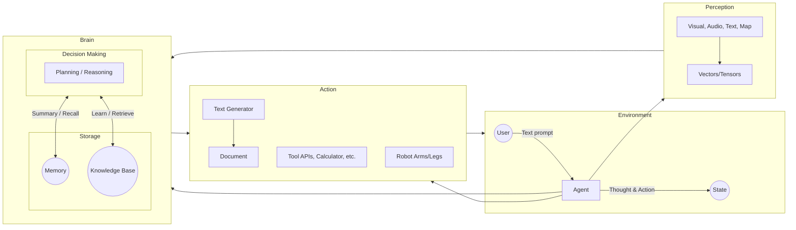
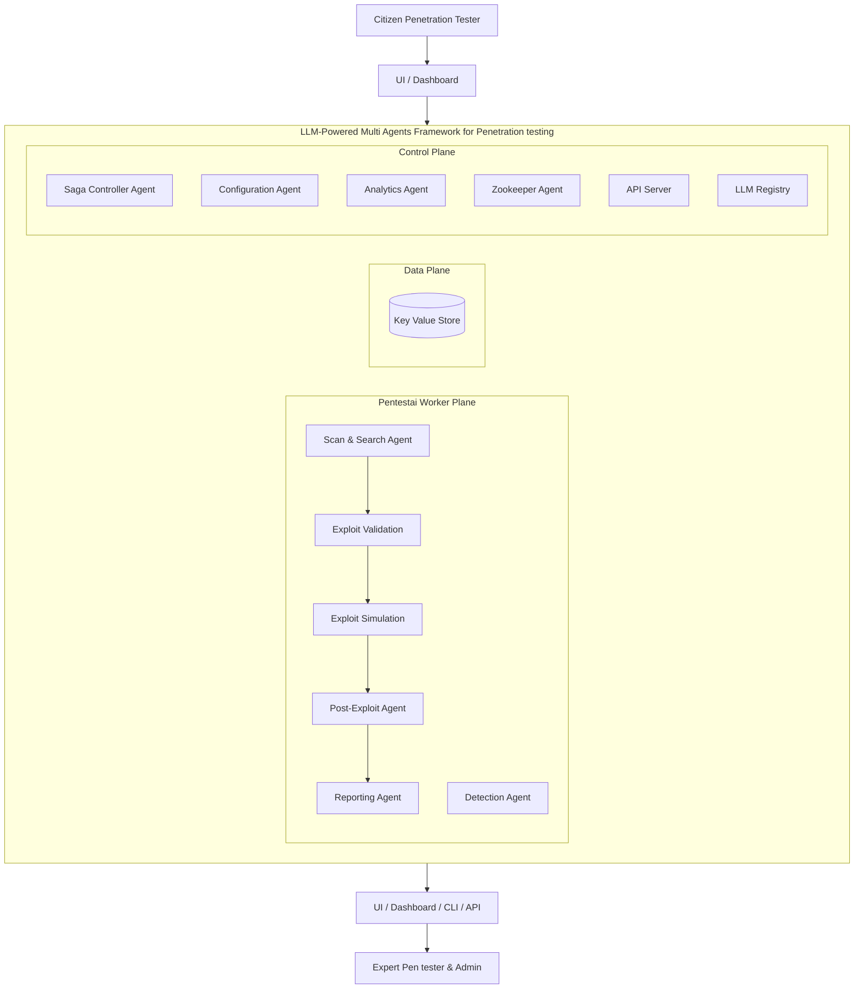
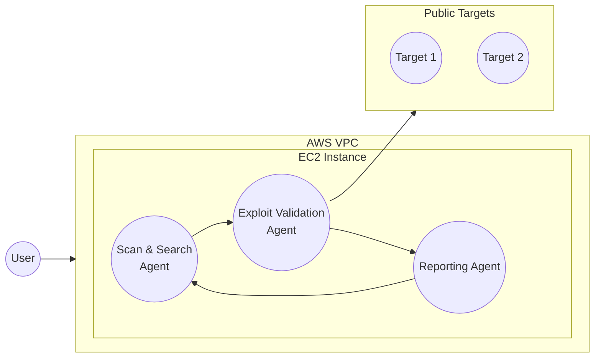

2024 IEEE International Conference on Cyber Security and Resilience (CSR) Workshops 

# PENTEST-AI, an LLM-powered multi-agents framework for penetration testing automation leveraging MITRE ATTACK 

Stanislas G. Bianou _Independent Researcher_ Ashburn, VA, USA gbianou@gmail.com 

Rodrigue G. Batogna _Computing Mathematical & Statistical Sciences School of Science University of Namibia_ Windhoek, Namibia rgnitchogna@unam.na 

**_Abstract_ — In the digital transformation era, the surge of better development technologies and citizen developers disrupted the space of innovation by increasing the number and complexity of applications used in production. This context prompts advanced cybersecurity measures and more frequent and thorough penetration testing to protect an organization's security posture. The scarcity of skilled expertise in cybersecurity today makes it challenging to cope with the evolving challenge and the growing demand. This paper introduces PENTESTAI, a novel framework for penetration testing automation using Large Language Model (LLM)-powered agents leveraging the MITRE ATTACK knowledge base. The paper provides an overview of the current state of research on cybersecurity and LLM-powered agents, followed by a detailed description of PENTESTAI building blocks. A proof-of-concept implementation is discussed to validate the framework's core constructs. The paper concludes with suggestions for future research directions to achieve the highest level of penetration testing automation with average skilled human-agent collaboration and to create citizen penetration testers.** 

#### **_Keywords— Cybersecurity, penetration testing, automation, vulnerabilities, AI, Large Language Models, AI Agents, MITRE ATTACK, Citizen penetration tester_** 

### I. INTRODUCTION 

It is no longer a secret that we are in the middle of a digital revolution drastically transforming various industries and sectors [1]. Business individuals using low-code or no-code tools in this new era can also build enterprise applications. If this is good news for business teams, it spells trouble for cybersecurity professionals who now have to deal with an exponential number of applications to secure. Studies such as those by Shameli-Sendi et al. [2] have emphasized the importance of penetration testing in identifying potential security threats before malicious actors can exploit them. However, traditional penetration testing is primarily manual and labor-intensive. It heavily relies on the expertise of human testers, whose supply and availability grow slower than the number of applications, systems, and infrastructure that require protection. Moreover, the growing complexity and sophistication of cyber-attacks make it difficult for human experts to keep up with the learning pace to provide swift and 

appropriate responses to the actions of malicious agents. There is a need for more scalable and adaptable approaches to penetration testing and offensive cybersecurity techniques in general. 

The recent surge of Large Language Models (LLMs) and  LLM-powered AI Agents might be an opportunity to design and experiment with new multi-agent frameworks to enable autonomous and human-assisted penetration testing execution. Our objectives in this paper are the following: 

1. To propose a novel, modular, and extensible framework for penetration testing automation that leverages LLM 

and AI Agent capable of augmenting human expertise for penetration testing and paving the way to scalability. 

2. Implement a small proof-of-concept for the PENTESTAI framework. 

3. Discuss the results observed and determine future work required to achieve the highest level of penetration testing automation. 

The rest of the paper is structured as follows: An overview of previous work on automation for penetration testing is given in Section 2; we provide a brief review of the literature, covering an introduction to the MITRE-ATT&CK framework and a discussion of the current status of research on cybersecurity and LLM-powered AI agent frameworks. Section 3 describes PENTESTAI, the new framework we propose to automate penetration testing with multiple LLM-powered agents and some subsequent capabilities. In Section 4, we cover the proof of concept done to validate the core constructs of the proposed framework. Section 6 brings the work to a close and explores potential avenues for further research. 

## II. A BRIEF LITERATURE REVIEW 

Penetration testing is a common practice or procedure executed on a company’s applications and systems, following the company’s authorization, to identify potential vulnerabilities in the target applications or systems, assess the level of difficulty required to exploit those vulnerabilities, and take necessary corrective action to prevent bad actors from exploiting the 

763 Authorized licensed use limited to: IU University of Applied Sciences. Downloaded on October 20,2024 at 20:40:31 UTC from IEEE Xplore.  Restrictions apply. 

vulnerabilities [3][4][5]. Penetration testing, or pen tests, is essential to determine the target system or organization’s security posture. It is a crucial practice in cybersecurity, usually conducted in five main phases presented in the table below with the tools commonly used for each phase [4][7][8]: 

TABLE I. UMBRELLA PHASES FOR PENETRATION TESTING WITH COMMON TOOLS USED 

||**Pent**<br>|**est umbrellaphas**<br>|**es**<br>|
|---|---|---|---|
||**_Pre-Exploitation_**<br>**_Phase_**|**_Exploitation_**<br>**_phase_**|**_Post exploitation_**<br>**_phase_**|
|Descrip<br>tion|The attacker or the<br>tester collects data<br>from public source<br>or<br>from<br>direct<br>integration<br>to<br>determine potential<br>targets.|Tester attempt<br>to exploit the<br>weakness<br>to<br>gain<br>unauthorized<br>access|Testers attempt<br>to maintain<br>access and gather<br>as much<br>information as<br>possible, then<br>covering tracks|
|Exampl<br>e<br>of<br>tools|Nmap, Nessus, Burp<br>Suite , Metasploit,<br>etc..|Multiple tools<br>based on<br>target’s OS|Multiple tools<br>based on target’s<br>OS|


The MITRE ATT&CK framework provides a comprehensive breakdown of the tactics, techniques, and procedures (TTPs) malicious actors employ during real-world cyberattacks. This framework organizes these malicious activities into 14 tactical groups, each representing a different stage of the attack lifecycle. These stages include **reconnaissance** (gathering information), **resource development** (establishing resources for the attack), **initial access** (breaching the target network), **execution** (running malicious code), **persistence** (maintaining access to compromised systems), **privilege escalation** (gaining higherlevel system permissions), **defense evasion** (evading detection), credential access (stealing login credentials), **discovery** (exploring the target environment), **lateral movement** (moving within the network to compromise additional systems), **collection** (gathering valuable data), **command and control** (establishing communication with compromised systems), **exfiltration** (stealing data), and **impact** (disrupting or destroying systems and data). Each tactic is further detailed with numerous techniques and procedures illustrating attackers' specific methods. The framework outlines over 235 techniques that can be executed across various platforms (Windows, macOS, Azure, etc.) using different tools and methodologies [9]. 

Malicious actors or black hat hackers constantly develop new tools. In Bianco’s pyramid of pain [11], he explains that TTPs are “tough” to execute by black hat hackers when controls around the vulnerabilities exploited by TTPs are implemented. Zych et al. study makes a mapping between CVE (Common Vulnerabilities and Exposures) and techniques that exploit them [10]. By mapping the hundreds of techniques to the hundreds of CVEs and considering the multitude of platforms and operating systems currently used in organizations of various natures, it became apparent that manual penetration testing is no longer enough to mitigate organization security exposure risks. 

However, the automation of penetration is not a revolutionary idea and has been studied by many researchers who approached the problem from different angles. Artificial Intelligence and Reinforcement Learning, Deep reinforcement 

learning, and non-AI multi-agent systems have been studied the most by those researchers [12][13][14][15]. Short of providing a complete solution to the problem, the merit of previous work by researchers was to validate the hypothesis that a future where automated penetration testing can offload human testers while providing scalable and accurate methods to secure organization assets is possible. 

The surge of large language models (LLMs) and generative AI-powered models has ushered in a new wave of research and experimentation in cybersecurity. Kucharavy et al. provide a detailed analysis of LLMs and strategic directions to integrate LLMs in cybersecurity [16]. Xi et al. provide a general conceptual framework for LLM-based agents tailored for different applications and scenarios. The framework has been very influential in the research community and has three main parts. The **perception** , whose role is to convert multimodal information (text, audio, video, etc..) into an understandable representation for the agent. The **brain** relies on selected models to engage in information-processing activities such as thinking, decision-making, and operations with storage, including memory and knowledge. The **action** is executed with the assistance of tools and impacts its surroundings. 





**Figure 1: Construction of LLM-Powered Agents [18]** 

Talebirad et al. centered their research on models such as auto-GPT and babyAGI to illustrate how agents can work together to solve problems in different domains [18]. Händler[19] builds on the work done by Talebirad et al. and proposes an LLM-powered agent architecture specification where the essential concepts of **autonomy** and **alignment** for multi-agent systems are introduced. Autonomy is defined as the ability of multi-agent systems to fulfill the goals they were designed for through self-organized strategies and ask execution. Autonomy has three levels: **static** , **adaptative** , and **self-organized** . **Alignment** is the ability to ensure the AI agents’ behavior aligns with human intentions, values, and goals [19]. The matrix below proposed a potential combination of autonomy and alignment that can be adopted based on the multiagent system use case that is being implemented. 

764 Authorized licensed use limited to: IU University of Applied Sciences. Downloaded on October 20,2024 at 20:40:31 UTC from IEEE Xplore.  Restrictions apply. 


| Levels of Autonomy & Alignment | L0: Static | L1: Adaptive | L2: Self-Organizing |
| :--- | :--- | :--- | :--- |
| **L2: Real-time Responsive** | 3. User-Supervised Automation | 6. User-Collaborative Adaptation | 9. User-Responsive Autonomy |
| **L1: User-Guided** | 2. User-Guided Automation | 5. User-Guided Adaptation | 8. User-Guided Autonomy |
| **L0: Integrated** | 1. Rule-Driven Automation | 4. Pre-Configured Adaptation | 7. Bounded Autonomy |


**Figure 2: Autonomy and Alignment Balancing Matrix for LLM-Powered Agents [19]** 

We found the idea of aligning the agents' actions to the goals of humans very relevant for cybersecurity use cases in general or, more specifically, for penetration testing. It will make sense to design our framework for **User-Guided Adaptation** . The latter means that the framework we will propose for penetration testing automation should be able to adapt its operations based on predefined parameters and allow the users to guide the system behavior within a predefined structure [19]. 

Given the state of research in penetration testing and LLMs presented above, our goal in the following section is to propose an LLM-powered multi-agent framework with the right balance of autonomy and alignment, capable of enabling efficient human-agent collaboration for penetration testing automation at scale. 

## III. PENTESTAI, THE PROPOSED LLM-POWERED MULTI-AGENT FRAMEWORK FOR PENETRATION 

### TESTING AUTOMATION 

At this stage, the main questions to answer for our agent composition framework for penetration testing automation are the following: 

1. What are the necessary agent roles that should be included in the framework? 

2. How do we ensure that each agent runs with the optimal brain (LLM models) that will enable it to fulfill its role in this agent penetration testing framework? 

3. What are the right tools and skills that should be implemented to allow them to perform the actions they are expected to perform? 

4. How will the control, the optimization, and the scaling of the agents be achieved? 

Similarly to the thought process used in decomposing monolith systems into microservices, a breakdown and decomposition of the penetration testing domain was required to answer the questions above. To that end, the three matrices (Enterprise, Mobile, and Industrial Control Systems)  of MITRE ATT&CK framework v 15.1 were analyzed to group the tactics, techniques, and tools commonly used by penetration testing practitioners in three umbrella phases for penetration testing: **the pre-exploitation phase** , **the exploitation phase,** and **the postexploitation phase** . The following Figure 3  provides a summary of that analysis. 


*(Image omitted: Consolidated MITRE ATT&CK matrices. The table is extremely large and categorizes tactics into Pre-Exploitation, Exploitation, and Post-Exploitation.)*


**Figure 3: Consolidated MITRE ATT&CK matrices, including Enterprise, Mobile, and ICS information, with tactics grouped by penetration testing umbrella phases** 

Analyzing and regrouping MITRE ATT&CK tactics helped us, on the one hand, to determine the type of agents required in our framework and, on the other hand, to determine the number and type of skills or tools the agent would need. Our analysis revealed about 405 techniques described across the three matrices of MITRE ATT&CK v 15.1. This might suggest that we will need to develop 405 tools across multiple platforms ( Windows, MacOS, iOS, Android, etc.. ) to be able to give our agents the skills they need to automate the penetration testing. Still, the similarities in some techniques can provide opportunities to reuse the code developed across multiple techniques. We propose the architecture below for our framework: 

765 Authorized licensed use limited to: IU University of Applied Sciences. Downloaded on October 20,2024 at 20:40:31 UTC from IEEE Xplore.  Restrictions apply. 





**Figure 4: PENTESTAI Framework Conceptual Architecture** 

The framework identifies three fundamental categories of users( **citizen penetration testers** , **expert penetration testers,** and **administrators** ) and comprises three planes ( **worker plane** , **data plane,** and **control plane** ). Each plane consists of two types of agents (worker agents and control agents) and has some supporting capabilities (API Server, LLM Registry, and Key-Value Store) that help the different types of agents fulfill their roles. A brief description of each of the building blocks of the framework is provided below, starting with the planes, the key user roles, then the agents and the supporting capabilities: 

**The PENTESTAI worker plane** consists of five agents that execute specific tasks during the penetration testing session. Multiple penetration tests can be executed simultaneously, so each will be managed and monitored within the worker plane group. 

**The data plane** deals with storing and retrieving data and files generated or consumed during penetration testing execution. It also supports the analytics and LLM finetuning tasks that should be carried out within the framework. 

**The control plane** has all the agents and capabilities that should ensure the proper functioning of the overall framework. 

Citizen penetration testers are regular IT system administrators or other IT resources with little to no expertise in cybersecurity in general or penetration testing in particular. They interact with the framework to input their testing needs via a web user interface or a mobile application and review results, recommendations, and a dashboard. 

**Expert penetration testers and administrators** who are people knowledgeable in penetration testing and artificial intelligence. They understand the PENTESTAI framework and can approve validation for agents’ tasks when applicable. They can access and analyze data produced by the control plane via a web user interface or a command line interface; they can make decisions and recommendations to improve the framework’s performance. 

As discussed in the previous section, each agent in the framework will have a set of custom-built tools and skills required to perform its jobs and execute MITRE ATT&CK techniques. As an example, in the pre-exploitation phase of the penetration testing, the Scan and Search agent might need to have a **scan_and_search_tool** built with Python libraries such as **python3-nmap** or **py-nessus-pro** that provide programmatic access to Nmap and Nessus, two popular tools used by expert penetration tester to gather data about the target system and determine the next in the penetration testing[4]. The agent’s performance will rely on the finetuned LLMs they will use for their tasks and the efficient design and development of the hundreds of tools and skills needed to mimic expert techniques as documented in the MITRE ATT&CK framework. In the following paragraphs, we provide a brief statement on the role and capabilities of each of the agents in the proposed PENTESTAI framework. 

**The Scan and Search Agent (SSA):** This worker agent will intervene during the pre-exploitation phase of penetration testing, and its role will be to implement the critical techniques in the resource development and reconnaissance tactics of the MITRE Framework. The agent will be able to determine the right tools and techniques based on the objectives of the penetration testing session, the target platforms (Windows, MacOS, Android, iOS, etc..), and the context of that session (Enterprise, Mobile, or ICS ). 

**The Exploit Validation Agent (EVA):** this worker agent’s activities fall within the exploitation phase of penetration testing. It will analyze the data collected by the scanning and search Agent and scan vulnerability databases to identify vulnerabilities by severity and exploits that might be possible to execute on the target system. 

**The Exploit Simulation Agent (ESA):** This worker agent also participates in the exploitation phase of the penetration testing session. Its role builds on that of the exploit validation agent. The ESA analyzes each possible exploit and determines which can be executed without causing collateral damage to the target. It will then create the exploit payload and execute the exploit techniques following human validation. 

**The Post-Exploitation Agent (PEA):** as its name indicates, this agent is part of the post-exploitation phase of the PENTESTAI framework. Given the hundreds of possible postexploitation techniques, this agent will have an extensive set of 

766 Authorized licensed use limited to: IU University of Applied Sciences. Downloaded on October 20,2024 at 20:40:31 UTC from IEEE Xplore.  Restrictions apply. 

tools built for it. It will continue the work of the exploit simulation agent. For the exploits executed in the previous phase, this agent will test the execution of the post-exploitation payload using multiple techniques referenced in the MITRE ATT&CK framework. It will save the relevant data in the keyvalue store for reporting. 

**The Reporting Agent (RA):** This worker agent should always be invoked at the final step of a penetration testing session. Its inputs will be the data collected and generated by the previous worker agents. The agent will use these inputs to compile a penetration testing session summary report. Additionally, it will use the knowledge of the cybersecurity field from its assigned LLM to provide recommendations to address all the vulnerabilities reported. 

**The Detection Agent (DA):** the MITRE ATT&CK framework documents the various techniques black hat hackers use and provides methods for detecting when an exploit payload was executed on a target. The detection agent is a worker agent that can be run in standalone mode and implements all the skills to detect attacks on a target. Tasks can be delegated to the reporting agent to report on issues detected on a target and recommend actions. 

The five worker agents introduced above will execute the functional tasks required to complete each penetration testing session. For these agents to fulfill those functional duties at scale,  optimally, and with the right balance between autonomy and alignment, control agents and additional capabilities are required. We describe them below: 

**The Configuration Agent (CA):** This worker agent will need configuration input to complete their tasks. The role of this control agent will be to provide all the configurations that worker agents need to execute their functions. Configurations will include but will not be limited to items such as the right finetuned LLM for the tasks of the worker agent, the API keys for that model if an external provider hosts the model, and the key parameters to use for the model. The configuration agent will also leverage the key-value store to track and learn from the configurations used in the past penetration testing sessions to optimize the configurations allocated to worker agents during future penetration testing sessions. As part of the control plane of the PENTESTAI framework, we proposed an optional **LLM registry** capability where all the finetuned LLMs (SecurityBERT, CyBERT, SecurityGPT, Falcon LLM, CybertCPT, and new ones to come) used for penetration testing can be stored. An alternative registry, such as HuggingFace, could also provide this capability. Another important capability of this agent will be to benchmark the performance of different models used and include the result of those benchmarks in the model allocation decisions. 

**The Saga Controller Agent (SCA):** This agent’s role is rooted in the saga pattern, which is very prominent in microservices designs. Penetration testing is a very sequential process in nature; the saga controller agent will have the responsibility to control the flow of the execution of the tasks required in each penetration testing session. It will also allow a logical grouping of the activities of worker agents in a way that could enable effective monitoring and troubleshooting. The saga 

controller will also use the key-value store to save importation data and metadata about each penetration testing run. 

**The Analytics Agent (AA):** This control agent will focus on using the data saved in the key-value store by other agents to compile aggregations for the dashboard. 

**The Zookeeper Agent (ZA):** Being able to understand and observe in real time the state of each agent, the human or system prompt received, and the output returned and being able to take necessary actions on agents to prevent endless loops during the penetration testing execution is a crucial function required for PENTESTAI framework to scale. The zookeeper agent is the control agent that will play that role. The agent will receive detailed traces of the execution of each agent and saga controller, consolidate the traces for each penetration testing run, and make decisions to start, stop, restart agents, restart a saga, or perform any other action required to maintain the performance and integrity of the framework as a whole. 

**The API server:** This is a required capability that will support the command-line interface (CLI) interaction and the integration of the PENTESTAI framework with other frameworks or solutions. 

**The LLM Registry:** As mentioned previously, the LLM Registry is an optional capability. PENTESTAI should be able to operate with third-party LLM repositories. 

**The Key-Value Store:** The key-value store is an important capability that will extend the memory of the agents and give memory to the framework as a whole. All metadata related to agents, their configuration, their context, their various execution sessions, etc., should be kept in the store. It will serve as a single source of truth for the state of agents and systems. The control plane will use the agent state data to initiate actions required to maintain the whole system in a good state. 

The framework described above provides an innovative approach to tackling penetration testing and the lack of skilled resources in that space. However, the question of its feasibility remains to be answered. 

## IV. IMPLEMENTATION PROTOTYPE 

To assess the possibility of implementing the PENTESTAI framework, we developed a prototype with a minimal scope to validate the concepts and building blocks of the proposed framework. We implemented the simplified penetration testing flow with three agents ( **Scan & Search Agent, Exploit validation Agent** , and **Reporting Agent** ). Given the rapid progress of generative AI in recent years, many multi-agent development frameworks have been released (Autogen, CrewAI, etc.) We decided to experiment with CrewAI because of its very intuitive architecture. CrewAI architecture is based on agents that are part of a **crew** or **multiple crews** . Agents can be assigned **tools** , and **tasks** can be created to indicate what agents should do and what tools they should use. CrewAI architecture was a good fit for our framework, and because it is built on top of Langchain, the integration with observability tools such as LangSmith could be seamless. It could be a solid 

767 Authorized licensed use limited to: IU University of Applied Sciences. Downloaded on October 20,2024 at 20:40:31 UTC from IEEE Xplore.  Restrictions apply. 

foundation for implementing the control plane of the PENTESTAI framework. 

We developed two custom tools, **ScanAndSearchTool** and **ExploitValidationTool** , in the form of Python classes with multiple methods using Python libraries, allowing programmatic emulation of Nmap command with the options to either scan subnets to discover potential targets or to scan targets to find possible vulnerabilities. The **ScanAndSearchTool** produces a JSON file named **comprehensive_scan_results.json** with all the information gathered with the MITRE ATT&CK reconnaissance techniques implemented in the tool. The **ExploitValidationTool** takes the file created by **ScanAndSearchTool** , and after executing the exploitation techniques implemented in the tool, it returns another JSON file named **vulnerability_report.json** with all the identified vulnerabilities. 

We intentionally did not develop a reporting tool for this proof of concept. We decided to proceed as such to test the cybersecurity knowledge of the **GPT4o** , which Ferrag et al. identified as the highest-performing model for cybersecurity tasks [26]. So, natural language instructions were provided to the reporting agent, asking it to take the two JSON files mentioned above and produce a summary report of the penetration testing session. 

We set up a straightforward test environment, presented in Figure 5 below. It consists of an EC2 instance in the AWS cloud where our agents were deployed and publicly available targets ( scanme.namp.org and pentest-ground.com  ) on which our penetration test sessions were executed. 





**Figure 5: PENTESTAI  proof of concept environment** 

Figure 6 shows snippets of the pre-exploitation phase of our penetration testing test. We see how the ScanAndSearchTool and the ExploitValidationTool are initialized, and the agents and the tasks they execute are displayed on screen. At the end of the task execution, the agent displays a completion message, and the next agent starts his job. 


```text
(pentest-agents) [ec2-user@ip-... pentestai]$ python pentestai_crew.py
Initializing Advanced ScanAndSearchTool...
Nmap initialized successfully.
Initializing ExploitValidationTool...
Nmap initialized successfully.
[2024-06-29 11:35:56][DEBUG]: == Working Agent: Scanner and Searcher
[2024-06-29 11:35:56][INFO]: == Starting Task: Identify all the targets in the range provided...

> Entering new CrewAgentExecutor chain...
I need to use the Advanced Penetration testing resource development and reconnaissance tool...

Action: Advanced Penetration testing resource development and reconnaissance tool
Action Input: {"input_targets": ["scanme.nmap.org"]}
Starting comprehensive scan for targets: ['scanme.nmap.org']
Parsing input targets...
Parsed targets: ['scanme.nmap.org']
Scanning target: scanme.nmap.org
Scan completed for scanme.nmap.org in 13.99 seconds
Comprehensive scan completed. Processing results...
Converting comprehensive results to JSON...
Writing comprehensive results to file: penttestai_session_files/comprehensive_scan_results.json
Comprehensive results successfully written to penttestai_session_files/comprehensive_scan_results.json

Pre-exploitation first step completed
```


**Figure 6: Pre-exploitation phase – Scan And Search Agent’s output snippet** 

Figure 7 provides a snapshot of the Exploit validation phase. We can see how the agent indicates the tool it will use and the input file generated in the previous step. At the completion, the agent also displays a completion message. 


```text
> Entering new CrewAgentExecutor chain...
I need to use the Exploit Validation and Vulnerability Assessment Tool to scan each open port on each host for vulnerabilities.

Action:
Exploit Validation and Vulnerability Assessment Tool

Action Input:
{
  "comprehensive_results_file": "comprehensive_results.json"
}
Starting vulnerability validation...
Checking vulnerabilities for 45.33.32.156 on ports 22, 80, 9929, 31337
Vulnerability report saved to penttestai_session_files/vulnerability_report.json

Exploit Validation step completed
```


**Figure 7:Exploit Validation phase- Exploit Validation Agent’s outputs snippet.** 

Figure 8 below shows a capture of the report generated by the reporting agent. Similarly to what was observed for the previous agents, at the beginning of its work, the agent states its name, the task it will execute, and the input files it will use to execute the tasks. Then, it provides summary statistics on the hosts targeted during the penetration testing session, a summary of the vulnerabilities identified per port, and the recommended actions to correct those vulnerabilities. Despite relying only on the **GPT 4.o** model and not having a custom tool built for the report creation task, the reporting agent could analyze the input files efficiently and automatically provide sound recommendations for each vulnerability identified on the target hosts. This is very promising and confirms Ferrag et al. [26] observations on GPT 4.o cybersecurity knowledge. 

768 Authorized licensed use limited to: IU University of Applied Sciences. Downloaded on October 20,2024 at 20:40:31 UTC from IEEE Xplore.  Restrictions apply. 


```text
[2024-06-29 11:42:07][DEBUG]: == Working Agent: Report Creator
[2024-06-29 11:42:07][INFO]: == Starting Task: Prepare a consolidated report for the penetration testing session...

> Entering new CrewAgentExecutor chain...
I now can give a great answer

Final Answer:
# Penetration Testing Session Report

## Summary Statistics

- Total time taken for the full test: 45 minutes

### Targets Scanned

| Host IP Address | Host Name | Host OS Name and Version | Total Number of Open Ports |
|-----------------|-----------|--------------------------|----------------------------|
| 192.168.1.1     | scanme    | Linux 2.6.0              | 5                          |
| 192.168.1.2     | scanme    | Windows 10               | 3                          |

... (vulnerabilities and recommendations follow)
```


**Figure 8: Post-Exploitation phase, Report generation** 

## V. CONCLUSION 

In this paper, we presented the context of digital transformation, the acceleration in software production that it entails, and the additional demand it generates for the cybersecurity and penetration testing field, which already suffers from a scarcity of resources. Our initial hypotheses were that the rapid progress in artificial intelligence, generative AI, and large language models could provide a new opportunity to develop automated and innovative solutions amidst a high expertise threshold and low resource availability currently faced by organizations for penetration testing and other cybersecurity activities. 

In the literature review we conducted, interesting work previously completed with various automation approaches proposed for penetration testing had already identified the need to find a more scalable solution with less dependency on human experts. However, they cannot be anchored on reference frameworks or knowledge bases such as MITRE ATT&CK and have yet to explore the potential of LLMs and LLM-powered agents as key building blocks for the solution. We introduced PENTESTAI, a new LLM-powered multi-agent framework made of a crew of agents equipped with tools and skills reference in MITRE ATT&CK and working under the supervision of a well-designed control plane. A mini proof-ofconcept of the framework was implemented, and the main ideas at the center of the framework were validated; some limitations and future work required were identified. 

There are three major areas where more work is required to turn PENTESTAI into a production-ready framework supporting citizen penetration testers in evaluating the security poster of their applications or their infrastructure: 

**Model finetuning** : Despite showing an acceptable level of knowledge in cybersecurity, GPT 4.o, the LLM assigned to all the agents during the proof-of-concept, generated some hallucinations in the results produced during a few penetration testing sessions. It will be necessary to work on finetuning either the foundations model or some existing cybersecurity models to ensure their knowledge is tailored to the tasks they are assigned in the framework and to ensure they can provide remediation compliant to all relevant standards, including  MITRE / NIST Standards for enumeration and risk analytics. 

**Library development** : In our analysis of MITRE ATT&CK techniques, we counted about 405. They come in the form of command lines, scripts, and software packages executable in different platforms and operating systems. More work will be required to develop libraries in Python or other languages that can be used to implement the skills and tools to assign to agents described in the PENTESTAI framework. 

**Control Plane realization** : The agents and capabilities described in the control plane of the framework were not part of the scope of the proof-of-concept realization. Additional work will be required to validate the concept described in the control plane. 

**Zero-day exploit capability:** The framework currently does not allow for the uncovering of zero-day vulnerabilities. Adding that capability requires the addition of a Reverse Engineering Agent (REA) that will work with an LLM optimized for decompiling binary and capable of invoking API or scripts from commonly used reverse engineering tools. Additional work is required to assess the efficiency of LLMs in decompiling tasks for various platforms and languages. 

This paper achieves its goals by providing a solid and viable foundation for future research aiming to automate penetration testing and other cybersecurity skills by leveraging LLMpowered multi-agent systems. 

### REFERENCES 

- [1] M. Bishop, "About Penetration Testing," *IEEE Security & Privacy*, vol. 5, no. 6, pp. 84-87, Nov.-Dec. 2007. doi: 10.1109/MSP.2007.159. 

- [2] A. Shameli-Sendi, M. Cheriet, and H. Bouarab, "Taxonomy of intrusion risk assessment and response system in cloud computing," *J. Netw. Comput. Appl.*, vol. 66, pp. 1-16, 2016. 

- [3] M. T. Muzhanova, "Analysis of modern tools for penetration testing," Sučasnij zahist ìnformacìï, undefined, 2022. doi: 10.31673/24097292.2023.020005. 

- [4] D. Kongara, "A Process of Penetration Testing Using Various Tools," 2023. doi: 10.58496/mjcs/2023/014. 

- [5] Y. S. Lim and V. Selvarajah, "Security Assurance through Penetration Testing," 2022. doi: 10.1109/ICMNWC56175.2022.10031663. 

- [6] N. A. O. Alkaabi, H. A. Almenhali, and R. A. Ikuesan, "A Methodical Framework for Conducting Reconnaissance and Enumeration in the Ethical Hacking Lifecycle," undefined, 2023. doi: 10.34190/eccws.22.1.1438. 

- [7] N. A. O. Alkaabi, H. A. Almenhali, and R. A. Ikuesan, "A Methodical Framework for Conducting Reconnaissance and Enumeration in the Ethical Hacking Lifecycle," undefined, 2023. doi: 10.34190/eccws.22.1.1438 

- [8] Anonymous, "Maximizing Penetration Testing Success with Effective Reconnaissance Techniques using ChatGPT," undefined, 2023. doi: 10.22541/au.167947026.68710739/v1. 

769 Authorized licensed use limited to: IU University of Applied Sciences. Downloaded on October 20,2024 at 20:40:31 UTC from IEEE Xplore.  Restrictions apply. 

- [9] N. Lasky, B. Hallis, M. Vanamala, R. Dave, and J. Seliya, "Machine Learning Based Approach to Recommend MITRE ATT&CK Framework for Software Requirements and Design Specifications," ArXiv, abs/2302.05530, 2023. https://doi.org/10.48550/arXiv.2302.05530. 

- [10] M. Zych, M. Ussath, J. Sander, and C. Rossow, "Enhancing the STIX Representation of MITRE ATT&CK for Group Filtering and Technique Prioritization," ArXiv, abs/2204.11368, 2022. https://doi.org/10.48550/arXiv.2204.11368 

- [11] D. J. Bianco, "The Pyramid of Pain," Detect Respond, 18-Mar-2013. [Online]. Available: https://detect-respond.blogspot.com/2013/03/thepyramid-of-pain.html. [Accessed: 14-Jun-2024] 

- [12] Y. Tyagi, S. Shekhar, A. P and S. Bhardwaj, "SEEMA: An Automation Framework for Vulnerability Assessment and Penetration Testing," 2023 2nd International Conference on Vision Towards Emerging Trends in Communication and Networking Technologies (ViTECoN), Vellore, India, 2023, pp. 1-5, doi: 10.1109/ViTECoN58111.2023.10157032. 

- [13] М. Rakhmonova, "Intelligent Automated Penetration Testing Using Reinforcement Learning to Improve the Efficiency and Effectiveness of Penetration Testing," 2022. Available from: 10.1007/978-3-031-344978_3. 

- [14] A.T. Nguyen, T. T. H. Nguyen, and T. T. S. Nguyen "Leveraging Deep Reinforcement Learning for Automating Penetration Testing in Reconnaissance and Exploitation Phase," 2022. Available from: 10.1109/rivf55975.2022.10013801. 

- [15] Y. Zhang, J. Liu, S. Zhou, D. Hou, X. Zhong, and C. Lu, "Improved Deep Recurrent Q-Network of POMDPs for Automated Penetration Testing," Applied Sciences, 2022. Available from: 10.3390/app122010339. 

- [16] A. Kucharavy et al., "Fundamentals of Generative Large Language Models and Perspectives in Cyber-Defense," ArXiv, abs/2303.12132, 2023. https://doi.org/10.48550/arXiv.2303.12132 

   - [18] Y. Talebirad and A. Nadiri, "Multi-Agent Collaboration: Harnessing the Power of Intelligent LLM Agents," ArXiv, abs/2306.03314, Jun. 2023. [Online]. Available: https://doi.org/10.48550/arXiv.2306.03314 

   - [19] T. Händler, "Balancing Autonomy and Alignment: A Multi-Dimensional Taxonomy for Autonomous LLM-powered Multi-Agent Architectures," ArXiv, abs/2310.03659, Oct. 2023. [Online]. Available: https://doi.org/10.48550/arXiv.2310.03659 

   - [20] G. Eason, B. Noble, and I. N. Sneddon, “On certain integrals of LipschitzHankel type involving products of Bessel functions,” Phil. Trans. Roy. Soc. London, vol. A247, pp. 529–551, April 1955. _(references)_ 

   - [21] J. Clerk Maxwell, A Treatise on Electricity and Magnetism, 3rd ed., vol. 2. Oxford: Clarendon, 1892, pp.68–73. 

   - [22] I. S. Jacobs and C. P. Bean, “Fine particles, thin films and exchange anisotropy,” in Magnetism, vol. III, G. T. Rado and H. Suhl, Eds. New York: Academic, 1963, pp. 271–350. 

   - [23] Y. Yorozu, M. Hirano, K. Oka, and Y. Tagawa, “Electron spectroscopy studies on magneto-optical media and plastic substrate interface,” IEEE Transl. J. Magn. Japan, vol. 2, pp. 740–741, August 1987 [Digests 9th Annual Conf. Magnetics Japan, p. 301, 1982]. 

   - [24] M. Young, The Technical Writer’s Handbook. Mill Valley, CA: University Science, 1989. 

   - [25] <u>M. A. Ferrag, O. Friha, D. Hamouda, L. Maglaras, and H. Janicke,</u> "Revolutionizing Cyber Threat Detection with Large Language Models: A privacy-preserving BERT-based Lightweight Model for IoT/IoT Devices," _arXiv_ , vol. abs/2306.14263, 2023. [Online]. Available: https://doi.org/10.48550/arXiv.2306.14263 

   - [26] M. A. Ferrag, F. Alwahedi, A. Battah, B. Cherif, A. Mechri and N. Tihanyi, "Generative AI and Large Language Models for Cyber Security: All Insights You Need". 

- [17] Z. Xi et al., "The Rise and Potential of Large Language Model Based Agents: A Survey," ArXiv, abs/2309.07864, 2023. https://doi.org/10.48550/arXiv.2309.07864 

770 Authorized licensed use limited to: IU University of Applied Sciences. Downloaded on October 20,2024 at 20:40:31 UTC from IEEE Xplore.  Restrictions apply. 

