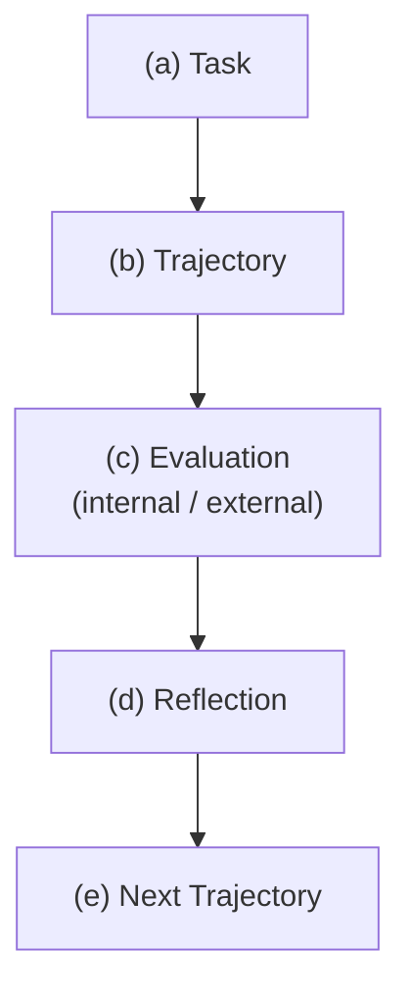
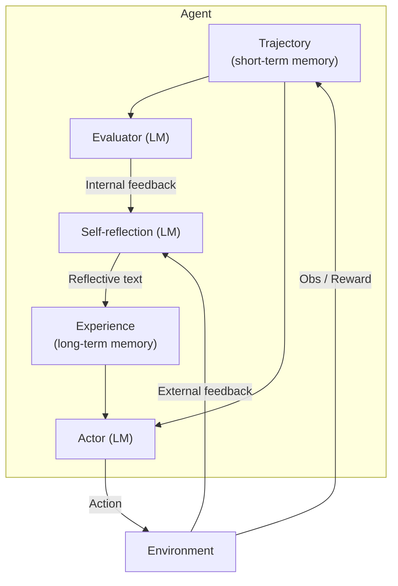
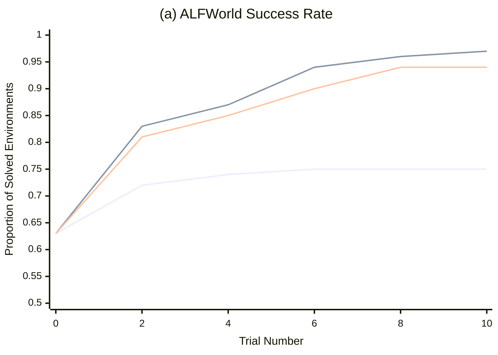
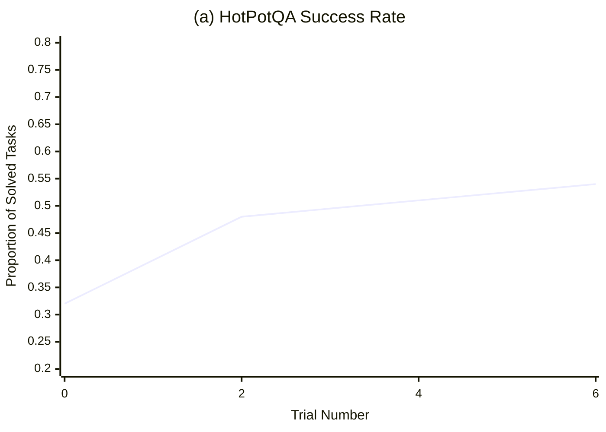
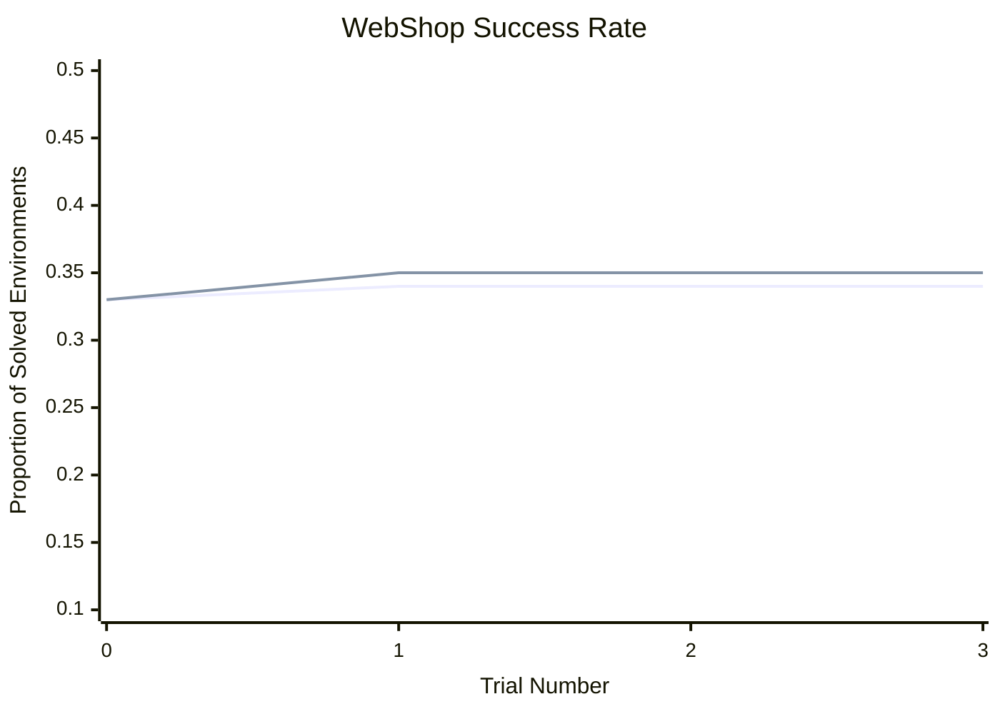

# **Reflexion: Language Agents with Verbal Reinforcement Learning** 

**Noah Shinn** 

Northeastern University `noahshinn024@gmail.com` 

### **Federico Cassano** 

Northeastern University `cassano.f@northeastern.edu` 

### **Edward Berman** 

Northeastern University `berman.ed@northeastern.edu` 

### **Ashwin Gopinath** 

Massachusetts Institute of Technology `agopi@mit.edu` 

**Karthik Narasimhan** Princeton University `karthikn@princeton.edu` 

**Shunyu Yao** Princeton University `shunyuy@princeton.edu` 

## **Abstract** 

Large language models (LLMs) have been increasingly used to interact with external environments (e.g., games, compilers, APIs) as goal-driven agents. However, it remains challenging for these language agents to quickly and efficiently learn from trial-and-error as traditional reinforcement learning methods require extensive training samples and expensive model fine-tuning. We propose _Reflexion_ , a novel framework to reinforce language agents not by updating weights, but instead through linguistic feedback. Concretely, Reflexion agents verbally reflect on task feedback signals, then maintain their own reflective text in an episodic memory buffer to induce better decision-making in subsequent trials. Reflexion is flexible enough to incorporate various types (scalar values or free-form language) and sources (external or internally simulated) of feedback signals, and obtains significant improvements over a baseline agent across diverse tasks (sequential decision-making, coding, language reasoning). For example, Reflexion achieves a 91% pass@1 accuracy on the HumanEval coding benchmark, surpassing the previous state-of-the-art GPT-4 that achieves 80%. We also conduct ablation and analysis studies using different feedback signals, feedback incorporation methods, and agent types, and provide insights into how they affect performance. We release all code, demos, and datasets at `https://github.com/noahshinn024/reflexion` . 

## **1 Introduction** 

Recent works such as ReAct [30], SayCan [1], Toolformer [22], HuggingGPT [23], generative agents [19], and WebGPT [17] have demonstrated the feasibility of autonomous decision-making agents that are built on top of a large language model (LLM) core. These methods use LLMs to generate text and ‘actions‘ that can be used in API calls and executed in an environment. Since they rely on massive models with an enormous number of parameters, such approaches have been so far limited to using in-context examples as a way of teaching the agents, since more traditional optimization schemes like reinforcement learning with gradient descent require substantial amounts of compute and time. 

Preprint. Under review. 

In this paper, we propose an alternative approach called _Reflexion_ that uses verbal reinforcement to help agents learn from prior failings. Reflexion converts binary or scalar feedback from the environment into verbal feedback in the form of a textual summary, which is then added as additional context for the LLM agent in the next episode. This self-reflective feedback acts as a ‘semantic’ gradient signal by providing the agent with a concrete direction to improve upon, helping it learn from prior mistakes to perform better on the task. This is akin to how humans iteratively learn to accomplish complex tasks in a few-shot manner – by reflecting on their previous failures in order to form an improved plan of attack for the next attempt. For example, in figure 1, a Reflexion agent learns to optimize its own behavior to solve decision-making, programming, and reasoning tasks through trial, error, and self-reflection. 

Generating useful reflective feedback is challenging since it requires a good understanding of where the model made mistakes (i.e. the credit assignment problem [25]) as well as the ability to generate a summary containing actionable insights for improvement. We explore three ways for doing this – simple binary environment feedback, pre-defined heuristics for common failure cases, and self-evaluation such as binary classification using LLMs (decision-making) or self-written unit tests (programming). In all implementations, the evaluation signal is amplified to natural language experience summaries which can be stored in long-term memory. 

Reflexion has several advantages compared to more traditional RL approaches like policy or valuebased learning: 1) it is lightweight and doesn’t require finetuning the LLM, 2) it allows for more nuanced forms of feedback (e.g. targeted changes in actions), compared to scalar or vector rewards that are challenging to perform accurate credit assignment with, 3) it allows for a more explicit and interpretable form of episodic memory over prior experiences, and 4) it provides more explicit hints for actions in future episodes. At the same time, it does have the disadvantages of relying on the power of the LLM’s self-evaluation capabilities (or heuristics) and not having a formal guarantee for success. However, as LLM capabilities improve, we only expect this paradigm to get better over time. 

We perform experiments on (1) decision-making tasks to test sequential action choices over long trajectories, (2) reasoning tasks to test knowledge-intensive, single-step generation improvement, and (3) programming tasks to teach the agent to effectively use external tools such as compilers and interpreters. Across all three types of tasks, we observe Reflexion agents are better decisionmakers, reasoners, and programmers. More concretely, Reflexion agents improve on decision-making AlfWorld [24] tasks over strong baseline approaches by an absolute 22% in 12 iterative learning steps, and on reasoning questions in HotPotQA [28] by 20%, and Python programming tasks on HumanEval [6] by as much as 11%. 

To summarize, our contributions are the following: 

- We propose Reflexion, a new paradigm for ‘verbal‘ reinforcement that parameterizes a policy as an agent’s memory encoding paired with a choice of LLM parameters. 

- We explore this emergent property of _self-reflection_ in LLMs and empirically show that self-reflection is extremely useful to learn complex tasks over a handful of trials. 

- We introduce LeetcodeHardGym, a code-generation RL gym environment consisting of 40 challenging Leetcode questions (‘hard-level‘) in 19 programming languages. 

- We show that Reflexion achieves improvements over strong baselines across several tasks, and achieves state-of-the-art results on various code generation benchmarks. 

## **2 Related work** 

**Reasoning and decision-making** Self-Refine [15] employs an iterative framework for selfrefinement to autonomously improve generation through self-evaluation. These self-evaluation and self-improvement steps are conditioned on given task constraints, such as "How can this generation be written in a more positive way". Self-Refine is effective but is limited to single-generation reasoning tasks. Pryzant et al. [21] performs a similar semantic prompt-writing optimization, but is also limited to single-generation tasks. Paul et al. [20] fine-tune critic models to provide intermediate feedback within trajectories to improve reasoning responses. Xie et al. [27] use stochastic beam search over actions to perform a more efficient decision-making search strategy which allows the agent to use foresight advantage due to its self-evaluation component. Yoran et al. [31] and Nair et al. 

2 

<!-- Start of picture text -->
������������������ �������������� ������������ �������������������������������� ���� ������������������������������ ���� ���������������������������� ���� ���� ������ ���� ������������������������� ����������������������������������� �������������������������������� ����������������� �������������������������� ��������������� ������ ���������������������� ����� ������������������������������ ���� ������ ���������������������������� ����������������������� ����������������������� ���������� ��� � ����������������� ����� ��������������������������������� ����������������������������� ������ ��������������������������� �������������������� ��������� ����������������� ��� ����������������������� ����������� ������ �������������������������� ���� ���������� ����������������� �� ������������������������������ �� ������������������������� �� � ��������� �� ��������� ��������������� ������������������������ � ����������������������������������� ���� ������ ������������������������������������������ ������ ������������ �������������������� ������������������� ������������ ��������������� ��������������������������������������������������������� ������ ���������� �������������������������� ����� ��������������������������������� ������������������������� ����� ����������������������������� ������������ ���������� ���� ����� ������ ������������� ������������������� ����������� ��������������������������������������� ����� ������������������������������������������������ ����� ���������������������������������������������������������������� ������ �������������������� ������������������ <!-- End of picture text -->

Figure 1: Reflexion works on decision-making 4.1, programming 4.3, and reasoning 4.2 tasks. 

|Rela|ted work|on reason|ingand decision-m|aking|
|---|---|---|---|---|
|**Approach**|**Self** **refne**|**Hidde** **constrai**|**n** **Decision** **nts** **making**|**Binary** **Memory** **reward**|
|Self-refne [15]|✓|✗|✗|✗ ✗|
|Beam search [27] **Refexion (ours)**|✓ ✓|✓ ✓|✓ ✓|✓ ✗ ✓ ✓|
||Rela|ted work o|n programming||
|**Approach** **Test** **Test execution** **executi**|**De** **on**|**bugging**|**Self-generated** **tests**|**Multiple** **Self-refection** **languages**|
|AlphaCode[14] ✓||✗|✗|✓ ✗|
|CodeT[5] ✓||✗|✓|✗ ✗|
|Self-debugging [7] ✓||✓|✗|✗ ✗|
|CodeRL[12] ✓||✓|✗|✗ ✗|
|**Refexion (ours)** ✓||✓|✓|✓ ✓|

[16] use decider models to reason over several generations. Kim et al. [10] use a retry pattern over a fixed number of steps without an evaluation step. Goodman [9] perform a qualitative evaluation step that proposes optimizations to the previous generation. In this paper, we show that several of these concepts can be enhanced with _self-reflection_ to build a persisting memory of self-reflective experiences which allows an agent to identify its own errors and self-suggest lessons to learn from its mistakes over time. 

**Programming** Several past and recent works employ variations of test-driven development or code debugging practices. AlphaCode [14] evaluates a set of generations on hidden test cases. CodeT [5] uses self-generated unit tests that are used to score generated function implementations. Self-Debugging [7] employs a debugging component that is used to improve existing implementations given feedback from a code execution environment. CodeRL [12] sets the problem in an RL framework using an actor-critic setup to debug programs given feedback from an execution environment. AlphaCode, Self-Debugging and CodeRL are effective in fixing less-complex program bugs, but they rely upon ground truth test cases that invalidate pass@1 eligibility, and do not use self-reflection to bridge the gap between error identification and implementation improvement. CodeT does not access hidden test cases but does not implement a self-learning step to improve code writing. 

## **3 Reflexion: reinforcement via verbal reflection** 

We develop a modular formulation for Reflexion, utilizing three distinct models: an _Actor_ , denoted as _Ma_ , which generates text and actions; an _Evaluator_ model, represented by _Me_ , that scores the outputs produced by _Ma_ ; and a _Self-Reflection_ model, denoted as _Msr_ , which generates verbal reinforcement cues to assist the Actor in self-improvement. We provide a detailed description of each of these models and subsequently elucidate their collaborative functioning within the Reflexion framework. 

3 

<!-- Start of picture text -->
Algorithm 1  Reinforcement via self-reflection Agent Initialize Actor, Evaluator, Self-Reflection: External feedback Ma ,  Me ,  Msr Internal Self-reflection (LM) Reflective Initialize policy  πθ ( ai|si ),  θ =  {Ma, mem} feedback text Generate initial trajectory using  πθ Evaluate  τ 0 using  Me Evaluator (LM) Experience Generate initial self-reflection  sr 0 using  Msr (long-term memory) Set  mem ← [ sr 0] Set  t  = 0 Trajectory (short-term memory) Actor (LM) while  Me  not pass or  t <  max trials  do Generate  τt = [ a 0 , o 0 , . . . ai, oi ] using  πθ Evaluate  τt  using  Me Generate self-reflection  srt  using  Msr Obs / Reward Environment Action Append  srt  to  mem Increment  t end while return <!-- End of picture text -->

Figure 2: (a) Diagram of Reflexion. (b) Reflexion reinforcement algorithm 

**Actor** The Actor is built upon a large language model (LLM) that is specifically prompted to generate the necessary text and actions conditioned on the state observations. Analogous to traditional policy-based RL setups, we sample an action or generation, _at_ , from the current policy _πθ_ at time _t_ , receive an observation from the environment _ot_ . We explore various Actor models, including Chain of Thought [26] and ReAct [30]. These diverse generation models allow us to explore different aspects of text and action generation within the Reflexion framework, providing valuable insights into their performance and effectiveness. In addition, we also add a memory component _mem_ that provides additional context to this agent. This adaption was inspired by Brooks et al. [3], who suggest a policy iteration approach using in-context learning. Details on how this is populated are provided below. 

**Evaluator** The Evaluator component of the Reflexion framework plays a crucial role in assessing the quality of the generated outputs produced by the Actor. It takes as input a generated trajectory and computes a reward score that reflects its performance within the given task context. Defining effective value and reward functions that apply to semantic spaces is difficult, so we investigate several variants of the Evaluator model. For reasoning tasks, we explore reward functions based on exact match (EM) grading, ensuring that the generated output aligns closely with the expected solution. In decision-making tasks, we employ pre-defined heuristic functions that are tailored to specific evaluation criteria. Additionally, we experiment with using a different instantiation of an LLM itself as an Evaluator, generating rewards for decision-making and programming tasks. This multi-faceted approach to Evaluator design allows us to examine different strategies for scoring generated outputs, offering insights into their effectiveness and suitability across a range of tasks. 

**Self-reflection** The Self-Reflection model instantiated as an LLM, plays a crucial role in the Reflexion framework by generating verbal self-reflections to provide valuable feedback for future trials. Given a sparse reward signal, such as a binary success status (success/fail), the current trajectory, and its persistent memory _mem_ , the self-reflection model generates nuanced and specific feedback. This feedback, which is more informative than scalar rewards, is then stored in the agent’s memory ( _mem_ ). For instance, in a multi-step decision-making task, when the agent receives a failure signal, it can infer that a specific action _ai_ led to subsequent incorrect actions _ai_ +1 and _ai_ +2. The agent can then verbally state that it should have taken a different action, _a__′_ _i_, which would have resulted in_a′_ _i_ +1 and _a__′_ _i_ +2, and store this experience in its memory.In subsequent trials, the agent can leverage its past experiences to adapt its decision-making approach at time _t_ by choosing action _a__′_ _i_.This iterative process of trial, error, self-reflection, and persisting memory enables the agent to rapidly improve its decision-making ability in various environments by utilizing informative feedback signals. 

**Memory** Core components of the Reflexion process are the notion of short-term and long-term memory. At inference time, the Actor conditions its decisions on short and long-term memory, similar 

4 

to the way that humans remember fine-grain recent details while also recalling distilled important experiences from long-term memory. In the RL setup, the trajectory history serves as the short-term memory while outputs from the Self-Reflection model are stored in long-term memory. These two memory components work together to provide context that is specific but also influenced by lessons learned over several trials, which is a key advantage of Reflexion agents over other LLM action choice works. 

**The Reflexion process** Reflexion is formalized as an iterative optimization process in 1. In the first trial, the Actor produces a trajectory _τ_ 0 by interacting with the environment. The Evaluator then produces a score _r_ 0 which is computed as _rt_ = _Me_ ( _τ_ 0). _rt_ is only a scalar reward for trial _t_ that improves as task-specific performance increases. After the first trial, to amplify _r_ 0 to a feedback form that can be used for improvement by an LLM, the Self-Reflection model analyzes the set of _{τ_ 0 _, r_ 0 _}_ to produce a summary _sr_ 0 which is stored in the memory _mem_ . _srt_ is a verbal experience feedback for trial _t_ . The Actor, Evaluator, and Self-Reflection models work together through trials in a loop until the Evaluator deems _τt_ to be correct. As mentioned in 3, the memory component of Reflexion is crucial to its effectiveness. After each trial _t_ , _srt_ , is appended _mem_ . In practice, we bound _mem_ by a maximum number of stored experiences, Ω (usually set to 1-3) to adhere to max context LLM limitations. 

## **4 Experiments** 

We evaluate various natural language RL setups on decision-making, reasoning, and code generation tasks. Specifically, we challenge an agent to perform search-based question answering on HotPotQA [28], multi-step tasks in common household environments in AlfWorld [24], and code writing tasks in competition-like environments with interpreters and compilers in HumanEval [6], MBPP [2], and LeetcodeHard, a new benchmark. Most notably, Reflexion improves performance over strong baselines by 22% in AlfWorld, 20% in HotPotQA, and 11% on HumanEval. 

### **4.1 Sequential decision making: ALFWorld** 

AlfWorld is a suite of text-based environments that challenge an agent to solve multi-step tasks in a variety of interactive environments based on TextWorld [8]. Following Yao et al. [30], we run the agent in 134 AlfWorld environments across six different tasks, including finding hidden objects (e.g., finding a spatula in a drawer), moving objects (e.g., moving a knife to the cutting board), and manipulating objects with other objects (e.g., chilling a tomato in the fridge). We use ReAct [30] as the action generator as Yao et al. [30] has shown success in long trajectory decisionmaking using explicit intermediate thoughts. AlfWorld tasks naturally require a self-evaluation step as the environment can only signal if a task is complete. To achieve fully autonomous behavior, we implement two self-evaluation techniques: natural language classification using an LLM and a hand-written heuristic. The heuristic is simple: if the agent executes the same action and receives the same response for more than 3 cycles, or if the number of actions taken in the current environment exceeds 30 (inefficient planning), we self-reflect. In the baseline runs, if self-reflection is suggested, we skip the self-reflection process, reset the environment, and start a new trial. In the Reflexion runs, the agent uses self-reflection to find its mistake, update its memory, reset the environment, and start a new trial. To avoid very long prompt windows that may exceed the maximum limit, we truncate the agent’s memory to the last 3 self-reflections (experiences). 

To avoid syntactic errors, we provide two domain-specific few-shot trajectories to the agent. We use the same few-shot trajectory examples as Yao et al. [30] with GPT-3 for the LLM. AlfWorld tasks, ReAct few-shot prompts, and Reflexion examples are included in the appendix. 

**Results** ReAct + Reflexion significantly outperforms ReAct by completing 130 out of 134 tasks using the simple heuristic to detect hallucinations and inefficient planning. Further, ReAct + Reflexion learns to solve additional tasks by learning in 12 consecutive trials. In the ReAct-only approach, we see that performance increase halts between trials 6 and 7. 

**Analysis** A common error in baseline failed AlfWorld trajectories is when an agent thinks that it has possession of an item but does not actually have the item. The agent proceeds to execute several actions in a long trajectory and is not able to backtrack its actions to find the mistake. Reflexion 

5 

<!-- Start of picture text -->
(a) ALFWorld Success Rate (a) ALFWorld Success Rate 1.0 0.5 ReAct only ReAct only - hallucination ReAct + Reflexion (Heuristic) ReAct only - inefficient planning ReAct + Reflexion (GPT) ReAct + Reflexion - hallucination 0.9 0.4 ReAct + Reflexion - inefficient planning 0.8 0.3 0.7 0.2 0.6 0.1 0.5 0.0 0 2 4 6 8 10 0 2 4 6 8 10 Trial Number Trial Number Proportion of Environments Proportion of Solved Environments <!-- End of picture text -->

Figure 3: (a) AlfWorld performance across 134 tasks showing cumulative proportions of solved tasks using self-evaluation techniques of (Heuristic) and (GPT) for binary classification. (b) Classification of AlfWorld trajectories by reason of failure. 

eliminates almost all of these cases by using self-reflection to distill long, failed trajectories into relevant experiences that can are used as "self-hints" in the future. There are two main cases in which long-term memory helps an agent in AlfWorld: 1) An early mistake in a long trajectory can be easily identified. The agent can suggest a new action choice or even a new long-term plan. 2) There are too many surfaces/containers to check for an item. The agent can exploit its experience memory over several trials to thoroughly search a room. In 3, the learning curve suggests that the learning process occurs over several experiences, meaning that the agent is successfully balancing cases 1 and 2 shown in the immediate spike in the improvement between the first two trials, then a steady increase over the next 11 trials to a near-perfect performance. On the other hand, 3 shows a ReAct-only agent converging at a hallucination rate of 22% with no signs of long-term recovery. 

### **4.2 Reasoning: HotpotQA** 

HotPotQA [28] is a Wikipedia-based dataset with 113k question-and-answer pairs that challenge agents to parse content and reason over several supporting documents. To test improvement in reasoning _only_ ability, we implement Reflexion + Chain-of-Thought (CoT) [26] for step-by-step _Q → A_ and _Q_ , _Cgt → A_ implementations, where _Q_ is the question, _Cgt_ is the ground truth context from the dataset, and _A_ is the final answer. Since CoT is not a multi-step decision-making technique, we give _Cgt_ to the agent so that we can isolate the reasoning behavior over large sections of the provided text. To test holistic question and answering ability, which requires reasoning and action choice, we implement a Reflexion + ReAct [30] agent that can retrieve relevant context using a Wikipedia API and infer answers using step-by-step explicit thinking. For CoT implementations, we use 6-shot prompting; for ReAct, we use 2-shot prompting, and for self-reflection, we use 2-shot prompting. All examples can be found in the appendix. 

Robustly evaluating natural language answers is a long-standing problem in NLP. Therefore, between trials, we use exact match answer grading using the environment to give a binary success signal to the agent. After each trial, the self-reflection loop is employed to amplify the binary signal, similar to the decision-making setup 4.1 in AlfWorld with a memory size of 3 experiences. 

**Results** Reflexion outperforms all baseline approaches by significant margins over several learning steps. Furthermore, ReAct-only, CoT-only, and CoT (GT)-only implementations fail to probabilistically improve on any tasks, meaning that no failed tasks from the first trial from any of the baseline approaches were able to be solved in subsequent trials using a temperature of 0.7 In the Reflexion runs, we allowed the agent to gather experience and retry on failed tasks until it produced 3 consecutive failed attempts on the particular task. Naturally, the CoT (GT) achieved higher accuracy scores as it was given access to the ground truth context of the question. Still, the CoT (GT) agent is unable to correctly infer the correct answer for 39% of the questions, but Reflexion helps the agent to correct its mistakes without access to the ground truth answer to improve its accuracy by 14%. 

6 

<!-- Start of picture text -->
0.8 (a) HotPotQA Success Rate 1.0 (b) HotPotQA CoT (GT) (c) HotPotQA Episodic Memory CoT only CoT (GT) only 1.0 ReAct only CoT (GT) + Reflexion CoT (GT) only 0.6 CoT + Reflexion ReAct + Reflexion 0.8 0.9 CoT (GT) EPM CoT (GT) EPM + Reflexion 0.8 0.4 0.6 0.7 0.2 0.4 0.6 0.5 0 2 4 6 0 1 2 3 4 5 6 7 0 1 2 3 4 Trial Number Trial Number Trial Number Proportion of Solved Tasks Proportion of Solved Tasks Proportion of Solved Tasks <!-- End of picture text -->

Figure 4: Chain-of-Thought (CoT) and ReAct. Reflexion improves search, information retrieval, and reasoning capabilities on 100 HotPotQA questions. (a) Reflexion ReAct vs Reflexion CoT (b) Reflexion CoT (GT) for reasoning only (c) Reflexion vs episodic memory ablation. 

**Analysis** We perform an ablation experiment to isolate the advantage of the self-reflective step for reasoning using CoT (GT) as the baseline approach 4. Recall that CoT (GT) uses Chain-of-Thought reasoning with provided ground truth context, which tests reasoning ability over long contexts. Next, we add an element of episodic memory (EPM) by including the most recent trajectory. For the Reflexion agent, we implement the standard self-reflection step as a final pass. Intuitively, we test if the agent is iteratively learning more effectively by using verbal explanation using language written in the first person. 4 shows that self-reflection improves learning by an 8% absolute boost over the episodic memory learning advantage. This result supports the argument that refinement-only approaches are not as effective as self-reflection-guided refinement approaches. 

### **4.3 Programming** 

We evaluate the baseline and Reflexion approaches on Python and Rust code writing on MBPP [2], HumanEval [6], and LeetcodeHardGym, our new dataset. MBPP and HumanEval measure function body generation accuracy given natural language descriptions. We use a benchmark language compiler, MultiPL-E [4], to translate subsets of HumanEval and MBPP to the Rust language. MultiPLE is a collection of small compilers that can be used to translate Python benchmark questions to 18 other languages. We include experiments for Rust code generation to demonstrate that Reflexion implementations for code generation are language-agnostic and can be used for interpreted and compiled languages. Lastly, we introduce a new benchmark, LeetcodeHardGym, which is an interactive programming gym that contains 40 Leetcode hard-rated questions that have been released after October 8, 2022, which is the pre-training cutoff date of GPT-4 [18]. 

The task of programming presents a unique opportunity to use more grounded self-evaluation practices such as self-generated unit test suites. Thus, our Reflexion-based programming task implementation is eligible for pass@1 accuracy reporting. To generate a test suite, we use Chain-of-Thought prompting [26] to produce diverse, extensive tests with corresponding natural language descriptions. Then, we filter for syntactically valid test statements by attempting to construct a valid abstract syntax tree (AST) for each proposed test. Finally, we sample _n_ tests from the collection of generated unit tests to produce a test suite _T_ , denoted as _{t_ 0 _, t_ 1 _, . . . , tn}_ . We set _n_ to a maximum of 6 unit tests. Aside from the unit test suite component, the setup for the learning loop for a Reflexion programming agent is identical to the reasoning and decision-making agents with a max memory limit of 1 experience. 

|**Benchmark + Language**|**Prev SOTA Pass@1**|**SOTA Pass@1**|**Refexion Pass@1**|
|---|---|---|---|
|HumanEval (PY)|65.8 (CodeT [5] + GPT-3.5)|80.1 (GPT-4)|**91.0**|
|HumanEval (RS)|–|60.0 (GPT-4)|**68.0**|
|MBPP (PY)|67.7 (CodeT [5] + Codex [6])|**80.1**(GPT-4)|77.1|
|MBPP (RS)|–|70.9 (GPT-4)|**75.4**|
|Leetcode Hard (PY)|–|7.5 (GPT-4)|**15.0**|

Table 1: Pass@1 accuracy for various model-strategy-language combinations. The base strategy is a single code generation sample. All instruction-based models follow zero-shot code generation. 

7 

|**Benchmark + Language**|**Base**|**Refexion**|**TP**|**FN**|**FP**|**TN**|
|---|---|---|---|---|---|---|
|HumanEval (PY)|0.80|**0.91**|0.99|0.40|0.01|0.60|
|MBPP (PY)|**0.80**|0.77|0.84|0.59|0.16|0.41|
|HumanEval (RS)|0.60|**0.68**|0.87|0.37|0.13|0.63|
|MBPP (RS)|0.71|**0.75**|0.84|0.51|0.16|0.49|

Table 2: Overall accuracy and test generation performance for HumanEval and MBPP. For Rust, HumanEval is the hardest 50 problems from HumanEval Python translated to Rust with MultiPL-E [4]. TP: unit tests pass, solution pass; FN: unit tests fail, solution pass; FP: unit tests pass, solution fail; TN: unit tests fail, solution fail. 

**Results** Reflexion outperforms all baseline accuracies and sets new state-of-the-art standards on all benchmarks for Python and Rust except for MBPP Python 1. We further investigate the inferior performance of Reflexion on MBPP Python. 

**Analysis** We acknowledge that self-reflecting code-generation agents are bound to their ability to write diverse, comprehensive tests. Therefore, in the case in which the model generates a flaky test suite, it is possible that all tests pass on an incorrect solution and lead to a false positive label on a code completion [11]. On the other hand, if the model produces an incorrectly written test suite, it is possible for some of the tests to fail on a correct solution, leading to a self-reflection generation that is conditioned on a false negative code completion. Given the implementation of Reflexion, false negatives are preferred over false positives as the agent may be able to use self-reflection to identify the incorrect test(s) and prompt itself to keep the original code completion intact. On the other hand, if an invalid test suite returns a false positive completion (all internal test cases pass but the implementation is incorrect), the agent will prematurely report an invalid submission. In 2, various conditions are measured to analyze performance beyond pass@1 accuracy. Previously, we displayed the inferior performance of Reflexion to the baseline GPT-4 on MBPP Python. In 2, we observe a notable discrepancy between the false positive labels produced by internal test execution, P(not pass@1 generation correct | tests pass). That is, the probability that a submission will fail given that it passes all unit tests. For HumanEval and MBPP Python, the baseline pass@1 accuracies are relatively similar, 82% and 80%, respectively. However, the false positive test execution rate for MBPP Python is 16.3% while the rate for HumanEval Python is a mere 1.4%, leading to 91% overall accuracy 1. 

|**Approach**|**Test Generation**|**Self-refection**|**Pass@1 (Acc)**|
|---|---|---|---|
|Base model|False|False|0.60|
|Test generation omission|False|True|0.52|
|Self-refection omission|True|False|0.60|
|**Refexion**|True|True|**0.68**|

Table 3: Pass@1 accuracy for various compromised approaches on the Reflexion approach using GPT-4 as the base model on HumanEval Rust - 50 hardest problems 

**Ablation study** We test the composite approach of Reflexion for test generation and self-reflection cooperation on a subset of the 50 hardest HumanEval Rust problems. Our Rust compiler environment provides verbose error logs and helpful debugging hints, therefore serving as a good playground for compromised approaches. First, we omit internal test generation and execution steps, which test the agent to self-reflect without guidance from current implementations. 3 shows an inferior 52% vs 60% (baseline) accuracy, which suggests that the agent is unable to determine if the current implementation is correct without unit tests. Therefore, the agent must participate in all iterations of the run without the option to return early, performing harmful edits to the implementation. 

Next, we test self-reflection contribution by omitting the natural language explanation step following failed unit test suite evaluations. Intuitively, this challenges the agent to combine the tasks of error identification and implementation improvement across all failed unit tests. Interestingly, the compromised agent does not improve performance over the baseline run. We observe that the test generation and code compilation steps are able to catch syntax and logic errors, but the implementation fixes do not reflect these indications. These empirical results suggest that several recent works that 

8 

propose _blind_ trial and error debugging techniques without self-reflection are ineffective on harder tasks such as writing complex programs in Rust. 

## **5 Limitations** 

At its core, Reflexion is an optimization technique that uses natural language to do policy optimization. Policy optimization is a powerful approach to improve action choice through experience, but it may still succumb to non-optimal local minima solutions. In this study, we limit long-term memory to a sliding window with maximum capacity, but we encourage future work to extend the memory component of _Reflexion_ with more advanced structures such as vector embedding databases or traditional SQL databases. Specific to code generation, there are many practical limitations to testdriven development in specifying accurate input-output mappings such as non-deterministic generator functions, impure functions that interact with APIs, functions that vary output according to hardware specifications, or functions that invoke parallel or concurrent behavior that may be difficult to predict. 

## **6 Broader impact** 

Large language models are increasingly used to interact with external environments (e.g. the Internet, software, robotics, etc.) and humans. Our work has the potential of reinforcing and empowering these agents toward greater automation and work efficiency, but it also amplifies the risks when these agents were put into misuse. We believe that this direction of research will need more effort in safety and ethical considerations. 

On the other hand, reinforcement learning has suffered from its black-box policy and optimization setups in which interpretability and alignment have been challenging. Our proposed “verbal” reinforcement learning might address some of the issues and turn autonomous agents more interpretable and diagnosable. For example, in the case of tool-usage that may be too hard for humans to understand, self-reflections could be monitored to ensure proper intent before using the tool. 

## **7 Conclusion** 

In this work, we present _Reflexion_ , an approach that leverages verbal reinforcement to teach agents to learn from past mistakes. We empirically show that Reflexion agents significantly outperform currently widely-used decision-making approaches by utilizing self-reflection. In future work, Reflexion could be used to employ more advanced techniques that have been thoroughly studied in traditional RL settings, such as value learning in natural language or off-policy exploration techniques. 

## **8 Reproducibility** 

We highly advise others to use isolated execution environments when running autonomous code writing experiments as the generated code is not validated before execution. 

9 

## **References** 

- [1] Ahn, M., Brohan, A., Brown, N., Chebotar, Y., Cortes, O., David, B., Finn, C., Gopalakrishnan, K., Hausman, K., Herzog, A., et al. (2022). Do as i can, not as i say: Grounding language in robotic affordances. _arXiv preprint arXiv:2204.01691_ . 

- [2] Austin, J., Odena, A., Nye, M., Bosma, M., Michalewski, H., Dohan, D., Jiang, E., Cai, C., Terry, M., Le, Q., et al. (2021). Program synthesis with large language models. _arXiv preprint arXiv:2108.07732_ . 

- [3] Brooks, E., Walls, L., Lewis, R. L., and Singh, S. (2022). In-context policy iteration. _arXiv preprint arXiv:2210.03821_ . 

- [4] Cassano, F., Gouwar, J., Nguyen, D., Nguyen, S., Phipps-Costin, L., Pinckney, D., Yee, M.-H., Zi, Y., Anderson, C. J., Feldman, M. Q., Guha, A., Greenberg, M., and Jangda, A. (2022). Multipl-e: A scalable and extensible approach to benchmarking neural code generation. 

- [5] Chen, B., Zhang, F., Nguyen, A., Zan, D., Lin, Z., Lou, J.-G., and Chen, W. (2022). Codet: Code generation with generated tests. _arXiv preprint arXiv:2207.10397_ . 

- [6] Chen, M., Tworek, J., Jun, H., Yuan, Q., Pinto, H. P. d. O., Kaplan, J., Edwards, H., Burda, Y., Joseph, N., Brockman, G., et al. (2021). Evaluating large language models trained on code. _arXiv preprint arXiv:2107.03374_ . 

- [7] Chen, X., Lin, M., Schärli, N., and Zhou, D. (2023). Teaching large language models to self-debug. _arXiv preprint arXiv:2304.05128_ . 

- [8] Côté, M.-A., Kádár, A., Yuan, X., Kybartas, B., Barnes, T., Fine, E., Moore, J., Hausknecht, M., El Asri, L., Adada, M., et al. (2019). Textworld: A learning environment for text-based games. In _Computer Games: 7th Workshop, CGW 2018, Held in Conjunction with the 27th International Conference on Artificial Intelligence, IJCAI 2018, Stockholm, Sweden, July 13, 2018, Revised Selected Papers 7_ , pages 41–75. Springer. 

- [9] Goodman, N. (2023). Meta-prompt: A simple self-improving language agent. _noahgoodman.substack.com_ . 

- [10] Kim, G., Baldi, P., and McAleer, S. (2023). Language models can solve computer tasks. _arXiv preprint arXiv:2303.17491_ . 

- [11] Lam, W., Winter, S., Wei, A., Xie, T., Marinov, D., and Bell, J. (2020). A large-scale longitudinal study of flaky tests. _Proc. ACM Program. Lang._ , 4(OOPSLA). 

- [12] Le, H., Wang, Y., Gotmare, A. D., Savarese, S., and Hoi, S. C. H. (2022). Coderl: Mastering code generation through pretrained models and deep reinforcement learning. _Advances in Neural Information Processing Systems_ , 35:21314–21328. 

- [13] Li, R., Allal, L. B., Zi, Y., Muennighoff, N., Kocetkov, D., Mou, C., Marone, M., Akiki, C., Li, J., Chim, J., et al. (2023). Starcoder: may the source be with you! _arXiv preprint arXiv:2305.06161_ . 

- [14] Li, Y., Choi, D., Chung, J., Kushman, N., Schrittwieser, J., Leblond, R., Eccles, T., Keeling, J., Gimeno, F., Dal Lago, A., et al. (2022). Competition-level code generation with alphacode. _Science_ , 378(6624):1092–1097. 

- [15] Madaan, A., Tandon, N., Gupta, P., Hallinan, S., Gao, L., Wiegreffe, S., Alon, U., Dziri, N., Prabhumoye, S., Yang, Y., et al. (2023). Self-refine: Iterative refinement with self-feedback. _arXiv preprint arXiv:2303.17651_ . 

- [16] Nair, V., Schumacher, E., Tso, G., and Kannan, A. (2023). Dera: Enhancing large language model completions with dialog-enabled resolving agents. _arXiv preprint arXiv:2303.17071_ . 

- [17] Nakano, R., Hilton, J., Balaji, S., Wu, J., Ouyang, L., Kim, C., Hesse, C., Jain, S., Kosaraju, V., Saunders, W., et al. (2021). Webgpt: Browser-assisted question-answering with human feedback. _arXiv preprint arXiv:2112.09332_ . 

- [18] OpenAI (2023). Gpt-4 technical report. _ArXiv_ . 

10 

- [19] Park, J. S., O’Brien, J. C., Cai, C. J., Morris, M. R., Liang, P., and Bernstein, M. S. (2023). Generative agents: Interactive simulacra of human behavior. _arXiv preprint arXiv:2304.03442_ . 

- [20] Paul, D., Ismayilzada, M., Peyrard, M., Borges, B., Bosselut, A., West, R., and Faltings, B. (2023). Refiner: Reasoning feedback on intermediate representations. _arXiv preprint arXiv:2304.01904_ . 

- [21] Pryzant, R., Iter, D., Li, J., Lee, Y. T., Zhu, C., and Zeng, M. (2023). Automatic prompt optimization with" gradient descent" and beam search. _arXiv preprint arXiv:2305.03495_ . 

- [22] Schick, T., Dwivedi-Yu, J., Dessì, R., Raileanu, R., Lomeli, M., Zettlemoyer, L., Cancedda, N., and Scialom, T. (2023). Toolformer: Language models can teach themselves to use tools. _arXiv preprint arXiv:2302.04761_ . 

- [23] Shen, Y., Song, K., Tan, X., Li, D., Lu, W., and Zhuang, Y. (2023). Hugginggpt: Solving ai tasks with chatgpt and its friends in huggingface. _arXiv preprint arXiv:2303.17580_ . 

- [24] Shridhar, M., Yuan, X., Côté, M.-A., Bisk, Y., Trischler, A., and Hausknecht, M. (2021). ALFWorld: Aligning Text and Embodied Environments for Interactive Learning. In _Proceedings of the International Conference on Learning Representations (ICLR)_ . 

- [25] Sutton, R. S. and Barto, A. G. (2018). _Reinforcement Learning: An Introduction_ . The MIT Press, second edition. 

- [26] Wei, J., Wang, X., Schuurmans, D., Bosma, M., Chi, E., Le, Q., and Zhou, D. (2022). Chain of thought prompting elicits reasoning in large language models. _arXiv preprint arXiv:2201.11903_ . 

- [27] Xie, Y., Kawaguchi, K., Zhao, Y., Zhao, X., Kan, M.-Y., He, J., and Xie, Q. (2023). Decomposition enhances reasoning via self-evaluation guided decoding. _arXiv preprint arXiv:2305.00633_ . 

- [28] Yang, Z., Qi, P., Zhang, S., Bengio, Y., Cohen, W. W., Salakhutdinov, R., and Manning, C. D. (2018). HotpotQA: A dataset for diverse, explainable multi-hop question answering. In _Conference on Empirical Methods in Natural Language Processing (EMNLP)_ . 

- [29] Yao, S., Chen, H., Yang, J., and Narasimhan, K. (preprint). Webshop: Towards scalable real-world web interaction with grounded language agents. In _ArXiv_ . 

- [30] Yao, S., Zhao, J., Yu, D., Du, N., Shafran, I., Narasimhan, K., and Cao, Y. (2023). ReAct: Synergizing reasoning and acting in language models. In _International Conference on Learning Representations (ICLR)_ . 

- [31] Yoran, O., Wolfson, T., Bogin, B., Katz, U., Deutch, D., and Berant, J. (2023). Answering questions by meta-reasoning over multiple chains of thought. _arXiv preprint arXiv:2304.13007_ . 

11 

## **A Evaluation with additional models** 

We further investigated the applicability of trial-and-error problem-solving with models of various strengths. We found that the ability to specify self-corrections is an emergent quality of stronger, larger models. 

|**Approach**|**Pass@1 accuracy (avg over 8 trials)**|**Pass@1 accuracy (std)**|
|---|---|---|
|Baseline|0.26|0.00481|
|Refexion|0.26|0.00305|

Table 4: Pass@1 accuracy on HumanEval Python using starchat-beta [13]. 

|**Model**|**Baseline accuracy**|**Refexion accuracy**|
|---|---|---|
|CoT (GT) + text-davinci-003|0.60|**0.77**|
|CoT (GT) + gpt-3.5-turbo|0.57|**0.71**|
|CoT (GT) + gpt-4|0.68|**0.80**|
|ReAct + text-davinci-003|0.30|**0.55**|
|ReAct + gpt-3.5-turbo|0.26|**0.38**|
|ReAct + gpt-4|0.39|**0.51**|

Table 5: Pass@1 accuracy on 100 HotPotQA using various models. 

12 

## **B Decision-making** 

**<mark>Environment:</mark>** <mark>You are</mark> in <mark>the middle</mark> of a <mark>room. Looking quickly around you, you see</mark> a <mark>bed</mark> 1, a <mark>desk</mark> 2, a <mark>desk</mark> 1, a <mark>drawer</mark> 6, a <mark>drawer</mark> 5, a <mark>drawer</mark> 4, a <mark>drawer</mark> 3, a <mark>drawer</mark> 2, a <mark>drawer</mark> 1, a <mark>garbagecan</mark> 1, a <mark>laundryhamper</mark> 1, a <mark>safe</mark> 1, a <mark>shelf</mark> 6, a <mark>shelf</mark> 5, a <mark>shelf</mark> 4, a <mark>shelf</mark> 3, a <mark>shelf</mark> 2, <mark>and</mark> a <mark>shelf</mark> 1. **<mark>Task:</mark>** e <mark>xamine the mug with the desklamp.</mark> 

### **Trial #1** 

_>_ think: To solve the task, I need to find and take a mug, then find and use a desklamp. 

_>_ think: First I need to find a mug. A mug is more likely to appear in drawer (1-6), desk (1-2), shelf (1-6), garbagecan (1), laundryhamper (1). I can check one by one, starting with drawer 1. _>_ go to drawer 1 The drawer 1 is closed. 

. . . 

_>_ open drawer 6 You open the drawer 6. The drawer 6 is open. In it, you see a keychain 2. _>_ go to <mark>desk</mark> 1 <mark>On the desk</mark> 1, <mark>you see</mark> a <mark>creditcard</mark> 3, a <mark>desklamp</mark> 1, a <mark>laptop</mark> 2, a <mark>mug</mark> 1, a <mark>pen</mark> 1, <mark>and</mark> a <mark>penc</mark> il 1. _>_ <mark>think: Now</mark> I <mark>fnd</mark> a <mark>mug (1). Next,</mark> I <mark>need</mark> to <mark>take</mark> it. _>_ <mark>take mug</mark> 1 <mark>from desk</mark> 1 <mark>You pick</mark> up <mark>the mug</mark> 1 <mark>from the desk</mark> 1. _>_ think: Now I take a mug (1). Next, I need to find a desklamp. A desklamp is more likely to appear in desk (1-2), sidetable (1-2), shelf (1-6), bed (1), drawer (1-6). I can check one by one, starting with desk 1. 

_>_ go to desk 1 Nothing happens. _>_ go to desk 2 On the desk 2, you see a alarmclock 1, a bowl 1, a mug 3, a pencil 3, and a pencil 2. _>_ think: Now I find a desklamp (1). Next, I need to use it. _>_ <mark>use desklamp</mark> 1 <mark>Nothing happens.</mark> _>_ <mark>use desklamp</mark> 1 <mark>Nothing happens. Status: Fail</mark> **<mark>Refection:</mark>** In <mark>this</mark> env <mark>ironment, my plan was</mark> to <mark>fnd</mark> a <mark>mug then fnd and use</mark> a <mark>desklamp. However, the task says</mark> to e <mark>xamine the mug with the desklamp.</mark> I <mark>should have looked for the desklamp frst, then looked for the mug.</mark> I n <mark>oticed that the desklamp was found</mark> on <mark>desk</mark> 1. In <mark>the next trial,</mark> I <mark>will</mark> go to <mark>desk</mark> 1, <mark>fnd the lamp, then look for the mug and</mark> e <mark>xamine</mark> it <mark>with the desklamp.</mark> 

**Trial #2** _>_ go to <mark>desk</mark> 1 <mark>On the desk</mark> 1, <mark>you see</mark> a <mark>creditcard</mark> 3, a <mark>desklamp</mark> 1, a <mark>laptop</mark> 2, a <mark>mug</mark> 1, a <mark>pen</mark> 1, <mark>and</mark> a <mark>penc</mark> il 1. _>_ <mark>think:</mark> To <mark>solve the task,</mark> I <mark>need</mark> to <mark>fnd and take</mark> a <mark>mug, then fnd and use</mark> a <mark>desklamp.</mark> 

_>_ <mark>take mug</mark> 1 <mark>from desk</mark> 1 <mark>You pick</mark> up <mark>the mug</mark> 1 <mark>from the desk</mark> 1. _>_ think: To solve the task, I need to find and take a mug, then find and use a desklamp. _>_ <mark>use desklamp</mark> 1 <mark>You turn</mark> on <mark>the desklamp</mark> 1. <mark>Status: Success</mark> 

Figure 5: [Top] An AlfWorld trajectory in which the agent failed due to inefficient planning. In the reflection, the agent recognizes that it should have looked for the desklamp then the mug, not the mug then the desklamp. [Bottom] The agent is able to correct its reasoning trace and execute a sequence of actions in a concise manner. 

13 

### **B.1 WebShop Limitation** 

In 5, we briefly state that Reflexion struggles to overcome local minima choices that require extremely creative behavior to escape. We observe this shortcoming in an experiment on WebShop [29]. WebShop is a web-based problem-solving benchmark that tests agents to navigate an e-commerce website to locate and purchase products given requests from clients. We test a two-shot ReAct + Reflexion agent in 100 environments. However, after only four trials, we terminate the runs as the agent does not show signs of improvement 6. Further, the agent does not generate helpful, intuitive self-reflections after failed attempts. We conclude that Reflexion is unable to solve tasks that require a significant amount of diversity and exploration. In AlfWorld, the agent is able to adequately explore new environments because the permissible actions can be seen in the observations. In HotPotQA, the agent faces a similar WebShop search query task but is more successful as the search space for Wikipedia articles is more diverse and requires less precise search queries. A common problem for e-commerce search engines is properly handling ambiguity in natural language search interpretations. Thus, WebShop presents a task that requires very diverse and unique behavior from a Reflexion agent. 

<!-- Start of picture text -->
WebShop Success Rate 0.50 ReAct only 0.45 ReAct + Reflexion 0.40 0.35 0.30 0.25 0.20 0.15 0.10 0.0 0.5 1.0 1.5 2.0 2.5 3.0 Trial Number Proportion of Solved Environments <!-- End of picture text -->

Figure 6: Reflexion vs React performance on WebShop across 100 customer shopping requests. ReAct + Reflexion fails to significantly outperform ReAct. 

## **C Programming** 

Programming LLM calls require strict instructions to produce function bodies _only_ , due to the extensive dialogue training of the LLMs. A few programming examples are reported below with instructions <mark>highlighted</mark> in <mark>blue</mark> and templates. See the full implementation at `https://github. com/noahshinn024/reflexion` . 

### **C.1 Programming function implementation example (HumanEval Python)** 

Sample function signature: 

1 `def minSubArraySum (nums):` 2 _`"""`_ 3 _`Given an array of integers nums , find the minimum sum of any`_ 4 _`non -empty sub -array of nums.`_ 5 _`Example`_ 6 _`minSubArraySum ([2, 3, 4, 1, 2, 4]) == 1`_ 

14 

7 _`minSubArraySum ([-1, -2, -3]) == -6`_ 8 _`"""`_ 

Sample function body implementation: 

1 `min_sum = float (’inf’)` 2 `for i in range ( len (nums)):` 3 `current_sum = 0` 4 `for j in range (i, len (nums)):` 5 `current_sum += nums[j]` 6 `if current_sum < min_sum:` 7 `min_sum = current_sum` 8 `return min_sum` 

### **C.2 Reflexion Actor instruction** 

<mark>You are</mark> a <mark>Python writing</mark> assi <mark>stant. You will</mark> be <mark>given your previous</mark> i <mark>mplemen</mark> t <mark>ation</mark> of a <mark>function,</mark> a s <mark>eries</mark> of <mark>unit tests</mark> r <mark>esults, and your self</mark> -r <mark>efection</mark> on <mark>your pre</mark> v <mark>ious</mark> i <mark>mplemen</mark> t <mark>ation. Apply the necessary changes</mark> b <mark>elow</mark> by r <mark>esponding only with the</mark> i <mark>mproved body</mark> of <mark>the function. Do not</mark> i <mark>nclude the signature</mark> in <mark>your</mark> r <mark>esponse. The frst line</mark> of <mark>your</mark> r <mark>esponse should have</mark> 4 <mark>spaces</mark> of i <mark>ndentation</mark> so <mark>that</mark> it <mark>fts syntactically with the user provided signature. You will</mark> be <mark>given</mark> a <mark>few</mark> e <mark>xamples</mark> by <mark>the user.</mark> 

Reflexion Actor generations follow the form: (Instruction) (Function implementation) (Unit test feedback) (Self-reflection) (Instruction for next function implmentation) 

Full examples are shown in `https://github.com/noahshinn024/reflexion` 

### **C.3 Reflexion Self-reflection instruction and example** 

<mark>You are</mark> a <mark>Python writing</mark> assi <mark>stant. You will</mark> be <mark>given your previous</mark> i <mark>mplemen</mark> t <mark>ation</mark> of a <mark>function,</mark> a s <mark>eries</mark> of <mark>unit tests</mark> r <mark>esults, and your self</mark> -r <mark>efection</mark> on <mark>your pre</mark> v <mark>ious</mark> i <mark>mplemen</mark> t <mark>ation. Apply the necessary changes</mark> b <mark>elow</mark> by r <mark>esponding only with the</mark> i <mark>mproved body</mark> of <mark>the function. Do not</mark> i <mark>nclude the signature</mark> in <mark>your</mark> r <mark>esponse. The frst line</mark> of <mark>your</mark> r <mark>esponse should have</mark> 4 <mark>spaces</mark> of i <mark>ndentation</mark> so <mark>that</mark> it <mark>fts syntactically with the user provided signature. You will</mark> be <mark>given</mark> a <mark>few</mark> e <mark>xamples</mark> by <mark>the user.</mark> Reflexion Self-Reflection generations follow the form: (Instruction) (Function implementation) (Unit test feedback) 

### **C.4 Reflexion programming** **_no_ Self-Reflection ablation example** 

Reflexion _no_ Self-Reflection ablation Actor generations follow the form: (Instruction) (Function implementation) (Unit test feedback) ~~(Self-refection)~~ (Instruction for next function implmentation) 

### **C.5 Reflexion programming** **_no_ test generation ablation example** 

Reflexion _no_ test generation ablation Actor generations follow the form: (Instruction) 

15 

(Function implementation) ~~(Unit test feedback)~~ (Self-reflection) (Instruction for next function implmentation) 

16 

## **D Reasoning** 

### **D.1 Full example** 

**<mark>Trial #1:</mark>** <mark>Question: Grown-Ups starred the</mark> a <mark>ctor who was best known for which role</mark> on <mark>"’Allo ’Allo!"?</mark> 

Thought 1: I need to search Grown-Ups and "’Allo ’Allo!", find the actor who starred in Grown-Ups, then find the role he was best known for in "’Allo ’Allo!". 

Action 1: Search[Grown-Ups] Observation 1: Grown-Ups is a 1980 British BBC television film devised and directed by Mike Leigh. It stars Lesley Manville, Philip Davis, Brenda Blethyn, Janine Duvitski, Lindsay Duncan and Sam Kelly. It was edited by Robin Sales and produced by Louis Marks for the BBC, and originally shown on BBC 2 on 28 November 1980. 

Thought 2: Grown-Ups starred Lesley Manville, Philip Davis, Brenda Blethyn, Janine Duvitski, Lindsay Duncan and Sam Kelly. I need to search "’Allo ’Allo!" and find which actor was best known for which role. <mark>Action</mark> 2: <mark>Search["’Allo ’Allo!"]</mark> 

Observation 2: Could not find ["’Allo ’Allo!"]. Similar: ["’Allo ’Allo!", "List of ’Allo ’Allo! characters", ’Gorden Kaye’, "’Allo ’Allo! (series 2)", ’Allô, allô’, ’Francesca Gonshaw’, "’Allo ’Allo! (series 4)", ’Kim Hartman’, "’Allo ’Allo! (series 6)", ’Jeremy Lloyd’] 

Thought 3: To find the actor who was best known for which role on "’Allo ’Allo!", I can search Gorden Kaye. 

**<mark>Trial #2:</mark>** <mark>Question: Grown-Ups starred the</mark> a <mark>ctor who was best known for which role</mark> on <mark>"’Allo ’Allo!"?</mark> 

Thought 1: I need to search the actor who was best known for a role on "’Allo ’Allo!" and find out what role they were best known for. Action 1: Search[Grown-Ups] Observation 1: Grown-Ups is a 1980 British BBC television film devised and directed by Mike Leigh. It stars Lesley Manville, Philip Davis, Brenda Blethyn, Janine Duvitski, Lindsay Duncan and Sam Kelly. It was edited by Robin Sales and produced by Louis Marks for the BBC, and originally shown on BBC 2 on 28 November 1980. 

<mark>Thought</mark> 2: <mark>The paragraph does not mention the</mark> a <mark>ctor who was best known for</mark> a <mark>role</mark> on <mark>"’Allo ’Allo!".</mark> I <mark>need</mark> to <mark>search the</mark> a <mark>ctor’s name</mark> i <mark>nstead.</mark> Action 2: Search[Sam Kelly] Observation 2: Roger Michael Kelly (19 December 1943 – 14 June 2014), known by the stage name Sam Kelly, was an English actor who appeared in film, television, radio and theatre. He is best known for his roles as Captain Hans Geering in ’Allo ’Allo!, Warren in Porridge, Sam in On the Up, and Ted Liversidge in Barbara. Thought 3: Sam Kelly is best known for his role as Captain Hans Geering in "’Allo ’Allo!", so the answer is Captain Hans Geering. <mark>Action</mark> 3: <mark>Finish[Captain Hans Geering] Observation</mark> 3: <mark>Answer</mark> is <mark>CORRECT</mark> 

Action 3: Search[Gorden Kaye] 

Observation 3: Gordon Irving Kaye (7 April 1941 – 23 January 2017), known professionally as Gorden Kaye, was an English actor, best known for playing womanising café owner René Artois in the television comedy series ’Allo ’Allo!. 

Thought 4: Gorden Kaye was best known for playing womanising café owner René Artois in the television comedy series "’Allo ’Allo!". So the answer is Rene Artois. 

<mark>Action</mark> 4: <mark>Finish[Rene</mark> A <mark>rtois] Observation</mark> 4: <mark>Answer</mark> is I <mark>NCORRECT</mark> 

**<mark>Refection:</mark>** I <mark>searched the wrong</mark> title <mark>for the show, "’Allo ’Allo!", which</mark> r <mark>esulted</mark> in no r <mark>esults.</mark> I <mark>should have searched the show’s main character, Gorden Kaye,</mark> to <mark>fnd the role</mark> he <mark>was best known for</mark> in <mark>the show.</mark> 

Figure 7: Two HotPotQA trials within the same environment and task. The Reflexion + ReAct agent uses self-reflection to determine a better search method for the next trial. 

17 

### **D.2 Chain-of-Thought + Reflexion** 

**<mark>Trial #1:</mark>** <mark>Question: What profession does John Lanchester and Alan Dean Fos</mark> ter <mark>have</mark> in <mark>com</mark> - <mark>mon?</mark> 

Thought 1: Let’s think step by step. John Lanchester is a novelist, journalist, and critic. Alan Dean Foster is a novelist and screenwriter. So the profession John Lanchester and Alan Dean Foster have in common is novelist and screenwriter. 

<mark>Action</mark> 1: <mark>Finish[novelist and screenwriter] Observation</mark> 1: <mark>Answer</mark> is I <mark>NCORRECT</mark> 

**<mark>Trial #2:</mark>** <mark>Question: What profession does John Lanchester and Alan Dean Fos</mark> ter <mark>have</mark> in <mark>com</mark> - <mark>mon?</mark> 

Thought 1: Let’s think step by step. John Lanchester is a novelist, journalist, and financial journalist. Alan Dean Foster is a novelist and screenwriter. So the profession John Lanchester and Alan Dean Foster have in common is novelist. <mark>Action</mark> 1: <mark>Finish[novelist] Observation</mark> 1: <mark>Answer</mark> is <mark>CORRECT</mark> 

**<mark>Refection:</mark>** <mark>My reasoning for the profession John Lanchester and Alan Dean Fost</mark> er <mark>have</mark> in <mark>common failed</mark> b <mark>ecause</mark> I i <mark>ncorrectly</mark> a <mark>ssumed that they both had the same profession.</mark> In <mark>the</mark> f <mark>uture, when</mark> a <mark>ttempting this question,</mark> I <mark>should</mark> f <mark>ocus</mark> on <mark>bett</mark> er r <mark>esearching the</mark> ind <mark>ividual backgrounds</mark> of <mark>both</mark> a <mark>uthors</mark> to e <mark>nsure that</mark> I <mark>am</mark> acc <mark>urately ident</mark> if <mark>ying their professions. Additionally,</mark> I <mark>should consider the poss</mark> ibility <mark>that they may have multiple professions</mark> in <mark>common.</mark> 

### **D.3 HotPotQA Chain-of-Thought (GT) + Reflexion** 

**<mark>Context:</mark>** <mark>The Batt</mark> le of <mark>White Plains was</mark> a <mark>batt</mark> le in <mark>the New York and New Jersey campaign</mark> of <mark>the American Revo</mark> l <mark>utionary War fought</mark> on <mark>October 28, 1776, near White Plains, New York. Following the</mark> r <mark>etreat</mark> ... 

**<mark>Trial #1:</mark>** <mark>Question: What was</mark> a s <mark>eries</mark> of <mark>battles</mark> **<mark>Trial #2:</mark>** <mark>Question: What was</mark> a s <mark>eries</mark> of <mark>battles during the Revo</mark> l <mark>utionary War, for control</mark> of <mark>New during the Revo</mark> l <mark>utionary War, for control</mark> of <mark>New York City and the state</mark> of <mark>New Jersey, fought</mark> on <mark>York City and the state</mark> of <mark>New Jersey, fought</mark> on <mark>October 28, 1776 near White Plains, New York? October 28, 1776 near White Plains, New York?</mark> Thought 1: The question is asking about a seThought 1: The question is asking for a series of ries of battles during the Revolutionary War for battles during the Revolutionary War, for control control of New York City and the state of New of New York City and the state of New Jersey, Jersey, fought on October 28, 1776 near White fought on October 28, 1776 near White Plains, Plains, New York. From the context, I know that New York. Based on the context, I know that this was the Battle of White Plains. this series of battles was the New York and New <mark>Action</mark> 1: <mark>Finish[Battle</mark> of <mark>White Plains]</mark> Jersey campaign. Observation 1: Answer is INCORRECT <mark>Action</mark> 1: <mark>Finish[The New York and New Jersey campaign]</mark> 

Observation 1: Answer is CORRECT 

**<mark>Refection:</mark>** <mark>Upon</mark> r <mark>efecting</mark> on <mark>the</mark> i <mark>ncorrect</mark> a <mark>nswer</mark> I <mark>provided,</mark> I rea <mark>lize that</mark> I <mark>may not have provided enough context</mark> to acc <mark>urately</mark> a <mark>nswer the question. The question asked for</mark> a s <mark>eries</mark> of <mark>battles, but</mark> I <mark>only provided the name</mark> of <mark>one battle.</mark> To <mark>bett</mark> er a <mark>nswer this question</mark> in <mark>the</mark> f <mark>uture,</mark> I <mark>will make sure</mark> to <mark>provide more context, such</mark> as <mark>the name</mark> of <mark>the campaign, which was the New York and New Jersey campaign, and the fact that</mark> it <mark>was</mark> a s <mark>eries</mark> of <mark>battles. Additionally,</mark> I <mark>will make sure</mark> to i <mark>nclude the dates</mark> of <mark>the battles,</mark> as <mark>well</mark> as <mark>the</mark> loc <mark>ations,</mark> to e <mark>nsure that my</mark> a <mark>nswer</mark> is <mark>comprehensive and</mark> acc <mark>urate.</mark> 

18 

### **D.4 HotPotQA episodic memory (EPM) ablation prompts** 

### **D.4.1 (EPM) Chain-of-Thought + Reflexion** 

**<mark>Trial #1:</mark>** <mark>Question: Which</mark> of <mark>Jonny Craig and Pete Doherty has been</mark> a <mark>member</mark> of <mark>more bands</mark> ? 

Thought 1: Let’s think step by step. Jonny Craig has been a member of six bands, including Emarosa, Dance Gavin Dance, and Slaves. Pete Doherty has been a member of seven bands, including The Libertines, Babyshambles, and The Puta Madres. So Pete Doherty has been a member of more bands. <mark>Action</mark> 1: <mark>Finish[Pete Doherty] Observation</mark> 1: <mark>Answer</mark> is I <mark>NCORRECT</mark> 

### **<mark>Trial #2:</mark>** <mark>Question: Which</mark> of <mark>Jonny Craig and Pete Doherty has been</mark> a <mark>member</mark> of <mark>more bands</mark> ? 

Thought 1: Let’s think step by step. I will research the past and current bands of both musicians to ensure that I am accurately comparing their band memberships. After researching, I have found that Jonny Craig has been a member of seven bands, including Emarosa, Dance Gavin Dance, and Slaves. Pete Doherty has been a member of seven bands, including The Libertines, Babyshambles, and The Puta Madres. So Jonny Craig has been a member of more bands. <mark>Action</mark> 2: <mark>Finish[Jonny Craig] Observation</mark> 2: <mark>Answer</mark> is <mark>CORRECT</mark> 

**<mark>Refection:</mark>** <mark>My reasoning for which musician has been</mark> a <mark>member</mark> of <mark>more bands failed</mark> b <mark>ecause</mark> I <mark>did not take into</mark> a <mark>ccount that Jonny Craig has been</mark> a <mark>member</mark> of <mark>more bands</mark> in <mark>the past, even though Pete Doherty</mark> is <mark>currently</mark> a <mark>member</mark> of <mark>more bands.</mark> In <mark>the</mark> f <mark>uture, when</mark> a <mark>ttempting this question,</mark> I <mark>should</mark> f <mark>ocus</mark> on r <mark>esearching the past and current bands</mark> of <mark>both mu</mark> s <mark>icians</mark> to e <mark>nsure that</mark> I <mark>am</mark> acc <mark>urately comparing their band memberships.</mark> 

### **D.4.2 (EPM) Chain-of-Thought (GT) + Reflexion** 

**<mark>Context:</mark>** <mark>Hari Bahadur Basnet</mark> is a <mark>Nepalese politician. He</mark> is <mark>the head</mark> of <mark>the Foreign Relations Department</mark> of <mark>the Rastriya Janashakti Party. Basnet holds</mark> a <mark>M.Sc.</mark> in <mark>Engineering.</mark> A <mark>Mast</mark> er of <mark>Science (Latin: "Magi</mark> ster <mark>Scientiae"</mark> ; a <mark>bbreviated MS, M.S., MSc, M.Sc., MSci, M.Sci., ScM, Sc.M., SciM</mark> or <mark>Sci.M.)</mark> is a <mark>master’s</mark> d <mark>egree</mark> in <mark>the feld</mark> of <mark>science...</mark> 

**<mark>Trial #1:</mark>** <mark>Question: The head</mark> of <mark>the Foreign Relations Department</mark> of <mark>the Rastriya Janashakti Party holds</mark> a d <mark>egree that can</mark> be a <mark>bbreviated MS, M.S.,</mark> or <mark>ScM,</mark> in <mark>what feld? (Previous</mark> tr <mark>ajectory)</mark> 

Thought 1: The question is asking what field of study the head of the Foreign Relations Department of the Rastriya Janashakti Party holds a degree in. From the context, I know that the degree is a Master of Science degree, which is typically granted for studies in sciences, engineering, and medicine. <mark>Action</mark> 1: <mark>Finish[Sciences, Engineering, and Medicine]</mark> Observation 1: Answer is INCORRECT 

**<mark>Trial #2:</mark>** <mark>Question: The head</mark> of <mark>the Foreign Re-</mark> l <mark>ations Department</mark> of <mark>the Rastriya Janashakti Party holds</mark> a d <mark>egree that can</mark> be a <mark>bbreviated MS, M.S.,</mark> or <mark>ScM,</mark> in <mark>what feld? (Previous</mark> tr <mark>ajectory)</mark> 

Thought 1: The question is asking what field of study the head of the Foreign Relations Department of the Rastriya Janashakti Party holds a degree in. From the context, I know that the degree is a Master of Science degree, which is typically granted for studies in sciences, engineering, and medicine. However, the question is asking for the field of study, not the degree. Based on the context, I know that Hari Bahadur Basnet holds a M.Sc. in Engineering. <mark>Action</mark> 1: <mark>Finish[Engineering] Observation</mark> 1: <mark>Answer</mark> is <mark>CORRECT</mark> 

**<mark>Refection:</mark>** <mark>For the frst trial,</mark> I <mark>misunderstood the question.</mark> I <mark>thought the question was asking for</mark> a <mark>category</mark> of d <mark>egrees, rather than</mark> a <mark>specifc</mark> d <mark>egree.</mark> I <mark>learned from my mistake and</mark> in <mark>the second trial,</mark> I f <mark>ocused more closely</mark> on <mark>the question</mark> to u <mark>nderstand that</mark> it <mark>was asking for</mark> a <mark>specifc feld</mark> of <mark>study.</mark> 

19 

