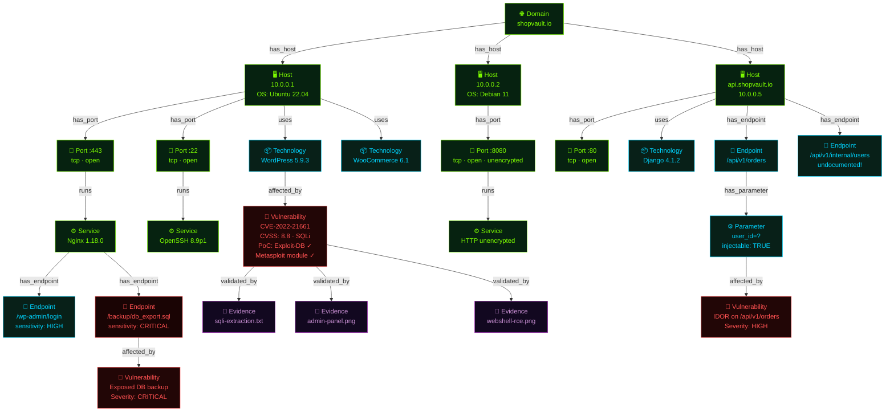
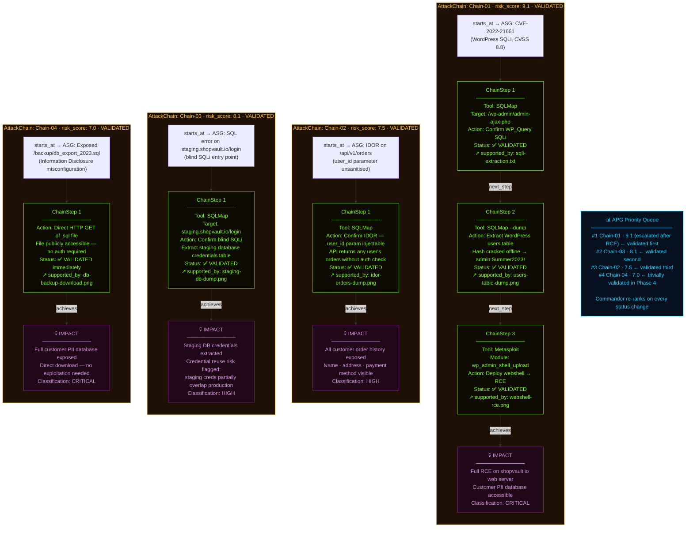

# Module 02 — The Dual-Graph World Model (ASG + APG)

## 🎯 One-Line Summary

CMatrix maintains two living graphs: one that records **what the target is** (discovered reality), and one that records **what can be done to it** (inferred attack opportunity). They are kept strictly separate — always.

---

## 🗺️ First, What is a Graph? (No Prior Knowledge Assumed)

Before we dive into ASG and APG, let's make sure we're rock-solid on what a **graph** even is — because this is the central data structure of the entire system.

A **graph** is a way of representing things and how they relate to each other. It has two building blocks:

- **Nodes (also called vertices):** Things. Entities. Objects. Each node represents one real-world thing.
- **Edges (also called links or connections):** Relationships between things. Each edge says "this thing connects to that thing" and *why*.

**Example — A simple social network graph:**
```
[Alice] --"friends with"--> [Bob]
[Bob]   --"works at"------> [TechCorp]
[Alice] --"works at"------> [TechCorp]
```
Nodes: Alice, Bob, TechCorp
Edges: "friends with", "works at"

From this small graph, you can already answer questions you couldn't answer from a flat list: "Do any of Alice's friends share an employer with her?" Yes — Bob.

**Why graphs are powerful:** They capture *structure* — the web of relationships between facts. A flat list of facts tells you what exists. A graph tells you how everything connects.

### Why Graphs for Penetration Testing?

A penetration test is fundamentally about understanding **relationships**:
- What hosts are reachable from what domains?
- What services run on what ports?
- What technologies have what vulnerabilities?
- What vulnerability chains with what misconfiguration to achieve what impact?

These are all graph questions. A flat list of findings cannot answer them. A graph can.

This is why CMatrix is built on two graphs — and why this design is fundamentally more powerful than any existing system that uses flat conversation history or task queues.

---

## 🕸️ Graph 1: The Attack Surface Graph (ASG)

> **The ASG answers: "What does the target look like?"**

The ASG is the **discovered-reality layer**. Every time CMatrix discovers something about the target — a live server, an open port, a technology, a vulnerability, a piece of evidence — it is written into the ASG as a node. The relationships between discoveries are written as edges.

The ASG is not a list, a log, or a report. It is a **living knowledge graph** — a continuously evolving structural model of the target environment. It starts as a single seed node (the root domain) and grows with every tool execution.

### The Golden Rule of the ASG

> **The ASG contains only confirmed discovered facts. It never contains hypotheses.**

If something wasn't directly observed or confirmed through tool execution, it does not go in the ASG. No guesses. No "this probably runs Apache." No "this might have a vulnerability." Only facts that were directly established by observation. This rule is absolute.

This is what makes the ASG trustworthy as the **single source of truth** for all reasoning in the system.

---

### Understanding CVEs and CVSS — Quick Background

When the ASG stores a **Vulnerability node**, it often references a CVE and a CVSS score. Let's define these before going further.

**CVE (Common Vulnerabilities and Exposures):** A standardized identifier for a known security vulnerability. Every discovered vulnerability in widely-used software gets assigned a CVE ID (e.g., `CVE-2022-21661`). Think of it like a ticket number in a global bug database.

**CVSS (Common Vulnerability Scoring System):** A 0–10 score that represents how dangerous a vulnerability is. Factors include:
- How easy is it to exploit? (network vs. physical access needed)
- Does the attacker need credentials first?
- What can they do if they succeed? (read data? execute code? crash the system?)

A CVSS of 9.8 means: "This is critical. An unauthenticated attacker over the internet can likely achieve full compromise." A CVSS of 3.1 means: "Low severity, limited impact, hard to exploit."

The Research Agent (covered in Module 03) enriches every Vulnerability node with the full CVSS details, PoC availability, and recommended validation approach.

---

### ASG Node Types — What Gets Stored

Think of each node type as a category of real-world thing that can be discovered during a penetration test:

| Node | What It Represents | Real Example |
|------|--------------------|-|
| **Domain** | A web domain or subdomain | `shopvault.io`, `api.shopvault.io`, `admin.shopvault.io` |
| **Host** | A live server with an IP address and OS | `192.168.1.10` (Ubuntu 22.04, alive) |
| **Port** | An open network port on a host | Port 443 (HTTPS), Port 8080 (HTTP, unencrypted) |
| **Service** | The software running on that port | Nginx 1.18.0, Apache 2.4.51, SSH OpenSSH 8.4 |
| **Technology** | A framework, CMS, or library running on the host/endpoint | WordPress 5.9.3, Django 4.1, WooCommerce 6.1 |
| **Endpoint** | A specific URL path or API route | `/api/v1/orders`, `/admin/login`, `/backup/db.sql` |
| **Parameter** | An input field, query parameter, or request header | `user_id=?`, `?q=search`, `Authorization: Bearer` |
| **Vulnerability** | A confirmed weakness — CVE, misconfiguration, or logic flaw — enriched with live intelligence | CVE-2022-21661, SQL error exposed, missing auth on endpoint |
| **Evidence** | A captured proof artifact | `admin-shell-screenshot.png`, SQLMap extraction output |

---

### ASG Edge Types — How Things Connect

Edges are what transform the ASG from a list into a *graph*. They express real, discoverable relationships between nodes:

| Edge | What It Means | Example |
|------|---------------|-|
| `has_host` | A domain resolves to a host | `shopvault.io` → `192.168.1.10` |
| `has_port` | A host has a port open | `192.168.1.10` → Port 443 |
| `runs` | A port is running a specific service | Port 443 → Nginx 1.18.0 |
| `uses` | A host or endpoint uses a technology | Host → WordPress 5.9.3 |
| `has_endpoint` | A host/service has a URL or API route | Service → `/api/v1/orders` |
| `has_parameter` | An endpoint has a specific input | `/api/v1/orders` → `user_id=?` |
| `affected_by` | A host or endpoint has a confirmed vulnerability | WordPress host → CVE-2022-21661 |
| `validated_by` | A vulnerability has been proven with evidence | CVE-2022-21661 → `screenshot.png` |

### Why Edges Matter — A Concrete Example

Without edges, you'd have these isolated facts:
- "WordPress 5.9.3 exists"
- "CVE-2022-21661 exists"
- "admin panel at /wp-admin exists"

With edges, you have:
```
[Domain: shopvault.io]
    --has_host--> [Host: 192.168.1.10]
        --uses--> [Technology: WordPress 5.9.3]
            --affected_by--> [Vulnerability: CVE-2022-21661, CVSS 8.8]
        --has_endpoint--> [Endpoint: /wp-admin/login]
```

Now you can query: "Which endpoints belong to hosts that run a technology affected by a CVSS 8.8 vulnerability?" The ASG answers this instantly. A flat list cannot.

---

### How the ASG Grows Over Time

The ASG starts as a single seed node — whatever the operator provided (typically a root domain). It then grows as agents make discoveries:

**Mission start:**
```
[Domain: shopvault.io]
```

**After Recon Agent (Phase 1):**
```
[Domain: shopvault.io] --has_host--> [Host: 10.0.0.1] --has_port--> [Port: 443] --runs--> [Service: Nginx 1.18.0]
[Domain: shopvault.io] --has_host--> [Host: 10.0.0.2] --has_port--> [Port: 8080] --runs--> [Service: HTTP (unencrypted)]
[Domain: api.shopvault.io] (subdomain discovered)
[Domain: admin.shopvault.io] (subdomain discovered)
... 14 subdomains, 11 live hosts, 28 open ports
```

**After Analysis Agent (Phase 2):**
```
[Host: 10.0.0.1] --uses--> [Technology: WordPress 5.9.3]
[Technology: WordPress 5.9.3] --affected_by--> [Vulnerability: CVE-2022-21661, CVSS 8.8, PoC: confirmed]
[Service at api.shopvault.io] --has_endpoint--> [Endpoint: /api/v1/orders]
[Endpoint: /api/v1/orders] --has_parameter--> [Parameter: user_id]
... 61 new nodes
```

**After Validation (Phase 3):**
```
[Vulnerability: CVE-2022-21661] --validated_by--> [Evidence: sqli-extraction-screenshot.png]
[Vulnerability: CVE-2022-21661] --validated_by--> [Evidence: admin-panel-access.png]
```

By the end, the ASG is a rich, interconnected map of the entire target — every finding in its proper context, traceable back to proof.

---

## 🛣️ Graph 2: The Attack Path Graph (APG)

> **The APG answers: "What can be done to the target?"**

The APG is the **inferred-opportunity layer**. While the ASG records what was discovered, the APG records what can be *done* with those discoveries. It is the attack reasoning layer — a structured collection of hypothesized, in-progress, and validated attack plans.

The APG is built entirely by the **Commander Agent** through active reasoning over ASG state. It is **never automatically derived** from the ASG — it requires genuine intelligence: *"Given these specific vulnerabilities and this specific infrastructure, which weaknesses can chain together? What sequence of exploitation steps leads from an entry point to meaningful impact?"*

### The Golden Rule of the APG

> **The APG contains only inferred attack reasoning. It never contains raw scan data.**

Scan results, tool outputs, raw findings — these belong in the ASG. The APG is strictly a reasoning layer. If it contained raw data, you'd lose the clean separation that makes both graphs trustworthy.

---

### APG Node Types

| Node | What It Represents |
|------|-------------------|
| **AttackChain** | A complete, ordered sequence of exploitation steps — from an entry point (an ASG Vulnerability or Endpoint node) all the way to a final business or technical impact |
| **ChainStep** | A single step within a chain — one specific action on one specific ASG node (e.g., "run SQLMap against the user_id parameter on /api/v1/orders") |
| **Impact** | The consequence at the end of a successful chain — e.g., "Customer PII exposed", "Remote Code Execution on web server", "Credential reuse to access production DB" |

### APG Edge Types

| Edge | What It Means |
|------|---------------|
| `starts_at` | An AttackChain begins at a specific ASG Vulnerability or Endpoint node |
| `next_step` | One ChainStep leads to the next ChainStep in the sequence |
| `achieves` | The final ChainStep achieves an Impact node |
| `supported_by` | A ChainStep is backed by a specific ASG Evidence node (the proof!) |

The `supported_by` edge is crucial — it's what makes every validated chain **fully traceable**. You can follow the chain from Impact back through every ChainStep all the way to the Evidence node in the ASG that proves each step actually worked.

---

### The Attack Chain Lifecycle — Four States

Every AttackChain in the APG carries a `validation_status` that tracks where it is in its lifecycle:

| Status | Meaning | What Happens Next |
|--------|---------|-------------------|
| `HYPOTHESIZED` | Commander has inferred this chain is possible. Not yet tested. | Commander prioritizes by risk score and assigns to Validation Agent when ready |
| `PARTIALLY_VALIDATED` | One or more ChainSteps have been confirmed. The chain is not complete end-to-end. | Validation Agent continues working through remaining steps |
| `VALIDATED` | Every ChainStep confirmed with Evidence. Impact demonstrated. Chain is done. | Evidence Agent captures final proof; chain written to Cross-Mission Experience Store |
| `RULED_OUT` | A required ChainStep failed after all retries. This chain is not exploitable as hypothesized. | Failure reason written to ASG; Commander re-prioritizes to next chain |

This lifecycle matters enormously for research: you can look at the APG at any point and know exactly which attack paths are proven, which are in progress, and which were dead ends — and *why*.

### The Three Properties on Each AttackChain

Every AttackChain also carries three metadata fields:

1. **`risk_score`** — How dangerous is this chain? Derived from:
   - The CVSS severity of the vulnerability at the entry point
   - How easy it is to exploit (does a PoC exist? is it actively exploited in the wild?)
   - The classification of the Impact (data breach vs. RCE vs. information disclosure)
   - Chains can have their risk score *escalated* when validation reveals worse-than-expected impact (e.g., what started as CVSS 8.8 gets escalated to 9.1 after RCE is confirmed)

2. **`priority`** — The Commander assigns a pursuit priority to each chain. Highest-priority chain (highest risk score that hasn't been validated or ruled out) gets validated first. This ranking updates every time any chain's status changes.

3. **`validation_status`** — As described above. The Commander reads this to decide what to pursue next.

---

## ⚖️ The Separation Principle — Why Two Graphs, Not One?

Here's a subtle but critical question: why maintain two separate graphs instead of one big combined graph?

Because **facts and hypotheses are fundamentally different kinds of knowledge** — and conflating them causes a category of errors that the separation completely eliminates.

### What Happens If You Mix Them

Imagine a system where discovered facts (ASG) and inferred attack reasoning (APG) live in the same shared data structure:

- The system scans WordPress 5.9.3 and writes: **"WordPress 5.9.3 discovered"** *(fact)*
- The Commander reasons and writes: **"SQL injection chain possible via CVE-2022-21661"** *(hypothesis)*
- Both are in the same store.

Now the Analysis Agent is trying to enumerate more resources. It reads the knowledge store to understand what it knows about the target. It sees both entries. It cannot tell which is a confirmed fact and which is an unvalidated hypothesis. It might:
- Plan scans based on an unconfirmed hypothesis (wasted work)
- Treat a failed hypothesis as evidence about the target's nature
- Mark a vulnerability as "found" when it was only inferred

More subtly: if an agent's task is to discover new things (write to facts), but the shared store contains reasoning entries (hypotheses), the agent might reason about its own previous hypotheses as if they were new evidence. This is a circular reasoning error — and it's very hard to detect.

### What the Separation Gives You

CMatrix's separation principle eliminates all of this:

- **Discovery agents write only to the ASG.** When the Recon Agent finds an open port, it writes a Port node to the ASG. It does not create any attack chain hypotheses. It has no access to the APG.
- **The Commander writes only to the APG.** When it reasons that a vulnerability could seed an attack chain, it writes an AttackChain node to the APG. It doesn't modify the ASG. The ASG remains a pure record of confirmed discovery.
- **Each layer is authoritative for exactly one type of knowledge.** There is never ambiguity about what kind of knowledge an entry represents.

This creates a **clean information architecture** with no room for fact-hypothesis contamination.

---

## 🔗 How the Two Graphs Work Together

The graphs are strictly separate — but they're deeply interdependent. They work together through three interaction patterns:

### Pattern 1: ASG feeds APG (Discovery triggers Reasoning)

When the Commander reads a new Vulnerability node in the ASG, it reasons: *"What attack chain could start here?"* If the reasoning produces a plausible chain, the Commander creates a new AttackChain node in the APG, with its `starts_at` edge pointing to that ASG Vulnerability node.

The ASG is constantly growing with new discoveries. Each new discovery can trigger new reasoning in the APG.

### Pattern 2: APG drives re-planning (Chain status drives Commander decisions)

When a chain advances from `HYPOTHESIZED` to `PARTIALLY_VALIDATED`, or from `PARTIALLY_VALIDATED` to `VALIDATED`, or when it's `RULED_OUT` — the Commander re-reads the APG priority list and decides what to do next. The APG's status landscape is what tells the Commander: "stop working on this; move to that."

### Pattern 3: APG links back to ASG (Evidence traceability)

When an AttackChain is validated, each ChainStep gets a `supported_by` edge to the ASG Evidence node that proves it. This creates an unbroken traceability chain: every attack claim in the final report can be followed step-by-step back to concrete evidence stored in the ASG.

Think of it as a **dialogue between two layers of intelligence:** the ASG constantly grows with facts, and the APG constantly evolves as the Commander turns facts into attack understanding.

---

## 🔬 A Complete Concrete Example — One Discovery Through Both Graphs

Let's trace a single real discovery all the way through both graphs — from tool execution to validated attack chain.

**Step 1 — The Recon Agent runs Nmap:**

Nmap scans all live hosts and finds:
- Port 8080 open on `api.shopvault.io`, running unencrypted HTTP

**ASG writes:**
```
[Host: api.shopvault.io] --has_port--> [Port: 8080] --runs--> [Service: HTTP, unencrypted]
```

**Step 2 — The Analysis Agent runs WhatWeb:**

WhatWeb fingerprints `shopvault.io` and identifies WordPress 5.9.3.

**ASG writes:**
```
[Host: shopvault.io] --uses--> [Technology: WordPress 5.9.3]
```

**Step 3 — The Research Agent enriches the vulnerability:**

The Commander spots WordPress 5.9.3 and spawns the Research Agent with: "Find CVEs for WordPress 5.9.3."

The Research Agent queries NVD and finds CVE-2022-21661: SQL injection via WP_Query, CVSS 8.8, public PoC on Exploit-DB, Metasploit module available.

**ASG writes:**
```
[Technology: WordPress 5.9.3] --affected_by--> [Vulnerability: CVE-2022-21661]
    [CVE-2022-21661]
        severity: HIGH
        CVSS: 8.8
        exploitability: PoC confirmed on Exploit-DB
        metasploit_module: wp/wp_query_sqli
        recommended_approach: SQLMap then Metasploit
```

**Step 4 — The Commander reasons and creates an APG chain:**

The Commander reads the new Vulnerability node from the ASG. It reasons: "CVE-2022-21661 on WordPress → SQL injection → possible database dump → admin password → admin access → remote code execution → full server compromise → customer PII exposure."

**APG writes:**
```
[AttackChain: Chain-01]
    risk_score: 8.8
    validation_status: HYPOTHESIZED
    priority: 1 (highest)
    starts_at → [ASG: Vulnerability: CVE-2022-21661]

    [ChainStep 1] Exploit WP_Query via SQLMap
        --next_step-->
    [ChainStep 2] Extract admin credentials from user table
        --next_step-->
    [ChainStep 3] Authenticate to /wp-admin + deploy web shell
        --achieves-->
    [Impact: Remote Code Execution on shopvault.io web server + Customer PII exposed]
```

**Step 5 — The Validation Agent proves the chain:**

SQLMap runs. Confirms SQL injection. Extracts admin hash. Metasploit cracks hash. Metasploit deploys web shell. Full RCE achieved.

**APG updates:**
```
[ChainStep 1] supported_by → [ASG Evidence: sqli-extraction.txt]  → status: VALIDATED
[ChainStep 2] supported_by → [ASG Evidence: user-table-dump.png]  → status: VALIDATED
[ChainStep 3] supported_by → [ASG Evidence: webshell-running.png] → status: VALIDATED
[AttackChain: Chain-01] validation_status: VALIDATED, risk_score escalated to 9.1
```

**The result:** A complete, evidence-backed, end-to-end attack chain. Every step proven. Every proof linked. No ambiguity about what happened, how, or where the evidence is.

---

## 🔄 The Dual-Graph Termination Condition

One of CMatrix's most important innovations is *knowing when it's actually done*.

The mission terminates when **both** of the following are simultaneously true:

1. **ASG exhaustion:** No unexplored nodes remain. Every discovered Domain, Host, Port, Service, Technology, Endpoint, and Parameter has been investigated by the appropriate agent.

2. **APG resolution:** Every AttackChain is in a terminal state — either `VALIDATED` or `RULED_OUT`. No chain is still `HYPOTHESIZED` or `PARTIALLY_VALIDATED`.

Neither condition alone is enough:
- If the ASG is exhausted but a chain is still `HYPOTHESIZED` → continue (the reasoning is unfinished)
- If all APG chains are resolved but new ASG nodes were just discovered → continue (new nodes might seed new chains)

This **dual termination condition** is the first formally grounded mission-complete definition in autonomous VAPT literature. Systems that use task queues can't express APG resolution. Systems that traverse graphs can't express the ASG-exhaustion + APG-resolution conjunction. CMatrix can — because it maintains both graphs and reads both as a unified termination signal. The planning cycle that enforces this condition is explained in full in Module 06.

---

## ✅ What You Should Remember From This Module

| Concept | Plain English |
|---------|---------------|
| Graph | Nodes (things) + Edges (relationships between things) — richer than a flat list |
| ASG | Living graph of *everything discovered* about the target — confirmed facts only, never hypotheses |
| APG | Living graph of *all attack plans* inferred by the Commander — reasoning only, never raw scan data |
| CVE | Standardized ID for a known vulnerability (e.g., CVE-2022-21661) |
| CVSS | 0–10 danger rating for a vulnerability |
| The separation principle | Discovery agents write only to ASG. Commander writes only to APG. Facts and hypotheses never mix. |
| AttackChain lifecycle | HYPOTHESIZED → PARTIALLY_VALIDATED → VALIDATED or RULED_OUT |
| risk_score | 0–10 danger rating derived from CVSS severity, exploitability, and impact classification |
| How they interact | ASG discoveries trigger APG chain creation; APG chain status drives Commander re-planning; APG evidence links back to ASG proof |
| Termination | Mission ends ONLY when ASG is exhausted AND all APG chains are in terminal states |

---

## Figure 1 — The Dual-Graph Model: ASG + APG Visualised

This diagram shows both graphs side-by-side using the `shopvault.io` mission as a concrete example. Left side = ASG (what was discovered). Right side = APG (what can be done with it). The vertical barrier in the middle = the strict separation boundary.

### Figure 1A — ASG: The Attack Surface Graph (Discovered Reality)

Every node here represents something **confirmed by a tool**. Every edge represents a **confirmed relationship**. No guesses. No hypotheses.



**Node colour key:**
- 🟢 **Lime** — Domain, Host, Port, Service (infrastructure layer)
- 🔵 **Cyan** — Technology, Endpoint, Parameter (application layer)
- 🔴 **Red** — Vulnerability (weakness layer)
- 🟣 **Purple** — Evidence (proof layer)

---

### Figure 1B — APG: The Attack Path Graph (Inferred Opportunity)

The Commander reads the ASG and reasons: *"These vulnerabilities can chain together into complete attack paths."* Those chains live here — in the APG.



### What the Two Graphs Together Tell You

| Question | Answered By |
|----------|------------|
| "What hosts exist on shopvault.io?" | ASG → Domain → Host nodes |
| "What software is running on port 443?" | ASG → Port → Service → Technology nodes |
| "Which vulnerabilities were found?" | ASG → Vulnerability nodes (with CVSS, PoC status) |
| "What are the complete attack paths?" | APG → AttackChain nodes (with ChainSteps) |
| "Which attack is most dangerous?" | APG → risk_score ranking |
| "Is each attack actually proven?" | APG → validation_status + supported_by → ASG Evidence |
| "What is the proof?" | ASG → Evidence nodes (screenshots, tool outputs) |

---

*Next: [Module 03 — The Agent Architecture (Who Does What)](module-03-core-agent-architecture.md)*

