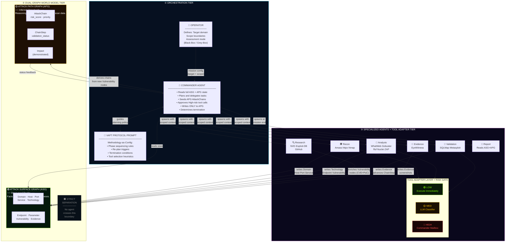
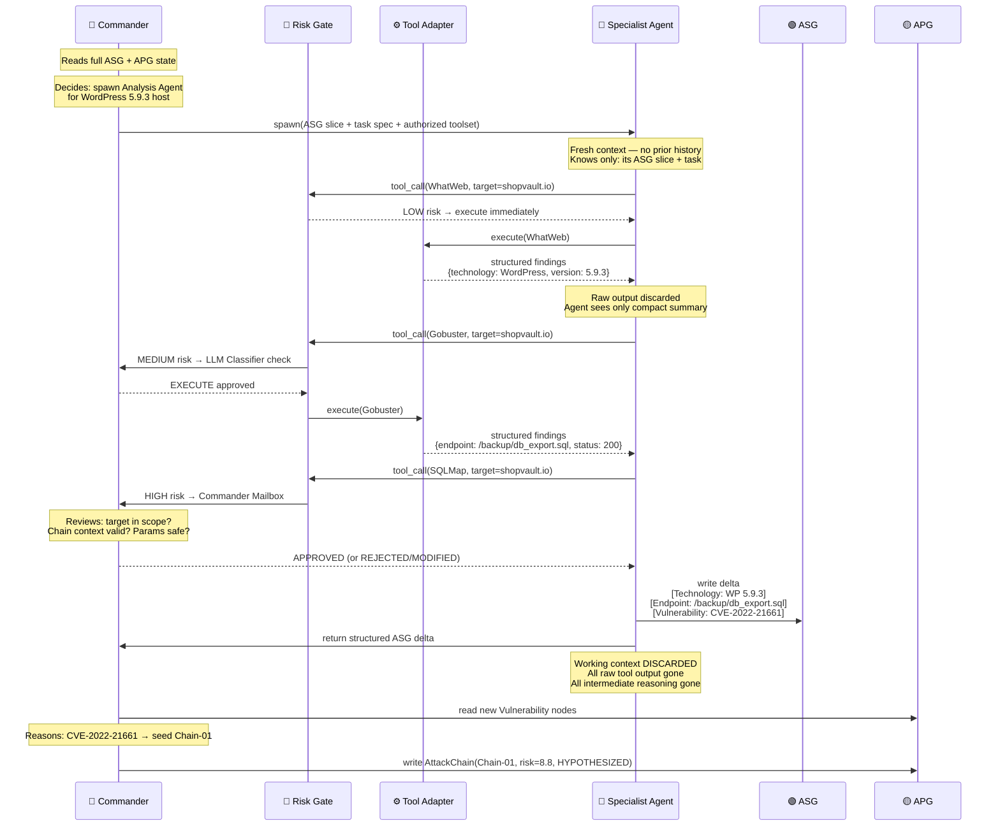
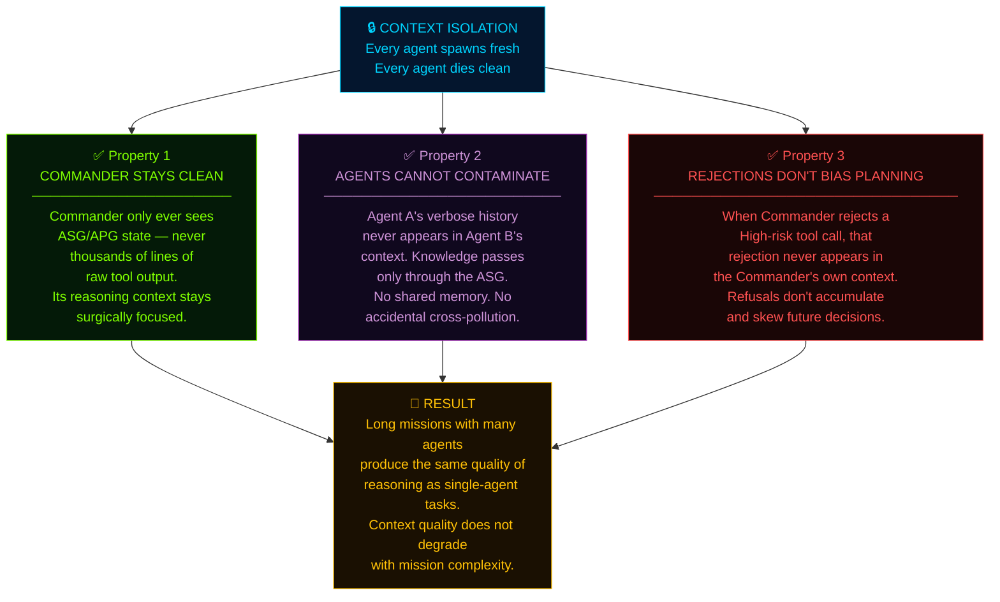

# Module 03 — The Agent Architecture (Who Does What)

## 🎯 One-Line Summary

CMatrix has **one brain** (the Commander) and **six specialist hands** (agents). Each agent is born fresh for its task, does only what it's authorized to do, and vanishes when done — leaving only structured knowledge in the graph.

---

## 🎭 Think of a High-Stakes Surgical Team

Imagine a complex cardiac surgery. The operating theater has:
- A **Lead Surgeon** — directs the entire operation. Makes all major decisions. Coordinates the team. Doesn't hand instruments.
- A **Cardiac Specialist** — focuses exclusively on the heart. Doesn't manage anesthesia.
- An **Anesthesiologist** — manages sedation and pain. Doesn't touch the surgical site.
- A **Scrub Nurse** — handles instrument handoffs. Doesn't make medical decisions.
- A **Circulating Nurse** — documents everything. Gets supplies from outside the sterile field.

Each person has a specific, non-overlapping role. Nobody does two people's jobs. Nobody interferes with another's domain. Clear separation of roles is what makes the operation safe and reliable — because:
- The lead surgeon can focus entirely on strategic decisions without getting distracted by instrument handling
- The cardiac specialist can focus deeply on their domain without worrying about anesthesia
- If the scrub nurse makes an error, it doesn't cascade into the anesthesiologist's domain

**CMatrix's agent architecture follows this exact logic.** One orchestrating intelligence (the Commander) directs specialists who each own exactly one domain of responsibility.

---

## 🧊 Context Isolation — The Architecture Principle Behind All Agents

Before introducing each agent, we need to establish the single most important design principle that governs all of them:

> **Every specialist agent is spawned fresh with a scoped context and vanishes when it's done.**

Agents are not persistent processes that accumulate history across tasks. Each spawn event is a fresh start.

**What each agent receives at spawn:**
- The **ASG slice** relevant to its task — not the full graph, just what it needs
- The **APG slice** relevant to its task — if applicable (e.g., the Validation Agent gets the specific AttackChain it's validating)
- The **restricted toolset** it's authorized to use — not all tools, only the ones appropriate for its role
- The **task specification** from the Commander's current plan
- (For Validation/Analysis Agents): **Knowledge documents** for its assigned vulnerability class

**When the agent completes:**
- It returns only its **structured output** — new ASG nodes and edges (or APG status updates)
- Its entire working context — all conversation history, all tool outputs, all intermediate reasoning — is **permanently discarded**

### Background: What is a Context Window?

An LLM can only "see" a certain amount of text at once. This limit is called the **context window** — measured in tokens (roughly 0.75 words per token). Modern LLMs have large context windows (128K–1M tokens), but long-running pentests can still exceed these limits because tool outputs are enormous (full Nmap scans, ZAP reports, directory brute-force results can be thousands of lines each).

Context isolation prevents this problem by design: each agent's context is bounded by exactly the information it was spawned with — not the entire mission history. The context never "accumulates" across agents. Only the ASG/APG grows — and those are graph data structures, not text in a context window.

### Why This Matters: Three Properties Context Isolation Guarantees

**Property 1: The Commander's context stays surgically clean.**

The Commander only ever sees ASG/APG state — never the raw working history of agents it has spawned. If the Recon Agent ran Nmap across 100 hosts and got 50,000 lines of output, none of those lines ever appear in the Commander's context. It only sees the resulting Host/Port/Service nodes in the ASG. This keeps the Commander focused and its reasoning context manageable.

**Property 2: Agents cannot contaminate each other.**

If Agent A generates massive raw tool output while analyzing a web application, and Agent B is later spawned to validate a different vulnerability — Agent B has no knowledge of Agent A's work except through what was written to the ASG. There is no shared context. There is no shared conversation history. Each agent's "memory" is exactly the ASG/APG slice it was given.

**Property 3: Rejected High-risk calls vanish cleanly.**

If the Commander rejects a dangerous tool call — say, an agent proposed running Metasploit against a target that isn't fully confirmed to be in scope — that rejection event never appears in the Commander's own context. The Commander doesn't accumulate a history of "things I said no to." This prevents the refusals from subtly biasing future planning decisions (a known failure mode in systems where the planning agent sees its own rejection history).

With this principle established, every agent description below makes sense: they're designed to operate within these boundaries.

---

## 👑 The Commander Agent — The Orchestrating Brain

The Commander is the intelligence center of CMatrix. It is the only agent that:

- Reads the **complete state** of both the ASG and APG at all times
- **Decides what to do next** at every step of the mission
- **Spawns specialist agents** and gives each one its specific task
- **Writes to the APG** — creates new AttackChains, updates chain statuses, assigns risk scores and priorities
- **Approves or rejects** High-risk tool calls from the Commander mailbox
- **Determines mission termination** when the dual-graph condition is met

**The Commander never runs tools directly.** It never invokes a scanner, never touches an exploit framework, never makes external requests. Its job is 100% reasoning and orchestration.

This is not a limitation — it's a design strength. A decision-maker who focuses entirely on strategy and delegates all execution produces better outcomes than one who tries to do everything. The Commander's context stays clean because it only ever sees structured graph state — not thousands of lines of raw tool output.

### Key Decisions the Commander Makes at Every Cycle

```
1. Which ASG nodes are unexplored? What category should be investigated next?
2. Which new Vulnerability nodes should seed APG AttackChains?
3. Which AttackChain currently has the highest risk_score and should be validated next?
4. Has a ChainStep failed enough times to be marked RULED_OUT?
5. Has an AttackChain been validated end-to-end with all Evidence linked?
6. Is the dual-graph termination condition now met?
7. Should a High-risk tool call from an agent be approved, rejected, or modified?
```

The Commander is guided by the **VAPT Protocol Prompt** — a structured natural language document that encodes the assessment methodology (which phases come first, when to re-plan, when to terminate, which tools to use for which node types). This is covered in depth in Module 07.

### What "Writes Only to APG" Means

This write-boundary rule is a hard architectural constraint. No discovery agent — Recon, Analysis, Research, Validation, Evidence — can modify the APG. Only the Commander can. This means:

- Attack reasoning is entirely the Commander's responsibility
- Discovery agents can't accidentally contaminate the attack reasoning layer
- The APG is always consistent with the Commander's current understanding

---

## 🕵️ The Recon Agent — The Explorer

**Mission:** Map the external attack surface. Discover what exists.

The Recon Agent is spawned at the beginning of an assessment with a single goal: find everything that's out there. It does not analyze. It does not assess vulnerabilities. It discovers.

### Background: What is Reconnaissance?

In military strategy, reconnaissance means gathering information about enemy positions before any action is taken. In cybersecurity, it means systematically mapping a target to understand what services are exposed, what hosts are alive, and what the external surface looks like — before doing anything that touches security vulnerabilities.

### Background: What are Ports?

Every server on the internet communicates through numbered **ports**. Think of an IP address as a building's street address, and ports as individual apartments. Port 80 is HTTP (web traffic). Port 443 is HTTPS (encrypted web). Port 22 is SSH (remote shell access). Port 3306 is MySQL (database). When Nmap "scans ports," it's essentially knocking on every door of the building and asking "is anyone home?"

### Tools the Recon Agent Uses

| Tool | What It Does |
|------|-------------|
| **Amass** | Subdomain enumeration — finds all subdomains of a root domain through DNS brute-forcing (trying thousands of possible subdomain names), certificate transparency logs (SSL certificates publicly list all domains they cover), and passive OSINT sources (third-party databases that have indexed domain information) |
| **httpx** | HTTP probing — takes the list of discovered subdomains and checks which ones are actually alive and responding to HTTP requests. Returns status codes, server banners, TLS details, and redirect chains |
| **Nmap** | Port scanning and service fingerprinting — scans each live host to find all open ports, identifies what software is running on each port (service version, OS), and optionally runs basic vulnerability scripts |

### What the Recon Agent Writes to the ASG

```
Domain nodes    — root domain + all discovered subdomains
Host nodes      — IP addresses, OS information, liveness status
Port nodes      — open port numbers with protocols
Service nodes   — software names, version numbers, banners
```

When done, the Recon Agent returns its **structured ASG delta** (the set of new nodes and edges it created) to the Commander. Its entire working context — conversation history, intermediate reasoning, raw tool outputs — is then discarded. The Commander uses only the ASG to understand what was found.

---

## 🔬 The Analysis Agent — The Deep Investigator

**Mission:** Take the discovered surface and find vulnerabilities. Make the unknown known.

The Analysis Agent is spawned after Recon has populated the ASG with hosts, ports, and services. The question now shifts from "what exists?" to "what weaknesses exist in what was found?"

### Background: What is Technology Fingerprinting?

When you visit a website, the server gives away clues about itself — in HTTP headers, in HTML comments, in cookie names, in URL patterns. "Fingerprinting" is the process of reading these clues to identify *exactly* what software is running. Knowing that a target runs "WordPress 5.9.3 with WooCommerce 6.1 on Nginx 1.18.0" is critical because each of these specific versions may have specific known vulnerabilities.

### Background: What is OWASP Top 10?

The **OWASP (Open Web Application Security Project) Top 10** is a globally recognized list of the most critical web application security risks. Examples:
- **Injection** (e.g., SQL injection — inserting malicious code into database queries)
- **Broken Authentication** (weak or bypassable login mechanisms)
- **IDOR** (Insecure Direct Object Reference — accessing other users' data by manipulating IDs)
- **XSS** (Cross-Site Scripting — injecting malicious JavaScript into web pages)
- **Security Misconfiguration** (default passwords, exposed admin panels, debug mode left on)

When the Analysis Agent runs OWASP ZAP, it's specifically checking for vulnerabilities in this list.

### Background: What is SQL Injection?

**SQL injection** is one of the oldest and most devastating web vulnerabilities. When a web application passes user input directly to a database query without sanitizing it, an attacker can inject their own SQL commands. For example:

Normal login: `SELECT * FROM users WHERE username='alice' AND password='secret'`

With SQL injection: `SELECT * FROM users WHERE username='alice' OR 1=1--` (the `--` comments out the rest, the `OR 1=1` always returns true → login bypassed)

More advanced injections can dump entire databases, extract credentials, or even achieve OS-level command execution. This is why CVE-2022-21661 (WordPress WP_Query SQL injection) is so dangerous.

### Tools the Analysis Agent Uses

| Tool | What It Does |
|------|-------------|
| **WhatWeb** | Technology fingerprinting — identifies CMS (WordPress, Drupal), frameworks (Django, Laravel), JavaScript libraries (jQuery version), server software, and version numbers from HTTP responses and HTML content |
| **Gobuster** | Directory and file brute-forcing — tries thousands of known URL paths (like `/admin`, `/backup`, `/config.php`, `/db_export.sql`) to find hidden pages, admin panels, and exposed files that aren't linked from the main site |
| **ffuf** | Fast web fuzzer — discovers undocumented API endpoints (by trying path variations), finds injectable parameters, and discovers virtual host names that might not be publicly documented |
| **Nuclei** | Template-based vulnerability scanner — has a library of thousands of detection templates for known CVEs, misconfigurations, default credentials, and exposed sensitive files. Matches each template against discovered services |
| **OWASP ZAP** | Active web application scanner — crawls the entire web application, then actively probes for injection flaws, authentication bypasses, XSS, CSRF weaknesses, and other OWASP Top 10 vulnerabilities |

### What the Analysis Agent Writes to the ASG

```
Technology nodes  — CMS, framework, library versions
Endpoint nodes    — discovered URL paths and API routes
Parameter nodes   — input fields, query parameters, headers
Vulnerability nodes — CVEs, misconfigurations, weaknesses (enriched by Research Agent)
```

---

## 🔍 The Research Agent — The Intelligence Officer

**Mission:** Ground vulnerability findings in real-world intelligence. Close the gap between what was found and what is known about it.

This agent is spawned on-demand — whenever the Commander or Analysis Agent encounters a technology version, CVE, or weakness that needs enrichment. It doesn't run VAPT tools against the target. Instead, it connects to external intelligence databases.

### The Problem It Solves: Stale Knowledge

LLMs are trained on data up to a cutoff date. A vulnerability discovered in 2024 may not be in the model's training data. A PoC published on Exploit-DB three months ago might not be known. The Research Agent closes this gap by querying authoritative live sources — not relying on what the model already knows.

### Authorized Intelligence Sources

| Source | What It Provides |
|--------|--------------------|
| **NVD (National Vulnerability Database)** | Official US government CVE database — technical details, CVSS scores, affected version ranges, vendor references |
| **Exploit-DB** | Public database of proof-of-concept (PoC) exploit code — if a public PoC exists for a CVE, Exploit-DB has it |
| **GitHub** | PoC repositories, security advisories, vendor patches — often the first place working exploit code appears |
| **Vendor security advisories** | Sourced from ASG Technology node metadata — official vendor statements about vulnerabilities in their products |

### What It Writes to the ASG

The Research Agent writes enriched attributes onto existing Vulnerability nodes:

```
CVE severity and CVSS vector (e.g., "CVSS 8.8 / AV:N/AC:L/PR:L/UI:N")
Exploitability assessment:
    - "PoC exists on Exploit-DB" (can be exploited by someone following public instructions)
    - "Metasploit module available" (can be exploited with one command in Metasploit)
    - "Actively exploited in the wild" (real attackers are using this right now)
    - "No public PoC" (still dangerous but harder to exploit without custom research)
Recommended validation approach (e.g., "Use SQLMap with --dbms=mysql flag, then Metasploit wp_query module")
```

### The Critical Rule: Research Agent is the ONLY External Agent

> The Research Agent is the **only** agent authorized to make outbound requests to external networks. All other agents operate exclusively on the local target environment.

This boundary is a hard design constraint enforced by the architecture. It prevents:
- Accidentally sending target information to external services (data leakage)
- Other agents conducting unauthorized external queries
- Non-Research Agent tool calls being routed to the internet

Additionally: **no raw web content ever enters the LLM context.** When the Research Agent queries NVD, it gets back a JSON response. The Tool Adapter normalizes that JSON into structured Vulnerability node attributes. The raw JSON is discarded. Only the clean, structured extract enters the agent's context — ensuring consistency with the principle applied to all tool outputs.

---

## 🎯 The Validation Agent — The Proof-Maker

**Mission:** Prove that discovered vulnerabilities are real and exploitable. Not find — prove.

This is the most critical and sensitive agent in the system. It receives a specific APG AttackChain from the Commander and executes controlled exploitation to validate each ChainStep in sequence.

The Validation Agent does not discover vulnerabilities. It proves them. The difference is fundamental: discovery means finding evidence that something *might* be exploitable. Validation means actually running the exploit and demonstrating it works.

### Tools the Validation Agent Uses

| Tool | What It Does |
|------|-------------|
| **SQLMap** | Automated SQL injection testing and exploitation — detects injectable parameters, confirms the vulnerability, classifies the injection type (error-based, blind, time-based), extracts database contents, and can attempt privilege escalation |
| **Metasploit** | The industry-standard exploitation framework — has thousands of modules for known vulnerabilities. Given a CVE and target, it automates the exploit execution, handles payload delivery, and manages post-exploitation sessions |

### What Happens When a ChainStep Succeeds

The ChainStep's `validation_status` advances toward `VALIDATED`. An Evidence node is created in the ASG and linked to the ChainStep via a `supported_by` edge.

### What Happens When a ChainStep Fails — The Self-Debugging Loop

This is where the Validation Agent distinguishes itself. Instead of immediately giving up and marking the step `RULED_OUT`, it enters a **structured self-debugging loop**:

```
Attempt → FAIL
          ↓
    DIAGNOSE: Why did it fail?
    Possible causes:
      - Wrong parameter name or format
      - Authentication required (didn't know the endpoint needed auth)
      - Version mismatch (CVE applies to slightly different version range)
      - Payload encoding issue (the payload needs URL-encoding or base64)
      - Tool flag error (wrong SQLMap DBMS flag, wrong Metasploit target)
          ↓
    CONTEXTUALIZE: Query the ASG for more info
    Examples:
      - Check the Service node — does it have more version details?
      - Check Evidence nodes from prior steps — was a credential captured?
      - Check Parameter nodes — is there a session token we should include?
          ↓
    ADAPT: Modify the invocation based on diagnosis + new context
    Retry with the corrected approach
          ↓
    If retry fails: repeat loop
    After max retries (default: 3): mark ChainStep RULED_OUT
    Write failure reason as structured annotation to ASG Vulnerability node
```

**Why does this loop matter?**

In real penetration testing, most initial exploit failures are not fundamental failures — they're parameter issues, encoding issues, timing issues, version mismatches. A skilled human tester would diagnose and adapt. The self-debugging loop gives the Validation Agent this same capability:
- The **cap** (default 3 retries) prevents infinite loops — the system eventually accepts failure and moves on
- The loop prevents premature abandonment — just because the first attempt failed doesn't mean the vulnerability isn't real
- The **failure reason written to ASG** preserves why it failed — this informs future missions (Cross-Mission Experience Store) and enriches the final report

When the Commander sees a `RULED_OUT` step, it re-prioritizes the APG and moves to the next chain.

### Vulnerability-Class Knowledge Injection

The Validation Agent doesn't go into its task empty-handed. At spawn time, it receives **curated offline expert knowledge documents** matched to the vulnerability class it's assigned:

| What It's Validating | Knowledge Documents Injected |
|---------------------|------------------------------|
| SQL injection chains | SQL injection technique taxonomy (error-based vs. blind vs. time-based vs. out-of-band); SQLMap flag reference; WAF bypass techniques |
| XSS chains | XSS payload patterns; CSP (Content Security Policy) bypass techniques; DOM vs. reflected vs. stored XSS distinctions |
| Exploit chains via Metasploit | Metasploit module selection heuristics; payload selection guide (Meterpreter vs. shell); encoder selection for antivirus evasion |
| API target chains | REST API attack surface checklist; IDOR (Insecure Direct Object Reference) patterns; parameter pollution techniques |

### Background: What Are These Techniques?

- **Blind SQL injection** — when the database doesn't return data directly, but you can infer information by asking yes/no questions (does the database name start with 'a'? if yes, the page takes longer to load)
- **CSP bypass** — Content Security Policy is a browser security feature that prevents certain scripts from running. XSS attackers find ways around it
- **IDOR** — If an API endpoint is `/api/orders?user_id=123`, and changing `123` to `456` returns another user's orders — that's IDOR (Insecure Direct Object Reference). The system doesn't check whether you're authorized to access user 456's data
- **Meterpreter** — A special Metasploit payload that gives the attacker a powerful interactive shell on the compromised system with built-in commands for privilege escalation, pivoting, data exfiltration, etc.

These documents are **static, curated, version-controlled** — they encode expert practitioner knowledge that the LLM's general training may have imprecisely or incompletely. They're re-injected at spawn time every time, so they're never lost to context compaction.

> **This is distinct from the Research Agent's live intelligence.** Research Agent retrieves real-time CVE data for specific discovered versions. Knowledge injection provides static, evergreen offensive technique reasoning that doesn't require internet access.

---

## 📸 The Evidence Agent — The Documentarian

**Mission:** Capture proof that cannot be disputed. Turn validated exploits into permanent evidence artifacts.

After the Validation Agent confirms a ChainStep or the Commander decides it's time to document validated findings, the Evidence Agent is spawned.

### Tool It Uses

| Tool | What It Does |
|------|-------------|
| **EyeWitness** | Headless screenshot capture — visits web pages, admin panels, and API endpoints in a real browser (without showing the screen), captures screenshots, and returns the image files |

### What It Writes to the ASG

```
Evidence nodes — screenshot image files, exploitation output captures
    -- validated_by edges: Vulnerability → Evidence (this vulnerability has this proof)
    -- supported_by edges: APG ChainStep → Evidence (this step was proven by this artifact)
```

The `supported_by` edge is critical. It creates an unbroken chain from the final report's "validated attack chain" all the way back to the screenshot that proves step 3 actually worked.

---

## 📝 The Report Agent — The Writer

**Mission:** Translate the dual-graph world model into a professional, human-readable penetration test report.

The Report Agent is the last agent spawned in a mission. It reads the complete ASG and APG — all discovered nodes, all attack chains, all evidence — and generates the final deliverable. It makes no security decisions. It runs no tools. It is purely a reader and translator.

### Report Structure

| Section | Source |
|---------|--------|
| **Executive Summary** | APG Impact nodes → business-level description of what was demonstrated |
| **Technical Findings** | All ASG Vulnerability nodes with CVSS scores, enriched with Research Agent intelligence |
| **Attack Surface Map** | Complete ASG — all subdomains, hosts, ports, services, endpoints, parameters |
| **Validated Attack Chains** | All `VALIDATED` APG chains with step-by-step reproduction, tool outputs, and Evidence linked at each step |
| **Remediation Guidance** | Prioritized by APG risk_score — what to fix first, based on danger level |

The Report Agent doesn't need anything beyond the dual graph. Everything it needs to write a complete, professional penetration test report is already stored in the ASG and APG. This is the payoff for building and maintaining the world model throughout the entire assessment.

---

## 🌐 Cross-Mission Learning — Beyond the Scope of a Single Mission

CMatrix doesn't just learn within a mission — it remembers across missions. Two structures handle this.

### The Cross-Mission Experience Store

When a mission terminates with validated chains, the Report Agent writes a structured summary into a **persistent, RAG-backed knowledge base** — the Cross-Mission Experience Store.

**What RAG means:** RAG = Retrieval-Augmented Generation. Instead of the LLM relying only on what it was trained on, it can query an external database at runtime and retrieve relevant information to inject into its context. Think of it like giving the LLM access to a searchable library it can consult before answering.

**What gets written at mission close:**
```
Target technology fingerprint (CMS, framework, version, service)
Vulnerability class and CVE
Successful tool invocation and exact parameters
ChainStep sequence that achieved validation
Mission outcome summary
```

**What happens at mission start:**
Immediately after the Recon Agent writes the first batch of Technology nodes to the ASG, the Commander queries the store. It retrieves exploitation records from past missions on similar technology stacks. These are injected as **candidate chain hypotheses** — pre-validated patterns — into the Commander's reasoning context. Instead of starting from zero, the Commander can front-load high-probability chains that have worked before.

### The Attack Strategy Library

While the Cross-Mission Experience Store stores raw, per-mission records — "this exact chain worked on this exact target" — the Attack Strategy Library is a **higher-order abstraction**: generalized, named, reusable attack procedures.

**How crystallization works:**
When the same target fingerprint (e.g., `WordPress 5.x + WooCommerce + Nginx`) produces a validated AttackChain across **two or more independent missions**, the Commander triggers crystallization. A scoped LLM call generalizes those specific chains into a named strategy:

```
STRAT-WP-SQLI-001
Name: "WordPress WP_Query SQL Injection to RCE"
Target fingerprint: WordPress 5.x + WooCommerce (any version) + any reverse proxy
Entry condition: CVE-2022-21661 confirmed or WP_Query injection point identified
Tool sequence:
    1. SQLMap --dbms=mysql --level=3 --risk=2 (extract admin hash)
    2. Offline hash cracking (hashcat, wordlist: rockyou)
    3. Metasploit wp_admin_shell_upload (with cracked credentials)
Expected evidence: SQLMap output, WordPress admin panel screenshot, webshell execution screenshot
Confidence score: 0.85 (contributed by 4 independent missions)
Last validated: 2025-11-03
```

This strategy is then indexed in the library. At the start of future missions where WordPress 5.x is detected, the Commander retrieves this strategy and uses it as a pre-ranked APG AttackChain seed — prioritized above chains with no prior track record.

> **No existing autonomous VAPT system does this.** Every other system in the literature resets to zero knowledge on each mission. CMatrix gets better — measurably — with every engagement it completes.

The full planning cycle that uses these structures, and the context management that keeps memory from overflowing, is explained in Module 06.

---

## 🗺️ Agent Quick Reference

| Agent | Role | Tools | Writes To |
|-------|------|-------|-----------|
| **Commander** | Orchestration, reasoning, APG management | None | APG only |
| **Recon** | External discovery | Amass, httpx, Nmap | ASG (Domain, Host, Port, Service) |
| **Analysis** | Deep enumeration, vulnerability discovery | WhatWeb, Gobuster, ffuf, Nuclei, OWASP ZAP | ASG (Technology, Endpoint, Parameter, Vulnerability) |
| **Research** | Live CVE intelligence | NVD, Exploit-DB, GitHub APIs | ASG (Vulnerability node enrichment only) |
| **Validation** | Controlled exploitation | SQLMap, Metasploit | ASG (Evidence nodes) + APG (ChainStep status) |
| **Evidence** | Proof capture | EyeWitness | ASG (Evidence nodes + validated_by/supported_by edges) |
| **Report** | Final report generation | None | Report document (reads full ASG + APG) |

---

## ✅ What You Should Remember From This Module

| Concept | Plain English |
|---------|---------------|
| Context isolation | Every agent spawns fresh, returns only structured output, then vanishes — no shared history |
| Context window | The amount of text an LLM can see at once — a real constraint in long sessions |
| Commander | The brain — reads everything, plans everything, writes only to APG, never runs tools |
| Recon Agent | Discovers what exists — domains, hosts, ports, services |
| Analysis Agent | Finds vulnerabilities in what was discovered — technologies, endpoints, parameters, CVEs |
| Research Agent | Enriches CVE findings with live intelligence — the only agent that reaches the internet |
| Validation Agent | Proves vulnerabilities are real through controlled exploitation |
| Self-debugging loop | Validation Agent diagnoses and adapts on failure before giving up — up to a configurable cap |
| Knowledge injection | Specialist agents get curated expert documents pre-loaded at spawn — offline, version-controlled |
| Evidence Agent | Captures screenshots and proof artifacts for every validated finding |
| Report Agent | Reads the full dual graph and generates the professional pentest report |
| Cross-Mission Store | Persistent RAG database of validated exploitation outcomes across all missions |
| Attack Strategy Library | Crystallized, generalized, named attack strategies indexed by target technology fingerprint |

---

## Figure 1 — System Architecture: The Three-Tier Overview

This is the master view of CMatrix. Everything fits into three tiers:

- **Tier 1 (top):** Orchestration — the operator configures, the Commander reasons
- **Tier 2 (middle):** The dual-graph world model — the two living knowledge stores
- **Tier 3 (bottom):** The six specialist agents and the tool layer they operate through



### Reading Key

| Colour | Meaning |
|--------|---------|
| 🟢 Cyan border | Commander — orchestration layer |
| 🟢 Lime/Green border | ASG — discovery facts |
| 🟡 Gold border | APG — attack reasoning |
| 🟣 Purple border | Agent tier + tool adapter |
| Solid arrow | Data flow / write |
| Dashed arrow | Read / feedback |

### Three Things to Notice

1. **The Commander never touches tools.** Every arrow from the Commander goes to agents — never to the Tool Adapter Layer directly.
2. **Only the Commander writes to the APG.** All six specialist agents write only to the ASG (or read from it). The APG is exclusively the Commander's domain.
3. **All tool calls go through the Tool Adapter Layer.** There is no path from an agent directly to a tool. The Risk Gate sits in that layer.

---

## Figure 2 — Agent Spawn Lifecycle: Born Fresh, Die Clean

This is the most important architectural insight that separates CMatrix from other multi-agent systems. Every agent is born fresh, does exactly one job with a scoped context, and vanishes — leaving only structured graph state behind.

### Figure 2A — The Spawn Lifecycle (Single Agent)



---

### Figure 2B — What Each Agent Receives at Spawn (Scoped Context)

```mermaid
flowchart LR
    CMD["👑 COMMANDER\nDecides next action"]

    subgraph SPAWN["Agent Spawn Package"]
        direction TB
        S1["📊 ASG SLICE\nOnly nodes relevant to this task\nNot the full graph"]
        S2["🔗 APG SLICE\nRelevant AttackChains only\n(if this is a Validation task)"]
        S3["🔧 TOOL SET\nAuthorized tools only\nNo others available"]
        S4["📋 TASK SPEC\nCommander's current plan item\nExact objective for this spawn"]
        S5["📚 KNOWLEDGE DOCS\n(Validation Agent + Analysis Agent)\nVulnerability-class expert docs\ninjected at spawn time"]
    end

    subgraph AGENT["🤖 Isolated Agent Context\n(fresh per task — no prior history)"]
        WORK["Works autonomously\nwithin bounded context\nAll tool calls → Risk Gate"]
    end

    subgraph RETURN["Agent Returns"]
        R1["✅ Structured ASG Delta\nNew nodes + edges only"]
        R2["🗑️ Working context DISCARDED\nRaw tool output → gone\nConversation history → gone\nIntermediate reasoning → gone"]
    end

    CMD -->|"spawn with\nscoped package"| SPAWN
    SPAWN --> AGENT
    AGENT --> RETURN
    RETURN -->|"delta written\nto ASG"| ASG_ICON["🟢 ASG"]
    RETURN -->|"Commander reads\nnew nodes"| CMD

    style CMD fill:#04162E,stroke:#00D4FF,color:#00D4FF
    style SPAWN fill:#0A0C1E,stroke:#9C27B0,color:#9C27B0
    style AGENT fill:#0A0C1E,stroke:#9C27B0,color:#fff
    style RETURN fill:#041808,stroke:#7FFF00,color:#7FFF00
    style ASG_ICON fill:#062210,stroke:#7FFF00,color:#7FFF00
    style S1 fill:#04180A,stroke:#7FFF00,color:#7FFF00
    style S2 fill:#1A1002,stroke:#FFC107,color:#FFC107
    style S3 fill:#180404,stroke:#FF5252,color:#FF5252
    style S4 fill:#041420,stroke:#00D4FF,color:#00D4FF
    style S5 fill:#100820,stroke:#9C27B0,color:#CE93D8
```



---

### Figure 2C — Why Context Isolation Produces Three Critical Properties



### Reading Key for Figure 2

| Concept | What to Notice |
|---------|----------------|
| Spawn package | 5 components — each scoped, none is the full system state |
| Tool Set boundary | Agent can ONLY use tools it was authorized for at spawn |
| Knowledge Docs | Only Validation + Analysis agents receive these — matched to their vulnerability class |
| Return = delta only | The ASG grows by addition — agents don't rewrite existing nodes |
| Context discarded | The working session is gone — the ASG persists forever |

---

*Next: [Module 04 — The Tool Adapter Layer and Risk Gate](module-04-tool-adapter-layer.md)*

