# Module 08 — Visual Walkthrough: CMatrix Architecture in Diagrams

> **How to read this module:** Every diagram here is a visual translation of a concept already explained in Modules 01–07. If a box or arrow is unfamiliar, refer back to the relevant module. This file adds *no new concepts* — it only makes existing ones visible.

---

*Module 02, Figure 1 below: Dual-Graph Model (ASG node tree + APG attack chain, visualised)*

---

## Module 02, Figure 1 — The Dual-Graph Model: ASG + APG Visualised

This diagram shows both graphs side-by-side using the `shopvault.io` mission as a concrete example. Left side = ASG (what was discovered). Right side = APG (what can be done with it). The vertical barrier in the middle = the strict separation boundary.

### Figure 1A — ASG: The Attack Surface Graph (Discovered Reality)

Every node here represents something **confirmed by a tool**. Every edge represents a **confirmed relationship**. No guesses. No hypotheses.

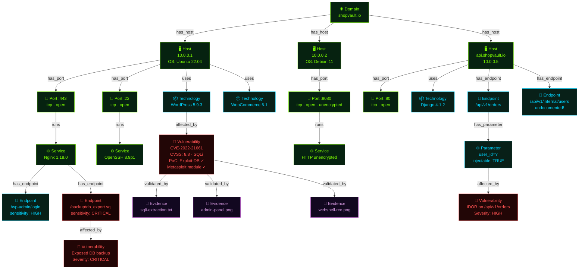

**Node colour key:**
- 🟢 **Lime** — Domain, Host, Port, Service (infrastructure layer)
- 🔵 **Cyan** — Technology, Endpoint, Parameter (application layer)
- 🔴 **Red** — Vulnerability (weakness layer)
- 🟣 **Purple** — Evidence (proof layer)

---

### Figure 1B — APG: The Attack Path Graph (Inferred Opportunity)

The Commander reads the ASG and reasons: *"These vulnerabilities can chain together into complete attack paths."* Those chains live here — in the APG.

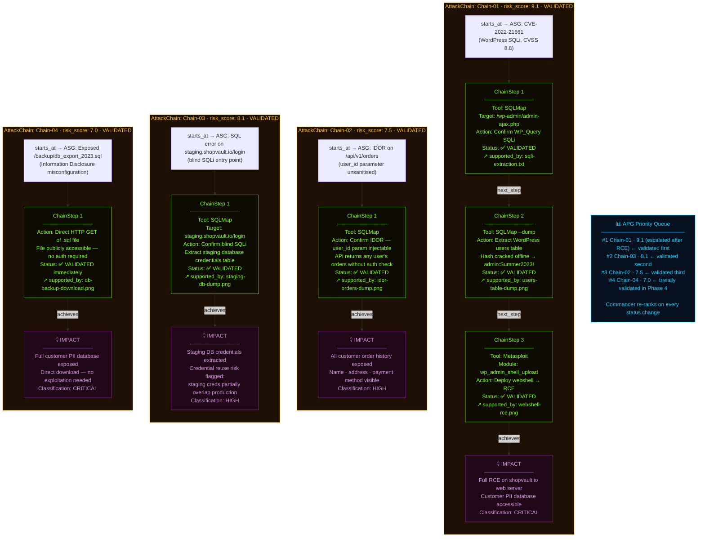

### What the Two Graphs Together Tell You

| Question | Answered By |
|----------|------------|
| "What hosts exist on shopvault.io?" | ASG → Domain → Host nodes |
| "What software is running on port 443?" | ASG → Port → Service → Technology nodes |
| "Which vulnerabilities were found?" | ASG → Vulnerability nodes (with CVSS, PoC status) |
| "What are the complete attack paths?" | APG → AttackChain nodes (with ChainSteps) |
| "Which attack is most dangerous?" | APG → risk_score ranking |
| "Is each attack actually proven?" | APG → validation_status + supported_by → ASG Evidence |
| "What is the proof?" | ASG → Evidence nodes (screenshots, tool outputs) |

---

## Module 03, Figure 1 — System Architecture: The Three-Tier Overview

This is the master view of CMatrix. Everything fits into three tiers:

- **Tier 1 (top):** Orchestration — the operator configures, the Commander reasons
- **Tier 2 (middle):** The dual-graph world model — the two living knowledge stores
- **Tier 3 (bottom):** The six specialist agents and the tool layer they operate through

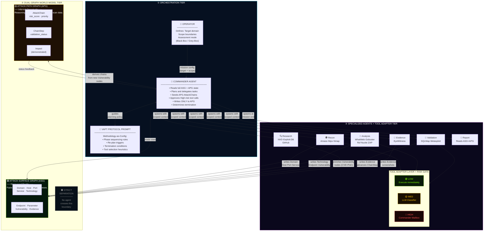

### Reading Key

| Colour | Meaning |
|--------|---------|
| 🟢 Cyan border | Commander — orchestration layer |
| 🟢 Lime/Green border | ASG — discovery facts |
| 🟡 Gold border | APG — attack reasoning |
| 🟣 Purple border | Agent tier + tool adapter |
| Solid arrow | Data flow / write |
| Dashed arrow | Read / feedback |

### Three Things to Notice

1. **The Commander never touches tools.** Every arrow from the Commander goes to agents — never to the Tool Adapter Layer directly.
2. **Only the Commander writes to the APG.** All six specialist agents write only to the ASG (or read from it). The APG is exclusively the Commander's domain.
3. **All tool calls go through the Tool Adapter Layer.** There is no path from an agent directly to a tool. The Risk Gate sits in that layer.

---

*Module 03, Figure 2 below: Agent Spawn Lifecycle*

---

## Module 03, Figure 2 — Agent Spawn Lifecycle: Born Fresh, Die Clean

This is the most important architectural insight that separates CMatrix from other multi-agent systems. Every agent is born fresh, does exactly one job with a scoped context, and vanishes — leaving only structured graph state behind.

### Figure 2A — The Spawn Lifecycle (single agent)

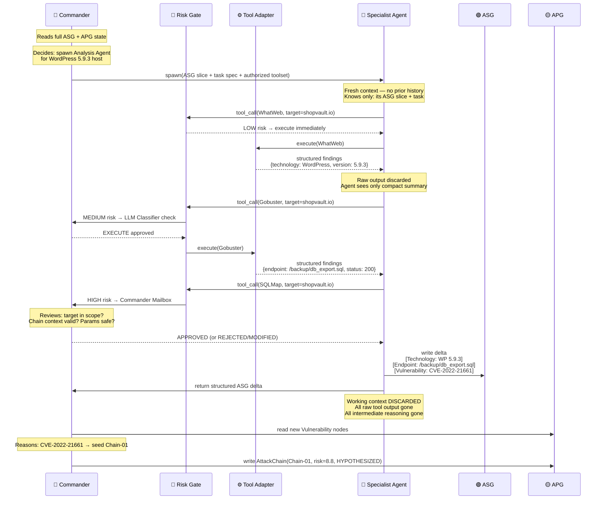

---

### Figure 2B — What Each Agent Receives at Spawn (Scoped Context)

```mermaid
flowchart LR
    CMD["👑 COMMANDER<br/>Decides next action"]

    subgraph SPAWN["Agent Spawn Package"]
        direction TB
        S1["📊 ASG SLICE<br/>Only nodes relevant to this task<br/>Not the full graph"]
        S2["🔗 APG SLICE<br/>Relevant AttackChains only<br/>(if this is a Validation task)"]
        S3["🔧 TOOL SET<br/>Authorized tools only<br/>No others available"]
        S4["📋 TASK SPEC<br/>Commander's current plan item<br/>Exact objective for this spawn"]
        S5["📚 KNOWLEDGE DOCS<br/>(Validation Agent + Analysis Agent)<br/>Vulnerability-class expert docs<br/>injected at spawn time"]
    end

    subgraph AGENT["🤖 Isolated Agent Context<br/>(fresh per task — no prior history)"]
        WORK["Works autonomously<br/>within bounded context<br/>All tool calls → Risk Gate"]
    end

    subgraph RETURN["Agent Returns"]
        R1["✅ Structured ASG Delta<br/>New nodes + edges only"]
        R2["🗑️ Working context DISCARDED<br/>Raw tool output → gone<br/>Conversation history → gone<br/>Intermediate reasoning → gone"]
    end

    CMD -->|"spawn with<br/>scoped package"| SPAWN
    SPAWN --> AGENT
    AGENT --> RETURN
    RETURN -->|"delta written<br/>to ASG"| ASG_ICON["🟢 ASG"]
    RETURN -->|"Commander reads<br/>new nodes"| CMD

    style CMD fill:#04162E,stroke:#00D4FF,color:#00D4FF
    style SPAWN fill:#0A0C1E,stroke:#9C27B0,color:#9C27B0
    style AGENT fill:#0A0C1E,stroke:#9C27B0,color:#fff
    style RETURN fill:#041808,stroke:#7FFF00,color:#7FFF00
    style ASG_ICON fill:#062210,stroke:#7FFF00,color:#7FFF00
    style S1 fill:#04180A,stroke:#7FFF00,color:#7FFF00
    style S2 fill:#1A1002,stroke:#FFC107,color:#FFC107
    style S3 fill:#180404,stroke:#FF5252,color:#FF5252
    style S4 fill:#041420,stroke:#00D4FF,color:#00D4FF
    style S5 fill:#100820,stroke:#9C27B0,color:#CE93D8
```

---

### Figure 2C — Why Context Isolation Produces Three Critical Properties

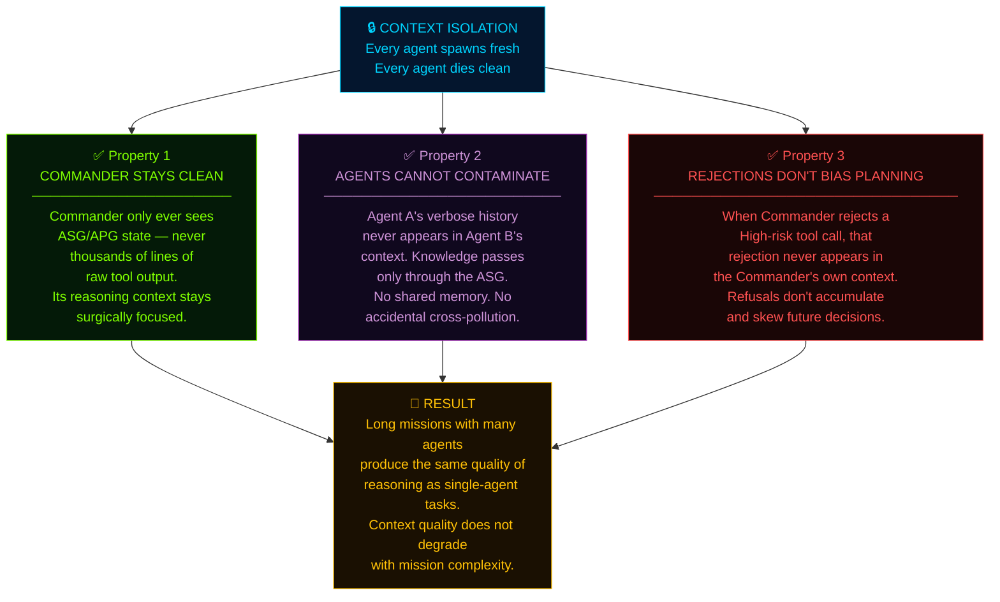

### Reading Key for Figure 2

| Concept | What to Notice |
|---------|---------------|
| Spawn package | 5 components — each scoped, none is the full system state |
| Tool Set boundary | Agent can ONLY use tools it was authorized for at spawn |
| Knowledge Docs | Validation Agent + Analysis Agent receive these — matched to their vulnerability class |
| Return = delta only | The ASG grows by addition — agents don't rewrite existing nodes |
| Context discarded | The working session is gone — the ASG persists forever |

---

*Module 04, Figure 1 below: Tool Risk Gate Flow*

---

## Module 04, Figure 1 — Tool Risk Gate: Every Tool Call's Journey

No tool in CMatrix executes without passing through this gate. This diagram shows the complete decision path — from an agent requesting a tool call, through all three risk tiers, to either execution or rejection.

### Figure 1A — The Full Risk Gate Decision Tree

```mermaid
flowchart TD
    START["🤖 Agent requests tool call<br/>───────────────────────────<br/>Tool: Gobuster<br/>Target: shopvault.io<br/>Params: -w big.txt -x php,sql"]

    HOOK1["🪝 PreToolUse Hook fires<br/>───────────────────────<br/>External observers notified.<br/>Hook returns: CONTINUE / BLOCK / MODIFY"]

    HOOK1_CHECK{Hook returns?}
    HOOK_BLOCK["❌ BLOCKED<br/>Action cancelled.<br/>Reason logged."]
    HOOK_MODIFY["🔄 MODIFIED<br/>Payload updated.<br/>Proceeds with<br/>modified params."]

    SCOPE["🔍 Scope Check<br/>──────────────────<br/>Is target in declared scope?<br/>Is this tool authorized<br/>for this agent type?"]

    SCOPE_FAIL["❌ OUT OF SCOPE<br/>Tool call rejected.<br/>Agent notified.<br/>No execution."]

    CLASSIFY["🎯 Risk Classification<br/>──────────────────────<br/>Which tier does this call belong to?"]

    LOW{"🟢 LOW RISK?<br/>Passive tools:<br/>Amass · httpx<br/>WhatWeb"}
    MED{"🟡 MEDIUM RISK?<br/>Active tools:<br/>Nmap · Gobuster · ffuf<br/>Nuclei · OWASP ZAP"}
    HIGH{"🔴 HIGH RISK?<br/>Exploitation tools:<br/>SQLMap · Metasploit"}

    EXEC_LOW["✅ Execute immediately<br/>No further approval needed"]

    CLASSIFIER["🧠 LLM Permission Classifier<br/>────────────────────────────<br/>Fast filter pass:<br/>  → Clearly safe? → EXECUTE<br/>  → Clearly risky? → ESCALATE<br/><br/>Chain-of-thought pass (ambiguous):<br/>  Axis 1: Scope alignment<br/>  Axis 2: Chain intent<br/>  Axis 3: Parameter safety<br/>  → Checks for prompt injection"]

    CLF_RESULT{Classifier verdict?}
    CLF_EXEC["✅ EXECUTE<br/>Proceeds to<br/>Tool Adapter"]
    CLF_ESC["⬆️ ESCALATE<br/>Routed to<br/>Commander Mailbox"]

    MAILBOX["📬 Commander Mailbox<br/>──────────────────────<br/>Approval request queued:<br/>  • Tool + module<br/>  • Target ASG node<br/>  • Chain context<br/>  • Rationale<br/><br/>(Human inserted here<br/>in supervised mode)"]

    CMD_REVIEW{Commander decides?}
    CMD_APPROVE["✅ APPROVED<br/>Proceeds to<br/>Tool Adapter"]
    CMD_REJECT["❌ REJECTED<br/>Cancelled.<br/>Reason annotated<br/>to APG chain."]
    CMD_MODIFY["🔄 MODIFIED<br/>Commander adjusts<br/>params, then approves"]

    ADAPTER["⚙️ Tool Adapter executes<br/>────────────────────────<br/>1. Translate request → CLI command<br/>2. Run tool<br/>3. Parse raw output → structured JSON<br/>4. Discard raw output"]

    HOOK2["🪝 PostToolUse Hook fires<br/>─────────────────────────<br/>Structured findings available.<br/>Hook can: log · alert · validate · block write"]

    ASG_WRITE["🟢 Structured findings<br/>written to ASG as<br/>nodes + edges"]

    AG_SUMMARY["🤖 Agent receives<br/>compact summary only<br/>(NOT raw output)"]

    START --> HOOK1
    HOOK1 --> HOOK1_CHECK
    HOOK1_CHECK -->|BLOCK| HOOK_BLOCK
    HOOK1_CHECK -->|MODIFY| HOOK_MODIFY
    HOOK1_CHECK -->|CONTINUE| SCOPE
    HOOK_MODIFY --> SCOPE

    SCOPE -->|fail| SCOPE_FAIL
    SCOPE -->|pass| CLASSIFY

    CLASSIFY --> LOW
    CLASSIFY --> MED
    CLASSIFY --> HIGH

    LOW -->|yes| EXEC_LOW
    MED -->|yes| CLASSIFIER
    HIGH -->|yes| MAILBOX

    CLASSIFIER --> CLF_RESULT
    CLF_RESULT -->|EXECUTE| CLF_EXEC
    CLF_RESULT -->|ESCALATE| MAILBOX

    MAILBOX --> CMD_REVIEW
    CMD_REVIEW -->|APPROVE| CMD_APPROVE
    CMD_REVIEW -->|REJECT| CMD_REJECT
    CMD_REVIEW -->|MODIFY| CMD_MODIFY

    EXEC_LOW --> ADAPTER
    CLF_EXEC --> ADAPTER
    CMD_APPROVE --> ADAPTER
    CMD_MODIFY --> ADAPTER

    ADAPTER --> HOOK2
    HOOK2 --> ASG_WRITE
    HOOK2 --> AG_SUMMARY

    style START fill:#04162E,stroke:#00D4FF,color:#fff
    style HOOK1 fill:#0C0820,stroke:#9C27B0,color:#CE93D8
    style HOOK2 fill:#0C0820,stroke:#9C27B0,color:#CE93D8
    style HOOK_BLOCK fill:#1A0606,stroke:#FF5252,color:#FF5252
    style HOOK_MODIFY fill:#1A1002,stroke:#FFC107,color:#FFC107
    style SCOPE fill:#0A0C1E,stroke:#888,color:#aaa
    style SCOPE_FAIL fill:#1A0606,stroke:#FF5252,color:#FF5252
    style CLASSIFY fill:#0A0C1E,stroke:#888,color:#aaa
    style LOW fill:#041A08,stroke:#7FFF00,color:#7FFF00
    style MED fill:#1A1002,stroke:#FFC107,color:#FFC107
    style HIGH fill:#1A0606,stroke:#FF5252,color:#FF5252
    style EXEC_LOW fill:#041A08,stroke:#7FFF00,color:#7FFF00
    style CLASSIFIER fill:#04162E,stroke:#00D4FF,color:#00D4FF
    style CLF_EXEC fill:#041A08,stroke:#7FFF00,color:#7FFF00
    style CLF_ESC fill:#1A1002,stroke:#FFC107,color:#FFC107
    style MAILBOX fill:#04162E,stroke:#00D4FF,color:#00D4FF
    style CMD_APPROVE fill:#041A08,stroke:#7FFF00,color:#7FFF00
    style CMD_REJECT fill:#1A0606,stroke:#FF5252,color:#FF5252
    style CMD_MODIFY fill:#1A1002,stroke:#FFC107,color:#FFC107
    style ADAPTER fill:#0A0C1E,stroke:#9C27B0,color:#CE93D8
    style ASG_WRITE fill:#062210,stroke:#7FFF00,color:#7FFF00
    style AG_SUMMARY fill:#04162E,stroke:#00D4FF,color:#00D4FF
```

---

### Figure 1B — What the LLM Permission Classifier Actually Checks

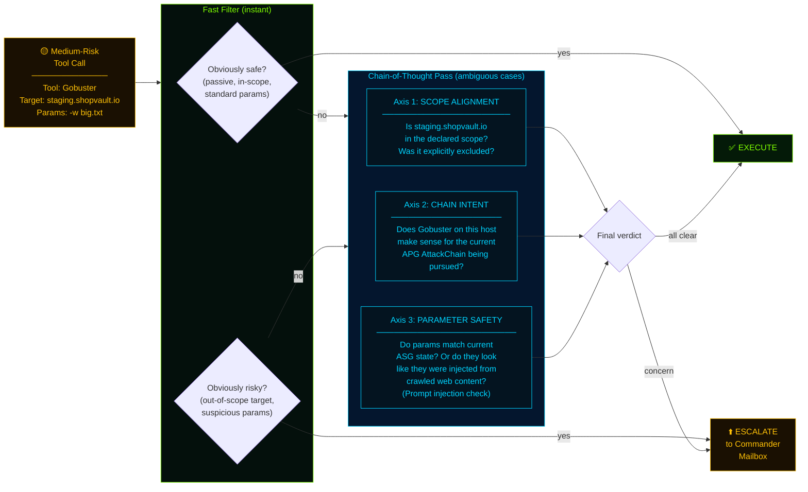

---

### Figure 1C — The 6 Lifecycle Hooks: Where Operators Can Intervene

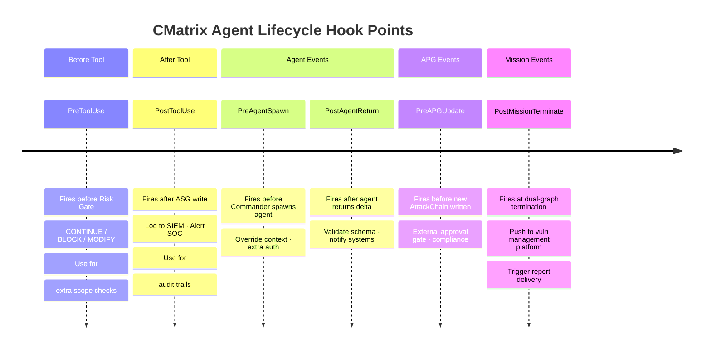

### Risk Gate Summary Table

| Tool | Tier | Gate | Rationale |
|------|------|------|-----------|
| Amass | 🟢 LOW | Scope check only | Passive DNS — no target traffic |
| httpx | 🟢 LOW | Scope check only | Read-only HTTP probing |
| WhatWeb | 🟢 LOW | Scope check only | Read-only fingerprinting |
| Nmap | 🟡 MED | LLM Classifier | Active scan — may trigger IDS |
| Gobuster | 🟡 MED | LLM Classifier | Active — unusual traffic patterns |
| ffuf | 🟡 MED | LLM Classifier | Active fuzzing — parameter injection risk |
| Nuclei | 🟡 MED | LLM Classifier | Template matching — active probes |
| OWASP ZAP | 🟡 MED | LLM Classifier | Active web scan — touches all endpoints |
| EyeWitness | 🟢 LOW | Scope check only | Screenshot only — no exploitation |
| SQLMap | 🔴 HIGH | Commander Mailbox | Destructive — extracts data |
| Metasploit | 🔴 HIGH | Commander Mailbox | Irreversible — achieves code execution |

---

*Module 06, Figure 1 below: Autonomous Planning Cycle Loop*

---

## Module 06, Figure 1 — The Autonomous Planning Cycle

The Commander runs this loop continuously — from mission start until the dual-graph termination condition fires. Every iteration is grounded in graph state. Every decision is traceable to a specific graph event.

### Figure 1A — The Core Planning Loop

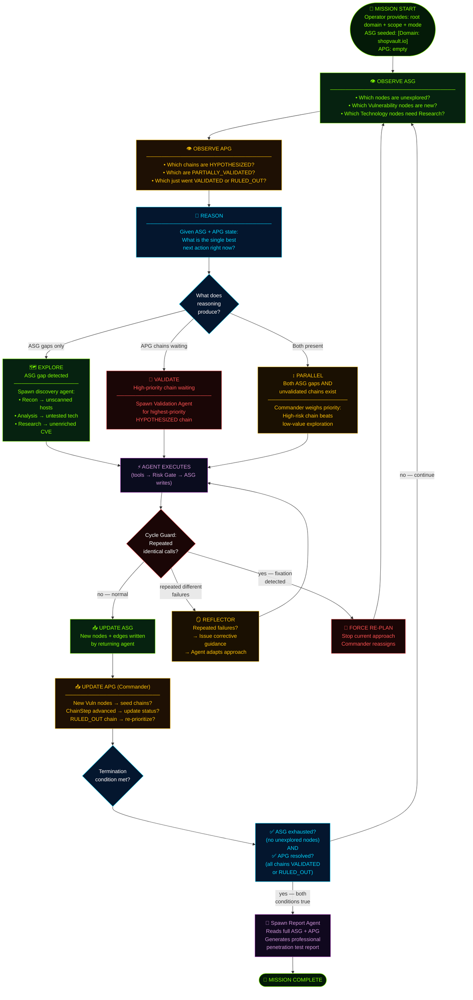

---

### Figure 1B — What Triggers a Re-Plan (Graph-Grounded Events)

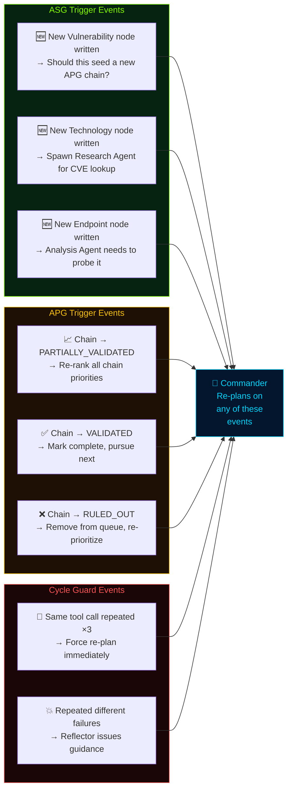

---

### Figure 1C — The Dual Termination Condition (Why Both Must Be True)

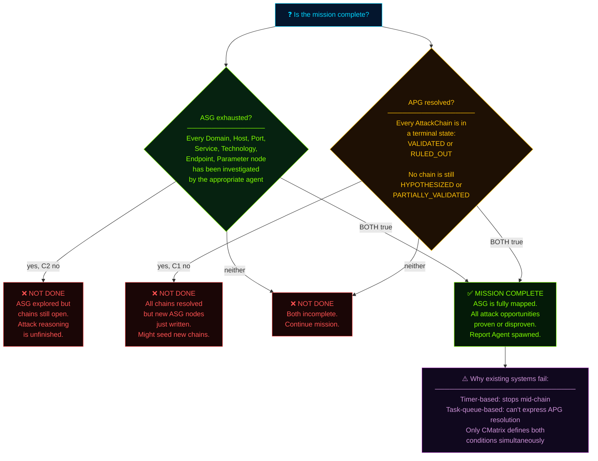

---

### Figure 1D — Context Compaction: How Long Missions Stay Sharp

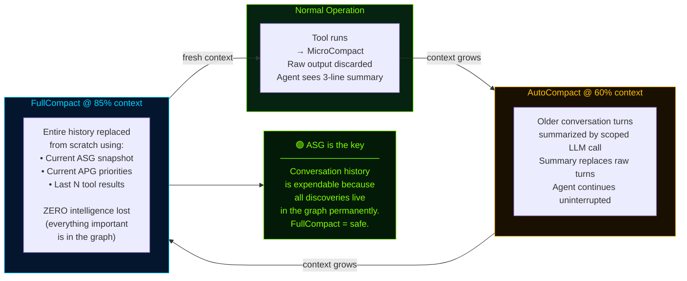

### Planning Cycle — Key Insights

| Question | Answer |
|----------|--------|
| What drives re-planning? | Explicit graph events — never timers or empty queues |
| How does the Commander know what to do next? | Reads ASG (unexplored nodes) + APG (chain priorities) |
| What prevents infinite loops? | Cycle Guard (identical calls) + Reflector (repeated failures) |
| When does the mission end? | ASG exhausted AND all APG chains terminal — both simultaneously |
| How does context stay manageable? | 3-layer compaction — history is expendable, graph is permanent |

---

*Module 07, Figure 1 below: shopvault.io Full Mission Walkthrough*

---

## Module 07, Figure 1 — Real-World Scenario: shopvault.io End-to-End

This is the complete picture. One real mission. Zero manual commands. Watch every tool, every graph write, every Commander decision, from the moment the operator presses start to the final professional report.

**Target:** `shopvault.io` — an e-commerce platform  
**Mode:** Black-Box (zero prior knowledge)  
**Scope:** All subdomains, web apps, REST APIs  
**Operator action:** Provide domain + scope → press start

---

### Figure 1A — Mission Timeline: Phase by Phase

```mermaid
flowchart TD
    OP(["🧑 OPERATOR<br/>Target: shopvault.io<br/>Scope: all subdomains<br/>Mode: Black-Box<br/>→ PRESS START"])

    subgraph P1["🟢 PHASE 1 — RECONNAISSANCE<br/>Recon Agent spawned"]
        A1["Tool: Amass<br/>────────────────────────<br/>14 subdomains discovered:<br/>api · admin · staging<br/>pay · mail · static · ..."]
        A2["Tool: httpx<br/>────────────────────────<br/>11 live hosts confirmed<br/>staging → unexpected 200 OK<br/>pay → TLS certificate EXPIRED"]
        A3["Tool: Nmap<br/>────────────────────────<br/>28 open ports mapped<br/>Ports: 80, 443, 8080, 8443, 22<br/>Services: Nginx 1.18 · OpenSSH 8.9<br/>Unencrypted HTTP on port 8080"]
        D1["📥 ASG DELTA<br/>37 new nodes written:<br/>14 Domain · 11 Host<br/>28 Port · 15 Service"]
    end

    subgraph P2["🔵 PHASE 2 — ANALYSIS + INTELLIGENCE<br/>Analysis Agent + Research Agent spawned"]
        B1["Tool: WhatWeb<br/>────────────────────────<br/>WordPress 5.9.3 on shopvault.io<br/>WooCommerce 6.1 detected<br/>Django 4.1.2 on api.shopvault.io<br/>→ Commander spawns Research Agent"]
        B2["Research Agent: NVD + Exploit-DB<br/>────────────────────────────────<br/>CVE-2022-21661 found (CVSS 8.8)<br/>PoC on Exploit-DB ✓<br/>Metasploit module available ✓"]
        B3["Tool: Gobuster<br/>────────────────────────<br/>/backup/db_export_2023.sql → 200!<br/>/wp-admin/login → 200<br/>/wp-admin/users → 403<br/>/api/v1/internal/users → 200"]
        B4["Tool: ffuf<br/>────────────────────────<br/>IDOR: user_id param unsanitised<br/>/api/v2 routes discovered<br/>Virtual host: internal.shopvault.io"]
        B5["Tool: Nuclei<br/>────────────────────────<br/>CVE-2022-21661 template → MATCH<br/>Exposed phpinfo.php on staging<br/>Default creds check: admin/admin → fail"]
        B6["Tool: OWASP ZAP<br/>────────────────────────<br/>XSS on /search?q= (reflected)<br/>SQL error on staging login form<br/>Missing security headers on API"]
        D2["📥 ASG DELTA: 61 new nodes<br/>Technology(3) · Endpoint(19)<br/>Parameter(8) · Vulnerability(9)<br/><br/>📥 APG DELTA: 3 chains seeded<br/>Chain-01: CVE-2022-21661 SQLi→RCE (8.8)<br/>Chain-02: IDOR orders API (7.5)<br/>Chain-03: Staging login blind SQLi (8.1)"]
    end

    subgraph P3["🔴 PHASE 3 — VALIDATION + EVIDENCE<br/>Validation Agent + Evidence Agent spawned"]
        C1["Chain-01 (highest priority: 8.8)<br/>────────────────────────────────<br/>Step 1: SQLMap on WP_Query<br/>→ SQLi confirmed ✅<br/>→ Evidence: sqli-extraction.txt"]
        C2["Step 2: SQLMap --dump users table<br/>────────────────────────────────<br/>→ Admin hash extracted ✅<br/>→ Offline crack: admin:Summer2023!<br/>→ Evidence: user-table-dump.png"]
        C3["Step 3: Metasploit wp_admin_shell_upload<br/>────────────────────────────────<br/>⚠️ HIGH RISK → Commander Mailbox<br/>→ Commander APPROVES<br/>→ Web shell deployed ✅<br/>→ RCE confirmed!<br/>→ risk_score escalated: 8.8 → 9.1<br/>→ Evidence: webshell-rce.png"]
        C4["Chain-03 (next by risk: 8.1)<br/>────────────────────────────────<br/>SQLMap on staging.shopvault.io/login<br/>→ Blind SQLi confirmed ✅<br/>→ Staging DB credentials extracted ✅<br/>→ Commander flags: staging creds overlap production<br/>→ Additional Impact node: credential reuse risk<br/>→ Evidence: staging-db-dump.png"]
        C5["Chain-02 (risk: 7.5)<br/>────────────────────────────────<br/>SQLMap on user_id parameter<br/>→ IDOR confirmed ✅<br/>→ Any customer's orders accessible without auth<br/>→ Evidence: idor-orders-dump.png"]
        D3["📥 APG DELTA<br/>Chain-01: VALIDATED (9.1)<br/>Chain-03: VALIDATED (8.1)<br/>Chain-02: VALIDATED (7.5)<br/><br/>📥 ASG DELTA<br/>Evidence nodes + edges added"]
    end

    subgraph P4["🟣 PHASE 4 — ASG EXHAUSTION + CHAIN-04 + REPORT"]
        C6["ASG Exhaustion Check<br/>────────────────────────────────<br/>Commander reads ASG: all 11 hosts mapped<br/>→ /backup/db_export_2023.sql still unvalidated<br/>→ Seed Chain-04: Direct DB backup download<br/>→ HTTP GET → 200 OK → VALIDATED immediately<br/>→ Evidence: db-backup-download.png"]
        RPT["📋 PROFESSIONAL PENETRATION TEST REPORT<br/>─────────────────────────────────────────<br/>• Executive Summary<br/>• 4 Validated Attack Chains<br/>• Full attack surface map (14 subdomains · 11 hosts)<br/>• 11 vulnerabilities with CVSS scores<br/>• Remediation guidance ordered by risk_score<br/>• Evidence at every ChainStep<br/>• ZERO manual commands issued"]
    end

    TERM["✅ TERMINATION CONDITION MET<br/>ASG: all 111 nodes explored<br/>APG: all 4 chains VALIDATED<br/>→ Report Agent spawned"]

    OP --> P1
    A1 --> A2 --> A3 --> D1
    D1 --> P2
    B1 --> B2 --> B3 --> B4 --> B5 --> B6 --> D2
    D2 --> P3
    C1 --> C2 --> C3
    C3 --> C4 --> C5 --> D3
    D3 --> TERM
    TERM --> P4
    C6 --> RPT

    style OP fill:#041A08,stroke:#7FFF00,color:#7FFF00
    style P1 fill:#062210,stroke:#7FFF00,color:#7FFF00
    style P2 fill:#04162E,stroke:#00D4FF,color:#00D4FF
    style P3 fill:#1A0606,stroke:#FF5252,color:#FF5252
    style P4 fill:#10081E,stroke:#9C27B0,color:#CE93D8
    style D1 fill:#041A08,stroke:#7FFF00,color:#7FFF00
    style D2 fill:#041A08,stroke:#7FFF00,color:#7FFF00
    style D3 fill:#1E1004,stroke:#FFC107,color:#FFC107
    style TERM fill:#041A08,stroke:#7FFF00,color:#7FFF00
    style C6 fill:#1E1004,stroke:#FFC107,color:#FFC107
    style RPT fill:#10081E,stroke:#9C27B0,color:#CE93D8
```

---

### Figure 1B — The Commander's Decision Log (Key Moments)

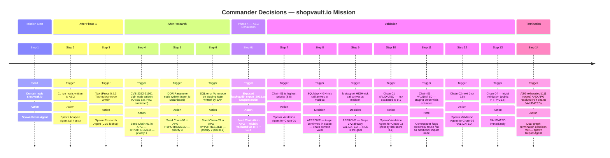

---

### Figure 1C — Final Mission Stats

```mermaid
flowchart LR
    subgraph ASG_FINAL["🟢 ASG — Final State"]
        direction TB
        N1["14 Domain nodes"]
        N2["11 Host nodes"]
        N3["28 Port nodes"]
        N4["15 Service nodes"]
        N5["3 Technology nodes"]
        N6["19 Endpoint nodes"]
        N7["8 Parameter nodes"]
        N8["9 Vulnerability nodes"]
        N9["4 Evidence nodes"]
        NT["= 111 total nodes"]
    end

    subgraph APG_FINAL["🟡 APG — Final State"]
        direction TB
        CH1["Chain-01: VALIDATED ✅<br/>risk: 9.1 (escalated after RCE)<br/>WordPress SQLi → Admin auth → RCE"]
        CH2["Chain-02: VALIDATED ✅<br/>risk: 7.5<br/>IDOR → Customer order PII"]
        CH3["Chain-03: VALIDATED ✅<br/>risk: 8.1<br/>Staging blind SQLi → Credential extraction"]
        CH4["Chain-04: VALIDATED ✅<br/>risk: 7.0<br/>Exposed DB backup → Full PII download"]
    end

    subgraph REPORT_FINAL["📝 Report Output"]
        direction TB
        R1["4 validated attack chains<br/>with step-by-step reproduction"]
        R2["Evidence artifacts linked<br/>at every ChainStep"]
        R3["11 vulnerabilities<br/>ordered by risk_score"]
        R4["Remediation guidance<br/>prioritized by business risk"]
        R5["0 manual commands issued<br/>during entire assessment"]
    end

    ASG_FINAL --> REPORT_FINAL
    APG_FINAL --> REPORT_FINAL

    style ASG_FINAL fill:#062210,stroke:#7FFF00,color:#7FFF00
    style APG_FINAL fill:#1E1004,stroke:#FFC107,color:#FFC107
    style REPORT_FINAL fill:#10081E,stroke:#9C27B0,color:#CE93D8
```

---

### Figure 1D — Chain-01 Full Traceability: From CVE to Evidence

This is the most important chain in the mission. Every arrow here is a relationship that exists in the dual graph — followable from the report all the way back to the raw evidence file.

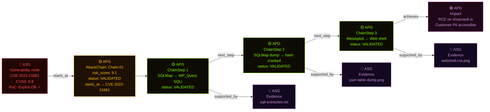

**Reading this diagram:** Start at the red CVE node (ASG fact) → follow `starts_at` to the gold Chain (APG reasoning) → follow ChainSteps in order → arrive at the purple Impact (what was demonstrated) → follow `supported_by` back to the purple Evidence nodes (ASG proof). Every claim in the final report has this complete path. Nothing is asserted without evidence.

---

### Summary: What Makes This Remarkable

| Fact | Significance |
|------|-------------|
| **Zero manual commands** | The operator configured scope and pressed start. Everything else was autonomous. |
| **All exploitation gated** | SQLMap and Metasploit both went through Commander Mailbox — no exploitation without explicit approval |
| **4 chains, all VALIDATED** | Every seeded AttackChain reached a terminal VALIDATED state — including the trivially validated DB backup chain |
| **risk_score escalated** | Chain-01 started at 8.8 (CVSS); after RCE was confirmed, Commander escalated to 9.1 |
| **Credential reuse discovered** | Chain-03 validation uncovered staging-to-production credential overlap — flagged as an additional APG Impact node |
| **Traceability** | Every Impact claim links through ChainSteps back to Evidence files in the ASG |
| **Dual termination** | Mission ended because 111 nodes explored AND 4/4 chains VALIDATED — not because a timer fired |

---

## Module 06, Figure 5 — Cross-Mission Experience Store: The Persistent Learning Layer

The ASG and APG are reset fresh for every mission. The Cross-Mission Experience Store is the only structure that survives across missions. This diagram shows its two-direction lifecycle: how it is written at mission close, and how it is queried at mission start.

```mermaid
flowchart TD
    subgraph MISSION_A["🟢 Mission A — shopvault.io (completed)"]
        direction LR
        A1["APG: Chain-01 VALIDATED<br/>WordPress 5.9.3 + WooCommerce<br/>SQLi → Admin → RCE"]
        A2["APG: Chain-03 VALIDATED<br/>Django API + staging SQLi<br/>Blind SQLi → Credential extraction"]
    end

    subgraph WRITE["📥 WRITE TRIGGER<br/>Report Agent — at mission close<br/>For every VALIDATED chain"]
        W1["Store Entry Written:<br/>──────────────────────────<br/>Target fingerprint: WordPress 5.9.3 · WooCommerce 6.1 · Nginx 1.18<br/>Vuln class: SQLi (CVE-2022-21661)<br/>Tool sequence: SQLMap → SQLMap dump → Metasploit<br/>ChainStep params: WP_Query endpoint · wp_admin_shell_upload<br/>Outcome: RCE achieved · admin hash cracked · Summer2023!<br/>Mission ID: MIS-001"]
    end

    subgraph STORE["🗄️ CROSS-MISSION EXPERIENCE STORE<br/>(Persistent · RAG-backed · Survives across missions)"]
        S1["Entry: MIS-001 · WordPress SQLi → RCE"]
        S2["Entry: MIS-001 · Django staging blind SQLi"]
        S3["Entry: MIS-002 · ... (prior missions)"]
        S4["Entry: MIS-00N · ..."]
    end

    subgraph QUERY["📤 QUERY TRIGGER<br/>Commander — at mission start<br/>After first Technology nodes written to ASG"]
        Q1["Query: WordPress 5.x + WooCommerce<br/>──────────────────────────<br/>Retrieves: MIS-001 entry<br/>Injects into Commander context as:<br/>Candidate chain hypotheses —<br/>pre-validated patterns from analogous past engagements"]
    end

    subgraph MISSION_B["🔵 Mission B — new target with WordPress 5.8"]
        direction LR
        B1["Commander seeds APG Chain-01<br/>Front-loaded: SQLi hypothesis<br/>already validated on similar stack<br/>→ Skips zero-prior reasoning<br/>→ Validation pursued immediately"]
    end

    MISSION_A --> WRITE
    WRITE --> STORE
    STORE --> QUERY
    QUERY --> MISSION_B

    style MISSION_A fill:#062210,stroke:#7FFF00,color:#7FFF00
    style WRITE fill:#1E1004,stroke:#FFC107,color:#FFC107
    style STORE fill:#04162E,stroke:#00D4FF,color:#00D4FF
    style QUERY fill:#1E1004,stroke:#FFC107,color:#FFC107
    style MISSION_B fill:#10081E,stroke:#9C27B0,color:#CE93D8
```

**Key properties:**
- The store is queried **immediately after the first Technology node batch** is written — before Analysis Agent begins enumeration. This front-loads high-probability chains.
- Only `VALIDATED` chains are written. `RULED_OUT` chains are not stored (they represent dead ends on specific parameters, not reusable patterns).
- Retrieval returns **candidate hypotheses** — the Commander still evaluates them against the current ASG before seeding APG chains. The store accelerates, it does not override.

---

## Module 06, Figure 6 — Attack Strategy Library: Cross-Mission Procedural Learning

The Cross-Mission Experience Store records raw per-mission outcomes. The Attack Strategy Library is a higher-order abstraction: generalized, named, parameterized attack strategies crystallized from multiple missions that produced the same result on the same technology fingerprint.

```mermaid
flowchart TD
    subgraph RAW["🗄️ Cross-Mission Experience Store<br/>(Raw per-mission records)"]
        R1["MIS-001: WordPress 5.9.3 + WooCommerce<br/>→ CVE-2022-21661 SQLi → RCE ✅"]
        R2["MIS-007: WordPress 5.8.2 + WooCommerce 6.0<br/>→ CVE-2022-21661 SQLi → RCE ✅"]
        R3["MIS-012: WordPress 5.9.1 + WooCommerce 6.1<br/>→ CVE-2022-21661 SQLi → RCE ✅"]
    end

    subgraph THRESHOLD["⚖️ Crystallization Threshold Check<br/>Commander evaluates after each mission close<br/>Same fingerprint pattern → VALIDATED<br/>across ≥ 2 independent missions?"]
        T1{"≥ 2 missions<br/>with same fingerprint<br/>→ same VALIDATED<br/>outcome?"}
    end

    subgraph CRYSTALLIZE["🔬 Crystallization<br/>Scoped LLM call — generalizes specific params<br/>into a technology-class procedure"]
        CR1["Input: 3 raw mission entries<br/>Output: Generalized strategy<br/>─────────────────────────────<br/>Strategy ID: STRAT-WP-SQLI-001<br/>Name: WordPress WP_Query SQLi → Admin RCE<br/>Fingerprint: WordPress 5.x + WooCommerce + Nginx<br/>Vuln class: SQLi · CVE range: CVE-2022-21661<br/>Tool sequence: SQLMap (WP_Query endpoint)<br/>  → SQLMap --dump (users table)<br/>  → Metasploit (wp_admin_shell_upload)<br/>Confidence: 3/3 missions (100%)<br/>Last validated: MIS-012"]
    end

    subgraph LIBRARY["📚 ATTACK STRATEGY LIBRARY<br/>(Named · Parameterized · Confidence-scored)"]
        L1["STRAT-WP-SQLI-001<br/>WordPress SQLi → RCE<br/>Confidence: 100% (3 missions)"]
        L2["STRAT-DJANGO-IDOR-001<br/>Django API IDOR<br/>Confidence: 67% (2/3 missions)"]
        L3["STRAT-... (growing library)"]
    end

    subgraph INJECT["🚀 Mission Start — Strategy Retrieval<br/>Commander queries Library AFTER<br/>Cross-Mission Experience Store query"]
        I1["Match: new target has WordPress 5.7<br/>→ Retrieves STRAT-WP-SQLI-001<br/>→ Injected as pre-ranked APG AttackChain seed<br/>→ Prioritized ABOVE zero-prior chains<br/>   (carries validated track record, not just CVSS)"]
    end

    RAW --> THRESHOLD
    T1 -->|"yes"| CRYSTALLIZE
    T1 -->|"no — keep accumulating"| RAW
    CRYSTALLIZE --> LIBRARY
    LIBRARY --> INJECT

    style RAW fill:#04162E,stroke:#00D4FF,color:#00D4FF
    style THRESHOLD fill:#1E1004,stroke:#FFC107,color:#FFC107
    style CRYSTALLIZE fill:#062210,stroke:#7FFF00,color:#7FFF00
    style LIBRARY fill:#10081E,stroke:#9C27B0,color:#CE93D8
    style INJECT fill:#1E1004,stroke:#FFC107,color:#FFC107
```

**Distinction from Cross-Mission Experience Store:**

| | Experience Store | Strategy Library |
|---|---|---|
| Granularity | Per-mission, per-chain raw records | Generalized across ≥2 missions |
| Content | Specific tool params, exact chain outcomes | Parameterized procedures + confidence scores |
| Query trigger | After first Technology nodes written | After Experience Store query — same mission start window |
| Write trigger | Every VALIDATED chain at mission close | Crystallization threshold: ≥2 matching missions |

---

## Module 06, Figure 2 — Validation Agent Self-Debug Loop

When a ChainStep fails, the Validation Agent does not immediately mark it `RULED_OUT`. It enters a bounded 4-step self-debugging loop before giving up.

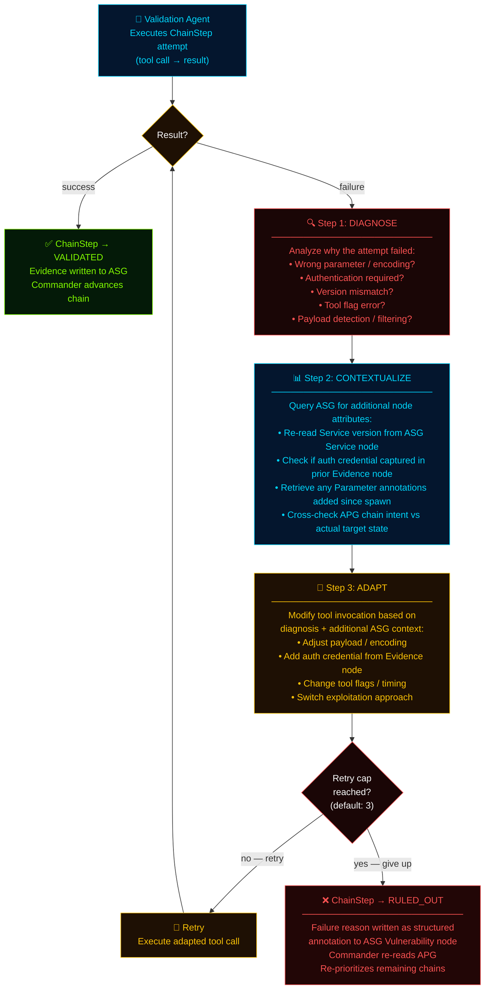

**Why this matters:**
- The cap (default 3) prevents infinite loops while giving the agent a real chance to recover from transient errors
- `RULED_OUT` is a **structured, annotated outcome** — the failure reason is written back to the ASG Vulnerability node so future missions or the Report Agent can read it
- The Commander re-prioritizes immediately on any `RULED_OUT` — the next-highest chain is pursued without delay

---

## Module 06, Figure 3 — Single LLM API: All Call Types, One Integration Point

CMatrix issues every LLM call through a single configured API. What varies between calls is not the model — it is the scope of the prompt. This diagram makes that explicit.

```mermaid
flowchart LR
    API["☁️ SINGLE CONFIGURED<br/>LLM API<br/>─────────────<br/>One model.<br/>One integration point.<br/>All behavioral differences<br/>explained by prompt scope<br/>— not routing logic."]

    subgraph CALLS["All LLM Call Types in CMatrix"]
        direction TB

        CALL1["👑 Commander Reasoning<br/>─────────────────────────<br/>Scope: FULL<br/>Receives: complete ASG snapshot<br/>+ APG chain priorities + chain status<br/>Produces: next planned action<br/>Frequency: every planning cycle iteration"]

        CALL2["🗜️ MicroCompact<br/>─────────────────────────<br/>Scope: NARROW<br/>Receives: single raw tool output<br/>Instruction: normalize to ASG schema fields<br/>Produces: structured JSON → written to ASG<br/>Raw output: discarded after write<br/>Frequency: every tool call"]

        CALL3["🗜️ AutoCompact<br/>─────────────────────────<br/>Scope: NARROW<br/>Receives: older conversation turns<br/>(at 60% context threshold)<br/>Instruction: summarize losslessly<br/>Produces: summary replaces old turns<br/>Frequency: triggered at 60% context"]

        CALL4["🔍 Research Agent Normalization<br/>─────────────────────────<br/>Scope: NARROW<br/>Receives: raw NVD / Exploit-DB response<br/>Instruction: extract to ASG Vulnerability schema<br/>Produces: enriched Vulnerability node attributes<br/>Frequency: per Research Agent invocation"]

        CALL5["🚦 Permission Classifier<br/>─────────────────────────<br/>Scope: NARROW<br/>Receives: tool call + target ASG node<br/>+ current APG chain context<br/>Instruction: evaluate 3 axes → binary verdict<br/>Produces: EXECUTE or ESCALATE<br/>Frequency: every Medium-risk tool call"]
    end

    CALL1 --> API
    CALL2 --> API
    CALL3 --> API
    CALL4 --> API
    CALL5 --> API

    style API fill:#04162E,stroke:#00D4FF,color:#00D4FF
    style CALL1 fill:#1E1004,stroke:#FFC107,color:#FFC107
    style CALL2 fill:#062210,stroke:#7FFF00,color:#7FFF00
    style CALL3 fill:#062210,stroke:#7FFF00,color:#7FFF00
    style CALL4 fill:#10081E,stroke:#9C27B0,color:#CE93D8
    style CALL5 fill:#1A0606,stroke:#FF5252,color:#FF5252
```

**Why single-API matters for research:** Every result CMatrix produces is attributable to one model under one configuration. There is no hidden quality/cost trade-off from silently routing some calls to a cheaper model. Evaluation is honest.

---

## Module 06, Figure 4 — Vulnerability-Class Knowledge Injection

At agent spawn time, Validation Agent and Analysis Agent receive curated offline expert documents matched to their assigned vulnerability class. These are injected once at spawn — not accumulated in conversation history — so they survive context compaction automatically.

```mermaid
flowchart TD
    CMD["👑 Commander<br/>Spawns specialist agent<br/>with assigned vulnerability class"]

    subgraph INJECT["📚 Knowledge Injection at Spawn"]
        direction TB

        K1["Analysis Agent — Web Targets<br/>────────────────────────────────<br/>• OWASP Testing Guide checklist<br/>  (per applicable OWASP category)<br/>• Common web misconfiguration patterns"]

        K2["Analysis Agent — API Targets<br/>────────────────────────────────<br/>• REST API attack surface checklist<br/>• IDOR patterns<br/>• Parameter pollution techniques"]

        K3["Validation Agent — SQLi Chains<br/>────────────────────────────────<br/>• SQL injection technique taxonomy<br/>• SQLMap flag reference guide<br/>• Blind / time-based detection patterns"]

        K4["Validation Agent — XSS Chains<br/>────────────────────────────────<br/>• XSS payload pattern library<br/>• CSP bypass techniques<br/>• DOM vs reflected vs stored distinction"]

        K5["Validation Agent — Exploit Chains<br/>────────────────────────────────<br/>• Metasploit module selection heuristics<br/>• Payload / encoder selection guide<br/>• Post-exploitation evidence collection"]
    end

    subgraph PROP["Key Properties"]
        direction TB
        P1["Static · curated · version-controlled<br/>Encodes practitioner knowledge<br/>implicit in LLM pre-training"]
        P2["Re-injected at every spawn<br/>Never accumulated in history<br/>→ Survives FullCompact automatically"]
        P3["No internet access required<br/>Separate from Research Agent<br/>live CVE intelligence"]
    end

    CMD --> INJECT
    INJECT --> PROP

    style CMD fill:#04162E,stroke:#00D4FF,color:#00D4FF
    style INJECT fill:#10081E,stroke:#9C27B0,color:#CE93D8
    style K1 fill:#082018,stroke:#00D4FF,color:#00D4FF
    style K2 fill:#082018,stroke:#00D4FF,color:#00D4FF
    style K3 fill:#1A0606,stroke:#FF5252,color:#FF5252
    style K4 fill:#1A0606,stroke:#FF5252,color:#FF5252
    style K5 fill:#1A0606,stroke:#FF5252,color:#FF5252
    style PROP fill:#041A08,stroke:#7FFF00,color:#7FFF00
```

> **Distinction from Research Agent:** Research Agent retrieves **live CVE data** for specific discovered versions during a mission. Knowledge injection provides **evergreen offensive technique reasoning** that does not depend on external network access and is re-used across all missions.

---

## Module 08 — Complete ✅

The diagrams have been migrated to their contextually appropriate modules. Here is the new mapping:

| Location | Figure | What It Shows |
|---|---------|---------------|
| Module 03 | Figure 1: System Architecture | 3-tier swim-lane: Orchestration → Dual-Graph → Agents+Tools |
| Module 02 | Figure 1: Dual-Graph Model | ASG node tree (9 types) + APG chain lifecycle (4 chains) |
| Module 03 | Figure 2: Agent Spawn Lifecycle | Sequence diagram + spawn package + 3 isolation properties |
| Module 04 | Figure 1: Tool Risk Gate | Full decision tree + LLM classifier internals + 6 hooks timeline |
| Module 06 | Figure 1: Planning Cycle | Core loop + re-plan triggers + dual termination + compaction |
| Module 06 | Figure 2: Validation Agent Self-Debug Loop | 4-step diagnose→contextualize→adapt→cap loop |
| Module 06 | Figure 3: Single LLM API / Scoped Calls | All call types routed to one API, differentiated by prompt scope |
| Module 06 | Figure 4: Vulnerability-Class Knowledge Injection | Agent-to-document injection mapping |
| Module 07 | Figure 1: shopvault.io Walkthrough | Phase-by-phase timeline + Commander log + traceability chain |
| Module 06 | Figure 5: Cross-Mission Experience Store | Mission-start query + mission-end write lifecycle |
| Module 06 | Figure 6: Attack Strategy Library Crystallization | Fingerprint → multi-mission → crystallized strategy flow |
