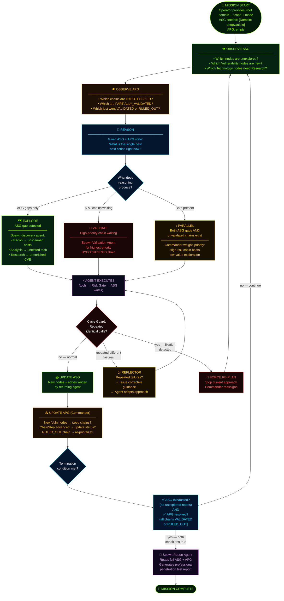
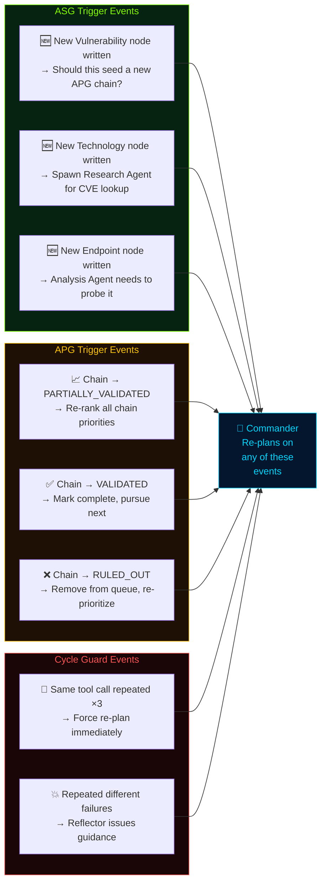
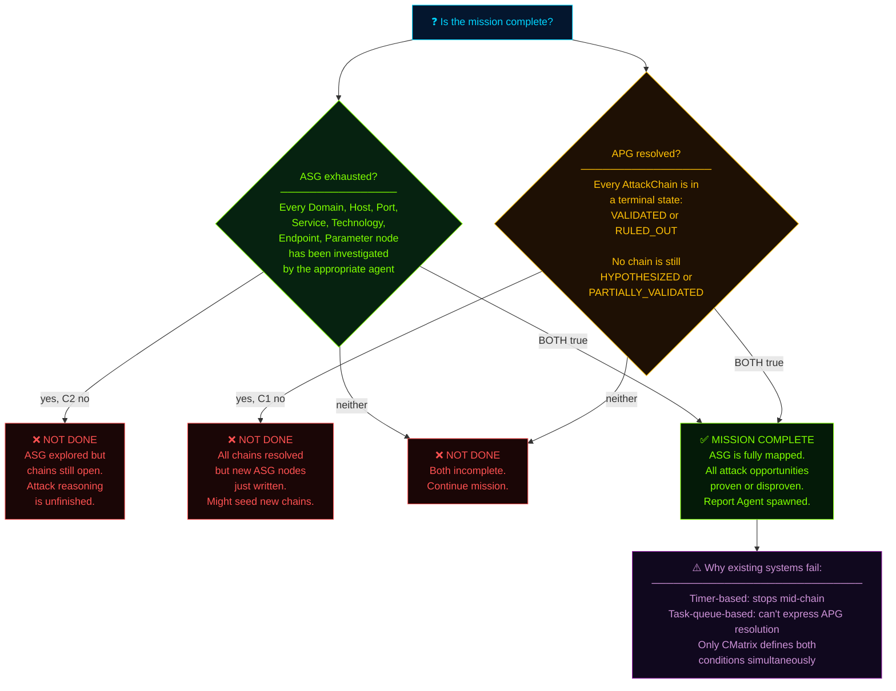
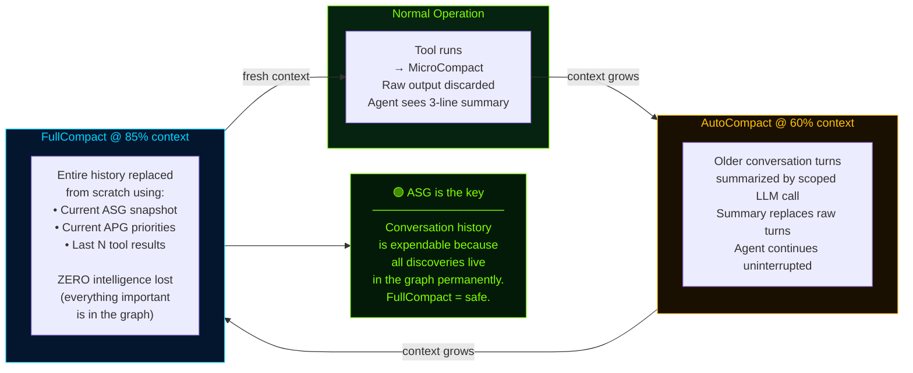

# Module 06 — The Planning Cycle, Context Management, and Cross-Mission Learning

## 🎯 One-Line Summary

CMatrix runs a continuous observe → reason → plan → execute loop, manages memory intelligently across long sessions without losing anything, and gets measurably smarter after every mission it completes.

---

## 🔄 The Autonomous Planning Cycle — How the System Thinks

Every CMatrix mission runs on a single continuous loop. There's no hardcoded script. No predetermined sequence of tasks. The Commander reads the current state of the world (the dual graph), reasons about what's most important, acts on that reasoning, and repeats — until the mission is genuinely complete.

### The Full Cycle, Step by Step

```
Step 1: OBSERVE ASG
    → Read current ASG state.
    → What hosts, services, technologies have been discovered?
    → What Vulnerability nodes are new since the last cycle?
    → Are there unexplored nodes — Hosts without Port scans? Technologies without CVE research?

Step 2: OBSERVE APG
    → Read all AttackChain priorities and validation statuses.
    → Which chains are HYPOTHESIZED and waiting to be validated?
    → Which chains are PARTIALLY_VALIDATED and need continuation?
    → Which chains just went VALIDATED or RULED_OUT?

Step 3: REASON
    → Given what I know, what's the best next action?
    → Option A: Explore an unexplored ASG gap (spawn Recon, Analysis, or Research Agent)
    → Option B: Validate the highest-priority APG chain (spawn Validation Agent)
    → Both happen when there are both unexplored nodes AND unvalidated chains — the Commander decides priority

Step 4: PLAN
    → Commit to the chosen next action.
    → Determine the appropriate agent, the ASG/APG slice it needs, and the restricted toolset it's authorized.

Step 5: SPAWN
    → Spawn the context-isolated specialist agent with its scoped context.
    → The agent's working context is bounded and fresh — it knows nothing from previous agents' histories.

Step 6: GATE
    → Every tool call the agent makes passes through the Risk Gate.
    → High-risk calls route to Commander mailbox for approval.
    → Medium-risk calls go through LLM Permission Classifier.

Step 7: EXECUTE
    → Approved tools run. Raw output is parsed by Tool Adapters.
    → Structured findings flow to the ASG.

Step 8: UPDATE ASG
    → Agent writes its discovered nodes and edges to the ASG.
    → The ASG now contains new knowledge.

Step 9: UPDATE APG
    → Commander reads the new ASG state.
    → New Vulnerability nodes → seed new APG AttackChains?
    → Validated ChainSteps → advance chain status?
    → RULED_OUT chains → remove from pursuit queue?

Step 10: RETURN
    → Agent returns its structured delta to the Commander.
    → Agent's entire working context — all history, all tool output, all intermediate reasoning — is permanently discarded.

Step 11: RE-PLAN
    → Commander re-reads the full dual graph.
    → Returns to Step 1.
```

Then repeat. Until the termination condition fires.

### What Triggers a Re-Plan?

Not arbitrary timers. Not random scheduling. The re-plan is **graph-grounded** — it fires on explicit, traceable changes to the dual graph:

| Trigger | What Happens |
|---------|-------------|
| New ASG Vulnerability node | Commander evaluates: should this seed a new APG AttackChain? |
| APG chain status changes to `PARTIALLY_VALIDATED` | Commander re-evaluates chain priorities |
| APG chain status changes to `VALIDATED` | Commander marks chain complete; moves to next in queue |
| APG chain status changes to `RULED_OUT` | Commander re-prioritizes; moves to next highest-priority chain |
| High-risk tool call rejected | Commander adapts the plan (may try a different approach or de-prioritize the chain) |
| New unexplored ASG nodes written by a returning agent | Commander decides whether to explore or validate first |

Every re-plan has a **formal, inspectable cause** — a specific graph event. This is what makes CMatrix's re-planning reliable and auditable. You can look at the engagement trajectory (covered later in this module) and see *exactly why* the Commander changed course at any point.

---

## 🏁 The Termination Condition — When Is the Mission Actually Done?

This is one of CMatrix's most important contributions to autonomous VAPT. The question seems simple: "When should the system stop?" In practice, it's one of the hardest problems in autonomous assessment.

### How Existing Systems Fail at This

Most existing automated systems use blunt, proxy-based termination criteria:

**Timer:** "Run for 4 hours, then stop." Problems: a timer might expire mid-validation when the most critical chain is 80% proven. Or it might stop 30 minutes early when there were still unexplored attack paths.

**Task queue empty:** "When the to-do list is empty, stop." Problems: What if new vulnerabilities are discovered mid-assessment that weren't in the original to-do list? A new Technology node discovered in Phase 2 might seed a new APG chain that wasn't in Phase 1's plan. A static task queue can't accommodate dynamic discovery.

### CMatrix's Dual Termination Condition

CMatrix replaces both with a single, formally grounded condition:

> **The mission terminates when AND ONLY WHEN both of the following are simultaneously true:**
> 1. **ASG exhaustion:** No unexplored nodes remain. Every discovered Domain, Host, Port, Service, Technology, Endpoint, and Parameter has been assigned to and processed by the appropriate agent.
> 2. **APG resolution:** Every AttackChain is in a terminal state — either `VALIDATED` or `RULED_OUT`. No chain is still `HYPOTHESIZED` or `PARTIALLY_VALIDATED`.

### Why Each Condition Alone is Insufficient

| Condition | Why It's Not Enough By Itself |
|-----------|-------------------------------|
| ASG exhausted only | All infrastructure mapped — but if chains are still HYPOTHESIZED, the attack reasoning is unfinished. The report would be incomplete. |
| APG all resolved only | All chains concluded — but if new ASG nodes were just written by the last agent, they might seed new chains that haven't been created yet. |
| Both simultaneously | The infrastructure is fully mapped AND all derived attack hypotheses have been proven or disproven. Genuinely complete. |

### Why This is a Research Contribution

> Neither pure task-queue systems nor pure graph-traversal systems can express this dual condition simultaneously.

- A task-queue system has no concept of "APG chains" — it can't ask "are all attack chains in terminal states?"
- A graph-traversal system can exhaust a graph — but it has no concept of "attack chain hypotheses derived from discoveries" — it can't ask "have all derived attack opportunities been resolved?"

CMatrix is the first autonomous VAPT system to define a **formally grounded dual termination condition** that covers both discovery completeness (ASG) and reasoning completeness (APG).

A third, optional trigger: user-defined constraints (time limits, scope boundaries) can force termination early. But the *natural* termination is always the dual-graph condition — and any early termination is explicitly flagged as incomplete in the generated report.

---

## 🛡️ Cycle Guard and Reflector — Preventing the AI From Getting Stuck

Long autonomous sessions can develop a failure mode called **fixation**: an agent repeats the same action over and over, making no progress, burning budget with no return. This is a known problem in autonomous AI systems and a serious practical concern for sessions that might run for hours.

CMatrix guards against this with two lightweight protective mechanisms layered onto the planning cycle:

### 🔁 Cycle Guard — Detecting Repetition

The Cycle Guard monitors each agent's recent action history. If an agent issues the **exact same tool call** (same tool + same target + same parameters) more than a configurable threshold (default: 3 times) within a phase, the Commander **forces a re-plan** rather than letting the agent continue.

**The key insight:** Repeated identical tool calls are a signal of fixation, not progress. If the Recon Agent has run the same Nmap command on the same host three times and keeps getting the same result, continuing the same call is not going to produce new information. Something is structurally wrong — maybe the approach is wrong, maybe the host is unreachable for a deeper reason, maybe a different tool is needed. Better to re-plan than to spin in place.

**Example:** Validation Agent sends SQLMap against the same parameter three times with identical flags. The Cycle Guard fires. Commander re-plans. Either the Validation Agent retries with different parameters (if still within the self-debugging loop's cap) or the ChainStep is marked `RULED_OUT`.

### 🪞 Reflector — Diagnosing Repeated Failure

The Reflector handles a different failure mode: when tool calls fail repeatedly but *differently* (not the exact same call — distinct failures with distinct error messages). In this case, the agent isn't stuck in a loop — it's trying different things but consistently failing.

The Reflector issues **corrective guidance** to the agent: it analyzes the recent failure pattern and provides targeted feedback to help the agent adapt its approach, rather than letting it keep trying blind variations.

**Example:** Validation Agent's last three SQLMap attempts all failed, each with a different error:
- Attempt 1: "Connection timeout"
- Attempt 2: "Parameter not injectable at this point"
- Attempt 3: "WAF blocking payload"

The Reflector steps in: "Your last three failures suggest a WAF (Web Application Firewall) is blocking standard SQLMap payloads. Consider enabling WAF bypass mode with `--tamper=randomcase` and adding a delay with `--delay=2`."

This targeted intervention is far more useful than blind retry number four.

### What These Mechanisms Don't Touch

Both Cycle Guard and Reflector are evaluated against the **agent's own recent action history** — not the ASG or APG. This means:
- They add no additional graph-write surface
- They cannot contaminate the graphs with diagnostic state
- They have zero impact on the core planning cycle until they need to fire
- They are lightweight — just pattern checks on recent action logs

---

## 🧠 ASG-Backed Context Management — Never Running Out of Memory

### The Problem: LLM Context Windows Have Limits

An LLM can only "see" a certain amount of text at once — its **context window**, measured in tokens. A thorough penetration test of a large target might involve:
- Thousands of tool invocations
- Hundreds of discovered nodes and edges
- Multiple chains being validated simultaneously
- Hours or days of continuous operation

Even modern LLMs with 128K–1M token context windows can be overwhelmed by:
- Full Nmap reports (hundreds of hosts × detailed service banners)
- OWASP ZAP XML reports (megabytes of crawled content)
- SQLMap verbose output (database enumeration can produce thousands of lines)
- Directory brute-force results (tens of thousands of tried paths)

Without active management, the context fills up and the system either fails or has to drop earlier findings to make room — which means losing intelligence that was working to discover.

### The Core Architectural Insight

> **The ASG is a lossless persistent store of all discoveries. Conversation history is expendable. The ASG is not.**

Everything that matters — every discovered node, every vulnerability finding, every evidence artifact — is permanently stored in the ASG as structured graph data. The conversation history (raw tool outputs, intermediate agent reasoning, verbose exchanges) is scaffolding. Once findings are written to the graph, the scaffolding can be aggressively compressed without losing a single discovery.

This is the property that enables CMatrix's context management. It's the core reason CMatrix can handle arbitrarily long sessions without degradation.

### The Three-Layer Compaction System

#### Layer 1 — MicroCompact (Runs on Every Single Tool Call)

**Trigger:** Every time the Tool Adapter parses a tool's raw output.

**What happens:** Only a compact summary enters the agent's working context. The full raw output is never stored in the context — only in the ASG.

**Example:**
- Nmap produces 2,847 lines of detailed output.
- Tool Adapter parses this into 11 Host nodes, 28 Port nodes, 15 Service nodes → written to ASG.
- What the agent sees in its context: *"Nmap completed. 11 live hosts discovered. 28 open ports. Services: Nginx 1.18.0 (ports 80, 443), Jetty 9.4.51 (port 8080), OpenSSH 8.9p1 (port 22). Full details in ASG."*
- The 2,847 raw lines: discarded.

This happens on every tool call. Context growth per tool call is minimized from potentially thousands of lines to a few sentences.

#### Layer 2 — AutoCompact (Triggers at 60% Context Capacity)

**Trigger:** When the conversation history reaches 60% of the context window.

**What happens:** Older conversation turns are summarized via a separate, scoped LLM call. The summary replaces the stale history. The agent's primary reasoning thread continues without interruption.

**What "scoped LLM call" means:** This is not a full Commander reasoning call — it's a narrow, cheap call issued with a constrained prompt: "Here are conversation turns 1-50. Summarize them losslessly into a compact state snapshot capturing all decisions made and their outcomes." Output: a dense but readable summary. The turns are replaced by the summary. Context usage drops back down.

**The agent doesn't notice.** It continues reasoning from where it was — the summary provides the same information as the full history, in fewer tokens.

#### Layer 3 — FullCompact (Triggers at 85% Context Capacity)

**Trigger:** When conversation history reaches 85% of the context window.

**What happens:** The entire conversation history is **replaced from scratch**. The agent's context is reconstructed purely from:
- The current ASG snapshot (all discovered nodes and edges relevant to the task)
- Current APG priority chains and their statuses
- The last N tool results (recent operational context)

Nothing else is needed. Everything important is in the graph.

**The critical property:** Because all discoveries live in the ASG, FullCompact loses **zero intelligence** — only the conversational scaffolding that produced those discoveries. The agent emerges from FullCompact with a fresh, clean context containing all the knowledge it had before — because that knowledge was always in the graph, not in the conversation history.

> **No general-purpose agent can claim this property.** A typical coding agent or planning agent stores its understanding in conversation history. If you compress that history away, you lose understanding. CMatrix can compress conversation history to near-zero and lose nothing, because the dual graph is the single source of truth — not the context window.

### The Single LLM API — One Model, Many Scopes

CMatrix never routes calls to different models for different tasks. Everything — Commander reasoning, specialist agent execution, MicroCompact summarization, Research Agent output normalization, Permission Classifier evaluation — goes through **the same configured LLM API**.

What changes between calls is the **scope of the prompt**, not the model:

| Task | Call Type |
|------|-----------|
| Commander reasoning, chain scoring, mission planning | Full-context call against the dual graph |
| AutoCompact / MicroCompact summarization | Narrow-scope call constrained to summarization of N turns |
| Research Agent output normalization | Narrow-scope call constrained to the ASG Vulnerability schema |
| Permission Classifier evaluation | Narrow-scope call constrained to a binary `EXECUTE` / `ESCALATE` decision |

**Why does this matter for research?**

This design keeps CMatrix's evaluation **honest**. Every result the system produces is attributable to one model under one configuration. There are no hidden quality trade-offs from silently routing some calls to a cheaper or weaker model. When CMatrix is benchmarked against other systems, the comparison is clean: same model, same API, different architecture.

---

## 🌐 Cross-Mission Experience Store — The System Remembers

### The Problem: Starting From Zero Every Time

The ASG and APG are per-mission structures. When a mission ends, they're closed. The next mission starts fresh — different target, different graph. This is correct by design — you don't want knowledge from a WordPress exploit to contaminate your reasoning about an AWS environment.

But this creates waste: all the valuable intelligence accumulated during a successful mission — the exact SQLMap parameters that worked, the specific Metasploit module that succeeded, the step-by-step chain that achieved RCE on WordPress 5.9.3 — disappears when the mission ends.

If CMatrix runs a second assessment against another company that also runs WordPress 5.9.3 + WooCommerce 6.1 + Nginx, it has to rediscover everything from zero. The same tools. The same reasoning process. The same chain hypothesis. Starting cold each time.

**The Cross-Mission Experience Store solves this.**

### What It Is

The Cross-Mission Experience Store is a **persistent, RAG-backed knowledge base** that survives across missions. It is not part of any individual ASG or APG — it exists at a layer above the per-mission graphs.

### Background: What is RAG?

**RAG = Retrieval-Augmented Generation.** Instead of an LLM relying only on what it was trained on, RAG allows the LLM to **query an external database at runtime** and retrieve relevant information to inject into its context before generating a response.

Think of it like this: the LLM is a smart analyst, and RAG gives that analyst a searchable filing cabinet of past cases. Before answering a question, the analyst can search the cabinet for relevant precedents and include them in their thinking.

In CMatrix's Cross-Mission Experience Store, the "filing cabinet" contains detailed records of every validated exploitation chain ever completed. The "query" is the technology fingerprint of the current target. The "retrieved precedent" is injected into the Commander's reasoning context before it seeds APG chains — giving the Commander a head start.

### What Gets Written (At Mission Close)

At mission termination, the Report Agent writes a structured summary into the store for every chain with terminal status `VALIDATED`:

```json
{
  "target_fingerprint": "WordPress 5.9.3 + WooCommerce 6.1 + Nginx 1.18.0",
  "vulnerability_class": "SQL Injection",
  "cve": "CVE-2022-21661",
  "cvss": 8.8,
  "successful_tool_invocation": {
    "tool": "sqlmap",
    "parameters": "--url http://target/wp-admin/admin-ajax.php --dbms=mysql --level=3 --risk=2 -p 'query_vars'"
  },
  "chain_step_sequence": [
    "SQLMap confirm injection on WP_Query endpoint",
    "Extract WordPress user table",
    "Offline hash crack with rockyou wordlist",
    "Metasploit wp_admin_shell_upload with cracked credentials",
    "Webshell deployed → RCE confirmed"
  ],
  "mission_outcome": "Full RCE on web server. Customer PII database accessible."
}
```

### When It Gets Read (At Mission Start)

Immediately after the Recon Agent writes the first batch of Technology nodes to the ASG (and **before** the Analysis Agent begins deep enumeration), the Commander queries the store:

*"Retrieve all past validated chains against targets matching: WordPress 5.x, any WooCommerce version, any reverse proxy."*

The store returns matching records. The Commander injects these as **candidate chain hypotheses** — pre-validated patterns from analogous past engagements.

Instead of starting from zero, the Commander can immediately:
1. Create APG AttackChains seeded from past validated patterns (with a high confidence baseline)
2. Front-load high-probability chains rather than discovering them through expensive trial and error
3. Know in advance which tool parameters have worked before against this technology class

**The analogy:** Think of an experienced penetration tester vs. a junior tester. The junior starts each engagement with zero institutional knowledge — they have to discover everything from scratch. The experienced tester has done 50 engagements. When they see WordPress 5.9.3, they already know from memory: "I've exploited this CVE three times. Here's what works. Here's what doesn't. Let me start there."

The Cross-Mission Experience Store is CMatrix's institutional memory.

---

## 🏆 Attack Strategy Library — Wisdom, Not Just Memory

### The Distinction: Memory vs. Wisdom

The Cross-Mission Experience Store is **raw memory** — specific tool parameters, exact chain outcomes, per-mission records. Valuable, but granular and specific.

As CMatrix completes more missions, a pattern emerges: the same *type* of target (not the same specific host, but the same technology fingerprint) produces the same *type* of validated chain. WordPress 5.x with WooCommerce keeps producing SQL injection → admin access → RCE chains. Each mission has slightly different specific parameters, but the general procedure is the same.

The **Attack Strategy Library** takes this pattern and crystallizes it into **generalized, named, reusable attack procedures** — a higher-order abstraction built on top of the raw memory.

If the Cross-Mission Experience Store is a filing cabinet of past cases, the Attack Strategy Library is a **procedures manual** — generalized best practices derived from studying those past cases.

### How Crystallization Works

When the same target fingerprint (e.g., `WordPress 5.x + WooCommerce + any reverse proxy`) produces a validated AttackChain across **two or more independent missions**, the Commander triggers a crystallization process:

1. Retrieves all matching raw records from the Cross-Mission Experience Store
2. Issues a scoped LLM call: "Generalize these specific exploitation records into a named, parameterized attack strategy for this technology class"
3. The output is a **named attack strategy**:

```
Strategy ID: STRAT-WP-SQLI-001
Name: "WordPress WP_Query SQL Injection to RCE"
Target fingerprint pattern: WordPress 5.x (any minor version) + WooCommerce (any version) + any reverse proxy
Vulnerability class: SQL Injection (CWE-89)
Applicable CVE range: CVE-2022-21661 and related WP_Query injection variants

Generalized tool sequence:
1. SQLMap — target: wp-admin/admin-ajax.php or wp-json API endpoint
         — flags: --dbms=mysql --level=3 --risk=2 --batch
         — inject: query_vars or similar parameter
2. Hash extraction → offline crack (wordlist: rockyou, rule: best64)
3. Metasploit — module: exploit/multi/http/wp_admin_shell_upload
             — authenticate with cracked credentials
4. EyeWitness — capture webshell execution + admin panel

Expected evidence artifacts: sqli-extraction.txt, user-table-dump.png, webshell-running.png
Confidence score: 0.85 (4 out of 5 missions against this fingerprint → VALIDATED)
Last validated: 2025-11-03
Contributing mission IDs: [M-001, M-012, M-017, M-023]
```

The strategy is written to the Attack Strategy Library indexed by the target technology fingerprint.

### How Strategies Are Used

At mission start, after querying the Cross-Mission Experience Store, the Commander **also retrieves matching Attack Strategies** for the technology fingerprints discovered by the Recon Agent.

Strategies are injected as **pre-ranked APG AttackChain seeds** — prioritized *above* zero-prior chains. Here's why this prioritization makes sense:

- A zero-prior chain (one derived purely from CVE severity) might have risk_score 7.5 based on CVSS — but it's untested in practice.
- A strategy-backed chain (one derived from 4 validated missions) has confidence_score 0.85 — it's known to work. It gets higher priority.

The Commander essentially says: "I know from 4 past missions that this chain works against this exact technology stack. Let's validate this one first before we try unproven approaches."

### Why This Matters — The Research Claim

> **No existing autonomous VAPT system accumulates and generalizes validated exploitation procedures across sessions. Every system in the prior literature resets to zero knowledge on each mission.**

CMatrix's Attack Strategy Library makes the system **demonstrably, measurably more efficient on repeat target-type engagements**:
- Fewer planning steps needed before the right chain is identified
- Fewer failed attempts before the right tool parameters are used
- Higher success rate on first-attempt chain validation

And this improvement is directly measurable through the engagement trajectory data — you can compare "missions with a strategy hit" vs. "missions without a strategy hit" and measure exactly how many planning steps the strategy saved.

---

## 📊 Engagement Trajectory Export — The Complete Decision Log

### What It Is

Every CMatrix mission produces a **structured engagement trajectory** — a complete, machine-readable log of every decision step from mission start to termination.

This is not an afterthought or a debug log. It is a **first-class output** of every mission, designed from the beginning to serve multiple simultaneous research purposes.

### What Each Trajectory Entry Contains

Each entry captures one decision step in the planning cycle:

```json
{
  "step": 14,
  "timestamp": "2024-03-01T15:43:22Z",
  "trigger": {
    "type": "new_asg_vulnerability_node",
    "node_id": "VULN-CVE-2022-21661",
    "description": "CVE-2022-21661 written to ASG with CVSS 8.8 and PoC confirmed"
  },
  "asg_snapshot_delta": {
    "added_nodes": ["VULN-CVE-2022-21661"],
    "added_edges": [{"source": "TECH-WP-5.9.3", "relation": "affected_by", "target": "VULN-CVE-2022-21661"}]
  },
  "apg_snapshot_delta": {
    "new_chains": [{"chain_id": "CHAIN-01", "risk_score": 8.8, "status": "HYPOTHESIZED"}]
  },
  "commander_reasoning": "CVE-2022-21661 on WordPress 5.9.3 is HIGH severity with a public PoC. Seeding Chain-01: WP_Query SQLi → admin credential extraction → RCE via shell upload. Prioritizing as Chain-01 (risk 8.8) above Chain-02 (risk 7.5).",
  "action_type": "seed_apg_chain",
  "action_payload": {"chain_id": "CHAIN-01", "steps": 3, "entry_node": "VULN-CVE-2022-21661"},
  "agent_output_summary": null,
  "strategy_library_hit": "STRAT-WP-SQLI-001"
}
```

### What the Trajectory Enables

| Purpose | How the Trajectory Supports It |
|---------|-------------------------------|
| **Reproducibility** | Any mission can be re-run step-by-step from its trajectory. Reviewers can verify every claim in the paper — no "trust me" results. |
| **Ablation studies** | Compare trajectories from missions *with* Attack Strategy Library vs. *without* — the `strategy_library_hit` field directly measures strategy hit rate and planning-step reduction |
| **Failure analysis** | Steps where the Commander re-plans after a `RULED_OUT` chain expose the system's recovery behavior precisely — you can see exactly what triggered the re-plan and what the Commander decided next |
| **Dataset generation** | Trajectories are labeled VAPT reasoning sequences — directly usable as SFT (Supervised Fine-Tuning) training data for fine-tuning security-oriented LLMs on expert penetration testing reasoning |
| **HTB/THM benchmark auditing** | Benchmark results on HackTheBox and TryHackMe machines are fully auditable — not just "it solved the machine" but "here's every decision step that led to the solve" |

### Background: What is SFT Training Data?

**SFT = Supervised Fine-Tuning.** When you want to train an LLM to behave in a specific way (e.g., reason like an expert penetration tester), you collect examples of the desired behavior and train the model on those examples. The trajectory data is exactly this: expert-level VAPT reasoning sequences, labeled step by step.

Currently, **no such dataset exists** in the academic literature. There is no publicly available, labeled dataset of autonomous VAPT reasoning sequences. CMatrix's trajectory corpus would be the first — and it accumulates naturally as a side-effect of normal operation, with no additional work required.

### Technical Implementation

The trajectory export runs as a **side-effect hook** registered on two events:
- `PostAPGUpdate` — fires after every planning cycle that modifies the APG
- `PostMissionTerminate` — fires when the dual-graph termination condition is met

It adds **no overhead to the critical path** — the planning cycle doesn't wait for the trajectory write to complete. It requires **no changes to any agent or Commander logic** — it's purely an observer of events through the hook system.

---

## 🔭 The Exploitation Philosophy — What Success Actually Means

Before leaving this module, it's worth making explicit what CMatrix considers a "successful" penetration test.

> **Success is defined as validated APG AttackChains with evidence — not obtained shells.**

A penetration test is complete when:
1. The attack surface is fully mapped in the ASG
2. Vulnerabilities are discovered, classified, and seeded into APG AttackChains
3. APG chains are prioritized by risk score and pursued in order
4. Each ChainStep is validated through controlled exploitation
5. Complete chains from entry point to demonstrated impact are confirmed with linked Evidence
6. A professional report is generated from the dual-graph state

**The goal is never to maximize damage, collect as many shells as possible, or prove technical prowess.** The goal is to produce a complete, evidenced, prioritized picture of what an attacker could do — and present it in a form that the client can act on.

This philosophy shapes every design decision in CMatrix: the APG tracks chains to *impact* not to *compromise*. The Evidence Agent captures screenshots that demonstrate impact clearly. The Report Agent derives remediation guidance from APG risk scores — what to fix first, ordered by business risk.

---

## ✅ What You Should Remember From This Module

| Concept | Plain English |
|---------|---------------|
| Planning cycle | Observe → Reason → Plan → Execute → Re-Plan, continuously, driven by explicit graph events |
| Graph-grounded re-planning | Every re-plan has a traceable cause — a specific ASG/APG change, not an arbitrary timer |
| Dual termination condition | Ends ONLY when ASG is exhausted AND all APG chains are in terminal states — both simultaneously |
| Cycle Guard | Detects repeated identical tool calls (fixation) and forces a re-plan |
| Reflector | Detects repeated failure patterns and issues targeted corrective guidance |
| Context window | The amount of text an LLM can see at once — a real constraint in long sessions |
| MicroCompact | Every tool call: only structured summary enters context, raw output discarded |
| AutoCompact | At 60% context: older turns summarized and replaced — agent continues without interruption |
| FullCompact | At 85% context: entire history replaced with ASG/APG reconstruction — zero intelligence lost |
| Single LLM API | All call types go through one model; scope of prompt changes, not the model |
| Cross-Mission Experience Store | Persistent RAG database of validated exploitation outcomes — commander queries this at mission start |
| RAG | Retrieval-Augmented Generation — the LLM searches an external database at runtime for relevant precedents |
| Attack Strategy Library | Crystallized, named procedures generalized from multiple missions with the same technology fingerprint |
| Crystallization | When ≥2 missions validate the same fingerprint, the Commander generalizes their chains into a named strategy |
| Trajectory export | Machine-readable decision log — enables reproducibility, ablation, failure analysis, and SFT dataset generation |
| SFT training data | Labeled examples of expert reasoning used to fine-tune LLMs — CMatrix trajectories are this for VAPT |

---

## Diagram 5 — The Autonomous Planning Cycle

The Commander runs this loop continuously — from mission start until the dual-graph termination condition fires. Every iteration is grounded in graph state. Every decision is traceable to a specific graph event.

### Diagram 5A — The Core Planning Loop



---

### Diagram 5B — What Triggers a Re-Plan (Graph-Grounded Events)



---

### Diagram 5C — The Dual Termination Condition (Why Both Must Be True)



---

### Diagram 5D — Context Compaction: How Long Missions Stay Sharp



### Planning Cycle — Key Insights

| Question | Answer |
|----------|--------|
| What drives re-planning? | Explicit graph events — never timers or empty queues |
| How does the Commander know what to do next? | Reads ASG (unexplored nodes) + APG (chain priorities) |
| What prevents infinite loops? | Cycle Guard (identical calls) + Reflector (repeated failures) |
| When does the mission end? | ASG exhausted AND all APG chains terminal — both simultaneously |
| How does context stay manageable? | 3-layer compaction — history is expendable, graph is permanent |

---

*Next: [Module 07 — Methodology-as-Configuration, Research Contributions, and Related Work](module-07-methodology-and-research.md)*

