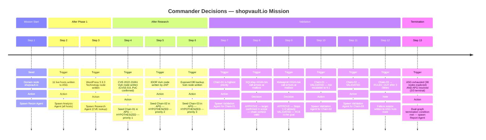
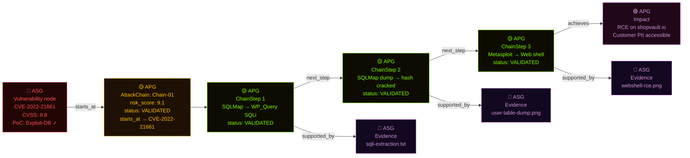

# Module 07 — Methodology-as-Configuration, Research Contributions, and Related Work

## 🎯 One-Line Summary

CMatrix encodes its entire assessment methodology as a swappable configuration document, has 12 distinct novel research contributions, and traces every design idea to a specific prior work — with clear attribution of what CMatrix added and what it borrowed.

---

## 📜 Methodology-as-Configuration — The VAPT Protocol Prompt

### What "Methodology" Means in Penetration Testing

In professional penetration testing, a **methodology** is the structured framework that guides how a tester approaches an assessment. It answers questions like:
- What activities do I do, in what order?
- When am I done with Phase 1 and ready for Phase 2?
- Under what conditions do I escalate something to the client?
- How do I decide which vulnerabilities to pursue first?

The two most widely used methodologies are:

**OWASP Testing Guide** — Produced by the Open Web Application Security Project. Provides a systematic checklist for web application testing, organized by vulnerability category (injection, authentication, authorization, cryptography, etc.). Ensures comprehensive coverage of all known web vulnerability classes.

**PTES (Penetration Testing Execution Standard)** — A broader framework covering the full penetration test lifecycle: pre-engagement, intelligence gathering, threat modeling, exploitation, post-exploitation, and reporting. More flexible and applicable to network infrastructure and full-scope engagements.

### The Problem With Hardcoded Methodology

In traditional security tools, the assessment methodology is **baked into the code**. If Nessus follows a particular scanning sequence, changing that sequence requires modifying Nessus's code. If you want to benchmark "OWASP methodology vs. PTES methodology," you need two different tools or two different codebases.

### CMatrix's Approach: Methodology as a Document

CMatrix takes a fundamentally different approach: **the methodology itself is a configuration document**, not code.

The **VAPT Protocol Prompt** is a structured, versioned natural language document injected into the Commander's reasoning context. It defines everything about how the Commander plans and makes decisions:

| What It Defines | Examples |
|----------------|---------|
| **Phase sequencing rules** | "Always complete Recon before Analysis. Complete Analysis before beginning Validation." |
| **Transition conditions** | "Phase 1 is complete when all Domain nodes have been resolved to Host nodes, all live hosts have been port-scanned." |
| **Re-planning triggers** | "If a new Vulnerability node with CVSS ≥ 8.0 is discovered, immediately evaluate whether to seed a new APG chain before continuing current work." |
| **Termination conditions** | "Mission is complete when: no unexplored ASG nodes remain AND all APG chains are VALIDATED or RULED_OUT." |
| **Tool selection heuristics** | "For Technology nodes of type 'WordPress', always spawn Research Agent before Analysis Agent to pre-load CVE intelligence." |
| **Risk escalation rules** | "Any tool invocation against a Payment-related endpoint requires High-risk classification regardless of tool tier." |

Different VAPT Protocol Prompt versions implement different methodologies:
- **Protocol v1.0 (OWASP)** — Follows OWASP Testing Guide phase structure, forces comprehensive OWASP category coverage
- **Protocol v2.0 (PTES)** — Follows PTES lifecycle, emphasizes threat modeling integration and post-exploitation assessment
- **Protocol v3.0 (Custom Red Team)** — Client-specific scope, stealth emphasis, specific time-boxing constraints

**Swapping methodologies requires zero code changes.** You change the Protocol Prompt document. The Commander, agents, Tool Adapters, and graphs are completely unchanged.

### Why This is a Research Contribution (C7)

This creates a unique research capability that has never existed before:

> **You can benchmark the effect of methodology choice on assessment outcomes as an independent variable.**

Run CMatrix against the same target (e.g., an HTB machine) under Protocol v1.0 (OWASP) and Protocol v2.0 (PTES). The architecture is identical. The agents are identical. The tools are identical. Only the methodology document differs.

Compare the results:
- Which methodology found more vulnerabilities?
- Which methodology produced more validated attack chains?
- Which methodology ran faster?
- Which methodology missed which vulnerability classes?

This kind of controlled, reproducible comparison has never been possible with automated VAPT systems — because methodology was always mixed inseparably with implementation. CMatrix separates them, making methodology a controlled experimental variable for the first time.

---

## 🔬 The 12 Research Contributions (C1–C12)

These are CMatrix's specific, novel claims about what it contributes to the field. For each contribution: **what it is**, **what problem it solves**, and **why nothing before it did this**.

---

### C1 — Dual-Graph World Model with Strict Write Ownership

**What it is:** Two strictly separated graph structures — ASG (discovered reality) + APG (inferred opportunity) — with enforced write boundaries. Discovery agents write only to ASG. Commander writes only to APG. No agent can write to the wrong graph.

**The problem it solves:** Existing systems store facts and hypotheses in the same shared memory (flat lists, vector stores, conversation history). This creates fact-hypothesis contamination — the system can't reliably distinguish between "this was confirmed by tool execution" and "this was inferred by reasoning." Bad plans are built on unvalidated hypotheses treated as facts.

**What nothing before did:** No prior autonomous VAPT system maintains facts and attack reasoning as strictly separate graph structures with enforced write ownership. The separation and the enforcement together constitute the contribution.

---

### C2 — Graph-State-Driven Dynamic Re-Planning

**What it is:** The Commander re-plans exclusively on explicit, graph-grounded triggers — a new Vulnerability node is written to the ASG, an APG chain's status changes, a chain is ruled out — not on fixed schedules, task completion flags, or arbitrary timeouts.

**The problem it solves:** Systems that re-plan based on conversation state or timers have no formal basis for the re-plan. You can't answer "why did the system change course here?" This makes behavior unpredictable and hard to audit.

**What nothing before did:** Every re-plan in CMatrix has a traceable, inspectable cause — a specific named graph event. This is the first VAPT system with formally grounded, event-driven re-planning.

---

### C3 — APG Attack Chain Lifecycle with Evidence Traceability

**What it is:** Attack chains are first-class entities in the APG with explicit risk scoring, Commander-assigned prioritization, and lifecycle-tracked validation status (HYPOTHESIZED → PARTIALLY_VALIDATED → VALIDATED / RULED_OUT). Every validated ChainStep is linked to its proof via a `supported_by` edge to an ASG Evidence node.

**The problem it solves:** Existing systems report "vulnerability found and exploited" without a structured, traceable chain from discovery to proof. There's no way to follow the reasoning: which specific steps were taken, what was confirmed at each step, where is the evidence?

**What nothing before did:** No prior VAPT agent system treats attack chains as persistent, lifecycle-tracked, evidence-linked data structures. The traceability chain from APG Impact → ChainStep → ASG Evidence node is novel.

---

### C4 — ASG-Aware Parallel Tool Dispatch

**What it is:** Dependency-safe concurrent tool execution, using the ASG itself as the dependency graph. Tools that depend on each other's output (e.g., Nmap needs Host nodes before it can scan; Analysis needs Port/Service nodes before it can fingerprint) are sequenced correctly because the ASG already encodes what depends on what. Independent tools (e.g., scanning multiple live hosts simultaneously) execute in parallel.

**The problem it solves:** Autonomous VAPT systems are often sequential by default — one tool at a time, serially. This is vastly slower than necessary. But naive parallelism can cause errors: Gobuster can't brute-force a host's directories until Nmap has identified which ports are open and what services are running.

**What nothing before did:** No prior VAPT agent system uses the world model graph itself as the scheduler. The ASG already encodes the prerequisite relationships; CMatrix reads them to determine what can run concurrently vs. what must wait.

---

### C5 — Tool Risk Gate with Commander-Mailbox Approval

**What it is:** Every tool call is classified into a risk tier (Low / Medium / High) before execution. High-risk calls (destructive, irreversible operations) route to the Commander's mailbox for explicit approval. The mailbox doubles as a zero-code insertion point for human-in-the-loop supervision.

**The problem it solves:** Autonomous VAPT systems can execute destructive operations against out-of-scope targets, run exploits based on misidentified vulnerabilities, or take irreversible actions without any oversight. This is both unsafe and potentially illegal in a professional context.

**What nothing before did:** No prior autonomous VAPT system has a formally tiered risk gate with a Commander approval mechanism that also serves as a human supervision insertion point. The human-in-the-loop is a configuration, not a redesign.

---

### C6 — ASG-Backed Lossless Context Compaction

**What it is:** A three-layer compaction scheme (MicroCompact → AutoCompact → FullCompact) in which FullCompact can reduce conversation history to near-zero without losing any intelligence — because every discovery is already persisted in the ASG as structured graph state, not only in conversational scaffolding.

**The problem it solves:** Long VAPT sessions overflow LLM context windows. Existing approaches either fail when context fills up, or discard discoveries to make room (losing intelligence), or use expensive summarization that still risks losing important details.

**What nothing before did:** No general-purpose agent can claim lossless FullCompact — because in general systems, the conversation history *is* the intelligence. CMatrix's dual-graph architecture makes the ASG the single source of truth, so the conversation history is genuinely expendable.

---

### C7 — Methodology-as-Configuration via the VAPT Protocol Prompt

**What it is:** The Commander's entire planning policy is encoded as a versioned natural-language document — the VAPT Protocol Prompt. Different versions implement different methodologies (OWASP, PTES, custom). Switching methodologies requires only swapping the document; no code changes.

**The problem it solves:** Assessment methodology has always been hardcoded into tool implementations. Benchmarking "methodology A vs. methodology B" is impossible when methodology is inseparable from code.

**What nothing before did:** This is the first VAPT system where the assessment methodology is a controlled, independently evaluable experimental variable. You can isolate the effect of methodology choice on assessment outcomes — a new research dimension.

---

### C8 — Dual-Graph Termination Semantics

**What it is:** Mission completion is formally defined as the **conjunction** of ASG exhaustion (no unexplored nodes) AND APG resolution (all chains in terminal state). Both conditions must be true simultaneously. Neither alone is sufficient.

**The problem it solves:** Existing systems terminate based on proxies — timers, empty task queues — that don't accurately reflect whether the assessment is genuinely complete.

**What nothing before did:** This is the first formally grounded termination condition in autonomous VAPT literature. Pure task-queue systems can't express APG resolution. Pure graph-traversal systems can't express ASG-exhaustion + APG-resolution simultaneously. CMatrix can — and this eliminates premature or incomplete termination as a design property.

---

### C9 — Live Vulnerability Intelligence Grounding via Scoped Research Agent

**What it is:** Real-time CVE enrichment, PoC availability assessment, and exploit feasibility research from authoritative sources (NVD, Exploit-DB, GitHub) during active assessment, written back to the ASG as structured Vulnerability node attributes. The Research Agent is the only agent authorized to make external requests — a hard architectural boundary.

**The problem it solves:** LLMs have knowledge cutoffs. CVEs discovered after the model's training date are unknown to the system. PoCs published recently may not be in the model's training data. Systems that reason only from pre-trained knowledge work with stale, potentially incomplete vulnerability intelligence.

**What nothing before did:** No prior VAPT agent system formalizes a dedicated intelligence agent with an enforced external-request boundary that writes live CVE enrichment into a persistent graph model. The scoped, structured, graph-persisted approach is novel.

---

### C10 — Cross-Mission Experience Store

**What it is:** A persistent, RAG-backed knowledge base of validated exploitation outcomes accumulated across every completed mission. Queried by the Commander at mission start (after Recon writes first Technology nodes, before Analysis begins) to seed candidate APG AttackChains from prior validated patterns on analogous technology stacks.

**The problem it solves:** Autonomous VAPT systems start every mission with zero institutional knowledge. If the system has successfully exploited WordPress 5.9.3 SQL injection three times before, the fourth engagement against the same target type starts from zero — re-discovering the same chain through the same expensive process.

**What nothing before did:** AutoAttacker (arXiv '24) introduced experience reuse *within one mission*. CMatrix generalizes this to cross-mission scope — accumulated across every mission ever run. The cross-mission accumulation itself is the contribution; the reuse concept originates with AutoAttacker.

---

### C11 — Attack Strategy Library with Technology-Fingerprint-Indexed Crystallization

**What it is:** When the same technology fingerprint produces validated AttackChains across two or more independent missions, the Commander crystallizes those outcomes into a named, parameterized attack strategy with a confidence score. Strategies are retrieved at mission start and injected as pre-ranked APG AttackChain seeds — prioritized above zero-prior chains.

**The problem it solves:** Raw per-mission records in the Cross-Mission Experience Store are granular but not generalized. You want to move from "this specific tool invocation worked on this specific host" to "here is the general procedure that works for this technology class, with confidence derived from N missions."

**What nothing before did:** No existing autonomous VAPT system accumulates and generalizes validated exploitation procedures across sessions. Every system in the prior literature resets to zero knowledge on each mission. CMatrix becomes measurably more efficient on repeat target-type engagements — and this improvement is directly measurable through the trajectory data.

---

### C12 — Structured Engagement Trajectory Export

**What it is:** Every mission produces a complete, machine-readable decision log. Each entry captures: the ASG/APG trigger, Commander reasoning rationale, action taken, agent output summary, and strategy library hit status. The trajectory corpus serves three simultaneous purposes simultaneously.

**The three purposes:**
1. **Full reproducibility** — any mission result can be independently verified step-by-step
2. **Ablation study support** — compare trajectories with/without Attack Strategy Library to measure strategy hit rate and planning-step reduction
3. **Dataset generation** — trajectories are labeled VAPT reasoning sequences usable as SFT training data for fine-tuning security-oriented LLMs

**What nothing before did:** No autonomous VAPT system has ever produced structured, step-by-step reasoning logs designed explicitly as first-class research artifacts. No labeled dataset of autonomous VAPT reasoning sequences currently exists in the literature. CMatrix's trajectory corpus would be the first.

---

## 📚 Related Work — What CMatrix Learned From (And What It Added)

CMatrix was designed with reference to five academic papers and three open-source systems. This is not a comparison section — it is **provenance documentation**. For each source: the specific idea that was studied, and exactly where and how it appears in CMatrix's design.

The pattern is consistent: CMatrix takes an existing concept, identifies its limitation or generalization opportunity, and extends it into the new context of dual-graph-guided autonomous VAPT.

---

### 1️⃣ PentestGPT (USENIX Security '24)

**What PentestGPT does:**
PentestGPT splits its pipeline into three modules: a **Reasoning Module** that maintains a Pentesting Task Tree (a hierarchical task memory), a **Generation Module** that expands sub-tasks into concrete tool commands, and a **Parsing Module** whose sole job is to condense raw tool output *before* it re-enters the reasoning context.

The Parsing Module's key insight: if you let raw tool output flow directly into the reasoning module, the LLM's strategic memory gets polluted with thousands of lines of terminal noise. Parse it first, then reason. The Pentesting Task Tree solves a different problem: maintaining task state across long sessions that would otherwise exceed the LLM's context.

**Where it lives in CMatrix:**
The "parse before you reason" principle is the philosophical foundation of the **Tool Adapter Layer** (Module 04). Every tool's raw output is normalized into structured findings at the adapter boundary. Nothing unparsed ever reaches an agent's context or the ASG.

**What CMatrix added:**
PentestGPT parses output into a context summary that persists in the conversation history. CMatrix extends this one step further: parsed results are written as **permanent ASG graph state** (MicroCompact, Module 06 Layer 1). This means the normalization survives indefinitely — even after the conversation that produced it is fully compressed away. The ASG is more durable than any context window.

---

### 2️⃣ AutoAttacker (arXiv '24, Xu et al.)

**What AutoAttacker does:**
AutoAttacker automates the post-breach phase of an attack with a modular planner / summarizer / code-generator pipeline. Its distinctive contribution: an **experience manager** that stores executed attack subtasks and retrieves them when constructing later, more complex attack chains — *within one mission*. If a sub-task for privilege escalation via SUID binary was successfully executed earlier, it can be retrieved and reused when building a later, more complex escalation chain.

**Where it lives in CMatrix:**
The **Cross-Mission Experience Store (C10)**. CMatrix's persistent, RAG-backed knowledge base of validated exploitation outcomes generalizes AutoAttacker's experience-reuse mechanism from within one mission to across every mission ever run.

**What CMatrix added:**
The cross-mission scope. AutoAttacker's experience manager is reset at mission close — it's session-local. CMatrix's Experience Store accumulates indefinitely across all missions. The reuse concept originates with AutoAttacker; the cross-mission persistence is CMatrix's contribution.

---

### 3️⃣ Teams of LLM Agents / HPTSA (arXiv '24, Zhu et al.)

**What HPTSA does:**
HPTSA (Hierarchical Planning with Task-Specific Agents) introduces a hierarchical planner that delegates to task-specific sub-agents. Its central experimental finding: injecting **task-specific documentation** directly into a sub-agent's context — rather than relying on the LLM's pre-trained knowledge alone — improves zero-day exploitation performance by up to **2.1× over undocumented agents**.

The intuition: an agent told "here is the SQLi technique taxonomy for time-based blind injection, here is the SQLMap flag reference" performs significantly better on SQLi chains than an agent relying only on what the model already knows about SQL injection.

**Where it lives in CMatrix:**
**Vulnerability-Class Knowledge Injection** (Module 03). CMatrix injects curated offline expert documents into specialist agents at spawn time, matched to the vulnerability class they're assigned — SQLi taxonomies for SQLi chains, XSS payload patterns for XSS chains, OWASP checklists for web Analysis Agents.

**What CMatrix added:**
HPTSA demonstrated the value of task-specific injection for general hacking sub-agents. CMatrix applies it within the specific context of vulnerability-class-keyed VAPT expertise, with documents matched to the specific APG chain being validated — not just the agent type.

---

### 4️⃣ PentestAgent (AsiaCCS '25, Shen et al.)

**What PentestAgent does:**
PentestAgent pairs a planning agent with RAG-backed shared memory and an execution agent with a critical capability: when an exploit attempt fails, the execution agent **self-diagnoses** the failure cause and corrects its approach before abandoning the attack path. Diagnose the failure → adapt the approach → retry.

**Where it lives in CMatrix:**
The **Validation Agent's self-debugging loop** (Module 03): Diagnose → Contextualize → Adapt → retry → Cap. When a ChainStep fails, the Validation Agent doesn't give up — it analyzes why it failed, queries the ASG for additional context that might resolve the failure, modifies its approach, and retries. The configurable cap (default: 3) prevents infinite loops.

**What CMatrix added:**
PentestAgent's self-diagnosis operates on general exploit attempts. CMatrix's loop is integrated into the APG ChainStep lifecycle — when the cap is hit, the failure reason is written as a structured annotation to the ASG Vulnerability node (informing future missions), and the ChainStep status is formally set to `RULED_OUT` (driving a formal Commander re-plan). The ASG integration and the graph-state consequence are CMatrix's additions.

---

### 5️⃣ VulnBot (arXiv '25, Kong et al.)

**What VulnBot does:**
VulnBot has a five-module design — Planner, Memory Retriever, Generator, Executor, **Summarizer** — built around a Penetration Task Graph. The Summarizer's specific role: it condenses each phase's outcome *before* passing it to the next module, preventing raw execution history from leaking between agents. Agents don't see each other's verbose history — only structured summaries.

**Where it lives in CMatrix:**
**Context-Isolated Agent Spawning** (Module 03). Every CMatrix specialist agent returns only a structured ASG/APG delta to the Commander on completion. Its raw working context — all conversation history, all tool output, all intermediate reasoning — is discarded. Agents hand off structured output, never raw history.

**What CMatrix added:**
VulnBot's Summarizer condenses between modules within a sequential pipeline. CMatrix's context isolation is a property of every agent spawn — each agent is born fresh with a scoped context, and dies cleanly. Combined with the ASG as the persistent knowledge store, this guarantees that no agent's verbose history ever pollutes any other agent's reasoning, regardless of how complex or how many agents the mission involves.

---

### 6️⃣ PentAGI (vxcontrol/pentagi)

**What PentAGI does:**
PentAGI is a production multi-agent pentesting platform that ships an **Adviser** agent automatically invoked when execution-pattern monitoring detects trouble: identical tool calls repeated past a threshold, or total tool-call count approaching a budget limit. Alongside the Adviser, a **Reflector** nudges stuck agents toward a clean completion rather than letting them hit a hard cutoff.

**Where it lives in CMatrix:**
**Cycle Guard and Reflector** (Module 06). CMatrix's Cycle Guard detects repeated identical tool calls and forces a Commander re-plan. CMatrix's Reflector provides targeted corrective guidance after repeated tool-call failures of different types — rather than letting the agent exhaust its phase budget discovering nothing useful.

**What CMatrix added:**
PentAGI's Adviser/Reflector are separate agent roles in the pipeline. CMatrix's Cycle Guard and Reflector are lightweight checks layered onto the planning cycle itself — evaluated against the agent's own action history, adding no graph-write surface, and firing only when fixation is actually detected. They are mechanisms, not agents.

---

### 7️⃣ Claude Code (Anthropic pattern / yasasbanukaofficial/claude-code)

**What Claude Code does:**
Claude Code gates all tool execution through `yoloClassifier.ts` — a **two-stage fast-filter → chain-of-thought classifier** that auto-approves low-stakes tool calls and escalates ambiguous or risky ones. Additionally, Claude Code exposes a **27-event hook architecture** — named interception points throughout the agent loop where operators can inject behavior without modifying agent code.

**Where it lives in CMatrix — two distinct concepts:**

**LLM Permission Classifier (Module 04):** CMatrix's Medium-tier Risk Gate uses the same fast-filter + brief chain-of-thought pattern. The classifier evaluates scope alignment, chain intent, and parameter safety before returning `EXECUTE` or `ESCALATE`. The same single configured LLM API handles this call (Module 06) — no separate model.

**Agent Lifecycle Hook System (Module 04):** CMatrix's six named hooks (`PreToolUse` · `PostToolUse` · `PreAgentSpawn` · `PostAgentReturn` · `PreAPGUpdate` · `PostMissionTerminate`) follow the same named-interception-point philosophy, scaled to CMatrix's dual-graph decision boundaries.

**What CMatrix added:**
The Permission Classifier extends Claude Code's yoloClassifier to the VAPT context, adding the Chain Intent axis (checking consistency with the current APG AttackChain) — a VAPT-specific check that has no parallel in general-purpose coding assistants. The hook system is adapted from 27 general-purpose events to six events covering CMatrix's specific dual-graph lifecycle boundaries — a focused, domain-specific application of the same architectural pattern.

---

### 8️⃣ Hermes Agent (NousResearch/hermes-agent)

**What Hermes Agent does:**
Hermes ships a **closed learning loop**: after completing a non-trivial workflow, the agent autonomously calls `skill_manage` to write a reusable procedural skill — distilled from experience, stored persistently, retrieved when contextually relevant, and self-improving during subsequent use. A companion system exports structured agent trajectories for SFT fine-tuning and RL (Reinforcement Learning) training via DSPy + GEPA and Atropos integration.

**Where it lives in CMatrix — two distinct concepts:**

**Attack Strategy Library (C11):** The domain-specific counterpart to Hermes's skill crystallization. Where Hermes crystallizes general-purpose procedural workflows from task experience, CMatrix crystallizes validated attack chains into named, technology-fingerprint-indexed attack strategies when the same target class produces confirmed exploitation outcomes across two or more independent missions. The crystallization is domain-constrained — output is a security-relevant strategy with confidence scoring, not a general-purpose skill — and retrieval is integrated into APG seed prioritization, not general task planning. The generalization mechanism and confidence-scoring model both originate with Hermes's skill system.

**Engagement Trajectory Export (C12):** The domain-adapted counterpart to Hermes's trajectory export for RL/SFT. CMatrix logs every planning-cycle step as a structured trajectory entry capturing the ASG/APG trigger, Commander reasoning rationale, action taken, agent output, and strategy library hit status. The format is adapted to CMatrix's dual-graph event structure. The concept of deliberately structuring agent execution logs as training-data artifacts originates with Hermes.

**What CMatrix added:**
Both adaptations are domain-constrained to VAPT. The Attack Strategy Library's crystallization is keyed to security-relevant technology fingerprints (not general task types) and integrated into APG chain prioritization (not general task planning). The trajectory format captures dual-graph events (ASG/APG deltas, chain status changes, strategy library hits) rather than general agent loop events. The concept is Hermes's; the VAPT-domain instantiation and the dual-graph integration are CMatrix's.

---

## 🗺️ Quick Reference — All 8 Related Works

| # | Source | Type | Concept Taken | Lives In CMatrix |
|---|--------|------|---------------|-|
| 1 | PentestGPT | Paper (USENIX '24) | Parse before you reason; Pentesting Task Tree memory | Tool Adapter Layer (Module 04) + MicroCompact (Module 06) |
| 2 | AutoAttacker | Paper (arXiv '24) | Within-mission experience reuse | Cross-Mission Experience Store (C10) — generalized to cross-mission |
| 3 | HPTSA | Paper (arXiv '24) | Task-specific document injection → 2.1× improvement | Vulnerability-Class Knowledge Injection (Module 03) |
| 4 | PentestAgent | Paper (AsiaCCS '25) | Self-diagnosing execution agent; RAG-backed memory | Validation Agent self-debugging loop (Module 03) |
| 5 | VulnBot | Paper (arXiv '25) | Summarizer prevents raw history leakage between agents | Context-Isolated Agent Spawning (Module 03) |
| 6 | PentAGI | Repo | Adviser/Reflector detects and corrects fixation | Cycle Guard + Reflector (Module 06) |
| 7 | Claude Code | Repo | Fast-filter + CoT classifier; 27-event hook architecture | LLM Permission Classifier + Lifecycle Hook System (Module 04) |
| 8 | Hermes Agent | Repo | Skill crystallization + trajectory export for RL/SFT | Attack Strategy Library (C11) + Trajectory Export (C12) |

---

## 🎓 How CMatrix Stands on the Shoulders of Giants

CMatrix doesn't claim to have invented multi-agent systems, graph-based planning, or cross-mission learning from nothing. What it claims is:

1. **Specific, traceable adaptation** of each prior concept to the autonomous VAPT domain
2. **Novel combination** of these concepts within a coherent, unified architecture
3. **Original extensions** where each prior concept was generalized or domain-specialized
4. **Formal guarantees** (termination, separation, traceability) that emerge from the architecture as a whole — not from any single prior work

The result is a system that is architecturally distinct from every prior autonomous VAPT system in the literature — not incrementally different, but structurally different at the level of how knowledge is represented, how reasoning is grounded, how termination is defined, and how learning accumulates across time.

---

## ✅ What You Should Remember From This Module

| Concept | Plain English |
|---------|---------------|
| VAPT Protocol Prompt | Methodology encoded as a swappable document — OWASP vs PTES vs custom, zero code changes |
| Methodology as research variable | First system where assessment methodology choice is independently benchmarkable |
| C1 | Dual-graph world model with strict write ownership — the foundation of everything |
| C2 | Graph-grounded re-planning — every re-plan has a traceable graph-event cause |
| C3 | APG chain lifecycle with evidence traceability — HYPOTHESIZED → VALIDATED with `supported_by` proof |
| C4 | ASG-aware parallel tool dispatch — the ASG is the dependency scheduler |
| C5 | Tool Risk Gate + Commander mailbox — safety by architecture, not policy; human-in-the-loop by configuration |
| C6 | ASG-backed lossless context compaction — FullCompact loses nothing because the ASG is the truth |
| C7 | Methodology-as-configuration — assessment methodology as a controlled experimental variable |
| C8 | Dual-graph termination semantics — formally grounded, two-condition mission-complete definition |
| C9 | Scoped Research Agent — live CVE enrichment with a hard external-request boundary |
| C10 | Cross-Mission Experience Store — cross-mission RAG memory, generalized from AutoAttacker |
| C11 | Attack Strategy Library — crystallized procedures from repeated missions, generalized from Hermes |
| C12 | Structured trajectory export — reproducibility + ablation + dataset generation simultaneously |
| Related work principle | CMatrix always credits the source, says exactly what it borrowed, and says exactly what it added |

---

## Diagram 6 — Real-World Scenario: shopvault.io End-to-End

This is the complete picture. One real mission. Zero manual commands. Watch every tool, every graph write, every Commander decision, from the moment the operator presses start to the final professional report.

**Target:** `shopvault.io` — an e-commerce platform
**Mode:** Black-Box (zero prior knowledge)
**Scope:** All subdomains, web apps, REST APIs
**Operator action:** Provide domain + scope → press start

---

### Diagram 6A — Mission Timeline: Phase by Phase

```mermaid
flowchart TD
    OP(["🧑 OPERATOR\nTarget: shopvault.io\nScope: all subdomains\nMode: Black-Box\n→ PRESS START"])

    subgraph P1["🟢 PHASE 1 — RECONNAISSANCE\nRecon Agent spawned"]
        A1["Tool: Amass\n────────────────────────\n14 subdomains discovered:\napi · admin · staging\npay · mail · static · ..."]
        A2["Tool: httpx\n────────────────────────\n11 live hosts confirmed\nstaging → unexpected 200 OK\npay → TLS certificate EXPIRED"]
        A3["Tool: Nmap\n────────────────────────\n28 open ports mapped\nPorts: 80, 443, 8080, 8443, 22\nServices: Nginx 1.18 · OpenSSH 8.9\nUnencrypted HTTP on port 8080"]
        D1["📥 ASG DELTA\n37 new nodes written:\n14 Domain · 11 Host\n28 Port · 15 Service"]
    end

    subgraph P2["🔵 PHASE 2 — ANALYSIS + INTELLIGENCE\nAnalysis Agent + Research Agent spawned"]
        B1["Tool: WhatWeb\n────────────────────────\nWordPress 5.9.3 on shopvault.io\nWooCommerce 6.1 detected\nDjango 4.1.2 on api.shopvault.io\n→ Commander spawns Research Agent"]
        B2["Research Agent: NVD + Exploit-DB\n────────────────────────────────\nCVE-2022-21661 found (CVSS 8.8)\nPoC on Exploit-DB ✓\nMetasploit module available ✓"]
        B3["Tool: Gobuster\n────────────────────────\n/backup/db_export_2023.sql → 200!\n/wp-admin/login → 200\n/wp-admin/users → 403\n/api/v1/internal/users → 200"]
        B4["Tool: ffuf\n────────────────────────\nIDOR: user_id param unsanitised\n/api/v2 routes discovered\nVirtual host: internal.shopvault.io"]
        B5["Tool: Nuclei\n────────────────────────\nCVE-2022-21661 template → MATCH\nExposed phpinfo.php on staging\nDefault creds check: admin/admin → fail"]
        B6["Tool: OWASP ZAP\n────────────────────────\nXSS on /search?q= (reflected)\nSQL error on staging login form\nMissing security headers on API"]
        D2["📥 ASG DELTA: 61 new nodes\nTechnology(3) · Endpoint(19)\nParameter(8) · Vulnerability(9)\n\n📥 APG DELTA: 3 chains seeded\nChain-01: CVE SQLi→RCE (8.8)\nChain-02: IDOR orders API (7.5)\nChain-03: Exposed DB backup (6.2)"]
    end

    subgraph P3["🔴 PHASE 3 — VALIDATION + EVIDENCE\nValidation Agent + Evidence Agent spawned"]
        C1["Chain-01 (highest priority: 8.8)\n────────────────────────────────\nStep 1: SQLMap on WP_Query\n→ SQLi confirmed ✅\n→ Evidence: sqli-extraction.txt"]
        C2["Step 2: SQLMap --dump users table\n────────────────────────────────\n→ Admin hash extracted ✅\n→ Offline crack: password123\n→ Evidence: user-table-dump.png"]
        C3["Step 3: Metasploit wp_admin_shell_upload\n────────────────────────────────\n⚠️ HIGH RISK → Commander Mailbox\n→ Commander APPROVES\n→ Web shell deployed ✅\n→ RCE confirmed!\n→ risk_score escalated: 8.8 → 9.1\n→ Evidence: webshell-rce.png"]
        C4["Chain-02 (risk: 7.5)\n────────────────────────────────\nffuf: user_id=456 returns user 456 orders\n→ IDOR confirmed ✅\n→ All customer PII accessible\n→ Evidence: idor-orders-dump.png"]
        C5["Chain-03 (risk: 6.2)\n────────────────────────────────\nGET /backup/db_export_2023.sql\n→ Attempt 1: 403 (WAF blocked)\n→ Diagnose: WAF active\n→ Attempt 2: header bypass → 403\n→ Attempt 3: path variation → 403\n→ CAP REACHED → RULED_OUT\n→ Failure written to ASG Vuln node"]
        D3["📥 APG DELTA\nChain-01: VALIDATED (9.1)\nChain-02: VALIDATED (7.5)\nChain-03: RULED_OUT (6.2)\n\n📥 ASG DELTA\n4 Evidence nodes + edges added"]
    end

    subgraph P4["🟣 PHASE 4 — REPORT\nReport Agent spawned — reads full ASG + APG"]
        RPT["📋 PROFESSIONAL PENETRATION TEST REPORT\n─────────────────────────────────────────\n• Executive Summary\n• 2 Validated Attack Chains (RCE + IDOR)\n• 1 Ruled-Out Chain (DB backup WAF-protected)\n• Full attack surface map (14 subdomains · 11 hosts)\n• 9 vulnerabilities with CVSS scores\n• Remediation guidance ordered by risk_score\n• Screenshot evidence at every ChainStep\n• ZERO manual commands issued"]
    end

    TERM["✅ TERMINATION CONDITION MET\nASG: all 98 nodes explored\nAPG: all 3 chains in terminal state\n→ Report Agent spawned"]

    OP --> P1
    A1 --> A2 --> A3 --> D1
    D1 --> P2
    B1 --> B2 --> B3 --> B4 --> B5 --> B6 --> D2
    D2 --> P3
    C1 --> C2 --> C3
    C3 --> C4 --> C5 --> D3
    D3 --> TERM
    TERM --> P4
    P4 --> RPT

    style OP fill:#041A08,stroke:#7FFF00,color:#7FFF00
    style P1 fill:#062210,stroke:#7FFF00,color:#7FFF00
    style P2 fill:#04162E,stroke:#00D4FF,color:#00D4FF
    style P3 fill:#1A0606,stroke:#FF5252,color:#FF5252
    style P4 fill:#10081E,stroke:#9C27B0,color:#CE93D8
    style D1 fill:#041A08,stroke:#7FFF00,color:#7FFF00
    style D2 fill:#041A08,stroke:#7FFF00,color:#7FFF00
    style D3 fill:#1E1004,stroke:#FFC107,color:#FFC107
    style TERM fill:#041A08,stroke:#7FFF00,color:#7FFF00
    style RPT fill:#10081E,stroke:#9C27B0,color:#CE93D8
```

---

### Diagram 6B — The Commander's Decision Log (Key Moments)

---

### Diagram 6C — Final Mission Stats

```mermaid
flowchart LR
    subgraph ASG_FINAL["🟢 ASG — Final State"]
        direction TB
        N1["14 Domain nodes"]
        N2["11 Host nodes"]
        N3["28 Port nodes"]
        N4["15 Service nodes"]
        N5["3 Technology nodes"]
        N6["19 Endpoint nodes"]
        N7["8 Parameter nodes"]
        N8["9 Vulnerability nodes"]
        N9["4 Evidence nodes"]
        NT["= 111 total nodes"]
    end

    subgraph APG_FINAL["🟡 APG — Final State"]
        direction TB
        CH1["Chain-01: VALIDATED ✅\nrisk: 9.1 (escalated)\nSQLi → Admin → RCE"]
        CH2["Chain-02: VALIDATED ✅\nrisk: 7.5\nIDOR → Customer PII"]
        CH3["Chain-03: RULED_OUT ❌\nrisk: 6.2\nDB backup WAF-protected"]
    end

    subgraph REPORT_FINAL["📝 Report Output"]
        direction TB
        R1["2 validated attack chains\nwith step-by-step reproduction"]
        R2["4 screenshot evidence artifacts\nlinked at each ChainStep"]
        R3["9 vulnerabilities\nordered by risk_score"]
        R4["Remediation guidance\nprioritized by business risk"]
        R5["0 manual commands issued\nduring entire assessment"]
    end

    ASG_FINAL --> REPORT_FINAL
    APG_FINAL --> REPORT_FINAL

    style ASG_FINAL fill:#062210,stroke:#7FFF00,color:#7FFF00
    style APG_FINAL fill:#1E1004,stroke:#FFC107,color:#FFC107
    style REPORT_FINAL fill:#10081E,stroke:#9C27B0,color:#CE93D8
```

---

### Diagram 6D — Chain-01 Full Traceability: From CVE to Evidence

This is the most important chain in the mission. Every arrow here is a relationship that exists in the dual graph — followable from the report all the way back to the raw evidence file.

**Reading this diagram:** Start at the red CVE node (ASG fact) → follow `starts_at` to the gold Chain (APG reasoning) → follow ChainSteps in order → arrive at the purple Impact (what was demonstrated) → follow `supported_by` back to the purple Evidence nodes (ASG proof). Every claim in the final report has this complete path. Nothing is asserted without evidence.

---

### Summary: What Makes This Remarkable

| Fact | Significance |
|------|-------------|
| **Zero manual commands** | The operator configured scope and pressed start. Everything else was autonomous. |
| **All tool calls gated** | SQLMap and Metasploit both went through Commander Mailbox — no exploitation without approval |
| **Chain-03 RULED_OUT** | The system correctly diagnosed WAF protection and stopped after 3 retries — not an infinite loop |
| **risk_score escalated** | Chain-01 started at 8.8 (CVSS); after RCE was confirmed, Commander escalated to 9.1 |
| **Traceability** | Every Impact claim links through ChainSteps back to Evidence files in the ASG |
| **Dual termination** | Mission ended because 98 nodes explored AND 3/3 chains terminal — not because a timer fired |

---

*End of Documentation.*
