# Module 08 — Visual Walkthrough: CMatrix Architecture in Diagrams

> **How to read this module:** Every diagram here is a visual translation of a concept already explained in Modules 01–07. If a box or arrow is unfamiliar, refer back to the relevant module. This file adds *no new concepts* — it only makes existing ones visible.

---

## Diagram 1 — System Architecture: The Three-Tier Overview

This is the master view of CMatrix. Everything fits into three tiers:

- **Tier 1 (top):** Orchestration — the operator configures, the Commander reasons
- **Tier 2 (middle):** The dual-graph world model — the two living knowledge stores
- **Tier 3 (bottom):** The six specialist agents and the tool layer they operate through

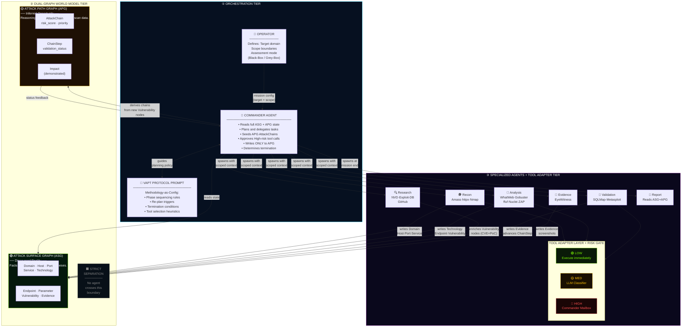

### Reading Key

| Colour | Meaning |
|--------|---------|
| 🟢 Cyan border | Commander — orchestration layer |
| 🟢 Lime/Green border | ASG — discovery facts |
| 🟡 Gold border | APG — attack reasoning |
| 🟣 Purple border | Agent tier + tool adapter |
| Solid arrow | Data flow / write |
| Dashed arrow | Read / feedback |

### Three Things to Notice

1. **The Commander never touches tools.** Every arrow from the Commander goes to agents — never to the Tool Adapter Layer directly.
2. **Only the Commander writes to the APG.** All six specialist agents write only to the ASG (or read from it). The APG is exclusively the Commander's domain.
3. **All tool calls go through the Tool Adapter Layer.** There is no path from an agent directly to a tool. The Risk Gate sits in that layer.

---

*Diagram 2 below: Dual-Graph Model (ASG node tree + APG attack chain, visualised)*

---

## Diagram 2 — The Dual-Graph Model: ASG + APG Visualised

This diagram shows both graphs side-by-side using the `shopvault.io` mission as a concrete example. Left side = ASG (what was discovered). Right side = APG (what can be done with it). The vertical barrier in the middle = the strict separation boundary.

### 2A — ASG: The Attack Surface Graph (Discovered Reality)

Every node here represents something **confirmed by a tool**. Every edge represents a **confirmed relationship**. No guesses. No hypotheses.

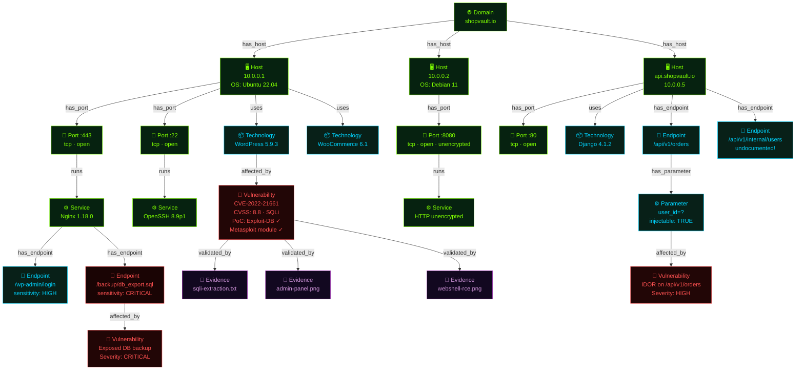

**Node colour key:**
- 🟢 **Lime** — Domain, Host, Port, Service (infrastructure layer)
- 🔵 **Cyan** — Technology, Endpoint, Parameter (application layer)
- 🔴 **Red** — Vulnerability (weakness layer)
- 🟣 **Purple** — Evidence (proof layer)

---

### 2B — APG: The Attack Path Graph (Inferred Opportunity)

The Commander reads the ASG and reasons: *"These vulnerabilities can chain together into complete attack paths."* Those chains live here — in the APG.

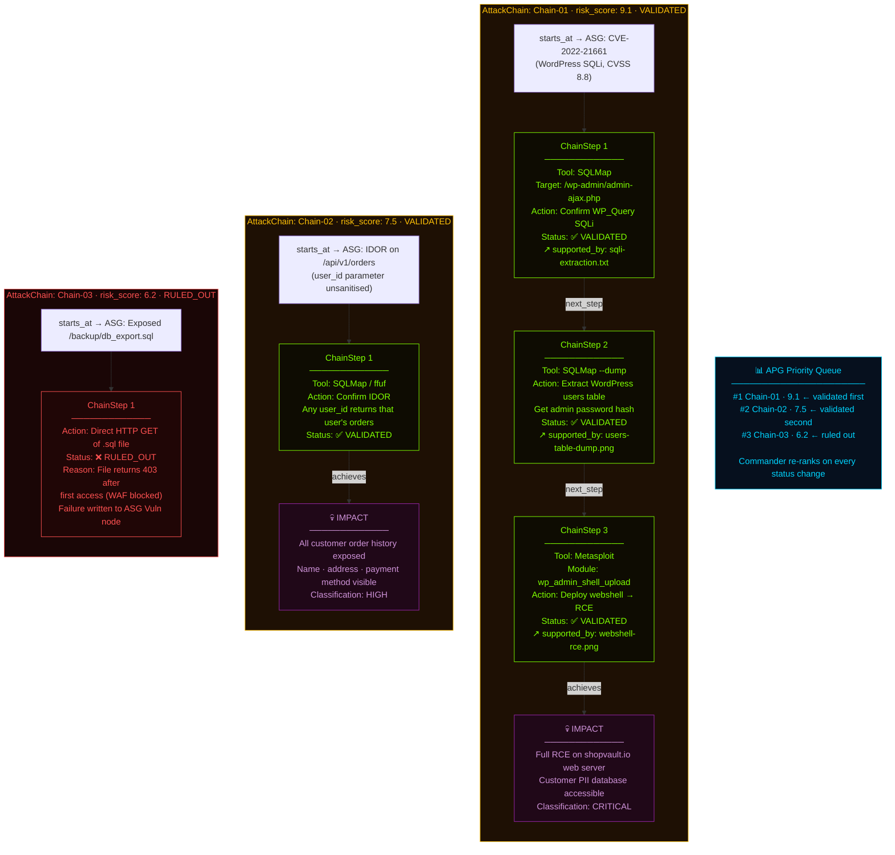

### What the Two Graphs Together Tell You

| Question | Answered By |
|----------|------------|
| "What hosts exist on shopvault.io?" | ASG → Domain → Host nodes |
| "What software is running on port 443?" | ASG → Port → Service → Technology nodes |
| "Which vulnerabilities were found?" | ASG → Vulnerability nodes (with CVSS, PoC status) |
| "What are the complete attack paths?" | APG → AttackChain nodes (with ChainSteps) |
| "Which attack is most dangerous?" | APG → risk_score ranking |
| "Is each attack actually proven?" | APG → validation_status + supported_by → ASG Evidence |
| "What is the proof?" | ASG → Evidence nodes (screenshots, tool outputs) |

---

*Diagram 3 below: Agent Spawn Lifecycle*

---

## Diagram 3 — Agent Spawn Lifecycle: Born Fresh, Die Clean

This is the most important architectural insight that separates CMatrix from other multi-agent systems. Every agent is born fresh, does exactly one job with a scoped context, and vanishes — leaving only structured graph state behind.

### 3A — The Spawn Lifecycle (single agent)

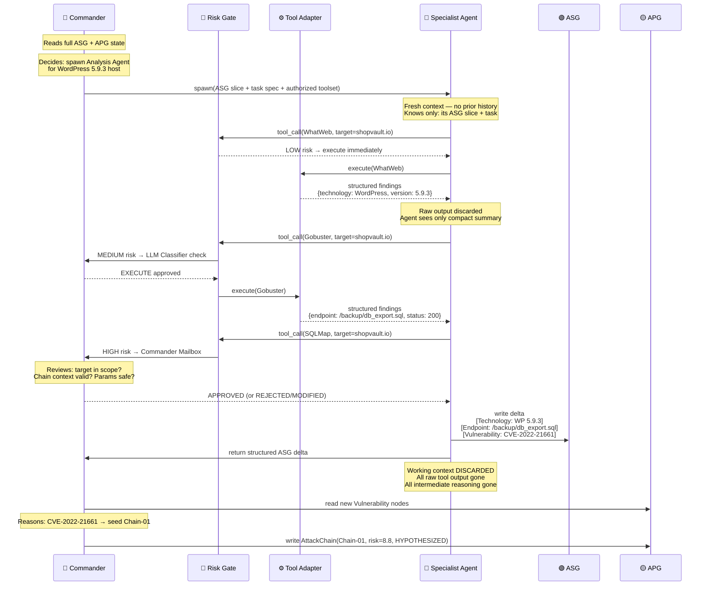

---

### 3B — What Each Agent Receives at Spawn (Scoped Context)

```mermaid
flowchart LR
    CMD["👑 COMMANDER\nDecides next action"]

    subgraph SPAWN["Agent Spawn Package"]
        direction TB
        S1["📊 ASG SLICE\nOnly nodes relevant to this task\nNot the full graph"]
        S2["🔗 APG SLICE\nRelevant AttackChains only\n(if this is a Validation task)"]
        S3["🔧 TOOL SET\nAuthorized tools only\nNo others available"]
        S4["📋 TASK SPEC\nCommander's current plan item\nExact objective for this spawn"]
        S5["📚 KNOWLEDGE DOCS\n(Validation Agent only)\nVulnerability-class expert docs\ninjected at spawn time"]
    end

    subgraph AGENT["🤖 Isolated Agent Context\n(fresh per task — no prior history)"]
        WORK["Works autonomously\nwithin bounded context\nAll tool calls → Risk Gate"]
    end

    subgraph RETURN["Agent Returns"]
        R1["✅ Structured ASG Delta\nNew nodes + edges only"]
        R2["🗑️ Working context DISCARDED\nRaw tool output → gone\nConversation history → gone\nIntermediate reasoning → gone"]
    end

    CMD -->|"spawn with\nscoped package"| SPAWN
    SPAWN --> AGENT
    AGENT --> RETURN
    RETURN -->|"delta written\nto ASG"| ASG_ICON["🟢 ASG"]
    RETURN -->|"Commander reads\nnew nodes"| CMD

    style CMD fill:#04162E,stroke:#00D4FF,color:#00D4FF
    style SPAWN fill:#0A0C1E,stroke:#9C27B0,color:#9C27B0
    style AGENT fill:#0A0C1E,stroke:#9C27B0,color:#fff
    style RETURN fill:#041808,stroke:#7FFF00,color:#7FFF00
    style ASG_ICON fill:#062210,stroke:#7FFF00,color:#7FFF00
    style S1 fill:#04180A,stroke:#7FFF00,color:#7FFF00
    style S2 fill:#1A1002,stroke:#FFC107,color:#FFC107
    style S3 fill:#180404,stroke:#FF5252,color:#FF5252
    style S4 fill:#041420,stroke:#00D4FF,color:#00D4FF
    style S5 fill:#100820,stroke:#9C27B0,color:#CE93D8
```

---

### 3C — Why Context Isolation Produces Three Critical Properties

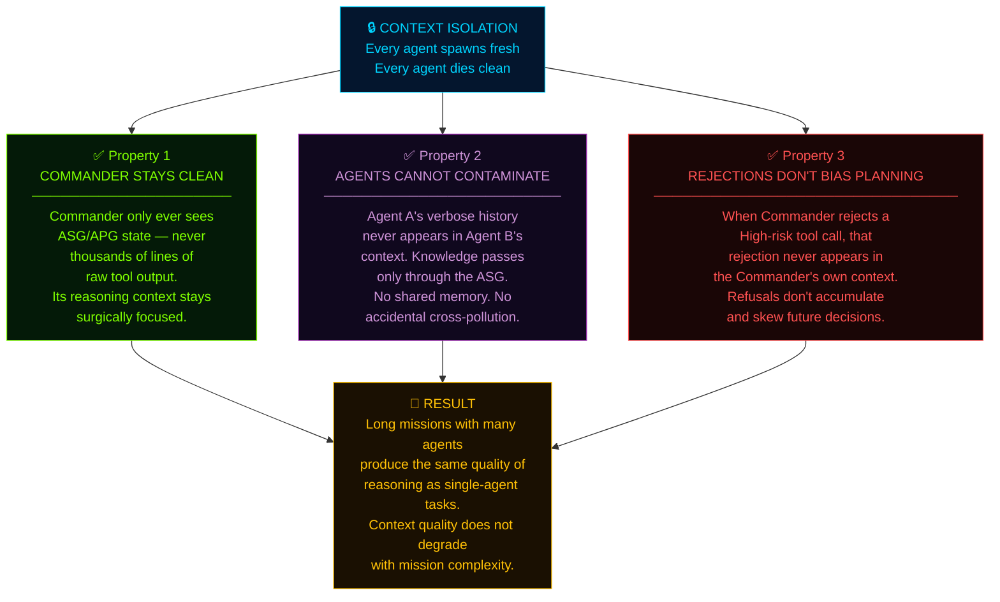

### Reading Key for Diagram 3

| Concept | What to Notice |
|---------|---------------|
| Spawn package | 5 components — each scoped, none is the full system state |
| Tool Set boundary | Agent can ONLY use tools it was authorized for at spawn |
| Knowledge Docs | Only Validation + Analysis agents receive these — matched to their vulnerability class |
| Return = delta only | The ASG grows by addition — agents don't rewrite existing nodes |
| Context discarded | The working session is gone — the ASG persists forever |

---

*Diagram 4 below: Tool Risk Gate Flow*

---

## Diagram 4 — Tool Risk Gate: Every Tool Call's Journey

No tool in CMatrix executes without passing through this gate. This diagram shows the complete decision path — from an agent requesting a tool call, through all three risk tiers, to either execution or rejection.

### 4A — The Full Risk Gate Decision Tree

```mermaid
flowchart TD
    START["🤖 Agent requests tool call\n───────────────────────────\nTool: Gobuster\nTarget: shopvault.io\nParams: -w big.txt -x php,sql"]

    HOOK1["🪝 PreToolUse Hook fires\n───────────────────────\nExternal observers notified.\nHook returns: CONTINUE / BLOCK / MODIFY"]

    HOOK1_CHECK{Hook returns?}
    HOOK_BLOCK["❌ BLOCKED\nAction cancelled.\nReason logged."]
    HOOK_MODIFY["🔄 MODIFIED\nPayload updated.\nProceeds with\nmodified params."]

    SCOPE["🔍 Scope Check\n──────────────────\nIs target in declared scope?\nIs this tool authorized\nfor this agent type?"]

    SCOPE_FAIL["❌ OUT OF SCOPE\nTool call rejected.\nAgent notified.\nNo execution."]

    CLASSIFY["🎯 Risk Classification\n──────────────────────\nWhich tier does this call belong to?"]

    LOW{"🟢 LOW RISK?\nPassive tools:\nAmass · httpx\nWhatWeb"}
    MED{"🟡 MEDIUM RISK?\nActive tools:\nNmap · Gobuster · ffuf\nNuclei · OWASP ZAP"}
    HIGH{"🔴 HIGH RISK?\nExploitation tools:\nSQLMap · Metasploit"}

    EXEC_LOW["✅ Execute immediately\nNo further approval needed"]

    CLASSIFIER["🧠 LLM Permission Classifier\n────────────────────────────\nFast filter pass:\n  → Clearly safe? → EXECUTE\n  → Clearly risky? → ESCALATE\n\nChain-of-thought pass (ambiguous):\n  Axis 1: Scope alignment\n  Axis 2: Chain intent\n  Axis 3: Parameter safety\n  → Checks for prompt injection"]

    CLF_RESULT{Classifier verdict?}
    CLF_EXEC["✅ EXECUTE\nProceeds to\nTool Adapter"]
    CLF_ESC["⬆️ ESCALATE\nRouted to\nCommander Mailbox"]

    MAILBOX["📬 Commander Mailbox\n──────────────────────\nApproval request queued:\n  • Tool + module\n  • Target ASG node\n  • Chain context\n  • Rationale\n\n(Human inserted here\nin supervised mode)"]

    CMD_REVIEW{Commander decides?}
    CMD_APPROVE["✅ APPROVED\nProceeds to\nTool Adapter"]
    CMD_REJECT["❌ REJECTED\nCancelled.\nReason annotated\nto APG chain."]
    CMD_MODIFY["🔄 MODIFIED\nCommander adjusts\nparams, then approves"]

    ADAPTER["⚙️ Tool Adapter executes\n────────────────────────\n1. Translate request → CLI command\n2. Run tool\n3. Parse raw output → structured JSON\n4. Discard raw output"]

    HOOK2["🪝 PostToolUse Hook fires\n─────────────────────────\nStructured findings available.\nHook can: log · alert · validate · block write"]

    ASG_WRITE["🟢 Structured findings\nwritten to ASG as\nnodes + edges"]

    AG_SUMMARY["🤖 Agent receives\ncompact summary only\n(NOT raw output)"]

    START --> HOOK1
    HOOK1 --> HOOK1_CHECK
    HOOK1_CHECK -->|BLOCK| HOOK_BLOCK
    HOOK1_CHECK -->|MODIFY| HOOK_MODIFY
    HOOK1_CHECK -->|CONTINUE| SCOPE
    HOOK_MODIFY --> SCOPE

    SCOPE -->|fail| SCOPE_FAIL
    SCOPE -->|pass| CLASSIFY

    CLASSIFY --> LOW
    CLASSIFY --> MED
    CLASSIFY --> HIGH

    LOW -->|yes| EXEC_LOW
    MED -->|yes| CLASSIFIER
    HIGH -->|yes| MAILBOX

    CLASSIFIER --> CLF_RESULT
    CLF_RESULT -->|EXECUTE| CLF_EXEC
    CLF_RESULT -->|ESCALATE| MAILBOX

    MAILBOX --> CMD_REVIEW
    CMD_REVIEW -->|APPROVE| CMD_APPROVE
    CMD_REVIEW -->|REJECT| CMD_REJECT
    CMD_REVIEW -->|MODIFY| CMD_MODIFY

    EXEC_LOW --> ADAPTER
    CLF_EXEC --> ADAPTER
    CMD_APPROVE --> ADAPTER
    CMD_MODIFY --> ADAPTER

    ADAPTER --> HOOK2
    HOOK2 --> ASG_WRITE
    HOOK2 --> AG_SUMMARY

    style START fill:#04162E,stroke:#00D4FF,color:#fff
    style HOOK1 fill:#0C0820,stroke:#9C27B0,color:#CE93D8
    style HOOK2 fill:#0C0820,stroke:#9C27B0,color:#CE93D8
    style HOOK_BLOCK fill:#1A0606,stroke:#FF5252,color:#FF5252
    style HOOK_MODIFY fill:#1A1002,stroke:#FFC107,color:#FFC107
    style SCOPE fill:#0A0C1E,stroke:#888,color:#aaa
    style SCOPE_FAIL fill:#1A0606,stroke:#FF5252,color:#FF5252
    style CLASSIFY fill:#0A0C1E,stroke:#888,color:#aaa
    style LOW fill:#041A08,stroke:#7FFF00,color:#7FFF00
    style MED fill:#1A1002,stroke:#FFC107,color:#FFC107
    style HIGH fill:#1A0606,stroke:#FF5252,color:#FF5252
    style EXEC_LOW fill:#041A08,stroke:#7FFF00,color:#7FFF00
    style CLASSIFIER fill:#04162E,stroke:#00D4FF,color:#00D4FF
    style CLF_EXEC fill:#041A08,stroke:#7FFF00,color:#7FFF00
    style CLF_ESC fill:#1A1002,stroke:#FFC107,color:#FFC107
    style MAILBOX fill:#04162E,stroke:#00D4FF,color:#00D4FF
    style CMD_APPROVE fill:#041A08,stroke:#7FFF00,color:#7FFF00
    style CMD_REJECT fill:#1A0606,stroke:#FF5252,color:#FF5252
    style CMD_MODIFY fill:#1A1002,stroke:#FFC107,color:#FFC107
    style ADAPTER fill:#0A0C1E,stroke:#9C27B0,color:#CE93D8
    style ASG_WRITE fill:#062210,stroke:#7FFF00,color:#7FFF00
    style AG_SUMMARY fill:#04162E,stroke:#00D4FF,color:#00D4FF
```

---

### 4B — What the LLM Permission Classifier Actually Checks

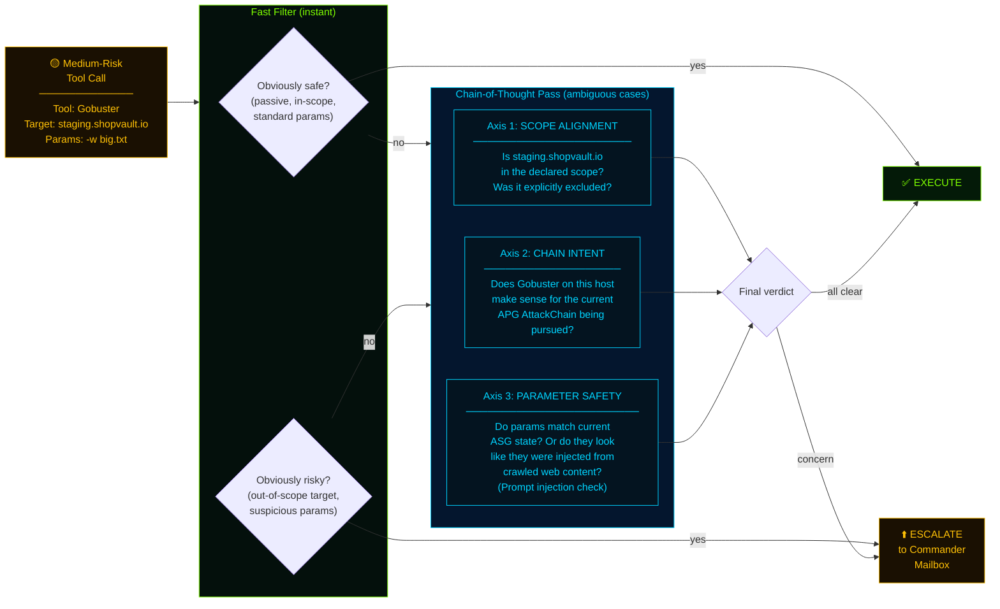

---

### 4C — The 6 Lifecycle Hooks: Where Operators Can Intervene

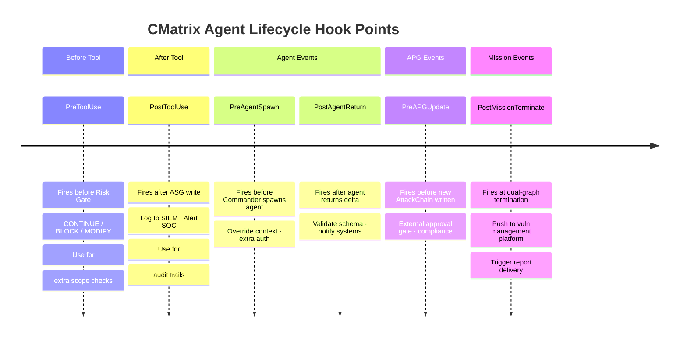

### Risk Gate Summary Table

| Tool | Tier | Gate | Rationale |
|------|------|------|-----------|
| Amass | 🟢 LOW | Scope check only | Passive DNS — no target traffic |
| httpx | 🟢 LOW | Scope check only | Read-only HTTP probing |
| WhatWeb | 🟢 LOW | Scope check only | Read-only fingerprinting |
| Nmap | 🟡 MED | LLM Classifier | Active scan — may trigger IDS |
| Gobuster | 🟡 MED | LLM Classifier | Active — unusual traffic patterns |
| ffuf | 🟡 MED | LLM Classifier | Active fuzzing — parameter injection risk |
| Nuclei | 🟡 MED | LLM Classifier | Template matching — active probes |
| OWASP ZAP | 🟡 MED | LLM Classifier | Active web scan — touches all endpoints |
| EyeWitness | 🟢 LOW | Scope check only | Screenshot only — no exploitation |
| SQLMap | 🔴 HIGH | Commander Mailbox | Destructive — extracts data |
| Metasploit | 🔴 HIGH | Commander Mailbox | Irreversible — achieves code execution |

---

*Diagram 5 below: Autonomous Planning Cycle Loop*

---

## Diagram 5 — The Autonomous Planning Cycle

The Commander runs this loop continuously — from mission start until the dual-graph termination condition fires. Every iteration is grounded in graph state. Every decision is traceable to a specific graph event.

### 5A — The Core Planning Loop

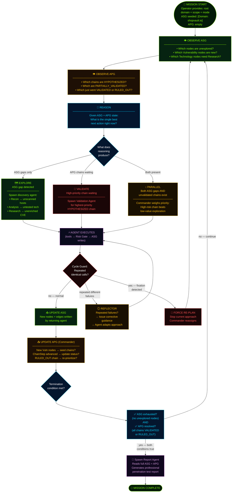

---

### 5B — What Triggers a Re-Plan (Graph-Grounded Events)

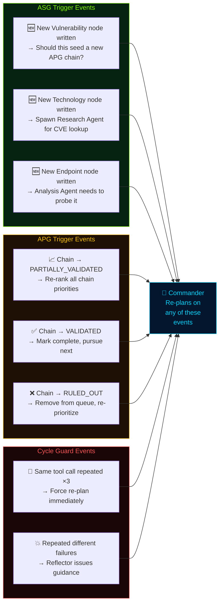

---

### 5C — The Dual Termination Condition (Why Both Must Be True)

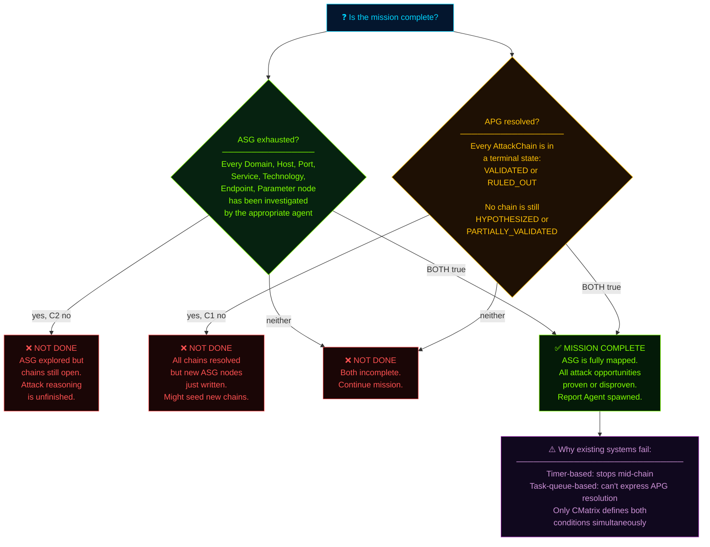

---

### 5D — Context Compaction: How Long Missions Stay Sharp

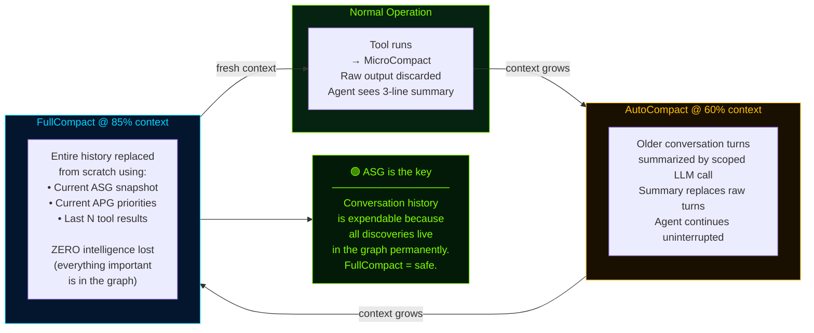

### Planning Cycle — Key Insights

| Question | Answer |
|----------|--------|
| What drives re-planning? | Explicit graph events — never timers or empty queues |
| How does the Commander know what to do next? | Reads ASG (unexplored nodes) + APG (chain priorities) |
| What prevents infinite loops? | Cycle Guard (identical calls) + Reflector (repeated failures) |
| When does the mission end? | ASG exhausted AND all APG chains terminal — both simultaneously |
| How does context stay manageable? | 3-layer compaction — history is expendable, graph is permanent |

---

*Diagram 6 below: shopvault.io Full Mission Walkthrough*

---

## Diagram 6 — Real-World Scenario: shopvault.io End-to-End

This is the complete picture. One real mission. Zero manual commands. Watch every tool, every graph write, every Commander decision, from the moment the operator presses start to the final professional report.

**Target:** `shopvault.io` — an e-commerce platform  
**Mode:** Black-Box (zero prior knowledge)  
**Scope:** All subdomains, web apps, REST APIs  
**Operator action:** Provide domain + scope → press start

---

### 6A — Mission Timeline: Phase by Phase

```mermaid
flowchart TD
    OP(["🧑 OPERATOR\nTarget: shopvault.io\nScope: all subdomains\nMode: Black-Box\n→ PRESS START"])

    subgraph P1["🟢 PHASE 1 — RECONNAISSANCE\nRecon Agent spawned"]
        A1["Tool: Amass\n────────────────────────\n14 subdomains discovered:\napi · admin · staging\npay · mail · static · ..."]
        A2["Tool: httpx\n────────────────────────\n11 live hosts confirmed\nstaging → unexpected 200 OK\npay → TLS certificate EXPIRED"]
        A3["Tool: Nmap\n────────────────────────\n28 open ports mapped\nPorts: 80, 443, 8080, 8443, 22\nServices: Nginx 1.18 · OpenSSH 8.9\nUnencrypted HTTP on port 8080"]
        D1["📥 ASG DELTA\n37 new nodes written:\n14 Domain · 11 Host\n28 Port · 15 Service"]
    end

    subgraph P2["🔵 PHASE 2 — ANALYSIS + INTELLIGENCE\nAnalysis Agent + Research Agent spawned"]
        B1["Tool: WhatWeb\n────────────────────────\nWordPress 5.9.3 on shopvault.io\nWooCommerce 6.1 detected\nDjango 4.1.2 on api.shopvault.io\n→ Commander spawns Research Agent"]
        B2["Research Agent: NVD + Exploit-DB\n────────────────────────────────\nCVE-2022-21661 found (CVSS 8.8)\nPoC on Exploit-DB ✓\nMetasploit module available ✓"]
        B3["Tool: Gobuster\n────────────────────────\n/backup/db_export_2023.sql → 200!\n/wp-admin/login → 200\n/wp-admin/users → 403\n/api/v1/internal/users → 200"]
        B4["Tool: ffuf\n────────────────────────\nIDOR: user_id param unsanitised\n/api/v2 routes discovered\nVirtual host: internal.shopvault.io"]
        B5["Tool: Nuclei\n────────────────────────\nCVE-2022-21661 template → MATCH\nExposed phpinfo.php on staging\nDefault creds check: admin/admin → fail"]
        B6["Tool: OWASP ZAP\n────────────────────────\nXSS on /search?q= (reflected)\nSQL error on staging login form\nMissing security headers on API"]
        D2["📥 ASG DELTA: 61 new nodes\nTechnology(3) · Endpoint(19)\nParameter(8) · Vulnerability(9)\n\n📥 APG DELTA: 3 chains seeded\nChain-01: CVE SQLi→RCE (8.8)\nChain-02: IDOR orders API (7.5)\nChain-03: Exposed DB backup (6.2)"]
    end

    subgraph P3["🔴 PHASE 3 — VALIDATION + EVIDENCE\nValidation Agent + Evidence Agent spawned"]
        C1["Chain-01 (highest priority: 8.8)\n────────────────────────────────\nStep 1: SQLMap on WP_Query\n→ SQLi confirmed ✅\n→ Evidence: sqli-extraction.txt"]
        C2["Step 2: SQLMap --dump users table\n────────────────────────────────\n→ Admin hash extracted ✅\n→ Offline crack: password123\n→ Evidence: user-table-dump.png"]
        C3["Step 3: Metasploit wp_admin_shell_upload\n────────────────────────────────\n⚠️ HIGH RISK → Commander Mailbox\n→ Commander APPROVES\n→ Web shell deployed ✅\n→ RCE confirmed!\n→ risk_score escalated: 8.8 → 9.1\n→ Evidence: webshell-rce.png"]
        C4["Chain-02 (risk: 7.5)\n────────────────────────────────\nffuf: user_id=456 returns user 456 orders\n→ IDOR confirmed ✅\n→ All customer PII accessible\n→ Evidence: idor-orders-dump.png"]
        C5["Chain-03 (risk: 6.2)\n────────────────────────────────\nGET /backup/db_export_2023.sql\n→ Attempt 1: 403 (WAF blocked)\n→ Diagnose: WAF active\n→ Attempt 2: header bypass → 403\n→ Attempt 3: path variation → 403\n→ CAP REACHED → RULED_OUT\n→ Failure written to ASG Vuln node"]
        D3["📥 APG DELTA\nChain-01: VALIDATED (9.1)\nChain-02: VALIDATED (7.5)\nChain-03: RULED_OUT (6.2)\n\n📥 ASG DELTA\n4 Evidence nodes + edges added"]
    end

    subgraph P4["🟣 PHASE 4 — REPORT\nReport Agent spawned — reads full ASG + APG"]
        RPT["📋 PROFESSIONAL PENETRATION TEST REPORT\n─────────────────────────────────────────\n• Executive Summary\n• 2 Validated Attack Chains (RCE + IDOR)\n• 1 Ruled-Out Chain (DB backup WAF-protected)\n• Full attack surface map (14 subdomains · 11 hosts)\n• 9 vulnerabilities with CVSS scores\n• Remediation guidance ordered by risk_score\n• Screenshot evidence at every ChainStep\n• ZERO manual commands issued"]
    end

    TERM["✅ TERMINATION CONDITION MET\nASG: all 98 nodes explored\nAPG: all 3 chains in terminal state\n→ Report Agent spawned"]

    OP --> P1
    A1 --> A2 --> A3 --> D1
    D1 --> P2
    B1 --> B2 --> B3 --> B4 --> B5 --> B6 --> D2
    D2 --> P3
    C1 --> C2 --> C3
    C3 --> C4 --> C5 --> D3
    D3 --> TERM
    TERM --> P4
    P4 --> RPT

    style OP fill:#041A08,stroke:#7FFF00,color:#7FFF00
    style P1 fill:#062210,stroke:#7FFF00,color:#7FFF00
    style P2 fill:#04162E,stroke:#00D4FF,color:#00D4FF
    style P3 fill:#1A0606,stroke:#FF5252,color:#FF5252
    style P4 fill:#10081E,stroke:#9C27B0,color:#CE93D8
    style D1 fill:#041A08,stroke:#7FFF00,color:#7FFF00
    style D2 fill:#041A08,stroke:#7FFF00,color:#7FFF00
    style D3 fill:#1E1004,stroke:#FFC107,color:#FFC107
    style TERM fill:#041A08,stroke:#7FFF00,color:#7FFF00
    style RPT fill:#10081E,stroke:#9C27B0,color:#CE93D8
```

---

### 6B — The Commander's Decision Log (Key Moments)

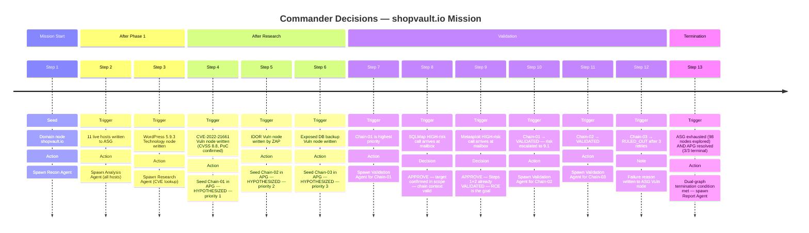

---

### 6C — Final Mission Stats

```mermaid
flowchart LR
    subgraph ASG_FINAL["🟢 ASG — Final State"]
        direction TB
        N1["14 Domain nodes"]
        N2["11 Host nodes"]
        N3["28 Port nodes"]
        N4["15 Service nodes"]
        N5["3 Technology nodes"]
        N6["19 Endpoint nodes"]
        N7["8 Parameter nodes"]
        N8["9 Vulnerability nodes"]
        N9["4 Evidence nodes"]
        NT["= 111 total nodes"]
    end

    subgraph APG_FINAL["🟡 APG — Final State"]
        direction TB
        CH1["Chain-01: VALIDATED ✅\nrisk: 9.1 (escalated)\nSQLi → Admin → RCE"]
        CH2["Chain-02: VALIDATED ✅\nrisk: 7.5\nIDOR → Customer PII"]
        CH3["Chain-03: RULED_OUT ❌\nrisk: 6.2\nDB backup WAF-protected"]
    end

    subgraph REPORT_FINAL["📝 Report Output"]
        direction TB
        R1["2 validated attack chains\nwith step-by-step reproduction"]
        R2["4 screenshot evidence artifacts\nlinked at each ChainStep"]
        R3["9 vulnerabilities\nordered by risk_score"]
        R4["Remediation guidance\nprioritized by business risk"]
        R5["0 manual commands issued\nduring entire assessment"]
    end

    ASG_FINAL --> REPORT_FINAL
    APG_FINAL --> REPORT_FINAL

    style ASG_FINAL fill:#062210,stroke:#7FFF00,color:#7FFF00
    style APG_FINAL fill:#1E1004,stroke:#FFC107,color:#FFC107
    style REPORT_FINAL fill:#10081E,stroke:#9C27B0,color:#CE93D8
```

---

### 6D — Chain-01 Full Traceability: From CVE to Evidence

This is the most important chain in the mission. Every arrow here is a relationship that exists in the dual graph — followable from the report all the way back to the raw evidence file.

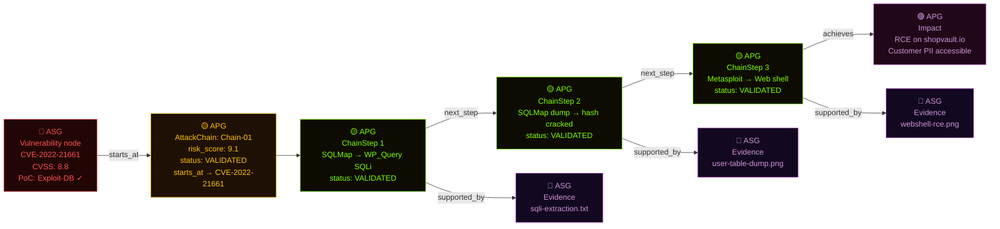

**Reading this diagram:** Start at the red CVE node (ASG fact) → follow `starts_at` to the gold Chain (APG reasoning) → follow ChainSteps in order → arrive at the purple Impact (what was demonstrated) → follow `supported_by` back to the purple Evidence nodes (ASG proof). Every claim in the final report has this complete path. Nothing is asserted without evidence.

---

### Summary: What Makes This Remarkable

| Fact | Significance |
|------|-------------|
| **Zero manual commands** | The operator configured scope and pressed start. Everything else was autonomous. |
| **All tool calls gated** | SQLMap and Metasploit both went through Commander Mailbox — no exploitation without approval |
| **Chain-03 RULED_OUT** | The system correctly diagnosed WAF protection and stopped after 3 retries — not an infinite loop |
| **risk_score escalated** | Chain-01 started at 8.8 (CVSS); after RCE was confirmed, Commander escalated to 9.1 |
| **Traceability** | Every Impact claim links through ChainSteps back to Evidence files in the ASG |
| **Dual termination** | Mission ended because 98 nodes explored AND 3/3 chains terminal — not because a timer fired |

---

## Module 08 — Complete ✅

All 6 diagrams are now in this file:

| # | Diagram | What It Shows |
|---|---------|---------------|
| 1 | System Architecture | 3-tier swim-lane: Orchestration → Dual-Graph → Agents+Tools |
| 2 | Dual-Graph Model | ASG node tree (9 types) + APG chain lifecycle (3 chains) |
| 3 | Agent Spawn Lifecycle | Sequence diagram + spawn package + 3 isolation properties |
| 4 | Tool Risk Gate | Full decision tree + LLM classifier internals + 6 hooks timeline |
| 5 | Planning Cycle | Core loop + re-plan triggers + dual termination + compaction |
| 6 | shopvault.io Walkthrough | Phase-by-phase timeline + Commander log + traceability chain |
