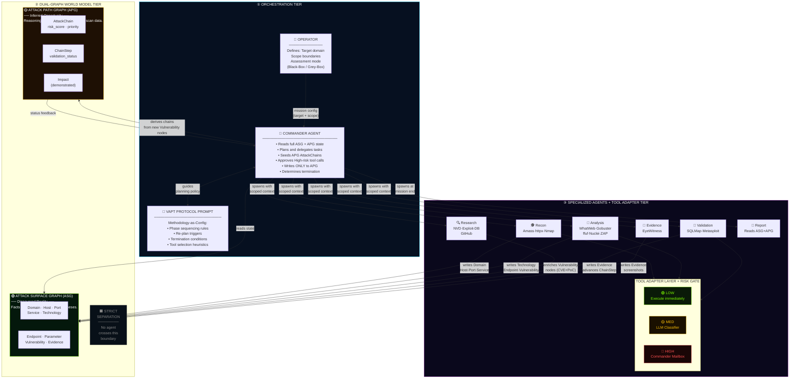
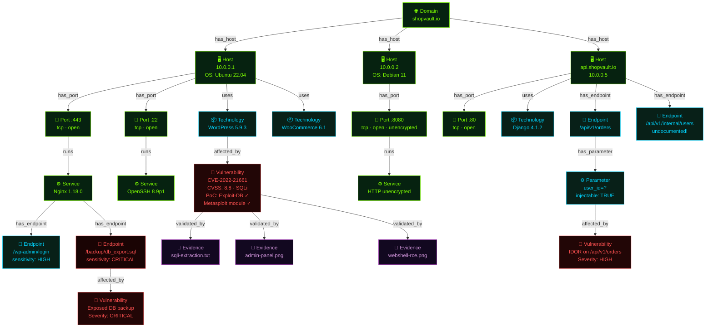
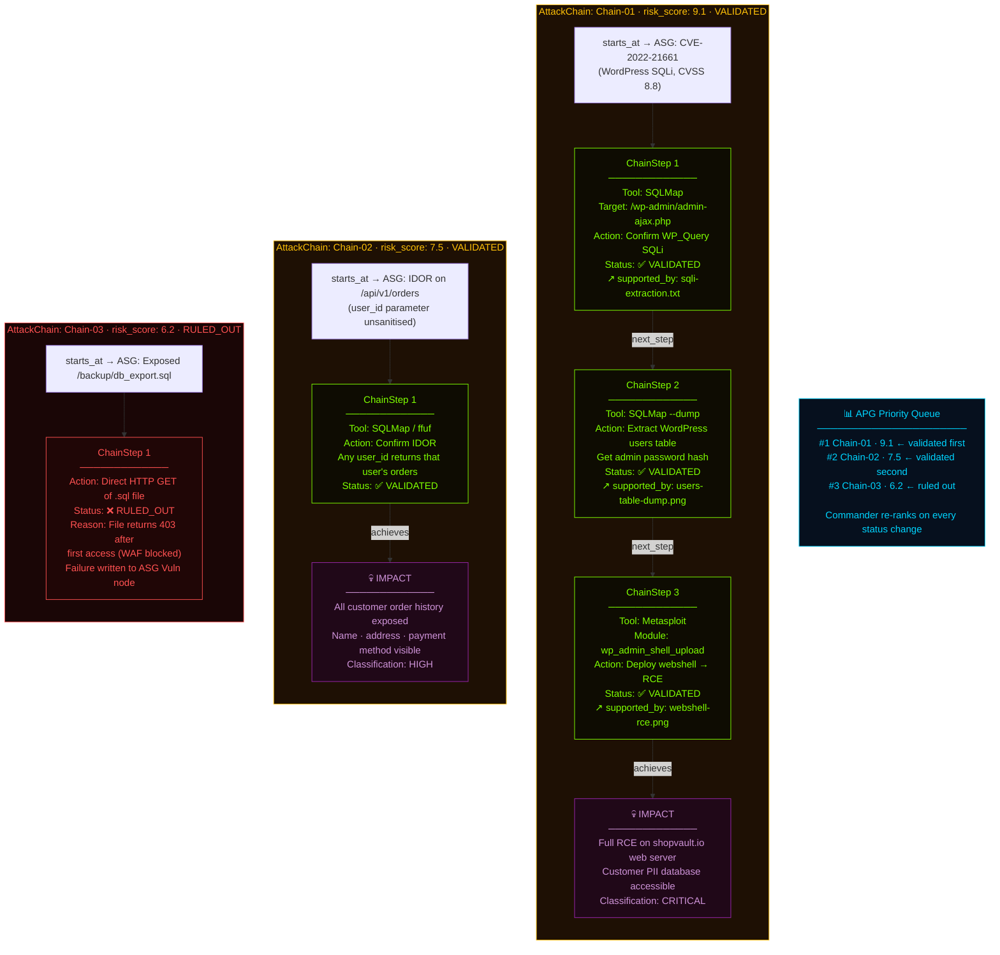
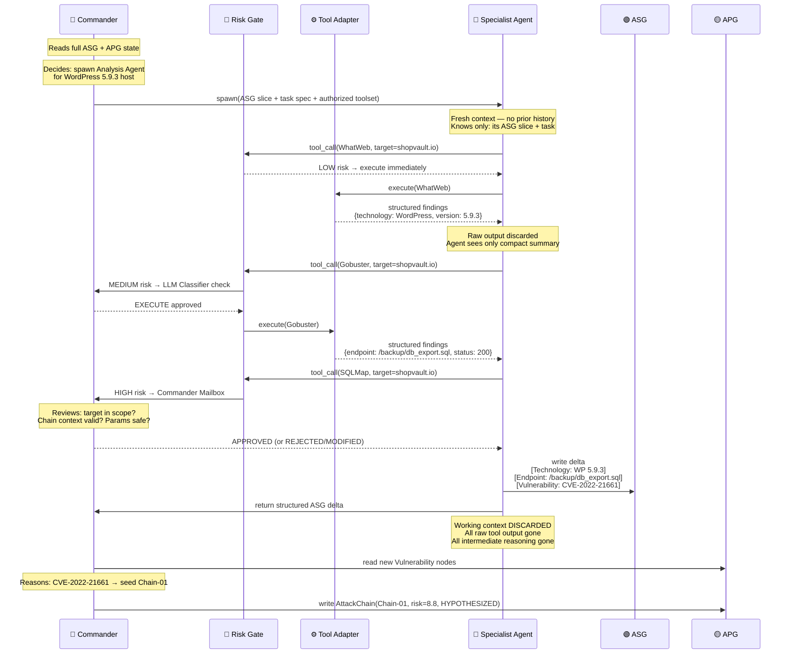
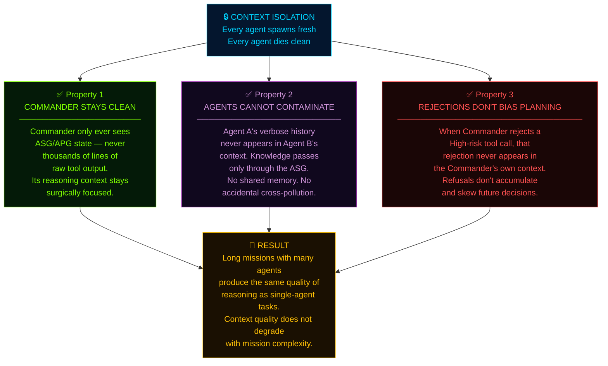

# Module 08 — Visual Walkthrough: CMatrix Architecture in Diagrams

> **How to read this module:** Every diagram here is a visual translation of a concept already explained in Modules 01–07. If a box or arrow is unfamiliar, refer back to the relevant module. This file adds *no new concepts* — it only makes existing ones visible.

---

## Diagram 1 — System Architecture: The Three-Tier Overview

This is the master view of CMatrix. Everything fits into three tiers:

- **Tier 1 (top):** Orchestration — the operator configures, the Commander reasons
- **Tier 2 (middle):** The dual-graph world model — the two living knowledge stores
- **Tier 3 (bottom):** The six specialist agents and the tool layer they operate through

### Reading Key

| Colour | Meaning |
|--------|---------|
| 🟢 Cyan border | Commander — orchestration layer |
| 🟢 Lime/Green border | ASG — discovery facts |
| 🟡 Gold border | APG — attack reasoning |
| 🟣 Purple border | Agent tier + tool adapter |
| Solid arrow | Data flow / write |
| Dashed arrow | Read / feedback |

### Three Things to Notice

1. **The Commander never touches tools.** Every arrow from the Commander goes to agents — never to the Tool Adapter Layer directly.
2. **Only the Commander writes to the APG.** All six specialist agents write only to the ASG (or read from it). The APG is exclusively the Commander's domain.
3. **All tool calls go through the Tool Adapter Layer.** There is no path from an agent directly to a tool. The Risk Gate sits in that layer.

---

*Diagram 2 below: Dual-Graph Model (ASG node tree + APG attack chain, visualised)*

---

## Diagram 2 — The Dual-Graph Model: ASG + APG Visualised

This diagram shows both graphs side-by-side using the `shopvault.io` mission as a concrete example. Left side = ASG (what was discovered). Right side = APG (what can be done with it). The vertical barrier in the middle = the strict separation boundary.

### 2A — ASG: The Attack Surface Graph (Discovered Reality)

Every node here represents something **confirmed by a tool**. Every edge represents a **confirmed relationship**. No guesses. No hypotheses.

**Node colour key:**
- 🟢 **Lime** — Domain, Host, Port, Service (infrastructure layer)
- 🔵 **Cyan** — Technology, Endpoint, Parameter (application layer)
- 🔴 **Red** — Vulnerability (weakness layer)
- 🟣 **Purple** — Evidence (proof layer)

---

### 2B — APG: The Attack Path Graph (Inferred Opportunity)

The Commander reads the ASG and reasons: *"These vulnerabilities can chain together into complete attack paths."* Those chains live here — in the APG.

### What the Two Graphs Together Tell You

| Question | Answered By |
|----------|------------|
| "What hosts exist on shopvault.io?" | ASG → Domain → Host nodes |
| "What software is running on port 443?" | ASG → Port → Service → Technology nodes |
| "Which vulnerabilities were found?" | ASG → Vulnerability nodes (with CVSS, PoC status) |
| "What are the complete attack paths?" | APG → AttackChain nodes (with ChainSteps) |
| "Which attack is most dangerous?" | APG → risk_score ranking |
| "Is each attack actually proven?" | APG → validation_status + supported_by → ASG Evidence |
| "What is the proof?" | ASG → Evidence nodes (screenshots, tool outputs) |

---

*Diagram 3 below: Agent Spawn Lifecycle*

---

## Diagram 3 — Agent Spawn Lifecycle: Born Fresh, Die Clean

This is the most important architectural insight that separates CMatrix from other multi-agent systems. Every agent is born fresh, does exactly one job with a scoped context, and vanishes — leaving only structured graph state behind.

### 3A — The Spawn Lifecycle (single agent)

---

### 3B — What Each Agent Receives at Spawn (Scoped Context)

```mermaid
flowchart LR
    CMD["👑 COMMANDER\nDecides next action"]

    subgraph SPAWN["Agent Spawn Package"]
        direction TB
        S1["📊 ASG SLICE\nOnly nodes relevant to this task\nNot the full graph"]
        S2["🔗 APG SLICE\nRelevant AttackChains only\n(if this is a Validation task)"]
        S3["🔧 TOOL SET\nAuthorized tools only\nNo others available"]
        S4["📋 TASK SPEC\nCommander's current plan item\nExact objective for this spawn"]
        S5["📚 KNOWLEDGE DOCS\n(Validation Agent only)\nVulnerability-class expert docs\ninjected at spawn time"]
    end

    subgraph AGENT["🤖 Isolated Agent Context\n(fresh per task — no prior history)"]
        WORK["Works autonomously\nwithin bounded context\nAll tool calls → Risk Gate"]
    end

    subgraph RETURN["Agent Returns"]
        R1["✅ Structured ASG Delta\nNew nodes + edges only"]
        R2["🗑️ Working context DISCARDED\nRaw tool output → gone\nConversation history → gone\nIntermediate reasoning → gone"]
    end

    CMD -->|"spawn with\nscoped package"| SPAWN
    SPAWN --> AGENT
    AGENT --> RETURN
    RETURN -->|"delta written\nto ASG"| ASG_ICON["🟢 ASG"]
    RETURN -->|"Commander reads\nnew nodes"| CMD

    style CMD fill:#04162E,stroke:#00D4FF,color:#00D4FF
    style SPAWN fill:#0A0C1E,stroke:#9C27B0,color:#9C27B0
    style AGENT fill:#0A0C1E,stroke:#9C27B0,color:#fff
    style RETURN fill:#041808,stroke:#7FFF00,color:#7FFF00
    style ASG_ICON fill:#062210,stroke:#7FFF00,color:#7FFF00
    style S1 fill:#04180A,stroke:#7FFF00,color:#7FFF00
    style S2 fill:#1A1002,stroke:#FFC107,color:#FFC107
    style S3 fill:#180404,stroke:#FF5252,color:#FF5252
    style S4 fill:#041420,stroke:#00D4FF,color:#00D4FF
    style S5 fill:#100820,stroke:#9C27B0,color:#CE93D8
```

---

### 3C — Why Context Isolation Produces Three Critical Properties

### Reading Key for Diagram 3

| Concept | What to Notice |
|---------|---------------|
| Spawn package | 5 components — each scoped, none is the full system state |
| Tool Set boundary | Agent can ONLY use tools it was authorized for at spawn |
| Knowledge Docs | Only Validation + Analysis agents receive these — matched to their vulnerability class |
| Return = delta only | The ASG grows by addition — agents don't rewrite existing nodes |
| Context discarded | The working session is gone — the ASG persists forever |

---

*Diagram 4 coming next: Tool Risk Gate Flow*
