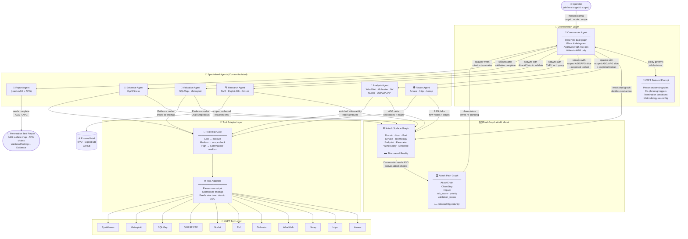

# CMatrix — Research Architecture
> **Dual-Graph-Guided LLM-Orchestrated Multi-Agent Framework for Autonomous VAPT**

---

## 1. What CMatrix Is

CMatrix is an autonomous Vulnerability Assessment and Penetration Testing (VAPT) system that replicates the **reasoning process** of a professional penetration tester — not just its tooling.

Most existing systems automate tool execution. CMatrix automates the *decision-making*: what to look for, what it means, what to do next, and when to stop.

> **The goal is not to automate tools. The goal is to automate the reasoning of a professional penetration tester.**

The system combines two continuously evolving graph structures with specialized AI agents and an LLM orchestration layer to perform end-to-end penetration testing without human intervention.

---

## 2. The Core Problem CMatrix Solves

Existing LLM-based VAPT systems share a fundamental limitation: they have **no structured model of the target environment** and **no structured model of what attack paths are possible**.

They reason from flat conversation history, task queues, or vector memory. When they finish a task, they know what they *did* — but they have no representation of what the target *is* or what *can be done to it*.

This makes dynamic re-planning fragile, attack path reasoning ad-hoc, and termination conditions arbitrary.

CMatrix solves this with a **dual-graph world model**: two complementary graph structures that together give the system a complete, structured picture of both the target environment and the attack opportunities it presents.

---

## 3. Scope

**Assessment Modes**
- Black-Box — no prior knowledge of target
- Grey-Box — partial knowledge (credentials, network ranges)

**Target Categories**
- Network Infrastructure
- Web Applications
- REST APIs

**Security Activities**
- Reconnaissance and Host Discovery
- Technology Fingerprinting
- Resource and API Enumeration
- Live Vulnerability Intelligence Research — real-time CVE lookup, PoC discovery, and exploit feasibility grounding
- Vulnerability Discovery and Analysis
- Vulnerability Validation and Exploitation
- Attack Path Validation
- Evidence Collection
- Reporting

**Out of Scope**
- White-Box Testing and Source Code Analysis
- Mobile, Cloud, IoT, and Wireless Security
- Lateral Movement and Post-Exploitation Research
- Active Directory Attacks

---

## 4. Offensive Tool Catalogue

CMatrix integrates 11 industry-standard offensive security tools, each serving a distinct role in the assessment pipeline. Every tool is operated exclusively through the Tool Adapter Layer — agents never invoke tools directly.

| # | Tool | Phase | Role |
|---|------|-------|------|
| 1 | **Amass** | Reconnaissance | Subdomain enumeration and external attack surface discovery via DNS brute-forcing, certificate transparency logs, and passive OSINT sources |
| 2 | **httpx** | Reconnaissance | HTTP probing — validates which discovered hosts are live, identifies web servers, status codes, redirects, and TLS details |
| 3 | **Nmap** | Reconnaissance | Port scanning, service fingerprinting, OS detection, and optional vulnerability script execution on discovered hosts |
| 4 | **WhatWeb** | Analysis | Technology fingerprinting — identifies CMS, frameworks, server software, JavaScript libraries, and version information from HTTP responses |
| 5 | **Gobuster** | Analysis | Directory and file brute-forcing on web targets — discovers hidden paths, admin panels, backup files, and exposed resources |
| 6 | **ffuf** | Analysis | Fast web fuzzer for API route discovery, parameter fuzzing, and virtual host enumeration |
| 7 | **Nuclei** | Analysis | Template-based vulnerability scanning — matches discovered services and technologies against a library of CVE and misconfiguration templates |
| 8 | **OWASP ZAP** | Analysis | Active web application scanning — crawls and actively tests for OWASP Top 10 vulnerabilities including XSS, CSRF, injection flaws, and authentication weaknesses |
| 9 | **SQLMap** | Validation | Automated SQL injection detection and exploitation — confirms injection points, extracts data, and tests for OS-level access |
| 10 | **Metasploit** | Validation | Exploitation framework — executes known exploits against identified vulnerabilities, validates ChainSteps in APG AttackChains, and demonstrates impact |
| 11 | **EyeWitness** | Evidence | Headless screenshot capture of web pages, exposed panels, and API responses — produces visual proof artifacts linked to ASG Evidence nodes |

**Tool-to-agent mapping:**

| Agent | Tools |
|-------|-------|
| Recon Agent | Amass · httpx · Nmap |
| Analysis Agent | WhatWeb · Gobuster · ffuf · Nuclei · OWASP ZAP |
| Validation Agent | SQLMap · Metasploit |
| Evidence Agent | EyeWitness |
| Research Agent | External intelligence APIs (NVD, Exploit-DB, GitHub) — not VAPT tools |

---

## 5. The Dual-Graph World Model

The architectural foundation of CMatrix is two complementary graph structures maintained as strictly separate knowledge layers.

> **ASG** → *What does the target look like?* (discovered reality)
> **APG** → *What can be done to it?* (inferred opportunity)

This separation is the central design principle. No other published VAPT system maintains these as distinct structures.

---

### 5a. Attack Surface Graph (ASG)

The ASG is the **discovered-reality layer**. It is a continuously evolving knowledge graph representing the complete discovered state of the target environment. Every tool execution that produces a finding updates it.

*It is not a task list. It is not a log. It is a living structural model of the target.*

**Node types:**

| Node | Represents |
|------|-----------|
| Domain | Root domain and discovered subdomains |
| Host | IP address, OS, liveness status |
| Port | Open port with protocol |
| Service | Service name, version, banner |
| Technology | Framework, CMS, server software |
| Endpoint | Web or API route |
| Parameter | Request parameter, header, or input field |
| Vulnerability | CVE, misconfiguration, or weakness — enriched with live intelligence |
| Evidence | Screenshot, response capture, exploitation artifact |

**Edge types:**

| Edge | Meaning |
|------|---------|
| `has_host` | Domain resolves to Host |
| `has_port` | Host exposes Port |
| `runs` | Port runs Service |
| `uses` | Host or Endpoint uses Technology |
| `has_endpoint` | Host or Service has Endpoint |
| `has_parameter` | Endpoint has Parameter |
| `affected_by` | Host or Endpoint affected by Vulnerability |
| `validated_by` | Vulnerability validated by Evidence |

**The ASG contains only confirmed discovered facts. It never contains hypotheses.**

---

### 5b. Attack Path Graph (APG)

The APG is the **inferred-opportunity layer**. While the ASG records what was discovered, the APG records what can be done with those discoveries. It is populated exclusively by the Commander Agent through active reasoning over ASG state.

The APG is not derived automatically — it requires reasoning: which vulnerabilities chain together, which entry points lead to which impacts, which paths are worth pursuing.

**Node types:**

| Node | Represents |
|------|-----------|
| AttackChain | An ordered sequence of exploitation steps from entry point to impact |
| ChainStep | A single step in a chain — a specific action on a specific ASG node |
| Impact | The business or technical consequence at the end of a chain |

**Edge types:**

| Edge | Meaning |
|------|---------|
| `starts_at` | AttackChain begins at an ASG Vulnerability or Endpoint node |
| `next_step` | ChainStep leads to the next ChainStep |
| `achieves` | Final ChainStep achieves an Impact |
| `supported_by` | ChainStep is supported by an ASG Evidence node |

**Each AttackChain carries:**
- `risk_score` — derived from vulnerability severity, exploitability, and impact classification
- `validation_status` — `HYPOTHESIZED` → `PARTIALLY_VALIDATED` → `VALIDATED` / `RULED_OUT`
- `priority` — Commander-assigned pursuit priority

**The APG contains only inferred attack reasoning. It never contains raw scan data.**

---

### 5c. The Separation Principle

The strict separation between ASG and APG is the property that makes the dual-graph architecture stronger than any single unified graph:

- Agents that **discover** write only to the ASG. They never reason about attack chains.
- The Commander that **reasons** writes only to the APG. It never runs tools.
- Each layer is authoritative for exactly one type of knowledge.

This eliminates a class of errors common in flat-memory systems: conflating facts with hypotheses, or letting attack reasoning contaminate environmental observation.

---

## 6. Agent Architecture

CMatrix uses six specialized agents coordinated by a Commander Agent. Each agent is **context-isolated** — spawned fresh for its task, given only the ASG/APG slice it needs, and returning only structured graph output.

### System Architecture Diagram



---


### Commander Agent

*The orchestrating brain. Reads the dual graph. Plans. Delegates. Never runs tools.*

**Key decisions:**
- Which ASG nodes are unexplored? What should be explored next?
- Which Vulnerability nodes seed new APG AttackChains?
- Which APG AttackChain has the highest risk score and should be validated first?
- Which agent should act next?
- Has an AttackChain been fully validated end-to-end?
- Is the mission complete?
- Should a High-risk operation be approved?

The Commander is the only agent that writes to the APG.

---

### Recon Agent

*Responsible for external reconnaissance and host discovery.*

Discovers subdomains, validates live hosts, and identifies open ports, running services, and operating systems. All findings are written to the ASG as Domain, Host, Port, and Service nodes.

---

### Analysis Agent

*Responsible for deep enumeration and vulnerability discovery.*

Fingerprints technologies, discovers hidden resources, finds API routes and parameters, and runs automated vulnerability checks. Findings are written to the ASG as Technology, Endpoint, Parameter, and Vulnerability nodes.

---

### Research Agent

*Responsible for live vulnerability intelligence grounding.*

When the Commander or Analysis Agent encounters an unknown CVE, an unrecognized technology version, or a vulnerability with no available exploit data, it spawns the Research Agent to close the intelligence gap.

The Research Agent performs **scoped, purposeful intelligence retrieval** — not open-ended browsing. Each invocation receives a specific research task: a CVE ID, a technology + version string, or a named weakness.

**Authorized intelligence sources:**
- NVD — CVE technical details, CVSS scores, affected version ranges
- Exploit-DB — public PoC availability and exploit type classification
- GitHub — PoC repositories, security advisories, vendor patches
- Vendor security advisories — sourced from ASG Technology node metadata

**Output written to ASG** as enriched Vulnerability node attributes:
- CVE severity and CVSS vector
- Exploitability assessment (PoC exists / no public PoC / active exploitation in the wild)
- Recommended validation approach

> The Research Agent is the **only** agent authorized to make outbound requests to external sources. All other agents operate exclusively on the local target environment. This boundary is enforced by design.

No raw web content ever enters the LLM context — only the structured intelligence record extracted from the response. This keeps Research Agent output consistent with the same principle applied to tool outputs: structured findings only.

---

### Validation Agent

*Responsible for proving that discovered vulnerabilities are real and exploitable.*

Does not discover vulnerabilities — it proves them. Receives a specific APG AttackChain from the Commander and executes controlled exploitation to validate each ChainStep in sequence.

Confirmed ChainSteps advance to `VALIDATED`. Failed attempts mark the ChainStep as `RULED_OUT` and the Commander re-prioritizes. All exploitation evidence is written to the ASG as Evidence nodes and linked to the corresponding APG ChainStep via `supported_by` edges.

---

### Evidence Agent

*Responsible for capturing proof artifacts.*

Takes screenshots of exposed panels, application pages, and API responses. Captures exploitation results. Links all evidence to corresponding ASG nodes so every finding is traceable to its proof.

---

### Report Agent

*Responsible for producing the final deliverable.*

Reads the complete ASG and APG and generates a structured penetration test report. Does not run tools. Does not make security decisions. It translates the dual-graph world model into human-readable output.

**Report structure:**
- Executive Summary — business impact derived from APG Impact nodes
- Technical Findings — all vulnerabilities with severity, sourced from ASG Vulnerability nodes
- Attack Surface Map — complete discovered environment from ASG
- Validated Attack Chains — step-by-step chains from APG with linked Evidence at each step
- Remediation Guidance — prioritized by APG risk scores

---

## 7. Context-Isolated Agent Spawning

Specialized agents are not persistent processes sharing a context window. Each agent is spawned fresh with a precisely scoped context:

- The **ASG slice** relevant to the current task — not the full graph
- The **APG slice** relevant to the current task, if applicable
- The **restricted tool set** the agent is authorized to call
- The **task specification** from the Commander's current plan

When the agent completes its task, it returns only **structured output** — new ASG nodes and edges. Its working context is discarded.

**This design provides three properties:**
1. The Commander's context is never polluted by raw working history of specialized agents
2. Parallel agents cannot contaminate each other's reasoning
3. A rejected High-risk tool call never appears in the Commander's context, preventing the refusal from biasing future planning

---

## 8. Tool Adapter Layer and Risk Gate

Agents never interact with tools directly. Every tool is wrapped in a **Tool Adapter** — a standardized interface that executes the tool, parses raw output, and returns structured results ready for ASG ingestion.

This means agents reason about *targets*, not command syntax. Tools can be swapped without touching agent logic.

### Tool Risk Gate

Every tool call is classified with a risk tier before execution:

| Risk Tier | Handling |
|-----------|---------|
| Low — passive discovery | Execute immediately |
| Medium — active enumeration | Execute after scope check |
| High — destructive or irreversible operations | Route to Commander mailbox for explicit approval |

When a High-risk call is dispatched, the agent deposits an **approval request** into the Commander's mailbox containing the tool, parameters, target ASG node, and rationale. The Commander evaluates and either approves, rejects, or modifies the call.

**Critical safety property: no irreversible offensive operation executes without Commander-level scope validation.**

For fully autonomous missions, the Commander approves based on protocol rules. For supervised missions, a human operator can be inserted at the mailbox — enabling human-in-the-loop without any change to agent logic.

---

## 9. Methodology-as-Configuration

The Commander's planning and decision-making policy is defined as a structured, versioned natural language document — the **VAPT Protocol Prompt** — injected into the Commander's reasoning context.

It defines:
- Phase sequencing rules and transition conditions
- Re-planning triggers — ASG state changes that force a new plan
- Termination conditions
- Tool selection heuristics per ASG node type and assessment mode
- Risk escalation rules

Different versions implement different methodologies — OWASP Testing Guide, PTES, custom red-team workflow — **without any change to orchestration code**. The methodology itself becomes a configurable, swappable, independently evaluable research variable.

This enables a direct research contribution: the same agent architecture can be benchmarked under different protocol versions, and the effect of methodology choice on assessment outcomes can be measured independently of agent implementation.

---

## 10. Autonomous Planning Cycle

CMatrix operates on a continuous **Observe → Reason → Plan → Execute** loop:

```
Observe ASG    → Read current ASG state
Observe APG    → Read AttackChain priorities and validation status
Reason         → Identify ASG gaps; derive/update APG chains from new Vulnerability nodes
Plan           → Explore ASG gaps OR validate highest-priority APG chain
Spawn          → Spawn context-isolated agent with scoped ASG/APG slice
Gate           → Route High-risk calls through Tool Risk Gate
Execute        → Run approved tool; structured output → ASG
Update ASG     → Agent writes discovered nodes and edges
Update APG     → Commander derives new chains or advances validation status
Return         → Agent returns structured delta; working context discarded
Re-Plan        → Commander re-reads dual graph, decides next action
```

**The cycle terminates when:**
- No unexplored nodes remain in the ASG
- All APG AttackChains are in a terminal state (`VALIDATED` or `RULED_OUT`)
- User-defined constraints (time limit, scope boundary) are reached

This is a **formally grounded dual termination condition** — neither pure task-queue systems nor pure graph-traversal systems can express both simultaneously.

---

## 11. Exploitation Philosophy

CMatrix treats exploitation as a **reasoning activity**, not a shell-collection exercise.

> **Success is defined as validated APG AttackChains with evidence — not obtained shells.**

A penetration test is complete when:
- The attack surface is fully mapped in the ASG
- Vulnerabilities are discovered, classified, and seeded into APG AttackChains
- APG AttackChains are prioritized by risk score and pursued in order
- Each ChainStep is validated through controlled exploitation
- Complete chains from entry to impact are confirmed with linked Evidence
- A professional report is generated from the dual-graph state

**APG chain validation lifecycle:**

| Status | Meaning |
|--------|---------|
| `HYPOTHESIZED` | Commander has inferred a possible chain — not yet tested |
| `PARTIALLY_VALIDATED` | One or more ChainSteps confirmed; chain not complete end-to-end |
| `VALIDATED` | All ChainSteps confirmed with Evidence; Impact demonstrated |
| `RULED_OUT` | A required ChainStep failed; chain is not exploitable as hypothesized |

---

## 12. ASG-Backed Context Management

VAPT sessions are long-running. Raw tool outputs are voluminous. Without active management, LLM context windows overflow.

CMatrix uses a three-layer compaction system grounded in the key architectural insight: **the ASG is a lossless persistent store of all discoveries. Conversation history is expendable. The ASG is not.**

- **Layer 1 — MicroCompact:** Raw tool output is parsed at the Tool Adapter boundary. Structured findings go to the ASG. Only a compact summary enters the agent's working context. Runs on every tool call.
- **Layer 2 — AutoCompact:** When conversation history reaches 60% of the context window, older turns are summarized by an auxiliary LLM. The primary model continues without interruption.
- **Layer 3 — FullCompact:** At 85% context, the entire conversation history is replaced. The agent's context is reconstructed from the current ASG snapshot, current APG priority chains, and the last N tool results. Nothing else is needed.

**Because the dual graph persists all discoveries and all attack reasoning, FullCompact loses no intelligence — only the conversational scaffolding that produced it.**

No general-purpose agent can claim this property. CMatrix can compress conversation history to near-zero without losing any findings or attack chain state, because everything lives in the graph — not the context window.

---

## 13. Real-World Scenario Walkthrough

**Scenario:** A penetration tester at a security firm has been hired by a mid-sized e-commerce company to assess the security of their externally facing infrastructure. The scope covers all subdomains of `shopvault.io`, their web applications, and any exposed APIs. The assessment mode is **Black-Box** — the tester has no credentials or prior knowledge of the target. They configure CMatrix with the root domain and authorized scope, then start the mission.

---

### Phase 1 — Reconnaissance (Recon Agent)

The Commander reads the initial ASG — it contains only the seed node: `Domain: shopvault.io`. It determines the first objective: map the external attack surface.

The Commander spawns the **Recon Agent** with the Domain node as its ASG slice and authorizes three tools.

**Amass** runs subdomain enumeration across DNS brute-forcing, certificate transparency logs, and passive OSINT. It discovers 14 subdomains including `api.shopvault.io`, `admin.shopvault.io`, `staging.shopvault.io`, and `pay.shopvault.io`.

The Recon Agent writes 14 Domain nodes to the ASG.

**httpx** probes all 14 discovered subdomains. 11 return live HTTP responses. Three — including `staging.shopvault.io` — return unexpected 200 responses instead of being gated. The Tool Adapter parses headers, status codes, and server banners and writes Host nodes to the ASG.

**Nmap** scans all 11 live hosts. It finds ports 80, 443, 8080, and 8443 open across multiple hosts. On `api.shopvault.io` it detects port 8080 running an unencrypted HTTP service. On `pay.shopvault.io` it identifies the TLS certificate as expired. Port, Service, and updated Host nodes are written to the ASG.

The Recon Agent returns its structured ASG delta — 37 new nodes — and its working context is discarded.

---

### Phase 2 — Technology Fingerprinting and Enumeration (Analysis Agent, Research Agent)

The Commander re-reads the ASG. It now contains 11 live hosts with open ports and partial service banners. It spawns the **Analysis Agent** with the full host inventory as its ASG slice and authorizes five tools.

**WhatWeb** fingerprints all 11 hosts. It identifies WordPress 5.9.3 on the main site, a Django application on `api.shopvault.io`, and Nginx 1.18.0 as the reverse proxy. Technology nodes are written to the ASG.

The Commander reads the new Technology nodes. WordPress 5.9.3 is a known outdated version. It spawns the **Research Agent** with the query: `WordPress 5.9.3 known CVEs`.

The Research Agent queries the NVD API and retrieves CVE-2022-21661 (SQL injection via WP_Query) with CVSS 8.8, and checks Exploit-DB — a public PoC exists. It writes enriched Vulnerability attributes to the ASG: severity HIGH, PoC confirmed, Metasploit module available. The Research Agent's working context is discarded.

The Commander re-reads the ASG. It sees a HIGH-severity, PoC-confirmed vulnerability. It immediately seeds a new APG AttackChain: `Chain-01: CVE-2022-21661 → SQL injection → database dump → customer PII exposure`. Status: `HYPOTHESIZED`. Risk score: 8.8.

Back in the Analysis Agent: **Gobuster** runs directory brute-forcing on all 11 web hosts. On `admin.shopvault.io` it discovers `/admin/login`, `/admin/users`, and `/backup/db_export_2023.sql` — an exposed database dump file. Endpoint and Vulnerability nodes are written to the ASG.

**ffuf** fuzzes the Django API on `api.shopvault.io`. It discovers undocumented endpoints: `/api/v1/internal/users`, `/api/v1/admin/orders`, and identifies that the `user_id` parameter in `/api/v1/orders?user_id=` accepts unsanitized input. Parameter nodes are written to the ASG.

The Commander spots the new Parameter node on `user_id`. It seeds a second APG AttackChain: `Chain-02: IDOR on /api/v1/orders → access any customer's orders → customer data exposure`. Status: `HYPOTHESIZED`. Risk score: 7.5.

**Nuclei** runs its full template library against all hosts. It fires on `pay.shopvault.io` (expired TLS certificate), `staging.shopvault.io` (HTTP Basic Auth with default credentials template match), and the WordPress installation (outdated plugin detection for WooCommerce 6.1). Three additional Vulnerability nodes are written to the ASG.

The Commander spawns the **Research Agent** again with `WooCommerce 6.1 CVEs`. It retrieves CVE-2022-0775 (authenticated stored XSS) — lower severity but confirms the plugin is in scope. Vulnerability node enriched.

**OWASP ZAP** active-scans the web application on the main domain and `staging.shopvault.io`. ZAP identifies reflected XSS on the search parameter at `shopvault.io/search?q=`, SQL error messages exposed on `staging.shopvault.io/login`, and a missing CSRF token on the checkout form. Three more Vulnerability nodes are written to the ASG. The Commander seeds `Chain-03: SQL error on staging login → blind SQLi → credential extraction`. Status: `HYPOTHESIZED`. Risk score: 8.1.

The Analysis Agent returns its full ASG delta — 61 new nodes — and its working context is discarded.

---

### Phase 3 — Attack Chain Validation (Validation Agent, Research Agent, Evidence Agent)

The Commander reads the APG. Three AttackChains exist. By risk score: Chain-01 (8.8) → Chain-03 (8.1) → Chain-02 (7.5). It pursues Chain-01 first.

The Commander spawns the **Validation Agent** with Chain-01's APG slice and authorizes SQLMap and Metasploit.

**SQLMap** targets the WordPress WP_Query injection point. The tool call is classified **High-risk** — the Commander receives an approval request in its mailbox. It evaluates: target is in scope, CVE confirmed with public PoC, chain priority is highest. It approves.

SQLMap confirms the SQL injection, extracts the WordPress user table, and retrieves a hashed admin password. ChainStep-01 advances to `VALIDATED`. Evidence written to ASG.

**Metasploit** loads the WordPress admin authentication module. Using the extracted hash (cracked offline to `admin:Summer2023!`), it authenticates to the WordPress admin panel. The Metasploit module then deploys a web shell via theme editor. Full remote code execution is achieved on the web server. ChainStep-02 and ChainStep-03 advance to `VALIDATED`. Chain-01 status: `VALIDATED`. Risk score confirmed: 9.1 (escalated after RCE demonstrated).

The Commander now spawns the **Evidence Agent** to document Chain-01.

**EyeWitness** captures screenshots of: the WordPress admin login panel, the authenticated admin dashboard, the database dump contents, and the deployed web shell with command output. Four Evidence nodes are written to the ASG, each linked to the corresponding APG ChainStep via `supported_by` edges.

The Commander returns to the APG. Chain-02 (IDOR) is next. It spawns the Validation Agent with Chain-02.

**SQLMap** tests the `user_id` parameter. It confirms the parameter is injectable and the API returns order data for arbitrary user IDs without authentication checks. ChainStep validated. Chain-02 status: `VALIDATED`.

The Evidence Agent runs **EyeWitness** to capture the API response showing orders from a different customer account. Evidence linked.

The Commander pursues Chain-03. Validation Agent spawned with `staging.shopvault.io` login endpoint.

**SQLMap** tests the login form SQL error. It confirms blind SQLi and extracts the staging database credentials table. Chain-03 status: `VALIDATED`. The Commander notes the staging credentials partially overlap with production — flags this in the APG as an additional Impact node: `credential reuse risk`.

Evidence Agent runs **EyeWitness** on the staging database extraction output.

---

### Phase 4 — ASG Exhaustion Check and Reporting

The Commander re-reads the ASG. All 11 hosts are mapped. All Endpoint and Parameter nodes have been probed. The exposed database backup file (`/backup/db_export_2023.sql`) has not been accessed — but it is a static file, not an exploitable parameter. The Commander classifies this as a misconfiguration finding (Information Disclosure), adds a Vulnerability node, and seeds `Chain-04: Direct download of database backup → full customer PII exposure`. It validates this trivially — the file is publicly accessible with an HTTP GET request. Chain-04 status: `VALIDATED` immediately.

All APG chains are now in terminal states. No unexplored ASG nodes remain. **The dual-graph termination condition is met.**

The Commander spawns the **Report Agent** with the complete ASG and APG.

The **Report Agent** reads the full dual graph and produces a structured penetration test report:

- **Executive Summary** — four validated attack chains demonstrated, including full remote code execution via CVE-2022-21661, customer data exposure via IDOR, and an exposed database backup with full PII. Business impact: critical.
- **Technical Findings** — 11 vulnerability entries with CVSS scores, enriched with NVD intelligence gathered by the Research Agent, each linked to its Evidence node.
- **Attack Surface Map** — all 14 subdomains, 11 live hosts, 28 open ports, 19 endpoints, and 7 parameters, rendered from ASG.
- **Validated Attack Chains** — four chains with step-by-step reproduction paths, tool outputs, and screenshot evidence linked at each ChainStep.
- **Remediation Guidance** — prioritized by APG risk score: patch WordPress immediately, fix IDOR authorization logic, remove the exposed backup file, isolate staging from production credentials.

The tester receives a complete, fully evidenced penetration test report — without having issued a single command manually.

### Full Tool and Agent Usage Map

```mermaid
flowchart LR
    subgraph PHASE1["Phase 1 · Reconnaissance"]
        A1["Amass\nsubdomain enumeration"]
        A2["httpx\nlive host probing"]
        A3["Nmap\nport + service scan"]
    end
    subgraph PHASE2["Phase 2 · Analysis + Intelligence"]
        B1["WhatWeb\ntech fingerprinting"]
        B2["Gobuster\ndirectory brute-force"]
        B3["ffuf\nAPI + param fuzzing"]
        B4["Nuclei\ntemplate-based vuln scan"]
        B5["OWASP ZAP\nactive web app scan"]
        B6["Research Agent\nNVD + Exploit-DB + GitHub"]
    end
    subgraph PHASE3["Phase 3 · Validation + Evidence"]
        C1["SQLMap\nSQL injection validation"]
        C2["Metasploit\nexploit + RCE demo"]
        C3["EyeWitness\nscreenshot evidence"]
    end
    subgraph PHASE4["Phase 4 · Reporting"]
        D1["Report Agent\nreads ASG + APG\ngenerates full report"]
    end

    PHASE1 -->|"ASG: hosts, ports,\nservices written"| PHASE2
    PHASE2 -->|"ASG: vulns, endpoints,\nparams written\nAPG: chains seeded"| PHASE3
    PHASE3 -->|"APG: chains validated\nASG: evidence linked"| PHASE4
```



---

## 14. Research Contributions

| # | Contribution |
|---|-------------|
| **C1** | **Dual-graph world model for autonomous VAPT** — ASG capturing discovered reality and APG capturing inferred opportunity, maintained as strictly separate structures: ASG contains only confirmed facts, APG contains only attack reasoning |
| **C2** | **LLM-orchestrated multi-agent architecture** for end-to-end autonomous VAPT without human intervention |
| **C3** | **Dual-graph shared state with strict write ownership** — discovery agents write only to ASG; the Commander writes only to APG; no agent conflates fact-collection with attack-chain inference |
| **C4** | **Dynamic planning driven by dual-graph state** — Commander re-plans when new ASG Vulnerability nodes seed new APG AttackChains, when chain validation status changes, or when chains are ruled out |
| **C5** | **Unified assessment pipeline** across Network, Web, and API targets with black-box and grey-box routing |
| **C6** | **APG-guided attack chain generation** — attack chains are first-class entities with explicit risk scoring, prioritization, and lifecycle-tracked validation: `HYPOTHESIZED` → `PARTIALLY_VALIDATED` → `VALIDATED` / `RULED_OUT` |
| **C7** | **Evidence-driven vulnerability validation** — evidence artifacts linked to APG ChainStep nodes via `supported_by` edges, making every validated chain fully traceable to its proof |
| **C8** | **Context-isolated agent spawning** — each agent receives only a scoped ASG/APG slice and restricted tool set; returns only structured graph output, eliminating cross-agent context contamination |
| **C9** | **ASG-aware parallel tool dispatch** — dependency-safe concurrent execution using the ASG as the dependency graph |
| **C10** | **Tool Risk Gate with Commander mailbox approval** — mandatory scope validation for High-risk offensive operations; enables human-in-the-loop insertion without architectural change |
| **C11** | **Phase Budget with graceful degradation** — per-agent iteration caps with structured partial result handoff, enabling re-planning under real-world time constraints |
| **C12** | **ASG-backed lossless context compaction** — three-layer compaction where FullCompact reduces conversation history to near-zero without losing any findings, because all discoveries are persisted in the ASG |
| **C13** | **Methodology-as-configuration via VAPT Protocol Prompt** — Commander planning policy encoded as a versioned natural language document, enabling different assessment methodologies to be benchmarked as independent research variables without code changes |
| **C14** | **Dual-graph termination semantics** — mission completion defined by both ASG exhaustion and APG resolution, providing a formally grounded termination condition |
| **C15** | **Cycle Guard and Reflector for autonomous failure recovery** — loop detection forces re-planning on agent fixation; Reflector provides corrective guidance on repeated tool call failures, enabling uninterrupted long-running sessions |
| **C16** | **Live vulnerability intelligence grounding via scoped Research Agent** — real-time CVE enrichment, PoC availability assessment, and exploit feasibility research from authoritative sources during active VAPT; intelligence written to ASG as structured node attributes, closing the stale-knowledge gap inherent to offline-only systems |

---

## 15. Differentiation from Related Work

| System | What it does | What CMatrix adds |
|--------|-------------|-------------------|
| [**PentestGPT: Evaluating and Harnessing Large Language Models for Automated Penetration Testing**](7-list-of-paper-professor.md#26-pentestgpt-evaluating-and-harnessing-large-language-models-for-automated-penetration-testing) (USENIX '24) | LLM guidance with human-in-the-loop | Fully autonomous; no human required during execution |
| [**AutoAttacker: A Large Language Model Guided System to Implement Automatic Cyber-attacks**](6-list-of-paper-curated.md#56-autoattacker-a-large-language-model-guided-system-to-implement-automatic-cyber-attacks) (arXiv '24) | LLM-guided post-breach automation | Full VAPT pipeline from recon to reporting |
| [**Teams of LLM Agents Can Exploit Zero-Day Vulnerabilities**](6-list-of-paper-curated.md#54-teams-of-llm-agents-can-exploit-zero-day-vulnerabilities) (arXiv '24) | Multi-agent web exploitation | Network + Web + API scope; ASG world model |
| [**PentestAgent: Incorporating LLM Agents to Automated Penetration Testing**](6-list-of-paper-curated.md#18-pentestagent-incorporating-llm-agents-to-automated-penetration-testing) (AsiaCCS '25) | Multi-agent with RAG and shared memory | ASG replaces flat memory; structured attack path generation |
| [**VulnBot: Autonomous Penetration Testing for a Multi-Agent Collaborative Framework**](6-list-of-paper-curated.md#21-vulnbot-autonomous-penetration-testing-for-a-multi-agent-collaborative-framework) (arXiv '25) | Penetration Task Graph for task planning | ASG models the target environment, not just task dependencies |
| **PentAGI** (GitHub, production) | General-purpose autonomous agent framework with pentest prompts and 20+ tools in Kali container | Purpose-built VAPT with typed ASG world model, attack path generation, black/grey-box routing, evidence linked to ASG nodes, Tool Risk Gate for offensive operation safety — not a generic framework retargeted at security |

> **The gap CMatrix fills:**
>
> No published system uses a dual-graph world model — a continuously evolving Attack Surface Graph paired with an Attack Path Graph — as the shared foundation driving all agent decisions across a unified Network + Web + API pipeline with explicit attack chain generation, risk scoring, and lifecycle-tracked validation. No published VAPT system incorporates a dedicated Research Agent for live vulnerability intelligence grounding, enabling real-time CVE enrichment and PoC discovery during active assessment.

**CMatrix vs PentAGI — specific distinctions:**

PentAGI is a capable production system but is architecturally a generic agent framework. Its agents reason from flat task history and vector memory. It has no model of the target environment — only a model of its own past actions.

CMatrix maintains two complementary models: the ASG knows what the target *is*; the APG knows what *can be done to it*. No other published VAPT system separates these concerns into distinct structures.

- PentAGI has no black-box / grey-box assessment mode concept. CMatrix routes agent behavior based on declared assessment mode.
- PentAGI stores evidence as flat artifacts. CMatrix links evidence to APG ChainStep nodes, making every validated chain directly traceable to its proof.
- PentAGI generates no explicit attack paths. CMatrix generates, scores, prioritizes, and tracks the full validation lifecycle of APG AttackChains.
- PentAGI terminates when the task queue is empty. CMatrix terminates when the ASG has no unexplored nodes AND all APG chains are in a terminal state — a formally grounded dual termination condition.
