# CMatrix — Research Architecture
> **Dual-Graph-Guided LLM-Orchestrated Multi-Agent Framework for Autonomous VAPT**

---

## 1. What CMatrix Is

CMatrix is an autonomous Vulnerability Assessment and Penetration Testing (VAPT) system that replicates the **reasoning process** of a professional penetration tester — not just its tooling.

Most existing systems automate tool execution. CMatrix automates the *decision-making*: what to look for, what it means, what to do next, and when to stop.

> **The goal is not to automate tools. The goal is to automate the reasoning of a professional penetration tester.**

The system combines two continuously evolving graph structures with specialized AI agents and an LLM orchestration layer to perform end-to-end penetration testing without human intervention.

---

## 2. The Core Problem CMatrix Solves

Existing LLM-based VAPT systems share a fundamental limitation: they have **no structured model of the target environment** and **no structured model of what attack paths are possible**.

They reason from flat conversation history, task queues, or vector memory. When they finish a task, they know what they *did* — but they have no representation of what the target *is* or what *can be done to it*.

This makes dynamic re-planning fragile, attack path reasoning ad-hoc, and termination conditions arbitrary.

CMatrix solves this with a **dual-graph world model**: two complementary graph structures that together give the system a complete, structured picture of both the target environment and the attack opportunities it presents.

---

## 3. Scope

**Assessment Modes**
- Black-Box — no prior knowledge of target
- Grey-Box — partial knowledge (credentials, network ranges)

**Target Categories**
- Network Infrastructure
- Web Applications
- REST APIs

**Security Activities**
- Reconnaissance and Host Discovery
- Technology Fingerprinting
- Resource and API Enumeration
- Live Vulnerability Intelligence Research — real-time CVE lookup, PoC discovery, and exploit feasibility grounding
- Vulnerability Discovery and Analysis
- Vulnerability Validation and Exploitation
- Attack Path Validation
- Evidence Collection
- Reporting

**Out of Scope**
- White-Box Testing and Source Code Analysis
- Mobile, Cloud, IoT, and Wireless Security
- Lateral Movement and Post-Exploitation Research
- Active Directory Attacks

---

## 4. Offensive Tool Catalogue

CMatrix integrates 11 industry-standard offensive security tools, each serving a distinct role in the assessment pipeline. Every tool is operated exclusively through the Tool Adapter Layer — agents never invoke tools directly.

| # | Tool | Phase | Role |
|---|------|-------|------|
| 1 | **Amass** | Reconnaissance | Subdomain enumeration and external attack surface discovery via DNS brute-forcing, certificate transparency logs, and passive OSINT sources |
| 2 | **httpx** | Reconnaissance | HTTP probing — validates which discovered hosts are live, identifies web servers, status codes, redirects, and TLS details |
| 3 | **Nmap** | Reconnaissance | Port scanning, service fingerprinting, OS detection, and optional vulnerability script execution on discovered hosts |
| 4 | **WhatWeb** | Analysis | Technology fingerprinting — identifies CMS, frameworks, server software, JavaScript libraries, and version information from HTTP responses |
| 5 | **Gobuster** | Analysis | Directory and file brute-forcing on web targets — discovers hidden paths, admin panels, backup files, and exposed resources |
| 6 | **ffuf** | Analysis | Fast web fuzzer for API route discovery, parameter fuzzing, and virtual host enumeration |
| 7 | **Nuclei** | Analysis | Template-based vulnerability scanning — matches discovered services and technologies against a library of CVE and misconfiguration templates |
| 8 | **OWASP ZAP** | Analysis | Active web application scanning — crawls and actively tests for OWASP Top 10 vulnerabilities including XSS, CSRF, injection flaws, and authentication weaknesses |
| 9 | **SQLMap** | Validation | Automated SQL injection detection and exploitation — confirms injection points, extracts data, and tests for OS-level access |
| 10 | **Metasploit** | Validation | Exploitation framework — executes known exploits against identified vulnerabilities, validates ChainSteps in APG AttackChains, and demonstrates impact |
| 11 | **EyeWitness** | Evidence | Headless screenshot capture of web pages, exposed panels, and API responses — produces visual proof artifacts linked to ASG Evidence nodes |

**Tool-to-agent mapping:**

| Agent | Tools |
|-------|-------|
| Recon Agent | Amass · httpx · Nmap |
| Analysis Agent | WhatWeb · Gobuster · ffuf · Nuclei · OWASP ZAP |
| Validation Agent | SQLMap · Metasploit |
| Evidence Agent | EyeWitness |
| Research Agent | External intelligence APIs (NVD, Exploit-DB, GitHub) — not VAPT tools |

---

## 5. The Dual-Graph World Model

The architectural foundation of CMatrix is two complementary graph structures maintained as strictly separate knowledge layers.

> **ASG** → *What does the target look like?* (discovered reality)
> **APG** → *What can be done to it?* (inferred opportunity)

This separation is the central design principle. No other published VAPT system maintains these as distinct structures.

---

### 5a. Attack Surface Graph (ASG)

The ASG is the **discovered-reality layer**. It is a continuously evolving knowledge graph representing the complete discovered state of the target environment. Every tool execution that produces a finding updates it.

*It is not a task list. It is not a log. It is a living structural model of the target.*

**Node types:**

| Node | Represents |
|------|-----------|
| Domain | Root domain and discovered subdomains |
| Host | IP address, OS, liveness status |
| Port | Open port with protocol |
| Service | Service name, version, banner |
| Technology | Framework, CMS, server software |
| Endpoint | Web or API route |
| Parameter | Request parameter, header, or input field |
| Vulnerability | CVE, misconfiguration, or weakness — enriched with live intelligence |
| Evidence | Screenshot, response capture, exploitation artifact |

**Edge types:**

| Edge | Meaning |
|------|---------|
| `has_host` | Domain resolves to Host |
| `has_port` | Host exposes Port |
| `runs` | Port runs Service |
| `uses` | Host or Endpoint uses Technology |
| `has_endpoint` | Host or Service has Endpoint |
| `has_parameter` | Endpoint has Parameter |
| `affected_by` | Host or Endpoint affected by Vulnerability |
| `validated_by` | Vulnerability validated by Evidence |

**The ASG contains only confirmed discovered facts. It never contains hypotheses.**

---

### 5b. Attack Path Graph (APG)

The APG is the **inferred-opportunity layer**. While the ASG records what was discovered, the APG records what can be done with those discoveries. It is populated exclusively by the Commander Agent through active reasoning over ASG state.

The APG is not derived automatically — it requires reasoning: which vulnerabilities chain together, which entry points lead to which impacts, which paths are worth pursuing.

**Node types:**

| Node | Represents |
|------|-----------|
| AttackChain | An ordered sequence of exploitation steps from entry point to impact |
| ChainStep | A single step in a chain — a specific action on a specific ASG node |
| Impact | The business or technical consequence at the end of a chain |

**Edge types:**

| Edge | Meaning |
|------|---------|
| `starts_at` | AttackChain begins at an ASG Vulnerability or Endpoint node |
| `next_step` | ChainStep leads to the next ChainStep |
| `achieves` | Final ChainStep achieves an Impact |
| `supported_by` | ChainStep is supported by an ASG Evidence node |

**Each AttackChain carries:**
- `risk_score` — derived from vulnerability severity, exploitability, and impact classification
- `validation_status` — `HYPOTHESIZED` → `PARTIALLY_VALIDATED` → `VALIDATED` / `RULED_OUT`
- `priority` — Commander-assigned pursuit priority

**The APG contains only inferred attack reasoning. It never contains raw scan data.**

---

### 5c. The Separation Principle

The strict separation between ASG and APG is the property that makes the dual-graph architecture stronger than any single unified graph:

- Agents that **discover** write only to the ASG. They never reason about attack chains.
- The Commander that **reasons** writes only to the APG. It never runs tools.
- Each layer is authoritative for exactly one type of knowledge.

This eliminates a class of errors common in flat-memory systems: conflating facts with hypotheses, or letting attack reasoning contaminate environmental observation.

---

## 6. Agent Architecture

CMatrix uses six specialized agents coordinated by a Commander Agent. Each agent is **context-isolated** — spawned fresh for its task, given only the ASG/APG slice it needs, and returning only structured graph output.

### System Architecture Diagram


---


### Commander Agent

*The orchestrating brain. Reads the dual graph. Plans. Delegates. Never runs tools.*

**Key decisions:**
- Which ASG nodes are unexplored? What should be explored next?
- Which Vulnerability nodes seed new APG AttackChains?
- Which APG AttackChain has the highest risk score and should be validated first?
- Which agent should act next?
- Has an AttackChain been fully validated end-to-end?
- Is the mission complete?
- Should a High-risk operation be approved?

The Commander is the only agent that writes to the APG.

---

### Recon Agent

*Responsible for external reconnaissance and host discovery.*

Discovers subdomains, validates live hosts, and identifies open ports, running services, and operating systems. All findings are written to the ASG as Domain, Host, Port, and Service nodes.

---

### Analysis Agent

*Responsible for deep enumeration and vulnerability discovery.*

Fingerprints technologies, discovers hidden resources, finds API routes and parameters, and runs automated vulnerability checks. Findings are written to the ASG as Technology, Endpoint, Parameter, and Vulnerability nodes.

---

### Research Agent

*Responsible for live vulnerability intelligence grounding.*

When the Commander or Analysis Agent encounters an unknown CVE, an unrecognized technology version, or a vulnerability with no available exploit data, it spawns the Research Agent to close the intelligence gap.

The Research Agent performs **scoped, purposeful intelligence retrieval** — not open-ended browsing. Each invocation receives a specific research task: a CVE ID, a technology + version string, or a named weakness.

**Authorized intelligence sources:**
- NVD — CVE technical details, CVSS scores, affected version ranges
- Exploit-DB — public PoC availability and exploit type classification
- GitHub — PoC repositories, security advisories, vendor patches
- Vendor security advisories — sourced from ASG Technology node metadata

**Output written to ASG** as enriched Vulnerability node attributes:
- CVE severity and CVSS vector
- Exploitability assessment (PoC exists / no public PoC / active exploitation in the wild)
- Recommended validation approach

> The Research Agent is the **only** agent authorized to make outbound requests to external sources. All other agents operate exclusively on the local target environment. This boundary is enforced by design.

No raw web content ever enters the LLM context — only the structured intelligence record extracted from the response. This keeps Research Agent output consistent with the same principle applied to tool outputs: structured findings only.

---

### Validation Agent

*Responsible for proving that discovered vulnerabilities are real and exploitable.*

Does not discover vulnerabilities — it proves them. Receives a specific APG AttackChain from the Commander and executes controlled exploitation to validate each ChainStep in sequence.

Confirmed ChainSteps advance to `VALIDATED`. Failed attempts do not immediately mark the ChainStep as `RULED_OUT`. Instead, the Validation Agent enters a **structured self-debugging loop**:

1. **Diagnose** — analyze why the attempt failed: wrong parameter, authentication required, version mismatch, payload encoding issue, tool flag error.
2. **Contextualize** — query the ASG for additional node attributes that may resolve the diagnosis (e.g., retrieve service version from the ASG Service node, check if an auth credential was captured in a prior Evidence node).
3. **Adapt** — modify the tool invocation based on diagnosis and additional context; retry with the corrected approach.
4. **Cap** — after a configurable maximum retry count (default: 3 attempts), the ChainStep is marked `RULED_OUT` and the failure reason is written to the ASG as a structured annotation on the Vulnerability node.

This bounded retry loop prevents premature chain abandonment due to transient tool errors or parameter misconfiguration, while the cap prevents infinite loops. The Commander re-prioritizes when any ChainStep reaches `RULED_OUT`.

All exploitation evidence is written to the ASG as Evidence nodes and linked to the corresponding APG ChainStep via `supported_by` edges.

---

### Evidence Agent

*Responsible for capturing proof artifacts.*

Takes screenshots of exposed panels, application pages, and API responses. Captures exploitation results. Links all evidence to corresponding ASG nodes so every finding is traceable to its proof.

---

### Report Agent

*Responsible for producing the final deliverable.*

Reads the complete ASG and APG and generates a structured penetration test report. Does not run tools. Does not make security decisions. It translates the dual-graph world model into human-readable output.

**Report structure:**
- Executive Summary — business impact derived from APG Impact nodes
- Technical Findings — all vulnerabilities with severity, sourced from ASG Vulnerability nodes
- Attack Surface Map — complete discovered environment from ASG
- Validated Attack Chains — step-by-step chains from APG with linked Evidence at each step
- Remediation Guidance — prioritized by APG risk scores

---

### Cross-Mission Experience Store

*A persistent, cross-session knowledge base of validated exploitation outcomes.*

The ASG and APG are per-mission structures — they are initialized fresh for each engagement and discarded when the mission terminates. All within-mission discoveries are preserved by design. But no cross-mission intelligence carries forward.

The Cross-Mission Experience Store is a persistent RAG-backed knowledge base that survives across missions. At mission close, the Report Agent writes a structured summary of all validated APG AttackChains into the store — including the target technology stack, the exploitation technique that succeeded at each ChainStep, tool parameters that worked, and the final chain outcome.

**At mission start**, the Commander queries the store with the initial ASG seed (root domain, known technology signals) and retrieves relevant prior exploitation records. These are injected into the Commander's reasoning context as **candidate chain hypotheses** — pre-validated patterns from analogous past engagements. The Commander evaluates them against the current ASG before seeding APG AttackChains, allowing the system to front-load high-probability chains rather than starting from zero.

**Store entry schema:**
- Target technology fingerprint (CMS, framework, version, service)
- Vulnerability class and CVE
- Successful tool invocation and parameters
- ChainStep sequence that achieved validation
- Mission outcome summary

**Retrieval trigger:** Commander queries the store immediately after the Recon Agent writes its first batch of Technology nodes to the ASG — before the Analysis Agent begins enumeration.

**Write trigger:** Report Agent writes a store entry for every chain with terminal status `VALIDATED` at mission close.

> The Cross-Mission Experience Store gives CMatrix adaptive intelligence: the system learns from every completed engagement and applies that learning to accelerate attack chain hypothesis generation in future missions.

---

## 7. Context-Isolated Agent Spawning

Specialized agents are not persistent processes sharing a context window. Each agent is spawned fresh with a precisely scoped context:

- The **ASG slice** relevant to the current task — not the full graph
- The **APG slice** relevant to the current task, if applicable
- The **restricted tool set** the agent is authorized to call
- The **task specification** from the Commander's current plan

When the agent completes its task, it returns only **structured output** — new ASG nodes and edges. Its working context is discarded.

**This design provides three properties:**
1. The Commander's context is never polluted by raw working history of specialized agents
2. Parallel agents cannot contaminate each other's reasoning
3. A rejected High-risk tool call never appears in the Commander's context, preventing the refusal from biasing future planning

### Vulnerability-Class Knowledge Injection

In addition to the ASG/APG slice and tool set, specialist agents receive **curated offline knowledge documents** relevant to their assigned vulnerability class. These are injected into the agent's context at spawn time and are separate from live Research Agent intelligence.

| Agent | Knowledge Documents Injected |
|-------|------------------------------|
| Analysis Agent (web targets) | OWASP Testing Guide checklist per applicable OWASP category; common web misconfig patterns |
| Validation Agent (SQLi chains) | SQL injection technique taxonomy; SQLMap flag reference; blind/time-based detection patterns |
| Validation Agent (XSS chains) | XSS payload patterns; CSP bypass techniques; DOM vs reflected vs stored distinction |
| Validation Agent (exploit chains) | Metasploit module selection heuristics; payload/encoder selection guide |
| Analysis Agent (API targets) | REST API attack surface checklist; IDOR patterns; parameter pollution techniques |

These documents are **static, curated, and version-controlled** — they encode expert practitioner knowledge that would otherwise be implicit in the LLM's pre-training. They survive context compaction (re-injected at spawn, not accumulated in history) and require no internet access.

> This is distinct from the Research Agent's live intelligence function. Research Agent retrieves real-time CVE data for specific discovered versions. Knowledge injection provides evergreen offensive technique reasoning that does not depend on external network access.

---

## 8. Tool Adapter Layer and Risk Gate

Agents never interact with tools directly. Every tool is wrapped in a **Tool Adapter** — a standardized interface that executes the tool, parses raw output, and returns structured results ready for ASG ingestion.

This means agents reason about *targets*, not command syntax. Tools can be swapped without touching agent logic.

### Tool Risk Gate

Every tool call is classified with a risk tier before execution:

| Risk Tier | Handling |
|-----------|---------|
| Low — passive discovery | Execute immediately |
| Medium — active enumeration | LLM Permission Classifier evaluation → execute or escalate |
| High — destructive or irreversible operations | Route to Commander mailbox for explicit approval |

**Low-tier calls** execute immediately after a lightweight scope check — target is in declared scope, tool is authorized for this agent.

**High-tier calls** route to the Commander's mailbox: the agent deposits an approval request containing the tool, parameters, target ASG node, and rationale. The Commander evaluates and either approves, rejects, or modifies the call. For fully autonomous missions, the Commander approves based on protocol rules. For supervised missions, a human operator can be inserted at the mailbox — enabling human-in-the-loop without any change to agent logic.

**Medium-tier calls** use an **LLM Permission Classifier** — a fast, narrowly-scoped call to the same configured LLM API, issued with a constrained classification-only prompt, that evaluates the proposed tool invocation against three axes before deciding to execute or escalate to the Commander:
1. **Scope alignment** — does the target ASG node fall within the declared assessment scope?
2. **Chain intent** — is this call consistent with the current APG AttackChain being pursued?
3. **Parameter safety** — do the tool parameters exhibit any patterns inconsistent with the active assessment mode (e.g., aggressive timing on a grey-box recon that was not authorized)?

The classifier uses a constrained system prompt with a fast-filter pass followed by brief chain-of-thought reasoning. Its output is a binary: `EXECUTE` or `ESCALATE`. If `ESCALATE`, the call routes to the Commander mailbox as if it were High-risk. This approach catches adversarial prompt injection in tool parameters and scope drift in enumeration calls — failure modes that static tier rules cannot detect.

**Critical safety property: no irreversible offensive operation executes without Commander-level scope validation. No Medium-tier call executes without LLM classifier approval.**

### Agent Lifecycle Hook System

CMatrix exposes a formal set of lifecycle hooks — named execution points in the agent loop where external observers and the operator can intercept, observe, or augment behavior without modifying agent logic.

**Hook events:**

| Hook | Fires when | Operator use |
|------|-----------|-------------|
| `PreToolUse` | Before any tool call enters the Risk Gate | Inject additional scope checks; block specific tool+target combinations |
| `PostToolUse` | After tool output is written to ASG | Log raw tool outputs; trigger external alerting on specific findings |
| `PreAgentSpawn` | Before Commander spawns a specialist agent | Override agent context; inject additional ASG slice attributes |
| `PostAgentReturn` | After specialist agent returns its ASG delta | Validate returned nodes; reject malformed graph writes |
| `PreAPGUpdate` | Before Commander writes a new AttackChain to APG | External approval gate for autonomous chain creation |
| `PostMissionTerminate` | When dual-graph termination condition is met | Trigger report delivery; write to Cross-Mission Experience Store |

Hooks are registered as named handlers in the operator configuration. They receive a structured event payload and return an action directive: `CONTINUE`, `BLOCK`, or `MODIFY(payload)`. Hook execution is synchronous within the agent loop — a `BLOCK` directive stops the triggering action cleanly; a `MODIFY` directive replaces the payload before the action proceeds.

> The hook system gives operators observability and intervention capability at every significant decision boundary without requiring any change to agent or Commander logic. It is the architectural mechanism by which CMatrix can be integrated into enterprise security operations pipelines, CI/CD security gates, or external audit systems.

---

## 9. Methodology-as-Configuration

The Commander's planning and decision-making policy is defined as a structured, versioned natural language document — the **VAPT Protocol Prompt** — injected into the Commander's reasoning context.

It defines:
- Phase sequencing rules and transition conditions
- Re-planning triggers — ASG state changes that force a new plan
- Termination conditions
- Tool selection heuristics per ASG node type and assessment mode
- Risk escalation rules

Different versions implement different methodologies — OWASP Testing Guide, PTES, custom red-team workflow — **without any change to orchestration code**. The methodology itself becomes a configurable, swappable, independently evaluable research variable.

This enables a direct research contribution: the same agent architecture can be benchmarked under different protocol versions, and the effect of methodology choice on assessment outcomes can be measured independently of agent implementation.

---

## 10. Autonomous Planning Cycle

CMatrix operates on a continuous **Observe → Reason → Plan → Execute** loop:

```
Observe ASG    → Read current ASG state
Observe APG    → Read AttackChain priorities and validation status
Reason         → Identify ASG gaps; derive/update APG chains from new Vulnerability nodes
Plan           → Explore ASG gaps OR validate highest-priority APG chain
Spawn          → Spawn context-isolated agent with scoped ASG/APG slice
Gate           → Route High-risk calls through Tool Risk Gate
Execute        → Run approved tool; structured output → ASG
Update ASG     → Agent writes discovered nodes and edges
Update APG     → Commander derives new chains or advances validation status
Return         → Agent returns structured delta; working context discarded
Re-Plan        → Commander re-reads dual graph, decides next action
```

**The cycle terminates when:**
- No unexplored nodes remain in the ASG
- All APG AttackChains are in a terminal state (`VALIDATED` or `RULED_OUT`)
- User-defined constraints (time limit, scope boundary) are reached

This is a **formally grounded dual termination condition** — neither pure task-queue systems nor pure graph-traversal systems can express both simultaneously.

### Cycle Guard and Reflector

Long-running autonomous sessions can fixate: an agent repeats the same tool call against the same target, or a Validation Agent keeps retrying a dead-end approach. CMatrix guards against this with two lightweight checks layered onto the planning cycle:

- **Cycle Guard** — if an agent issues the same tool call (same tool, same target, same parameters) more than a configurable number of times within a phase, the Commander forces a re-plan rather than letting the agent continue. The repeated call itself is treated as a signal of fixation, not progress.
- **Reflector** — when a tool call fails repeatedly (distinct from succeeding-but-unhelpful repetition caught by Cycle Guard), the Reflector issues corrective guidance to the agent on its next attempt — pointing at the specific failure pattern observed — rather than letting the agent retry blind.

Both checks are evaluated against the agent's own recent action history, not the ASG/APG, so they add no additional graph-write surface and cannot themselves introduce fact/hypothesis contamination.

---

## 11. Exploitation Philosophy

CMatrix treats exploitation as a **reasoning activity**, not a shell-collection exercise.

> **Success is defined as validated APG AttackChains with evidence — not obtained shells.**

A penetration test is complete when:
- The attack surface is fully mapped in the ASG
- Vulnerabilities are discovered, classified, and seeded into APG AttackChains
- APG AttackChains are prioritized by risk score and pursued in order
- Each ChainStep is validated through controlled exploitation
- Complete chains from entry to impact are confirmed with linked Evidence
- A professional report is generated from the dual-graph state

**APG chain validation lifecycle:**

| Status | Meaning |
|--------|---------|
| `HYPOTHESIZED` | Commander has inferred a possible chain — not yet tested |
| `PARTIALLY_VALIDATED` | One or more ChainSteps confirmed; chain not complete end-to-end |
| `VALIDATED` | All ChainSteps confirmed with Evidence; Impact demonstrated |
| `RULED_OUT` | A required ChainStep failed; chain is not exploitable as hypothesized |

---

## 12. ASG-Backed Context Management

VAPT sessions are long-running. Raw tool outputs are voluminous. Without active management, LLM context windows overflow.

CMatrix uses a three-layer compaction system grounded in the key architectural insight: **the ASG is a lossless persistent store of all discoveries. Conversation history is expendable. The ASG is not.**

- **Layer 1 — MicroCompact:** Raw tool output is parsed at the Tool Adapter boundary. Structured findings go to the ASG. Only a compact summary enters the agent's working context. Runs on every tool call.
- **Layer 2 — AutoCompact:** When conversation history reaches 60% of the context window, older turns are summarized via a separate, scoped call to the same configured LLM API. The agent's primary reasoning thread continues without interruption once the summary replaces the stale history.
- **Layer 3 — FullCompact:** At 85% context, the entire conversation history is replaced. The agent's context is reconstructed from the current ASG snapshot, current APG priority chains, and the last N tool results. Nothing else is needed.

**Because the dual graph persists all discoveries and all attack reasoning, FullCompact loses no intelligence — only the conversational scaffolding that produced it.**

No general-purpose agent can claim this property. CMatrix can compress conversation history to near-zero without losing any findings or attack chain state, because everything lives in the graph — not the context window.

### Single LLM API, Scoped Calls

CMatrix does not run a separate model for any task. Every call in the system — Commander reasoning, agent execution, AutoCompact/MicroCompact summarization, Research Agent output normalization, and Permission Classifier evaluation — goes through the **same configured LLM API**.

What changes between these calls is not the model, but the **scope of the prompt**: a compaction call receives a narrow, constrained instruction ("summarize this tool output losslessly into N fields") and nothing else, while a Commander reasoning call receives the full ASG/APG context relevant to its decision. This keeps every call cheap to reason about and easy to audit — there is exactly one model integration point in the system, and every behavioral difference between call types is fully explained by the prompt, not by routing logic between models.

| Task | Issued as |
|------|-----------|
| Commander reasoning, planning, chain scoring | Full-context call against the dual graph |
| AutoCompact / MicroCompact summarization | Narrow-scope call, same API, output discarded from history once written to ASG |
| Research Agent output normalization | Narrow-scope call constraining the response to the ASG Vulnerability schema |
| Permission Classifier evaluation | Narrow-scope call constrained to a binary `EXECUTE` / `ESCALATE` decision |

> This single-API design keeps CMatrix's evaluation honest: every result the system produces is attributable to one model under one configuration, with no hidden cost/quality trade-off introduced by silently routing some calls to a cheaper or weaker model.

---

## 13. Real-World Scenario Walkthrough

**Scenario:** A penetration tester at a security firm has been hired by a mid-sized e-commerce company to assess the security of their externally facing infrastructure. The scope covers all subdomains of `shopvault.io`, their web applications, and any exposed APIs. The assessment mode is **Black-Box** — the tester has no credentials or prior knowledge of the target. They configure CMatrix with the root domain and authorized scope, then start the mission.

---

### Phase 1 — Reconnaissance (Recon Agent)

The Commander reads the initial ASG — it contains only the seed node: `Domain: shopvault.io`. It determines the first objective: map the external attack surface.

The Commander spawns the **Recon Agent** with the Domain node as its ASG slice and authorizes three tools.

**Amass** runs subdomain enumeration across DNS brute-forcing, certificate transparency logs, and passive OSINT. It discovers 14 subdomains including `api.shopvault.io`, `admin.shopvault.io`, `staging.shopvault.io`, and `pay.shopvault.io`.

The Recon Agent writes 14 Domain nodes to the ASG.

**httpx** probes all 14 discovered subdomains. 11 return live HTTP responses. Three — including `staging.shopvault.io` — return unexpected 200 responses instead of being gated. The Tool Adapter parses headers, status codes, and server banners and writes Host nodes to the ASG.

**Nmap** scans all 11 live hosts. It finds ports 80, 443, 8080, and 8443 open across multiple hosts. On `api.shopvault.io` it detects port 8080 running an unencrypted HTTP service. On `pay.shopvault.io` it identifies the TLS certificate as expired. Port, Service, and updated Host nodes are written to the ASG.

The Recon Agent returns its structured ASG delta — 37 new nodes — and its working context is discarded.

---

### Phase 2 — Technology Fingerprinting and Enumeration (Analysis Agent, Research Agent)

The Commander re-reads the ASG. It now contains 11 live hosts with open ports and partial service banners. It spawns the **Analysis Agent** with the full host inventory as its ASG slice and authorizes five tools.

**WhatWeb** fingerprints all 11 hosts. It identifies WordPress 5.9.3 on the main site, a Django application on `api.shopvault.io`, and Nginx 1.18.0 as the reverse proxy. Technology nodes are written to the ASG.

The Commander reads the new Technology nodes. WordPress 5.9.3 is a known outdated version. It spawns the **Research Agent** with the query: `WordPress 5.9.3 known CVEs`.

The Research Agent queries the NVD API and retrieves CVE-2022-21661 (SQL injection via WP_Query) with CVSS 8.8, and checks Exploit-DB — a public PoC exists. It writes enriched Vulnerability attributes to the ASG: severity HIGH, PoC confirmed, Metasploit module available. The Research Agent's working context is discarded.

The Commander re-reads the ASG. It sees a HIGH-severity, PoC-confirmed vulnerability. It immediately seeds a new APG AttackChain: `Chain-01: CVE-2022-21661 → SQL injection → database dump → customer PII exposure`. Status: `HYPOTHESIZED`. Risk score: 8.8.

Back in the Analysis Agent: **Gobuster** runs directory brute-forcing on all 11 web hosts. On `admin.shopvault.io` it discovers `/admin/login`, `/admin/users`, and `/backup/db_export_2023.sql` — an exposed database dump file. Endpoint and Vulnerability nodes are written to the ASG.

**ffuf** fuzzes the Django API on `api.shopvault.io`. It discovers undocumented endpoints: `/api/v1/internal/users`, `/api/v1/admin/orders`, and identifies that the `user_id` parameter in `/api/v1/orders?user_id=` accepts unsanitized input. Parameter nodes are written to the ASG.

The Commander spots the new Parameter node on `user_id`. It seeds a second APG AttackChain: `Chain-02: IDOR on /api/v1/orders → access any customer's orders → customer data exposure`. Status: `HYPOTHESIZED`. Risk score: 7.5.

**Nuclei** runs its full template library against all hosts. It fires on `pay.shopvault.io` (expired TLS certificate), `staging.shopvault.io` (HTTP Basic Auth with default credentials template match), and the WordPress installation (outdated plugin detection for WooCommerce 6.1). Three additional Vulnerability nodes are written to the ASG.

The Commander spawns the **Research Agent** again with `WooCommerce 6.1 CVEs`. It retrieves CVE-2022-0775 (authenticated stored XSS) — lower severity but confirms the plugin is in scope. Vulnerability node enriched.

**OWASP ZAP** active-scans the web application on the main domain and `staging.shopvault.io`. ZAP identifies reflected XSS on the search parameter at `shopvault.io/search?q=`, SQL error messages exposed on `staging.shopvault.io/login`, and a missing CSRF token on the checkout form. Three more Vulnerability nodes are written to the ASG. The Commander seeds `Chain-03: SQL error on staging login → blind SQLi → credential extraction`. Status: `HYPOTHESIZED`. Risk score: 8.1.

The Analysis Agent returns its full ASG delta — 61 new nodes — and its working context is discarded.

---

### Phase 3 — Attack Chain Validation (Validation Agent, Research Agent, Evidence Agent)

The Commander reads the APG. Three AttackChains exist. By risk score: Chain-01 (8.8) → Chain-03 (8.1) → Chain-02 (7.5). It pursues Chain-01 first.

The Commander spawns the **Validation Agent** with Chain-01's APG slice and authorizes SQLMap and Metasploit.

**SQLMap** targets the WordPress WP_Query injection point. The tool call is classified **High-risk** — the Commander receives an approval request in its mailbox. It evaluates: target is in scope, CVE confirmed with public PoC, chain priority is highest. It approves.

SQLMap confirms the SQL injection, extracts the WordPress user table, and retrieves a hashed admin password. ChainStep-01 advances to `VALIDATED`. Evidence written to ASG.

**Metasploit** loads the WordPress admin authentication module. Using the extracted hash (cracked offline to `admin:Summer2023!`), it authenticates to the WordPress admin panel. The Metasploit module then deploys a web shell via theme editor. Full remote code execution is achieved on the web server. ChainStep-02 and ChainStep-03 advance to `VALIDATED`. Chain-01 status: `VALIDATED`. Risk score confirmed: 9.1 (escalated after RCE demonstrated).

The Commander now spawns the **Evidence Agent** to document Chain-01.

**EyeWitness** captures screenshots of: the WordPress admin login panel, the authenticated admin dashboard, the database dump contents, and the deployed web shell with command output. Four Evidence nodes are written to the ASG, each linked to the corresponding APG ChainStep via `supported_by` edges.

The Commander returns to the APG. Chain-02 (IDOR) is next. It spawns the Validation Agent with Chain-02.

**SQLMap** tests the `user_id` parameter. It confirms the parameter is injectable and the API returns order data for arbitrary user IDs without authentication checks. ChainStep validated. Chain-02 status: `VALIDATED`.

The Evidence Agent runs **EyeWitness** to capture the API response showing orders from a different customer account. Evidence linked.

The Commander pursues Chain-03. Validation Agent spawned with `staging.shopvault.io` login endpoint.

**SQLMap** tests the login form SQL error. It confirms blind SQLi and extracts the staging database credentials table. Chain-03 status: `VALIDATED`. The Commander notes the staging credentials partially overlap with production — flags this in the APG as an additional Impact node: `credential reuse risk`.

Evidence Agent runs **EyeWitness** on the staging database extraction output.

---

### Phase 4 — ASG Exhaustion Check and Reporting

The Commander re-reads the ASG. All 11 hosts are mapped. All Endpoint and Parameter nodes have been probed. The exposed database backup file (`/backup/db_export_2023.sql`) has not been accessed — but it is a static file, not an exploitable parameter. The Commander classifies this as a misconfiguration finding (Information Disclosure), adds a Vulnerability node, and seeds `Chain-04: Direct download of database backup → full customer PII exposure`. It validates this trivially — the file is publicly accessible with an HTTP GET request. Chain-04 status: `VALIDATED` immediately.

All APG chains are now in terminal states. No unexplored ASG nodes remain. **The dual-graph termination condition is met.**

The Commander spawns the **Report Agent** with the complete ASG and APG.

The **Report Agent** reads the full dual graph and produces a structured penetration test report:

- **Executive Summary** — four validated attack chains demonstrated, including full remote code execution via CVE-2022-21661, customer data exposure via IDOR, and an exposed database backup with full PII. Business impact: critical.
- **Technical Findings** — 11 vulnerability entries with CVSS scores, enriched with NVD intelligence gathered by the Research Agent, each linked to its Evidence node.
- **Attack Surface Map** — all 14 subdomains, 11 live hosts, 28 open ports, 19 endpoints, and 7 parameters, rendered from ASG.
- **Validated Attack Chains** — four chains with step-by-step reproduction paths, tool outputs, and screenshot evidence linked at each ChainStep.
- **Remediation Guidance** — prioritized by APG risk score: patch WordPress immediately, fix IDOR authorization logic, remove the exposed backup file, isolate staging from production credentials.

The tester receives a complete, fully evidenced penetration test report — without having issued a single command manually.

### Full Tool and Agent Usage Map

```mermaid
flowchart LR
    subgraph PHASE1["Phase 1 · Reconnaissance"]
        A1["Amass\nsubdomain enumeration"]
        A2["httpx\nlive host probing"]
        A3["Nmap\nport + service scan"]
    end
    subgraph PHASE2["Phase 2 · Analysis + Intelligence"]
        B1["WhatWeb\ntech fingerprinting"]
        B2["Gobuster\ndirectory brute-force"]
        B3["ffuf\nAPI + param fuzzing"]
        B4["Nuclei\ntemplate-based vuln scan"]
        B5["OWASP ZAP\nactive web app scan"]
        B6["Research Agent\nNVD + Exploit-DB + GitHub"]
    end
    subgraph PHASE3["Phase 3 · Validation + Evidence"]
        C1["SQLMap\nSQL injection validation"]
        C2["Metasploit\nexploit + RCE demo"]
        C3["EyeWitness\nscreenshot evidence"]
    end
    subgraph PHASE4["Phase 4 · Reporting"]
        D1["Report Agent\nreads ASG + APG\ngenerates full report"]
    end

    PHASE1 -->|"ASG: hosts, ports,\nservices written"| PHASE2
    PHASE2 -->|"ASG: vulns, endpoints,\nparams written\nAPG: chains seeded"| PHASE3
    PHASE3 -->|"APG: chains validated\nASG: evidence linked"| PHASE4
```



---

## 14. Research Contributions

| # | Contribution |
|---|-------------|
| **C1** | **Dual-graph world model with strict write ownership** — ASG captures discovered reality, APG captures inferred opportunity, maintained as strictly separate structures with enforced write boundaries: discovery agents write only to the ASG, the Commander writes only to the APG. No agent conflates fact-collection with attack-chain inference, and the ASG never contains hypotheses. |
| **C2** | **Graph-state-driven dynamic re-planning** — the Commander re-plans on explicit, graph-grounded triggers (a new ASG Vulnerability node seeds an APG AttackChain, a chain's validation status changes, or a chain is ruled out) rather than on fixed task completion, giving re-planning a formal, inspectable cause every time it fires. |
| **C3** | **APG attack chain lifecycle with evidence traceability** — attack chains are first-class entities with explicit risk scoring, prioritization, and lifecycle-tracked validation (`HYPOTHESIZED` → `PARTIALLY_VALIDATED` → `VALIDATED` / `RULED_OUT`); every ChainStep is linked to its proof via a `supported_by` edge to an ASG Evidence node, making each validated chain fully traceable end-to-end. |
| **C4** | **ASG-aware parallel tool dispatch** — dependency-safe concurrent tool execution using the ASG itself as the dependency graph, rather than a separately maintained task scheduler. |
| **C5** | **Tool Risk Gate with Commander-mailbox approval** — every tool call is classified into a risk tier before execution; High-risk calls require explicit Commander approval through a mailbox mechanism, which doubles as a zero-code insertion point for human-in-the-loop supervision. |
| **C6** | **ASG-backed lossless context compaction** — a three-layer compaction scheme (`§12`) in which FullCompact reduces conversation history to near-zero without losing any findings, because every discovery is already persisted in the ASG rather than only existing in conversational scaffolding. |
| **C7** | **Methodology-as-configuration via the VAPT Protocol Prompt** — the Commander's planning policy is encoded as a versioned natural-language document, letting different assessment methodologies (OWASP Testing Guide, PTES, custom workflows) be benchmarked as an independent research variable without touching orchestration code. |
| **C8** | **Dual-graph termination semantics** — mission completion is formally defined as the conjunction of ASG exhaustion (no unexplored nodes) and APG resolution (all chains in a terminal state), a condition neither pure task-queue systems nor pure graph-traversal systems can express simultaneously. |
| **C9** | **Live vulnerability intelligence grounding via a scoped Research Agent** — real-time CVE enrichment, PoC availability assessment, and exploit feasibility research from authoritative sources during active assessment, written back into the ASG as structured node attributes; closes the stale-knowledge gap inherent to systems that reason only from pretrained data. |
| **C10** | **Cross-mission experience store** — a persistent, RAG-backed knowledge base of validated exploitation outcomes accumulated across missions, queried by the Commander at mission start to seed candidate AttackChains from prior validated patterns on analogous target stacks. *(This generalizes AutoAttacker's within-mission experience-reuse mechanism — see `§15` — to a cross-mission scope; the cross-mission accumulation itself, not the reuse concept, is the contribution.)* |

---

## 15. Related Work — Incorporated Concepts

> 📚 **Purpose of this section.** CMatrix's design was developed with reference to five academic papers and two open-source systems from the autonomous offensive-security space. What follows is a **reference map** — for each source, the specific mechanism studied, and exactly where the resulting idea lives inside CMatrix's architecture. This is documentation of provenance, not a comparison.

### 🗺️ Quick Reference

| # | Source | Type | Concept Studied | Lives In CMatrix |
|---|--------|------|------------------|-------------------|
| 1 | PentestGPT | 📄 Paper | Tripartite Reasoning / Generation / Parsing architecture, anchored by a Pentesting Task Tree memory structure that overcomes LLM context loss across long engagements | §8 |
| 2 | AutoAttacker | 📄 Paper | Modular planner / summarizer / code-generator pipeline for post-breach attack automation, with an experience manager that stores and reuses executed attack subtasks | §6 |
| 3 | Teams of LLM Agents *(HPTSA)* | 📄 Paper | Hierarchical planner that delegates to task-specific sub-agents; shows task-specific document injection improves zero-day exploitation by up to 2.1× over undocumented agents | §7 |
| 4 | PentestAgent | 📄 Paper | Planning agent with RAG-backed shared memory paired with an execution agent that self-diagnoses and corrects failed exploit attempts before abandoning a path | §6 |
| 5 | VulnBot | 📄 Paper | Five-module pipeline (Planner, Memory Retriever, Generator, Executor, Summarizer) built around a Penetration Task Graph for dependency-aware multi-agent collaboration | §7 |
| 6 | PentAGI | 💻 Repo | Production multi-agent pentesting platform with execution-pattern monitoring — an Adviser/Reflector pair that detects fixation and intervenes before an agent burns its budget | §10 |
| 7 | Claude Code | 💻 Repo | Two-stage fast-filter-plus-chain-of-thought permission classifier for tool-call auto-approval, plus a formal multi-event hook architecture for operator intervention | §8 |

---

### 📄 Academic Papers

#### 1️⃣ PentestGPT
*Evaluating and Harnessing Large Language Models for Automated Penetration Testing* — **USENIX Security '24**
[↗ reference entry](7-list-of-paper-professor.md#26-pentestgpt-evaluating-and-harnessing-large-language-models-for-automated-penetration-testing)

PentestGPT splits its pipeline into three modules, each emulating a role on a human pentest team: a **Reasoning Module** that maintains a *Pentesting Task Tree*, a **Generation Module** that expands sub-tasks into concrete commands, and a **Parsing Module** whose sole job is to condense raw tool output *before* it re-enters the reasoning context — keeping noisy terminal output from polluting the LLM's strategic memory.

> ✅ **Incorporated** — the same instinct, *parse before you reason*, underlies CMatrix's **Tool Adapter Layer** (`§8`). Every tool's raw output is normalized into structured findings at the adapter boundary; nothing unparsed ever reaches an agent's context or the ASG. CMatrix generalizes the pattern one step further: instead of feeding a parsed summary back into a single reasoning module, the parsed result is written as **permanent graph state** (`MicroCompact`, `§12` Layer 1) — so the normalization survives long after the conversation that produced it is gone.

---

#### 2️⃣ AutoAttacker
*A Large Language Model Guided System to Implement Automatic Cyber-attacks* — **arXiv '24** (Xu et al.)
[↗ reference entry](6-list-of-paper-curated.md#56-autoattacker-a-large-language-model-guided-system-to-implement-automatic-cyber-attacks)

AutoAttacker automates the post-breach phase of an attack with a modular planner / summarizer / code-generator design, paired with an **experience manager** that stores executed attack subtasks so they can be retrieved and reused when constructing later, more complex attack chains.

> ✅ **Incorporated** — the **Cross-Mission Experience Store** (`§6`). CMatrix's persistent, RAG-backed knowledge base of validated exploitation outcomes generalizes AutoAttacker's experience-reuse mechanism from *within one mission* to *across every mission ever run*. The Commander queries it at mission start to seed candidate AttackChains from prior validated patterns on analogous target stacks. The cross-mission scope is CMatrix's addition; the reuse concept itself originates with AutoAttacker.

---

#### 3️⃣ Teams of LLM Agents Can Exploit Zero-Day Vulnerabilities
**arXiv '24** (Zhu et al.) — introduces **HPTSA**, a hierarchical planner that delegates to task-specific sub-agents
[↗ reference entry](6-list-of-paper-curated.md#54-teams-of-llm-agents-can-exploit-zero-day-vulnerabilities)

HPTSA's central finding: injecting task-specific documentation directly into a sub-agent's context — rather than relying on the LLM's pre-trained knowledge alone — measurably improves zero-day exploitation performance, by up to **2.1×** over undocumented agents.

> ✅ **Incorporated** — **Vulnerability-Class Knowledge Injection** (`§7`). CMatrix injects curated offline expert documents (SQLi technique taxonomies, XSS payload patterns, OWASP checklists, Metasploit module-selection guides) into specialist agents at spawn time, matched to the vulnerability class they're assigned — the same task-specific document injection pattern HPTSA demonstrated.

---

#### 4️⃣ PentestAgent
*Incorporating LLM Agents to Automated Penetration Testing* — **AsiaCCS '25** (Shen et al.)
[↗ reference entry](6-list-of-paper-curated.md#18-pentestagent-incorporating-llm-agents-to-automated-penetration-testing)

PentestAgent pairs a planning agent with RAG-backed shared memory and an execution agent that, on a failed exploit attempt, automatically diagnoses the failure cause and corrects its approach before abandoning the attack path.

> ✅ **Incorporated** — the **Validation Agent's self-debugging loop** (`§6`). CMatrix's Validation Agent follows the same *diagnose → contextualize → adapt → retry* sequence on a failed ChainStep — analyze the failure cause, pull additional ASG context, adapt the exploit, retry up to a configurable cap — before marking the step `RULED_OUT`.

---

#### 5️⃣ VulnBot
*Autonomous Penetration Testing for a Multi-Agent Collaborative Framework* — **arXiv '25** (Kong et al.)
[↗ reference entry](6-list-of-paper-curated.md#21-vulnbot-autonomous-penetration-testing-for-a-multi-agent-collaborative-framework)

VulnBot's five-module design — Planner, Memory Retriever, Generator, Executor, **Summarizer** — uses the Summarizer specifically as an inter-agent communication conduit: it condenses each phase's outcome before passing it to the next role, preventing raw execution history from leaking between agents.

> ✅ **Incorporated** — the same discipline, *agents hand off structured summaries, never raw history*, shapes **Context-Isolated Agent Spawning** (`§7`). Every CMatrix specialist agent returns only a structured ASG/APG delta to the Commander; its raw working context is discarded on completion, so no agent's verbose execution trace ever contaminates another agent's reasoning.

---

### 💻 Open-Source Repositories

#### 6️⃣ PentAGI
`vxcontrol/pentagi` — production multi-agent pentesting platform
🔗 [github.com/vxcontrol/pentagi](https://github.com/vxcontrol/pentagi)

PentAGI ships an **Adviser** agent that is automatically invoked when execution-pattern monitoring detects trouble — identical tool calls repeated past a configurable threshold, or total tool-call count approaching a limit — alongside a **Reflector** that nudges a stuck agent toward a clean completion rather than letting it run to a hard cutoff.

> ✅ **Incorporated** — **Cycle Guard and Reflector** (`§10`). CMatrix detects agent fixation the same way: repeated identical or unproductive actions force re-planning, and the Reflector provides corrective guidance after repeated tool-call failures rather than letting a stuck agent burn its entire phase budget before the Commander intervenes.

---

#### 7️⃣ Claude Code
Anthropic-pattern agentic coding tool — `yasasbanukaofficial/claude-code`
🔗 [github.com/yasasbanukaofficial/claude-code](https://github.com/yasasbanukaofficial/claude-code/tree/main)

Claude Code gates tool execution through `yoloClassifier.ts` — a two-stage *fast-filter → chain-of-thought* classifier that auto-approves low-stakes calls and escalates the rest — and exposes a **27-event hook architecture** giving operators named interception points throughout the agent loop.

> ✅ **Incorporated** — two distinct concepts, both living in `§8`:
> - **LLM-Evaluated Permission Classifier** — CMatrix's Medium-tier Tool Risk Gate decision uses the same fast-filter-plus-brief-CoT two-stage pattern, evaluating scope alignment, chain intent, and parameter safety before returning `EXECUTE` or `ESCALATE`. The call is issued to the same single configured LLM API as every other call in the system (`§12`) — not a separate model.
> - **Agent Lifecycle Hook System** — CMatrix's six named hooks (`PreToolUse` · `PostToolUse` · `PreAgentSpawn` · `PostAgentReturn` · `PreAPGUpdate` · `PostMissionTerminate`) follow the same named-interception-point philosophy, scaled to CMatrix's dual-graph decision boundaries.
